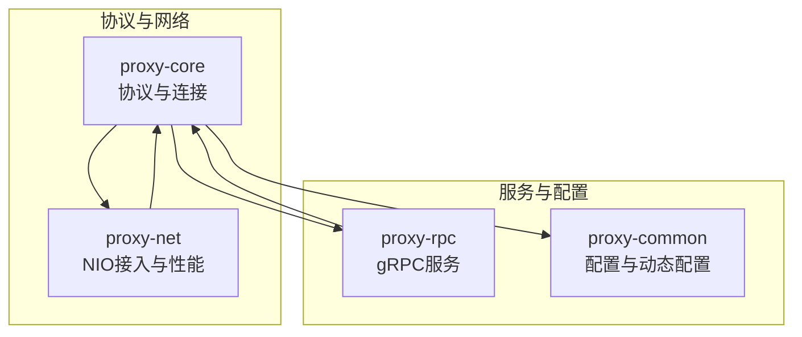
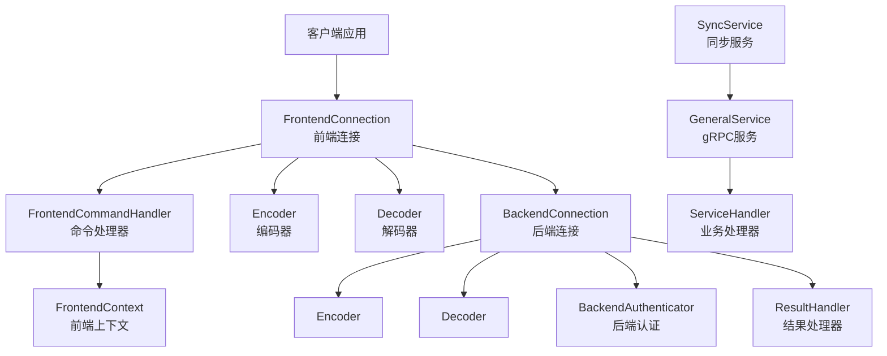
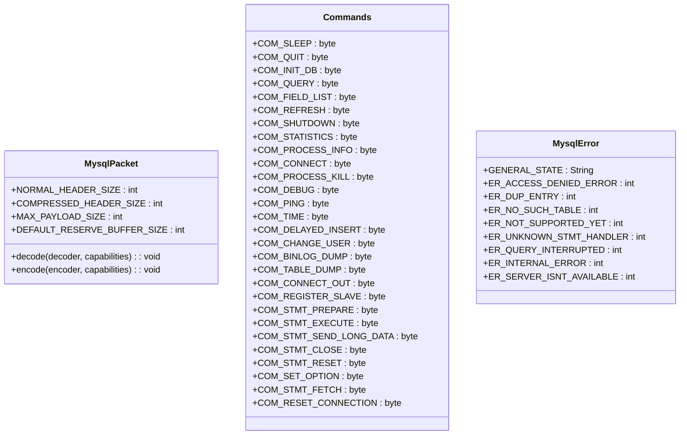
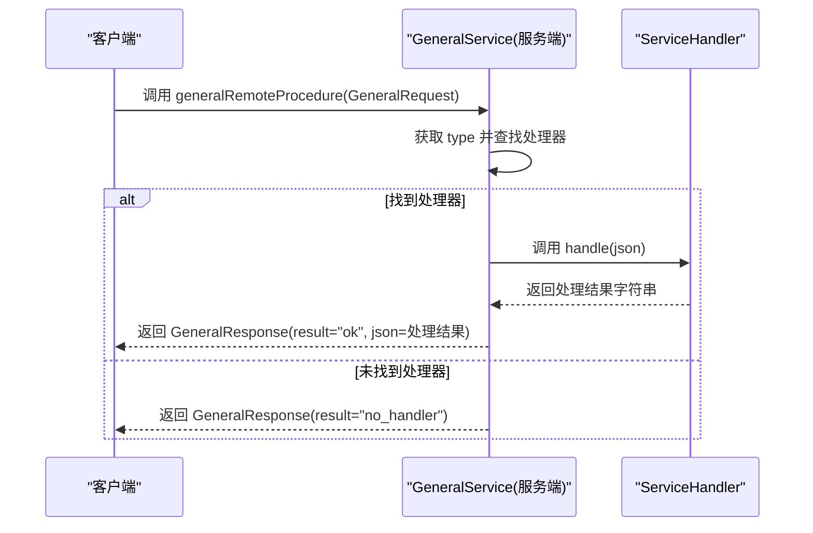
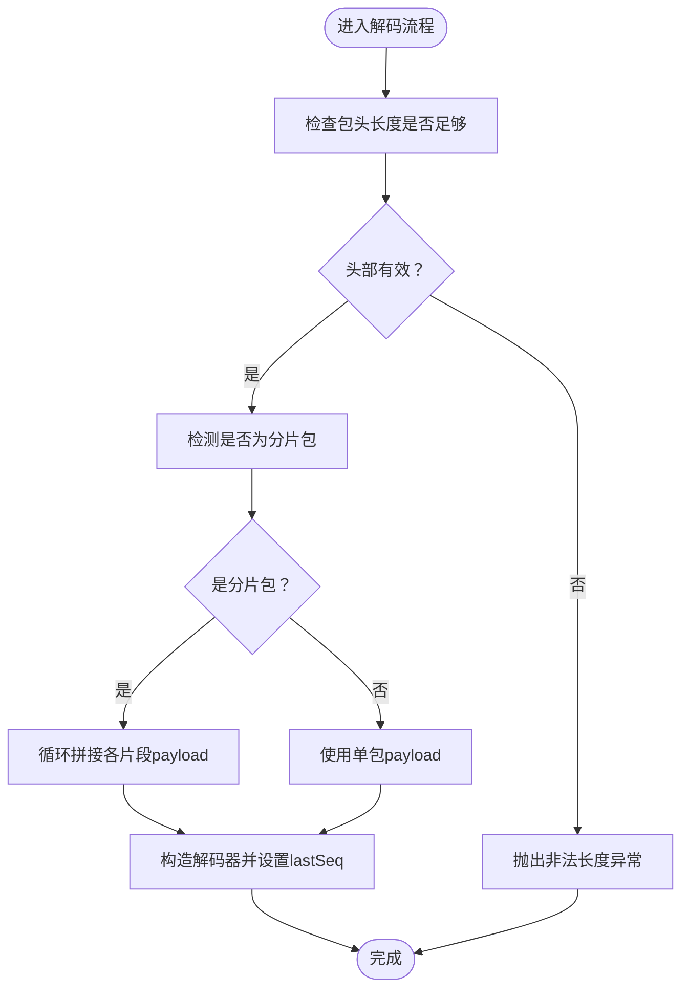
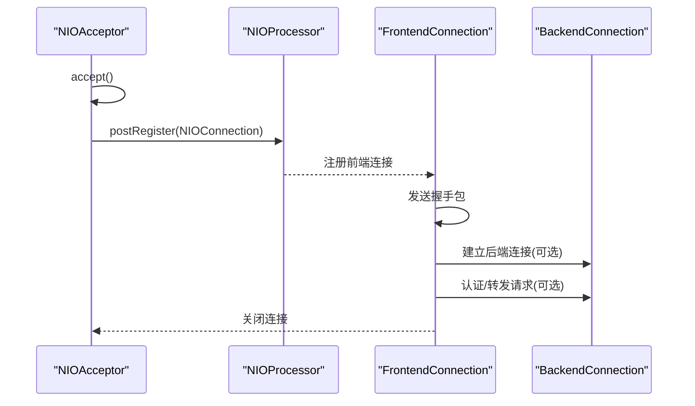
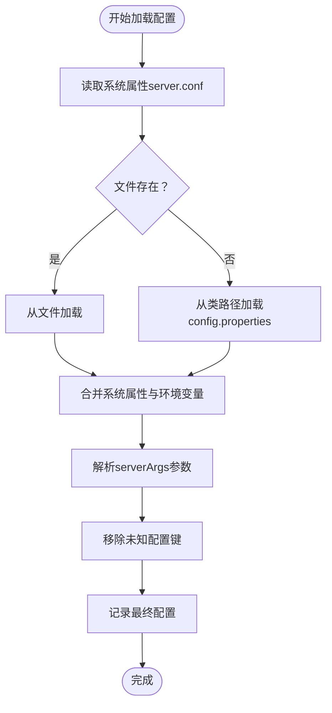
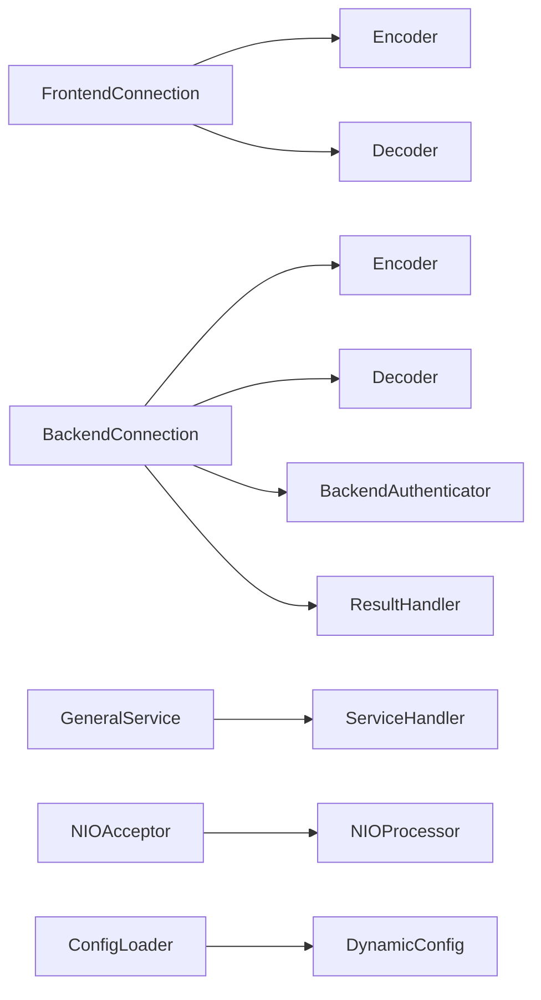

# API参考

<cite>
**本文引用的文件**
- [proxy-core/src/main/java/com/alibaba/polardbx/proxy/protocol/common/MysqlPacket.java](file://proxy-core/src/main/java/com/alibaba/polardbx/proxy/protocol/common/MysqlPacket.java)
- [proxy-core/src/main/java/com/alibaba/polardbx/proxy/protocol/command/Commands.java](file://proxy-core/src/main/java/com/alibaba/polardbx/proxy/protocol/command/Commands.java)
- [proxy-core/src/main/java/com/alibaba/polardbx/proxy/protocol/common/MysqlError.java](file://proxy-core/src/main/java/com/alibaba/polardbx/proxy/protocol/common/MysqlError.java)
- [proxy-rpc/src/main/proto/GeneralService.proto](file://proxy-rpc/src/main/proto/GeneralService.proto)
- [proxy-rpc/src/main/java/com/alibaba/polardbx/proxy/GeneralService.java](file://proxy-rpc/src/main/java/com/alibaba/polardbx/proxy/GeneralService.java)
- [proxy-core/src/main/java/com/alibaba/polardbx/proxy/protocol/encoder/Encoder.java](file://proxy-core/src/main/java/com/alibaba/polardbx/proxy/protocol/encoder/Encoder.java)
- [proxy-core/src/main/java/com/alibaba/polardbx/proxy/protocol/decoder/Decoder.java](file://proxy-core/src/main/java/com/alibaba/polardbx/proxy/protocol/decoder/Decoder.java)
- [proxy-core/src/main/java/com/alibaba/polardbx/proxy/connection/FrontendConnection.java](file://proxy-core/src/main/java/com/alibaba/polardbx/proxy/connection/FrontendConnection.java)
- [proxy-core/src/main/java/com/alibaba/polardbx/proxy/connection/BackendConnection.java](file://proxy-core/src/main/java/com/alibaba/polardbx/proxy/connection/BackendConnection.java)
- [proxy-common/src/main/java/com/alibaba/polardbx/proxy/config/ConfigLoader.java](file://proxy-common/src/main/java/com/alibaba/polardbx/proxy/config/ConfigLoader.java)
- [proxy-common/src/main/java/com/alibaba/polardbx/proxy/dynamic/DynamicConfig.java](file://proxy-common/src/main/java/com/alibaba/polardbx/proxy/dynamic/DynamicConfig.java)
- [proxy-net/src/main/java/com/alibaba/polardbx/proxy/net/NIOAcceptor.java](file://proxy-net/src/main/java/com/alibaba/polardbx/proxy/net/NIOAcceptor.java)
- [proxy-net/src/main/java/com/alibaba/polardbx/proxy/perf/ReactorPerfCollection.java](file://proxy-net/src/main/java/com/alibaba/polardbx/proxy/perf/ReactorPerfCollection.java)
- [proxy-core/src/main/java/com/alibaba/polardbx/proxy/sync/SyncService.java](file://proxy-core/src/main/java/com/alibaba/polardbx/proxy/sync/SyncService.java)
</cite>

## 目录
1. [简介](#简介)
2. [项目结构](#项目结构)
3. [核心组件](#核心组件)
4. [架构总览](#架构总览)
5. [详细组件分析](#详细组件分析)
6. [依赖关系分析](#依赖关系分析)
7. [性能考虑](#性能考虑)
8. [故障排查指南](#故障排查指南)
9. [结论](#结论)
10. [附录](#附录)

## 简介
本API参考面向PolarDB-X Proxy的开发者与运维人员，系统化梳理了以下能力与接口：
- MySQL协议相关：数据包格式、命令类型、错误码规范
- gRPC服务API：通用远程过程调用接口、请求/响应模型与使用方法
- 协议编解码器API：编码器与解码器的接口与使用示例
- 连接管理API：前端/后端连接的创建、配置、生命周期与销毁
- 配置管理API：配置加载、更新与监听机制
- 性能监控API：事件计数与统计项
- 同步与集群控制：跨节点同步与广播
- 版本兼容性与迁移指南：版本演进与迁移建议

## 项目结构
PolarDB-X Proxy采用多模块分层设计，核心模块包括：
- proxy-core：协议栈、连接管理、调度与处理逻辑
- proxy-rpc：gRPC服务与协议定义
- proxy-net：网络层（NIO）接入与性能统计
- proxy-common：公共工具、配置与动态配置
- proxy-parser：SQL解析（不在本次API参考范围内）

[无图表来源：该图为概念性结构示意]

## 核心组件
本节对与API直接相关的核心组件进行概览：
- MySQL协议接口与常量：MysqlPacket、Commands、MysqlError
- 编解码器：Encoder、Decoder
- gRPC服务：GeneralService（服务端与客户端）
- 连接管理：FrontendConnection、BackendConnection
- 配置与动态配置：ConfigLoader、DynamicConfig
- 性能监控：ReactorPerfCollection
- 同步与集群：SyncService

**章节来源**
- file://proxy-core/src/main/java/com/alibaba/polardbx/proxy/protocol/common/MysqlPacket.java#L26-L41
- file://proxy-core/src/main/java/com/alibaba/polardbx/proxy/protocol/command/Commands.java#L21-L117
- file://proxy-core/src/main/java/com/alibaba/polardbx/proxy/protocol/common/MysqlError.java#L21-L32
- file://proxy-rpc/src/main/proto/GeneralService.proto#L8-L20
- file://proxy-rpc/src/main/java/com/alibaba/polardbx/proxy/GeneralService.java#L31-L93
- file://proxy-core/src/main/java/com/alibaba/polardbx/proxy/protocol/encoder/Encoder.java#L34-L167
- file://proxy-core/src/main/java/com/alibaba/polardbx/proxy/protocol/decoder/Decoder.java#L29-L370
- file://proxy-core/src/main/java/com/alibaba/polardbx/proxy/connection/FrontendConnection.java#L47-L223
- file://proxy-core/src/main/java/com/alibaba/polardbx/proxy/connection/BackendConnection.java#L67-L812
- file://proxy-common/src/main/java/com/alibaba/polardbx/proxy/config/ConfigLoader.java#L30-L72
- file://proxy-common/src/main/java/com/alibaba/polardbx/proxy/dynamic/DynamicConfig.java#L41-L129
- file://proxy-net/src/main/java/com/alibaba/polardbx/proxy/perf/ReactorPerfCollection.java#L25-L33
- file://proxy-core/src/main/java/com/alibaba/polardbx/proxy/sync/SyncService.java#L34-L60

## 架构总览
下图展示了MySQL协议与gRPC服务在Proxy中的交互关系，以及连接管理与网络层的协作。

**图表来源**
- [FrontendConnection.java](file://proxy-core/src/main/java/com/alibaba/polardbx/proxy/connection/FrontendConnection.java#L47-L223)
- [BackendConnection.java](file://proxy-core/src/main/java/com/alibaba/polardbx/proxy/connection/BackendConnection.java#L67-L812)
- [GeneralService.java](file://proxy-rpc/src/main/java/com/alibaba/polardbx/proxy/GeneralService.java#L31-L93)

**章节来源**
- file://proxy-core/src/main/java/com/alibaba/polardbx/proxy/connection/FrontendConnection.java#L47-L223
- file://proxy-core/src/main/java/com/alibaba/polardbx/proxy/connection/BackendConnection.java#L67-L812
- file://proxy-rpc/src/main/java/com/alibaba/polardbx/proxy/GeneralService.java#L31-L93

## 详细组件分析

### MySQL协议API
- 数据包接口与头部规范
  - 接口：MysqlPacket
  - 常量：普通包头长度、压缩包头长度、最大负载大小、默认保留缓冲区大小
  - 方法：decode(Decoder, capabilities)、可选实现 encode(Encoder, capabilities)
- 命令类型枚举
  - Commands：定义了MySQL协议命令字常量，如QUIT、INIT_DB、QUERY、FIELD_LIST、STATISTICS、PING、CHANGE_USER、BINLOG_DUMP、TABLE_DUMP、CONNECT_OUT、REGISTER_SLAVE、预处理相关命令等；还包含轻量重连命令COM_RESET_CONNECTION
- 错误码规范
  - MysqlError：定义通用状态码与若干典型错误码，如访问被拒绝、重复键、表不存在、不支持、语句未找到、查询中断、内部错误、服务器不可用等

**图表来源**
- [MysqlPacket.java](file://proxy-core/src/main/java/com/alibaba/polardbx/proxy/protocol/common/MysqlPacket.java#L26-L41)
- [Commands.java](file://proxy-core/src/main/java/com/alibaba/polardbx/proxy/protocol/command/Commands.java#L21-L117)
- [MysqlError.java](file://proxy-core/src/main/java/com/alibaba/polardbx/proxy/protocol/common/MysqlError.java#L21-L32)

**章节来源**
- file://proxy-core/src/main/java/com/alibaba/polardbx/proxy/protocol/common/MysqlPacket.java#L26-L41
- file://proxy-core/src/main/java/com/alibaba/polardbx/proxy/protocol/command/Commands.java#L21-L117
- file://proxy-core/src/main/java/com/alibaba/polardbx/proxy/protocol/common/MysqlError.java#L21-L32

### gRPC服务API
- 协议定义
  - 服务：GeneralService
  - 请求：GeneralRequest（type: string, json: string）
  - 响应：GeneralResponse（result: string, json: string）
- 服务端实现
  - 继承自生成的GeneralServiceGrpc.GeneralServiceImplBase
  - 提供注册/注销处理器方法：registerHandler(name, handler)、unregisterHandler(name)
  - RPC方法：generalRemoteProcedure(request, responseObserver)
  - 服务启动：startServer(port)
- 客户端调用
  - invoke(host, port, type, json, timeoutMillis)：基于plaintext通道发起阻塞调用，设置超时，返回结果或空

**图表来源**
- [GeneralService.proto](file://proxy-rpc/src/main/proto/GeneralService.proto#L8-L20)
- [GeneralService.java](file://proxy-rpc/src/main/java/com/alibaba/polardbx/proxy/GeneralService.java#L31-L93)

**章节来源**
- file://proxy-rpc/src/main/proto/GeneralService.proto#L8-L20
- file://proxy-rpc/src/main/java/com/alibaba/polardbx/proxy/GeneralService.java#L31-L93

### 协议编解码器API
- 编码器 Encoder
  - 关键字段：seq（序列号）
  - 基本操作：begin/end、zeros、u8/u16/u24/u32/u48/u64、f/d、lei（长度编码）、str/le_str/nt_str、pkt、flush/close
  - 工具：lei_len、create(FastBufferPool, ExportConsumer)、BytesOutput导出器
- 解码器 Decoder
  - 关键字段：base、length、pos、lastSeq
  - 基本操作：peek/peek_s、u8/u8_s、u16/u16_s、u24/u24_s、u32/u32_s、u48/u48_s、i64/i64_s、f/f_s、d/d_s
  - 长度编码：lei/lei_s
  - 字符串：str/str_s、le_str/le_str_s、指定长度读取
  - 包解码：decodeNormalPacket(Slice)：支持多种内存布局（堆/直接内存/ByteBuffer），自动识别分片包并重组payload

**图表来源**
- [Decoder.java](file://proxy-core/src/main/java/com/alibaba/polardbx/proxy/protocol/decoder/Decoder.java#L326-L369)

**章节来源**
- file://proxy-core/src/main/java/com/alibaba/polardbx/proxy/protocol/encoder/Encoder.java#L34-L167
- file://proxy-core/src/main/java/com/alibaba/polardbx/proxy/protocol/decoder/Decoder.java#L29-L370

### 连接管理API
- 前端连接 FrontendConnection
  - 生命周期：构造、握手发送、认证与命令处理、完成收尾、致命错误处理、关闭与资源释放
  - 上下文：FrontendContext，能力位、字符集、状态机
  - 全局集合：CONNECTIONS
- 后端连接 BackendConnection
  - 生命周期：构造、认证、结果处理器队列、转发与写入、完成收尾、致命错误处理、关闭与资源释放
  - 登录等待：FutureTask登录状态，waitLogin(timeout, unit)
  - 查询与预处理：sendQuery、sendPrepare、resetPreparedStatement、closePreparedStatement
  - 初始化数据库：initDB
  - 连接建立：connectBlocking/connectNonBlocking
  - 可用性判断：isGood、hasPendingUserRequests
- 连接工厂与注册
  - NIOAcceptor：接受新连接，绑定端口，注册到Selector，交由NIOProcessor处理

**图表来源**
- [NIOAcceptor.java](file://proxy-net/src/main/java/com/alibaba/polardbx/proxy/net/NIOAcceptor.java#L61-L81)
- [FrontendConnection.java](file://proxy-core/src/main/java/com/alibaba/polardbx/proxy/connection/FrontendConnection.java#L61-L111)
- [BackendConnection.java](file://proxy-core/src/main/java/com/alibaba/polardbx/proxy/connection/BackendConnection.java#L712-L775)

**章节来源**
- file://proxy-core/src/main/java/com/alibaba/polardbx/proxy/connection/FrontendConnection.java#L47-L223
- file://proxy-core/src/main/java/com/alibaba/polardbx/proxy/connection/BackendConnection.java#L67-L812
- file://proxy-net/src/main/java/com/alibaba/polardbx/proxy/net/NIOAcceptor.java#L35-L147

### 配置管理API
- 静态配置加载 ConfigLoader
  - 默认属性：从ConfigProps继承
  - 加载顺序：系统属性server.conf文件 → 类路径config.properties → 系统属性与环境变量 → serverArgs参数
  - 清洗：移除未知配置键
  - 输出：日志打印最终配置
- 动态配置 DynamicConfig
  - 文件位置：通过ConfigLoader.PROPERTIES中动态配置文件路径读取
  - 读取：reload()从JSON文件反序列化，失败时尝试从.bak恢复，否则返回空配置
  - 写入：save()先备份原文件，再写入新JSON
  - 访问：getNowConfig()惰性加载当前配置

**图表来源**
- [ConfigLoader.java](file://proxy-common/src/main/java/com/alibaba/polardbx/proxy/config/ConfigLoader.java#L39-L71)
- [DynamicConfig.java](file://proxy-common/src/main/java/com/alibaba/polardbx/proxy/dynamic/DynamicConfig.java#L69-L103)

**章节来源**
- file://proxy-common/src/main/java/com/alibaba/polardbx/proxy/config/ConfigLoader.java#L30-L72
- file://proxy-common/src/main/java/com/alibaba/polardbx/proxy/dynamic/DynamicConfig.java#L41-L129

### 性能监控API
- ReactorPerfCollection
  - 指标：socketCount、eventLoopCount、registerCount、readCount、writeCount、connectCount
  - 用途：统计NIO事件循环与连接事件的计数，便于性能观测与告警

**章节来源**
- file://proxy-net/src/main/java/com/alibaba/polardbx/proxy/perf/ReactorPerfCollection.java#L25-L33

### 同步与集群控制API
- SyncService
  - kill(processId, connection)：向所有节点广播KillMessage，异步执行
  - init()：注册“kill”类型处理器
  - 依赖：GeneralService.invoke、NodeWatchdog节点列表、Gson序列化

**章节来源**
- file://proxy-core/src/main/java/com/alibaba/polardbx/proxy/sync/SyncService.java#L34-L60

## 依赖关系分析
- 协议层依赖
  - FrontendConnection/BackendConnection依赖Encoder/Decoder进行编解码
  - FrontendConnection依赖FrontendContext与FrontendCommandHandler
  - BackendConnection依赖BackendContext、BackendAuthenticator与ResultHandler
- gRPC服务依赖
  - GeneralService依赖ServiceHandler映射表，支持按type路由
- 网络层依赖
  - NIOAcceptor负责接受连接并注册到NIOProcessor
- 配置与动态配置
  - ConfigLoader提供全局Properties，DynamicConfig基于其读取动态配置文件

**图表来源**
- [FrontendConnection.java](file://proxy-core/src/main/java/com/alibaba/polardbx/proxy/connection/FrontendConnection.java#L47-L223)
- [BackendConnection.java](file://proxy-core/src/main/java/com/alibaba/polardbx/proxy/connection/BackendConnection.java#L67-L812)
- [GeneralService.java](file://proxy-rpc/src/main/java/com/alibaba/polardbx/proxy/GeneralService.java#L31-L93)
- [NIOAcceptor.java](file://proxy-net/src/main/java/com/alibaba/polardbx/proxy/net/NIOAcceptor.java#L35-L147)
- [ConfigLoader.java](file://proxy-common/src/main/java/com/alibaba/polardbx/proxy/config/ConfigLoader.java#L30-L72)
- [DynamicConfig.java](file://proxy-common/src/main/java/com/alibaba/polardbx/proxy/dynamic/DynamicConfig.java#L41-L129)

**章节来源**
- file://proxy-core/src/main/java/com/alibaba/polardbx/proxy/connection/FrontendConnection.java#L47-L223
- file://proxy-core/src/main/java/com/alibaba/polardbx/proxy/connection/BackendConnection.java#L67-L812
- file://proxy-rpc/src/main/java/com/alibaba/polardbx/proxy/GeneralService.java#L31-L93
- file://proxy-net/src/main/java/com/alibaba/polardbx/proxy/net/NIOAcceptor.java#L35-L147
- file://proxy-common/src/main/java/com/alibaba/polardbx/proxy/config/ConfigLoader.java#L30-L72
- file://proxy-common/src/main/java/com/alibaba/polardbx/proxy/dynamic/DynamicConfig.java#L41-L129

## 性能考虑
- 编解码器
  - 使用FastBufferPool与ExportConsumer减少GC与拷贝
  - Decoder支持直接内存与堆内存两种模式，自动选择最优路径
- 连接管理
  - 前端/后端连接均采用异步资源释放，避免阻塞主事件循环
  - BackendConnection在认证完成前将请求入队，完成后批量发送，降低开销
- 监控
  - ReactorPerfCollection提供原子计数指标，便于低开销统计

[本节为通用指导，无需列出具体文件来源]

## 故障排查指南
- 编解码异常
  - Decoder在长度不足或非法长度指示时抛出异常，检查输入Slice与包头完整性
- 连接异常
  - FrontendConnection/BackendConnection在致命错误时会主动关闭，检查日志与资源释放流程
  - BackendConnection在发送前校验状态，若未认证或已关闭则抛出异常
- 配置问题
  - ConfigLoader加载失败时会记录日志，确认server.conf路径、权限与格式
  - DynamicConfig读取失败会尝试.bak恢复，必要时清理损坏文件
- gRPC调用
  - invoke超时或无处理器时返回特定result，检查服务端注册与网络连通性

**章节来源**
- file://proxy-core/src/main/java/com/alibaba/polardbx/proxy/protocol/decoder/Decoder.java#L118-L142
- file://proxy-core/src/main/java/com/alibaba/polardbx/proxy/connection/FrontendConnection.java#L163-L166
- file://proxy-core/src/main/java/com/alibaba/polardbx/proxy/connection/BackendConnection.java#L124-L200
- file://proxy-common/src/main/java/com/alibaba/polardbx/proxy/config/ConfigLoader.java#L39-L71
- file://proxy-common/src/main/java/com/alibaba/polardbx/proxy/dynamic/DynamicConfig.java#L69-L103
- file://proxy-rpc/src/main/java/com/alibaba/polardbx/proxy/GeneralService.java#L74-L92

## 结论
本文档系统梳理了PolarDB-X Proxy的MySQL协议、gRPC服务、编解码器、连接管理、配置与性能监控等核心API，并提供了架构视图与故障排查要点。建议在集成时遵循：
- 明确协议命令与错误码约定
- 正确使用Encoder/Decoder进行高效编解码
- 通过Frontend/BackendConnection管理连接生命周期
- 利用ConfigLoader与DynamicConfig实现配置治理
- 通过ReactorPerfCollection进行性能观测
- 使用SyncService进行跨节点同步控制

[本节为总结性内容，无需列出具体文件来源]

## 附录

### API使用示例与场景说明
- MySQL命令类型使用
  - 场景：客户端执行查询/初始化数据库/预处理语句
  - 参考：Commands常量用于识别命令字
- 编解码器使用
  - 场景：构建查询包、预处理包、发送至后端连接
  - 参考：Encoder.begin/end、u8/u24/u32、str/le_str、flush
- gRPC调用
  - 场景：跨节点广播kill指令
  - 参考：GeneralService.invoke、SyncService.kill
- 连接创建与销毁
  - 场景：前端连接握手、后端连接认证与查询
  - 参考：FrontendConnection构造与onEstablished、BackendConnection.connectBlocking/waitLogin
- 配置读取与更新
  - 场景：启动时加载静态配置、运行时热加载动态配置
  - 参考：ConfigLoader.loadConfig、DynamicConfig.reload/save
- 性能指标获取
  - 场景：采集NIO事件与连接计数
  - 参考：ReactorPerfCollection原子计数

**章节来源**
- file://proxy-core/src/main/java/com/alibaba/polardbx/proxy/protocol/command/Commands.java#L21-L117
- file://proxy-core/src/main/java/com/alibaba/polardbx/proxy/protocol/encoder/Encoder.java#L34-L167
- file://proxy-rpc/src/main/java/com/alibaba/polardbx/proxy/GeneralService.java#L74-L92
- file://proxy-core/src/main/java/com/alibaba/polardbx/proxy/connection/FrontendConnection.java#L61-L111
- file://proxy-core/src/main/java/com/alibaba/polardbx/proxy/connection/BackendConnection.java#L712-L775
- file://proxy-common/src/main/java/com/alibaba/polardbx/proxy/config/ConfigLoader.java#L39-L71
- file://proxy-common/src/main/java/com/alibaba/polardbx/proxy/dynamic/DynamicConfig.java#L69-L103
- file://proxy-net/src/main/java/com/alibaba/polardbx/proxy/perf/ReactorPerfCollection.java#L25-L33

### 版本兼容性与迁移指南
- 协议兼容
  - Commands新增命令需确保后端兼容性；COM_RESET_CONNECTION用于轻量重连，避免完整重新认证
- 编解码器演进
  - Encoder/Decoder支持多种内存布局，升级时保持接口稳定，避免破坏现有实现
- gRPC服务
  - 服务名与消息结构保持稳定；新增type需配套注册ServiceHandler
- 连接管理
  - Frontend/BackendConnection状态机与资源释放策略保持一致，避免协议破坏
- 配置管理
  - ConfigLoader与DynamicConfig的键空间变更需谨慎，避免未知键被清洗

[本节为通用指导，无需列出具体文件来源]