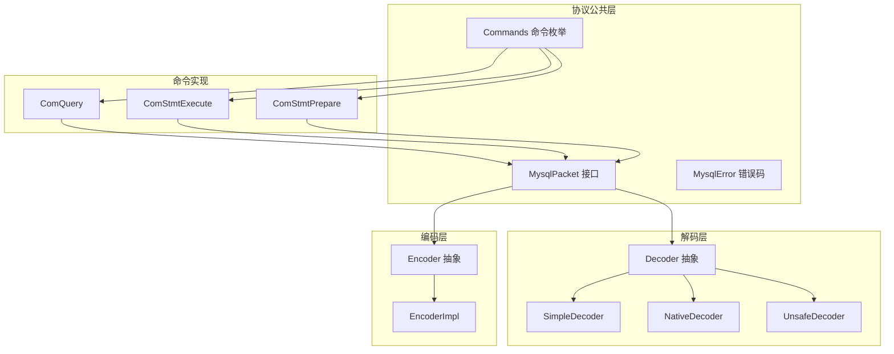
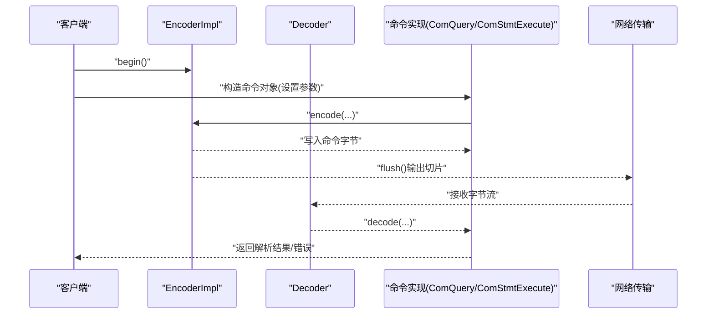
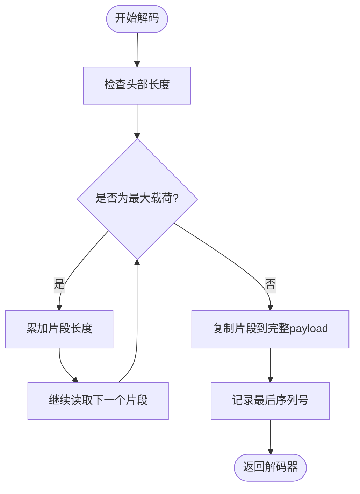
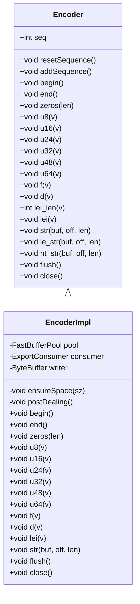
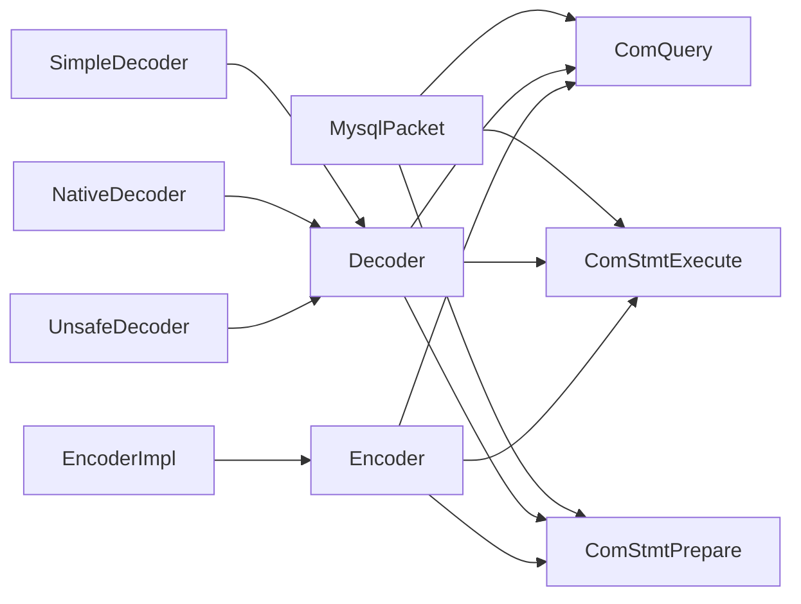

# MySQL协议API

<cite>
**本文引用的文件**
- [MysqlPacket.java](file://proxy-core/src/main/java/com/alibaba/polardbx/proxy/protocol/common/MysqlPacket.java)
- [MysqlError.java](file://proxy-core/src/main/java/com/alibaba/polardbx/proxy/protocol/common/MysqlError.java)
- [Commands.java](file://proxy-core/src/main/java/com/alibaba/polardbx/proxy/protocol/command/Commands.java)
- [Decoder.java](file://proxy-core/src/main/java/com/alibaba/polardbx/proxy/protocol/decoder/Decoder.java)
- [SimpleDecoder.java](file://proxy-core/src/main/java/com/alibaba/polardbx/proxy/protocol/decoder/SimpleDecoder.java)
- [NativeDecoder.java](file://proxy-core/src/main/java/com/alibaba/polardbx/proxy/protocol/decoder/NativeDecoder.java)
- [UnsafeDecoder.java](file://proxy-core/src/main/java/com/alibaba/polardbx/proxy/protocol/decoder/UnsafeDecoder.java)
- [Encoder.java](file://proxy-core/src/main/java/com/alibaba/polardbx/proxy/protocol/encoder/Encoder.java)
- [EncoderImpl.java](file://proxy-core/src/main/java/com/alibaba/polardbx/proxy/protocol/encoder/EncoderImpl.java)
- [ComQuery.java](file://proxy-core/src/main/java/com/alibaba/polardbx/proxy/protocol/command/ComQuery.java)
- [ComStmtExecute.java](file://proxy-core/src/main/java/com/alibaba/polardbx/proxy/protocol/prepare/ComStmtExecute.java)
- [ComStmtPrepare.java](file://proxy-core/src/main/java/com/alibaba/polardbx/proxy/protocol/prepare/ComStmtPrepare.java)
</cite>

## 更新摘要
**变更内容**
- 修复了EncoderImpl类中u24()和u48()方法的writer使用问题，确保正确的字节写入顺序
- 改进了解码器实现中的packet header offset处理，提升协议解析的准确性
- 增强了MySQL协议通信的可靠性和正确性

## 目录
1. [简介](#简介)
2. [项目结构](#项目结构)
3. [核心组件](#核心组件)
4. [架构总览](#架构总览)
5. [详细组件分析](#详细组件分析)
6. [依赖关系分析](#依赖关系分析)
7. [性能考量](#性能考量)
8. [故障排查指南](#故障排查指南)
9. [结论](#结论)
10. [附录：完整使用示例与最佳实践](#附录完整使用示例与最佳实践)

## 简介
本文件为MySQL协议相关API的权威参考，覆盖以下主题：
- 协议数据包格式规范：头长度常量、最大载荷、序列号、压缩包头等
- 命令类型：Commands枚举中的常用命令（如COM_QUERY、COM_STMT_EXECUTE、COM_STMT_PREPARE）及其参数与返回格式要点
- 错误码体系：标准MySQL错误码的分类与异常处理建议
- 编解码器API：Decoder与Encoder的接口与实现，包含字节序、长度编码、分片写入等细节
- 协议头部格式与数据包结构：正常包头与压缩包头、多包合并、序列号管理
- 实战示例：如何正确使用这些API进行MySQL协议通信

## 项目结构
本项目的MySQL协议相关代码主要位于proxy-core模块的protocol目录下，按职责划分为common（通用）、command（命令）、prepare（预处理）、decoder（解码）、encoder（编码）等子包。

**图表来源**
- [MysqlPacket.java](file://proxy-core/src/main/java/com/alibaba/polardbx/proxy/protocol/common/MysqlPacket.java#L26-L41)
- [Commands.java](file://proxy-core/src/main/java/com/alibaba/polardbx/proxy/protocol/command/Commands.java#L21-L117)
- [Decoder.java](file://proxy-core/src/main/java/com/alibaba/polardbx/proxy/protocol/decoder/Decoder.java#L29-L371)
- [Encoder.java](file://proxy-core/src/main/java/com/alibaba/polardbx/proxy/protocol/encoder/Encoder.java#L32-L168)
- [ComQuery.java](file://proxy-core/src/main/java/com/alibaba/polardbx/proxy/protocol/command/ComQuery.java#L35-L161)
- [ComStmtExecute.java](file://proxy-core/src/main/java/com/alibaba/polardbx/proxy/protocol/prepare/ComStmtExecute.java#L41-L224)
- [ComStmtPrepare.java](file://proxy-core/src/main/java/com/alibaba/polardbx/proxy/protocol/prepare/ComStmtPrepare.java#L28-L55)

## 核心组件
- MysqlPacket接口：定义了所有MySQL协议数据包的统一行为，包括头长度常量、最大载荷、默认保留缓冲区大小，以及decode/encode抽象方法。
- Commands枚举：定义了MySQL客户端-服务端通信中的命令类型，如QUIT、INIT_DB、QUERY、FIELD_LIST、STATISTICS、PING、CHANGE_USER、BINLOG_DUMP、TABLE_DUMP、CONNECT_OUT、REGISTER_SLAVE、STMT_PREPARE、STMT_EXECUTE、STMT_SEND_LONG_DATA、STMT_CLOSE、STMT_RESET、SET_OPTION、STMT_FETCH、RESET_CONNECTION等。
- MysqlError类：提供一组常用的MySQL错误码常量及通用状态码，便于在异常处理时快速定位问题类别。
- Decoder抽象与实现：提供从不同来源（堆内存、直接内存、NIO ByteBuffer）读取字节流的能力，支持无符号整数、浮点数、可变长度字符串、长度前缀字符串等。
- Encoder抽象与实现：负责构建MySQL数据包，支持begin/end标记、序列号管理、自动分片写入（超过最大载荷时自动拆包）、长度编码等。
- 命令实现：ComQuery、ComStmtExecute、ComStmtPrepare等具体命令对象，封装了各自命令的参数、解析与序列化逻辑。

**章节来源**
- [MysqlPacket.java](file://proxy-core/src/main/java/com/alibaba/polardbx/proxy/protocol/common/MysqlPacket.java#L26-L41)
- [MysqlError.java](file://proxy-core/src/main/java/com/alibaba/polardbx/proxy/protocol/common/MysqlError.java#L21-L32)
- [Commands.java](file://proxy-core/src/main/java/com/alibaba/polardbx/proxy/protocol/command/Commands.java#L21-L117)
- [Decoder.java](file://proxy-core/src/main/java/com/alibaba/polardbx/proxy/protocol/decoder/Decoder.java#L29-L371)
- [Encoder.java](file://proxy-core/src/main/java/com/alibaba/polardbx/proxy/protocol/encoder/Encoder.java#L32-L168)
- [ComQuery.java](file://proxy-core/src/main/java/com/alibaba/polardbx/proxy/protocol/command/ComQuery.java#L35-L161)
- [ComStmtExecute.java](file://proxy-core/src/main/java/com/alibaba/polardbx/proxy/protocol/prepare/ComStmtExecute.java#L41-L224)
- [ComStmtPrepare.java](file://proxy-core/src/main/java/com/alibaba/polardbx/proxy/protocol/prepare/ComStmtPrepare.java#L28-L55)

## 架构总览
MySQL协议在本项目中采用"接口+多种实现"的设计：
- MysqlPacket作为协议数据包的契约，Decoder与Encoder分别承担"读"和"写"的职责
- 命令实现类（如ComQuery、ComStmtExecute、ComStmtPrepare）通过调用Decoder/Encoder完成协议交互
- 解码器提供多种实现以适配不同内存布局与性能需求；编码器实现负责将应用层数据打包为符合MySQL协议的字节流，并在必要时进行分包

**图表来源**
- [EncoderImpl.java](file://proxy-core/src/main/java/com/alibaba/polardbx/proxy/protocol/encoder/EncoderImpl.java#L102-L132)
- [ComQuery.java](file://proxy-core/src/main/java/com/alibaba/polardbx/proxy/protocol/command/ComQuery.java#L108-L147)
- [ComStmtExecute.java](file://proxy-core/src/main/java/com/alibaba/polardbx/proxy/protocol/prepare/ComStmtExecute.java#L157-L191)
- [Decoder.java](file://proxy-core/src/main/java/com/alibaba/polardbx/proxy/protocol/decoder/Decoder.java#L326-L369)

## 详细组件分析

### MysqlPacket接口与常量
- 头部尺寸常量
  - NORMAL_HEADER_SIZE：普通MySQL数据包的固定头部长度（字节数）
  - COMPRESSED_HEADER_SIZE：启用压缩时的头部长度（字节数）
- 最大载荷与默认保留缓冲
  - MAX_PAYLOAD_SIZE：单个包的最大载荷大小
  - DEFAULT_RESERVE_BUFFER_SIZE：默认保留缓冲区大小，用于避免频繁扩容
- 方法
  - decode(Decoder, int)：从解码器读取并解析协议内容
  - encode(Encoder, int)：通过编码器生成协议字节流，默认抛出不支持异常，由具体命令实现覆盖

使用场景
- 在解码阶段，根据是否为压缩包选择不同的头部解析策略
- 在编码阶段，使用Encoder.begin()/end()包裹命令体，确保头部字段被正确填充

**章节来源**
- [MysqlPacket.java](file://proxy-core/src/main/java/com/alibaba/polardbx/proxy/protocol/common/MysqlPacket.java#L31-L40)

### Commands枚举：命令类型与语义
- 关键命令
  - COM_QUIT：关闭连接
  - COM_INIT_DB：切换数据库
  - COM_QUERY：执行SQL查询（支持参数化属性）
  - COM_FIELD_LIST：列出字段信息
  - COM_STATISTICS：获取服务器统计信息
  - COM_PING：心跳检测
  - COM_CHANGE_USER：切换用户
  - COM_BINLOG_DUMP：从二进制日志拉取事件
  - COM_TABLE_DUMP：传输表快照
  - COM_CONNECT_OUT：从外部连接发起
  - COM_REGISTER_SLAVE：从库注册到主库
  - COM_STMT_PREPARE：准备SQL语句
  - COM_STMT_EXECUTE：执行已准备的语句
  - COM_STMT_SEND_LONG_DATA：发送长参数数据
  - COM_STMT_CLOSE：关闭已准备的语句
  - COM_STMT_RESET：重置语句上下文
  - COM_SET_OPTION：设置服务器选项
  - COM_STMT_FETCH：从游标提取数据
  - COM_RESET_CONNECTION：轻量级重置会话（不重新认证）
- 参数与返回要点（基于命令实现类）
  - COM_QUERY：支持可选的参数计数、参数集计数、NULL位图、新参数绑定标志、参数名称与类型、参数值；返回文本形式的SQL
  - COM_STMT_EXECUTE：包含语句ID、标志、迭代次数、可选参数计数、NULL位图、新参数绑定标志、参数名称与类型、参数值；返回结果集或受影响行数
  - COM_STMT_PREPARE：仅包含待准备的SQL文本

**章节来源**
- [Commands.java](file://proxy-core/src/main/java/com/alibaba/polardbx/proxy/protocol/command/Commands.java#L21-L117)
- [ComQuery.java](file://proxy-core/src/main/java/com/alibaba/polardbx/proxy/protocol/command/ComQuery.java#L36-L106)
- [ComStmtExecute.java](file://proxy-core/src/main/java/com/alibaba/polardbx/proxy/protocol/prepare/ComStmtExecute.java#L42-L155)
- [ComStmtPrepare.java](file://proxy-core/src/main/java/com/alibaba/polardbx/proxy/protocol/prepare/ComStmtPrepare.java#L29-L47)

### MysqlError错误码体系
- 通用状态码
  - GENERAL_STATE：通用错误状态码
- 常见错误码
  - ER_ACCESS_DENIED_ERROR：访问被拒绝
  - ER_DUP_ENTRY：重复键冲突
  - ER_NO_SUCH_TABLE：表不存在
  - ER_NOT_SUPPORTED_YET：功能尚未支持
  - ER_UNKNOWN_STMT_HANDLER：未知语句处理器
  - ER_QUERY_INTERRUPTED：查询被中断
  - ER_INTERNAL_ERROR：内部错误
  - ER_SERVER_ISNT_AVAILABLE：服务器不可用
- 使用建议
  - 在异常分支中优先匹配具体错误码，再回退到GENERAL_STATE
  - 将错误码与业务语义结合，区分可重试与不可重试错误

**章节来源**
- [MysqlError.java](file://proxy-core/src/main/java/com/alibaba/polardbx/proxy/protocol/common/MysqlError.java#L21-L32)

### Decoder编解码器API
- 抽象能力
  - 基础读取：u8/u16/u24/u32/u48/i64/f/d等
  - 长度前缀字符串：lei/le_str，支持可变长度指示器
  - 安全读取：带剩余校验的_s版本
  - 跳过与窥视：skip/skip_s/peek/peek_s
  - 位置与序列号：pos/lastSeq
- 多种实现
  - SimpleDecoder：基于NIO ByteBuffer，小端序
  - NativeDecoder：基于直接地址访问，断言检查
  - UnsafeDecoder：基于Unsafe的数组偏移访问，断言检查
- 正常包解码流程
  - 判断是否为最大载荷（0xFFFFFF），若是则循环拼接多个片段
  - 提取最后一个包的序列号，用于顺序校验
  - 返回一个指向完整payload的解码器

**图表来源**
- [Decoder.java](file://proxy-core/src/main/java/com/alibaba/polardbx/proxy/protocol/decoder/Decoder.java#L178-L224)
- [Decoder.java](file://proxy-core/src/main/java/com/alibaba/polardbx/proxy/protocol/decoder/Decoder.java#L226-L278)
- [Decoder.java](file://proxy-core/src/main/java/com/alibaba/polardbx/proxy/protocol/decoder/Decoder.java#L280-L324)
- [Decoder.java](file://proxy-core/src/main/java/com/alibaba/polardbx/proxy/protocol/decoder/Decoder.java#L326-L369)

**章节来源**
- [Decoder.java](file://proxy-core/src/main/java/com/alibaba/polardbx/proxy/protocol/decoder/Decoder.java#L29-L371)
- [SimpleDecoder.java](file://proxy-core/src/main/java/com/alibaba/polardbx/proxy/protocol/decoder/SimpleDecoder.java#L24-L275)
- [NativeDecoder.java](file://proxy-core/src/main/java/com/alibaba/polardbx/proxy/protocol/decoder/NativeDecoder.java#L23-L279)
- [UnsafeDecoder.java](file://proxy-core/src/main/java/com/alibaba/polardbx/proxy/protocol/decoder/UnsafeDecoder.java#L23-L287)

### Encoder编解码器API
- 抽象能力
  - 开始/结束：begin()/end()包裹包体
  - 序列号：resetSequence()/addSequence()管理包序列
  - 基础写入：zeros/u8/u16/u24/u32/u48/u64/f/d
  - 长度编码：lei_len/lei
  - 字符串写入：str/le_str/nt_str
  - 导出与刷新：flush/close
- 实现细节
  - EncoderImpl：基于FastBufferPool的直接内存池，自动分片写入
  - 自动分包：当写入累计字节数达到MAX_PAYLOAD_SIZE时，自动结束当前包并开启下一包
  - 写入策略：ensureSpace按需分配，postDealing在超过阈值时触发flush

**更新** 修复了u24()和u48()方法中的writer使用问题，确保正确的字节写入顺序

**图表来源**
- [Encoder.java](file://proxy-core/src/main/java/com/alibaba/polardbx/proxy/protocol/encoder/Encoder.java#L32-L168)
- [EncoderImpl.java](file://proxy-core/src/main/java/com/alibaba/polardbx/proxy/protocol/encoder/EncoderImpl.java#L31-L302)

**章节来源**
- [Encoder.java](file://proxy-core/src/main/java/com/alibaba/polardbx/proxy/protocol/encoder/Encoder.java#L32-L168)
- [EncoderImpl.java](file://proxy-core/src/main/java/com/alibaba/polardbx/proxy/protocol/encoder/EncoderImpl.java#L31-L302)

### 协议头部格式与数据包结构
- 普通包头
  - 长度：3字节（最大0xFFFFFF），表示后续载荷长度
  - 序列号：1字节（递增，用于多包重组）
- 压缩包头
  - 长度：3字节
  - 序列号：1字节
  - 客户端ID：1字节（用于多客户端复用）
- 字节序
  - 所有数值均以小端序（Little Endian）传输
  - 解码器在构造时显式设置ByteBuffer的字节序
- 分片与重组
  - 当载荷等于MAX_PAYLOAD_SIZE时，表示该包为中间片段，需要继续读取下一个包
  - Decoder在解码时会将多个片段拼接为完整payload，并记录最后序列号

**章节来源**
- [MysqlPacket.java](file://proxy-core/src/main/java/com/alibaba/polardbx/proxy/protocol/common/MysqlPacket.java#L31-L34)
- [Decoder.java](file://proxy-core/src/main/java/com/alibaba/polardbx/proxy/protocol/decoder/Decoder.java#L326-L369)
- [SimpleDecoder.java](file://proxy-core/src/main/java/com/alibaba/polardbx/proxy/protocol/decoder/SimpleDecoder.java#L27-L30)

### 命令实现：ComQuery
- 结构要点
  - 可选参数属性：parameterCount、parameterSetCount、nullBitmap、parameters
  - 查询文本：query（以空终止字符串）
- 解析流程
  - 读取命令字节（必须为0x03）
  - 若客户端支持查询属性，则解析参数元数据与值
  - 读取查询文本
- 序列化流程
  - begin()写入头部
  - 写入命令字节与参数属性（若启用）
  - 写入查询文本
  - end()补全头部字段并触发flush

**章节来源**
- [ComQuery.java](file://proxy-core/src/main/java/com/alibaba/polardbx/proxy/protocol/command/ComQuery.java#L36-L106)
- [ComQuery.java](file://proxy-core/src/main/java/com/alibaba/polardbx/proxy/protocol/command/ComQuery.java#L108-L147)

### 命令实现：ComStmtExecute
- 结构要点
  - statementId：已准备语句的标识
  - flags：游标类型等标志位
  - iterationCount：执行次数（当前固定为1）
  - 可选参数属性：parameterCount、nullBitmap、newParamsBindFlag、parameters
- 解析流程
  - 读取命令字节（必须为0x17）
  - 读取statementId、flags、iterationCount
  - 根据能力位与标志位决定是否解析参数元数据与值
- 序列化流程
  - begin()写入头部
  - 写入命令字节、statementId、flags、iterationCount
  - 写入参数属性（若存在）
  - end()

**章节来源**
- [ComStmtExecute.java](file://proxy-core/src/main/java/com/alibaba/polardbx/proxy/protocol/prepare/ComStmtExecute.java#L42-L155)
- [ComStmtExecute.java](file://proxy-core/src/main/java/com/alibaba/polardbx/proxy/protocol/prepare/ComStmtExecute.java#L157-L191)

### 命令实现：ComStmtPrepare
- 结构要点
  - query：待准备的SQL文本
- 解析与序列化
  - 解析：读取命令字节（必须为0x16），读取查询文本
  - 序列化：begin()写入头部，写入命令字节与查询文本，end()

**章节来源**
- [ComStmtPrepare.java](file://proxy-core/src/main/java/com/alibaba/polardbx/proxy/protocol/prepare/ComStmtPrepare.java#L29-L47)

## 依赖关系分析
- 组件耦合
  - MysqlPacket接口被所有命令实现依赖
  - Decoder与Encoder分别被命令实现依赖，形成"读/写"双通道
  - EncoderImpl依赖FastBufferPool与导出消费者，负责输出切片
- 外部依赖
  - NIO ByteBuffer用于简单解码器
  - UnsafeBytes用于原生解码器与大型数据拷贝
- 循环依赖
  - 未发现循环依赖；命令实现之间通过上下文函数回调间接协作

**图表来源**
- [MysqlPacket.java](file://proxy-core/src/main/java/com/alibaba/polardbx/proxy/protocol/common/MysqlPacket.java#L26-L41)
- [ComQuery.java](file://proxy-core/src/main/java/com/alibaba/polardbx/proxy/protocol/command/ComQuery.java#L35-L161)
- [ComStmtExecute.java](file://proxy-core/src/main/java/com/alibaba/polardbx/proxy/protocol/prepare/ComStmtExecute.java#L41-L224)
- [ComStmtPrepare.java](file://proxy-core/src/main/java/com/alibaba/polardbx/proxy/protocol/prepare/ComStmtPrepare.java#L28-L55)
- [Decoder.java](file://proxy-core/src/main/java/com/alibaba/polardbx/proxy/protocol/decoder/Decoder.java#L29-L371)
- [Encoder.java](file://proxy-core/src/main/java/com/alibaba/polardbx/proxy/protocol/encoder/Encoder.java#L32-L168)
- [EncoderImpl.java](file://proxy-core/src/main/java/com/alibaba/polardbx/proxy/protocol/encoder/EncoderImpl.java#L31-L302)

**章节来源**
- [Decoder.java](file://proxy-core/src/main/java/com/alibaba/polardbx/proxy/protocol/decoder/Decoder.java#L29-L371)
- [Encoder.java](file://proxy-core/src/main/java/com/alibaba/polardbx/proxy/protocol/encoder/Encoder.java#L32-L168)
- [EncoderImpl.java](file://proxy-core/src/main/java/com/alibaba/polardbx/proxy/protocol/encoder/EncoderImpl.java#L31-L302)

## 性能考量
- 解码路径
  - 优先使用SimpleDecoder（基于NIO ByteBuffer），在常见场景下性能稳定
  - 在具备Unsafe能力且数据来自堆外内存时，NativeDecoder/UnsafeDecoder可减少拷贝开销
- 编码路径
  - EncoderImpl通过FastBufferPool复用直接内存，降低GC压力
  - 自动分包策略在大数据包场景下避免单包过大导致的内存峰值
- 字节序与长度编码
  - 统一使用小端序，避免跨平台差异带来的额外转换成本
  - 长度编码lei按需选择1/3/4/9字节，平衡空间与兼容性

## 故障排查指南
- 常见错误与定位
  - "无效命令"：命令字节不匹配（如COM_QUERY非0x03、COM_STMT_EXECUTE非0x17）
  - "长度不足"：解码时剩余字节小于所需长度（使用_s版本可提前抛错）
  - "序列号不连续"：lastSeq未按预期递增，检查多包重组逻辑
  - "分包失败"：写入超过MAX_PAYLOAD_SIZE后未正确拆包，检查postDealing逻辑
  - **"字节写入错误"**：u24()和u48()方法中的writer使用问题可能导致数据损坏
- 建议处理流程
  - 在解码入口处先验证命令字节与最小长度
  - 对可选字段（如参数属性）按能力位判断是否存在
  - 对于大包，确认Decoder已正确拼接多个片段
  - 对于编码，确认begin/end成对调用，flush时机合理
  - **在使用u24()和u48()方法时，确保writer的正确使用和字节顺序**

**章节来源**
- [ComQuery.java](file://proxy-core/src/main/java/com/alibaba/polardbx/proxy/protocol/command/ComQuery.java#L67-L106)
- [ComStmtExecute.java](file://proxy-core/src/main/java/com/alibaba/polardbx/proxy/protocol/prepare/ComStmtExecute.java#L81-L155)
- [EncoderImpl.java](file://proxy-core/src/main/java/com/alibaba/polardbx/proxy/protocol/encoder/EncoderImpl.java#L134-L156)

## 结论
本项目通过清晰的接口与多实现的解码/编码器，提供了高性能、可扩展的MySQL协议支持。配合完善的命令实现与错误码体系，能够满足从基础查询到预处理语句的广泛需求。**最新的修复确保了u24()和u48()方法的writer使用正确性，以及解码器中packet header offset处理的准确性，进一步提升了协议通信的可靠性。**建议在生产环境中优先采用EncoderImpl与SimpleDecoder组合，并严格遵循begin/end与序列号管理规则，确保协议交互的稳定性与一致性。

## 附录：完整使用示例与最佳实践
以下示例以"步骤化描述"的方式给出，避免直接粘贴代码，便于读者对照源码路径自行实现。

- 示例一：发送一条带参数的查询（COM_QUERY）
  1) 准备Encoder：创建EncoderImpl并设置导出消费者
  2) 构造ComQuery：设置query文本与参数属性（parameterCount、nullBitmap、parameters）
  3) 编码：调用ComQuery.encode(encoder, capabilities)，确保begin/end包裹
  4) 输出：调用encoder.flush()，将切片交给网络层发送
  5) 解码：收到响应后，使用Decoder.decodeNormalPacket(slice)获取payload解码器，再解析结果集或错误包

- 示例二：执行已准备的语句（COM_STMT_EXECUTE）
  1) 准备Encoder：同上
  2) 构造ComStmtExecute：设置statementId、flags、iterationCount与参数属性
  3) 编码：调用ComStmtExecute.encode(encoder, capabilities)
  4) 输出：flush并发送
  5) 解码：Decoder解码响应包，解析列定义与行数据

- 示例三：准备语句（COM_STMT_PREPARE）
  1) 构造ComStmtPrepare：设置query
  2) 编码：ComStmtPrepare.encode(encoder, capabilities)
  3) 发送：flush并等待OK/ERR响应

- 最佳实践
  - 在解码前先检查头部长度与命令字节
  - 对可选能力位（如CLIENT_QUERY_ATTRIBUTES）进行条件解析
  - 对大包采用自动分包策略，避免单包过大
  - 统一使用小端序，避免跨平台差异
  - 对错误码进行分类处理，区分可重试与不可重试
  - **在使用u24()和u48()方法时，确保writer的正确使用和字节顺序**

**章节来源**
- [EncoderImpl.java](file://proxy-core/src/main/java/com/alibaba/polardbx/proxy/protocol/encoder/EncoderImpl.java#L102-L132)
- [ComQuery.java](file://proxy-core/src/main/java/com/alibaba/polardbx/proxy/protocol/command/ComQuery.java#L108-L147)
- [ComStmtExecute.java](file://proxy-core/src/main/java/com/alibaba/polardbx/proxy/protocol/prepare/ComStmtExecute.java#L157-L191)
- [ComStmtPrepare.java](file://proxy-core/src/main/java/com/alibaba/polardbx/proxy/protocol/prepare/ComStmtPrepare.java#L41-L47)
- [Decoder.java](file://proxy-core/src/main/java/com/alibaba/polardbx/proxy/protocol/decoder/Decoder.java#L326-L369)