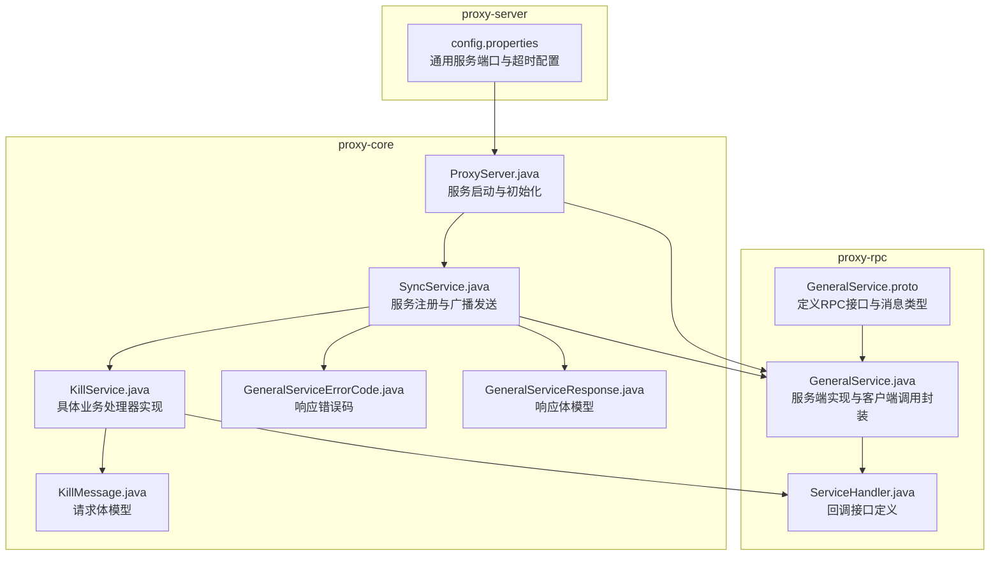
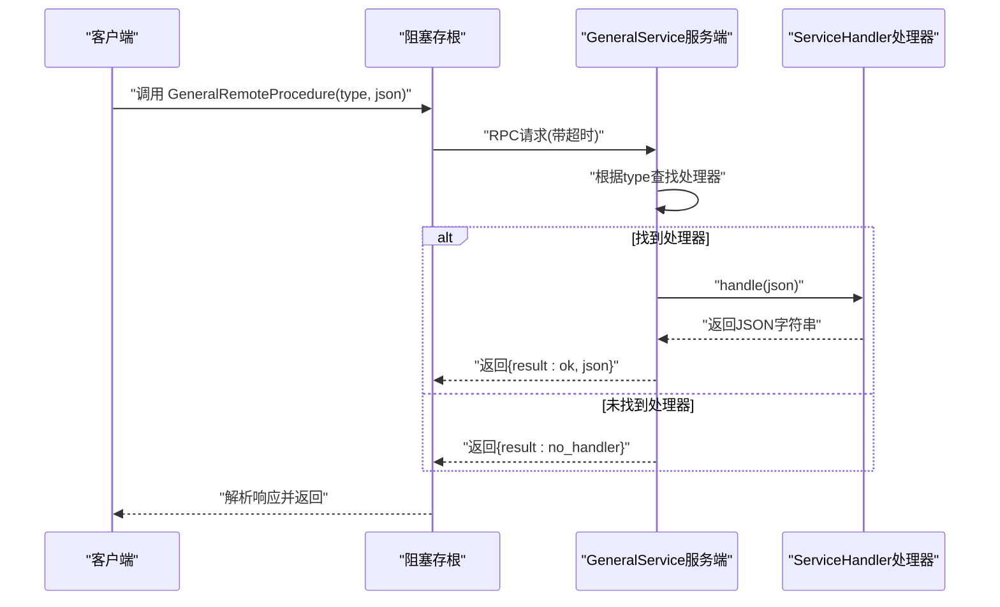
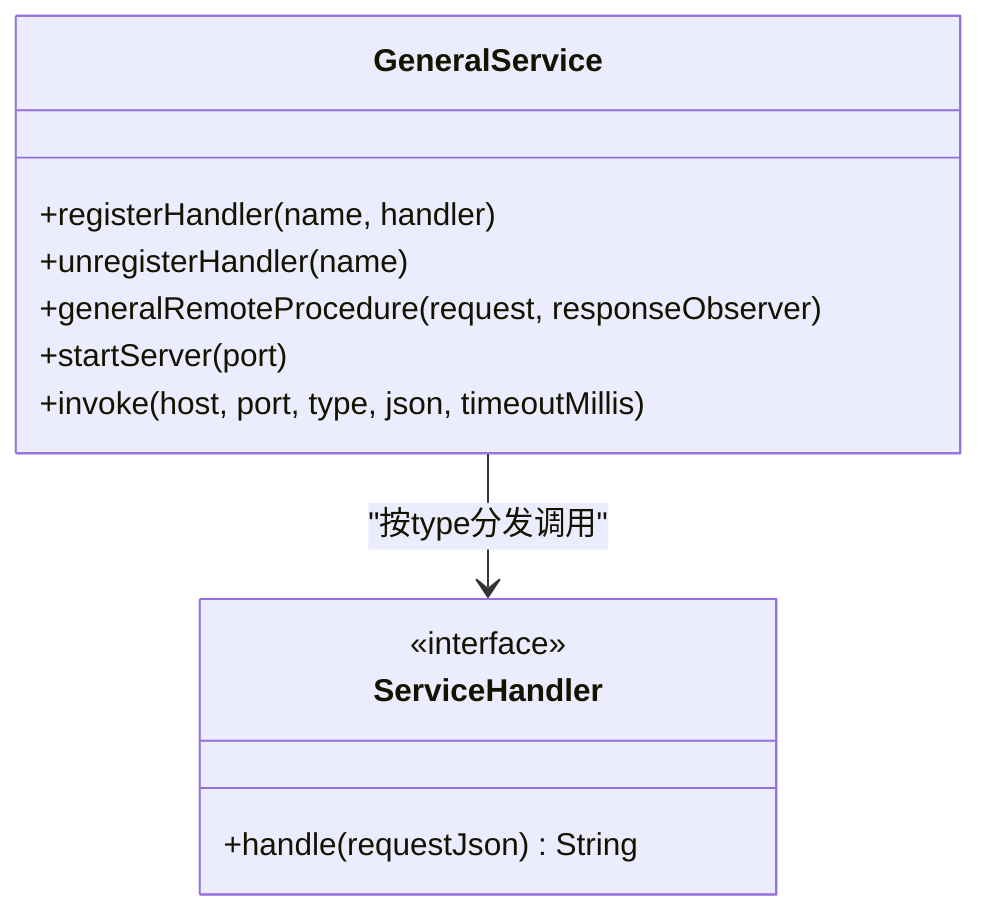
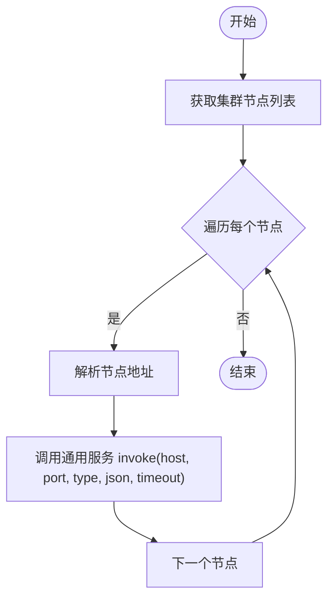
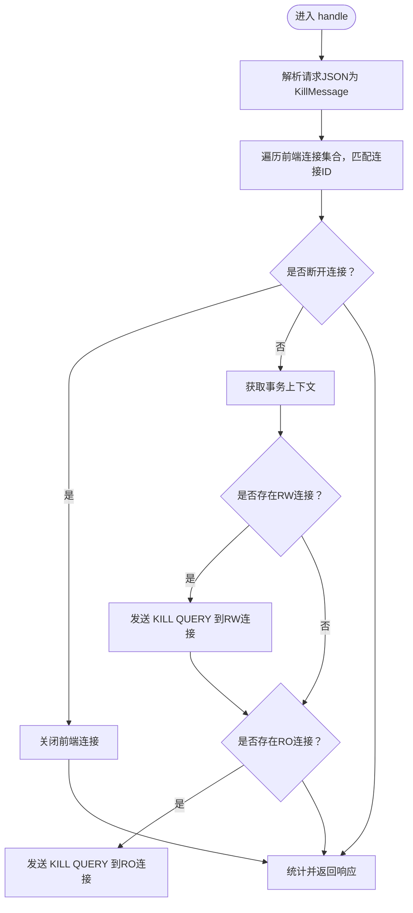
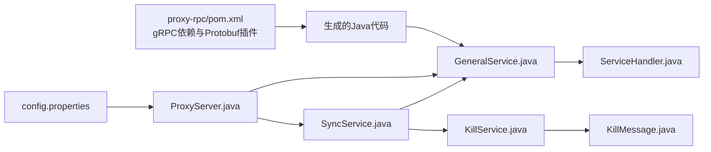

# gRPC服务API

<cite>
**本文引用的文件**
- [GeneralService.proto](file://proxy-rpc/src/main/proto/GeneralService.proto)
- [GeneralService.java](file://proxy-rpc/src/main/java/com/alibaba/polardbx/proxy/GeneralService.java)
- [ServiceHandler.java](file://proxy-rpc/src/main/java/com/alibaba/polardbx/proxy/ServiceHandler.java)
- [SyncService.java](file://proxy-core/src/main/java/com/alibaba/polardbx/proxy/sync/SyncService.java)
- [KillService.java](file://proxy-core/src/main/java/com/alibaba/polardbx/proxy/sync/KillService.java)
- [GeneralServiceErrorCode.java](file://proxy-core/src/main/java/com/alibaba/polardbx/proxy/sync/GeneralServiceErrorCode.java)
- [GeneralServiceResponse.java](file://proxy-core/src/main/java/com/alibaba/polardbx/proxy/sync/GeneralServiceResponse.java)
- [KillMessage.java](file://proxy-core/src/main/java/com/alibaba/polardbx/proxy/sync/KillMessage.java)
- [GeneralServiceTest.java](file://proxy-rpc/src/test/java/com/alibaba/polardbx/proxy/GeneralServiceTest.java)
- [ProxyServer.java](file://proxy-core/src/main/java/com/alibaba/polardbx/proxy/ProxyServer.java)
- [config.properties](file://proxy-server/src/main/conf/config.properties)
- [pom.xml（proxy-rpc）](file://proxy-rpc/pom.xml)
</cite>

## 目录
1. [简介](#简介)
2. [项目结构](#项目结构)
3. [核心组件](#核心组件)
4. [架构总览](#架构总览)
5. [详细组件分析](#详细组件分析)
6. [依赖关系分析](#依赖关系分析)
7. [性能与优化建议](#性能与优化建议)
8. [故障排查指南](#故障排查指南)
9. [结论](#结论)
10. [附录：完整API与使用示例](#附录完整api与使用示例)

## 简介
本文件为 gRPC 通用服务 API 的权威参考文档，围绕 GeneralService.proto 中定义的 RPC 接口、ServiceHandler 回调机制、服务注册与发现、RPC 调用与错误处理、超时设置、协议格式与序列化方式，以及服务端与客户端的完整使用示例进行系统性说明，并提供性能优化与最佳实践建议。读者可据此在 Polardbx Proxy 体系内安全、高效地扩展与集成通用远程过程调用能力。

## 项目结构
本项目采用多模块结构，gRPC 服务定义与实现位于 proxy-rpc 模块，服务端启动与集群节点管理位于 proxy-core 模块，配置位于 proxy-server 模块。

图表来源
- [GeneralService.proto](file://proxy-rpc/src/main/proto/GeneralService.proto#L1-L21)
- [GeneralService.java](file://proxy-rpc/src/main/java/com/alibaba/polardbx/proxy/GeneralService.java#L31-L94)
- [ServiceHandler.java](file://proxy-rpc/src/main/java/com/alibaba/polardbx/proxy/ServiceHandler.java#L21-L24)
- [SyncService.java](file://proxy-core/src/main/java/com/alibaba/polardbx/proxy/sync/SyncService.java#L34-L61)
- [KillService.java](file://proxy-core/src/main/java/com/alibaba/polardbx/proxy/sync/KillService.java#L37-L104)
- [GeneralServiceErrorCode.java](file://proxy-core/src/main/java/com/alibaba/polardbx/proxy/sync/GeneralServiceErrorCode.java#L21-L25)
- [GeneralServiceResponse.java](file://proxy-core/src/main/java/com/alibaba/polardbx/proxy/sync/GeneralServiceResponse.java#L24-L36)
- [KillMessage.java](file://proxy-core/src/main/java/com/alibaba/polardbx/proxy/sync/KillMessage.java#L24-L43)
- [ProxyServer.java](file://proxy-core/src/main/java/com/alibaba/polardbx/proxy/ProxyServer.java#L48-L96)
- [config.properties](file://proxy-server/src/main/conf/config.properties#L94-L98)

章节来源
- [GeneralService.proto](file://proxy-rpc/src/main/proto/GeneralService.proto#L1-L21)
- [GeneralService.java](file://proxy-rpc/src/main/java/com/alibaba/polardbx/proxy/GeneralService.java#L31-L94)
- [ServiceHandler.java](file://proxy-rpc/src/main/java/com/alibaba/polardbx/proxy/ServiceHandler.java#L21-L24)
- [SyncService.java](file://proxy-core/src/main/java/com/alibaba/polardbx/proxy/sync/SyncService.java#L34-L61)
- [KillService.java](file://proxy-core/src/main/java/com/alibaba/polardbx/proxy/sync/KillService.java#L37-L104)
- [GeneralServiceErrorCode.java](file://proxy-core/src/main/java/com/alibaba/polardbx/proxy/sync/GeneralServiceErrorCode.java#L21-L25)
- [GeneralServiceResponse.java](file://proxy-core/src/main/java/com/alibaba/polardbx/proxy/sync/GeneralServiceResponse.java#L24-L36)
- [KillMessage.java](file://proxy-core/src/main/java/com/alibaba/polardbx/proxy/sync/KillMessage.java#L24-L43)
- [ProxyServer.java](file://proxy-core/src/main/java/com/alibaba/polardbx/proxy/ProxyServer.java#L48-L96)
- [config.properties](file://proxy-server/src/main/conf/config.properties#L94-L98)

## 核心组件
- 通用服务接口定义：在 proto 文件中定义了服务名、方法名、请求与响应消息类型。
- 服务端实现：基于生成的 gRPC 服务基类，维护处理器映射表，按 type 分发到具体处理器。
- 回调接口：ServiceHandler 定义统一的 handle 方法，用于处理 JSON 请求并返回 JSON 响应。
- 服务注册与广播：SyncService 将处理器注册到全局映射，并通过集群节点广播触发调用。
- 错误与响应模型：统一的错误码与响应体模型，便于客户端识别成功/失败与返回信息。
- 客户端封装：提供静态方法封装通道建立、超时设置与阻塞调用，简化外部调用。
- 启动与配置：ProxyServer 在启动时加载配置并启动通用服务端口；config.properties 提供默认端口与超时。

章节来源
- [GeneralService.proto](file://proxy-rpc/src/main/proto/GeneralService.proto#L8-L20)
- [GeneralService.java](file://proxy-rpc/src/main/java/com/alibaba/polardbx/proxy/GeneralService.java#L31-L94)
- [ServiceHandler.java](file://proxy-rpc/src/main/java/com/alibaba/polardbx/proxy/ServiceHandler.java#L21-L24)
- [SyncService.java](file://proxy-core/src/main/java/com/alibaba/polardbx/proxy/sync/SyncService.java#L34-L61)
- [GeneralServiceErrorCode.java](file://proxy-core/src/main/java/com/alibaba/polardbx/proxy/sync/GeneralServiceErrorCode.java#L21-L25)
- [GeneralServiceResponse.java](file://proxy-core/src/main/java/com/alibaba/polardbx/proxy/sync/GeneralServiceResponse.java#L24-L36)
- [ProxyServer.java](file://proxy-core/src/main/java/com/alibaba/polardbx/proxy/ProxyServer.java#L82-L86)
- [config.properties](file://proxy-server/src/main/conf/config.properties#L94-L98)

## 架构总览
通用服务采用“服务端 + 处理器映射 + 广播分发”的架构。客户端通过阻塞存根发起 RPC 调用，服务端根据请求中的 type 查找处理器并执行，最终以 JSON 字符串作为结果返回。

图表来源
- [GeneralService.java](file://proxy-rpc/src/main/java/com/alibaba/polardbx/proxy/GeneralService.java#L44-L65)
- [ServiceHandler.java](file://proxy-rpc/src/main/java/com/alibaba/polardbx/proxy/ServiceHandler.java#L21-L24)

## 详细组件分析

### 通用服务接口定义（GeneralService.proto）
- 服务名：GeneralService
- 方法：GeneralRemoteProcedure
- 请求消息：GeneralRequest
  - 字段：type（字符串）、json（字符串）
- 响应消息：GeneralResponse
  - 字段：result（字符串）、json（字符串）

章节来源
- [GeneralService.proto](file://proxy-rpc/src/main/proto/GeneralService.proto#L8-L20)

### 服务端实现（GeneralService.java）
- 处理器映射：静态 ConcurrentHashMap 维护 type 到 ServiceHandler 的映射。
- 注册/注销：registerHandler/unregisterHandler 提供动态注册与移除。
- RPC 实现：generalRemoteProcedure 根据请求 type 获取处理器并调用 handle，构造响应。
- 服务启动：startServer 创建并启动 gRPC 服务器。
- 客户端调用：invoke 封装 ManagedChannel、阻塞存根、超时设置与调用流程。

图表来源
- [GeneralService.java](file://proxy-rpc/src/main/java/com/alibaba/polardbx/proxy/GeneralService.java#L31-L94)
- [ServiceHandler.java](file://proxy-rpc/src/main/java/com/alibaba/polardbx/proxy/ServiceHandler.java#L21-L24)

章节来源
- [GeneralService.java](file://proxy-rpc/src/main/java/com/alibaba/polardbx/proxy/GeneralService.java#L31-L94)

### 回调接口（ServiceHandler.java）
- 定义统一的 handle 方法，接收 JSON 字符串请求，返回 JSON 字符串响应。
- 具体业务处理器实现该接口，如 KillService。

章节来源
- [ServiceHandler.java](file://proxy-rpc/src/main/java/com/alibaba/polardbx/proxy/ServiceHandler.java#L21-L24)

### 服务注册与广播（SyncService.java）
- 初始化：在应用启动时注册处理器（例如“kill”），并将处理器加入全局映射。
- 广播发送：从节点监控器获取集群节点列表，遍历节点异步调用通用服务，发送 JSON 请求。
- 配置依赖：从配置中读取通用服务端口与超时时间。

图表来源
- [SyncService.java](file://proxy-core/src/main/java/com/alibaba/polardbx/proxy/sync/SyncService.java#L39-L55)

章节来源
- [SyncService.java](file://proxy-core/src/main/java/com/alibaba/polardbx/proxy/sync/SyncService.java#L34-L61)

### 具体业务处理器（KillService.java）
- 实现 ServiceHandler，处理“kill”类型的请求。
- 解析 KillMessage（包含进程ID与是否断开连接标志），在前端连接集合中定位匹配连接。
- 若为断开连接，则直接关闭前端连接；若为终止查询，则在事务上下文中尝试向后端发送 KILL QUERY。
- 返回统一的响应体模型，包含错误码与信息。

图表来源
- [KillService.java](file://proxy-core/src/main/java/com/alibaba/polardbx/proxy/sync/KillService.java#L53-L102)
- [KillMessage.java](file://proxy-core/src/main/java/com/alibaba/polardbx/proxy/sync/KillMessage.java#L24-L43)

章节来源
- [KillService.java](file://proxy-core/src/main/java/com/alibaba/polardbx/proxy/sync/KillService.java#L37-L104)
- [KillMessage.java](file://proxy-core/src/main/java/com/alibaba/polardbx/proxy/sync/KillMessage.java#L24-L43)

### 错误与响应模型
- 错误码：SUCCESS=0，ERROR=1。
- 响应体：包含 error_code 与 info 字段，便于客户端判断处理结果。

章节来源
- [GeneralServiceErrorCode.java](file://proxy-core/src/main/java/com/alibaba/polardbx/proxy/sync/GeneralServiceErrorCode.java#L21-L25)
- [GeneralServiceResponse.java](file://proxy-core/src/main/java/com/alibaba/polardbx/proxy/sync/GeneralServiceResponse.java#L24-L36)

### 服务启动与配置
- ProxyServer 在初始化时：
  - 加载配置（包括通用服务端口与超时）。
  - 调用 SyncService.init 注册处理器。
  - 启动通用服务端口。
- config.properties 默认通用服务端口与超时时间。

章节来源
- [ProxyServer.java](file://proxy-core/src/main/java/com/alibaba/polardbx/proxy/ProxyServer.java#L82-L86)
- [config.properties](file://proxy-server/src/main/conf/config.properties#L94-L98)

## 依赖关系分析
- 依赖 gRPC 运行时与编译插件，通过 Maven 插件自动生成 Java 代码与 gRPC stub。
- 服务端依赖 ServiceHandler 接口与处理器实现；客户端依赖生成的阻塞存根。
- SyncService 依赖集群节点监控器与配置加载器，负责跨节点广播。

图表来源
- [pom.xml（proxy-rpc）](file://proxy-rpc/pom.xml#L38-L96)
- [GeneralService.java](file://proxy-rpc/src/main/java/com/alibaba/polardbx/proxy/GeneralService.java#L31-L94)
- [ServiceHandler.java](file://proxy-rpc/src/main/java/com/alibaba/polardbx/proxy/ServiceHandler.java#L21-L24)
- [SyncService.java](file://proxy-core/src/main/java/com/alibaba/polardbx/proxy/sync/SyncService.java#L34-L61)
- [KillService.java](file://proxy-core/src/main/java/com/alibaba/polardbx/proxy/sync/KillService.java#L37-L104)
- [KillMessage.java](file://proxy-core/src/main/java/com/alibaba/polardbx/proxy/sync/KillMessage.java#L24-L43)
- [ProxyServer.java](file://proxy-core/src/main/java/com/alibaba/polardbx/proxy/ProxyServer.java#L82-L86)
- [config.properties](file://proxy-server/src/main/conf/config.properties#L94-L98)

章节来源
- [pom.xml（proxy-rpc）](file://proxy-rpc/pom.xml#L38-L96)

## 性能与优化建议
- 连接复用与超时控制
  - 客户端每次调用均新建 ManagedChannel，建议在高频调用场景下复用 Channel 或使用连接池策略，避免频繁创建销毁带来的开销。
  - 使用 withDeadlineAfter 设置合理超时，避免阻塞等待导致资源占用。
- 广播调用的并发与降级
  - SyncService 对每个节点异步提交任务，注意线程池大小与队列长度，防止过载。
  - 对于不可达节点或异常响应，建议记录日志并快速失败，避免影响主流程。
- 序列化与数据体积
  - 请求与响应均为 JSON 字符串，建议对大对象进行压缩或分片传输，减少网络负载。
- 处理器选择与负载均衡
  - 将不同类型的请求拆分为独立处理器，避免单点瓶颈；结合集群节点分布进行路由。
- 日志与可观测性
  - 在关键路径增加采样日志与指标埋点，便于定位性能问题与异常。

## 故障排查指南
- 无处理器（no_handler）
  - 现象：响应 result 为 no_handler。
  - 排查：确认处理器已通过 registerHandler 注册，且 type 一致。
- 调用超时
  - 现象：客户端抛出超时异常或返回空结果。
  - 排查：检查 config.properties 中 general_service_timeout 设置，确认服务端处理耗时与网络延迟。
- 节点不可达
  - 现象：广播调用部分节点失败。
  - 排查：检查节点地址解析、防火墙与端口连通性；查看日志中的异常堆栈。
- 处理器内部异常
  - 现象：返回统一响应体，error_code=ERROR。
  - 排查：查看 KillService 内部日志，定位具体异常原因（如连接探测失败、后端查询异常等）。

章节来源
- [GeneralService.java](file://proxy-rpc/src/main/java/com/alibaba/polardbx/proxy/GeneralService.java#L50-L61)
- [SyncService.java](file://proxy-core/src/main/java/com/alibaba/polardbx/proxy/sync/SyncService.java#L39-L55)
- [KillService.java](file://proxy-core/src/main/java/com/alibaba/polardbx/proxy/sync/KillService.java#L98-L102)

## 结论
本 gRPC 通用服务 API 通过简洁的接口设计与灵活的处理器机制，实现了跨节点的统一远程调用能力。配合合理的超时与并发控制、统一的响应模型与日志监控，可在 Polardbx Proxy 生态中稳定扩展各类业务功能。建议在生产环境中结合实际流量特征与节点规模，持续优化连接复用、广播策略与序列化方案，确保低延迟与高可用。

## 附录：完整API与使用示例

### 服务方法与消息类型
- 服务：GeneralService
- 方法：GeneralRemoteProcedure
  - 请求：GeneralRequest
    - type：字符串，用于选择处理器
    - json：字符串，承载业务请求数据
  - 响应：GeneralResponse
    - result：字符串，ok 表示成功，no_handler 表示未找到处理器
    - json：字符串，承载业务响应数据（当 result=ok 时有效）

章节来源
- [GeneralService.proto](file://proxy-rpc/src/main/proto/GeneralService.proto#L8-L20)

### 服务注册与发现
- 注册处理器
  - 方法：registerHandler(name, handler)
  - 作用：将 type 映射到 ServiceHandler 实例
- 注销处理器
  - 方法：unregisterHandler(name)
  - 作用：移除指定 type 的处理器
- 启动服务端
  - 方法：startServer(port)
  - 作用：启动 gRPC 服务器监听指定端口
- 广播调用
  - 方法：SyncService.kill(processId, connection)
  - 作用：向集群所有节点广播“kill”请求，支持断开连接或终止查询两种模式

章节来源
- [GeneralService.java](file://proxy-rpc/src/main/java/com/alibaba/polardbx/proxy/GeneralService.java#L36-L72)
- [SyncService.java](file://proxy-core/src/main/java/com/alibaba/polardbx/proxy/sync/SyncService.java#L39-L59)

### RPC调用与参数传递
- 客户端调用
  - 方法：invoke(host, port, type, json, timeoutMillis)
  - 作用：建立明文通道，使用阻塞存根调用 RPC，设置超时并返回结果
- 参数说明
  - host/port：目标节点地址
  - type：处理器标识
  - json：请求体（JSON 字符串）
  - timeoutMillis：超时毫秒数
- 返回值
  - 当 result=ok 时返回 json；否则返回 null

章节来源
- [GeneralService.java](file://proxy-rpc/src/main/java/com/alibaba/polardbx/proxy/GeneralService.java#L74-L92)

### 错误处理与超时设置
- 未找到处理器：返回 result=no_handler
- 处理器内部异常：返回统一响应体，error_code=ERROR
- 超时设置：客户端调用时通过 withDeadlineAfter 设置超时
- 配置项：general_service_timeout（来自 config.properties）

章节来源
- [GeneralService.java](file://proxy-rpc/src/main/java/com/alibaba/polardbx/proxy/GeneralService.java#L50-L61)
- [config.properties](file://proxy-server/src/main/conf/config.properties#L97-L97)

### 协议格式与消息序列化
- 协议：gRPC（基于 Protobuf）
- 消息类型：GeneralRequest/GeneralResponse
- 序列化：Protobuf 编解码；业务 JSON 数据以字符串形式嵌入消息字段

章节来源
- [GeneralService.proto](file://proxy-rpc/src/main/proto/GeneralService.proto#L12-L20)
- [pom.xml（proxy-rpc）](file://proxy-rpc/pom.xml#L78-L94)

### 完整使用示例（步骤说明）
- 服务端启动
  - 在 ProxyServer 初始化时自动完成：注册处理器、启动通用服务端口
- 客户端调用
  - 通过 GeneralService.invoke 发起 RPC 调用，传入目标节点、type 与 JSON 请求体
- 广播调用
  - 通过 SyncService.kill 触发跨节点广播，内部会解析节点地址并逐个调用通用服务

章节来源
- [ProxyServer.java](file://proxy-core/src/main/java/com/alibaba/polardbx/proxy/ProxyServer.java#L82-L86)
- [GeneralServiceTest.java](file://proxy-rpc/src/test/java/com/alibaba/polardbx/proxy/GeneralServiceTest.java#L26-L34)