# 监控指标API

<cite>
**本文档中引用的文件**
- [ExtraLog.java](file://proxy-common/src/main/java/com/alibaba/polardbx/proxy/logger/ExtraLog.java)
- [ReactorPerfCollection.java](file://proxy-net/src/main/java/com/alibaba/polardbx/proxy/perf/ReactorPerfCollection.java)
- [ReactorPerfItem.java](file://proxy-net/src/main/java/com/alibaba/polardbx/proxy/perf/ReactorPerfItem.java)
- [ShowReactorHandler.java](file://proxy-core/src/main/java/com/alibaba/polardbx/proxy/protocol/handler/request/ShowReactorHandler.java)
- [NIOProcessor.java](file://proxy-net/src/main/java/com/alibaba/polardbx/proxy/net/NIOProcessor.java)
- [FastBufferPool.java](file://proxy-common/src/main/java/com/alibaba/polardbx/proxy/utils/FastBufferPool.java)
- [logback.xml](file://proxy-common/src/main/resources/logback.xml)
- [AsyncAppender.java](file://proxy-common/src/main/java/com/alibaba/polardbx/proxy/logger/AsyncAppender.java)
- [ConsoleFilter.java](file://proxy-common/src/main/java/com/alibaba/polardbx/proxy/logger/ConsoleFilter.java)
- [MySQLDALParser.java](file://proxy-parser/src/main/java/com/alibaba/polardbx/proxy/parser/recognizer/mysql/syntax/MySQLDALParser.java)
- [polardbx_proxy_user_manual.md](file://polardbx_proxy_user_manual.md)
</cite>

## 目录
1. [简介](#简介)
2. [项目结构](#项目结构)
3. [核心组件](#核心组件)
4. [架构概览](#架构概览)
5. [详细组件分析](#详细组件分析)
6. [依赖关系分析](#依赖关系分析)
7. [性能考虑](#性能考虑)
8. [故障排除指南](#故障排除指南)
9. [结论](#结论)
10. [附录](#附录)

## 简介

本文件为监控指标API的详细参考文档，涵盖了以下核心功能：

- **ExtraLog额外日志记录API**：说明自定义日志字段和日志级别设置方法
- **ReactorPerfCollection性能收集器**：接口定义、性能指标采集、统计计算和数据导出方法
- **ReactorPerfItem性能项**：指标类型定义和数据格式规范
- **监控数据获取**：实时获取和历史查询API说明
- **性能指标分类体系**：指标分类和计算公式
- **系统集成指南**：监控系统的集成方法和第三方监控工具对接

## 项目结构

监控指标API分布在三个主要模块中：

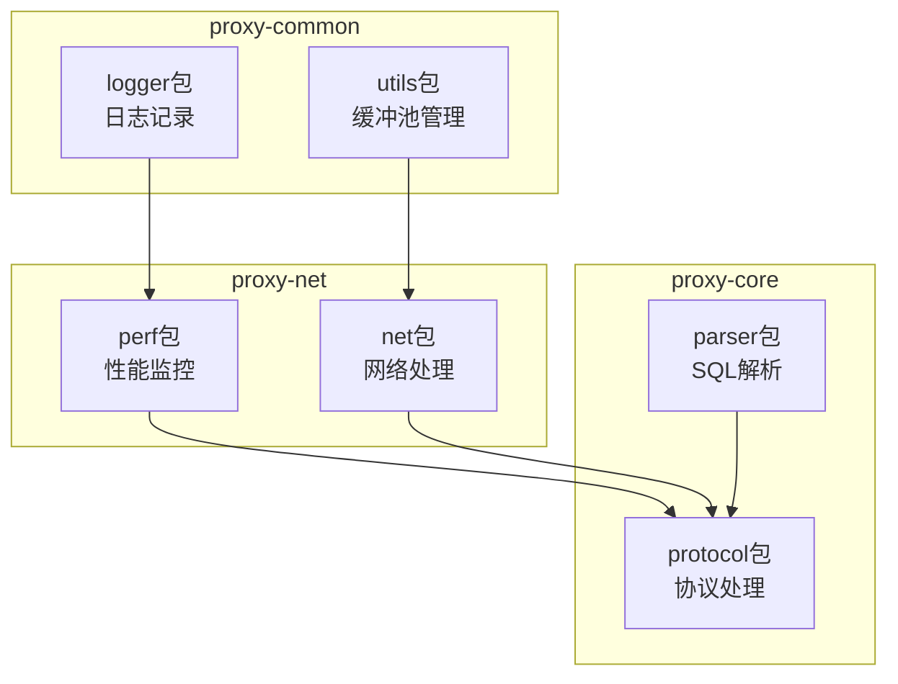

**图表来源**
- [ExtraLog.java](file://proxy-common/src/main/java/com/alibaba/polardbx/proxy/logger/ExtraLog.java#L1-L27)
- [ReactorPerfCollection.java](file://proxy-net/src/main/java/com/alibaba/polardbx/proxy/perf/ReactorPerfCollection.java#L1-L34)
- [ShowReactorHandler.java](file://proxy-core/src/main/java/com/alibaba/polardbx/proxy/protocol/handler/request/ShowReactorHandler.java#L1-L90)

**章节来源**
- [ExtraLog.java](file://proxy-common/src/main/java/com/alibaba/polardbx/proxy/logger/ExtraLog.java#L1-L27)
- [ReactorPerfCollection.java](file://proxy-net/src/main/java/com/alibaba/polardbx/proxy/perf/ReactorPerfCollection.java#L1-L34)
- [ShowReactorHandler.java](file://proxy-core/src/main/java/com/alibaba/polardbx/proxy/protocol/handler/request/ShowReactorHandler.java#L1-L90)

## 核心组件

### 性能监控核心组件

监控系统由以下核心组件构成：

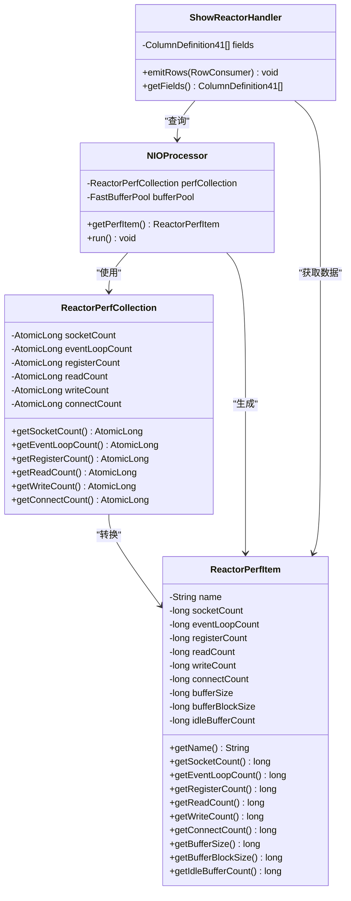

**图表来源**
- [ReactorPerfCollection.java](file://proxy-net/src/main/java/com/alibaba/polardbx/proxy/perf/ReactorPerfCollection.java#L25-L33)
- [ReactorPerfItem.java](file://proxy-net/src/main/java/com/alibaba/polardbx/proxy/perf/ReactorPerfItem.java#L24-L40)
- [NIOProcessor.java](file://proxy-net/src/main/java/com/alibaba/polardbx/proxy/net/NIOProcessor.java#L116-L132)
- [ShowReactorHandler.java](file://proxy-core/src/main/java/com/alibaba/polardbx/proxy/protocol/handler/request/ShowReactorHandler.java#L31-L89)

**章节来源**
- [ReactorPerfCollection.java](file://proxy-net/src/main/java/com/alibaba/polardbx/proxy/perf/ReactorPerfCollection.java#L25-L33)
- [ReactorPerfItem.java](file://proxy-net/src/main/java/com/alibaba/polardbx/proxy/perf/ReactorPerfItem.java#L24-L40)
- [NIOProcessor.java](file://proxy-net/src/main/java/com/alibaba/polardbx/proxy/net/NIOProcessor.java#L116-L132)

## 架构概览

监控系统采用分层架构设计，实现高性能的实时监控：

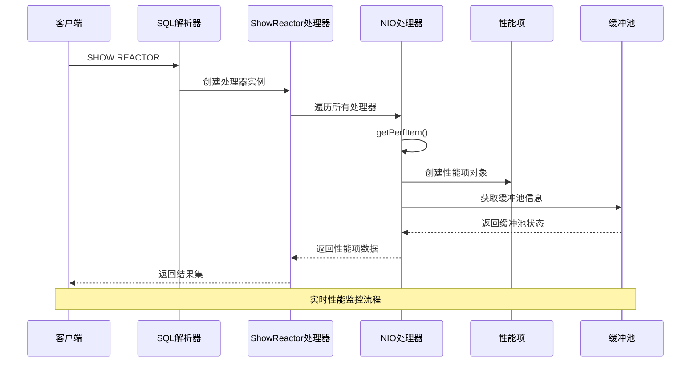

**图表来源**
- [ShowReactorHandler.java](file://proxy-core/src/main/java/com/alibaba/polardbx/proxy/protocol/handler/request/ShowReactorHandler.java#L68-L88)
- [NIOProcessor.java](file://proxy-net/src/main/java/com/alibaba/polardbx/proxy/net/NIOProcessor.java#L116-L132)
- [MySQLDALParser.java](file://proxy-parser/src/main/java/com/alibaba/polardbx/proxy/parser/recognizer/mysql/syntax/MySQLDALParser.java#L117-L119)

## 详细组件分析

### ExtraLog额外日志记录API

ExtraLog提供了专门的日志记录功能，支持自定义日志字段和日志级别设置。

#### 日志配置结构

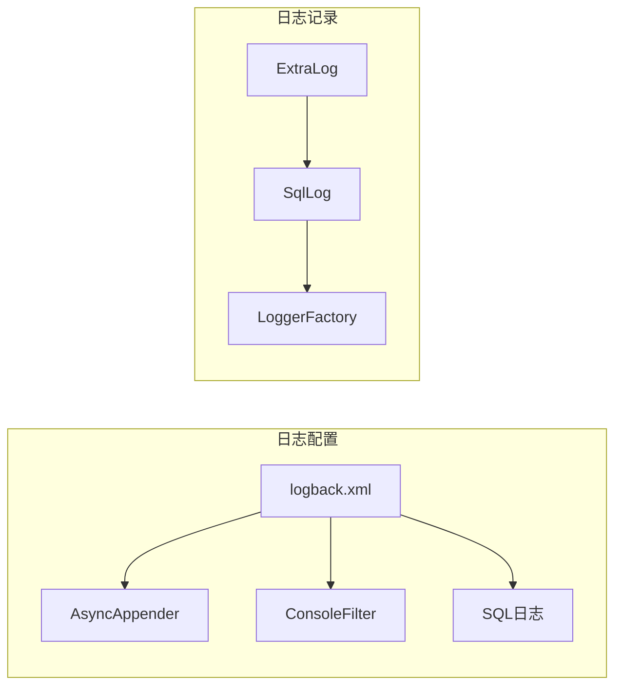

**图表来源**
- [logback.xml](file://proxy-common/src/main/resources/logback.xml#L56-L88)
- [ExtraLog.java](file://proxy-common/src/main/java/com/alibaba/polardbx/proxy/logger/ExtraLog.java#L24-L26)

#### 自定义日志字段设置

日志字段通过MDC（Mapped Diagnostic Context）机制实现：

| 字段名称 | 类型 | 描述 | 示例值 |
|---------|------|------|--------|
| CONNECTION | String | 连接标识符 | "conn_12345" |
| USER | String | 用户名 | "admin" |
| QUERY_ID | String | 查询ID | "query_67890" |

#### 日志级别配置

日志级别设置遵循以下优先级：

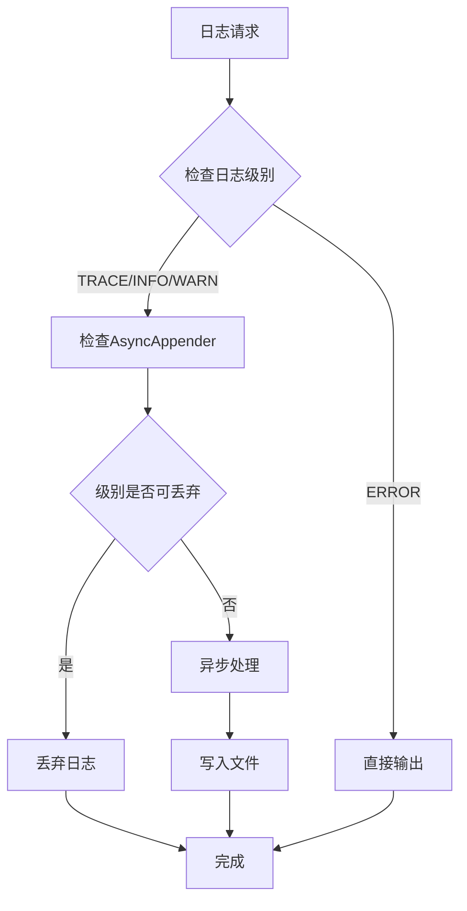

**图表来源**
- [AsyncAppender.java](file://proxy-common/src/main/java/com/alibaba/polardbx/proxy/logger/AsyncAppender.java#L33-L37)

**章节来源**
- [ExtraLog.java](file://proxy-common/src/main/java/com/alibaba/polardbx/proxy/logger/ExtraLog.java#L24-L26)
- [logback.xml](file://proxy-common/src/main/resources/logback.xml#L56-L88)
- [AsyncAppender.java](file://proxy-common/src/main/java/com/alibaba/polardbx/proxy/logger/AsyncAppender.java#L33-L37)

### ReactorPerfCollection性能收集器

ReactorPerfCollection是性能监控的核心收集器，负责统计各种网络事件指标。

#### 指标类型定义

| 指标名称 | 数据类型 | 描述 | 原子操作 |
|---------|----------|------|----------|
| socketCount | AtomicLong | 当前套接字数量 | ✅ |
| eventLoopCount | AtomicLong | 事件循环次数 | ✅ |
| registerCount | AtomicLong | 注册事件次数 | ✅ |
| readCount | AtomicLong | 读取事件次数 | ✅ |
| writeCount | AtomicLong | 写入事件次数 | ✅ |
| connectCount | AtomicLong | 连接建立次数 | ✅ |

#### 性能采集流程

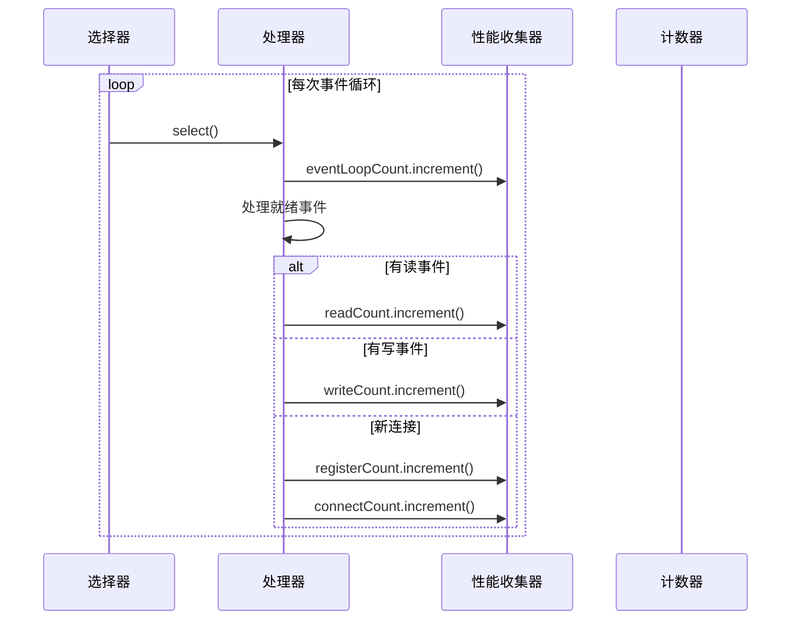

**图表来源**
- [NIOProcessor.java](file://proxy-net/src/main/java/com/alibaba/polardbx/proxy/net/NIOProcessor.java#L88-L114)

**章节来源**
- [ReactorPerfCollection.java](file://proxy-net/src/main/java/com/alibaba/polardbx/proxy/perf/ReactorPerfCollection.java#L25-L33)
- [NIOProcessor.java](file://proxy-net/src/main/java/com/alibaba/polardbx/proxy/net/NIOProcessor.java#L88-L114)

### ReactorPerfItem性能项

ReactorPerfItem是性能监控的数据传输对象，封装了完整的性能指标信息。

#### 数据结构定义

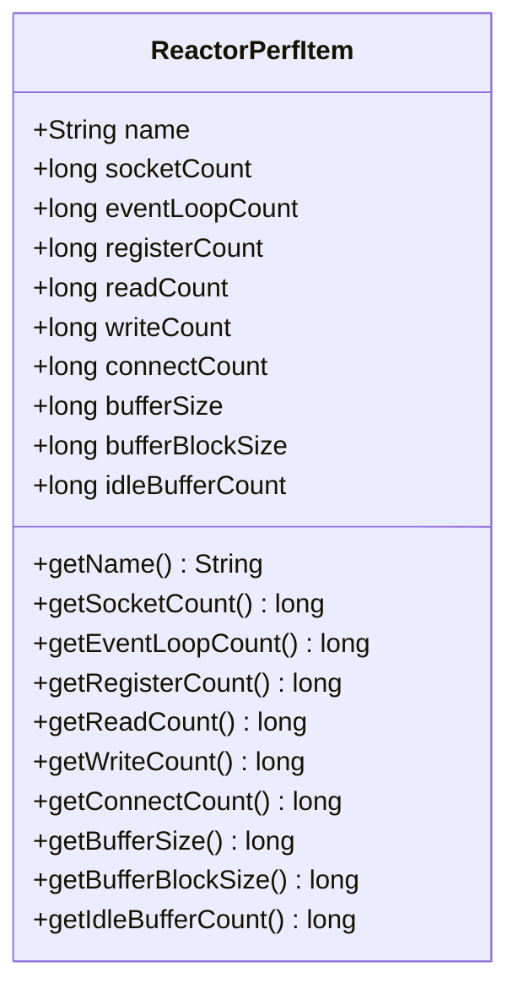

**图表来源**
- [ReactorPerfItem.java](file://proxy-net/src/main/java/com/alibaba/polardbx/proxy/perf/ReactorPerfItem.java#L24-L40)

#### 数据格式规范

| 字段名称 | 类型 | 单位 | 描述 |
|---------|------|------|------|
| name | String | - | 处理器名称 |
| socketCount | long | 个 | 当前套接字数量 |
| eventLoopCount | long | 次 | 事件循环次数 |
| registerCount | long | 次 | 注册事件次数 |
| readCount | long | 次 | 读取事件次数 |
| writeCount | long | 次 | 写入事件次数 |
| connectCount | long | 次 | 连接建立次数 |
| bufferSize | long | 字节 | 缓冲池总容量 |
| bufferBlockSize | long | 字节 | 单块缓冲大小 |
| idleBufferCount | long | 个 | 空闲缓冲块数量 |

**章节来源**
- [ReactorPerfItem.java](file://proxy-net/src/main/java/com/alibaba/polardbx/proxy/perf/ReactorPerfItem.java#L24-L40)

### 监控数据获取API

#### 实时获取API

系统提供多种方式获取实时监控数据：

##### SQL查询接口

```sql
-- 获取所有处理器的性能信息
SHOW REACTOR;

-- 预期输出格式
+-----------------+---------+--------+-----------+-------+--------+----------+----------+-------+-------+------+
| name            | sockets | events | registers | reads | writes | connects | buffer   | block | total | idle |
+-----------------+---------+--------+-----------+-------+--------+----------+----------+-------+-------+------+
| NIO-Processor-0 |       3 |  21549 |       587 | 11624 |      0 |        2 | 16777216 |  8192 |  2048 | 2044 |
| NIO-Processor-1 |       1 |   5431 |       586 |  3000 |      0 |        1 | 16777216 |  8192 |  2048 | 2047 |
+-----------------+---------+--------+-----------+-------+--------+----------+----------+-------+-------+------+
```

##### 编程接口

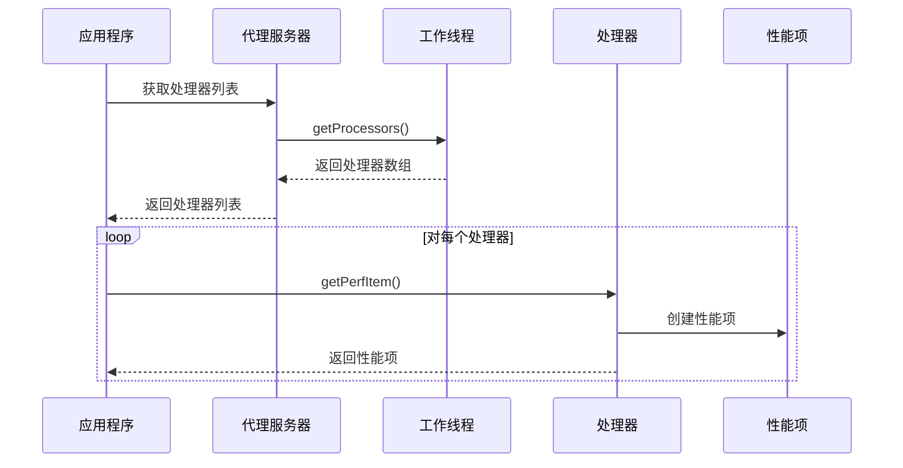

**图表来源**
- [ShowReactorHandler.java](file://proxy-core/src/main/java/com/alibaba/polardbx/proxy/protocol/handler/request/ShowReactorHandler.java#L68-L88)

**章节来源**
- [ShowReactorHandler.java](file://proxy-core/src/main/java/com/alibaba/polardbx/proxy/protocol/handler/request/ShowReactorHandler.java#L68-L88)
- [polardbx_proxy_user_manual.md](file://polardbx_proxy_user_manual.md#L511-L525)

### 性能指标分类体系

#### 指标分类

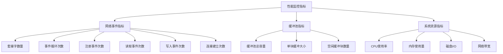

#### 计算公式

| 指标类型 | 计算公式 | 描述 |
|---------|----------|------|
| 平均事件处理时间 | 总处理时间 / 事件总数 | 衡量事件处理效率 |
| 缓冲池利用率 | 已用缓冲块 / 总缓冲块 | 反映内存使用情况 |
| 连接成功率 | 成功连接数 / 总连接尝试数 | 评估连接稳定性 |
| 事件吞吐量 | 事件总数 / 时间间隔 | 衡量系统处理能力 |

**章节来源**
- [ShowReactorHandler.java](file://proxy-core/src/main/java/com/alibaba/polardbx/proxy/protocol/handler/request/ShowReactorHandler.java#L82-L84)

## 依赖关系分析

监控系统各组件之间的依赖关系如下：

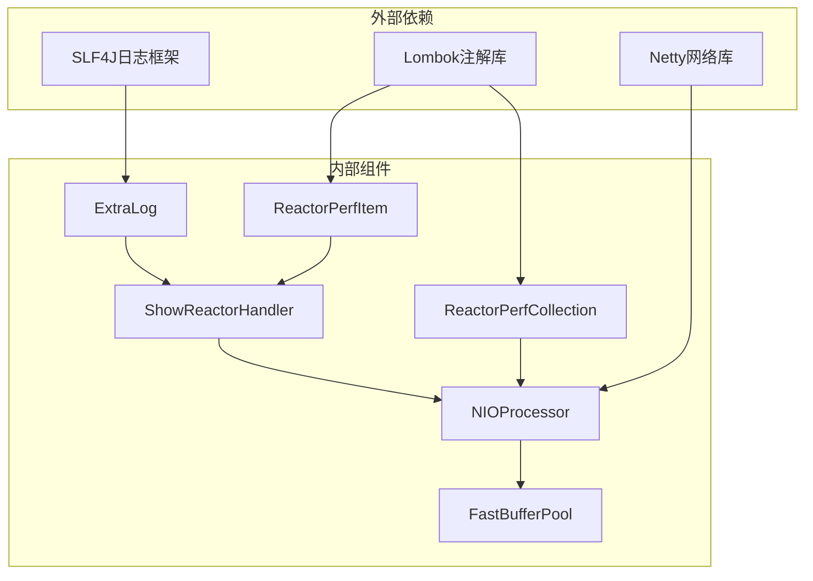

**图表来源**
- [ExtraLog.java](file://proxy-common/src/main/java/com/alibaba/polardbx/proxy/logger/ExtraLog.java#L21-L22)
- [ReactorPerfCollection.java](file://proxy-net/src/main/java/com/alibaba/polardbx/proxy/perf/ReactorPerfCollection.java#L21-L23)
- [ReactorPerfItem.java](file://proxy-net/src/main/java/com/alibaba/polardbx/proxy/perf/ReactorPerfItem.java#L21-L22)

**章节来源**
- [ExtraLog.java](file://proxy-common/src/main/java/com/alibaba/polardbx/proxy/logger/ExtraLog.java#L21-L22)
- [ReactorPerfCollection.java](file://proxy-net/src/main/java/com/alibaba/polardbx/proxy/perf/ReactorPerfCollection.java#L21-L23)
- [ReactorPerfItem.java](file://proxy-net/src/main/java/com/alibaba/polardbx/proxy/perf/ReactorPerfItem.java#L21-L22)

## 性能考虑

### 内存管理优化

系统采用无锁原子操作确保高并发下的性能：

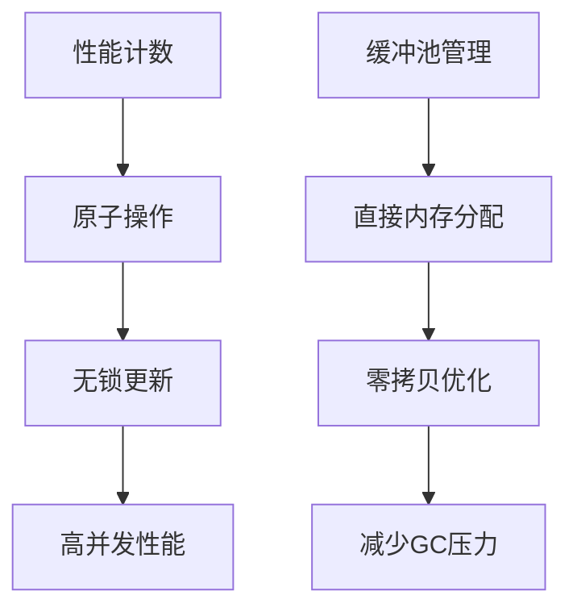

### 日志性能优化

异步日志系统避免阻塞主业务流程：

| 组件 | 性能特性 | 优化策略 |
|------|----------|----------|
| AsyncAppender | 异步处理 | 队列缓冲，批量写入 |
| ConsoleFilter | 条件过滤 | IDE环境控制输出 |
| FastBufferPool | 直接内存 | 减少内存拷贝 |

**章节来源**
- [AsyncAppender.java](file://proxy-common/src/main/java/com/alibaba/polardbx/proxy/logger/AsyncAppender.java#L33-L37)
- [FastBufferPool.java](file://proxy-common/src/main/java/com/alibaba/polardbx/proxy/utils/FastBufferPool.java#L51-L69)

## 故障排除指南

### 常见问题及解决方案

#### 性能监控数据异常

**问题现象**：性能指标显示异常或不更新

**排查步骤**：
1. 检查NIO处理器是否正常运行
2. 验证性能收集器计数器状态
3. 确认缓冲池配置参数

**解决方案**：
- 重启异常的NIO处理器
- 调整缓冲池大小配置
- 检查系统资源限制

#### 日志输出问题

**问题现象**：SQL日志无法输出或丢失

**排查步骤**：
1. 检查logback配置文件
2. 验证AsyncAppender队列状态
3. 确认日志级别设置

**解决方案**：
- 调整日志级别配置
- 增加AsyncAppender队列大小
- 检查磁盘空间和权限

**章节来源**
- [logback.xml](file://proxy-common/src/main/resources/logback.xml#L47-L54)
- [ConsoleFilter.java](file://proxy-common/src/main/java/com/alibaba/polardbx/proxy/logger/ConsoleFilter.java#L34-L42)

## 结论

监控指标API提供了完整的性能观测和问题诊断能力：

1. **实时监控**：通过SHOW REACTOR等SQL接口实现实时性能监控
2. **细粒度统计**：涵盖网络事件、缓冲池、系统资源等多个维度
3. **高效实现**：采用原子操作和异步处理确保低开销
4. **灵活扩展**：支持自定义日志字段和日志级别配置
5. **完整集成**：与现有系统无缝集成，无需额外配置

该API为系统运维和性能调优提供了强有力的技术支撑。

## 附录

### API使用示例

#### 获取处理器性能信息

```sql
-- 基本使用
SHOW REACTOR;

-- 分析连接状态
SELECT name, sockets, connects FROM system.reactor WHERE sockets > 10;
```

#### 自定义日志记录

```java
// 使用ExtraLog记录自定义日志
ExtraLog.SqlLog.info("自定义日志消息");
```

#### 性能监控集成

```java
// 获取所有处理器的性能数据
NIOProcessor[] processors = ProxyServer.getInstance().getWorker().getProcessors();
for (NIOProcessor processor : processors) {
    ReactorPerfItem item = processor.getPerfItem();
    // 处理性能数据
}
```