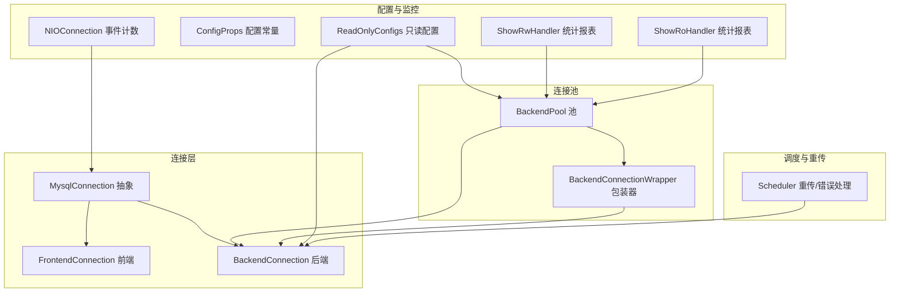
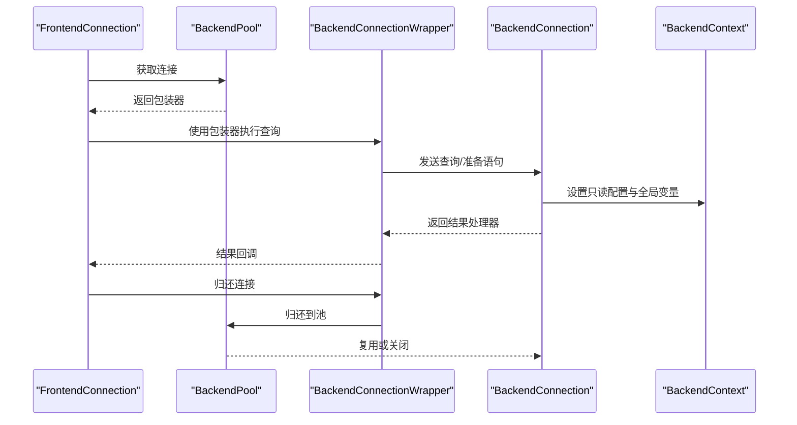
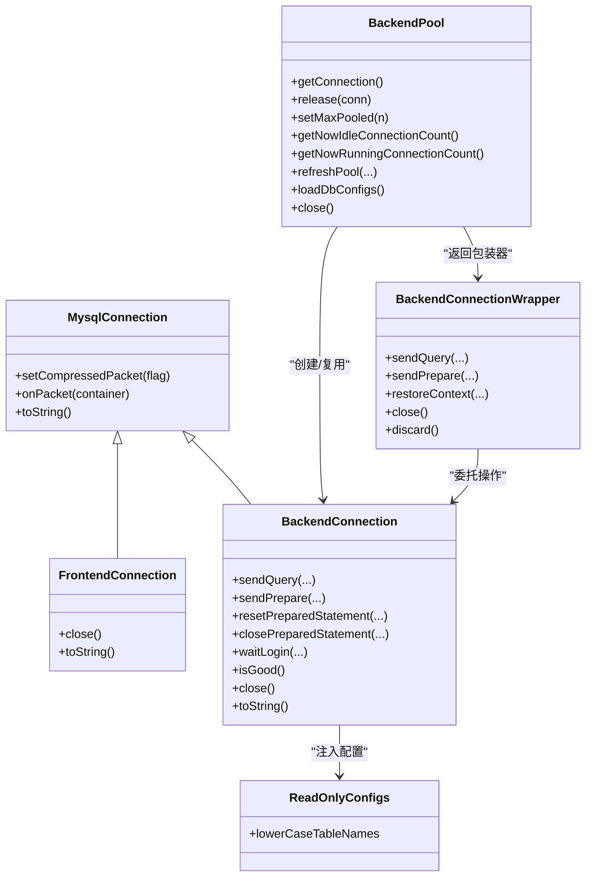

# 连接管理API

<cite>
**本文引用的文件**
- [FrontendConnection.java](file://proxy-core/src/main/java/com/alibaba/polardbx/proxy/connection/FrontendConnection.java)
- [BackendConnection.java](file://proxy-core/src/main/java/com/alibaba/polardbx/proxy/connection/BackendConnection.java)
- [MysqlConnection.java](file://proxy-core/src/main/java/com/alibaba/polardbx/proxy/connection/MysqlConnection.java)
- [ReadOnlyConfigs.java](file://proxy-core/src/main/java/com/alibaba/polardbx/proxy/connection/configs/ReadOnlyConfigs.java)
- [BackendPool.java](file://proxy-core/src/main/java/com/alibaba/polardbx/proxy/connection/pool/BackendPool.java)
- [BackendConnectionWrapper.java](file://proxy-core/src/main/java/com/alibaba/polardbx/proxy/connection/pool/BackendConnectionWrapper.java)
- [ConfigProps.java](file://proxy-common/src/main/java/com/alibaba/polardbx/proxy/config/ConfigProps.java)
- [NIOConnection.java](file://proxy-net/src/main/java/com/alibaba/polardbx/proxy/net/NIOConnection.java)
- [Scheduler.java](file://proxy-core/src/main/java/com/alibaba/polardbx/proxy/scheduler/Scheduler.java)
- [ShowRwHandler.java](file://proxy-core/src/main/java/com/alibaba/polardbx/proxy/protocol/handler/request/ShowRwHandler.java)
- [ShowRoHandler.java](file://proxy-core/src/main/java/com/alibaba/polardbx/proxy/protocol/handler/request/ShowRoHandler.java)
</cite>

## 目录
1. [简介](#简介)
2. [项目结构](#项目结构)
3. [核心组件](#核心组件)
4. [架构总览](#架构总览)
5. [详细组件分析](#详细组件分析)
6. [依赖关系分析](#依赖关系分析)
7. [性能考量](#性能考量)
8. [故障排查指南](#故障排查指南)
9. [结论](#结论)
10. [附录：完整使用示例与最佳实践](#附录完整使用示例与最佳实践)

## 简介
本文件面向连接管理API的使用者，系统性说明前端连接FrontendConnection与后端连接BackendConnection的接口定义、生命周期管理；后端连接池BackendPool的获取/归还与池大小控制；只读配置ReadOnlyConfigs的API与使用场景；以及连接状态监控与健康检查（含池统计与性能指标）的获取方式。同时给出连接超时、重连机制与异常处理策略，并提供连接生命周期管理的最佳实践与性能优化建议。

## 项目结构
连接管理API主要分布在以下模块：
- 连接抽象与实现：MysqlConnection、FrontendConnection、BackendConnection
- 连接池：BackendPool、BackendConnectionWrapper
- 只读配置：ReadOnlyConfigs
- 配置常量：ConfigProps
- 性能与监控：NIOConnection事件计数、Show*Handler报表
- 调度与重传：Scheduler

图表来源
- [MysqlConnection.java](file://proxy-core/src/main/java/com/alibaba/polardbx/proxy/connection/MysqlConnection.java#L37-L158)
- [FrontendConnection.java](file://proxy-core/src/main/java/com/alibaba/polardbx/proxy/connection/FrontendConnection.java#L47-L224)
- [BackendConnection.java](file://proxy-core/src/main/java/com/alibaba/polardbx/proxy/connection/BackendConnection.java#L67-L813)
- [BackendPool.java](file://proxy-core/src/main/java/com/alibaba/polardbx/proxy/connection/pool/BackendPool.java#L46-L284)
- [BackendConnectionWrapper.java](file://proxy-core/src/main/java/com/alibaba/polardbx/proxy/connection/pool/BackendConnectionWrapper.java#L44-L275)
- [ReadOnlyConfigs.java](file://proxy-core/src/main/java/com/alibaba/polardbx/proxy/connection/configs/ReadOnlyConfigs.java#L24-L29)
- [ConfigProps.java](file://proxy-common/src/main/java/com/alibaba/polardbx/proxy/config/ConfigProps.java#L23-L209)
- [NIOConnection.java](file://proxy-net/src/main/java/com/alibaba/polardbx/proxy/net/NIOConnection.java#L822-L844)
- [ShowRwHandler.java](file://proxy-core/src/main/java/com/alibaba/polardbx/proxy/protocol/handler/request/ShowRwHandler.java#L37-L90)
- [ShowRoHandler.java](file://proxy-core/src/main/java/com/alibaba/polardbx/proxy/protocol/handler/request/ShowRoHandler.java#L59-L80)
- [Scheduler.java](file://proxy-core/src/main/java/com/alibaba/polardbx/proxy/scheduler/Scheduler.java#L234-L266)

章节来源
- [MysqlConnection.java](file://proxy-core/src/main/java/com/alibaba/polardbx/proxy/connection/MysqlConnection.java#L37-L158)
- [BackendPool.java](file://proxy-core/src/main/java/com/alibaba/polardbx/proxy/connection/pool/BackendPool.java#L46-L284)

## 核心组件
- FrontendConnection：面向客户端的MySQL连接，负责握手、鉴权、命令分发与资源回收。
- BackendConnection：面向后端MySQL的连接，负责认证、查询发送、结果处理、上下文维护与资源回收。
- BackendPool：后端连接池，负责连接获取、归还、池大小控制、健康检查与全局变量刷新。
- BackendConnectionWrapper：连接包装器，封装对BackendConnection的操作，负责自动归还、上下文恢复等。
- ReadOnlyConfigs：只读配置对象，用于跨连接共享只读参数（如lower_case_table_names）。
- MysqlConnection：连接抽象基类，统一报文解析、编码、事件处理与关闭流程。

章节来源
- [FrontendConnection.java](file://proxy-core/src/main/java/com/alibaba/polardbx/proxy/connection/FrontendConnection.java#L47-L224)
- [BackendConnection.java](file://proxy-core/src/main/java/com/alibaba/polardbx/proxy/connection/BackendConnection.java#L67-L813)
- [BackendPool.java](file://proxy-core/src/main/java/com/alibaba/polardbx/proxy/connection/pool/BackendPool.java#L46-L284)
- [BackendConnectionWrapper.java](file://proxy-core/src/main/java/com/alibaba/polardbx/proxy/connection/pool/BackendConnectionWrapper.java#L44-L275)
- [ReadOnlyConfigs.java](file://proxy-core/src/main/java/com/alibaba/polardbx/proxy/connection/configs/ReadOnlyConfigs.java#L24-L29)
- [MysqlConnection.java](file://proxy-core/src/main/java/com/alibaba/polardbx/proxy/connection/MysqlConnection.java#L37-L158)

## 架构总览
连接管理API围绕“前端连接—后端连接—连接池—只读配置”的层次展开，前端连接通过后端连接池获取后端连接，后端连接在认证完成后注入只读配置与全局变量，包装器负责生命周期管理与自动归还。

图表来源
- [BackendPool.java](file://proxy-core/src/main/java/com/alibaba/polardbx/proxy/connection/pool/BackendPool.java#L115-L132)
- [BackendConnectionWrapper.java](file://proxy-core/src/main/java/com/alibaba/polardbx/proxy/connection/pool/BackendConnectionWrapper.java#L125-L149)
- [BackendConnection.java](file://proxy-core/src/main/java/com/alibaba/polardbx/proxy/connection/BackendConnection.java#L124-L200)

## 详细组件分析

### FrontendConnection 接口与生命周期
- 建立与握手
  - 在构造函数中初始化上下文、能力集与随机种子，随后发送握手包。
- 认证与命令处理
  - 优先交由FrontendAuthenticator处理，认证成功后切换至FrontendCommandHandler。
- 关闭与资源回收
  - 使用CAS标记资源关闭，异步释放鉴权器、命令处理器与上下文，避免死锁。
- 状态与标识
  - 提供字符串化表示，便于日志与监控。

章节来源
- [FrontendConnection.java](file://proxy-core/src/main/java/com/alibaba/polardbx/proxy/connection/FrontendConnection.java#L61-L86)
- [FrontendConnection.java](file://proxy-core/src/main/java/com/alibaba/polardbx/proxy/connection/FrontendConnection.java#L88-L111)
- [FrontendConnection.java](file://proxy-core/src/main/java/com/alibaba/polardbx/proxy/connection/FrontendConnection.java#L113-L143)
- [FrontendConnection.java](file://proxy-core/src/main/java/com/alibaba/polardbx/proxy/connection/FrontendConnection.java#L168-L213)

### BackendConnection 接口与生命周期
- 建立与认证
  - 通过BackendAuthenticator完成登录，登录完成后设置只读配置与全局变量。
- 查询与预处理
  - 支持发送查询、准备语句、重置/关闭预处理语句。
- 上下文与状态
  - 通过FutureTask等待登录完成，提供waitLogin方法；提供isGood判断连接健康。
- 关闭与资源回收
  - 异步关闭鉴权器、结果处理器队列与上下文，确保无死锁。
- 连接获取与阻塞式连接
  - 提供阻塞式连接工厂方法，支持超时控制与登录等待。

章节来源
- [BackendConnection.java](file://proxy-core/src/main/java/com/alibaba/polardbx/proxy/connection/BackendConnection.java#L100-L116)
- [BackendConnection.java](file://proxy-core/src/main/java/com/alibaba/polardbx/proxy/connection/BackendConnection.java#L118-L200)
- [BackendConnection.java](file://proxy-core/src/main/java/com/alibaba/polardbx/proxy/connection/BackendConnection.java#L290-L321)
- [BackendConnection.java](file://proxy-core/src/main/java/com/alibaba/polardbx/proxy/connection/BackendConnection.java#L328-L339)
- [BackendConnection.java](file://proxy-core/src/main/java/com/alibaba/polardbx/proxy/connection/BackendConnection.java#L700-L775)

### BackendPool 连接池API
- 连接获取
  - getConnection：从池中取出可用连接，若无则非阻塞建立新连接并设置池信息。
- 连接归还
  - release：恢复读监控，若连接健康且无用户待处理请求，则复用；否则关闭。
- 池大小管理
  - setMaxPooled：动态调整最大池大小；getNowIdleConnectionCount/getNowRunningConnectionCount：当前空闲/运行中的连接数。
- 健康检查与全局变量刷新
  - refreshPool：按比例刷新池内连接，执行SQL验证并归还；周期性刷新全局变量。
  - loadDbConfigs：加载数据库配置（如lower_case_table_names），仅允许在非反应线程调用。
- 关闭
  - close：将最大池大小置为负值并清空池中所有连接。

章节来源
- [BackendPool.java](file://proxy-core/src/main/java/com/alibaba/polardbx/proxy/connection/pool/BackendPool.java#L100-L113)
- [BackendPool.java](file://proxy-core/src/main/java/com/alibaba/polardbx/proxy/connection/pool/BackendPool.java#L115-L132)
- [BackendPool.java](file://proxy-core/src/main/java/com/alibaba/polardbx/proxy/connection/pool/BackendPool.java#L134-L165)
- [BackendPool.java](file://proxy-core/src/main/java/com/alibaba/polardbx/proxy/connection/pool/BackendPool.java#L167-L250)
- [BackendPool.java](file://proxy-core/src/main/java/com/alibaba/polardbx/proxy/connection/pool/BackendPool.java#L252-L271)
- [BackendPool.java](file://proxy-core/src/main/java/com/alibaba/polardbx/proxy/connection/pool/BackendPool.java#L273-L282)

### BackendConnectionWrapper 包装器API
- 生命周期
  - close：自动归还到BackendPool；discard：直接丢弃并关闭底层连接。
- 查询与预处理
  - sendQuery/sendPrepare/resetPreparedStatement/closePreparedStatement：转发到底层连接。
- 上下文恢复
  - restoreContext：根据前端上下文恢复后端用户、数据库与autocommit状态。
- 监控辅助
  - probeBackendTag/probeConnectionId/isSlave：辅助监控与诊断。

章节来源
- [BackendConnectionWrapper.java](file://proxy-core/src/main/java/com/alibaba/polardbx/proxy/connection/pool/BackendConnectionWrapper.java#L240-L265)
- [BackendConnectionWrapper.java](file://proxy-core/src/main/java/com/alibaba/polardbx/proxy/connection/pool/BackendConnectionWrapper.java#L125-L155)
- [BackendConnectionWrapper.java](file://proxy-core/src/main/java/com/alibaba/polardbx/proxy/connection/pool/BackendConnectionWrapper.java#L165-L238)
- [BackendConnectionWrapper.java](file://proxy-core/src/main/java/com/alibaba/polardbx/proxy/connection/pool/BackendConnectionWrapper.java#L61-L84)

### ReadOnlyConfigs 只读配置API
- 字段
  - lowerCaseTableNames：表名大小写规则，默认true。
- 使用场景
  - 在后端连接认证完成后注入到BackendContext，确保后续SQL行为一致。

章节来源
- [ReadOnlyConfigs.java](file://proxy-core/src/main/java/com/alibaba/polardbx/proxy/connection/configs/ReadOnlyConfigs.java#L24-L29)
- [BackendConnection.java](file://proxy-core/src/main/java/com/alibaba/polardbx/proxy/connection/BackendConnection.java#L129-L133)
- [BackendPool.java](file://proxy-core/src/main/java/com/alibaba/polardbx/proxy/connection/pool/BackendPool.java#L253-L271)

### MysqlConnection 抽象与通用逻辑
- 报文探测与解码
  - 实现MySQL报文长度探测、压缩报文支持占位、正常报文解码。
- 事件处理
  - onPacket统一处理多个报文，调用子类handleAndTakePacket与handleFinish。
- 关闭与错误处理
  - 出错时统一关闭连接，保证资源安全。

章节来源
- [MysqlConnection.java](file://proxy-core/src/main/java/com/alibaba/polardbx/proxy/connection/MysqlConnection.java#L67-L89)
- [MysqlConnection.java](file://proxy-core/src/main/java/com/alibaba/polardbx/proxy/connection/MysqlConnection.java#L95-L147)

## 依赖关系分析

图表来源
- [MysqlConnection.java](file://proxy-core/src/main/java/com/alibaba/polardbx/proxy/connection/MysqlConnection.java#L37-L158)
- [FrontendConnection.java](file://proxy-core/src/main/java/com/alibaba/polardbx/proxy/connection/FrontendConnection.java#L47-L224)
- [BackendConnection.java](file://proxy-core/src/main/java/com/alibaba/polardbx/proxy/connection/BackendConnection.java#L67-L813)
- [BackendPool.java](file://proxy-core/src/main/java/com/alibaba/polardbx/proxy/connection/pool/BackendPool.java#L46-L284)
- [BackendConnectionWrapper.java](file://proxy-core/src/main/java/com/alibaba/polardbx/proxy/connection/pool/BackendConnectionWrapper.java#L44-L275)
- [ReadOnlyConfigs.java](file://proxy-core/src/main/java/com/alibaba/polardbx/proxy/connection/configs/ReadOnlyConfigs.java#L24-L29)

## 性能考量
- 连接池大小与并发
  - 通过setNowRunningConnectionCount与getNowIdleConnectionCount监控池内运行/空闲连接，结合maxPooled限制池规模。
- 连接复用与健康检查
  - release在复用前检查连接健康与是否有用户待处理请求；refreshPool按比例刷新连接，降低长连接失效风险。
- 全局变量缓存
  - BackendPool周期性刷新全局变量，减少重复查询开销。
- 监控指标
  - NIOConnection事件计数（连接/读/写）可作为基础性能指标来源；ShowRwHandler/ShowRoHandler提供运行/空闲/最大池大小等报表字段。
- 配置项
  - 后端连接超时、池刷新间隔、池刷新SQL、预处理语句缓存大小等均在ConfigProps中定义。

章节来源
- [BackendPool.java](file://proxy-core/src/main/java/com/alibaba/polardbx/proxy/connection/pool/BackendPool.java#L107-L113)
- [BackendPool.java](file://proxy-core/src/main/java/com/alibaba/polardbx/proxy/connection/pool/BackendPool.java#L167-L250)
- [NIOConnection.java](file://proxy-net/src/main/java/com/alibaba/polardbx/proxy/net/NIOConnection.java#L822-L844)
- [ShowRwHandler.java](file://proxy-core/src/main/java/com/alibaba/polardbx/proxy/protocol/handler/request/ShowRwHandler.java#L37-L90)
- [ShowRoHandler.java](file://proxy-core/src/main/java/com/alibaba/polardbx/proxy/protocol/handler/request/ShowRoHandler.java#L59-L80)
- [ConfigProps.java](file://proxy-common/src/main/java/com/alibaba/polardbx/proxy/config/ConfigProps.java#L144-L178)

## 故障排查指南
- 连接超时与阻塞式连接
  - BackendConnection.connectBlocking提供连接与登录超时控制，超时抛出异常并关闭连接。
- 重连机制与错误处理
  - Scheduler在转发失败时记录错误，若满足条件（未事务、在时限内、已认证）会进行重传；异常时清理后端引用与事务上下文。
- 连接健康检查
  - BackendConnection.isGood基于认证状态与资源关闭标志判断；BackendPool.refreshPool对空闲时间超过阈值的连接执行SQL验证。
- 日志与诊断
  - FrontendConnection/BackendConnection在致命错误时记录日志并关闭连接；包装器在关闭时异步释放资源，避免阻塞。

章节来源
- [BackendConnection.java](file://proxy-core/src/main/java/com/alibaba/polardbx/proxy/connection/BackendConnection.java#L722-L775)
- [Scheduler.java](file://proxy-core/src/main/java/com/alibaba/polardbx/proxy/scheduler/Scheduler.java#L234-L266)
- [BackendConnection.java](file://proxy-core/src/main/java/com/alibaba/polardbx/proxy/connection/BackendConnection.java#L323-L326)
- [BackendPool.java](file://proxy-core/src/main/java/com/alibaba/polardbx/proxy/connection/pool/BackendPool.java#L167-L208)

## 结论
该连接管理API以清晰的分层设计实现了前后端连接的生命周期管理、连接池复用与健康检查、只读配置共享与全局变量缓存。通过包装器与池的协作，既保证了高并发下的稳定性，也提供了可观测性与可调优空间。建议在生产环境中结合监控指标与配置项，合理设置池大小、刷新策略与超时参数，以获得最佳性能与可靠性。

## 附录：完整使用示例与最佳实践

### 示例一：获取连接、执行查询与归还
- 步骤
  - 从BackendPool获取连接包装器。
  - 通过包装器发送查询，获取结果处理器。
  - 处理完成后关闭包装器，自动归还连接。
- 关键点
  - 包装器close会自动归还到池；discard用于立即丢弃连接。
  - 若需要恢复上下文（如用户/数据库/autocommit），使用restoreContext。

章节来源
- [BackendPool.java](file://proxy-core/src/main/java/com/alibaba/polardbx/proxy/connection/pool/BackendPool.java#L115-L132)
- [BackendConnectionWrapper.java](file://proxy-core/src/main/java/com/alibaba/polardbx/proxy/connection/pool/BackendConnectionWrapper.java#L125-L149)
- [BackendConnectionWrapper.java](file://proxy-core/src/main/java/com/alibaba/polardbx/proxy/connection/pool/BackendConnectionWrapper.java#L240-L265)

### 示例二：动态调整池大小与健康检查
- 步骤
  - setMaxPooled动态调整最大池大小。
  - refreshPool按比例刷新池内连接，执行SQL验证并归还。
  - loadDbConfigs在非反应线程加载数据库配置。
- 关键点
  - 刷新间隔与SQL由配置项控制；全局变量刷新周期独立于连接刷新。

章节来源
- [BackendPool.java](file://proxy-core/src/main/java/com/alibaba/polardbx/proxy/connection/pool/BackendPool.java#L100-L105)
- [BackendPool.java](file://proxy-core/src/main/java/com/alibaba/polardbx/proxy/connection/pool/BackendPool.java#L167-L250)
- [BackendPool.java](file://proxy-core/src/main/java/com/alibaba/polardbx/proxy/connection/pool/BackendPool.java#L252-L271)

### 示例三：监控连接池统计与性能指标
- 步骤
  - 通过getNowRunningConnectionCount/getNowIdleConnectionCount获取实时统计。
  - 通过ShowRwHandler/ShowRoHandler查看运行/空闲/最大池大小等字段。
  - 通过NIOConnection事件计数观察连接/读/写事件。
- 关键点
  - 统计字段来自池与健康监控；事件计数来自网络层。

章节来源
- [BackendPool.java](file://proxy-core/src/main/java/com/alibaba/polardbx/proxy/connection/pool/BackendPool.java#L107-L113)
- [ShowRwHandler.java](file://proxy-core/src/main/java/com/alibaba/polardbx/proxy/protocol/handler/request/ShowRwHandler.java#L64-L88)
- [ShowRoHandler.java](file://proxy-core/src/main/java/com/alibaba/polardbx/proxy/protocol/handler/request/ShowRoHandler.java#L65-L73)
- [NIOConnection.java](file://proxy-net/src/main/java/com/alibaba/polardbx/proxy/net/NIOConnection.java#L822-L844)

### 最佳实践
- 连接池大小
  - 根据QPS与RTT设置maxPooled，避免过大导致内存压力，过小导致排队。
- 健康检查
  - 合理设置refreshPool的比例与阈值，平衡连接有效性与CPU开销。
- 超时与重试
  - 后端连接超时与查询重传超时需协同配置；仅在只读或非事务场景启用快速重传。
- 资源管理
  - 严格遵循“获取—使用—归还”模式；避免持有连接过久；及时关闭包装器。
- 只读配置
  - 在连接认证后注入ReadOnlyConfigs，确保一致性；定期刷新数据库配置。

章节来源
- [ConfigProps.java](file://proxy-common/src/main/java/com/alibaba/polardbx/proxy/config/ConfigProps.java#L144-L178)
- [Scheduler.java](file://proxy-core/src/main/java/com/alibaba/polardbx/proxy/scheduler/Scheduler.java#L252-L266)
- [BackendPool.java](file://proxy-core/src/main/java/com/alibaba/polardbx/proxy/connection/pool/BackendPool.java#L167-L250)