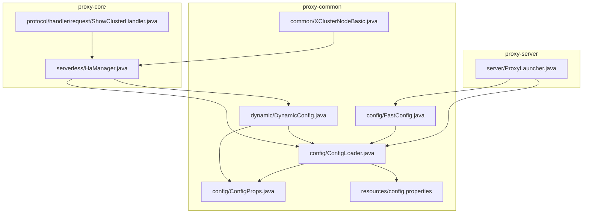
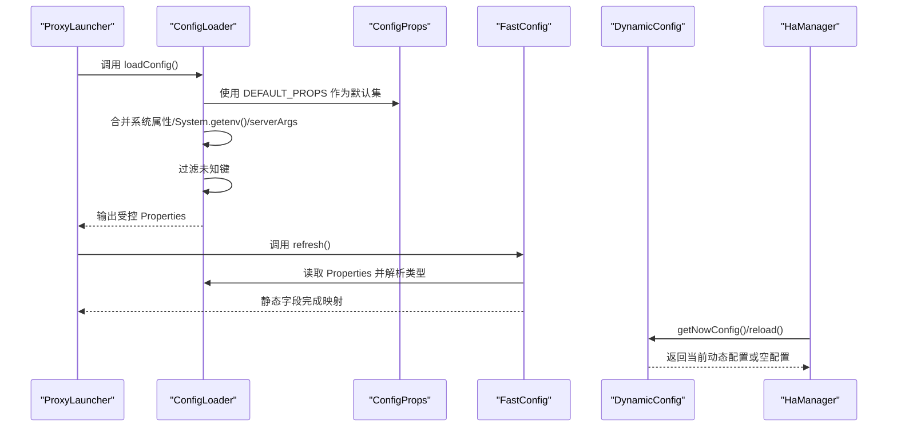
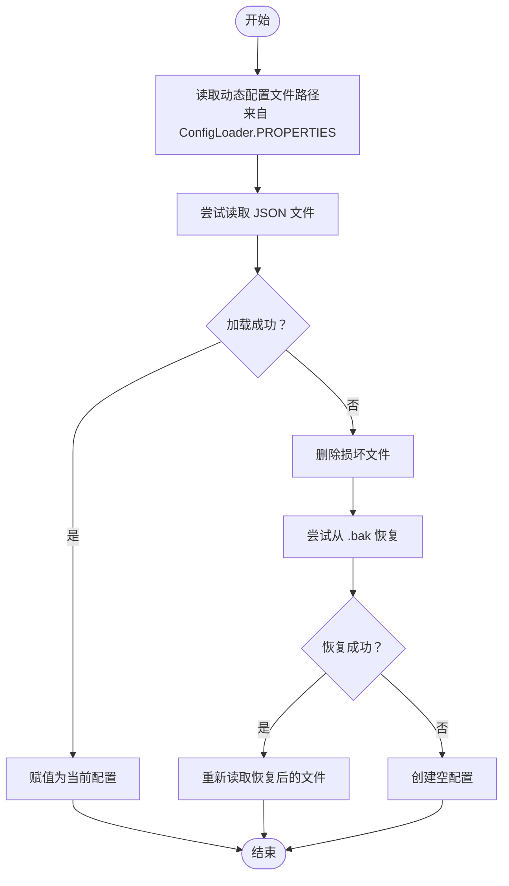
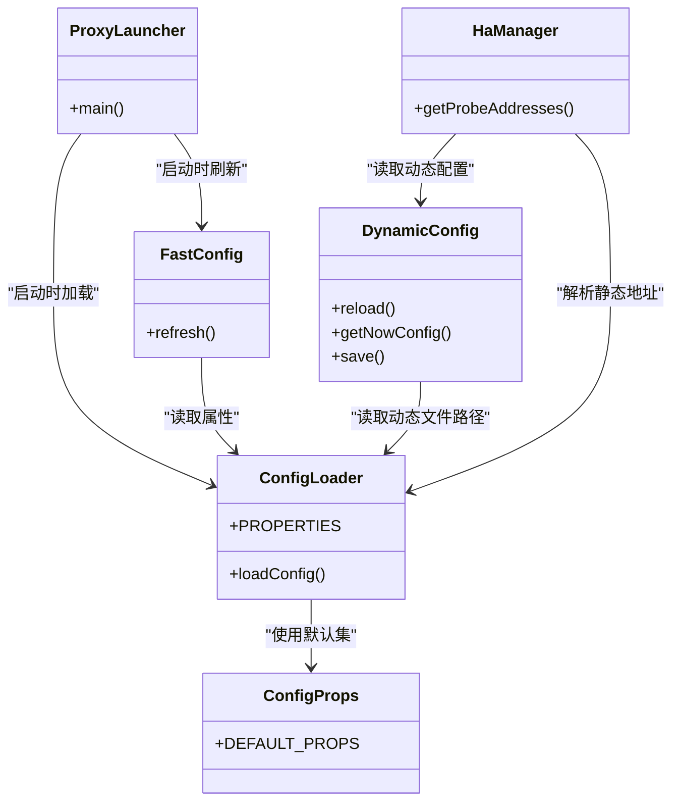

# 配置管理API

<cite>
**本文引用的文件**
- [ConfigLoader.java](file://proxy-common/src/main/java/com/alibaba/polardbx/proxy/config/ConfigLoader.java)
- [FastConfig.java](file://proxy-common/src/main/java/com/alibaba/polardbx/proxy/config/FastConfig.java)
- [DynamicConfig.java](file://proxy-common/src/main/java/com/alibaba/polardbx/proxy/dynamic/DynamicConfig.java)
- [ConfigProps.java](file://proxy-common/src/main/java/com/alibaba/polardbx/proxy/config/ConfigProps.java)
- [config.properties](file://proxy-common/src/main/resources/config.properties)
- [ProxyLauncher.java](file://proxy-server/src/main/java/com/alibaba/polardbx/proxy/server/ProxyLauncher.java)
- [HaManager.java](file://proxy-core/src/main/java/com/alibaba/polardbx/proxy/serverless/HaManager.java)
- [ShowClusterHandler.java](file://proxy-core/src/main/java/com/alibaba/polardbx/proxy/protocol/handler/request/ShowClusterHandler.java)
- [XClusterNodeBasic.java](file://proxy-common/src/main/java/com/alibaba/polardbx/proxy/common/XClusterNodeBasic.java)
</cite>

## 目录
1. [简介](#简介)
2. [项目结构](#项目结构)
3. [核心组件](#核心组件)
4. [架构总览](#架构总览)
5. [组件详解](#组件详解)
6. [依赖关系分析](#依赖关系分析)
7. [性能与缓存机制](#性能与缓存机制)
8. [故障排查指南](#故障排查指南)
9. [结论](#结论)
10. [附录：配置参数速查与最佳实践](#附录配置参数速查与最佳实践)

## 简介
本文件为配置管理API的权威参考，覆盖以下能力：
- ConfigLoader 配置加载器：从多来源合并配置、参数解析与默认值过滤。
- FastConfig 快速配置：将配置映射到静态字段，支持运行时刷新，用于高性能路径读取。
- DynamicConfig 动态配置：基于JSON的动态集群节点列表与持久化，支持热重载与回滚。
- config.properties 全局配置文件：基础参数与默认值来源。
- 配置验证、类型转换与错误处理：统一的参数校验与容错策略。
- 最佳实践与安全建议：参数来源优先级、动态配置文件保护与运维流程。

## 项目结构
配置相关代码主要位于 proxy-common 模块，配合 proxy-server 启动流程与 proxy-core 的动态配置消费端使用。

图表来源
- [ConfigLoader.java](file://proxy-common/src/main/java/com/alibaba/polardbx/proxy/config/ConfigLoader.java#L37-L72)
- [FastConfig.java](file://proxy-common/src/main/java/com/alibaba/polardbx/proxy/config/FastConfig.java#L40-L73)
- [ConfigProps.java](file://proxy-common/src/main/java/com/alibaba/polardbx/proxy/config/ConfigProps.java#L127-L207)
- [config.properties](file://proxy-common/src/main/resources/config.properties#L19-L29)
- [DynamicConfig.java](file://proxy-common/src/main/java/com/alibaba/polardbx/proxy/dynamic/DynamicConfig.java#L69-L129)
- [ProxyLauncher.java](file://proxy-server/src/main/java/com/alibaba/polardbx/proxy/server/ProxyLauncher.java#L32-L56)
- [HaManager.java](file://proxy-core/src/main/java/com/alibaba/polardbx/proxy/serverless/HaManager.java#L158-L573)
- [ShowClusterHandler.java](file://proxy-core/src/main/java/com/alibaba/polardbx/proxy/protocol/handler/request/ShowClusterHandler.java#L56-L86)
- [XClusterNodeBasic.java](file://proxy-common/src/main/java/com/alibaba/polardbx/proxy/common/XClusterNodeBasic.java#L28-L62)

章节来源
- [ConfigLoader.java](file://proxy-common/src/main/java/com/alibaba/polardbx/proxy/config/ConfigLoader.java#L37-L72)
- [FastConfig.java](file://proxy-common/src/main/java/com/alibaba/polardbx/proxy/config/FastConfig.java#L40-L73)
- [ConfigProps.java](file://proxy-common/src/main/java/com/alibaba/polardbx/proxy/config/ConfigProps.java#L127-L207)
- [config.properties](file://proxy-common/src/main/resources/config.properties#L19-L29)
- [DynamicConfig.java](file://proxy-common/src/main/java/com/alibaba/polardbx/proxy/dynamic/DynamicConfig.java#L69-L129)
- [ProxyLauncher.java](file://proxy-server/src/main/java/com/alibaba/polardbx/proxy/server/ProxyLauncher.java#L32-L56)
- [HaManager.java](file://proxy-core/src/main/java/com/alibaba/polardbx/proxy/serverless/HaManager.java#L158-L573)
- [ShowClusterHandler.java](file://proxy-core/src/main/java/com/alibaba/polardbx/proxy/protocol/handler/request/ShowClusterHandler.java#L56-L86)
- [XClusterNodeBasic.java](file://proxy-common/src/main/java/com/alibaba/polardbx/proxy/common/XClusterNodeBasic.java#L28-L62)

## 核心组件
- ConfigLoader：负责从系统属性、环境变量、命令行参数以及资源文件合并配置，并移除未知键，最终输出受控的配置集。
- FastConfig：将常用配置项映射到静态字段，提供快速读取与统一刷新入口，避免每次从Properties查询。
- DynamicConfig：以JSON形式存储动态集群节点信息，支持加载、保存、回滚（.bak）与并发安全访问。
- ConfigProps：集中定义所有受支持的配置键及其默认值，作为ConfigLoader的白名单与FastConfig的映射源。
- config.properties：全局默认配置文件，作为资源文件被ConfigLoader加载。

章节来源
- [ConfigLoader.java](file://proxy-common/src/main/java/com/alibaba/polardbx/proxy/config/ConfigLoader.java#L37-L72)
- [FastConfig.java](file://proxy-common/src/main/java/com/alibaba/polardbx/proxy/config/FastConfig.java#L40-L73)
- [DynamicConfig.java](file://proxy-common/src/main/java/com/alibaba/polardbx/proxy/dynamic/DynamicConfig.java#L69-L129)
- [ConfigProps.java](file://proxy-common/src/main/java/com/alibaba/polardbx/proxy/config/ConfigProps.java#L127-L207)
- [config.properties](file://proxy-common/src/main/resources/config.properties#L19-L29)

## 架构总览
启动阶段的配置初始化与运行期的动态配置消费如下：

图表来源
- [ProxyLauncher.java](file://proxy-server/src/main/java/com/alibaba/polardbx/proxy/server/ProxyLauncher.java#L32-L56)
- [ConfigLoader.java](file://proxy-common/src/main/java/com/alibaba/polardbx/proxy/config/ConfigLoader.java#L37-L72)
- [ConfigProps.java](file://proxy-common/src/main/java/com/alibaba/polardbx/proxy/config/ConfigProps.java#L127-L207)
- [FastConfig.java](file://proxy-common/src/main/java/com/alibaba/polardbx/proxy/config/FastConfig.java#L40-L73)
- [DynamicConfig.java](file://proxy-common/src/main/java/com/alibaba/polardbx/proxy/dynamic/DynamicConfig.java#L69-L129)
- [HaManager.java](file://proxy-core/src/main/java/com/alibaba/polardbx/proxy/serverless/HaManager.java#L158-L573)

## 组件详解

### ConfigLoader 配置加载器
- 加载顺序与来源
  - 优先从系统属性指定的配置文件路径加载。
  - 若未指定，则从类路径加载默认资源文件。
  - 合并系统属性与环境变量。
  - 解析 serverArgs 字符串，按分号拆分多个配置项，再按等号拆分为键值对。
  - 移除不在默认白名单中的键，确保最终配置集可控。
- 参数解析与默认值
  - 默认值来源于 ConfigProps.DEFAULT_PROPS。
  - 所有键值在加载后统一由 FastConfig 刷新为静态字段，便于高性能读取。
- 错误处理
  - serverArgs 格式不合法会抛出运行时异常。
  - 资源文件不存在时仅忽略，不影响系统启动。
- 使用建议
  - 在应用启动早期调用 loadConfig()，随后立即调用 FastConfig.refresh()。
  - 通过系统属性或环境变量覆盖默认值，避免修改打包资源。

章节来源
- [ConfigLoader.java](file://proxy-common/src/main/java/com/alibaba/polardbx/proxy/config/ConfigLoader.java#L37-L72)
- [ConfigProps.java](file://proxy-common/src/main/java/com/alibaba/polardbx/proxy/config/ConfigProps.java#L127-L207)
- [ProxyLauncher.java](file://proxy-server/src/main/java/com/alibaba/polardbx/proxy/server/ProxyLauncher.java#L32-L56)

### FastConfig 快速配置
- 接口与职责
  - 将常用配置项映射为静态可变字段，提供统一刷新入口 refresh()。
  - refresh() 从 ConfigLoader.PROPERTIES 读取并执行类型转换（布尔/整数），实现“零开销”读取。
- 性能特性
  - 静态字段直接读取，避免每次从 Properties 查询与解析。
  - 适合高频路径（如协议层、调度层）直接访问。
- 使用场景
  - 查询重传超时、重试次数与延迟、平滑切换开关与间隔、日志长度限制、最大包大小、泄漏检测等。
- 更新机制
  - 通过 ConfigLoader.loadConfig() 合并新配置后，调用 FastConfig.refresh() 生效。

章节来源
- [FastConfig.java](file://proxy-common/src/main/java/com/alibaba/polardbx/proxy/config/FastConfig.java#L40-L73)
- [ConfigLoader.java](file://proxy-common/src/main/java/com/alibaba/polardbx/proxy/config/ConfigLoader.java#L37-L72)
- [ConfigProps.java](file://proxy-common/src/main/java/com/alibaba/polardbx/proxy/config/ConfigProps.java#L55-L122)

### DynamicConfig 动态配置
- 数据模型
  - 以 JSON 文件存储，典型字段为 XCluster（节点列表）。
  - 使用 Gson 进行序列化/反序列化。
- 加载与回滚
  - reload() 从配置文件读取，若原始文件损坏则尝试从 .bak 恢复；均失败则返回空配置。
  - getNowConfig() 提供懒加载与线程安全访问。
- 保存与备份
  - save() 会先将现有文件重命名为 .bak，再写入新内容，保证原子性与可回滚。
- 运行期集成
  - HaManager 从 DynamicConfig 获取动态节点列表，结合静态配置生成探活地址集合，并在集群状态变化时更新与持久化。

图表来源
- [DynamicConfig.java](file://proxy-common/src/main/java/com/alibaba/polardbx/proxy/dynamic/DynamicConfig.java#L69-L129)
- [ConfigLoader.java](file://proxy-common/src/main/java/com/alibaba/polardbx/proxy/config/ConfigLoader.java#L37-L72)
- [ConfigProps.java](file://proxy-common/src/main/java/com/alibaba/polardbx/proxy/config/ConfigProps.java#L55-L56)

章节来源
- [DynamicConfig.java](file://proxy-common/src/main/java/com/alibaba/polardbx/proxy/dynamic/DynamicConfig.java#L69-L129)
- [HaManager.java](file://proxy-core/src/main/java/com/alibaba/polardbx/proxy/serverless/HaManager.java#L158-L573)
- [ShowClusterHandler.java](file://proxy-core/src/main/java/com/alibaba/polardbx/proxy/protocol/handler/request/ShowClusterHandler.java#L56-L86)
- [XClusterNodeBasic.java](file://proxy-common/src/main/java/com/alibaba/polardbx/proxy/common/XClusterNodeBasic.java#L28-L62)

### config.properties 全局配置文件
- 位置与作用
  - 作为默认资源文件被 ConfigLoader 加载，提供基础参数与默认值。
- 关键参数（节选）
  - 基础与线程：worker_threads、cpus、reactor_factor、cluster_node_id。
  - 前端与后端：frontend_port、backend_address、backend_username、backend_password。
- 使用方式
  - 可通过系统属性或环境变量覆盖。
  - 也可通过 serverArgs 以键值对形式注入。

章节来源
- [config.properties](file://proxy-common/src/main/resources/config.properties#L19-L29)
- [ConfigLoader.java](file://proxy-common/src/main/java/com/alibaba/polardbx/proxy/config/ConfigLoader.java#L37-L72)

## 依赖关系分析
- ConfigLoader 依赖 ConfigProps 的默认集与白名单，确保只保留受控键。
- FastConfig 依赖 ConfigLoader 的 Properties 完成类型转换与映射。
- DynamicConfig 依赖 ConfigLoader 的 Properties 获取动态配置文件路径，并使用 Gson 处理 JSON。
- HaManager 依赖 DynamicConfig 与 ConfigLoader 的后端地址解析，实现动态节点发现与持久化更新。

图表来源
- [ConfigLoader.java](file://proxy-common/src/main/java/com/alibaba/polardbx/proxy/config/ConfigLoader.java#L37-L72)
- [ConfigProps.java](file://proxy-common/src/main/java/com/alibaba/polardbx/proxy/config/ConfigProps.java#L127-L207)
- [FastConfig.java](file://proxy-common/src/main/java/com/alibaba/polardbx/proxy/config/FastConfig.java#L40-L73)
- [DynamicConfig.java](file://proxy-common/src/main/java/com/alibaba/polardbx/proxy/dynamic/DynamicConfig.java#L69-L129)
- [ProxyLauncher.java](file://proxy-server/src/main/java/com/alibaba/polardbx/proxy/server/ProxyLauncher.java#L32-L56)
- [HaManager.java](file://proxy-core/src/main/java/com/alibaba/polardbx/proxy/serverless/HaManager.java#L158-L573)

章节来源
- [ConfigLoader.java](file://proxy-common/src/main/java/com/alibaba/polardbx/proxy/config/ConfigLoader.java#L37-L72)
- [ConfigProps.java](file://proxy-common/src/main/java/com/alibaba/polardbx/proxy/config/ConfigProps.java#L127-L207)
- [FastConfig.java](file://proxy-common/src/main/java/com/alibaba/polardbx/proxy/config/FastConfig.java#L40-L73)
- [DynamicConfig.java](file://proxy-common/src/main/java/com/alibaba/polardbx/proxy/dynamic/DynamicConfig.java#L69-L129)
- [ProxyLauncher.java](file://proxy-server/src/main/java/com/alibaba/polardbx/proxy/server/ProxyLauncher.java#L32-L56)
- [HaManager.java](file://proxy-core/src/main/java/com/alibaba/polardbx/proxy/serverless/HaManager.java#L158-L573)

## 性能与缓存机制
- FastConfig 的静态字段读取避免了字符串键查找与类型转换开销，适合高频路径。
- ConfigLoader 的 Properties 采用受控白名单，减少无效键带来的遍历成本。
- DynamicConfig 的 reload/getNowConfig/save 采用同步与原子重命名（.bak）策略，保障并发安全与数据一致性。
- 建议
  - 对于热点参数，优先通过 FastConfig 访问；非热点参数可通过 ConfigLoader.PROPERTIES 直接读取。
  - 动态配置变更后，及时调用 DynamicConfig.save() 并在业务侧触发必要的刷新逻辑。

[本节为通用性能指导，无需列出具体文件来源]

## 故障排查指南
- 启动失败或配置未生效
  - 检查是否正确调用 ConfigLoader.loadConfig() 与 FastConfig.refresh()。
  - 确认系统属性、环境变量与 serverArgs 的格式正确。
- 动态配置文件损坏
  - reload() 会尝试从 .bak 恢复；若仍失败，将返回空配置。检查 .bak 是否存在且有效。
- 保存失败
  - save() 会在写入前重命名原文件为 .bak，若失败需检查磁盘权限与路径。
- 参数类型错误
  - FastConfig 的类型转换依赖 Properties 字符串，请确保配置值为合法的布尔/整数格式。

章节来源
- [ConfigLoader.java](file://proxy-common/src/main/java/com/alibaba/polardbx/proxy/config/ConfigLoader.java#L37-L72)
- [FastConfig.java](file://proxy-common/src/main/java/com/alibaba/polardbx/proxy/config/FastConfig.java#L40-L73)
- [DynamicConfig.java](file://proxy-common/src/main/java/com/alibaba/polardbx/proxy/dynamic/DynamicConfig.java#L69-L129)

## 结论
本配置管理API通过“加载-映射-动态持久化”的分层设计，实现了高可用、高性能与易维护的配置体系。建议在启动阶段完成配置加载与刷新，在运行期通过 FastConfig 快速读取关键参数，并通过 DynamicConfig 实现动态集群节点的热重载与持久化。

[本节为总结性内容，无需列出具体文件来源]

## 附录：配置参数速查与最佳实践

### 配置参数速查（部分）
- 基础与线程
  - worker_threads：工作线程数
  - cpus：CPU核数（0表示自动探测）
  - reactor_factor：反应堆因子
  - cluster_node_id：集群节点ID
- 前端与后端
  - frontend_port：前端监听端口
  - backend_address：后端地址（支持多地址）
  - backend_username：后端用户名
  - backend_password：后端密码
- 动态配置
  - dynamic_config_file：动态配置文件路径（默认 dynamic.json）

章节来源
- [ConfigProps.java](file://proxy-common/src/main/java/com/alibaba/polardbx/proxy/config/ConfigProps.java#L24-L56)
- [config.properties](file://proxy-common/src/main/resources/config.properties#L19-L29)

### API 使用示例（步骤说明）
- 初始化配置
  - 在启动入口调用 ConfigLoader.loadConfig()，随后调用 FastConfig.refresh()。
  - 示例入口：[ProxyLauncher.java](file://proxy-server/src/main/java/com/alibaba/polardbx/proxy/server/ProxyLauncher.java#L32-L56)
- 读取静态参数
  - 通过 FastConfig 静态字段读取（如 enableConnectionHold、queryRetransmitTimeout 等）。
  - 映射实现：[FastConfig.java](file://proxy-common/src/main/java/com/alibaba/polardbx/proxy/config/FastConfig.java#L40-L73)
- 读取动态参数
  - 通过 DynamicConfig.getNowConfig() 获取当前动态配置，必要时调用 reload()。
  - 保存动态配置：调用 save() 并确保路径可写。
  - 示例调用点：[HaManager.java](file://proxy-core/src/main/java/com/alibaba/polardbx/proxy/serverless/HaManager.java#L158-L573)
- 配置文件位置
  - 默认资源文件：[config.properties](file://proxy-common/src/main/resources/config.properties#L19-L29)
  - 动态配置文件：dynamic.json（默认路径来自 dynamic_config_file）

### 最佳实践与安全建议
- 参数来源优先级
  - 系统属性 > 环境变量 > serverArgs > 资源文件 > 默认值。
- 类型转换与验证
  - 通过 ConfigProps.DEFAULT_PROPS 与 FastConfig 的类型转换，确保参数合法性。
- 动态配置安全
  - 严格控制动态配置文件的读写权限，避免未授权修改。
  - 使用 .bak 回滚机制，变更前做好备份。
- 运维建议
  - 在灰度发布或变更时，先 reload() 再 save()，并观察业务指标。
  - 对关键参数（如平滑切换、日志长度、最大包大小）进行压测与容量评估。

[本节为通用指导，无需列出具体文件来源]