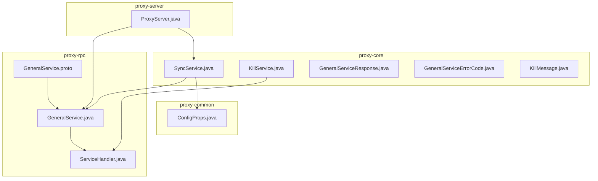
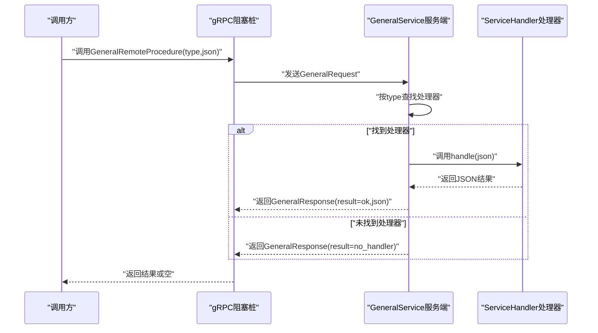
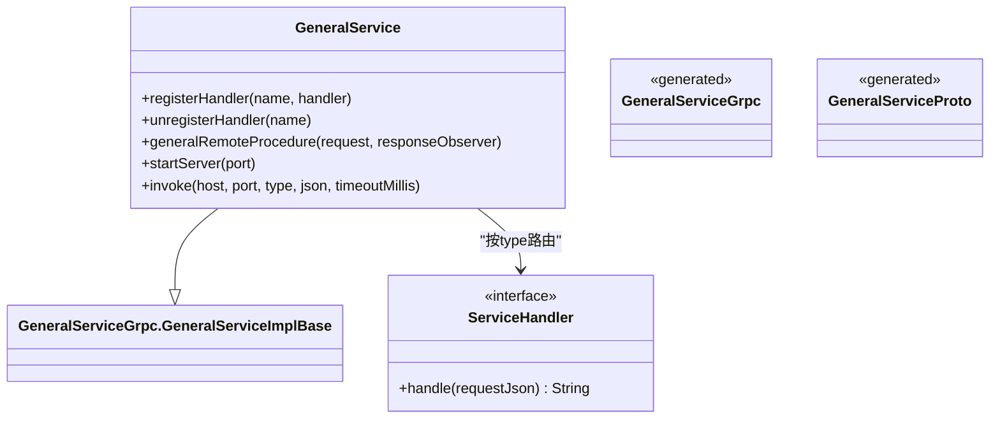
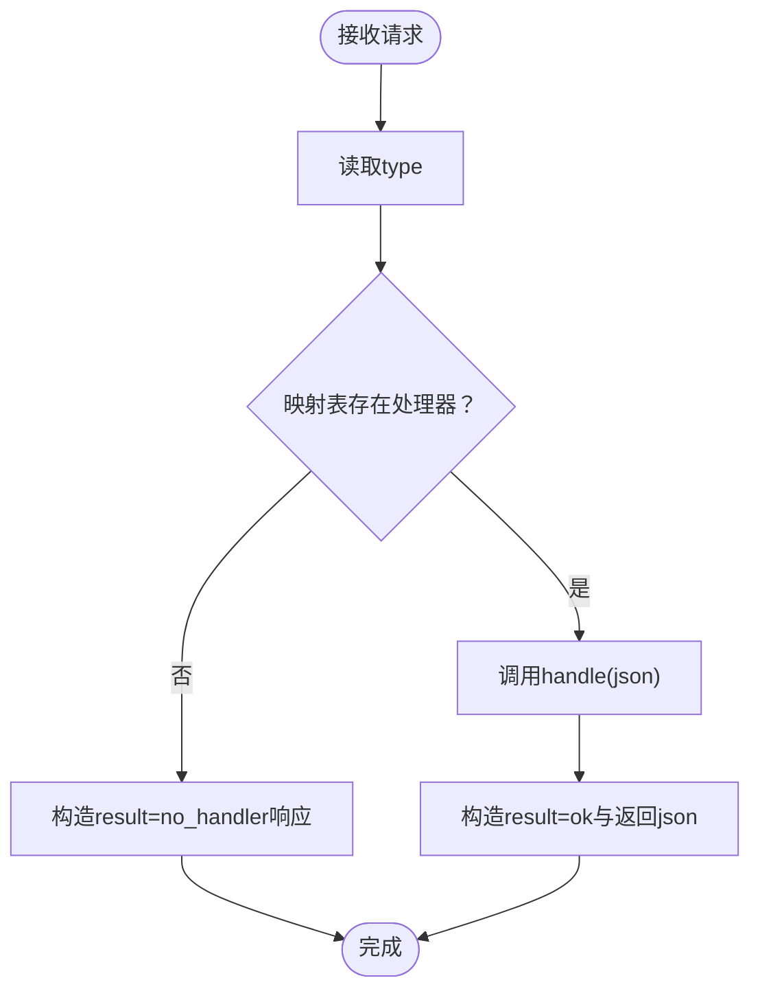
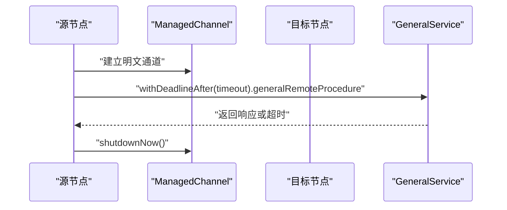
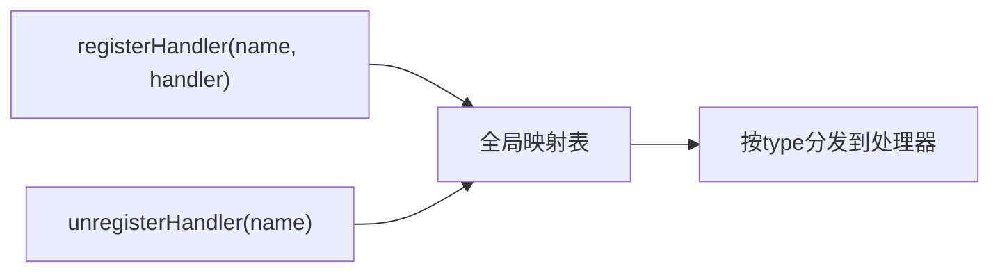
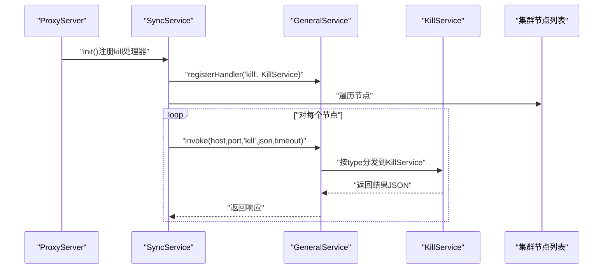
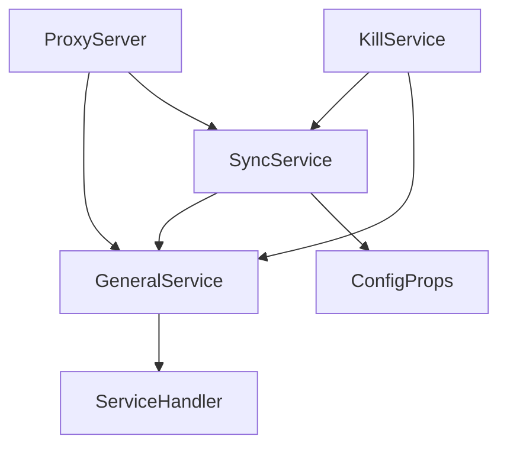

# RPC服务

<cite>
**本文引用的文件**
- [GeneralService.proto](file://proxy-rpc/src/main/proto/GeneralService.proto)
- [GeneralService.java](file://proxy-rpc/src/main/java/com/alibaba/polardbx/proxy/GeneralService.java)
- [ServiceHandler.java](file://proxy-rpc/src/main/java/com/alibaba/polardbx/proxy/ServiceHandler.java)
- [SyncService.java](file://proxy-core/src/main/java/com/alibaba/polardbx/proxy/sync/SyncService.java)
- [KillService.java](file://proxy-core/src/main/java/com/alibaba/polardbx/proxy/sync/KillService.java)
- [GeneralServiceResponse.java](file://proxy-core/src/main/java/com/alibaba/polardbx/proxy/sync/GeneralServiceResponse.java)
- [GeneralServiceErrorCode.java](file://proxy-core/src/main/java/com/alibaba/polardbx/proxy/sync/GeneralServiceErrorCode.java)
- [KillMessage.java](file://proxy-core/src/main/java/com/alibaba/polardbx/proxy/sync/KillMessage.java)
- [ConfigProps.java](file://proxy-common/src/main/java/com/alibaba/polardbx/proxy/config/ConfigProps.java)
- [ProxyServer.java](file://proxy-core/src/main/java/com/alibaba/polardbx/proxy/ProxyServer.java)
- [GeneralServiceTest.java](file://proxy-rpc/src/test/java/com/alibaba/polardbx/proxy/GeneralServiceTest.java)
- [polardbx_proxy_user_manual.md](file://polardbx_proxy_user_manual.md)
</cite>

## 目录
1. [简介](#简介)
2. [项目结构](#项目结构)
3. [核心组件](#核心组件)
4. [架构总览](#架构总览)
5. [组件详解](#组件详解)
6. [依赖关系分析](#依赖关系分析)
7. [性能与监控](#性能与监控)
8. [故障排查指南](#故障排查指南)
9. [结论](#结论)
10. [附录](#附录)

## 简介
本文件面向PolarDB-X Proxy的RPC服务架构，聚焦于通用远程过程调用（gRPC）服务定义与生成接口、服务处理器实现原理、节点间通信协议、服务注册与发现、负载均衡策略、性能与监控、配置参数与超时重试机制，以及与外部系统的集成与API兼容性考量。文档旨在帮助开发者与运维人员快速理解并高效使用RPC能力。

## 项目结构
RPC相关代码主要分布在三个模块：
- proxy-rpc：定义gRPC服务与生成代码、服务端与客户端调用入口
- proxy-core：基于RPC的服务实现（如“杀查询/连接”同步服务）
- proxy-common：通用配置与常量定义

**图表来源**
- [GeneralService.proto](file://proxy-rpc/src/main/proto/GeneralService.proto#L1-L21)
- [GeneralService.java](file://proxy-rpc/src/main/java/com/alibaba/polardbx/proxy/GeneralService.java#L31-L93)
- [ServiceHandler.java](file://proxy-rpc/src/main/java/com/alibaba/polardbx/proxy/ServiceHandler.java#L21-L23)
- [SyncService.java](file://proxy-core/src/main/java/com/alibaba/polardbx/proxy/sync/SyncService.java#L34-L60)
- [KillService.java](file://proxy-core/src/main/java/com/alibaba/polardbx/proxy/sync/KillService.java#L37-L103)
- [GeneralServiceResponse.java](file://proxy-core/src/main/java/com/alibaba/polardbx/proxy/sync/GeneralServiceResponse.java#L24-L35)
- [GeneralServiceErrorCode.java](file://proxy-core/src/main/java/com/alibaba/polardbx/proxy/sync/GeneralServiceErrorCode.java#L21-L24)
- [KillMessage.java](file://proxy-core/src/main/java/com/alibaba/polardbx/proxy/sync/KillMessage.java#L24-L43)
- [ConfigProps.java](file://proxy-common/src/main/java/com/alibaba/polardbx/proxy/config/ConfigProps.java#L190-L194)
- [ProxyServer.java](file://proxy-core/src/main/java/com/alibaba/polardbx/proxy/ProxyServer.java#L82-L85)

**章节来源**
- [GeneralService.proto](file://proxy-rpc/src/main/proto/GeneralService.proto#L1-L21)
- [GeneralService.java](file://proxy-rpc/src/main/java/com/alibaba/polardbx/proxy/GeneralService.java#L31-L93)
- [SyncService.java](file://proxy-core/src/main/java/com/alibaba/polardbx/proxy/sync/SyncService.java#L34-L60)
- [ProxyServer.java](file://proxy-core/src/main/java/com/alibaba/polardbx/proxy/ProxyServer.java#L82-L85)

## 核心组件
- gRPC服务定义与生成接口
  - 服务定义：GeneralService.proto 定义了服务名、方法、请求/响应消息体字段
  - 生成类：由proto编译生成的GeneralServiceGrpc与消息类，供服务端继承与客户端调用
- 服务端实现
  - GeneralService 继承生成的服务基类，维护类型到处理器的映射表，负责请求分发、响应构建与完成回调
- 服务处理器接口
  - ServiceHandler 提供统一的handle接口，具体业务逻辑通过注册到服务端
- 同步服务示例
  - SyncService 注册“kill”处理器，向集群所有节点广播“杀查询/连接”指令
  - KillService 实现ServiceHandler，根据请求解析出进程号与操作类型，执行连接关闭或后端KILL QUERY
- 配置与启动
  - ProxyServer 在启动时初始化同步服务并启动gRPC服务端，端口与超时等参数来自配置

**章节来源**
- [GeneralService.proto](file://proxy-rpc/src/main/proto/GeneralService.proto#L8-L20)
- [GeneralService.java](file://proxy-rpc/src/main/java/com/alibaba/polardbx/proxy/GeneralService.java#L31-L93)
- [ServiceHandler.java](file://proxy-rpc/src/main/java/com/alibaba/polardbx/proxy/ServiceHandler.java#L21-L23)
- [SyncService.java](file://proxy-core/src/main/java/com/alibaba/polardbx/proxy/sync/SyncService.java#L57-L59)
- [KillService.java](file://proxy-core/src/main/java/com/alibaba/polardbx/proxy/sync/KillService.java#L54-L102)
- [ProxyServer.java](file://proxy-core/src/main/java/com/alibaba/polardbx/proxy/ProxyServer.java#L82-L85)

## 架构总览
RPC服务采用gRPC作为传输层，服务端通过类型路由到具体处理器；客户端通过阻塞桩发起调用并设置超时；同步服务通过遍历集群节点并行发送RPC请求，实现跨节点的一致性控制。

**图表来源**
- [GeneralService.java](file://proxy-rpc/src/main/java/com/alibaba/polardbx/proxy/GeneralService.java#L44-L65)
- [ServiceHandler.java](file://proxy-rpc/src/main/java/com/alibaba/polardbx/proxy/ServiceHandler.java#L21-L23)

## 组件详解

### gRPC服务定义与生成接口
- 服务定义
  - 服务名：GeneralService
  - 方法：GeneralRemoteProcedure(GeneralRequest) -> GeneralResponse
  - 请求消息：type（字符串）、json（字符串）
  - 响应消息：result（字符串）、json（字符串）
- 生成接口
  - 服务端继承生成的GeneralServiceImplBase，实现方法分发
  - 客户端使用生成的BlockingStub进行同步调用

**图表来源**
- [GeneralService.java](file://proxy-rpc/src/main/java/com/alibaba/polardbx/proxy/GeneralService.java#L31-L93)
- [ServiceHandler.java](file://proxy-rpc/src/main/java/com/alibaba/polardbx/proxy/ServiceHandler.java#L21-L23)
- [GeneralService.proto](file://proxy-rpc/src/main/proto/GeneralService.proto#L8-L20)

**章节来源**
- [GeneralService.proto](file://proxy-rpc/src/main/proto/GeneralService.proto#L8-L20)
- [GeneralService.java](file://proxy-rpc/src/main/java/com/alibaba/polardbx/proxy/GeneralService.java#L31-L93)

### 服务处理器实现原理
- 请求处理
  - 服务端从请求中提取type，并在处理器映射表中查找对应ServiceHandler
  - 若未找到，返回result=no_handler；若找到，调用handle(json)，并将返回的JSON封装为响应
- 响应构建
  - 成功：result=ok，json为处理器返回的业务JSON
  - 失败：result=no_handler，json为空
- 错误处理
  - 未找到处理器时直接返回失败响应
  - 处理器内部异常由调用方捕获并转换为错误响应JSON

**图表来源**
- [GeneralService.java](file://proxy-rpc/src/main/java/com/alibaba/polardbx/proxy/GeneralService.java#L44-L65)

**章节来源**
- [GeneralService.java](file://proxy-rpc/src/main/java/com/alibaba/polardbx/proxy/GeneralService.java#L44-L65)

### 节点间通信协议与序列化
- 传输层：gRPC（基于HTTP/2），默认明文通道
- 消息格式：Protocol Buffers（proto3），字段为字符串类型，便于通用性
- 序列化方式：proto3编码，客户端与服务端通过生成的Java类进行序列化/反序列化
- 传输优化：使用阻塞桩与超时控制，避免长时间等待；客户端在finally中主动关闭channel

**图表来源**
- [GeneralService.java](file://proxy-rpc/src/main/java/com/alibaba/polardbx/proxy/GeneralService.java#L74-L92)

**章节来源**
- [GeneralService.java](file://proxy-rpc/src/main/java/com/alibaba/polardbx/proxy/GeneralService.java#L74-L92)

### 服务注册与发现
- 注册机制
  - 通过静态方法registerHandler(name, handler)将处理器注册到全局映射表
  - 通过unregisterHandler(name)移除处理器
- 发现与调用
  - 服务端按请求type在映射表中查找处理器
  - 同步服务通过集群节点列表遍历，对每个节点发起RPC调用

**图表来源**
- [GeneralService.java](file://proxy-rpc/src/main/java/com/alibaba/polardbx/proxy/GeneralService.java#L36-L42)
- [SyncService.java](file://proxy-core/src/main/java/com/alibaba/polardbx/proxy/sync/SyncService.java#L43-L54)

**章节来源**
- [GeneralService.java](file://proxy-rpc/src/main/java/com/alibaba/polardbx/proxy/GeneralService.java#L36-L42)
- [SyncService.java](file://proxy-core/src/main/java/com/alibaba/polardbx/proxy/sync/SyncService.java#L43-L54)

### 负载均衡策略
- 当前实现
  - 同步服务通过遍历集群节点列表逐个发送RPC请求，属于轮询式广播
  - 未内置gRPC负载均衡插件或服务发现组件
- 建议
  - 在多节点部署场景下，结合外部服务发现（如Zookeeper/Consul）与gRPC负载均衡策略（如round_robin），可进一步提升可用性与吞吐

**章节来源**
- [SyncService.java](file://proxy-core/src/main/java/com/alibaba/polardbx/proxy/sync/SyncService.java#L43-L54)

### “杀查询/连接”同步服务示例
- 触发路径
  - ProxyServer启动时调用SyncService.init()注册“kill”处理器
  - SyncService.kill()从节点列表中遍历节点，提交任务并发执行RPC调用
- 处理流程
  - KillService解析请求，定位前端连接或后端连接，执行关闭或KILL QUERY
  - 返回统一的JSON响应对象，包含错误码与信息

**图表来源**
- [ProxyServer.java](file://proxy-core/src/main/java/com/alibaba/polardbx/proxy/ProxyServer.java#L82-L85)
- [SyncService.java](file://proxy-core/src/main/java/com/alibaba/polardbx/proxy/sync/SyncService.java#L57-L59)
- [GeneralService.java](file://proxy-rpc/src/main/java/com/alibaba/polardbx/proxy/GeneralService.java#L36-L42)
- [KillService.java](file://proxy-core/src/main/java/com/alibaba/polardbx/proxy/sync/KillService.java#L54-L102)

**章节来源**
- [ProxyServer.java](file://proxy-core/src/main/java/com/alibaba/polardbx/proxy/ProxyServer.java#L82-L85)
- [SyncService.java](file://proxy-core/src/main/java/com/alibaba/polardbx/proxy/sync/SyncService.java#L39-L59)
- [KillService.java](file://proxy-core/src/main/java/com/alibaba/polardbx/proxy/sync/KillService.java#L54-L102)

## 依赖关系分析
- 组件耦合
  - GeneralService依赖ServiceHandler接口，通过映射表实现松耦合
  - SyncService依赖ConfigProps读取超时与端口配置，依赖NodeWatchdog获取节点列表
  - ProxyServer负责启动RPC服务端与同步服务
- 外部依赖
  - gRPC运行时、Protocol Buffers、Gson用于序列化与JSON处理
  - 日志框架用于错误记录

**图表来源**
- [GeneralService.java](file://proxy-rpc/src/main/java/com/alibaba/polardbx/proxy/GeneralService.java#L31-L93)
- [SyncService.java](file://proxy-core/src/main/java/com/alibaba/polardbx/proxy/sync/SyncService.java#L34-L60)
- [ProxyServer.java](file://proxy-core/src/main/java/com/alibaba/polardbx/proxy/ProxyServer.java#L82-L85)

**章节来源**
- [GeneralService.java](file://proxy-rpc/src/main/java/com/alibaba/polardbx/proxy/GeneralService.java#L31-L93)
- [SyncService.java](file://proxy-core/src/main/java/com/alibaba/polardbx/proxy/sync/SyncService.java#L34-L60)
- [ProxyServer.java](file://proxy-core/src/main/java/com/alibaba/polardbx/proxy/ProxyServer.java#L82-L85)

## 性能与监控
- 性能特性
  - 明文gRPC通道，避免TLS开销；使用阻塞桩简化调用模型
  - 超时控制：客户端设置deadline，防止长时间阻塞
  - 广播调用：同步服务对所有节点并发发送，适合一致性控制但可能带来额外网络压力
- 监控指标建议
  - RPC调用QPS、P99/P999延迟、失败率（result=no_handler或异常）
  - 超时次数、处理器耗时分布
  - 节点存活与连通性指标
- 优化建议
  - 对高频调用引入连接复用与重用
  - 使用gRPC负载均衡与服务发现，减少单点压力
  - 将广播改为按需选择目标节点，降低网络开销

[本节为通用性能讨论，无需特定文件分析]

## 故障排查指南
- 常见问题
  - 未注册处理器：返回result=no_handler，检查registerHandler调用
  - 调用超时：检查general_service_timeout配置与网络状况
  - 节点不可达：确认节点列表与端口配置，验证防火墙策略
- 排查步骤
  - 查看系统日志，定位异常堆栈
  - 核对配置项general_service_port与general_service_timeout
  - 使用单元测试验证本地RPC调用链路

**章节来源**
- [GeneralServiceTest.java](file://proxy-rpc/src/test/java/com/alibaba/polardbx/proxy/GeneralServiceTest.java#L24-L35)
- [ConfigProps.java](file://proxy-common/src/main/java/com/alibaba/polardbx/proxy/config/ConfigProps.java#L190-L194)

## 结论
PolarDB-X Proxy的RPC服务以gRPC为基础，通过简单的类型路由实现灵活的服务扩展。同步服务示例展示了跨节点广播调用的典型用法。通过合理配置超时与端口、结合外部服务发现与负载均衡，可在保证一致性的同时提升整体性能与可用性。

[本节为总结性内容，无需特定文件分析]

## 附录

### 配置参数与超时设置
- general_service_port：RPC服务端口，默认8083
- general_service_timeout：RPC调用超时，默认3000ms
- frontend_port：前端MySQL接入端口，默认3307

**章节来源**
- [ConfigProps.java](file://proxy-common/src/main/java/com/alibaba/polardbx/proxy/config/ConfigProps.java#L190-L194)
- [polardbx_proxy_user_manual.md](file://polardbx_proxy_user_manual.md#L449-L509)

### 重试机制
- 当前实现未内置自动重试；可通过调用方在业务侧增加重试逻辑
- 建议结合指数退避策略与最大重试次数，避免雪崩

[本节为通用指导，无需特定文件分析]

### 使用示例与集成指南
- 服务端启动
  - 在ProxyServer初始化阶段启动RPC服务端
- 注册处理器
  - 通过registerHandler注册业务处理器
- 客户端调用
  - 使用BlockingStub发起调用，设置超时，解析result与json
- 同步服务示例
  - 通过SyncService.init注册“kill”，在业务中调用SyncService.kill广播

**章节来源**
- [ProxyServer.java](file://proxy-core/src/main/java/com/alibaba/polardbx/proxy/ProxyServer.java#L82-L85)
- [SyncService.java](file://proxy-core/src/main/java/com/alibaba/polardbx/proxy/sync/SyncService.java#L57-L59)
- [GeneralServiceTest.java](file://proxy-rpc/src/test/java/com/alibaba/polardbx/proxy/GeneralServiceTest.java#L24-L35)

### 与外部系统的集成与API兼容性
- 协议兼容性
  - 使用标准gRPC与proto3，便于与多种语言客户端互通
- 安全性
  - 默认明文通道，生产环境建议启用TLS与认证
- 可扩展性
  - 通过ServiceHandler接口扩展新类型，保持服务端稳定不变

[本节为概念性说明，无需特定文件分析]