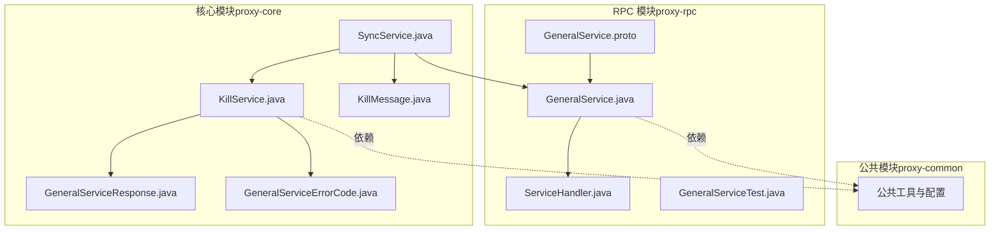
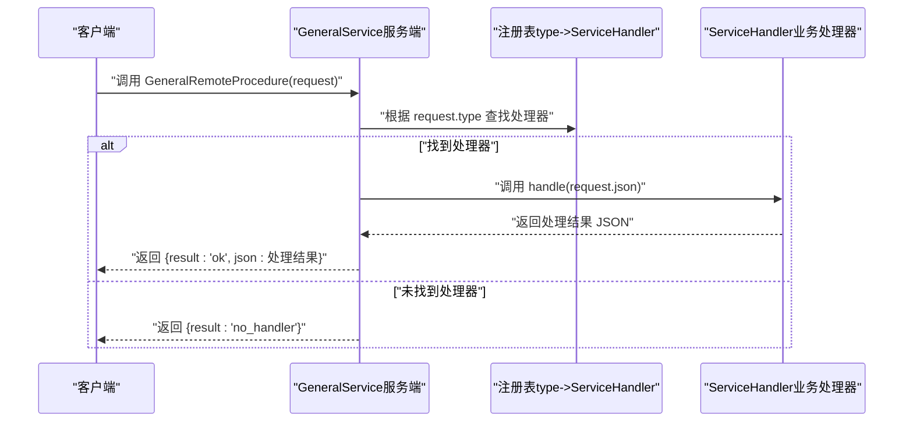
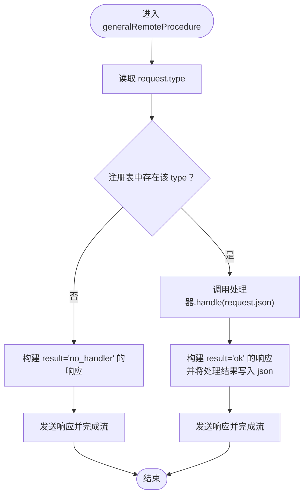
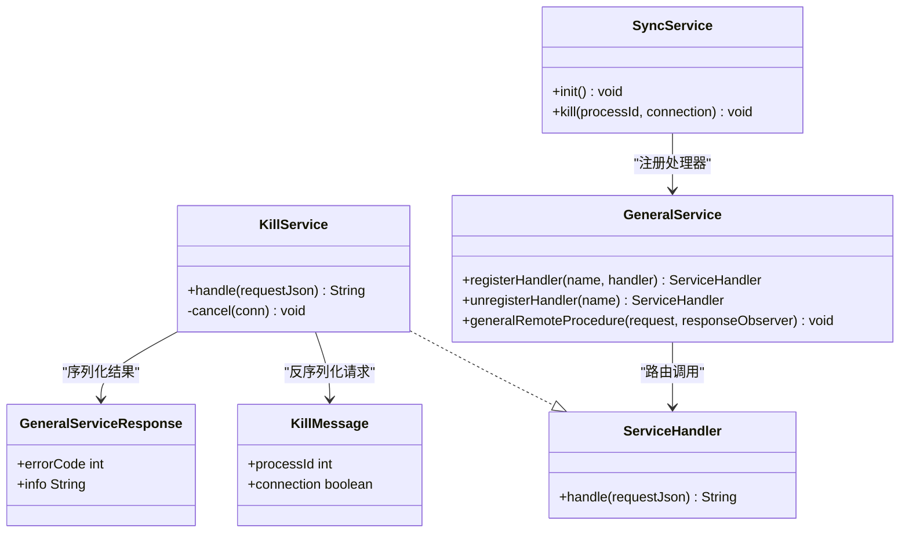
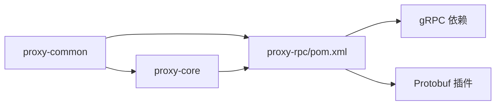

# 服务定义与实现

<cite>
**本文引用的文件**   
- [GeneralService.proto](file://proxy-rpc/src/main/proto/GeneralService.proto)
- [GeneralService.java](file://proxy-rpc/src/main/java/com/alibaba/polardbx/proxy/GeneralService.java)
- [ServiceHandler.java](file://proxy-rpc/src/main/java/com/alibaba/polardbx/proxy/ServiceHandler.java)
- [GeneralServiceTest.java](file://proxy-rpc/src/test/java/com/alibaba/polardbx/proxy/GeneralServiceTest.java)
- [SyncService.java](file://proxy-core/src/main/java/com/alibaba/polardbx/proxy/sync/SyncService.java)
- [KillService.java](file://proxy-core/src/main/java/com/alibaba/polardbx/proxy/sync/KillService.java)
- [GeneralServiceResponse.java](file://proxy-core/src/main/java/com/alibaba/polardbx/proxy/sync/GeneralServiceResponse.java)
- [GeneralServiceErrorCode.java](file://proxy-core/src/main/java/com/alibaba/polardbx/proxy/sync/GeneralServiceErrorCode.java)
- [KillMessage.java](file://proxy-core/src/main/java/com/alibaba/polardbx/proxy/sync/KillMessage.java)
- [pom.xml](file://pom.xml)
- [proxy-rpc/pom.xml](file://proxy-rpc/pom.xml)
</cite>

## 目录
1. [简介](#简介)
2. [项目结构](#项目结构)
3. [核心组件](#核心组件)
4. [架构总览](#架构总览)
5. [组件详解](#组件详解)
6. [依赖关系分析](#依赖关系分析)
7. [性能考量](#性能考量)
8. [故障排查指南](#故障排查指南)
9. [结论](#结论)
10. [附录](#附录)

## 简介
本文件围绕 PolarDB-X Proxy 的 RPC 通用服务进行系统化说明，重点覆盖以下方面：
- 服务接口定义：基于 Protocol Buffers 的 GeneralService.proto，明确 RPC 方法、请求/响应消息结构。
- Java 实现：服务端 GeneralService 的实现原理、请求处理流程、业务分发与响应生成。
- 业务处理器：ServiceHandler 接口及其实现（以 KillService 为例），展示如何扩展新服务类型。
- 设计原则与扩展性：通过“type”路由与注册表实现松耦合扩展。
- 最佳实践与性能优化：线程模型、超时控制、连接复用与序列化策略。
- 版本管理与向后兼容：协议演进与兼容性策略建议。

## 项目结构
本仓库采用多模块 Maven 结构，RPC 服务定义与实现位于 proxy-rpc 模块，同步/集群控制逻辑位于 proxy-core 模块，公共能力在 proxy-common 中。RPC 服务使用 gRPC 作为传输层，通过 protobuf 定义接口与数据结构。

图表来源
- [GeneralService.proto](file://proxy-rpc/src/main/proto/GeneralService.proto#L1-L21)
- [GeneralService.java](file://proxy-rpc/src/main/java/com/alibaba/polardbx/proxy/GeneralService.java#L31-L93)
- [ServiceHandler.java](file://proxy-rpc/src/main/java/com/alibaba/polardbx/proxy/ServiceHandler.java#L21-L23)
- [SyncService.java](file://proxy-core/src/main/java/com/alibaba/polardbx/proxy/sync/SyncService.java#L34-L60)
- [KillService.java](file://proxy-core/src/main/java/com/alibaba/polardbx/proxy/sync/KillService.java#L37-L103)
- [GeneralServiceResponse.java](file://proxy-core/src/main/java/com/alibaba/polardbx/proxy/sync/GeneralServiceResponse.java#L24-L35)
- [GeneralServiceErrorCode.java](file://proxy-core/src/main/java/com/alibaba/polardbx/proxy/sync/GeneralServiceErrorCode.java#L21-L24)
- [KillMessage.java](file://proxy-core/src/main/java/com/alibaba/polardbx/proxy/sync/KillMessage.java#L24-L43)

章节来源
- [pom.xml](file://pom.xml#L30-L37)
- [proxy-rpc/pom.xml](file://proxy-rpc/pom.xml#L38-L97)

## 核心组件
- 服务接口定义（Protocol Buffers）
  - 服务：GeneralService
  - 方法：GeneralRemoteProcedure
  - 请求：GeneralRequest（字段：type、json）
  - 响应：GeneralResponse（字段：result、json）
- 服务端实现（gRPC）
  - GeneralService 继承自生成的 GeneralServiceImplBase，提供方法实现与静态工具。
  - 内置常量：成功结果标记与无处理器结果标记。
  - 注册表：ConcurrentHashMap<String, ServiceHandler>，按 type 路由到具体处理器。
- 处理器接口
  - ServiceHandler.handle(String requestJson)：统一的业务处理入口。
- 示例处理器
  - KillService：实现“kill”类型的业务处理，支持终止连接或查询。
- 同步服务集成
  - SyncService：负责在集群节点间广播调用，注册“kill”处理器。

章节来源
- [GeneralService.proto](file://proxy-rpc/src/main/proto/GeneralService.proto#L8-L20)
- [GeneralService.java](file://proxy-rpc/src/main/java/com/alibaba/polardbx/proxy/GeneralService.java#L31-L93)
- [ServiceHandler.java](file://proxy-rpc/src/main/java/com/alibaba/polardbx/proxy/ServiceHandler.java#L21-L23)
- [SyncService.java](file://proxy-core/src/main/java/com/alibaba/polardbx/proxy/sync/SyncService.java#L34-L60)
- [KillService.java](file://proxy-core/src/main/java/com/alibaba/polardbx/proxy/sync/KillService.java#L37-L103)

## 架构总览
下图展示了从客户端发起调用到服务端执行业务处理的整体流程，以及处理器注册与分发机制。

图表来源
- [GeneralService.java](file://proxy-rpc/src/main/java/com/alibaba/polardbx/proxy/GeneralService.java#L44-L65)
- [ServiceHandler.java](file://proxy-rpc/src/main/java/com/alibaba/polardbx/proxy/ServiceHandler.java#L21-L23)

## 组件详解

### 服务接口定义（Protocol Buffers）
- 文件位置：proxy-rpc/src/main/proto/GeneralService.proto
- 关键点
  - 服务与方法：定义了单方法 RPC 服务 GeneralService，方法名为 GeneralRemoteProcedure。
  - 请求消息 GeneralRequest：包含两个字段
    - type：字符串，用于标识业务类型（如“kill”）。
    - json：字符串，承载业务请求的 JSON 数据。
  - 响应消息 GeneralResponse：包含两个字段
    - result：字符串，表示本次调用是否成功（约定值“ok”或“no_handler”）。
    - json：字符串，承载业务处理结果的 JSON 数据（当 result=“ok”时有效）。

章节来源
- [GeneralService.proto](file://proxy-rpc/src/main/proto/GeneralService.proto#L8-L20)

### 服务端实现（GeneralService）
- 类职责
  - 提供 gRPC 服务端实现，接收请求并分发给对应处理器。
  - 提供静态工具：启动服务器、注册/注销处理器、远程调用客户端。
- 关键实现要点
  - 处理器注册表：ConcurrentHashMap<String, ServiceHandler>，并发安全，支持动态注册与注销。
  - 请求处理流程：
    - 读取 request.type，从注册表查找处理器。
    - 若未找到：构造 result=“no_handler”的响应。
    - 若找到：调用处理器的 handle(request.json)，将返回的 JSON 设置到响应的 json 字段，并设置 result=“ok”。
  - 静态方法
    - startServer：启动 gRPC 服务器。
    - registerHandler/unregisterHandler：注册/注销处理器。
    - invoke：客户端阻塞式调用，设置超时并解析响应。

图表来源
- [GeneralService.java](file://proxy-rpc/src/main/java/com/alibaba/polardbx/proxy/GeneralService.java#L44-L65)

章节来源
- [GeneralService.java](file://proxy-rpc/src/main/java/com/alibaba/polardbx/proxy/GeneralService.java#L31-L93)

### 处理器接口（ServiceHandler）
- 接口定义：handle(String requestJson) -> String
- 设计原则
  - 统一输入输出格式：请求与响应均以 JSON 字符串传递，便于跨语言与跨模块协作。
  - 单一职责：每个处理器专注一种业务类型（如“kill”）。
- 扩展方式
  - 实现 ServiceHandler 并通过 GeneralService.registerHandler(type, handler) 注册。
  - 可在运行时动态替换处理器，支持灰度与热更新。

章节来源
- [ServiceHandler.java](file://proxy-rpc/src/main/java/com/alibaba/polardbx/proxy/ServiceHandler.java#L21-L23)

### 典型处理器实现（KillService）
- 业务目标：终止指定前端连接或其正在执行的查询。
- 关键流程
  - 解析请求 JSON 为 KillMessage（包含 process_id 与 connection 标志）。
  - 在全局前端连接集合中定位匹配的连接。
  - 若标志为连接级：直接关闭连接；否则：在事务上下文中查找读写/只读后端连接，发送 KILL QUERY。
  - 将处理结果封装为 GeneralServiceResponse（含错误码与信息），再序列化为 JSON 返回。
- 错误处理
  - 捕获异常并返回错误码与错误信息，避免影响其他节点。

图表来源
- [ServiceHandler.java](file://proxy-rpc/src/main/java/com/alibaba/polardbx/proxy/ServiceHandler.java#L21-L23)
- [KillService.java](file://proxy-core/src/main/java/com/alibaba/polardbx/proxy/sync/KillService.java#L37-L103)
- [GeneralService.java](file://proxy-rpc/src/main/java/com/alibaba/polardbx/proxy/GeneralService.java#L36-L42)
- [SyncService.java](file://proxy-core/src/main/java/com/alibaba/polardbx/proxy/sync/SyncService.java#L57-L59)
- [KillMessage.java](file://proxy-core/src/main/java/com/alibaba/polardbx/proxy/sync/KillMessage.java#L24-L43)
- [GeneralServiceResponse.java](file://proxy-core/src/main/java/com/alibaba/polardbx/proxy/sync/GeneralServiceResponse.java#L24-L35)

章节来源
- [KillService.java](file://proxy-core/src/main/java/com/alibaba/polardbx/proxy/sync/KillService.java#L53-L102)
- [SyncService.java](file://proxy-core/src/main/java/com/alibaba/polardbx/proxy/sync/SyncService.java#L39-L59)

### 同步服务集成（SyncService）
- 职责
  - 在集群节点间广播“kill”指令，实现跨节点的统一控制。
  - 初始化阶段注册“kill”处理器。
- 调用链
  - 通过 AddressDecoder 解析节点地址，使用 GeneralService.invoke 发起 RPC 调用。
  - 使用配置项控制超时时间，确保调用不会无限等待。

章节来源
- [SyncService.java](file://proxy-core/src/main/java/com/alibaba/polardbx/proxy/sync/SyncService.java#L39-L59)

### 测试用例（GeneralServiceTest）
- 验证点
  - 启动本地 gRPC 服务端。
  - 注册一个临时处理器，验证请求转发与响应返回。
  - 注销处理器并确认可再次注册。

章节来源
- [GeneralServiceTest.java](file://proxy-rpc/src/test/java/com/alibaba/polardbx/proxy/GeneralServiceTest.java#L24-L35)

## 依赖关系分析
- 模块依赖
  - proxy-rpc 依赖 proxy-common（公共工具与配置）。
  - proxy-core 依赖 proxy-common（连接池、事务上下文等）。
- RPC 运行时依赖
  - gRPC：grpc-netty-shaded、grpc-protobuf、grpc-stub。
  - Protobuf：protoc 与 protoc-gen-grpc-java 插件。
- 业务依赖
  - Gson：用于 JSON 序列化/反序列化。
  - SLF4J/Logback：日志记录。

图表来源
- [pom.xml](file://pom.xml#L56-L144)
- [proxy-rpc/pom.xml](file://proxy-rpc/pom.xml#L38-L97)

章节来源
- [pom.xml](file://pom.xml#L56-L144)
- [proxy-rpc/pom.xml](file://proxy-rpc/pom.xml#L38-L97)

## 性能考量
- 并发与线程模型
  - 处理器注册表使用 ConcurrentHashMap，支持高并发注册/查找。
  - gRPC 默认线程模型适合 IO 密集型场景；若业务耗 CPU，可结合线程池策略。
- 超时与资源释放
  - 客户端调用设置超时，避免长时间阻塞。
  - 通道在 finally 中强制关闭，防止资源泄漏。
- 序列化开销
  - JSON 字符串作为统一载体，避免频繁的二进制编解码；但需注意 JSON 大小与解析成本。
- 连接与网络
  - 服务端 Channel 为一次性短连接，适合低频调用；高频调用建议引入连接池或长连接方案。
- 扩展性
  - 通过“type”路由与注册表实现松耦合，新增业务无需修改核心代码。

## 故障排查指南
- 常见问题与定位
  - “no_handler”响应：检查是否已通过 registerHandler 注册对应 type 的处理器。
  - 调用超时：检查目标节点监听端口、网络连通性与超时配置。
  - JSON 解析失败：核对请求 JSON 结构与处理器期望对象一致。
  - 异常返回：查看处理器返回的错误码与信息，结合日志定位根因。
- 日志与监控
  - 使用 SLF4J 记录关键路径日志，便于问题回溯。
  - 对跨节点调用，可在 SyncService 层增加重试与熔断策略（建议）。

章节来源
- [GeneralService.java](file://proxy-rpc/src/main/java/com/alibaba/polardbx/proxy/GeneralService.java#L51-L61)
- [KillService.java](file://proxy-core/src/main/java/com/alibaba/polardbx/proxy/sync/KillService.java#L98-L101)
- [SyncService.java](file://proxy-core/src/main/java/com/alibaba/polardbx/proxy/sync/SyncService.java#L49-L53)

## 结论
本 RPC 通用服务通过简洁的协议与统一的处理器接口，实现了跨模块、跨节点的可扩展控制面能力。其设计遵循“协议稳定、实现灵活”的原则，既满足当前“kill”类控制指令的需求，也为未来扩展更多业务类型提供了清晰路径。建议在生产环境中配合超时控制、日志监控与必要的重试/熔断策略，以进一步提升稳定性与可观测性。

## 附录

### 协议与数据模型
- 服务与方法
  - 服务：GeneralService
  - 方法：GeneralRemoteProcedure
- 请求与响应
  - GeneralRequest：type（业务类型）、json（请求体）
  - GeneralResponse：result（结果状态）、json（响应体）

章节来源
- [GeneralService.proto](file://proxy-rpc/src/main/proto/GeneralService.proto#L8-L20)

### 版本管理与向后兼容策略（建议）
- 协议演进
  - 新增字段建议使用可选字段并保持默认值语义，避免破坏旧客户端解析。
  - 不建议删除或重用已有字段编号，以保证历史数据兼容。
- 业务类型扩展
  - 新增业务类型时，仅新增处理器与注册逻辑，不改动现有接口。
  - 对于需要变更的既有类型，建议引入版本号字段并在处理器内部做分支兼容。
- 客户端与服务端
  - 服务端保留对旧版本请求的解析能力，逐步淘汰不再支持的旧版本。
  - 客户端在升级时可同时推送新版本处理器，实现平滑过渡。