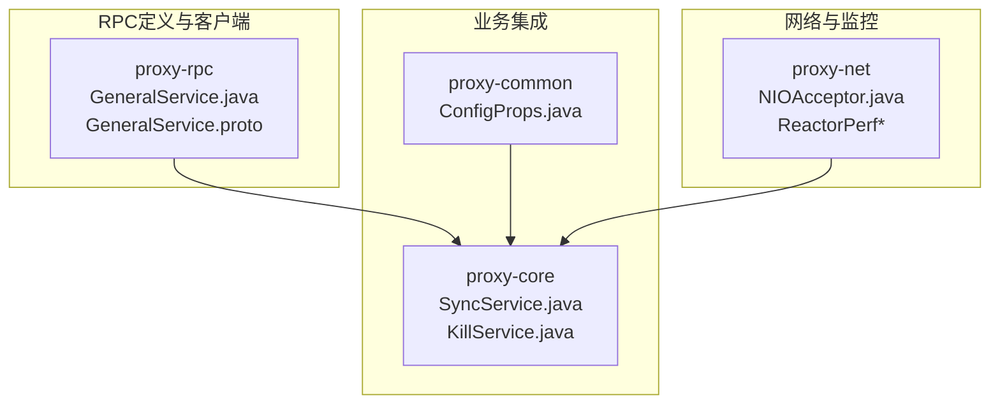
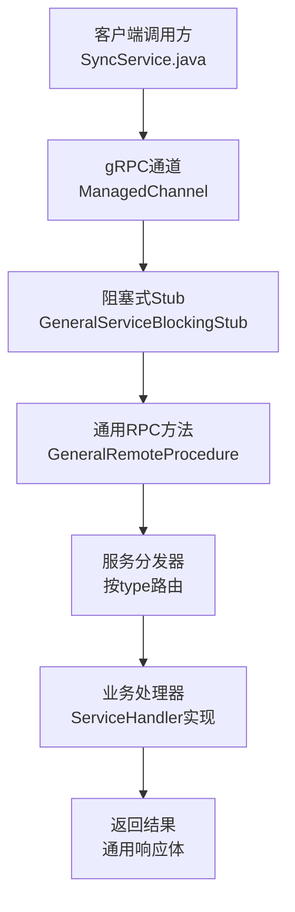
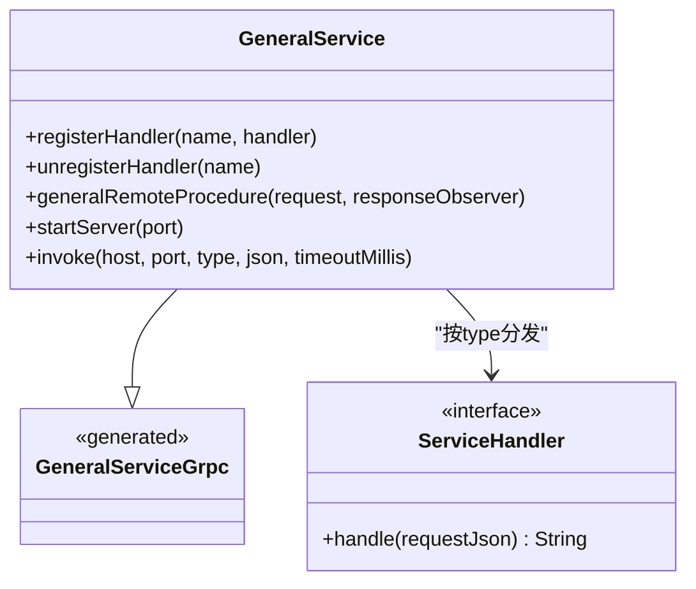
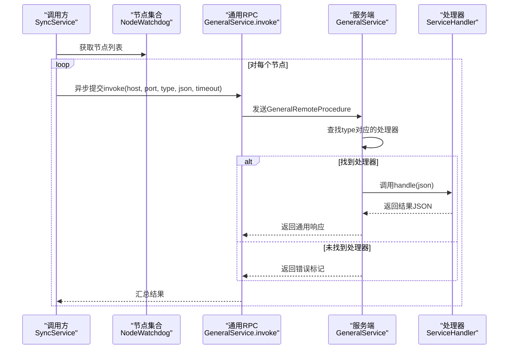
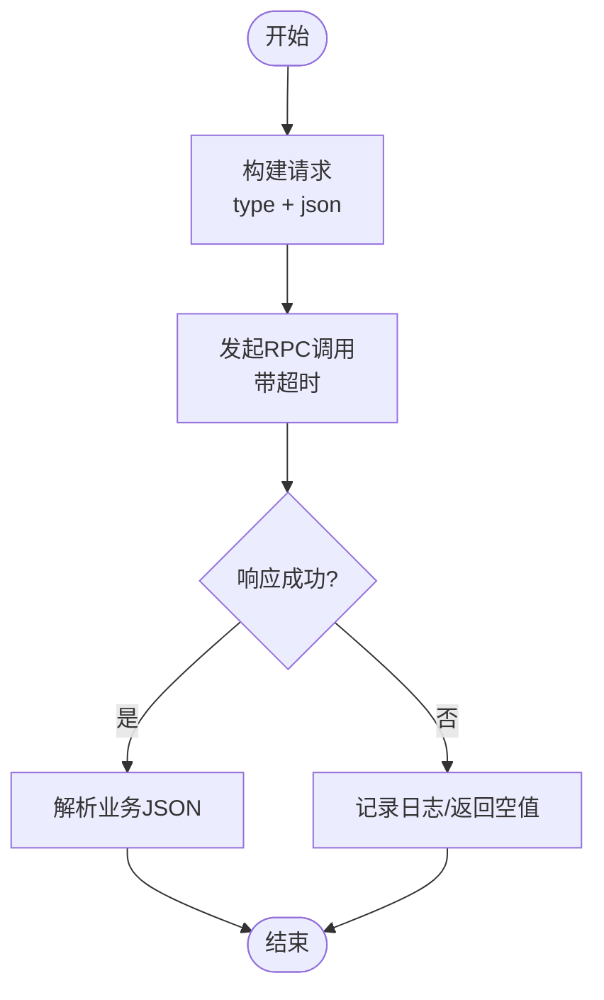
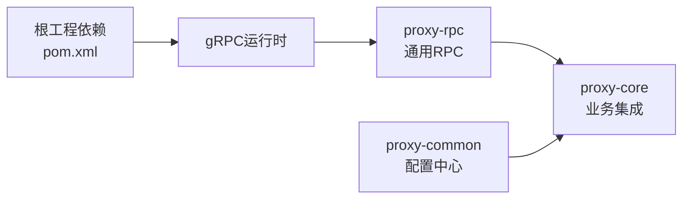

# 服务集成与调用

<cite>
**本文引用的文件**
- [GeneralService.java](file://proxy-rpc/src/main/java/com/alibaba/polardbx/proxy/GeneralService.java)
- [ServiceHandler.java](file://proxy-rpc/src/main/java/com/alibaba/polardbx/proxy/ServiceHandler.java)
- [GeneralService.proto](file://proxy-rpc/src/main/proto/GeneralService.proto)
- [GeneralServiceTest.java](file://proxy-rpc/src/test/java/com/alibaba/polardbx/proxy/GeneralServiceTest.java)
- [SyncService.java](file://proxy-core/src/main/java/com/alibaba/polardbx/proxy/sync/SyncService.java)
- [KillService.java](file://proxy-core/src/main/java/com/alibaba/polardbx/proxy/sync/KillService.java)
- [GeneralServiceErrorCode.java](file://proxy-core/src/main/java/com/alibaba/polardbx/proxy/sync/GeneralServiceErrorCode.java)
- [GeneralServiceResponse.java](file://proxy-core/src/main/java/com/alibaba/polardbx/proxy/sync/GeneralServiceResponse.java)
- [KillMessage.java](file://proxy-core/src/main/java/com/alibaba/polardbx/proxy/sync/KillMessage.java)
- [ConfigProps.java](file://proxy-common/src/main/java/com/alibaba/polardbx/proxy/config/ConfigProps.java)
- [NodeWatchdog.java](file://proxy-core/src/main/java/com/alibaba/polardbx/proxy/cluster/NodeWatchdog.java)
- [pom.xml](file://pom.xml)
- [NIOAcceptor.java](file://proxy-net/src/main/java/com/alibaba/polardbx/proxy/net/NIOAcceptor.java)
- [ReactorPerfItem.java](file://proxy-net/src/main/java/com/alibaba/polardbx/proxy/perf/ReactorPerfItem.java)
- [ReactorPerfCollection.java](file://proxy-net/src/main/java/com/alibaba/polardbx/proxy/perf/ReactorPerfCollection.java)
- [ShowReactorHandler.java](file://proxy-core/src/main/java/com/alibaba/polardbx/proxy/protocol/handler/request/ShowReactorHandler.java)
- [SecurityUtil.java](file://proxy-core/src/main/java/com/alibaba/polardbx/proxy/privilege/SecurityUtil.java)
- [BackendAuthenticator.java](file://proxy-core/src/main/java/com/alibaba/polardbx/proxy/protocol/handler/BackendAuthenticator.java)
</cite>

## 目录
1. [简介](#简介)
2. [项目结构](#项目结构)
3. [核心组件](#核心组件)
4. [架构总览](#架构总览)
5. [组件详解](#组件详解)
6. [依赖关系分析](#依赖关系分析)
7. [性能考量](#性能考量)
8. [故障排查指南](#故障排查指南)
9. [结论](#结论)
10. [附录](#附录)

## 简介
本文件面向PolarDB-X Proxy的RPC服务集成与调用，系统性阐述基于gRPC的通用服务框架在Proxy中的实现方式与使用范式。内容覆盖客户端Stub创建与连接管理、请求发送机制、服务注册与分发、同步/异步/流式调用模式、错误处理与重试、调用链路管理、性能监控与调优、以及安全与加密等主题，并提供可直接落地的最佳实践与集成示例路径。

## 项目结构
本仓库采用多模块组织，与RPC服务集成相关的关键模块如下：
- proxy-rpc：定义通用RPC服务接口与客户端调用入口，包含协议定义与测试用例。
- proxy-core：业务侧通过通用RPC进行节点间同步与控制，例如“杀查询/连接”等。
- proxy-common：公共配置项，包含通用RPC服务端口、超时等参数。
- proxy-net：网络层与性能监控基础组件，支撑高并发事件循环模型。
- 根工程pom.xml：统一管理gRPC依赖版本。

**图表来源**
- [GeneralService.java](file://proxy-rpc/src/main/java/com/alibaba/polardbx/proxy/GeneralService.java#L31-L92)
- [GeneralService.proto](file://proxy-rpc/src/main/proto/GeneralService.proto#L8-L20)
- [SyncService.java](file://proxy-core/src/main/java/com/alibaba/polardbx/proxy/sync/SyncService.java#L34-L59)
- [ConfigProps.java](file://proxy-common/src/main/java/com/alibaba/polardbx/proxy/config/ConfigProps.java#L190-L194)
- [NIOAcceptor.java](file://proxy-net/src/main/java/com/alibaba/polardbx/proxy/net/NIOAcceptor.java#L35-L107)

**章节来源**
- [GeneralService.java](file://proxy-rpc/src/main/java/com/alibaba/polardbx/proxy/GeneralService.java#L31-L92)
- [GeneralService.proto](file://proxy-rpc/src/main/proto/GeneralService.proto#L1-L21)
- [SyncService.java](file://proxy-core/src/main/java/com/alibaba/polardbx/proxy/sync/SyncService.java#L34-L59)
- [ConfigProps.java](file://proxy-common/src/main/java/com/alibaba/polardbx/proxy/config/ConfigProps.java#L190-L194)
- [NIOAcceptor.java](file://proxy-net/src/main/java/com/alibaba/polardbx/proxy/net/NIOAcceptor.java#L35-L107)

## 核心组件
- 通用RPC服务端：提供一个基于类型路由的服务处理器，支持动态注册/注销处理函数。
- 客户端调用入口：提供阻塞式调用封装，支持超时设置与通道生命周期管理。
- 业务集成适配器：在业务模块中注册具体处理逻辑（如“杀查询/连接”），并通过通用RPC向集群节点广播或单点调用。
- 配置中心：集中管理通用RPC服务端口、超时等参数。
- 网络与监控：基于NIO事件循环的高性能网络栈，配合性能指标采集与展示。

**章节来源**
- [GeneralService.java](file://proxy-rpc/src/main/java/com/alibaba/polardbx/proxy/GeneralService.java#L31-L92)
- [ServiceHandler.java](file://proxy-rpc/src/main/java/com/alibaba/polardbx/proxy/ServiceHandler.java#L21-L23)
- [SyncService.java](file://proxy-core/src/main/java/com/alibaba/polardbx/proxy/sync/SyncService.java#L34-L59)
- [ConfigProps.java](file://proxy-common/src/main/java/com/alibaba/polardbx/proxy/config/ConfigProps.java#L190-L194)

## 架构总览
通用RPC在Proxy中的运行时拓扑如下：
- 服务端：以gRPC Server形式暴露通用RPC服务，内部按type分发到已注册的ServiceHandler。
- 客户端：通过ManagedChannel构建阻塞式Stub，构造请求并发起调用。
- 业务侧：在业务初始化阶段注册处理函数；在需要跨节点同步时，通过统一的invoke入口向目标节点发送消息。
- 配置：通用RPC端口与超时由配置中心统一提供，便于全局一致性管理。

**图表来源**
- [GeneralService.java](file://proxy-rpc/src/main/java/com/alibaba/polardbx/proxy/GeneralService.java#L74-L92)
- [SyncService.java](file://proxy-core/src/main/java/com/alibaba/polardbx/proxy/sync/SyncService.java#L39-L55)
- [GeneralService.proto](file://proxy-rpc/src/main/proto/GeneralService.proto#L8-L20)

## 组件详解

### 通用RPC服务端与客户端
- 服务端职责
  - 维护类型到处理器的映射表，按请求type分发至对应ServiceHandler。
  - 若无匹配处理器，返回特定错误标记，便于上层识别。
  - 提供启动入口，绑定指定端口对外提供服务。
- 客户端职责
  - 创建ManagedChannel并构建阻塞式Stub。
  - 设置请求超时，避免长时间阻塞。
  - 发送请求后解析响应，根据结果标记决定是否继续解析业务JSON。

**图表来源**
- [GeneralService.java](file://proxy-rpc/src/main/java/com/alibaba/polardbx/proxy/GeneralService.java#L31-L92)
- [ServiceHandler.java](file://proxy-rpc/src/main/java/com/alibaba/polardbx/proxy/ServiceHandler.java#L21-L23)

**章节来源**
- [GeneralService.java](file://proxy-rpc/src/main/java/com/alibaba/polardbx/proxy/GeneralService.java#L31-L92)
- [ServiceHandler.java](file://proxy-rpc/src/main/java/com/alibaba/polardbx/proxy/ServiceHandler.java#L21-L23)

### 业务集成：同步调用与广播
- 同步调用：在业务初始化时注册处理器，随后通过通用RPC向单个节点发送消息。
- 广播调用：遍历集群节点列表，异步提交任务对每个节点执行invoke，实现全网同步。
- 处理器实现：业务侧实现ServiceHandler接口，解析请求JSON并返回结果JSON。

**图表来源**
- [SyncService.java](file://proxy-core/src/main/java/com/alibaba/polardbx/proxy/sync/SyncService.java#L39-L55)
- [GeneralService.java](file://proxy-rpc/src/main/java/com/alibaba/polardbx/proxy/GeneralService.java#L74-L92)
- [NodeWatchdog.java](file://proxy-core/src/main/java/com/alibaba/polardbx/proxy/cluster/NodeWatchdog.java#L135-L150)

**章节来源**
- [SyncService.java](file://proxy-core/src/main/java/com/alibaba/polardbx/proxy/sync/SyncService.java#L34-L59)
- [KillService.java](file://proxy-core/src/main/java/com/alibaba/polardbx/proxy/sync/KillService.java#L37-L103)
- [NodeWatchdog.java](file://proxy-core/src/main/java/com/alibaba/polardbx/proxy/cluster/NodeWatchdog.java#L135-L150)

### 错误处理策略
- 异常捕获：客户端在invoke中使用finally确保通道被关闭，避免资源泄漏。
- 结果判定：根据响应result字段判断是否成功，失败时返回空值或上抛异常。
- 业务错误封装：处理器返回统一的错误码与信息对象，便于上层统一处理。
- 超时控制：客户端设置deadline，避免阻塞；服务端可结合业务逻辑设置合理超时。

**图表来源**
- [GeneralService.java](file://proxy-rpc/src/main/java/com/alibaba/polardbx/proxy/GeneralService.java#L74-L92)
- [GeneralServiceResponse.java](file://proxy-core/src/main/java/com/alibaba/polardbx/proxy/sync/GeneralServiceResponse.java#L25-L35)

**章节来源**
- [GeneralService.java](file://proxy-rpc/src/main/java/com/alibaba/polardbx/proxy/GeneralService.java#L74-L92)
- [GeneralServiceResponse.java](file://proxy-core/src/main/java/com/alibaba/polardbx/proxy/sync/GeneralServiceResponse.java#L25-L35)

### 调用链路管理
- 类型路由：服务端通过请求中的type字段进行处理器选择，形成清晰的调用链路。
- 注册/注销：运行期可动态注册或注销处理器，支持热更新与灰度发布。
- 节点发现：通过NodeWatchdog获取集群节点，实现广播或定向调用。

**章节来源**
- [GeneralService.java](file://proxy-rpc/src/main/java/com/alibaba/polardbx/proxy/GeneralService.java#L36-L42)
- [NodeWatchdog.java](file://proxy-core/src/main/java/com/alibaba/polardbx/proxy/cluster/NodeWatchdog.java#L135-L150)

### 性能监控与调优
- 事件循环性能指标：NIOAcceptor与ReactorPerf系列类提供事件循环、缓冲区、连接数等指标采集。
- 指标展示：ShowReactorHandler将性能指标转换为系统表输出，便于运维观测。
- 调优建议
  - 合理设置通用RPC超时与线程池大小，避免阻塞与上下文切换开销。
  - 控制请求体大小，避免过大JSON影响序列化/反序列化与网络传输。
  - 使用连接池与复用通道，减少频繁创建/销毁带来的开销。

**章节来源**
- [NIOAcceptor.java](file://proxy-net/src/main/java/com/alibaba/polardbx/proxy/net/NIOAcceptor.java#L35-L107)
- [ReactorPerfItem.java](file://proxy-net/src/main/java/com/alibaba/polardbx/proxy/perf/ReactorPerfItem.java#L24-L40)
- [ReactorPerfCollection.java](file://proxy-net/src/main/java/com/alibaba/polardbx/proxy/perf/ReactorPerfCollection.java#L25-L33)
- [ShowReactorHandler.java](file://proxy-core/src/main/java/com/alibaba/polardbx/proxy/protocol/handler/request/ShowReactorHandler.java#L67-L89)

### 安全与加密
- 认证与授权：后端连接认证流程中使用安全工具类进行挑战/应答计算，确保密码校验与插件兼容。
- 数据加密：后端认证过程中支持多种认证插件（如caching_sha2_password），并在握手阶段完成密钥交换与数据保护。
- 传输安全：当前通用RPC使用明文通道，生产环境建议启用TLS/SSL以保障传输安全。

**章节来源**
- [SecurityUtil.java](file://proxy-core/src/main/java/com/alibaba/polardbx/proxy/privilege/SecurityUtil.java#L33-L70)
- [BackendAuthenticator.java](file://proxy-core/src/main/java/com/alibaba/polardbx/proxy/protocol/handler/BackendAuthenticator.java#L109-L189)

## 依赖关系分析
- gRPC依赖：根工程统一管理gRPC相关依赖版本，确保客户端与服务端兼容。
- 通用RPC与业务模块：业务模块通过SyncService注册处理器并调用通用RPC，形成松耦合的扩展点。
- 配置依赖：通用RPC端口与超时等参数来自配置中心，保证全局一致性。

**图表来源**
- [pom.xml](file://pom.xml#L112-L143)
- [GeneralService.java](file://proxy-rpc/src/main/java/com/alibaba/polardbx/proxy/GeneralService.java#L21-L29)
- [SyncService.java](file://proxy-core/src/main/java/com/alibaba/polardbx/proxy/sync/SyncService.java#L21-L28)

**章节来源**
- [pom.xml](file://pom.xml#L112-L143)
- [ConfigProps.java](file://proxy-common/src/main/java/com/alibaba/polardbx/proxy/config/ConfigProps.java#L190-L194)

## 性能考量
- 连接与通道
  - 建议在高频调用场景下复用ManagedChannel，避免频繁创建/销毁导致的CPU与内存抖动。
  - 对于批量广播场景，采用异步提交与限速策略，防止瞬时拥塞。
- 超时与重试
  - 客户端设置合理的deadline，服务端处理逻辑应快速返回或及时中断长耗时操作。
  - 对于可重试的网络异常，可在上层实现指数退避重试策略。
- 序列化与负载
  - 控制请求体大小，优先使用紧凑的JSON结构；必要时可引入压缩或二进制序列化方案。
- 监控与可观测性
  - 利用ReactorPerf指标观察事件循环压力，结合业务指标定位瓶颈。
  - 在关键路径埋点统计延迟分布与错误率，建立告警阈值。

[本节为通用性能指导，不直接分析具体文件]

## 故障排查指南
- 无处理器返回
  - 现象：客户端收到“无处理器”标记。
  - 排查：确认服务端是否正确注册了对应type的处理器；检查注册顺序与命名一致性。
- 调用超时
  - 现象：客户端抛出超时异常或返回空值。
  - 排查：提升通用RPC超时配置；检查服务端处理逻辑是否存在阻塞；评估网络延迟。
- 通道泄漏
  - 现象：连接数持续增长。
  - 排查：确保客户端finally块中调用通道关闭；避免在异常分支遗漏关闭。
- 广播失败
  - 现象：部分节点未收到消息。
  - 排查：检查节点列表获取与地址解码；确认目标节点端口与网络连通性。

**章节来源**
- [GeneralService.java](file://proxy-rpc/src/main/java/com/alibaba/polardbx/proxy/GeneralService.java#L74-L92)
- [SyncService.java](file://proxy-core/src/main/java/com/alibaba/polardbx/proxy/sync/SyncService.java#L39-L55)

## 结论
PolarDB-X Proxy通过通用RPC实现了跨节点的统一调用能力，具备类型路由、动态注册、阻塞式调用与广播调用等特性。结合完善的配置中心、性能监控与安全机制，可在保证稳定性的同时满足高并发与低延迟的业务需求。建议在生产环境中启用TLS传输、优化超时与重试策略，并持续监控事件循环与业务指标以实现精细化调优。

[本节为总结性内容，不直接分析具体文件]

## 附录

### 集成示例与最佳实践
- 快速集成步骤
  - 定义业务处理器并实现ServiceHandler接口，负责解析请求JSON并返回结果JSON。
  - 在业务初始化阶段通过通用RPC注册处理器，确保服务端可用后再对外提供服务。
  - 使用通用RPC客户端发起调用，设置合理超时并做好异常处理。
  - 对于跨节点同步，使用节点发现与异步提交策略实现广播调用。
- 最佳实践
  - 使用统一的错误码与信息对象，便于上层统一处理。
  - 控制请求体大小，避免过大JSON影响性能。
  - 在高并发场景下复用通道与连接池，减少资源消耗。
  - 生产环境启用TLS传输，强化数据安全。
  - 建立完善的监控与告警体系，持续跟踪RPC调用延迟与错误率。

**章节来源**
- [GeneralServiceTest.java](file://proxy-rpc/src/test/java/com/alibaba/polardbx/proxy/GeneralServiceTest.java#L24-L35)
- [SyncService.java](file://proxy-core/src/main/java/com/alibaba/polardbx/proxy/sync/SyncService.java#L34-L59)
- [ConfigProps.java](file://proxy-common/src/main/java/com/alibaba/polardbx/proxy/config/ConfigProps.java#L190-L194)