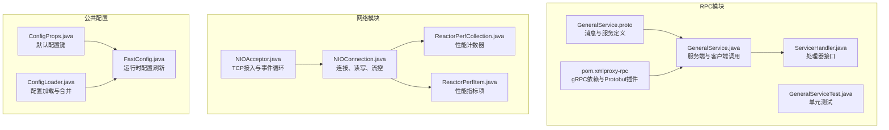
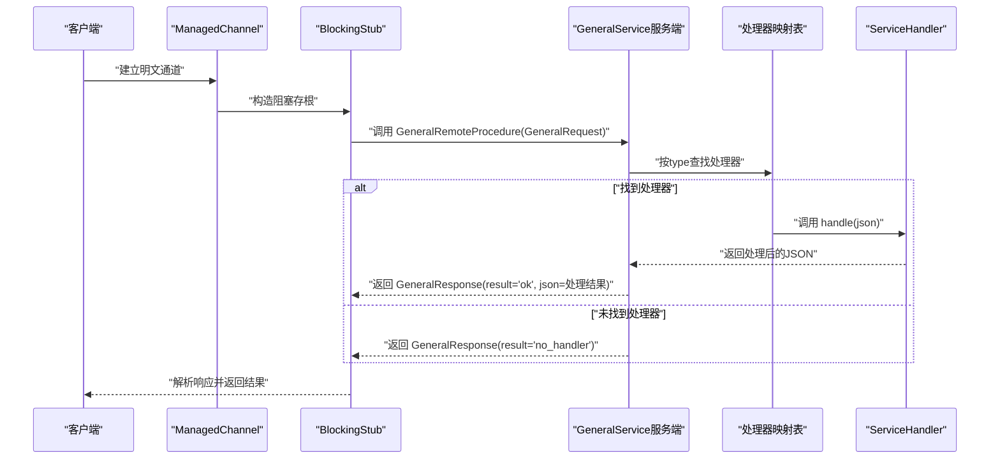
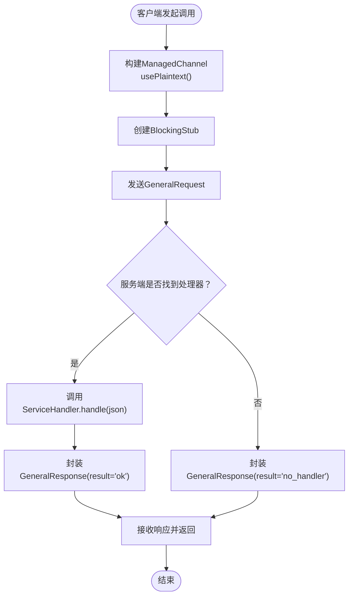
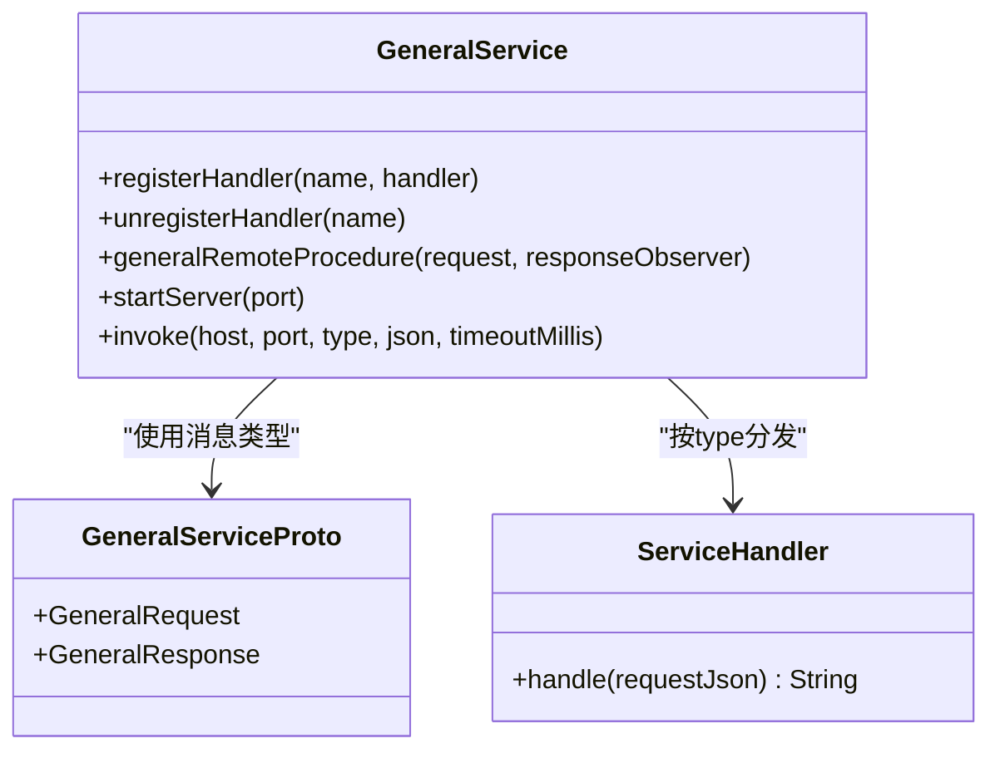
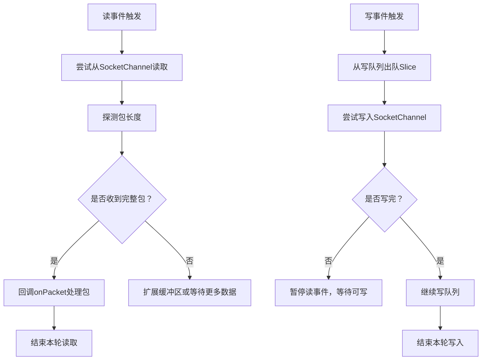
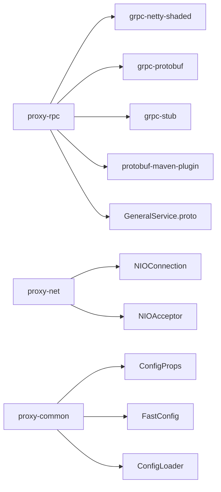

# 通信协议与格式

<cite>
**本文引用的文件**   
- [GeneralService.proto](file://proxy-rpc/src/main/proto/GeneralService.proto)
- [GeneralService.java](file://proxy-rpc/src/main/java/com/alibaba/polardbx/proxy/GeneralService.java)
- [ServiceHandler.java](file://proxy-rpc/src/main/java/com/alibaba/polardbx/proxy/ServiceHandler.java)
- [pom.xml（proxy-rpc）](file://proxy-rpc/pom.xml)
- [GeneralServiceTest.java](file://proxy-rpc/src/test/java/com/alibaba/polardbx/proxy/GeneralServiceTest.java)
- [NIOAcceptor.java](file://proxy-net/src/main/java/com/alibaba/polardbx/proxy/net/NIOAcceptor.java)
- [NIOConnection.java](file://proxy-net/src/main/java/com/alibaba/polardbx/proxy/net/NIOConnection.java)
- [ReactorPerfCollection.java](file://proxy-net/src/main/java/com/alibaba/polardbx/proxy/perf/ReactorPerfCollection.java)
- [ReactorPerfItem.java](file://proxy-net/src/main/java/com/alibaba/polardbx/proxy/perf/ReactorPerfItem.java)
- [ConfigProps.java](file://proxy-common/src/main/java/com/alibaba/polardbx/proxy/config/ConfigProps.java)
- [FastConfig.java](file://proxy-common/src/main/java/com/alibaba/polardbx/proxy/config/FastConfig.java)
- [ConfigLoader.java](file://proxy-common/src/main/java/com/alibaba/polardbx/proxy/config/ConfigLoader.java)
</cite>

## 目录
1. [引言](#引言)
2. [项目结构](#项目结构)
3. [核心组件](#核心组件)
4. [架构总览](#架构总览)
5. [详细组件分析](#详细组件分析)
6. [依赖关系分析](#依赖关系分析)
7. [性能考量](#性能考量)
8. [故障排查指南](#故障排查指南)
9. [结论](#结论)
10. [附录](#附录)

## 引言
本文件面向PolarDB-X Proxy的RPC通信协议与格式，聚焦于基于Protocol Buffers的gRPC服务模型，系统阐述以下内容：
- Protocol Buffers消息格式定义与字段语义
- 消息序列化与编码机制
- GeneralRequest/GeneralResponse的消息结构与用途
- gRPC传输层在Proxy中的应用：HTTP/2、流控与多路复用
- 压缩策略与传输优化建议
- 协议版本管理、向后兼容与升级策略
- 协议调试与性能监控方法

## 项目结构
本仓库采用多模块组织，与RPC通信协议直接相关的模块与文件如下：
- proxy-rpc：定义并实现通用RPC服务，包含Protocol Buffers定义与gRPC服务端/客户端代码
- proxy-net：NIO网络栈，体现TCP连接、读写与流控等底层传输特性
- proxy-common：公共配置与常量，支撑服务端口、超时、缓冲区等参数

图表来源
- [GeneralService.proto](file://proxy-rpc/src/main/proto/GeneralService.proto#L1-L21)
- [GeneralService.java](file://proxy-rpc/src/main/java/com/alibaba/polardbx/proxy/GeneralService.java#L1-L94)
- [ServiceHandler.java](file://proxy-rpc/src/main/java/com/alibaba/polardbx/proxy/ServiceHandler.java#L1-L24)
- [GeneralServiceTest.java](file://proxy-rpc/src/test/java/com/alibaba/polardbx/proxy/GeneralServiceTest.java#L1-L36)
- [pom.xml（proxy-rpc）](file://proxy-rpc/pom.xml#L1-L98)
- [NIOAcceptor.java](file://proxy-net/src/main/java/com/alibaba/polardbx/proxy/net/NIOAcceptor.java#L1-L148)
- [NIOConnection.java](file://proxy-net/src/main/java/com/alibaba/polardbx/proxy/net/NIOConnection.java#L1-L884)
- [ReactorPerfCollection.java](file://proxy-net/src/main/java/com/alibaba/polardbx/proxy/perf/ReactorPerfCollection.java#L1-L34)
- [ReactorPerfItem.java](file://proxy-net/src/main/java/com/alibaba/polardbx/proxy/perf/ReactorPerfItem.java#L1-L41)
- [ConfigProps.java](file://proxy-common/src/main/java/com/alibaba/polardbx/proxy/config/ConfigProps.java#L1-L208)
- [FastConfig.java](file://proxy-common/src/main/java/com/alibaba/polardbx/proxy/config/FastConfig.java#L1-L74)
- [ConfigLoader.java](file://proxy-common/src/main/java/com/alibaba/polardbx/proxy/config/ConfigLoader.java#L1-L72)

章节来源
- [GeneralService.proto](file://proxy-rpc/src/main/proto/GeneralService.proto#L1-L21)
- [GeneralService.java](file://proxy-rpc/src/main/java/com/alibaba/polardbx/proxy/GeneralService.java#L1-L94)
- [pom.xml（proxy-rpc）](file://proxy-rpc/pom.xml#L1-L98)

## 核心组件
- Protocol Buffers消息定义
  - GeneralRequest：type字段标识业务类型；json字段承载请求载荷（JSON字符串）
  - GeneralResponse：result字段返回处理结果状态；json字段承载响应载荷（JSON字符串）
- gRPC服务端与客户端
  - 服务端：注册ServiceHandler，按type分发处理，返回JSON结果
  - 客户端：通过ManagedChannel发起阻塞调用，设置超时
- 网络层基础
  - NIO连接与事件循环，支持TCP_NODELAY、读写队列、背压与流控
- 配置体系
  - 默认配置键、运行时刷新、配置加载与合并

章节来源
- [GeneralService.proto](file://proxy-rpc/src/main/proto/GeneralService.proto#L12-L20)
- [GeneralService.java](file://proxy-rpc/src/main/java/com/alibaba/polardbx/proxy/GeneralService.java#L31-L92)
- [ServiceHandler.java](file://proxy-rpc/src/main/java/com/alibaba/polardbx/proxy/ServiceHandler.java#L21-L23)
- [NIOConnection.java](file://proxy-net/src/main/java/com/alibaba/polardbx/proxy/net/NIOConnection.java#L50-L884)
- [ConfigProps.java](file://proxy-common/src/main/java/com/alibaba/polardbx/proxy/config/ConfigProps.java#L127-L208)

## 架构总览
下图展示从客户端到服务端的典型调用链，以及与网络层的关系。

图表来源
- [GeneralService.java](file://proxy-rpc/src/main/java/com/alibaba/polardbx/proxy/GeneralService.java#L44-L92)
- [ServiceHandler.java](file://proxy-rpc/src/main/java/com/alibaba/polardbx/proxy/ServiceHandler.java#L21-L23)
- [GeneralService.proto](file://proxy-rpc/src/main/proto/GeneralService.proto#L8-L20)

## 详细组件分析

### Protocol Buffers消息格式与编码
- 消息结构
  - GeneralRequest：type（字符串）、json（字符串）
  - GeneralResponse：result（字符串）、json（字符串）
- 字段语义
  - type用于路由到具体业务处理器
  - json承载任意结构化数据，通常为JSON字符串
- 编码与序列化
  - 使用proto3语法，字段按编号编码，采用长度前缀编码（varint/bytes）
  - 生成的Java类提供builder模式与序列化/反序列化能力
- 字段约束
  - 当前定义未声明required/optional，均为proto3默认行为
  - 建议在上层约定：type非空且唯一，json为合法JSON字符串

章节来源
- [GeneralService.proto](file://proxy-rpc/src/main/proto/GeneralService.proto#L12-L20)

### gRPC传输层工作原理
- 传输协议
  - 基于HTTP/2，支持多路复用与头部压缩
  - 在本项目中以明文传输（usePlaintext），便于开发与测试
- 连接与调用
  - 客户端通过ManagedChannel构建BlockingStub进行同步调用
  - 服务端继承自生成的GeneralServiceImplBase，按请求分发至ServiceHandler
- 超时与错误
  - 客户端设置deadline，避免无限等待
  - 未匹配type时返回特定result值，便于上层识别“无处理器”场景

图表来源
- [GeneralService.java](file://proxy-rpc/src/main/java/com/alibaba/polardbx/proxy/GeneralService.java#L74-L92)
- [GeneralService.java](file://proxy-rpc/src/main/java/com/alibaba/polardbx/proxy/GeneralService.java#L44-L65)

章节来源
- [GeneralService.java](file://proxy-rpc/src/main/java/com/alibaba/polardbx/proxy/GeneralService.java#L21-L30)
- [GeneralService.java](file://proxy-rpc/src/main/java/com/alibaba/polardbx/proxy/GeneralService.java#L67-L92)

### 消息结构设计与字段规范
- GeneralRequest.type
  - 作用：业务类型路由键，建议全局唯一
  - 规范：小写/短横线命名风格，避免特殊字符
- GeneralRequest.json
  - 作用：请求载荷，建议为合法JSON字符串
  - 规范：上层统一校验与解码，避免空或非法JSON
- GeneralResponse.result
  - 作用：处理结果状态，ok/no_handler等
  - 规范：客户端据此判断是否取json字段
- GeneralResponse.json
  - 作用：响应载荷，建议为合法JSON字符串
  - 规范：与请求保持一致的结构化约定

章节来源
- [GeneralService.java](file://proxy-rpc/src/main/java/com/alibaba/polardbx/proxy/GeneralService.java#L32-L33)
- [GeneralService.java](file://proxy-rpc/src/main/java/com/alibaba/polardbx/proxy/GeneralService.java#L44-L65)

### 处理器注册与分发
- 注册
  - 通过静态方法注册/注销ServiceHandler，key为type
- 分发
  - 服务端根据type从映射表获取处理器，执行handle(json)
  - 返回值作为响应json字段

图表来源
- [GeneralService.java](file://proxy-rpc/src/main/java/com/alibaba/polardbx/proxy/GeneralService.java#L31-L92)
- [ServiceHandler.java](file://proxy-rpc/src/main/java/com/alibaba/polardbx/proxy/ServiceHandler.java#L21-L23)
- [GeneralService.proto](file://proxy-rpc/src/main/proto/GeneralService.proto#L12-L20)

章节来源
- [GeneralService.java](file://proxy-rpc/src/main/java/com/alibaba/polardbx/proxy/GeneralService.java#L36-L65)

### 网络层与流控
- TCP与NIO
  - 启用TCP_NODELAY，降低延迟
  - 支持阻塞/非阻塞连接切换
- 读写与流控
  - 写队列与背压：当写缓冲满时暂停读事件，避免内存压力
  - 读缓冲池：快速分配与回收，减少GC与拷贝
- 性能计数
  - 提供socket数量、事件循环次数、读写次数等指标

图表来源
- [NIOConnection.java](file://proxy-net/src/main/java/com/alibaba/polardbx/proxy/net/NIOConnection.java#L410-L586)
- [NIOConnection.java](file://proxy-net/src/main/java/com/alibaba/polardbx/proxy/net/NIOConnection.java#L588-L778)

章节来源
- [NIOAcceptor.java](file://proxy-net/src/main/java/com/alibaba/polardbx/proxy/net/NIOAcceptor.java#L61-L105)
- [NIOConnection.java](file://proxy-net/src/main/java/com/alibaba/polardbx/proxy/net/NIOConnection.java#L50-L884)
- [ReactorPerfCollection.java](file://proxy-net/src/main/java/com/alibaba/polardbx/proxy/perf/ReactorPerfCollection.java#L26-L33)
- [ReactorPerfItem.java](file://proxy-net/src/main/java/com/alibaba/polardbx/proxy/perf/ReactorPerfItem.java#L26-L40)

### 协议版本管理、兼容与升级
- 版本与兼容
  - 当前消息定义为proto3，未显式声明版本号
  - 建议在消息头增加version字段，并在服务端按版本分支处理
- 升级策略
  - 新增字段使用新编号，保持旧字段不变更
  - 服务端对未知字段保持兼容，客户端对缺失字段提供默认值
  - 通过配置项控制服务端端口与超时，便于灰度发布

章节来源
- [GeneralService.proto](file://proxy-rpc/src/main/proto/GeneralService.proto#L1-L21)
- [ConfigProps.java](file://proxy-common/src/main/java/com/alibaba/polardbx/proxy/config/ConfigProps.java#L127-L208)

### 压缩策略与传输优化
- 压缩
  - 可在gRPC层面启用压缩（如gzip），需在客户端/服务端协商
- 优化建议
  - 控制单次请求/响应大小，避免超过max_allowed_packet
  - 对高频小消息进行聚合，减少RTT
  - 利用HTTP/2多路复用，合并多个请求/响应

章节来源
- [pom.xml（proxy-rpc）](file://proxy-rpc/pom.xml#L46-L65)
- [FastConfig.java](file://proxy-common/src/main/java/com/alibaba/polardbx/proxy/config/FastConfig.java#L64-L64)

## 依赖关系分析
- RPC模块依赖
  - gRPC运行时、Protobuf与Stub
  - Protobuf编译插件与目标生成
- 网络模块依赖
  - NIO连接与事件循环，支撑高并发与低延迟
- 配置模块依赖
  - 默认配置与运行时刷新，影响端口、超时与缓冲区

图表来源
- [pom.xml（proxy-rpc）](file://proxy-rpc/pom.xml#L38-L96)
- [GeneralService.proto](file://proxy-rpc/src/main/proto/GeneralService.proto#L1-L21)
- [NIOConnection.java](file://proxy-net/src/main/java/com/alibaba/polardbx/proxy/net/NIOConnection.java#L1-L884)
- [NIOAcceptor.java](file://proxy-net/src/main/java/com/alibaba/polardbx/proxy/net/NIOAcceptor.java#L1-L148)
- [ConfigProps.java](file://proxy-common/src/main/java/com/alibaba/polardbx/proxy/config/ConfigProps.java#L127-L208)
- [FastConfig.java](file://proxy-common/src/main/java/com/alibaba/polardbx/proxy/config/FastConfig.java#L45-L74)
- [ConfigLoader.java](file://proxy-common/src/main/java/com/alibaba/polardbx/proxy/config/ConfigLoader.java#L39-L71)

章节来源
- [pom.xml（proxy-rpc）](file://proxy-rpc/pom.xml#L38-L96)

## 性能考量
- 端口与超时
  - 通用RPC端口与超时由配置项控制，便于按环境调整
- 缓冲区与内存
  - 快速缓冲池与Slice复用，降低GC压力
- 流控与背压
  - 写队列满时暂停读事件，避免内存溢出
- 指标采集
  - 统计socket数量、事件循环次数、读写次数等关键指标

章节来源
- [ConfigProps.java](file://proxy-common/src/main/java/com/alibaba/polardbx/proxy/config/ConfigProps.java#L191-L193)
- [NIOConnection.java](file://proxy-net/src/main/java/com/alibaba/polardbx/proxy/net/NIOConnection.java#L410-L586)
- [ReactorPerfCollection.java](file://proxy-net/src/main/java/com/alibaba/polardbx/proxy/perf/ReactorPerfCollection.java#L26-L33)

## 故障排查指南
- 常见问题
  - 无处理器：result为“no_handler”，检查type是否正确注册
  - 超时：客户端设置的deadline过短，适当增大
  - 连接异常：TCP_NODELAY已启用，检查网络连通性与防火墙
- 调试步骤
  - 使用单元测试验证服务端启动、注册与调用流程
  - 查看服务端日志与网络层性能指标
- 单元测试参考
  - 启动服务端，注册处理器，发起调用并断言结果

章节来源
- [GeneralServiceTest.java](file://proxy-rpc/src/test/java/com/alibaba/polardbx/proxy/GeneralServiceTest.java#L25-L34)
- [GeneralService.java](file://proxy-rpc/src/main/java/com/alibaba/polardbx/proxy/GeneralService.java#L67-L92)

## 结论
本文件梳理了PolarDB-X Proxy RPC通信协议与格式，明确了Protocol Buffers消息结构、gRPC传输机制、网络层流控与性能指标，并给出了版本管理与升级策略建议。结合现有代码，建议在消息头引入版本字段、完善压缩与聚合策略，并持续通过配置与指标体系保障线上稳定性。

## 附录
- 关键配置键（节选）
  - general_service_port：通用RPC服务端口
  - general_service_timeout：RPC调用超时
- 运行时刷新
  - FastConfig从ConfigLoader加载的Properties中刷新运行时参数

章节来源
- [ConfigProps.java](file://proxy-common/src/main/java/com/alibaba/polardbx/proxy/config/ConfigProps.java#L191-L193)
- [FastConfig.java](file://proxy-common/src/main/java/com/alibaba/polardbx/proxy/config/FastConfig.java#L45-L74)
- [ConfigLoader.java](file://proxy-common/src/main/java/com/alibaba/polardbx/proxy/config/ConfigLoader.java#L39-L71)