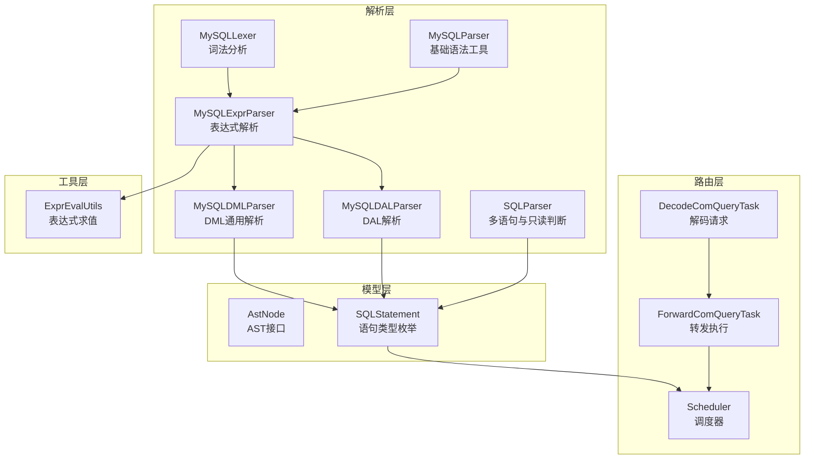
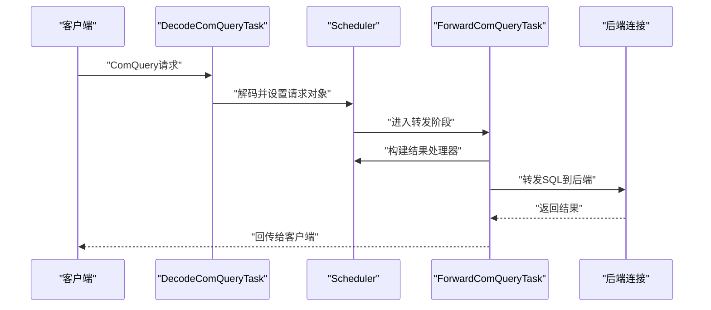
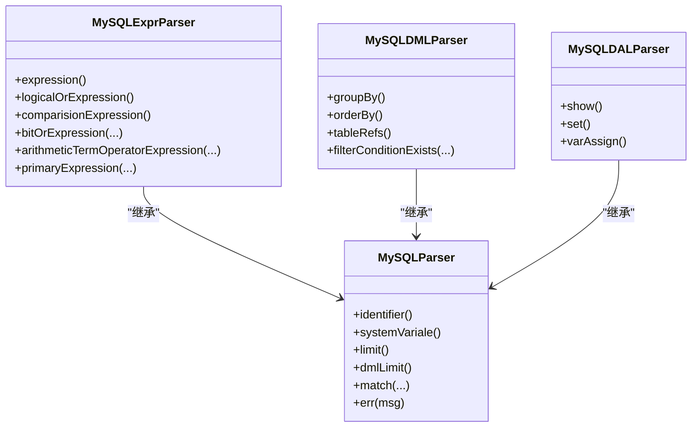
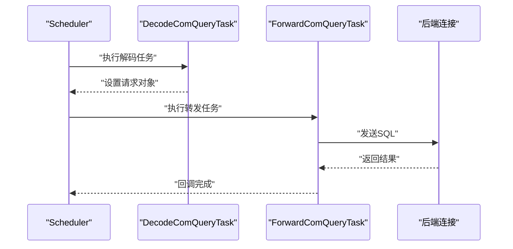
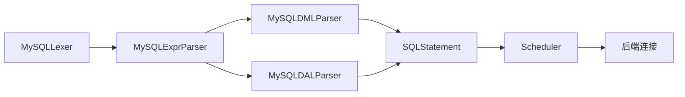

# SQL处理

<cite>
**本文引用的文件**
- [proxy-parser/src/main/java/com/alibaba/polardbx/proxy/parser/recognizer/mysql/lexer/MySQLLexer.java](file://proxy-parser/src/main/java/com/alibaba/polardbx/proxy/parser/recognizer/mysql/lexer/MySQLLexer.java)
- [proxy-parser/src/main/java/com/alibaba/polardbx/proxy/parser/recognizer/mysql/syntax/MySQLParser.java](file://proxy-parser/src/main/java/com/alibaba/polardbx/proxy/parser/recognizer/mysql/syntax/MySQLParser.java)
- [proxy-parser/src/main/java/com/alibaba/polardbx/proxy/parser/recognizer/mysql/syntax/MySQLExprParser.java](file://proxy-parser/src/main/java/com/alibaba/polardbx/proxy/parser/recognizer/mysql/syntax/MySQLExprParser.java)
- [proxy-parser/src/main/java/com/alibaba/polardbx/proxy/parser/recognizer/mysql/syntax/MySQLDALParser.java](file://proxy-parser/src/main/java/com/alibaba/polardbx/proxy/parser/recognizer/mysql/syntax/MySQLDALParser.java)
- [proxy-parser/src/main/java/com/alibaba/polardbx/proxy/parser/recognizer/mysql/syntax/MySQLDMLParser.java](file://proxy-parser/src/main/java/com/alibaba/polardbx/proxy/parser/recognizer/mysql/syntax/MySQLDMLParser.java)
- [proxy-parser/src/main/java/com/alibaba/polardbx/proxy/parser/recognizer/SQLParser.java](file://proxy-parser/src/main/java/com/alibaba/polardbx/proxy/parser/recognizer/SQLParser.java)
- [proxy-parser/src/main/java/com/alibaba/polardbx/proxy/parser/ast/AstNode.java](file://proxy-parser/src/main/java/com/alibaba/polardbx/proxy/parser/ast/AstNode.java)
- [proxy-parser/src/main/java/com/alibaba/polardbx/proxy/parser/ast/stmt/SQLStatement.java](file://proxy-parser/src/main/java/com/alibaba/polardbx/proxy/parser/ast/stmt/SQLStatement.java)
- [proxy-parser/src/main/java/com/alibaba/polardbx/proxy/parser/util/ExprEvalUtils.java](file://proxy-parser/src/main/java/com/alibaba/polardbx/proxy/parser/util/ExprEvalUtils.java)
- [proxy-core/src/main/java/com/alibaba/polardbx/proxy/scheduler/Scheduler.java](file://proxy-core/src/main/java/com/alibaba/polardbx/proxy/scheduler/Scheduler.java)
- [proxy-core/src/main/java/com/alibaba/polardbx/proxy/scheduler/DecodeComQueryTask.java](file://proxy-core/src/main/java/com/alibaba/polardbx/proxy/scheduler/DecodeComQueryTask.java)
- [proxy-core/src/main/java/com/alibaba/polardbx/proxy/scheduler/ForwardComQueryTask.java](file://proxy-core/src/main/java/com/alibaba/polardbx/proxy/scheduler/ForwardComQueryTask.java)
- [proxy-parser/src/test/java/com/alibaba/polardbx/proxy/parser/LexerTest.java](file://proxy-parser/src/test/java/com/alibaba/polardbx/proxy/parser/LexerTest.java)
- [proxy-parser/src/test/java/com/alibaba/polardbx/proxy/parser/SetStmtTest.java](file://proxy-parser/src/test/java/com/alibaba/polardbx/proxy/parser/SetStmtTest.java)
</cite>

## 目录
1. [简介](#简介)
2. [项目结构](#项目结构)
3. [核心组件](#核心组件)
4. [架构总览](#架构总览)
5. [详细组件分析](#详细组件分析)
6. [依赖关系分析](#依赖关系分析)
7. [性能考虑](#性能考虑)
8. [故障排查指南](#故障排查指南)
9. [结论](#结论)
10. [附录](#附录)

## 简介
本文件面向PolarDB-X Proxy的SQL处理系统，系统性梳理从SQL字符串到AST构建、从解析到路由与执行的整体流程。重点覆盖：
- 词法分析器（MySQLLexer）如何将SQL字符串切分为标记流，并处理注释、转义、占位符等细节
- 语法分析器（MySQLParser/MySQLExprParser/MySQLDMLParser/MySQLDALParser）如何基于标记流构建表达式树与语句树
- 各类SQL语句（DML、DDL、DAL等）的解析要点与AST节点类型
- 查询路由决策（Scheduler与任务链）如何结合SQL类型、表分布与查询条件进行智能转发
- 表达式求值与参数绑定（ExprEvalUtils、参数占位符）的实现思路
- 支持的SQL语法范围、错误处理策略与性能优化建议
- 实际解析示例与调试技巧

## 项目结构
本节聚焦与SQL解析与路由相关的核心模块：
- 词法与语法识别：proxy-parser/recognizer/mysql
- AST与语句模型：proxy-parser/ast
- 路由与任务编排：proxy-core/scheduler
- 测试与示例：proxy-parser/test



图示来源
- [proxy-parser/src/main/java/com/alibaba/polardbx/proxy/parser/recognizer/mysql/lexer/MySQLLexer.java](file://proxy-parser/src/main/java/com/alibaba/polardbx/proxy/parser/recognizer/mysql/lexer/MySQLLexer.java#L1-L120)
- [proxy-parser/src/main/java/com/alibaba/polardbx/proxy/parser/recognizer/mysql/syntax/MySQLParser.java](file://proxy-parser/src/main/java/com/alibaba/polardbx/proxy/parser/recognizer/mysql/syntax/MySQLParser.java#L1-L120)
- [proxy-parser/src/main/java/com/alibaba/polardbx/proxy/parser/recognizer/mysql/syntax/MySQLExprParser.java](file://proxy-parser/src/main/java/com/alibaba/polardbx/proxy/parser/recognizer/mysql/syntax/MySQLExprParser.java#L1-L120)
- [proxy-parser/src/main/java/com/alibaba/polardbx/proxy/parser/recognizer/mysql/syntax/MySQLDMLParser.java](file://proxy-parser/src/main/java/com/alibaba/polardbx/proxy/parser/recognizer/mysql/syntax/MySQLDMLParser.java#L1-L120)
- [proxy-parser/src/main/java/com/alibaba/polardbx/proxy/parser/recognizer/mysql/syntax/MySQLDALParser.java](file://proxy-parser/src/main/java/com/alibaba/polardbx/proxy/parser/recognizer/mysql/syntax/MySQLDALParser.java#L1-L120)
- [proxy-parser/src/main/java/com/alibaba/polardbx/proxy/parser/recognizer/SQLParser.java](file://proxy-parser/src/main/java/com/alibaba/polardbx/proxy/parser/recognizer/SQLParser.java#L1-L120)
- [proxy-parser/src/main/java/com/alibaba/polardbx/proxy/parser/ast/AstNode.java](file://proxy-parser/src/main/java/com/alibaba/polardbx/proxy/parser/ast/AstNode.java#L1-L32)
- [proxy-parser/src/main/java/com/alibaba/polardbx/proxy/parser/ast/stmt/SQLStatement.java](file://proxy-parser/src/main/java/com/alibaba/polardbx/proxy/parser/ast/stmt/SQLStatement.java#L1-L41)
- [proxy-core/src/main/java/com/alibaba/polardbx/proxy/scheduler/Scheduler.java](file://proxy-core/src/main/java/com/alibaba/polardbx/proxy/scheduler/Scheduler.java#L1-L120)
- [proxy-core/src/main/java/com/alibaba/polardbx/proxy/scheduler/DecodeComQueryTask.java](file://proxy-core/src/main/java/com/alibaba/polardbx/proxy/scheduler/DecodeComQueryTask.java#L1-L35)
- [proxy-core/src/main/java/com/alibaba/polardbx/proxy/scheduler/ForwardComQueryTask.java](file://proxy-core/src/main/java/com/alibaba/polardbx/proxy/scheduler/ForwardComQueryTask.java#L1-L55)
- [proxy-parser/src/main/java/com/alibaba/polardbx/proxy/parser/util/ExprEvalUtils.java](file://proxy-parser/src/main/java/com/alibaba/polardbx/proxy/parser/util/ExprEvalUtils.java#L1-L120)

章节来源
- [proxy-parser/src/main/java/com/alibaba/polardbx/proxy/parser/recognizer/mysql/lexer/MySQLLexer.java](file://proxy-parser/src/main/java/com/alibaba/polardbx/proxy/parser/recognizer/mysql/lexer/MySQLLexer.java#L1-L120)
- [proxy-parser/src/main/java/com/alibaba/polardbx/proxy/parser/recognizer/mysql/syntax/MySQLParser.java](file://proxy-parser/src/main/java/com/alibaba/polardbx/proxy/parser/recognizer/mysql/syntax/MySQLParser.java#L1-L120)
- [proxy-parser/src/main/java/com/alibaba/polardbx/proxy/parser/recognizer/mysql/syntax/MySQLExprParser.java](file://proxy-parser/src/main/java/com/alibaba/polardbx/proxy/parser/recognizer/mysql/syntax/MySQLExprParser.java#L1-L120)
- [proxy-parser/src/main/java/com/alibaba/polardbx/proxy/parser/recognizer/mysql/syntax/MySQLDMLParser.java](file://proxy-parser/src/main/java/com/alibaba/polardbx/proxy/parser/recognizer/mysql/syntax/MySQLDMLParser.java#L1-L120)
- [proxy-parser/src/main/java/com/alibaba/polardbx/proxy/parser/recognizer/mysql/syntax/MySQLDALParser.java](file://proxy-parser/src/main/java/com/alibaba/polardbx/proxy/parser/recognizer/mysql/syntax/MySQLDALParser.java#L1-L120)
- [proxy-parser/src/main/java/com/alibaba/polardbx/proxy/parser/recognizer/SQLParser.java](file://proxy-parser/src/main/java/com/alibaba/polardbx/proxy/parser/recognizer/SQLParser.java#L1-L120)
- [proxy-parser/src/main/java/com/alibaba/polardbx/proxy/parser/ast/AstNode.java](file://proxy-parser/src/main/java/com/alibaba/polardbx/proxy/parser/ast/AstNode.java#L1-L32)
- [proxy-parser/src/main/java/com/alibaba/polardbx/proxy/parser/ast/stmt/SQLStatement.java](file://proxy-parser/src/main/java/com/alibaba/polardbx/proxy/parser/ast/stmt/SQLStatement.java#L1-L41)
- [proxy-core/src/main/java/com/alibaba/polardbx/proxy/scheduler/Scheduler.java](file://proxy-core/src/main/java/com/alibaba/polardbx/proxy/scheduler/Scheduler.java#L1-L120)
- [proxy-core/src/main/java/com/alibaba/polardbx/proxy/scheduler/DecodeComQueryTask.java](file://proxy-core/src/main/java/com/alibaba/polardbx/proxy/scheduler/DecodeComQueryTask.java#L1-L35)
- [proxy-core/src/main/java/com/alibaba/polardbx/proxy/scheduler/ForwardComQueryTask.java](file://proxy-core/src/main/java/com/alibaba/polardbx/proxy/scheduler/ForwardComQueryTask.java#L1-L55)
- [proxy-parser/src/main/java/com/alibaba/polardbx/proxy/parser/util/ExprEvalUtils.java](file://proxy-parser/src/main/java/com/alibaba/polardbx/proxy/parser/util/ExprEvalUtils.java#L1-L120)

## 核心组件
- 词法分析器（MySQLLexer）
  - 负责将SQL字节数组扫描为标记流，支持注释收集、转义处理、十六进制/二进制字面量、用户变量、系统变量、占位符等
  - 提供数值解析（整数/小数）、字符串拼接缓冲、偏移与长度缓存等能力
- 语法分析器（MySQLParser/MySQLExprParser/MySQLDMLParser/MySQLDALParser）
  - 基础工具：匹配关键字、标识符解析、LIMIT解析、系统变量解析等
  - 表达式解析：按优先级构建逻辑/比较/算术/位运算/类型转换等表达式树
  - DML解析：FROM/JOIN/ORDER BY/GROUP BY/UNION等子句解析
  - DAL解析：SET/SHOW等方言命令解析
- 多语句与只读判断（SQLParser）
  - 支持多语句拆分、只读/从库可读判断、USE/数据库变更处理、错误定位
- 路由与执行（Scheduler/任务链）
  - 解码ComQuery请求，构建结果处理器，按任务链转发至后端连接
- 表达式求值与参数绑定（ExprEvalUtils）
  - 数值类型统一、布尔转换、二元/一元计算桥接、字符串转数字等

章节来源
- [proxy-parser/src/main/java/com/alibaba/polardbx/proxy/parser/recognizer/mysql/lexer/MySQLLexer.java](file://proxy-parser/src/main/java/com/alibaba/polardbx/proxy/parser/recognizer/mysql/lexer/MySQLLexer.java#L1-L220)
- [proxy-parser/src/main/java/com/alibaba/polardbx/proxy/parser/recognizer/mysql/syntax/MySQLParser.java](file://proxy-parser/src/main/java/com/alibaba/polardbx/proxy/parser/recognizer/mysql/syntax/MySQLParser.java#L1-L200)
- [proxy-parser/src/main/java/com/alibaba/polardbx/proxy/parser/recognizer/mysql/syntax/MySQLExprParser.java](file://proxy-parser/src/main/java/com/alibaba/polardbx/proxy/parser/recognizer/mysql/syntax/MySQLExprParser.java#L1-L200)
- [proxy-parser/src/main/java/com/alibaba/polardbx/proxy/parser/recognizer/mysql/syntax/MySQLDMLParser.java](file://proxy-parser/src/main/java/com/alibaba/polardbx/proxy/parser/recognizer/mysql/syntax/MySQLDMLParser.java#L1-L200)
- [proxy-parser/src/main/java/com/alibaba/polardbx/proxy/parser/recognizer/mysql/syntax/MySQLDALParser.java](file://proxy-parser/src/main/java/com/alibaba/polardbx/proxy/parser/recognizer/mysql/syntax/MySQLDALParser.java#L1-L200)
- [proxy-parser/src/main/java/com/alibaba/polardbx/proxy/parser/recognizer/SQLParser.java](file://proxy-parser/src/main/java/com/alibaba/polardbx/proxy/parser/recognizer/SQLParser.java#L1-L200)
- [proxy-parser/src/main/java/com/alibaba/polardbx/proxy/parser/util/ExprEvalUtils.java](file://proxy-parser/src/main/java/com/alibaba/polardbx/proxy/parser/util/ExprEvalUtils.java#L1-L120)
- [proxy-core/src/main/java/com/alibaba/polardbx/proxy/scheduler/Scheduler.java](file://proxy-core/src/main/java/com/alibaba/polardbx/proxy/scheduler/Scheduler.java#L1-L200)
- [proxy-core/src/main/java/com/alibaba/polardbx/proxy/scheduler/DecodeComQueryTask.java](file://proxy-core/src/main/java/com/alibaba/polardbx/proxy/scheduler/DecodeComQueryTask.java#L1-L35)
- [proxy-core/src/main/java/com/alibaba/polardbx/proxy/scheduler/ForwardComQueryTask.java](file://proxy-core/src/main/java/com/alibaba/polardbx/proxy/scheduler/ForwardComQueryTask.java#L1-L55)

## 架构总览
下图展示从请求解码到SQL解析再到路由与执行的关键交互：



图示来源
- [proxy-core/src/main/java/com/alibaba/polardbx/proxy/scheduler/DecodeComQueryTask.java](file://proxy-core/src/main/java/com/alibaba/polardbx/proxy/scheduler/DecodeComQueryTask.java#L24-L34)
- [proxy-core/src/main/java/com/alibaba/polardbx/proxy/scheduler/ForwardComQueryTask.java](file://proxy-core/src/main/java/com/alibaba/polardbx/proxy/scheduler/ForwardComQueryTask.java#L33-L54)
- [proxy-core/src/main/java/com/alibaba/polardbx/proxy/scheduler/Scheduler.java](file://proxy-core/src/main/java/com/alibaba/polardbx/proxy/scheduler/Scheduler.java#L300-L314)

## 详细组件分析

### 词法分析器（MySQLLexer）
- 关键职责
  - 扫描字节流，跳过空白与注释，识别关键字、标识符、字符串、数值、十六进制/二进制、用户变量、系统变量、占位符等
  - 提供数值解析（整数/小数）、字符串缓冲拼接、偏移与长度缓存，便于后续语法分析器快速定位与构造AST
- 注释与版本控制
  - 支持行注释（#、--）、块注释（/* ... */），以及MySQL特定的版本注释（/*! 版本 ... */），仅在满足版本要求时生效
- 错误处理
  - 非闭合注释、未闭合字符串/十六进制/二进制、占位符未闭合等均抛出语法异常
- 性能特性
  - 使用线程本地缓冲区减少分配
  - 字符类型查表（FastCharTypes）加速字符分类

```mermaid
flowchart TD
Start(["开始"]) --> SkipSep["跳过空白与注释"]
SkipSep --> NextCh{"下一个字符"}
NextCh --> |EOF| End(["结束"])
NextCh --> |'#' 或 '--'| LineComment["处理行注释"]
NextCh --> |'/'| BlockComment["处理块注释"]
NextCh --> |'或\"| StringLit["处理字符串字面量"]
NextCh --> |'0x'| HexLit["处理十六进制字面量"]
NextCh --> |'0b'| BitLit["处理二进制字面量"]
NextCh --> |'@'| Var["处理用户/系统变量"]
NextCh --> |'$'| PlaceHolder["处理占位符"]
NextCh --> |数字| Num["处理数值"]
NextCh --> |字母/下划线| Id["处理标识符/关键字"]
LineComment --> SkipSep
BlockComment --> SkipSep
StringLit --> EmitTok["发射标记"]
HexLit --> EmitTok
BitLit --> EmitTok
Var --> EmitTok
PlaceHolder --> EmitTok
Num --> EmitTok
Id --> EmitTok
EmitTok --> NextCh
```

图示来源
- [proxy-parser/src/main/java/com/alibaba/polardbx/proxy/parser/recognizer/mysql/lexer/MySQLLexer.java](file://proxy-parser/src/main/java/com/alibaba/polardbx/proxy/parser/recognizer/mysql/lexer/MySQLLexer.java#L254-L365)
- [proxy-parser/src/main/java/com/alibaba/polardbx/proxy/parser/recognizer/mysql/lexer/MySQLLexer.java](file://proxy-parser/src/main/java/com/alibaba/polardbx/proxy/parser/recognizer/mysql/lexer/MySQLLexer.java#L442-L508)
- [proxy-parser/src/main/java/com/alibaba/polardbx/proxy/parser/recognizer/mysql/lexer/MySQLLexer.java](file://proxy-parser/src/main/java/com/alibaba/polardbx/proxy/parser/recognizer/mysql/lexer/MySQLLexer.java#L514-L676)
- [proxy-parser/src/main/java/com/alibaba/polardbx/proxy/parser/recognizer/mysql/lexer/MySQLLexer.java](file://proxy-parser/src/main/java/com/alibaba/polardbx/proxy/parser/recognizer/mysql/lexer/MySQLLexer.java#L681-L691)

章节来源
- [proxy-parser/src/main/java/com/alibaba/polardbx/proxy/parser/recognizer/mysql/lexer/MySQLLexer.java](file://proxy-parser/src/main/java/com/alibaba/polardbx/proxy/parser/recognizer/mysql/lexer/MySQLLexer.java#L1-L220)

### 语法分析器（MySQLParser/MySQLExprParser/MySQLDMLParser/MySQLDALParser）
- 基础工具（MySQLParser）
  - 标识符解析（支持通配符*、点号连接）、系统变量解析（支持作用域）、LIMIT解析（含OFFSET）、参数占位符与占位符封装
  - 匹配关键字与断言、错误信息增强（包含当前lexer状态）
- 表达式解析（MySQLExprParser）
  - 按优先级构建表达式树：逻辑（OR/XOR/AND/NOT）、比较（=、<>、<=>、BETWEEN、LIKE、REGEXP、IS）、位运算、算术（+、-、*、/、DIV、MOD）、类型转换/COLLATE、一元操作（+、-、~、!、BINARY）
  - 支持CASE WHEN、ROW、函数调用、子查询（ANY/ALL）、IN列表/子查询
- DML解析（MySQLDMLParser）
  - FROM/JOIN（INNER/LEFT/RIGHT/NATURAL/STRAIGHT_JOIN）、ON/USING、索引提示（USE/FORCE/IGNORE）、ORDER BY/GROUP BY/UNION（ALL/DISTINCT）
  - 过滤条件存在性检测（用于路由决策）
- DAL解析（MySQLDALParser）
  - SHOW/SET（字符集、命名、事务级别/访问模式、全局/会话变量、用户变量）



图示来源
- [proxy-parser/src/main/java/com/alibaba/polardbx/proxy/parser/recognizer/mysql/syntax/MySQLParser.java](file://proxy-parser/src/main/java/com/alibaba/polardbx/proxy/parser/recognizer/mysql/syntax/MySQLParser.java#L74-L128)
- [proxy-parser/src/main/java/com/alibaba/polardbx/proxy/parser/recognizer/mysql/syntax/MySQLExprParser.java](file://proxy-parser/src/main/java/com/alibaba/polardbx/proxy/parser/recognizer/mysql/syntax/MySQLExprParser.java#L180-L220)
- [proxy-parser/src/main/java/com/alibaba/polardbx/proxy/parser/recognizer/mysql/syntax/MySQLExprParser.java](file://proxy-parser/src/main/java/com/alibaba/polardbx/proxy/parser/recognizer/mysql/syntax/MySQLExprParser.java#L283-L490)
- [proxy-parser/src/main/java/com/alibaba/polardbx/proxy/parser/recognizer/mysql/syntax/MySQLExprParser.java](file://proxy-parser/src/main/java/com/alibaba/polardbx/proxy/parser/recognizer/mysql/syntax/MySQLExprParser.java#L732-L795)
- [proxy-parser/src/main/java/com/alibaba/polardbx/proxy/parser/recognizer/mysql/syntax/MySQLDMLParser.java](file://proxy-parser/src/main/java/com/alibaba/polardbx/proxy/parser/recognizer/mysql/syntax/MySQLDMLParser.java#L85-L132)
- [proxy-parser/src/main/java/com/alibaba/polardbx/proxy/parser/recognizer/mysql/syntax/MySQLDMLParser.java](file://proxy-parser/src/main/java/com/alibaba/polardbx/proxy/parser/recognizer/mysql/syntax/MySQLDMLParser.java#L286-L394)
- [proxy-parser/src/main/java/com/alibaba/polardbx/proxy/parser/recognizer/mysql/syntax/MySQLDALParser.java](file://proxy-parser/src/main/java/com/alibaba/polardbx/proxy/parser/recognizer/mysql/syntax/MySQLDALParser.java#L99-L150)
- [proxy-parser/src/main/java/com/alibaba/polardbx/proxy/parser/recognizer/mysql/syntax/MySQLDALParser.java](file://proxy-parser/src/main/java/com/alibaba/polardbx/proxy/parser/recognizer/mysql/syntax/MySQLDALParser.java#L173-L241)

章节来源
- [proxy-parser/src/main/java/com/alibaba/polardbx/proxy/parser/recognizer/mysql/syntax/MySQLParser.java](file://proxy-parser/src/main/java/com/alibaba/polardbx/proxy/parser/recognizer/mysql/syntax/MySQLParser.java#L1-L200)
- [proxy-parser/src/main/java/com/alibaba/polardbx/proxy/parser/recognizer/mysql/syntax/MySQLExprParser.java](file://proxy-parser/src/main/java/com/alibaba/polardbx/proxy/parser/recognizer/mysql/syntax/MySQLExprParser.java#L1-L220)
- [proxy-parser/src/main/java/com/alibaba/polardbx/proxy/parser/recognizer/mysql/syntax/MySQLDMLParser.java](file://proxy-parser/src/main/java/com/alibaba/polardbx/proxy/parser/recognizer/mysql/syntax/MySQLDMLParser.java#L1-L220)
- [proxy-parser/src/main/java/com/alibaba/polardbx/proxy/parser/recognizer/mysql/syntax/MySQLDALParser.java](file://proxy-parser/src/main/java/com/alibaba/polardbx/proxy/parser/recognizer/mysql/syntax/MySQLDALParser.java#L1-L220)

### 多语句与只读判断（SQLParser）
- 多语句解析：逐条消费分号，构建SQLStatement列表
- 只读/从库可读：对SELECT语句检查LOCK/SHARE/IN SHARE MODE等写锁语法，决定是否允许从库读
- 数据库切换：解析USE/CREATE/DROP DATABASE/SCHEMA等，维护当前数据库上下文
- 错误定位：在异常中输出SQL片段，辅助定位语法问题

章节来源
- [proxy-parser/src/main/java/com/alibaba/polardbx/proxy/parser/recognizer/SQLParser.java](file://proxy-parser/src/main/java/com/alibaba/polardbx/proxy/parser/recognizer/SQLParser.java#L53-L136)
- [proxy-parser/src/main/java/com/alibaba/polardbx/proxy/parser/recognizer/SQLParser.java](file://proxy-parser/src/main/java/com/alibaba/polardbx/proxy/parser/recognizer/SQLParser.java#L188-L254)
- [proxy-parser/src/main/java/com/alibaba/polardbx/proxy/parser/recognizer/SQLParser.java](file://proxy-parser/src/main/java/com/alibaba/polardbx/proxy/parser/recognizer/SQLParser.java#L277-L334)

### 路由与执行（Scheduler/任务链）
- 请求解码：DecodeComQueryTask将网络包解码为ComQuery请求并注入Scheduler
- 执行转发：ForwardComQueryTask构建结果处理器，将请求转发至后端连接
- 调度器：Scheduler持有前端连接、上下文、任务数组、重传配置等，负责任务链顺序执行与错误重传
- 重传机制：在限定时间内、非事务且认证通过条件下，触发重传并记录耗时统计



图示来源
- [proxy-core/src/main/java/com/alibaba/polardbx/proxy/scheduler/DecodeComQueryTask.java](file://proxy-core/src/main/java/com/alibaba/polardbx/proxy/scheduler/DecodeComQueryTask.java#L24-L34)
- [proxy-core/src/main/java/com/alibaba/polardbx/proxy/scheduler/ForwardComQueryTask.java](file://proxy-core/src/main/java/com/alibaba/polardbx/proxy/scheduler/ForwardComQueryTask.java#L33-L54)
- [proxy-core/src/main/java/com/alibaba/polardbx/proxy/scheduler/Scheduler.java](file://proxy-core/src/main/java/com/alibaba/polardbx/proxy/scheduler/Scheduler.java#L300-L314)

章节来源
- [proxy-core/src/main/java/com/alibaba/polardbx/proxy/scheduler/Scheduler.java](file://proxy-core/src/main/java/com/alibaba/polardbx/proxy/scheduler/Scheduler.java#L1-L200)
- [proxy-core/src/main/java/com/alibaba/polardbx/proxy/scheduler/DecodeComQueryTask.java](file://proxy-core/src/main/java/com/alibaba/polardbx/proxy/scheduler/DecodeComQueryTask.java#L1-L35)
- [proxy-core/src/main/java/com/alibaba/polardbx/proxy/scheduler/ForwardComQueryTask.java](file://proxy-core/src/main/java/com/alibaba/polardbx/proxy/scheduler/ForwardComQueryTask.java#L1-L55)

### 表达式求值与参数绑定（ExprEvalUtils）
- 类型统一与比较：将不同数值类型（Integer/Long/BigInteger/BigDecimal）统一到同一层级进行比较
- 布尔转换：支持字符串/数值/布尔到布尔的转换规则
- 计算桥接：提供一元/二元计算器接口，无法计算时返回UNEVALUATABLE，交由后端执行
- 参数占位符：在表达式中以“?”表示参数位置，配合MySQLParser的createParam生成参数节点

章节来源
- [proxy-parser/src/main/java/com/alibaba/polardbx/proxy/parser/util/ExprEvalUtils.java](file://proxy-parser/src/main/java/com/alibaba/polardbx/proxy/parser/util/ExprEvalUtils.java#L56-L144)
- [proxy-parser/src/main/java/com/alibaba/polardbx/proxy/parser/util/ExprEvalUtils.java](file://proxy-parser/src/main/java/com/alibaba/polardbx/proxy/parser/util/ExprEvalUtils.java#L217-L243)
- [proxy-parser/src/main/java/com/alibaba/polardbx/proxy/parser/recognizer/mysql/syntax/MySQLParser.java](file://proxy-parser/src/main/java/com/alibaba/polardbx/proxy/parser/recognizer/mysql/syntax/MySQLParser.java#L160-L170)

### SQL语法支持范围与解析示例
- 支持的SQL类型
  - DML：SELECT/INSERT/UPDATE/DELETE/CALL等（通过DML解析器与表达式解析器组合）
  - DAL：SET/SHOW/字符集/命名/事务级别/访问模式等（通过DAL解析器）
  - 其他：KILL/EXPLAIN等（通过SQLParser入口）
- 示例参考
  - 词法测试：覆盖注释、用户变量、系统变量、占位符、标识符、字符串等场景
  - SET语句测试：验证用户变量、系统变量、字符集/命名、事务设置等

章节来源
- [proxy-parser/src/test/java/com/alibaba/polardbx/proxy/parser/LexerTest.java](file://proxy-parser/src/test/java/com/alibaba/polardbx/proxy/parser/LexerTest.java#L30-L120)
- [proxy-parser/src/test/java/com/alibaba/polardbx/proxy/parser/SetStmtTest.java](file://proxy-parser/src/test/java/com/alibaba/polardbx/proxy/parser/SetStmtTest.java#L36-L111)

## 依赖关系分析
- 低耦合高内聚
  - 词法/语法解析器与路由层通过Scheduler的任务链解耦，路由仅依赖SQLStatement与任务接口
- 关键依赖链
  - MySQLLexer → MySQLExprParser/MySQLDMLParser/MySQLDALParser → SQLStatement → Scheduler → 后端连接
- 循环依赖避免
  - AST接口（AstNode）与语句类型（SQLStatement）作为契约，避免循环引用



图示来源
- [proxy-parser/src/main/java/com/alibaba/polardbx/proxy/parser/ast/AstNode.java](file://proxy-parser/src/main/java/com/alibaba/polardbx/proxy/parser/ast/AstNode.java#L28-L31)
- [proxy-parser/src/main/java/com/alibaba/polardbx/proxy/parser/ast/stmt/SQLStatement.java](file://proxy-parser/src/main/java/com/alibaba/polardbx/proxy/parser/ast/stmt/SQLStatement.java#L30-L38)
- [proxy-core/src/main/java/com/alibaba/polardbx/proxy/scheduler/Scheduler.java](file://proxy-core/src/main/java/com/alibaba/polardbx/proxy/scheduler/Scheduler.java#L300-L314)

章节来源
- [proxy-parser/src/main/java/com/alibaba/polardbx/proxy/parser/ast/AstNode.java](file://proxy-parser/src/main/java/com/alibaba/polardbx/proxy/parser/ast/AstNode.java#L1-L32)
- [proxy-parser/src/main/java/com/alibaba/polardbx/proxy/parser/ast/stmt/SQLStatement.java](file://proxy-parser/src/main/java/com/alibaba/polardbx/proxy/parser/ast/stmt/SQLStatement.java#L1-L41)
- [proxy-core/src/main/java/com/alibaba/polardbx/proxy/scheduler/Scheduler.java](file://proxy-core/src/main/java/com/alibaba/polardbx/proxy/scheduler/Scheduler.java#L1-L120)

## 性能考虑
- 词法阶段
  - 使用线程本地缓冲与字符类型查表，减少GC与分支判断
  - 注释收集可选开启，避免不必要的内存占用
- 语法阶段
  - 表达式解析采用自顶向下递归下降，优先级明确，避免回溯
  - LIMIT解析支持参数化，减少字符串拼接
- 路由阶段
  - 任务链顺序执行，异常路径短路；重传策略限制时间与状态，避免无界重试
- 表达式求值
  - 数值类型统一与桥接，尽量在代理侧完成简单计算，复杂表达式下推后端

## 故障排查指南
- 语法错误定位
  - SQLParser.buildErrorMsg在异常中输出错误片段，便于快速定位
- 常见错误
  - 未闭合注释/字符串/十六进制/二进制/占位符
  - 语法不支持或关键字误用
- 调试技巧
  - 开启注释记录（recordComments），复现时保留注释上下文
  - 使用单元测试中的示例SQL，逐步缩小问题范围
  - 在ForwardComQueryTask中打印SQL片段（受配置限制），观察路由行为

章节来源
- [proxy-parser/src/main/java/com/alibaba/polardbx/proxy/parser/recognizer/SQLParser.java](file://proxy-parser/src/main/java/com/alibaba/polardbx/proxy/parser/recognizer/SQLParser.java#L256-L274)
- [proxy-core/src/main/java/com/alibaba/polardbx/proxy/scheduler/ForwardComQueryTask.java](file://proxy-core/src/main/java/com/alibaba/polardbx/proxy/scheduler/ForwardComQueryTask.java#L39-L46)

## 结论
PolarDB-X Proxy的SQL处理系统以MySQLLexer为核心，向上提供完善的MySQL语法解析能力，向下通过Scheduler与任务链实现高效路由与执行。系统在词法/语法层面充分考虑了MySQL方言特性与性能需求，并通过清晰的模块边界与契约（AST/SQLStatement）实现了良好的扩展性与可维护性。

## 附录
- 术语
  - AST：抽象语法树
  - 语句类型：DML/DDL/DAL/MTL等
  - 任务链：调度器按序执行的一系列ScheduleTask
- 参考文件
  - 词法与语法解析器、多语句与只读判断、路由与任务链、表达式求值工具、测试用例