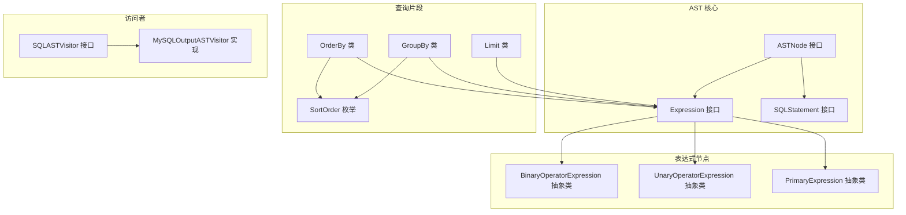
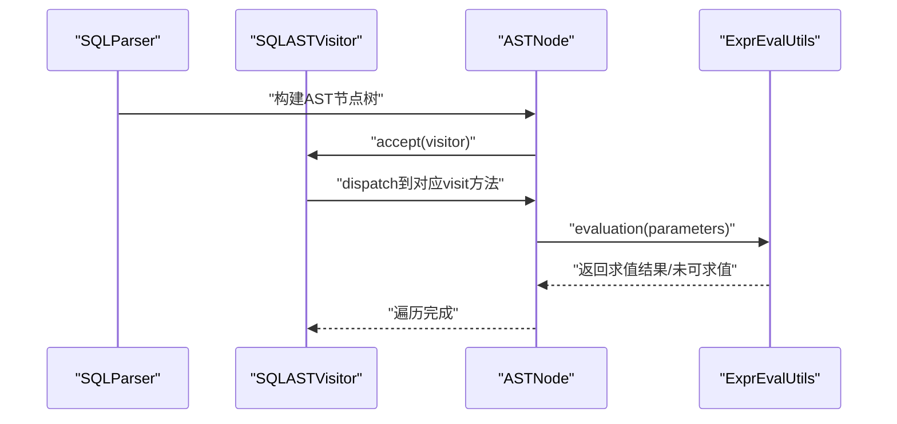
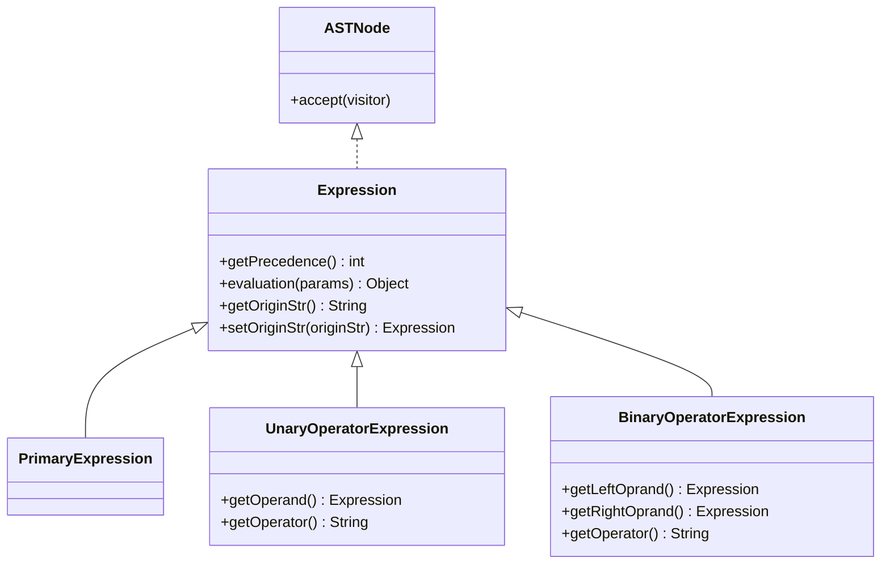
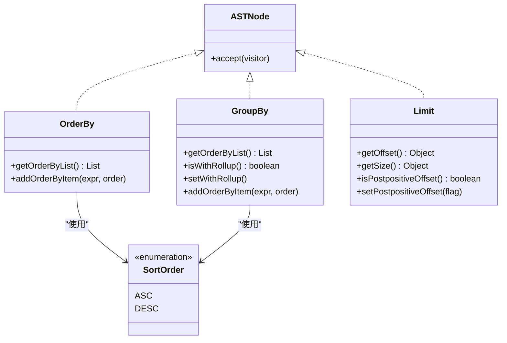
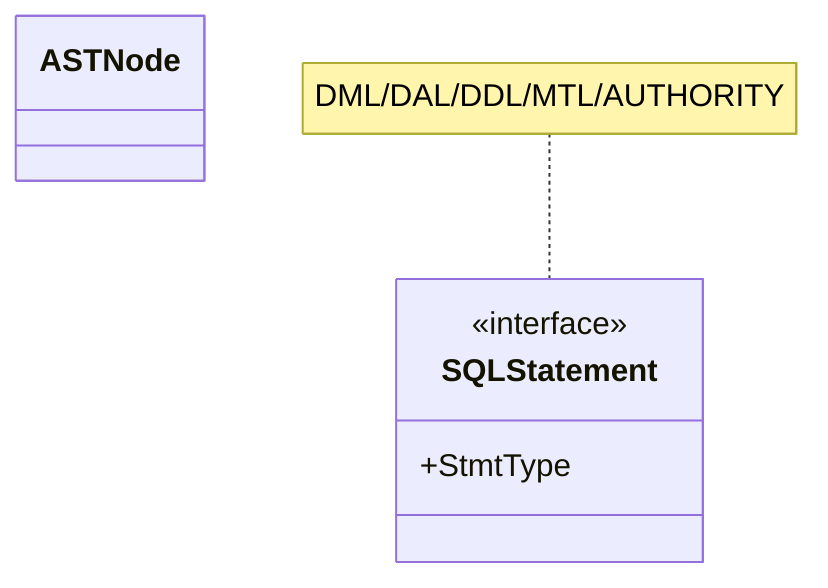
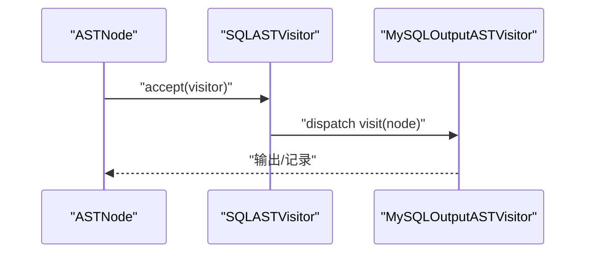
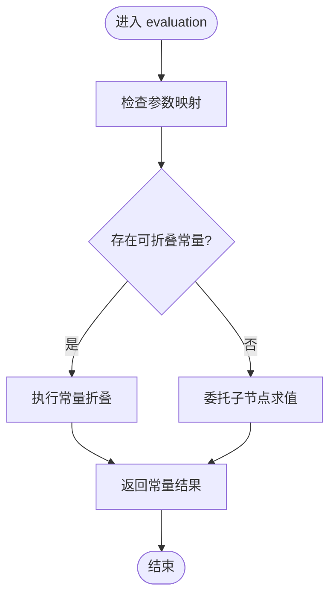
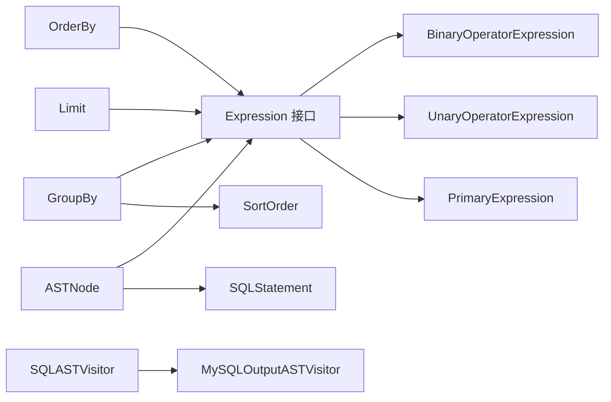

# 抽象语法树处理

<cite>
**本文档引用的文件**
- [ASTNode.java](file://proxy-parser/src/main/java/com/alibaba/polardbx/proxy/parser/ast/ASTNode.java)
- [Expression.java](file://proxy-parser/src/main/java/com/alibaba/polardbx/proxy/parser/ast/expression/Expression.java)
- [SQLStatement.java](file://proxy-parser/src/main/java/com/alibaba/polardbx/proxy/parser/ast/stmt/SQLStatement.java)
- [PrimaryExpression.java](file://proxy-parser/src/main/java/com/alibaba/polardbx/proxy/parser/ast/expression/primary/PrimaryExpression.java)
- [BinaryOperatorExpression.java](file://proxy-parser/src/main/java/com/alibaba/polardbx/proxy/parser/ast/expression/BinaryOperatorExpression.java)
- [UnaryOperatorExpression.java](file://proxy-parser/src/main/java/com/alibaba/polardbx/proxy/parser/ast/expression/UnaryOperatorExpression.java)
- [GroupBy.java](file://proxy-parser/src/main/java/com/alibaba/polardbx/proxy/parser/ast/fragment/GroupBy.java)
- [OrderBy.java](file://proxy-parser/src/main/java/com/alibaba/polardbx/proxy/parser/ast/fragment/OrderBy.java)
- [SortOrder.java](file://proxy-parser/src/main/java/com/alibaba/polardbx/proxy/parser/ast/fragment/SortOrder.java)
- [Limit.java](file://proxy-parser/src/main/java/com/alibaba/polardbx/proxy/parser/ast/fragment/Limit.java)
- [SQLASTVisitor.java](file://proxy-parser/src/main/java/com/alibaba/polardbx/proxy/parser/visitor/SQLASTVisitor.java)
- [MySQLOutputASTVisitor.java](file://proxy-parser/src/main/java/com/alibaba/polardbx/proxy/parser/visitor/MySQLOutputASTVisitor.java)
- [ExprEvalUtils.java](file://proxy-parser/src/main/java/com/alibaba/polardbx/proxy/parser/util/ExprEvalUtils.java)
- [SQLParser.java](file://proxy-parser/src/main/java/com/alibaba/polardbx/proxy/parser/recognizer/SQLParser.java)
</cite>

## 目录
1. [引言](#引言)
2. [项目结构](#项目结构)
3. [核心组件](#核心组件)
4. [架构总览](#架构总览)
5. [详细组件分析](#详细组件分析)
6. [依赖分析](#依赖分析)
7. [性能考虑](#性能考虑)
8. [故障排查指南](#故障排查指南)
9. [结论](#结论)
10. [附录](#附录)

## 引言
本文件系统性梳理PolarDB-X Proxy解析器中的抽象语法树（AST）处理机制，围绕ASTNode基类与节点类型体系展开，覆盖表达式节点、语句节点、查询片段（如排序、分组、限制）等层次结构；详述AST节点的构建流程、属性设置与父子关系维护；阐述表达式求值、常量折叠、表达式重写等优化技术；给出AST遍历、访问者模式应用与节点转换实现细节；并展示AST序列化、反序列化与调试输出能力，以及如何基于AST进行SQL改写、查询优化与路由决策支持。

## 项目结构
AST模块位于proxy-parser子工程中，采用按职责分层的组织方式：
- ast：根接口与通用节点定义
- ast.expression：表达式节点族，含一元/二元/三元/多面运算符、主表达式等
- ast.stmt：语句节点族，按DML/DAL/DDL等分类
- ast.fragment：查询片段，如OrderBy、GroupBy、Limit等
- visitor：访问者接口与实现，用于遍历与输出
- util：工具类，如表达式求值辅助、字符串处理等
- recognizer：词法与语法识别器，负责从SQL文本生成AST

图表来源
- [ASTNode.java](file://proxy-parser/src/main/java/com/alibaba/polardbx/proxy/parser/ast/ASTNode.java#L28-L31)
- [Expression.java](file://proxy-parser/src/main/java/com/alibaba/polardbx/proxy/parser/ast/expression/Expression.java#L30-L69)
- [SQLStatement.java](file://proxy-parser/src/main/java/com/alibaba/polardbx/proxy/parser/ast/stmt/SQLStatement.java#L28-L40)
- [BinaryOperatorExpression.java](file://proxy-parser/src/main/java/com/alibaba/polardbx/proxy/parser/ast/expression/BinaryOperatorExpression.java#L31-L80)
- [UnaryOperatorExpression.java](file://proxy-parser/src/main/java/com/alibaba/polardbx/proxy/parser/ast/expression/UnaryOperatorExpression.java#L30-L64)
- [PrimaryExpression.java](file://proxy-parser/src/main/java/com/alibaba/polardbx/proxy/parser/ast/expression/primary/PrimaryExpression.java#L30-L41)
- [OrderBy.java](file://proxy-parser/src/main/java/com/alibaba/polardbx/proxy/parser/ast/fragment/OrderBy.java#L34-L76)
- [GroupBy.java](file://proxy-parser/src/main/java/com/alibaba/polardbx/proxy/parser/ast/fragment/GroupBy.java#L34-L83)
- [SortOrder.java](file://proxy-parser/src/main/java/com/alibaba/polardbx/proxy/parser/ast/fragment/SortOrder.java#L26-L28)
- [Limit.java](file://proxy-parser/src/main/java/com/alibaba/polardbx/proxy/parser/ast/fragment/Limit.java#L30-L125)
- [SQLASTVisitor.java](file://proxy-parser/src/main/java/com/alibaba/polardbx/proxy/parser/visitor/SQLASTVisitor.java)
- [MySQLOutputASTVisitor.java](file://proxy-parser/src/main/java/com/alibaba/polardbx/proxy/parser/visitor/MySQLOutputASTVisitor.java)

章节来源
- [ASTNode.java](file://proxy-parser/src/main/java/com/alibaba/polardbx/proxy/parser/ast/ASTNode.java#L28-L31)
- [Expression.java](file://proxy-parser/src/main/java/com/alibaba/polardbx/proxy/parser/ast/expression/Expression.java#L30-L69)
- [SQLStatement.java](file://proxy-parser/src/main/java/com/alibaba/polardbx/proxy/parser/ast/stmt/SQLStatement.java#L28-L40)

## 核心组件
- ASTNode：所有AST节点的统一接口，定义了accept方法以支持访问者模式。
- Expression：表达式节点接口，定义运算符优先级常量、求值接口evaluation、原始字符串缓存与originStr属性。
- SQLStatement：语句节点接口，定义StmtType枚举，区分DML/DAL/DDL/MTL/AUTHORITY等语句类型。
- PrimaryExpression：主表达式抽象基类，优先级为PRIMARY，evaluation默认返回未可求值标记。
- BinaryOperatorExpression：二元运算符抽象基类，持有左右操作数与优先级，evaluation默认未可求值。
- UnaryOperatorExpression：一元运算符抽象基类，持有操作数与优先级，evaluation默认未可求值。
- OrderBy/GroupBy/Limit：查询片段，分别表示排序列表、分组列表与LIMIT子句，均实现ASTNode并通过accept接入访问者。
- SortOrder：排序方向枚举，ASC/DESC。
- 访问者：SQLASTVisitor为抽象访问者接口，MySQLOutputASTVisitor为具体实现，负责将AST转回SQL或调试输出。

章节来源
- [ASTNode.java](file://proxy-parser/src/main/java/com/alibaba/polardbx/proxy/parser/ast/ASTNode.java#L28-L31)
- [Expression.java](file://proxy-parser/src/main/java/com/alibaba/polardbx/proxy/parser/ast/expression/Expression.java#L30-L69)
- [SQLStatement.java](file://proxy-parser/src/main/java/com/alibaba/polardbx/proxy/parser/ast/stmt/SQLStatement.java#L28-L40)
- [PrimaryExpression.java](file://proxy-parser/src/main/java/com/alibaba/polardbx/proxy/parser/ast/expression/primary/PrimaryExpression.java#L30-L41)
- [BinaryOperatorExpression.java](file://proxy-parser/src/main/java/com/alibaba/polardbx/proxy/parser/ast/expression/BinaryOperatorExpression.java#L31-L80)
- [UnaryOperatorExpression.java](file://proxy-parser/src/main/java/com/alibaba/polardbx/proxy/parser/ast/expression/UnaryOperatorExpression.java#L30-L64)
- [OrderBy.java](file://proxy-parser/src/main/java/com/alibaba/polardbx/proxy/parser/ast/fragment/OrderBy.java#L34-L76)
- [GroupBy.java](file://proxy-parser/src/main/java/com/alibaba/polardbx/proxy/parser/ast/fragment/GroupBy.java#L34-L83)
- [SortOrder.java](file://proxy-parser/src/main/java/com/alibaba/polardbx/proxy/parser/ast/fragment/SortOrder.java#L26-L28)
- [Limit.java](file://proxy-parser/src/main/java/com/alibaba/polardbx/proxy/parser/ast/fragment/Limit.java#L30-L125)
- [SQLASTVisitor.java](file://proxy-parser/src/main/java/com/alibaba/polardbx/proxy/parser/visitor/SQLASTVisitor.java)
- [MySQLOutputASTVisitor.java](file://proxy-parser/src/main/java/com/alibaba/polardbx/proxy/parser/visitor/MySQLOutputASTVisitor.java)

## 架构总览
AST处理遵循“识别器生成AST → 访问者遍历/输出 → 工具类参与求值/重写”的整体流程。识别器将SQL文本解析为AST节点树，访问者通过accept统一入口遍历节点，工具类提供表达式求值与常量折叠等优化能力，最终由输出访问者生成SQL或进行调试打印。

图表来源
- [SQLParser.java](file://proxy-parser/src/main/java/com/alibaba/polardbx/proxy/parser/recognizer/SQLParser.java)
- [SQLASTVisitor.java](file://proxy-parser/src/main/java/com/alibaba/polardbx/proxy/parser/visitor/SQLASTVisitor.java)
- [ExprEvalUtils.java](file://proxy-parser/src/main/java/com/alibaba/polardbx/proxy/parser/util/ExprEvalUtils.java)
- [ASTNode.java](file://proxy-parser/src/main/java/com/alibaba/polardbx/proxy/parser/ast/ASTNode.java#L28-L31)

## 详细组件分析

### 表达式节点层次与优先级
表达式节点通过继承体系形成清晰的层次结构：
- Expression接口定义优先级常量与evaluation接口
- PrimaryExpression：主表达式（如字面量、参数占位符、函数调用等），优先级最高
- UnaryOperatorExpression：一元运算符（如逻辑非、负号等）
- BinaryOperatorExpression：二元运算符（算术、比较、逻辑、位运算等）

图表来源
- [ASTNode.java](file://proxy-parser/src/main/java/com/alibaba/polardbx/proxy/parser/ast/ASTNode.java#L28-L31)
- [Expression.java](file://proxy-parser/src/main/java/com/alibaba/polardbx/proxy/parser/ast/expression/Expression.java#L30-L69)
- [PrimaryExpression.java](file://proxy-parser/src/main/java/com/alibaba/polardbx/proxy/parser/ast/expression/primary/PrimaryExpression.java#L30-L41)
- [UnaryOperatorExpression.java](file://proxy-parser/src/main/java/com/alibaba/polardbx/proxy/parser/ast/expression/UnaryOperatorExpression.java#L30-L64)
- [BinaryOperatorExpression.java](file://proxy-parser/src/main/java/com/alibaba/polardbx/proxy/parser/ast/expression/BinaryOperatorExpression.java#L31-L80)

章节来源
- [Expression.java](file://proxy-parser/src/main/java/com/alibaba/polardbx/proxy/parser/ast/expression/Expression.java#L30-L69)
- [PrimaryExpression.java](file://proxy-parser/src/main/java/com/alibaba/polardbx/proxy/parser/ast/expression/primary/PrimaryExpression.java#L30-L41)
- [UnaryOperatorExpression.java](file://proxy-parser/src/main/java/com/alibaba/polardbx/proxy/parser/ast/expression/UnaryOperatorExpression.java#L30-L64)
- [BinaryOperatorExpression.java](file://proxy-parser/src/main/java/com/alibaba/polardbx/proxy/parser/ast/expression/BinaryOperatorExpression.java#L31-L80)

### 查询片段：排序、分组、限制
查询片段作为独立的AST节点，服务于SELECT等语句的子句表达：
- OrderBy：保存表达式与排序方向的有序对列表
- GroupBy：保存表达式与排序方向的有序对列表，并支持WITH ROLLUP
- SortOrder：ASC/DESC
- Limit：支持数值或参数占位符的offset与size，并支持后置OFFSET语法标记

图表来源
- [OrderBy.java](file://proxy-parser/src/main/java/com/alibaba/polardbx/proxy/parser/ast/fragment/OrderBy.java#L34-L76)
- [GroupBy.java](file://proxy-parser/src/main/java/com/alibaba/polardbx/proxy/parser/ast/fragment/GroupBy.java#L34-L83)
- [SortOrder.java](file://proxy-parser/src/main/java/com/alibaba/polardbx/proxy/parser/ast/fragment/SortOrder.java#L26-L28)
- [Limit.java](file://proxy-parser/src/main/java/com/alibaba/polardbx/proxy/parser/ast/fragment/Limit.java#L30-L125)

章节来源
- [OrderBy.java](file://proxy-parser/src/main/java/com/alibaba/polardbx/proxy/parser/ast/fragment/OrderBy.java#L34-L76)
- [GroupBy.java](file://proxy-parser/src/main/java/com/alibaba/polardbx/proxy/parser/ast/fragment/GroupBy.java#L34-L83)
- [SortOrder.java](file://proxy-parser/src/main/java/com/alibaba/polardbx/proxy/parser/ast/fragment/SortOrder.java#L26-L28)
- [Limit.java](file://proxy-parser/src/main/java/com/alibaba/polardbx/proxy/parser/ast/fragment/Limit.java#L30-L125)

### 语句节点与类型体系
SQLStatement接口定义了StmtType枚举，涵盖DML（SELECT/DELETE/INSERT/REPLACE/UPDATE/CALL）、DAL（SET/SHOW等）、MTL（事务控制）与AUTHORITY等语句类型，便于后续路由与优化策略选择。

图表来源
- [SQLStatement.java](file://proxy-parser/src/main/java/com/alibaba/polardbx/proxy/parser/ast/stmt/SQLStatement.java#L28-L40)

章节来源
- [SQLStatement.java](file://proxy-parser/src/main/java/com/alibaba/polardbx/proxy/parser/ast/stmt/SQLStatement.java#L28-L40)

### 访问者模式与遍历
访问者模式通过ASTNode.accept统一入口，将遍历与行为分离：
- SQLASTVisitor：抽象访问者接口
- MySQLOutputASTVisitor：具体访问者，负责将AST节点输出为SQL字符串或调试信息

图表来源
- [ASTNode.java](file://proxy-parser/src/main/java/com/alibaba/polardbx/proxy/parser/ast/ASTNode.java#L28-L31)
- [SQLASTVisitor.java](file://proxy-parser/src/main/java/com/alibaba/polardbx/proxy/parser/visitor/SQLASTVisitor.java)
- [MySQLOutputASTVisitor.java](file://proxy-parser/src/main/java/com/alibaba/polardbx/proxy/parser/visitor/MySQLOutputASTVisitor.java)

章节来源
- [ASTNode.java](file://proxy-parser/src/main/java/com/alibaba/polardbx/proxy/parser/ast/ASTNode.java#L28-L31)
- [SQLASTVisitor.java](file://proxy-parser/src/main/java/com/alibaba/polardbx/proxy/parser/visitor/SQLASTVisitor.java)
- [MySQLOutputASTVisitor.java](file://proxy-parser/src/main/java/com/alibaba/polardbx/proxy/parser/visitor/MySQLOutputASTVisitor.java)

### AST构建、属性设置与父子关系维护
- 构建过程：识别器在解析过程中构造各类AST节点，设置字段（如表达式操作数、查询片段列表、原始字符串等）
- 属性设置：表达式节点支持originStr与缓存求值结果标志；查询片段支持withRollup、postpositiveOffset等特性
- 父子关系：二元/一元表达式通过left/right/operand字段建立父子关系；OrderBy/GroupBy通过列表维护子项

章节来源
- [BinaryOperatorExpression.java](file://proxy-parser/src/main/java/com/alibaba/polardbx/proxy/parser/ast/expression/BinaryOperatorExpression.java#L31-L80)
- [UnaryOperatorExpression.java](file://proxy-parser/src/main/java/com/alibaba/polardbx/proxy/parser/ast/expression/UnaryOperatorExpression.java#L30-L64)
- [PrimaryExpression.java](file://proxy-parser/src/main/java/com/alibaba/polardbx/proxy/parser/ast/expression/primary/PrimaryExpression.java#L30-L41)
- [Expression.java](file://proxy-parser/src/main/java/com/alibaba/polardbx/proxy/parser/ast/expression/Expression.java#L60-L68)
- [GroupBy.java](file://proxy-parser/src/main/java/com/alibaba/polardbx/proxy/parser/ast/fragment/GroupBy.java#L34-L83)
- [OrderBy.java](file://proxy-parser/src/main/java/com/alibaba/polardbx/proxy/parser/ast/fragment/OrderBy.java#L34-L76)
- [Limit.java](file://proxy-parser/src/main/java/com/alibaba/polardbx/proxy/parser/ast/fragment/Limit.java#L30-L125)

### 表达式求值、常量折叠与表达式重写
- 求值：Expression.evaluation接受参数映射，返回求值结果或未可求值标记；PrimaryExpression默认未可求值，二元/一元表达式同样默认未可求值
- 常量折叠：在已知参数或静态上下文中，可对表达式进行常量折叠以简化计算
- 表达式重写：通过访问者遍历AST，替换或合并节点，实现谓词下推、投影裁剪等优化

图表来源
- [Expression.java](file://proxy-parser/src/main/java/com/alibaba/polardbx/proxy/parser/ast/expression/Expression.java#L60-L68)
- [PrimaryExpression.java](file://proxy-parser/src/main/java/com/alibaba/polardbx/proxy/parser/ast/expression/primary/PrimaryExpression.java#L37-L40)
- [BinaryOperatorExpression.java](file://proxy-parser/src/main/java/com/alibaba/polardbx/proxy/parser/ast/expression/BinaryOperatorExpression.java#L75-L78)
- [UnaryOperatorExpression.java](file://proxy-parser/src/main/java/com/alibaba/polardbx/proxy/parser/ast/expression/UnaryOperatorExpression.java#L53-L57)

章节来源
- [Expression.java](file://proxy-parser/src/main/java/com/alibaba/polardbx/proxy/parser/ast/expression/Expression.java#L60-L68)
- [PrimaryExpression.java](file://proxy-parser/src/main/java/com/alibaba/polardbx/proxy/parser/ast/expression/primary/PrimaryExpression.java#L37-L40)
- [BinaryOperatorExpression.java](file://proxy-parser/src/main/java/com/alibaba/polardbx/proxy/parser/ast/expression/BinaryOperatorExpression.java#L75-L78)
- [UnaryOperatorExpression.java](file://proxy-parser/src/main/java/com/alibaba/polardbx/proxy/parser/ast/expression/UnaryOperatorExpression.java#L53-L57)

### 节点转换与访问者应用
- 节点转换：通过访问者遍历AST，对匹配条件的节点进行替换或修改，例如将某函数调用替换为等价表达式
- 访问者应用：MySQLOutputASTVisitor在遍历时输出SQL或调试信息，便于验证转换正确性

章节来源
- [SQLASTVisitor.java](file://proxy-parser/src/main/java/com/alibaba/polardbx/proxy/parser/visitor/SQLASTVisitor.java)
- [MySQLOutputASTVisitor.java](file://proxy-parser/src/main/java/com/alibaba/polardbx/proxy/parser/visitor/MySQLOutputASTVisitor.java)

### AST序列化、反序列化与调试输出
- 序列化/反序列化：可通过访问者将AST转为SQL字符串，或在需要时扩展为二进制格式（需结合具体实现）
- 调试输出：MySQLOutputASTVisitor在遍历过程中输出节点信息，便于定位问题与验证优化效果

章节来源
- [MySQLOutputASTVisitor.java](file://proxy-parser/src/main/java/com/alibaba/polardbx/proxy/parser/visitor/MySQLOutputASTVisitor.java)

### 基于AST的SQL改写、查询优化与路由决策
- SQL改写：通过访问者替换节点或重组表达式，实现谓词规范化、子查询展开等
- 查询优化：结合表达式求值与常量折叠，减少运行期开销；利用查询片段信息进行索引提示、排序裁剪等
- 路由决策：根据SQLStatement类型与表达式特征，决定读写分离、分片键匹配与路由路径

章节来源
- [SQLStatement.java](file://proxy-parser/src/main/java/com/alibaba/polardbx/proxy/parser/ast/stmt/SQLStatement.java#L28-L40)
- [Expression.java](file://proxy-parser/src/main/java/com/alibaba/polardbx/proxy/parser/ast/expression/Expression.java#L60-L68)

## 依赖分析
AST各组件之间耦合度低，主要通过ASTNode接口与访问者模式解耦：
- 表达式节点依赖Expression接口与抽象基类
- 查询片段依赖表达式与排序方向枚举
- 访问者通过accept统一调度，避免节点对访问者实现的直接依赖

图表来源
- [Expression.java](file://proxy-parser/src/main/java/com/alibaba/polardbx/proxy/parser/ast/expression/Expression.java#L30-L69)
- [BinaryOperatorExpression.java](file://proxy-parser/src/main/java/com/alibaba/polardbx/proxy/parser/ast/expression/BinaryOperatorExpression.java#L31-L80)
- [UnaryOperatorExpression.java](file://proxy-parser/src/main/java/com/alibaba/polardbx/proxy/parser/ast/expression/UnaryOperatorExpression.java#L30-L64)
- [PrimaryExpression.java](file://proxy-parser/src/main/java/com/alibaba/polardbx/proxy/parser/ast/expression/primary/PrimaryExpression.java#L30-L41)
- [OrderBy.java](file://proxy-parser/src/main/java/com/alibaba/polardbx/proxy/parser/ast/fragment/OrderBy.java#L34-L76)
- [GroupBy.java](file://proxy-parser/src/main/java/com/alibaba/polardbx/proxy/parser/ast/fragment/GroupBy.java#L34-L83)
- [SortOrder.java](file://proxy-parser/src/main/java/com/alibaba/polardbx/proxy/parser/ast/fragment/SortOrder.java#L26-L28)
- [Limit.java](file://proxy-parser/src/main/java/com/alibaba/polardbx/proxy/parser/ast/fragment/Limit.java#L30-L125)
- [SQLASTVisitor.java](file://proxy-parser/src/main/java/com/alibaba/polardbx/proxy/parser/visitor/SQLASTVisitor.java)
- [MySQLOutputASTVisitor.java](file://proxy-parser/src/main/java/com/alibaba/polardbx/proxy/parser/visitor/MySQLOutputASTVisitor.java)
- [ASTNode.java](file://proxy-parser/src/main/java/com/alibaba/polardbx/proxy/parser/ast/ASTNode.java#L28-L31)
- [SQLStatement.java](file://proxy-parser/src/main/java/com/alibaba/polardbx/proxy/parser/ast/stmt/SQLStatement.java#L28-L40)

章节来源
- [Expression.java](file://proxy-parser/src/main/java/com/alibaba/polardbx/proxy/parser/ast/expression/Expression.java#L30-L69)
- [SQLStatement.java](file://proxy-parser/src/main/java/com/alibaba/polardbx/proxy/parser/ast/stmt/SQLStatement.java#L28-L40)
- [OrderBy.java](file://proxy-parser/src/main/java/com/alibaba/polardbx/proxy/parser/ast/fragment/OrderBy.java#L34-L76)
- [GroupBy.java](file://proxy-parser/src/main/java/com/alibaba/polardbx/proxy/parser/ast/fragment/GroupBy.java#L34-L83)
- [SortOrder.java](file://proxy-parser/src/main/java/com/alibaba/polardbx/proxy/parser/ast/fragment/SortOrder.java#L26-L28)
- [Limit.java](file://proxy-parser/src/main/java/com/alibaba/polardbx/proxy/parser/ast/fragment/Limit.java#L30-L125)
- [SQLASTVisitor.java](file://proxy-parser/src/main/java/com/alibaba/polardbx/proxy/parser/visitor/SQLASTVisitor.java)
- [MySQLOutputASTVisitor.java](file://proxy-parser/src/main/java/com/alibaba/polardbx/proxy/parser/visitor/MySQLOutputASTVisitor.java)
- [ASTNode.java](file://proxy-parser/src/main/java/com/alibaba/polardbx/proxy/parser/ast/ASTNode.java#L28-L31)

## 性能考虑
- 优先级常量：通过明确的优先级常量，避免重复计算，提升表达式求值与括号插入的效率
- 列表容量预估：OrderBy/GroupBy在构造时预设容量，减少扩容成本
- 未可求值短路：evaluation默认返回未可求值标记，避免无效计算
- 参数占位符：Limit支持参数占位符，降低编译期绑定成本

章节来源
- [Expression.java](file://proxy-parser/src/main/java/com/alibaba/polardbx/proxy/parser/ast/expression/Expression.java#L32-L50)
- [OrderBy.java](file://proxy-parser/src/main/java/com/alibaba/polardbx/proxy/parser/ast/fragment/OrderBy.java#L48-L58)
- [GroupBy.java](file://proxy-parser/src/main/java/com/alibaba/polardbx/proxy/parser/ast/fragment/GroupBy.java#L65-L67)
- [Limit.java](file://proxy-parser/src/main/java/com/alibaba/polardbx/proxy/parser/ast/fragment/Limit.java#L46-L96)

## 故障排查指南
- 访问者未覆盖：若新增节点未在访问者中添加visit方法，可能导致遍历不完整或输出异常
- 表达式求值异常：检查evaluation实现与参数映射，确认未可求值分支与缓存标志
- 查询片段配置错误：确认OrderBy/GroupBy/Limit的列表与标志位设置正确
- 优先级误用：核对运算符优先级常量，确保生成SQL符合预期

章节来源
- [SQLASTVisitor.java](file://proxy-parser/src/main/java/com/alibaba/polardbx/proxy/parser/visitor/SQLASTVisitor.java)
- [Expression.java](file://proxy-parser/src/main/java/com/alibaba/polardbx/proxy/parser/ast/expression/Expression.java#L60-L68)
- [OrderBy.java](file://proxy-parser/src/main/java/com/alibaba/polardbx/proxy/parser/ast/fragment/OrderBy.java#L41-L70)
- [GroupBy.java](file://proxy-parser/src/main/java/com/alibaba/polardbx/proxy/parser/ast/fragment/GroupBy.java#L42-L77)
- [Limit.java](file://proxy-parser/src/main/java/com/alibaba/polardbx/proxy/parser/ast/fragment/Limit.java#L101-L118)

## 结论
PolarDB-X Proxy的AST处理以ASTNode为核心，通过Expression与SQLStatement接口定义表达式与语句的统一抽象，配合OrderBy/GroupBy/Limit等查询片段，形成完整的SQL语法树。访问者模式使遍历与输出解耦，表达式求值与常量折叠为优化提供基础。该设计既保证了扩展性，又便于在代理层进行SQL改写、查询优化与路由决策。

## 附录
- 参考实现文件路径：见本文档“引用的文件”清单
- 扩展建议：可在MySQLOutputASTVisitor中增加更多输出选项，在ExprEvalUtils中完善常量折叠与重写规则