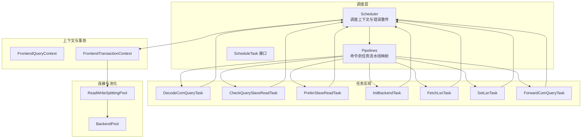
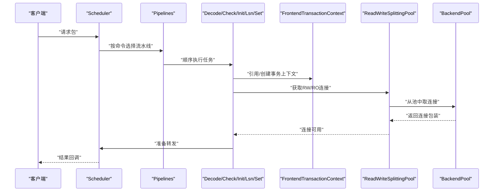
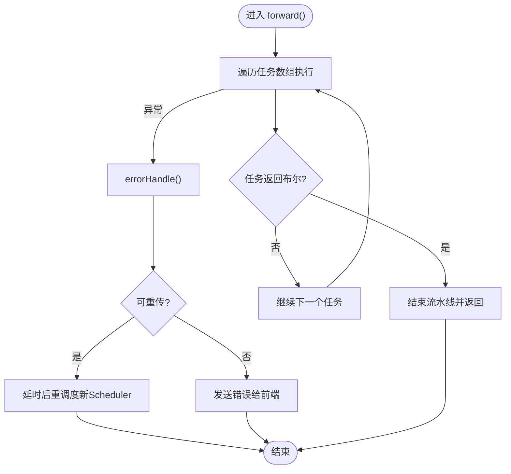
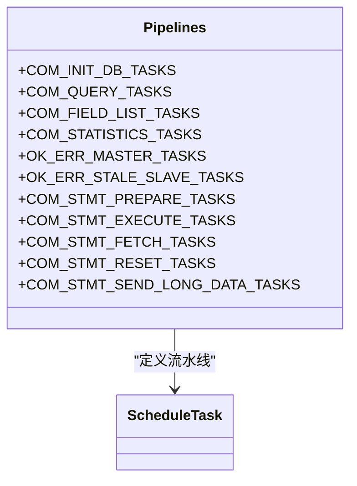
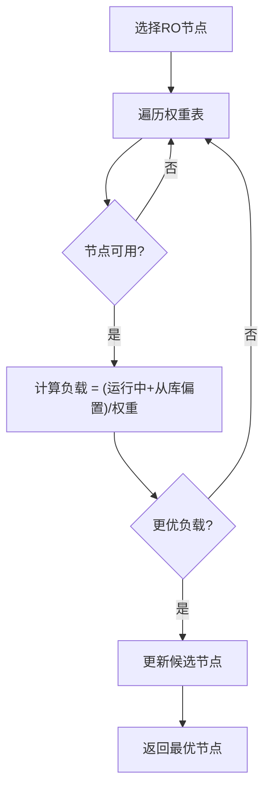
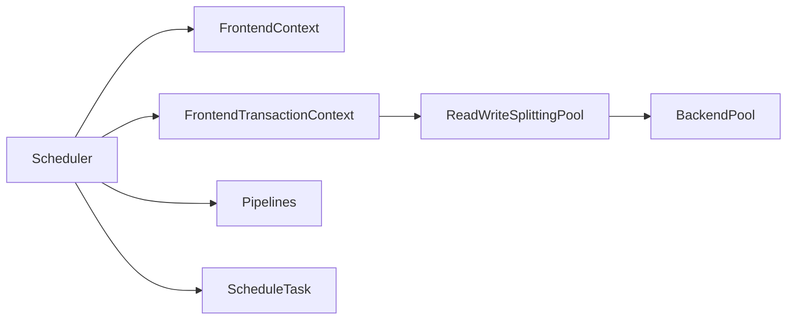

# 查询路由

<cite>
**本文引用的文件**
- [Scheduler.java](file://proxy-core/src/main/java/com/alibaba/polardbx/proxy/scheduler/Scheduler.java)
- [Pipelines.java](file://proxy-core/src/main/java/com/alibaba/polardbx/proxy/scheduler/Pipelines.java)
- [ScheduleTask.java](file://proxy-core/src/main/java/com/alibaba/polardbx/proxy/scheduler/ScheduleTask.java)
- [DecodeComQueryTask.java](file://proxy-core/src/main/java/com/alibaba/polardbx/proxy/scheduler/DecodeComQueryTask.java)
- [CheckQuerySlaveReadTask.java](file://proxy-core/src/main/java/com/alibaba/polardbx/proxy/scheduler/CheckQuerySlaveReadTask.java)
- [PreferSlaveReadTask.java](file://proxy-core/src/main/java/com/alibaba/polardbx/proxy/scheduler/PreferSlaveReadTask.java)
- [InitBackendTask.java](file://proxy-core/src/main/java/com/alibaba/polardbx/proxy/scheduler/InitBackendTask.java)
- [FetchLsnTask.java](file://proxy-core/src/main/java/com/alibaba/polardbx/proxy/scheduler/FetchLsnTask.java)
- [SetLsnTask.java](file://proxy-core/src/main/java/com/alibaba/polardbx/proxy/scheduler/SetLsnTask.java)
- [ForwardComQueryTask.java](file://proxy-core/src/main/java/com/alibaba/polardbx/proxy/scheduler/ForwardComQueryTask.java)
- [FrontendQueryContext.java](file://proxy-core/src/main/java/com/alibaba/polardbx/proxy/context/query/FrontendQueryContext.java)
- [FrontendTransactionContext.java](file://proxy-core/src/main/java/com/alibaba/polardbx/proxy/context/transaction/FrontendTransactionContext.java)
- [BackendPool.java](file://proxy-core/src/main/java/com/alibaba/polardbx/proxy/connection/pool/BackendPool.java)
- [ReadWriteSplittingPool.java](file://proxy-core/src/main/java/com/alibaba/polardbx/proxy/serverless/ReadWriteSplittingPool.java)
</cite>

## 目录
1. [引言](#引言)
2. [项目结构](#项目结构)
3. [核心组件](#核心组件)
4. [架构总览](#架构总览)
5. [详细组件分析](#详细组件分析)
6. [依赖关系分析](#依赖关系分析)
7. [性能考量](#性能考量)
8. [故障排查指南](#故障排查指南)
9. [结论](#结论)
10. [附录](#附录)

## 引言
本文件系统化梳理PolarDB-X Proxy查询路由体系，围绕Scheduler如何依据SQL语句类型、表分布与查询条件进行智能路由展开，覆盖单表查询、多表联接、聚合查询与DDL等场景的路由策略；阐述读写分离、负载均衡、节点选择与故障转移；给出查询任务的创建、分发与执行流程（Pipeline与并行处理）；说明LSN读延迟控制、路由决策缓存与动态更新、性能监控；以及分布式事务、一致性与回滚机制。

## 项目结构
- 路由调度层：Scheduler、Pipelines、各ScheduleTask实现
- 上下文与事务：FrontendContext、FrontendTransactionContext、FrontendQueryContext
- 连接与池化：BackendConnectionWrapper、BackendPool、ReadWriteSplittingPool
- 解析与识别：SQL解析器（用于判断是否可走从库）

图表来源
- [Scheduler.java](file://proxy-core/src/main/java/com/alibaba/polardbx/proxy/scheduler/Scheduler.java#L46-L315)
- [Pipelines.java](file://proxy-core/src/main/java/com/alibaba/polardbx/proxy/scheduler/Pipelines.java#L21-L129)
- [ScheduleTask.java](file://proxy-core/src/main/java/com/alibaba/polardbx/proxy/scheduler/ScheduleTask.java#L21-L31)
- [FrontendTransactionContext.java](file://proxy-core/src/main/java/com/alibaba/polardbx/proxy/context/transaction/FrontendTransactionContext.java#L41-L227)
- [ReadWriteSplittingPool.java](file://proxy-core/src/main/java/com/alibaba/polardbx/proxy/serverless/ReadWriteSplittingPool.java#L48-L407)
- [BackendPool.java](file://proxy-core/src/main/java/com/alibaba/polardbx/proxy/connection/pool/BackendPool.java#L46-L284)

章节来源
- [Scheduler.java](file://proxy-core/src/main/java/com/alibaba/polardbx/proxy/scheduler/Scheduler.java#L46-L315)
- [Pipelines.java](file://proxy-core/src/main/java/com/alibaba/polardbx/proxy/scheduler/Pipelines.java#L21-L129)

## 核心组件
- Scheduler：封装一次请求的调度上下文，负责按Pipeline顺序执行各任务，处理重传、错误与资源释放。
- ScheduleTask：调度任务接口，每个任务实现一个职责清晰的步骤（解码、检查从库、初始化后端、LSN设置、转发等）。
- Pipelines：将MySQL命令映射为固定的任务流水线，确保不同命令类型有统一的处理序列。
- FrontendContext/FrontendTransactionContext：前端上下文与事务上下文，管理会话状态、自动提交、事务开启、只读/读写连接持有与回收。
- ReadWriteSplittingPool/BackendPool：读写分离连接池，按权重与负载选择后端节点，支持主从切换与延迟阈值过滤。

章节来源
- [ScheduleTask.java](file://proxy-core/src/main/java/com/alibaba/polardbx/proxy/scheduler/ScheduleTask.java#L21-L31)
- [Pipelines.java](file://proxy-core/src/main/java/com/alibaba/polardbx/proxy/scheduler/Pipelines.java#L21-L129)
- [FrontendTransactionContext.java](file://proxy-core/src/main/java/com/alibaba/polardbx/proxy/context/transaction/FrontendTransactionContext.java#L41-L227)
- [ReadWriteSplittingPool.java](file://proxy-core/src/main/java/com/alibaba/polardbx/proxy/serverless/ReadWriteSplittingPool.java#L48-L407)
- [BackendPool.java](file://proxy-core/src/main/java/com/alibaba/polardbx/proxy/connection/pool/BackendPool.java#L46-L284)

## 架构总览
Scheduler以Pipeline为驱动，按命令类型依次执行解码、从库判定、后端连接初始化、LSN获取与设置、转发执行与结果回调。事务上下文贯穿全程，确保在事务期间强制走主库或保持连接一致性。

图表来源
- [Scheduler.java](file://proxy-core/src/main/java/com/alibaba/polardbx/proxy/scheduler/Scheduler.java#L300-L315)
- [Pipelines.java](file://proxy-core/src/main/java/com/alibaba/polardbx/proxy/scheduler/Pipelines.java#L34-L47)
- [InitBackendTask.java](file://proxy-core/src/main/java/com/alibaba/polardbx/proxy/scheduler/InitBackendTask.java#L27-L49)
- [FrontendTransactionContext.java](file://proxy-core/src/main/java/com/alibaba/polardbx/proxy/context/transaction/FrontendTransactionContext.java#L101-L153)
- [ReadWriteSplittingPool.java](file://proxy-core/src/main/java/com/alibaba/polardbx/proxy/serverless/ReadWriteSplittingPool.java#L343-L393)
- [BackendPool.java](file://proxy-core/src/main/java/com/alibaba/polardbx/proxy/connection/pool/BackendPool.java#L115-L132)

## 详细组件分析

### Scheduler：调度上下文与重传
- 职责：保存前端连接、上下文、原始包、开始时间、任务数组；提供错误处理与重传逻辑；记录各类耗时指标。
- 关键点：
  - forward()遍历任务数组，遇到非空返回即终止流水线。
  - errorHandle()在未进入转发前捕获异常，基于配置决定是否快速重传；重传时新建Scheduler上下文并切换线程标记。
  - 提供addRetransmitDelayNanos、addFetchLsnNanos、addScheduleNanos、addWaitLsnNanos等累计统计，便于性能监控。

图表来源
- [Scheduler.java](file://proxy-core/src/main/java/com/alibaba/polardbx/proxy/scheduler/Scheduler.java#L300-L315)
- [Scheduler.java](file://proxy-core/src/main/java/com/alibaba/polardbx/proxy/scheduler/Scheduler.java#L234-L297)

章节来源
- [Scheduler.java](file://proxy-core/src/main/java/com/alibaba/polardbx/proxy/scheduler/Scheduler.java#L46-L315)

### Pipelines：命令到任务流水线
- 将MySQL命令类型映射到固定的任务序列，确保行为一致：
  - COM_INIT_DB/COM_FIELD_LIST/COM_STATISTICS/OK_ERR等：基础初始化与转发。
  - COM_QUERY：解码、系统命令处理、从库判定、后端初始化、LSN获取/设置、转发。
  - COM_STMT_PREPARE/EXECUTE/FETCH/RESET/SEND_LONG_DATA：针对预处理语句的专用流水线。

图表来源
- [Pipelines.java](file://proxy-core/src/main/java/com/alibaba/polardbx/proxy/scheduler/Pipelines.java#L21-L129)

章节来源
- [Pipelines.java](file://proxy-core/src/main/java/com/alibaba/polardbx/proxy/scheduler/Pipelines.java#L21-L129)

### 任务实现与路由策略

#### 解码与系统命令
- DecodeComQueryTask：对COM_QUERY进行解码，提取SQL字节，供后续从库判定使用。
- SystemCommandTask：系统命令处理（见Pipelines定义），在COM_QUERY流水线中先行处理。

章节来源
- [DecodeComQueryTask.java](file://proxy-core/src/main/java/com/alibaba/polardbx/proxy/scheduler/DecodeComQueryTask.java#L24-L34)

#### 从库判定与偏好
- CheckQuerySlaveReadTask：解析SQL，调用解析器判断是否允许从库读；在非事务或自动提交场景下生效。
- PreferSlaveReadTask：在非事务/自动提交时默认走从库，作为保守策略。

章节来源
- [CheckQuerySlaveReadTask.java](file://proxy-core/src/main/java/com/alibaba/polardbx/proxy/scheduler/CheckQuerySlaveReadTask.java#L32-L74)
- [PreferSlaveReadTask.java](file://proxy-core/src/main/java/com/alibaba/polardbx/proxy/scheduler/PreferSlaveReadTask.java#L23-L37)

#### 后端连接初始化
- InitBackendTask：根据从库偏好与事务上下文获取RW/RO连接；若从库不可用且偏好从库，则回退到RW；若无可用连接则抛出异常。

章节来源
- [InitBackendTask.java](file://proxy-core/src/main/java/com/alibaba/polardbx/proxy/scheduler/InitBackendTask.java#L27-L49)

#### LSN读延迟控制
- FetchLsnTask：在满足条件时异步获取LSN，失败则强制走主库并触发错误处理；成功则携带LSN继续流水线。
- SetLsnTask：在从库连接上设置read_lsn，记录等待耗时；失败则快速中止并回退主库。

章节来源
- [FetchLsnTask.java](file://proxy-core/src/main/java/com/alibaba/polardbx/proxy/scheduler/FetchLsnTask.java#L31-L97)
- [SetLsnTask.java](file://proxy-core/src/main/java/com/alibaba/polardbx/proxy/scheduler/SetLsnTask.java#L30-L75)

#### 转发与结果回调
- ForwardComQueryTask：构建QueryResultHandler与回调，调用父类ForwardTaskBase.post完成实际转发与结果汇聚。

章节来源
- [ForwardComQueryTask.java](file://proxy-core/src/main/java/com/alibaba/polardbx/proxy/scheduler/ForwardComQueryTask.java#L30-L55)

### 事务与一致性
- FrontendTransactionContext：维护RW/RO连接、事务计数、预处理语句映射、连接持有策略；在关闭时释放或丢弃连接，并复用/重置预处理语句。
- 事务期间强制走主库或保持连接一致性，避免跨库不一致。

章节来源
- [FrontendTransactionContext.java](file://proxy-core/src/main/java/com/alibaba/polardbx/proxy/context/transaction/FrontendTransactionContext.java#L41-L227)

### 负载均衡与节点选择
- ReadWriteSplittingPool：维护RW/RO池，按权重与延迟阈值选择节点；计算负载（运行中连接数+从库权重）进行选择；支持领导者/追随者/学徒节点组合。
- BackendPool：连接池化，按最大池大小复用连接；定期刷新全局变量与健康探测；释放时根据池容量决定复用或关闭。

图表来源
- [ReadWriteSplittingPool.java](file://proxy-core/src/main/java/com/alibaba/polardbx/proxy/serverless/ReadWriteSplittingPool.java#L365-L393)
- [BackendPool.java](file://proxy-core/src/main/java/com/alibaba/polardbx/proxy/connection/pool/BackendPool.java#L107-L132)

章节来源
- [ReadWriteSplittingPool.java](file://proxy-core/src/main/java/com/alibaba/polardbx/proxy/serverless/ReadWriteSplittingPool.java#L48-L407)
- [BackendPool.java](file://proxy-core/src/main/java/com/alibaba/polardbx/proxy/connection/pool/BackendPool.java#L46-L284)

## 依赖关系分析
- Scheduler依赖FrontendContext与FrontendTransactionContext进行事务与上下文管理；依赖Pipelines确定任务序列；依赖ScheduleTask实现具体步骤。
- 任务之间通过Scheduler传递状态（从库偏好、LSN、后端连接等），形成链式依赖。
- 连接池层通过ReadWriteSplittingPool与BackendPool提供后端连接，承担负载均衡与健康检查。

图表来源
- [Scheduler.java](file://proxy-core/src/main/java/com/alibaba/polardbx/proxy/scheduler/Scheduler.java#L53-L90)
- [FrontendTransactionContext.java](file://proxy-core/src/main/java/com/alibaba/polardbx/proxy/context/transaction/FrontendTransactionContext.java#L101-L153)
- [ReadWriteSplittingPool.java](file://proxy-core/src/main/java/com/alibaba/polardbx/proxy/serverless/ReadWriteSplittingPool.java#L343-L393)
- [BackendPool.java](file://proxy-core/src/main/java/com/alibaba/polardbx/proxy/connection/pool/BackendPool.java#L115-L132)

章节来源
- [Scheduler.java](file://proxy-core/src/main/java/com/alibaba/polardbx/proxy/scheduler/Scheduler.java#L46-L315)
- [FrontendTransactionContext.java](file://proxy-core/src/main/java/com/alibaba/polardbx/proxy/context/transaction/FrontendTransactionContext.java#L41-L227)

## 性能考量
- Pipeline串行化：每条命令按固定顺序执行，确保一致性；可通过任务粒度优化减少阻塞。
- LSN异步获取与等待：FetchLsnTask异步获取LSN并在回调中继续调度，SetLsnTask记录等待耗时，便于定位延迟瓶颈。
- 连接池复用：BackendPool按最大池大小复用连接，降低握手开销；ReadWriteSplittingPool按权重与负载选择节点，提升整体吞吐。
- 统计指标：Scheduler累计重传、LSN获取、调度、等待LSN、等待Leader等耗时，可用于性能监控与告警。

章节来源
- [FetchLsnTask.java](file://proxy-core/src/main/java/com/alibaba/polardbx/proxy/scheduler/FetchLsnTask.java#L34-L95)
- [SetLsnTask.java](file://proxy-core/src/main/java/com/alibaba/polardbx/proxy/scheduler/SetLsnTask.java#L54-L70)
- [BackendPool.java](file://proxy-core/src/main/java/com/alibaba/polardbx/proxy/connection/pool/BackendPool.java#L167-L250)
- [Scheduler.java](file://proxy-core/src/main/java/com/alibaba/polardbx/proxy/scheduler/Scheduler.java#L161-L183)

## 故障排查指南
- 重传机制：Scheduler在转发前捕获异常，基于配置与状态决定是否重传；重传时新建上下文并切换线程标记，避免资源泄漏。
- 错误上报：当不可重传时，通过编码器或直接发送错误包给前端，包含SQL状态码与消息。
- LSN失败回退：FetchLsnTask在获取LSN失败时强制走主库并触发错误处理，避免脏读。
- 连接不可用：InitBackendTask在无可用连接时抛出异常；ReadWriteSplittingPool/BackendPool在释放连接时检测健康状态并关闭异常连接。

章节来源
- [Scheduler.java](file://proxy-core/src/main/java/com/alibaba/polardbx/proxy/scheduler/Scheduler.java#L234-L297)
- [FetchLsnTask.java](file://proxy-core/src/main/java/com/alibaba/polardbx/proxy/scheduler/FetchLsnTask.java#L48-L56)
- [InitBackendTask.java](file://proxy-core/src/main/java/com/alibaba/polardbx/proxy/scheduler/InitBackendTask.java#L42-L44)
- [BackendPool.java](file://proxy-core/src/main/java/com/alibaba/polardbx/proxy/connection/pool/BackendPool.java#L135-L165)

## 结论
PolarDB-X Proxy的查询路由以Scheduler为核心，通过Pipelines将不同命令映射到一致的任务序列，结合FrontendTransactionContext与连接池实现读写分离、从库判定、LSN延迟控制与负载均衡。该设计在保证一致性的同时提供了良好的扩展性与可观测性，适合大规模分布式数据库代理场景。

## 附录

### 不同查询类型的路由策略
- 单表查询：优先走从库（非事务/自动提交），若从库不可用则回退主库；解析器判断是否允许从库读。
- 多表联接/聚合：遵循相同从库判定规则；在事务期间强制走主库，确保一致性。
- DDL：DDL通常不允许从库执行，由系统命令处理或直接走主库。
- 预处理语句：COM_STMT_PREPARE/EXECUTE/FETCH/RESET/SEND_LONG_DATA有独立流水线，确保参数绑定与游标控制的一致性。

章节来源
- [Pipelines.java](file://proxy-core/src/main/java/com/alibaba/polardbx/proxy/scheduler/Pipelines.java#L86-L127)
- [CheckQuerySlaveReadTask.java](file://proxy-core/src/main/java/com/alibaba/polardbx/proxy/scheduler/CheckQuerySlaveReadTask.java#L35-L58)
- [PreferSlaveReadTask.java](file://proxy-core/src/main/java/com/alibaba/polardbx/proxy/scheduler/PreferSlaveReadTask.java#L25-L34)

### 路由决策缓存与动态更新
- 从库可用性：ReadWriteSplittingPool根据延迟阈值与权重表动态筛选可用节点，权重表变更时重新生成选择表。
- 全局变量刷新：BackendPool周期性刷新全局变量，确保一致性与兼容性。
- LSN获取：FetchLsnTask异步获取并缓存在Scheduler中，避免重复拉取。

章节来源
- [ReadWriteSplittingPool.java](file://proxy-core/src/main/java/com/alibaba/polardbx/proxy/serverless/ReadWriteSplittingPool.java#L251-L308)
- [BackendPool.java](file://proxy-core/src/main/java/com/alibaba/polardbx/proxy/connection/pool/BackendPool.java#L210-L249)
- [FetchLsnTask.java](file://proxy-core/src/main/java/com/alibaba/polardbx/proxy/scheduler/FetchLsnTask.java#L34-L71)

### 分布式事务、一致性与回滚
- 事务上下文：FrontendTransactionContext维护RW/RO连接与预处理语句映射；在关闭时复用/重置预处理语句，避免资源泄漏。
- 回滚与丢弃：连接持有或事务已开始时，关闭事务上下文会丢弃连接而非释放，确保一致性。
- 读写分离：事务期间强制走主库，避免读到未提交或跨库不一致的数据。

章节来源
- [FrontendTransactionContext.java](file://proxy-core/src/main/java/com/alibaba/polardbx/proxy/context/transaction/FrontendTransactionContext.java#L155-L225)