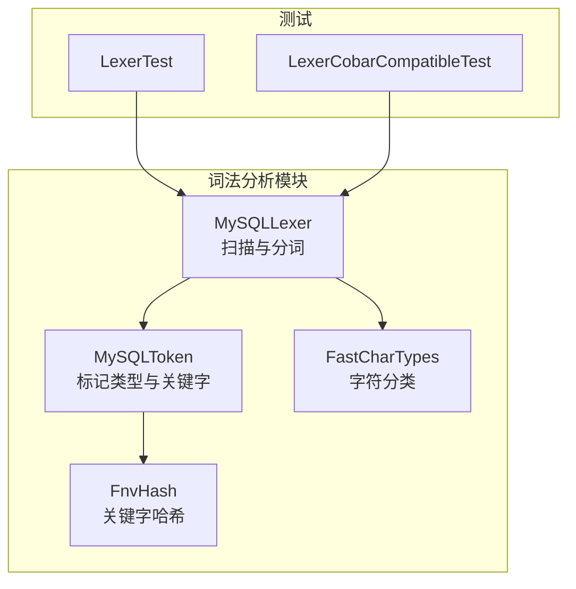
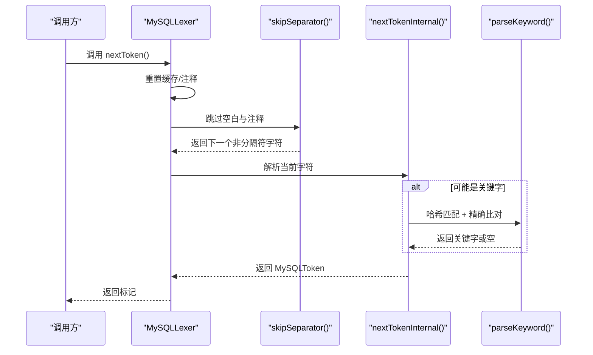
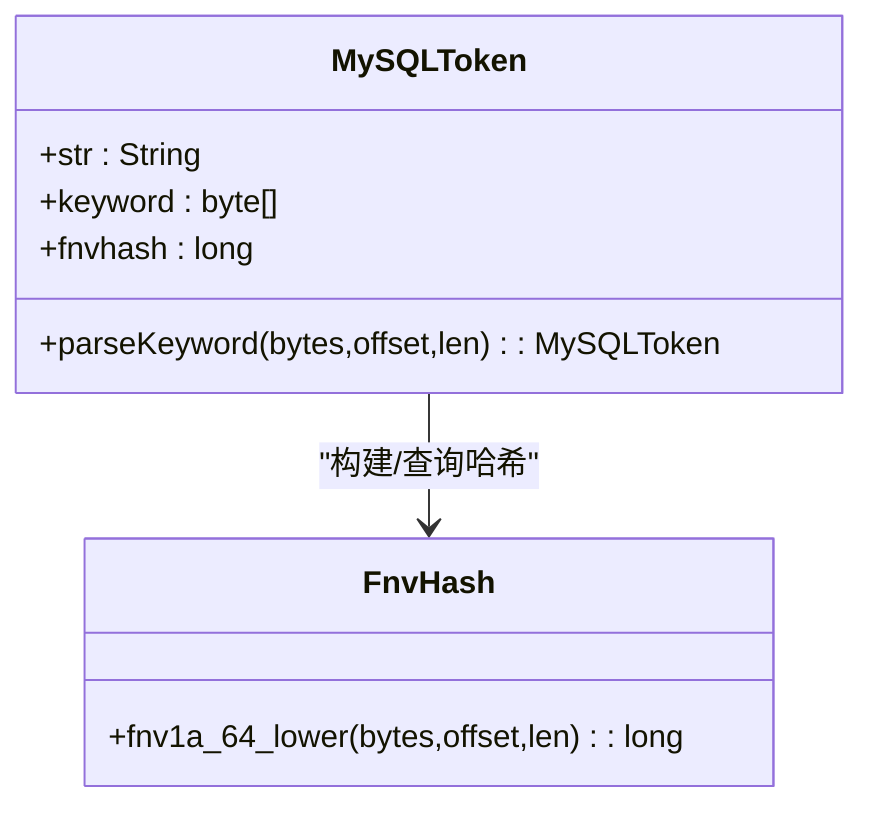
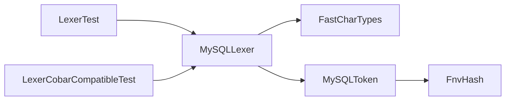

# 词法分析

<cite>
**本文引用的文件列表**
- [MySQLLexer.java](file://proxy-parser/src/main/java/com/alibaba/polardbx/proxy/parser/recognizer/mysql/lexer/MySQLLexer.java)
- [MySQLToken.java](file://proxy-parser/src/main/java/com/alibaba/polardbx/proxy/parser/recognizer/mysql/MySQLToken.java)
- [FastCharTypes.java](file://proxy-parser/src/main/java/com/alibaba/polardbx/proxy/parser/util/FastCharTypes.java)
- [FnvHash.java](file://proxy-parser/src/main/java/com/alibaba/polardbx/proxy/parser/util/FnvHash.java)
- [LexerTest.java](file://proxy-parser/src/test/java/com/alibaba/polardbx/proxy/parser/LexerTest.java)
- [LexerCobarCompatibleTest.java](file://proxy-parser/src/test/java/com/alibaba/polardbx/proxy/parser/LexerCobarCompatibleTest.java)
</cite>

## 目录
1. [简介](#简介)
2. [项目结构与定位](#项目结构与定位)
3. [核心组件](#核心组件)
4. [架构总览](#架构总览)
5. [详细组件分析](#详细组件分析)
6. [依赖关系分析](#依赖关系分析)
7. [性能考量](#性能考量)
8. [故障排查指南](#故障排查指南)
9. [结论](#结论)
10. [附录：示例与规则表](#附录示例与规则表)

## 简介
本文件系统性地解析 PolarDB-X Proxy 的 MySQL 词法分析器，重点围绕 MySQLLexer 如何将原始 SQL 字节串转换为标记流（token stream），并深入说明字符扫描、标记识别、关键字匹配、特殊符号处理、状态机设计、错误处理机制与性能优化策略。同时，结合 MySQLToken 枚举，梳理各类 SQL 标记类型的识别规则，覆盖标识符、字面量、操作符、关键字、注释与转义等场景。

## 项目结构与定位
- 词法分析器位于 parser 模块的 MySQL 识别器子包内，核心类为 MySQLLexer 与 MySQLToken。
- FastCharTypes 提供快速字符分类（数字、十六进制、标识符、空白）以加速扫描。
- FnvHash 用于关键字哈希匹配，提升关键字查找效率。
- 测试用例覆盖注释、字符串、十六进制/二进制字面量、用户变量、系统变量、占位符、数字与 JSON 操作符等典型场景。



图表来源
- [MySQLLexer.java](file://proxy-parser/src/main/java/com/alibaba/polardbx/proxy/parser/recognizer/mysql/lexer/MySQLLexer.java#L35-L137)
- [MySQLToken.java](file://proxy-parser/src/main/java/com/alibaba/polardbx/proxy/parser/recognizer/mysql/MySQLToken.java#L28-L1019)
- [FastCharTypes.java](file://proxy-parser/src/main/java/com/alibaba/polardbx/proxy/parser/util/FastCharTypes.java#L21-L98)
- [FnvHash.java](file://proxy-parser/src/main/java/com/alibaba/polardbx/proxy/parser/util/FnvHash.java#L21-L38)
- [LexerTest.java](file://proxy-parser/src/test/java/com/alibaba/polardbx/proxy/parser/LexerTest.java#L30-L53)
- [LexerCobarCompatibleTest.java](file://proxy-parser/src/test/java/com/alibaba/polardbx/proxy/parser/LexerCobarCompatibleTest.java#L29-L46)

章节来源
- [MySQLLexer.java](file://proxy-parser/src/main/java/com/alibaba/polardbx/proxy/parser/recognizer/mysql/lexer/MySQLLexer.java#L35-L137)
- [MySQLToken.java](file://proxy-parser/src/main/java/com/alibaba/polardbx/proxy/parser/recognizer/mysql/MySQLToken.java#L28-L1019)
- [FastCharTypes.java](file://proxy-parser/src/main/java/com/alibaba/polardbx/proxy/parser/util/FastCharTypes.java#L21-L98)
- [FnvHash.java](file://proxy-parser/src/main/java/com/alibaba/polardbx/proxy/parser/util/FnvHash.java#L21-L38)
- [LexerTest.java](file://proxy-parser/src/test/java/com/alibaba/polardbx/proxy/parser/LexerTest.java#L30-L53)
- [LexerCobarCompatibleTest.java](file://proxy-parser/src/test/java/com/alibaba/polardbx/proxy/parser/LexerCobarCompatibleTest.java#L29-L46)

## 核心组件
- MySQLLexer：主扫描器，负责逐字符扫描、跳过空白与注释、识别字面量、标识符、操作符与关键字，维护位置指针与缓存，输出 MySQLToken。
- MySQLToken：标记类型枚举，包含普通标记（如标识符、字面量、括号、逗号、点号）、操作符（单双字符组合）、关键字（大量 MySQL 8.0 关键字）以及布尔/空值字面量。
- FastCharTypes：静态字符分类表，提供 isDigit/isHex/isIdentifier/isSpace 快速判断，避免分支判断开销。
- FnvHash：64 位 FNV-1a 哈希，用于关键字映射与精确匹配校验。

章节来源
- [MySQLLexer.java](file://proxy-parser/src/main/java/com/alibaba/polardbx/proxy/parser/recognizer/mysql/lexer/MySQLLexer.java#L35-L137)
- [MySQLToken.java](file://proxy-parser/src/main/java/com/alibaba/polardbx/proxy/parser/recognizer/mysql/MySQLToken.java#L28-L1019)
- [FastCharTypes.java](file://proxy-parser/src/main/java/com/alibaba/polardbx/proxy/parser/util/FastCharTypes.java#L21-L98)
- [FnvHash.java](file://proxy-parser/src/main/java/com/alibaba/polardbx/proxy/parser/util/FnvHash.java#L21-L38)

## 架构总览
MySQLLexer 的工作流程可概括为：
- 初始化与重置：设置输入字节数组、字符集、版本、位置指针与缓冲区。
- 跳过分隔符：处理空格、行注释（--、#）、块注释（/* ... */、/*! 版本控制 */）。
- 主扫描循环：根据当前字符进入不同分支，识别数字、字符串、十六进制/二进制字面量、标识符（含反引号标识符、用户变量、系统变量、占位符）、操作符与标点。
- 关键字匹配：对可能的关键字进行 FNV 哈希后查表，再做长度与逐字符大小写不敏感比对。
- 输出与缓存：记录偏移与长度，缓存字符串值，返回对应 MySQLToken。



图表来源
- [MySQLLexer.java](file://proxy-parser/src/main/java/com/alibaba/polardbx/proxy/parser/recognizer/mysql/lexer/MySQLLexer.java#L1064-L1093)
- [MySQLLexer.java](file://proxy-parser/src/main/java/com/alibaba/polardbx/proxy/parser/recognizer/mysql/lexer/MySQLLexer.java#L839-L1062)
- [MySQLToken.java](file://proxy-parser/src/main/java/com/alibaba/polardbx/proxy/parser/recognizer/mysql/MySQLToken.java#L999-L1018)

## 详细组件分析

### MySQLLexer 扫描与状态机
- 字符推进与边界检查：通过 next() 移动 pos 并更新 ch，遇到 EOF 或 unclosed 注释时抛出异常。
- 分隔符跳过：支持空格、制表符、换行、回车、垂直制表、文件分隔符等空白；支持行注释（--、#）与块注释（/* ... */、/*! 版本控制 */）。块注释支持版本条件忽略。
- 数字识别：支持整数、小数、科学计数法、E 后可带正负号；若出现字母则回退为标识符或关键字。
- 字符串识别：支持单引号与双引号字符串，支持反斜杠转义与 MySQL 特殊转义（noBackslashEscapes 模式下行为不同）。
- 十六进制与二进制字面量：0x/0b 前缀与 x'/b' 引号形式；若后续字符不符合规范则回退为标识符。
- 标识符识别：支持反引号标识符、用户变量（@var）、系统变量（@@var）、占位符（${...}）。
- 操作符与标点：单字符与双字符组合（如 <=、>=、<>、!=、&&、||、<<、>>、->、->>、:= 等）。
- 特殊处理：JSON 提取操作符（->、->>）、问号参数计数（?）。

```mermaid
flowchart TD
Start(["开始 nextToken"]) --> Reset["重置缓存/注释"]
Reset --> Skip["skipSeparator()"]
Skip --> NextCh["读取当前字符 ch"]
NextCh --> Branch{"按字符类型分支"}
Branch --> |数字| Num["scanNumber()"]
Branch --> |点号| Dot["是否跟随数字? 是: 数字; 否: PUNC_DOT"]
Branch --> |字符串| Str["scanString()"]
Branch --> |N/n| NStr["N'...' 字符串"]
Branch --> |X/x| Hex["0x 或 x'...'"]
Branch --> |B/b| Bit["0b 或 b'...'"]
Branch --> |@| Var["@var 或 @@var"]
Branch --> |?| Q["QUESTION_MARK 参数计数"]
Branch --> |括号/标点| Punc["返回对应 PUNC_*"]
Branch --> |运算符| Op["返回 OP_*"]
Branch --> |反引号| IdAcc["scanIdentifierWithAccent()"]
Branch --> |其他标识符| Id["scanIdentifier()"]
Num --> Emit["返回数字标记"]
Str --> Emit
NStr --> Emit
Hex --> Emit
Bit --> Emit
Var --> Emit
Q --> Emit
Punc --> Emit
Op --> Emit
IdAcc --> Emit
Id --> Emit
Emit --> End(["结束"])
```

图表来源
- [MySQLLexer.java](file://proxy-parser/src/main/java/com/alibaba/polardbx/proxy/parser/recognizer/mysql/lexer/MySQLLexer.java#L839-L1062)
- [MySQLLexer.java](file://proxy-parser/src/main/java/com/alibaba/polardbx/proxy/parser/recognizer/mysql/lexer/MySQLLexer.java#L1064-L1093)

章节来源
- [MySQLLexer.java](file://proxy-parser/src/main/java/com/alibaba/polardbx/proxy/parser/recognizer/mysql/lexer/MySQLLexer.java#L220-L365)
- [MySQLLexer.java](file://proxy-parser/src/main/java/com/alibaba/polardbx/proxy/parser/recognizer/mysql/lexer/MySQLLexer.java#L367-L424)
- [MySQLLexer.java](file://proxy-parser/src/main/java/com/alibaba/polardbx/proxy/parser/recognizer/mysql/lexer/MySQLLexer.java#L442-L508)
- [MySQLLexer.java](file://proxy-parser/src/main/java/com/alibaba/polardbx/proxy/parser/recognizer/mysql/lexer/MySQLLexer.java#L514-L676)
- [MySQLLexer.java](file://proxy-parser/src/main/java/com/alibaba/polardbx/proxy/parser/recognizer/mysql/lexer/MySQLLexer.java#L839-L1062)
- [MySQLLexer.java](file://proxy-parser/src/main/java/com/alibaba/polardbx/proxy/parser/recognizer/mysql/lexer/MySQLLexer.java#L1064-L1093)

### MySQLToken 标记类型与关键字匹配
- 标记类型：EOF、标识符（含反引号）、十六进制/二进制字面量、纯数字/混合数字、字符串/Unicode 字符串、占位符、系统变量、用户变量、布尔/空值字面量、标点与操作符（含 JSON 提取）。
- 关键字：包含 MySQL 8.0 全量关键字，以及 NULL、TRUE、FALSE。使用 FNV-1a 哈希构建关键字表，匹配时先比较哈希，再进行长度与逐字符比对（大写字母统一转小写）。



图表来源
- [MySQLToken.java](file://proxy-parser/src/main/java/com/alibaba/polardbx/proxy/parser/recognizer/mysql/MySQLToken.java#L958-L1018)
- [FnvHash.java](file://proxy-parser/src/main/java/com/alibaba/polardbx/proxy/parser/util/FnvHash.java#L25-L37)

章节来源
- [MySQLToken.java](file://proxy-parser/src/main/java/com/alibaba/polardbx/proxy/parser/recognizer/mysql/MySQLToken.java#L28-L1019)
- [MySQLToken.java](file://proxy-parser/src/main/java/com/alibaba/polardbx/proxy/parser/recognizer/mysql/MySQLToken.java#L958-L1018)
- [FnvHash.java](file://proxy-parser/src/main/java/com/alibaba/polardbx/proxy/parser/util/FnvHash.java#L21-L38)

### FastCharTypes 字符分类
- 预计算 ASCII 表，区分数字、十六进制、标识符字符（含 _、$）与空白字符，提供 O(1) 判断。
- 在扫描阶段广泛用于判定是否继续扩展标识符、数字、十六进制等。

章节来源
- [FastCharTypes.java](file://proxy-parser/src/main/java/com/alibaba/polardbx/proxy/parser/util/FastCharTypes.java#L21-L98)

### 错误处理与边界情况
- 注释未闭合：块注释与行注释在 EOF 前未闭合时抛出异常。
- 字符串未闭合：单引号/双引号字符串未闭合时抛出异常。
- 反斜杠转义不完整：反斜杠后无有效转义字符时抛出异常。
- 不支持字符：遇到不受支持的字符时抛出异常。
- 版本控制注释：/*!50714 ... */ 中版本号大于当前版本时忽略该段注释。

章节来源
- [MySQLLexer.java](file://proxy-parser/src/main/java/com/alibaba/polardbx/proxy/parser/recognizer/mysql/lexer/MySQLLexer.java#L220-L365)
- [MySQLLexer.java](file://proxy-parser/src/main/java/com/alibaba/polardbx/proxy/parser/recognizer/mysql/lexer/MySQLLexer.java#L442-L508)
- [MySQLLexer.java](file://proxy-parser/src/main/java/com/alibaba/polardbx/proxy/parser/recognizer/mysql/lexer/MySQLLexer.java#L839-L1062)

### 性能优化策略
- 字符分类常量表：避免每次判断都走复杂逻辑，直接查表。
- 关键字哈希映射：先 O(1) 哈希命中，再进行长度与逐字符比对，减少全量关键字遍历。
- 位置与长度缓存：offsetCache/sizeCache 记录字面量起止，避免重复拷贝。
- 线程局部缓冲：sbufRef 使用 ThreadLocal 缓冲，减少分配与同步开销。
- 数字解析：纯数字快速路径（int/long/BigInteger）按位移与乘法累加，避免字符串解析。
- 注释收集可选：仅在开启 recordComments 时收集，减少内存占用。

章节来源
- [FastCharTypes.java](file://proxy-parser/src/main/java/com/alibaba/polardbx/proxy/parser/util/FastCharTypes.java#L21-L98)
- [MySQLToken.java](file://proxy-parser/src/main/java/com/alibaba/polardbx/proxy/parser/recognizer/mysql/MySQLToken.java#L985-L1018)
- [MySQLLexer.java](file://proxy-parser/src/main/java/com/alibaba/polardbx/proxy/parser/recognizer/mysql/lexer/MySQLLexer.java#L73-L108)
- [MySQLLexer.java](file://proxy-parser/src/main/java/com/alibaba/polardbx/proxy/parser/recognizer/mysql/lexer/MySQLLexer.java#L190-L218)

## 依赖关系分析
- MySQLLexer 依赖 FastCharTypes 进行字符分类，依赖 MySQLToken 进行关键字匹配与标记类型返回。
- MySQLToken 依赖 FnvHash 进行关键字哈希，静态初始化时构建关键字映射表。
- 测试用例覆盖注释、字符串、十六进制/二进制字面量、用户变量、系统变量、占位符、数字与 JSON 操作符等场景。



图表来源
- [MySQLLexer.java](file://proxy-parser/src/main/java/com/alibaba/polardbx/proxy/parser/recognizer/mysql/lexer/MySQLLexer.java#L21-L34)
- [MySQLToken.java](file://proxy-parser/src/main/java/com/alibaba/polardbx/proxy/parser/recognizer/mysql/MySQLToken.java#L21-L27)
- [FastCharTypes.java](file://proxy-parser/src/main/java/com/alibaba/polardbx/proxy/parser/util/FastCharTypes.java#L21-L27)
- [FnvHash.java](file://proxy-parser/src/main/java/com/alibaba/polardbx/proxy/parser/util/FnvHash.java#L21-L24)
- [LexerTest.java](file://proxy-parser/src/test/java/com/alibaba/polardbx/proxy/parser/LexerTest.java#L30-L33)
- [LexerCobarCompatibleTest.java](file://proxy-parser/src/test/java/com/alibaba/polardbx/proxy/parser/LexerCobarCompatibleTest.java#L30-L32)

章节来源
- [MySQLLexer.java](file://proxy-parser/src/main/java/com/alibaba/polardbx/proxy/parser/recognizer/mysql/lexer/MySQLLexer.java#L21-L34)
- [MySQLToken.java](file://proxy-parser/src/main/java/com/alibaba/polardbx/proxy/parser/recognizer/mysql/MySQLToken.java#L21-L27)
- [FastCharTypes.java](file://proxy-parser/src/main/java/com/alibaba/polardbx/proxy/parser/util/FastCharTypes.java#L21-L27)
- [FnvHash.java](file://proxy-parser/src/main/java/com/alibaba/polardbx/proxy/parser/util/FnvHash.java#L21-L24)
- [LexerTest.java](file://proxy-parser/src/test/java/com/alibaba/polardbx/proxy/parser/LexerTest.java#L30-L33)
- [LexerCobarCompatibleTest.java](file://proxy-parser/src/test/java/com/alibaba/polardbx/proxy/parser/LexerCobarCompatibleTest.java#L30-L32)

## 性能考量
- 字符分类与哈希：O(1) 判定与映射，避免线性扫描关键字表。
- 数字解析：按位移与乘法累加，避免字符串解析与装箱。
- 缓冲复用：ThreadLocal 缓冲减少 GC 压力。
- 注释收集按需：默认关闭，仅在需要时启用。
- 大小写不敏感匹配：统一转小写后再比对，确保一致性。

[本节为通用性能讨论，无需特定文件引用]

## 故障排查指南
- 注释未闭合：检查 /* ... */ 或 /*! ... */ 是否正确闭合，确认 EOF 前无遗漏。
- 字符串未闭合：检查 '...' 或 "..." 是否成对出现，注意转义字符。
- 反斜杠转义问题：在 noBackslashEscapes 模式下，反斜杠不会被当作转义符。
- 不支持字符：检查输入是否包含不受支持的控制字符或编码。
- 版本控制注释：当版本号高于当前版本时，注释内容会被忽略。

章节来源
- [MySQLLexer.java](file://proxy-parser/src/main/java/com/alibaba/polardbx/proxy/parser/recognizer/mysql/lexer/MySQLLexer.java#L220-L365)
- [MySQLLexer.java](file://proxy-parser/src/main/java/com/alibaba/polardbx/proxy/parser/recognizer/mysql/lexer/MySQLLexer.java#L442-L508)
- [MySQLLexer.java](file://proxy-parser/src/main/java/com/alibaba/polardbx/proxy/parser/recognizer/mysql/lexer/MySQLLexer.java#L839-L1062)

## 结论
MySQLLexer 通过字符分类表与关键字哈希映射实现了高效的词法扫描，结合多种字面量识别规则与注释处理，能够稳定地将 SQL 字符串转换为标记流。其状态机清晰、错误处理明确、性能优化到位，适合在高并发场景下作为解析器前端使用。

[本节为总结性内容，无需特定文件引用]

## 附录：示例与规则表

### 示例：从 SQL 到标记序列的转换
以下示例展示了典型 SQL 片段的词法分析结果（基于测试用例）：
- 输入：`-- comment\n# hehe\n/* hahaha select 123, drds */\n/*+TDDL: scan()*/\n\t\t\tselect\n[col,  count(*),   /*+ HINT_NAME([argument_list]) */       /*!50714 col1 */  count(*),  col2  -- comment\n, col3    from tt /* comment */    where /*! id= */3 # comment`
- 输出标记序列（名称与原始字符串）：见测试断言。

章节来源
- [LexerTest.java](file://proxy-parser/src/test/java/com/alibaba/polardbx/proxy/parser/LexerTest.java#L55-L95)

### 规则摘要：MySQLToken 类型与识别要点
- 标识符：支持反引号包裹、$ 开头的标识符、用户变量（@var）、系统变量（@@var）、占位符（${...}）。
- 字面量：纯数字、混合数字（含小数/科学计数法）、字符串（'...'、"..."，支持转义）、十六进制（0x...、x'...'）、二进制（0b...、b'...'）、Unicode 字符串（N'...'）。
- 操作符：单字符（+、-、*、/、%、&、|、^、!、~、<、>、=、:、.）与双字符组合（<=、>=、<>、!=、&&、||、<<、>>、->、->>、:=）。
- 关键字：MySQL 8.0 完整关键字集合，以及 NULL、TRUE、FALSE。
- 注释：行注释（--、#）、块注释（/* ... */、/*! 版本号 ... */），后者支持版本条件忽略。

章节来源
- [MySQLToken.java](file://proxy-parser/src/main/java/com/alibaba/polardbx/proxy/parser/recognizer/mysql/MySQLToken.java#L28-L1019)
- [MySQLLexer.java](file://proxy-parser/src/main/java/com/alibaba/polardbx/proxy/parser/recognizer/mysql/lexer/MySQLLexer.java#L839-L1062)

### 特殊字符与转义处理
- 反引号标识符：支持反引号包裹的标识符，内部双写反引号表示转义。
- 用户变量：@var 支持点号连接与反引号包裹；字符串形式支持单引号与双引号，内部转义规则遵循 MySQL。
- 系统变量：@@var 支持反引号包裹与普通标识符。
- 占位符：${...} 形式的占位符，不包含 ${} 本身。
- 转义：在 noBackslashEscapes=false 时，反斜杠转义生效；否则仅保留原字符。

章节来源
- [MySQLLexer.java](file://proxy-parser/src/main/java/com/alibaba/polardbx/proxy/parser/recognizer/mysql/lexer/MySQLLexer.java#L696-L817)
- [MySQLLexer.java](file://proxy-parser/src/main/java/com/alibaba/polardbx/proxy/parser/recognizer/mysql/lexer/MySQLLexer.java#L442-L508)
- [MySQLLexer.java](file://proxy-parser/src/main/java/com/alibaba/polardbx/proxy/parser/recognizer/mysql/lexer/MySQLLexer.java#L709-L817)