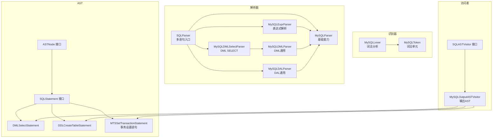
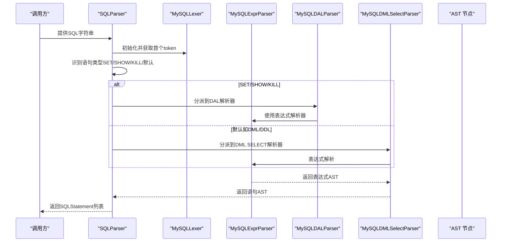
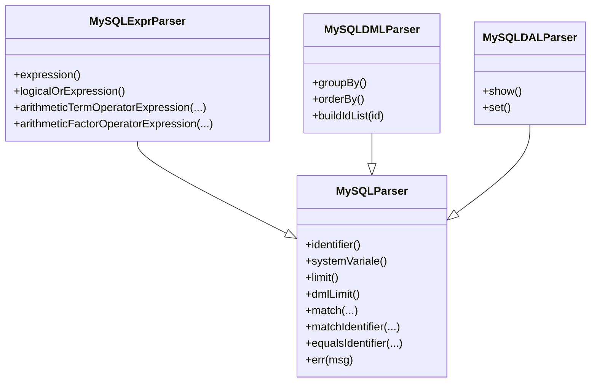
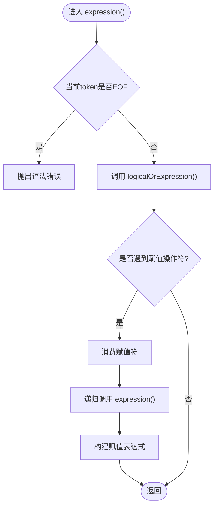
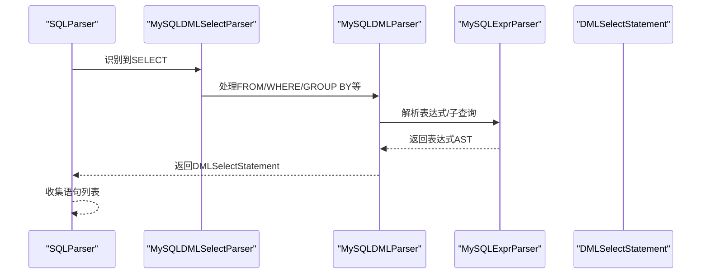
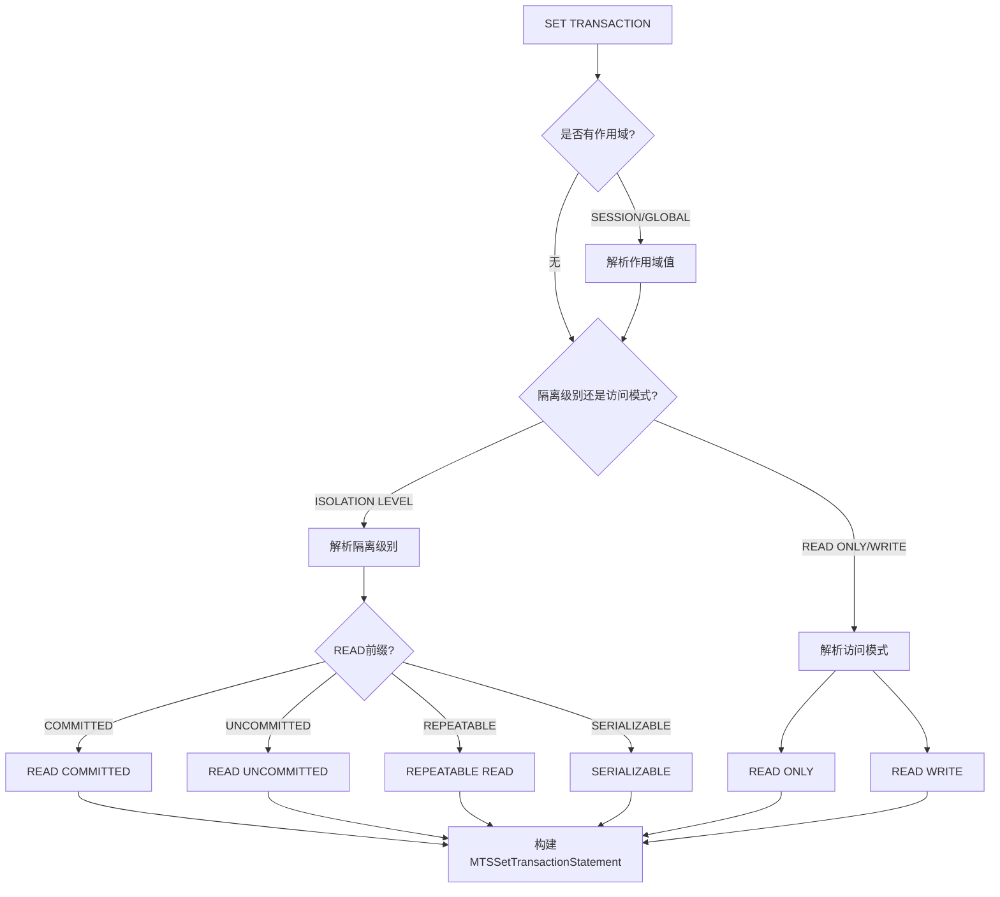
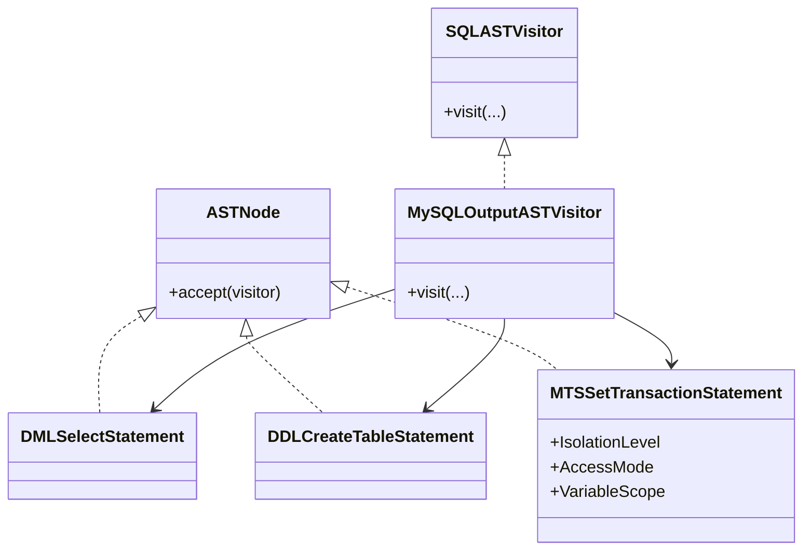
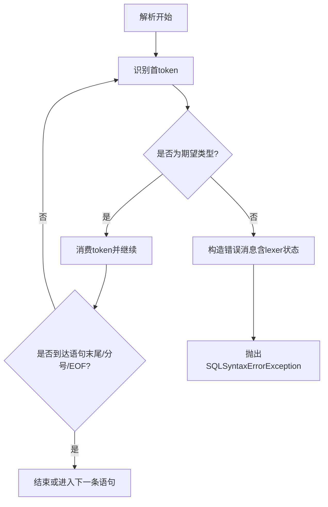
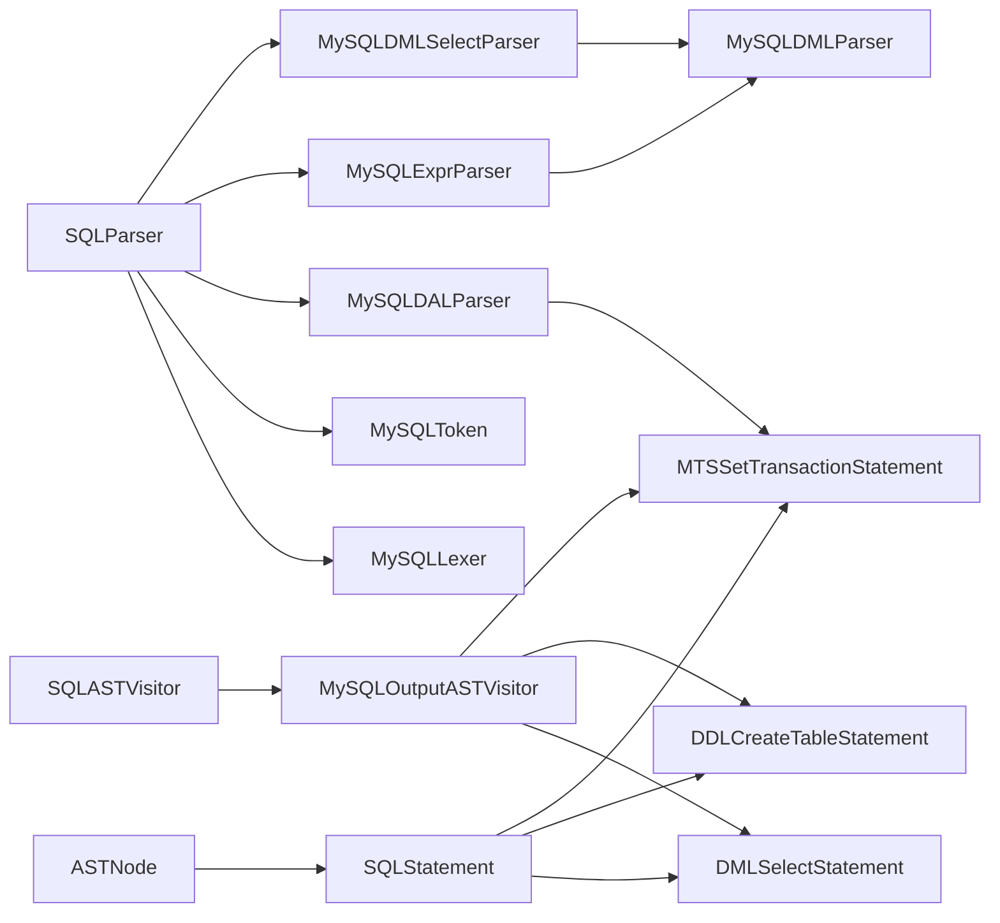

# 语法分析

<cite>
**本文引用的文件**   
- [proxy-parser/src/main/java/com/alibaba/polardbx/proxy/parser/recognizer/SQLParser.java](file://proxy-parser/src/main/java/com/alibaba/polardbx/proxy/parser/recognizer/SQLParser.java)
- [proxy-parser/src/main/java/com/alibaba/polardbx/proxy/parser/recognizer/mysql/syntax/MySQLParser.java](file://proxy-parser/src/main/java/com/alibaba/polardbx/proxy/parser/recognizer/mysql/syntax/MySQLParser.java)
- [proxy-parser/src/main/java/com/alibaba/polardbx/proxy/parser/recognizer/mysql/syntax/MySQLExprParser.java](file://proxy-parser/src/main/java/com/alibaba/polardbx/proxy/parser/recognizer/mysql/syntax/MySQLExprParser.java)
- [proxy-parser/src/main/java/com/alibaba/polardbx/proxy/parser/recognizer/mysql/syntax/MySQLDMLParser.java](file://proxy-parser/src/main/java/com/alibaba/polardbx/proxy/parser/recognizer/mysql/syntax/MySQLDMLParser.java)
- [proxy-parser/src/main/java/com/alibaba/polardbx/proxy/parser/recognizer/mysql/syntax/MySQLDALParser.java](file://proxy-parser/src/main/java/com/alibaba/polardbx/proxy/parser/recognizer/mysql/syntax/MySQLDALParser.java)
- [proxy-parser/src/main/java/com/alibaba/polardbx/proxy/parser/recognizer/mysql/syntax/MySQLDMLSelectParser.java](file://proxy-parser/src/main/java/com/alibaba/polardbx/proxy/parser/recognizer/mysql/syntax/MySQLDMLSelectParser.java)
- [proxy-parser/src/main/java/com/alibaba/polardbx/proxy/parser/ast/stmt/dml/DMLSelectStatement.java](file://proxy-parser/src/main/java/com/alibaba/polardbx/proxy/parser/ast/stmt/dml/DMLSelectStatement.java)
- [proxy-parser/src/main/java/com/alibaba/polardbx/proxy/parser/ast/stmt/ddl/DDLCreateTableStatement.java](file://proxy-parser/src/main/java/com/alibaba/polardbx/proxy/parser/ast/stmt/ddl/DDLCreateTableStatement.java)
- [proxy-parser/src/main/java/com/alibaba/polardbx/proxy/parser/visitor/SQLASTVisitor.java](file://proxy-parser/src/main/java/com/alibaba/polardbx/proxy/parser/visitor/SQLASTVisitor.java)
- [proxy-parser/src/main/java/com/alibaba/polardbx/proxy/parser/visitor/MySQLOutputASTVisitor.java](file://proxy-parser/src/main/java/com/alibaba/polardbx/proxy/parser/visitor/MySQLOutputASTVisitor.java)
- [proxy-parser/src/main/java/com/alibaba/polardbx/proxy/parser/ast/ASTNode.java](file://proxy-parser/src/main/java/com/alibaba/polardbx/proxy/parser/ast/ASTNode.java)
- [proxy-parser/src/main/java/com/alibaba/polardbx/proxy/parser/recognizer/mysql/MySQLToken.java](file://proxy-parser/src/main/java/com/alibaba/polardbx/proxy/parser/recognizer/mysql/MySQLToken.java)
- [proxy-parser/src/main/java/com/alibaba/polardbx/proxy/parser/recognizer/mysql/lexer/MySQLLexer.java](file://proxy-parser/src/main/java/com/alibaba/polardbx/proxy/parser/recognizer/mysql/lexer/MySQLLexer.java)
- [proxy-parser/src/main/java/com/alibaba/polardbx/proxy/parser/recognizer/mysql/syntax/KillParser.java](file://proxy-parser/src/main/java/com/alibaba/polardbx/proxy/parser/recognizer/mysql/syntax/KillParser.java)
- [proxy-parser/src/main/java/com/alibaba/polardbx/proxy/parser/ast/stmt/mts/MTSSetTransactionStatement.java](file://proxy-parser/src/main/java/com/alibaba/polardbx/proxy/parser/ast/stmt/mts/MTSSetTransactionStatement.java)
</cite>

## 目录
1. [引言](#引言)
2. [项目结构](#项目结构)
3. [核心组件](#核心组件)
4. [架构总览](#架构总览)
5. [详细组件分析](#详细组件分析)
6. [依赖关系分析](#依赖关系分析)
7. [性能考量](#性能考量)
8. [故障排查指南](#故障排查指南)
9. [结论](#结论)
10. [附录](#附录)

## 引言
本文件系统化梳理PolarDB-X Proxy语法分析器（MySQLParser及其派生解析器）的设计与实现，重点覆盖：
- 基类MySQLParser的设计模式与继承体系
- DML/DDL/DAL等不同SQL类型的解析策略
- 递归下降解析算法、LL(1)文法处理与错误恢复机制
- 语法分析树构建、规则匹配、优先级与结合性
- 错误检测、位置定位与错误信息生成

目标是帮助读者快速理解从词法到语法再到AST的完整流程，并为二次开发与维护提供清晰的参考。

## 项目结构
围绕"识别器（Recognizer）+ 解析器（Parser）+ 抽象语法树（AST）+ 访问者（Visitor）"的分层组织：
- 识别器：负责将输入SQL切分为MySQLToken序列
- 解析器：基于递归下降的语法分析器，按SQL类型分派到对应子解析器
- AST：表达式、片段、语句节点，统一实现访问接口
- 访问者：遍历AST进行输出或后续处理

**图表来源**
- [proxy-parser/src/main/java/com/alibaba/polardbx/proxy/parser/recognizer/SQLParser.java](file://proxy-parser/src/main/java/com/alibaba/polardbx/proxy/parser/recognizer/SQLParser.java#L36-L334)
- [proxy-parser/src/main/java/com/alibaba/polardbx/proxy/parser/recognizer/mysql/syntax/MySQLParser.java](file://proxy-parser/src/main/java/com/alibaba/polardbx/proxy/parser/recognizer/mysql/syntax/MySQLParser.java#L42-L359)
- [proxy-parser/src/main/java/com/alibaba/polardbx/proxy/parser/recognizer/mysql/syntax/MySQLExprParser.java](file://proxy-parser/src/main/java/com/alibaba/polardbx/proxy/parser/recognizer/mysql/syntax/MySQLExprParser.java#L163-L195)
- [proxy-parser/src/main/java/com/alibaba/polardbx/proxy/parser/recognizer/mysql/syntax/MySQLDMLParser.java](file://proxy-parser/src/main/java/com/alibaba/polardbx/proxy/parser/recognizer/mysql/syntax/MySQLDMLParser.java#L71-L78)
- [proxy-parser/src/main/java/com/alibaba/polardbx/proxy/parser/recognizer/mysql/syntax/MySQLDALParser.java](file://proxy-parser/src/main/java/com/alibaba/polardbx/proxy/parser/recognizer/mysql/syntax/MySQLDALParser.java#L75-L81)
- [proxy-parser/src/main/java/com/alibaba/polardbx/proxy/parser/recognizer/mysql/syntax/MySQLDMLSelectParser.java](file://proxy-parser/src/main/java/com/alibaba/polardbx/proxy/parser/recognizer/mysql/syntax/MySQLDMLSelectParser.java)
- [proxy-parser/src/main/java/com/alibaba/polardbx/proxy/parser/ast/ASTNode.java](file://proxy-parser/src/main/java/com/alibaba/polardbx/proxy/parser/ast/ASTNode.java#L28-L31)
- [proxy-parser/src/main/java/com/alibaba/polardbx/proxy/parser/visitor/SQLASTVisitor.java](file://proxy-parser/src/main/java/com/alibaba/polardbx/proxy/parser/visitor/SQLASTVisitor.java#L311-L508)
- [proxy-parser/src/main/java/com/alibaba/polardbx/proxy/parser/visitor/MySQLOutputASTVisitor.java](file://proxy-parser/src/main/java/com/alibaba/polardbx/proxy/parser/visitor/MySQLOutputASTVisitor.java#L536-L945)
- [proxy-parser/src/main/java/com/alibaba/polardbx/proxy/parser/ast/stmt/mts/MTSSetTransactionStatement.java](file://proxy-parser/src/main/java/com/alibaba/polardbx/proxy/parser/ast/stmt/mts/MTSSetTransactionStatement.java#L30-L80)

**章节来源**
- [proxy-parser/src/main/java/com/alibaba/polardbx/proxy/parser/recognizer/SQLParser.java](file://proxy-parser/src/main/java/com/alibaba/polardbx/proxy/parser/recognizer/SQLParser.java#L36-L334)
- [proxy-parser/src/main/java/com/alibaba/polardbx/proxy/parser/recognizer/mysql/syntax/MySQLParser.java](file://proxy-parser/src/main/java/com/alibaba/polardbx/proxy/parser/recognizer/mysql/syntax/MySQLParser.java#L42-L359)

## 核心组件
- MySQLParser：所有具体解析器的抽象基类，提供通用的词法匹配、标识符解析、LIMIT子句解析、系统变量解析、错误构造等能力。
- MySQLExprParser：表达式解析器，实现递归下降的运算符优先级解析，支持算术、比较、逻辑、字符串、类型转换、函数等多种表达式。
- MySQLDMLParser：DML通用解析器，提供GROUP BY/ORDER BY等通用片段解析。
- MySQLDALParser：DAL（数据访问层）解析器，处理SHOW/SET等非数据操作语句，**新增**支持完整的SET TRANSACTION语句解析，包括事务隔离级别和访问模式设置。
- MySQLDMLSelectParser：DML SELECT专用解析器，负责SELECT语句的完整解析。
- SQLParser：顶层入口，负责多语句扫描、分发到具体解析器（含KILL/SET/SHOW等）。
- AST与访问者：统一的AST节点接口与访问者接口，配合输出访问者生成可读字符串。

**章节来源**
- [proxy-parser/src/main/java/com/alibaba/polardbx/proxy/parser/recognizer/mysql/syntax/MySQLParser.java](file://proxy-parser/src/main/java/com/alibaba/polardbx/proxy/parser/recognizer/mysql/syntax/MySQLParser.java#L42-L359)
- [proxy-parser/src/main/java/com/alibaba/polardbx/proxy/parser/recognizer/mysql/syntax/MySQLExprParser.java](file://proxy-parser/src/main/java/com/alibaba/polardbx/proxy/parser/recognizer/mysql/syntax/MySQLExprParser.java#L163-L195)
- [proxy-parser/src/main/java/com/alibaba/polardbx/proxy/parser/recognizer/mysql/syntax/MySQLDMLParser.java](file://proxy-parser/src/main/java/com/alibaba/polardbx/proxy/parser/recognizer/mysql/syntax/MySQLDMLParser.java#L71-L78)
- [proxy-parser/src/main/java/com/alibaba/polardbx/proxy/parser/recognizer/mysql/syntax/MySQLDALParser.java](file://proxy-parser/src/main/java/com/alibaba/polardbx/proxy/parser/recognizer/mysql/syntax/MySQLDALParser.java#L75-L81)
- [proxy-parser/src/main/java/com/alibaba/polardbx/proxy/parser/recognizer/SQLParser.java](file://proxy-parser/src/main/java/com/alibaba/polardbx/proxy/parser/recognizer/SQLParser.java#L277-L334)

## 架构总览
下图展示从SQL输入到AST构建与访问的端到端流程：

**图表来源**
- [proxy-parser/src/main/java/com/alibaba/polardbx/proxy/parser/recognizer/SQLParser.java](file://proxy-parser/src/main/java/com/alibaba/polardbx/proxy/parser/recognizer/SQLParser.java#L277-L334)
- [proxy-parser/src/main/java/com/alibaba/polardbx/proxy/parser/recognizer/mysql/syntax/MySQLExprParser.java](file://proxy-parser/src/main/java/com/alibaba/polardbx/proxy/parser/recognizer/mysql/syntax/MySQLExprParser.java#L180-L195)
- [proxy-parser/src/main/java/com/alibaba/polardbx/proxy/parser/recognizer/mysql/syntax/MySQLDALParser.java](file://proxy-parser/src/main/java/com/alibaba/polardbx/proxy/parser/recognizer/mysql/syntax/MySQLDALParser.java#L173-L200)
- [proxy-parser/src/main/java/com/alibaba/polardbx/proxy/parser/recognizer/mysql/syntax/MySQLDMLSelectParser.java](file://proxy-parser/src/main/java/com/alibaba/polardbx/proxy/parser/recognizer/mysql/syntax/MySQLDMLSelectParser.java)

## 详细组件分析

### MySQLParser 基类与继承体系
- 设计模式
  - 继承体系：MySQLParser为抽象基类，MySQLExprParser、MySQLDMLParser、MySQLDALParser均继承自它，共享词法匹配、标识符解析、LIMIT解析、系统变量解析与错误构造等通用能力。
  - 模板方法：顶层入口SQLParser根据首token分派到具体解析器；表达式解析由MySQLExprParser统一实现。
- 关键能力
  - 标识符解析：支持点号链式标识符、通配符、带转义的字面量标识符。
  - 系统变量解析：支持作用域（SESSION/GLOBAL/LOCAL）与普通变量。
  - LIMIT解析：支持前置偏移与后置OFFSET两种形式，参数化占位符与数字混合。
  - 错误构造：统一以当前lexer状态拼接错误消息，便于定位问题片段。

**图表来源**
- [proxy-parser/src/main/java/com/alibaba/polardbx/proxy/parser/recognizer/mysql/syntax/MySQLParser.java](file://proxy-parser/src/main/java/com/alibaba/polardbx/proxy/parser/recognizer/mysql/syntax/MySQLParser.java#L74-L265)
- [proxy-parser/src/main/java/com/alibaba/polardbx/proxy/parser/recognizer/mysql/syntax/MySQLExprParser.java](file://proxy-parser/src/main/java/com/alibaba/polardbx/proxy/parser/recognizer/mysql/syntax/MySQLExprParser.java#L180-L643)
- [proxy-parser/src/main/java/com/alibaba/polardbx/proxy/parser/recognizer/mysql/syntax/MySQLDMLParser.java](file://proxy-parser/src/main/java/com/alibaba/polardbx/proxy/parser/recognizer/mysql/syntax/MySQLDMLParser.java#L85-L200)
- [proxy-parser/src/main/java/com/alibaba/polardbx/proxy/parser/recognizer/mysql/syntax/MySQLDALParser.java](file://proxy-parser/src/main/java/com/alibaba/polardbx/proxy/parser/recognizer/mysql/syntax/MySQLDALParser.java#L99-L200)

**章节来源**
- [proxy-parser/src/main/java/com/alibaba/polardbx/proxy/parser/recognizer/mysql/syntax/MySQLParser.java](file://proxy-parser/src/main/java/com/alibaba/polardbx/proxy/parser/recognizer/mysql/syntax/MySQLParser.java#L74-L265)

### 表达式解析与递归下降
- 递归下降
  - expression()作为入口，随后委托到更高优先级的逻辑或运算表达式，逐层下降。
  - 算术表达式采用"加减"与"乘除取模/整除"两层循环，体现左递归消除与优先级控制。
- LL(1)处理
  - 通过match/matchIdentifier等显式向前推进token，避免回溯；在必要处使用lookahead判断（如LIMIT解析）。
- 结合性与优先级
  - 输出访问者中明确体现优先级与结合性：高优先级先于低优先级，左右结合性通过括号控制。
- 子表达式示例
  - 逻辑或（OR）、逻辑与（AND）、比较（=、!=、<=>、LIKE等）、算术（+、-、*、/、DIV、MOD等）、位运算（&、|、^、<<、>>）、函数与子查询等。

**图表来源**
- [proxy-parser/src/main/java/com/alibaba/polardbx/proxy/parser/recognizer/mysql/syntax/MySQLExprParser.java](file://proxy-parser/src/main/java/com/alibaba/polardbx/proxy/parser/recognizer/mysql/syntax/MySQLExprParser.java#L180-L195)

**章节来源**
- [proxy-parser/src/main/java/com/alibaba/polardbx/proxy/parser/recognizer/mysql/syntax/MySQLExprParser.java](file://proxy-parser/src/main/java/com/alibaba/polardbx/proxy/parser/recognizer/mysql/syntax/MySQLExprParser.java#L180-L643)
- [proxy-parser/src/main/java/com/alibaba/polardbx/proxy/parser/visitor/MySQLOutputASTVisitor.java](file://proxy-parser/src/main/java/com/alibaba/polardbx/proxy/parser/visitor/MySQLOutputASTVisitor.java#L536-L566)

### DML/DDL/DAL 解析策略
- DML（以SELECT为例）
  - 入口由SQLParser识别后分派至MySQLDMLSelectParser，再由其调用MySQLDMLParser与MySQLExprParser完成各子句解析。
  - AST节点DMLSelectStatement承载选项、选择列表、表引用、WHERE、GROUP BY、HAVING、ORDER BY、LIMIT等。
- DDL（以CREATE TABLE为例）
  - AST节点DDLCreateTableStatement承载临时表、IF NOT EXISTS、列定义、索引、检查约束、分区选项、表选项以及可选的SELECT子句等。
- DAL（SHOW/SET等）
  - MySQLDALParser针对SHOW/SET等关键字进行分支解析，支持特殊显示对象（如CLUSTER/RO/RW等）与字符集/名称设置。
  - **新增**：完整的SET TRANSACTION语句解析，支持事务隔离级别（READ COMMITTED、READ UNCOMMITTED、REPEATABLE READ、SERIALIZABLE）和访问模式（READ ONLY、READ WRITE）设置。

**图表来源**
- [proxy-parser/src/main/java/com/alibaba/polardbx/proxy/parser/recognizer/SQLParser.java](file://proxy-parser/src/main/java/com/alibaba/polardbx/proxy/parser/recognizer/SQLParser.java#L277-L334)
- [proxy-parser/src/main/java/com/alibaba/polardbx/proxy/parser/recognizer/mysql/syntax/MySQLDMLSelectParser.java](file://proxy-parser/src/main/java/com/alibaba/polardbx/proxy/parser/recognizer/mysql/syntax/MySQLDMLSelectParser.java)
- [proxy-parser/src/main/java/com/alibaba/polardbx/proxy/parser/ast/stmt/dml/DMLSelectStatement.java](file://proxy-parser/src/main/java/com/alibaba/polardbx/proxy/parser/ast/stmt/dml/DMLSelectStatement.java#L38-L192)

**章节来源**
- [proxy-parser/src/main/java/com/alibaba/polardbx/proxy/parser/ast/stmt/dml/DMLSelectStatement.java](file://proxy-parser/src/main/java/com/alibaba/polardbx/proxy/parser/ast/stmt/dml/DMLSelectStatement.java#L38-L192)
- [proxy-parser/src/main/java/com/alibaba/polardbx/proxy/parser/ast/stmt/ddl/DDLCreateTableStatement.java](file://proxy-parser/src/main/java/com/alibaba/polardbx/proxy/parser/ast/stmt/ddl/DDLCreateTableStatement.java#L42-L200)
- [proxy-parser/src/main/java/com/alibaba/polardbx/proxy/parser/recognizer/mysql/syntax/MySQLDALParser.java](file://proxy-parser/src/main/java/com/alibaba/polardbx/proxy/parser/recognizer/mysql/syntax/MySQLDALParser.java#L99-L200)

### SET TRANSACTION 语句解析改进
**更新** MySQLDALParser重构了SET TRANSACTION语句的解析逻辑，现在正确处理所有标准事务隔离级别。

- 事务隔离级别支持
  - READ COMMITTED：已提交读
  - READ UNCOMMITTED：未提交读  
  - REPEATABLE READ：可重复读
  - SERIALIZABLE：可串行化
- 事务访问模式支持
  - READ ONLY：只读
  - READ WRITE：读写
- 作用域支持
  - SESSION：会话级别
  - GLOBAL：全局级别
- 语法解析流程
  - 识别SET TRANSACTION关键字
  - 解析可选的作用域（SESSION/GLOBAL）
  - 解析隔离级别或访问模式
  - 构建MTSSetTransactionStatement AST节点

**图表来源**
- [proxy-parser/src/main/java/com/alibaba/polardbx/proxy/parser/recognizer/mysql/syntax/MySQLDALParser.java](file://proxy-parser/src/main/java/com/alibaba/polardbx/proxy/parser/recognizer/mysql/syntax/MySQLDALParser.java#L246-L307)
- [proxy-parser/src/main/java/com/alibaba/polardbx/proxy/parser/ast/stmt/mts/MTSSetTransactionStatement.java](file://proxy-parser/src/main/java/com/alibaba/polardbx/proxy/parser/ast/stmt/mts/MTSSetTransactionStatement.java#L32-L74)

**章节来源**
- [proxy-parser/src/main/java/com/alibaba/polardbx/proxy/parser/recognizer/mysql/syntax/MySQLDALParser.java](file://proxy-parser/src/main/java/com/alibaba/polardbx/proxy/parser/recognizer/mysql/syntax/MySQLDALParser.java#L246-L307)
- [proxy-parser/src/main/java/com/alibaba/polardbx/proxy/parser/ast/stmt/mts/MTSSetTransactionStatement.java](file://proxy-parser/src/main/java/com/alibaba/polardbx/proxy/parser/ast/stmt/mts/MTSSetTransactionStatement.java#L32-L74)

### 语法分析树构建与访问
- AST节点统一实现ASTNode接口，并通过accept(SQLASTVisitor)接受访问。
- 访问者接口SQLASTVisitor声明对各类AST节点的访问方法；MySQLOutputASTVisitor实现输出逻辑，体现优先级与括号插入策略。
- **新增**：MTSSetTransactionStatement支持完整的事务设置语句输出，包括隔离级别和访问模式的正确格式化。

**图表来源**
- [proxy-parser/src/main/java/com/alibaba/polardbx/proxy/parser/ast/ASTNode.java](file://proxy-parser/src/main/java/com/alibaba/polardbx/proxy/parser/ast/ASTNode.java#L28-L31)
- [proxy-parser/src/main/java/com/alibaba/polardbx/proxy/parser/visitor/SQLASTVisitor.java](file://proxy-parser/src/main/java/com/alibaba/polardbx/proxy/parser/visitor/SQLASTVisitor.java#L311-L508)
- [proxy-parser/src/main/java/com/alibaba/polardbx/proxy/parser/visitor/MySQLOutputASTVisitor.java](file://proxy-parser/src/main/java/com/alibaba/polardbx/proxy/parser/visitor/MySQLOutputASTVisitor.java#L536-L945)
- [proxy-parser/src/main/java/com/alibaba/polardbx/proxy/parser/ast/stmt/dml/DMLSelectStatement.java](file://proxy-parser/src/main/java/com/alibaba/polardbx/proxy/parser/ast/stmt/dml/DMLSelectStatement.java#L38-L192)
- [proxy-parser/src/main/java/com/alibaba/polardbx/proxy/parser/ast/stmt/ddl/DDLCreateTableStatement.java](file://proxy-parser/src/main/java/com/alibaba/polardbx/proxy/parser/ast/stmt/ddl/DDLCreateTableStatement.java#L42-L200)
- [proxy-parser/src/main/java/com/alibaba/polardbx/proxy/parser/ast/stmt/mts/MTSSetTransactionStatement.java](file://proxy-parser/src/main/java/com/alibaba/polardbx/proxy/parser/ast/stmt/mts/MTSSetTransactionStatement.java#L30-L80)

**章节来源**
- [proxy-parser/src/main/java/com/alibaba/polardbx/proxy/parser/visitor/SQLASTVisitor.java](file://proxy-parser/src/main/java/com/alibaba/polardbx/proxy/parser/visitor/SQLASTVisitor.java#L311-L508)
- [proxy-parser/src/main/java/com/alibaba/polardbx/proxy/parser/visitor/MySQLOutputASTVisitor.java](file://proxy-parser/src/main/java/com/alibaba/polardbx/proxy/parser/visitor/MySQLOutputASTVisitor.java#L536-L945)

### 错误处理与恢复
- 错误检测与定位
  - MySQLParser.err统一构造错误消息，包含当前lexer状态，便于定位。
  - SQLParser.buildErrorMsg截取上下文片段，辅助用户定位语法错误附近区域。
- 恢复机制
  - 在多语句解析时，遇到异常会包装为统一异常并携带上下文片段；单条语句解析失败时，解析器内部通过匹配与消费token推进到下一个语句边界。
- **新增**：SET TRANSACTION语句的错误处理更加精确，能够区分隔离级别解析错误和访问模式解析错误。

**图表来源**
- [proxy-parser/src/main/java/com/alibaba/polardbx/proxy/parser/recognizer/mysql/syntax/MySQLParser.java](file://proxy-parser/src/main/java/com/alibaba/polardbx/proxy/parser/recognizer/mysql/syntax/MySQLParser.java#L353-L357)
- [proxy-parser/src/main/java/com/alibaba/polardbx/proxy/parser/recognizer/SQLParser.java](file://proxy-parser/src/main/java/com/alibaba/polardbx/proxy/parser/recognizer/SQLParser.java#L256-L274)
- [proxy-parser/src/main/java/com/alibaba/polardbx/proxy/parser/recognizer/SQLParser.java](file://proxy-parser/src/main/java/com/alibaba/polardbx/proxy/parser/recognizer/SQLParser.java#L328-L330)

**章节来源**
- [proxy-parser/src/main/java/com/alibaba/polardbx/proxy/parser/recognizer/mysql/syntax/MySQLParser.java](file://proxy-parser/src/main/java/com/alibaba/polardbx/proxy/parser/recognizer/mysql/syntax/MySQLParser.java#L353-L357)
- [proxy-parser/src/main/java/com/alibaba/polardbx/proxy/parser/recognizer/SQLParser.java](file://proxy-parser/src/main/java/com/alibaba/polardbx/proxy/parser/recognizer/SQLParser.java#L256-L274)
- [proxy-parser/src/main/java/com/alibaba/polardbx/proxy/parser/recognizer/SQLParser.java](file://proxy-parser/src/main/java/com/alibaba/polardbx/proxy/parser/recognizer/SQLParser.java#L328-L330)

## 依赖关系分析
- 顶层入口
  - SQLParser依赖MySQLLexer与MySQLToken，负责多语句扫描与分派。
- 解析器间耦合
  - MySQLExprParser依赖MySQLDMLParser/MySQLDALParser提供的通用片段解析能力。
  - MySQLDMLSelectParser依赖MySQLDMLParser与MySQLExprParser完成复杂SELECT解析。
  - **新增**：MySQLDALParser现在独立处理MTSSetTransactionStatement，无需依赖其他解析器。
- AST与访问者
  - 所有语句节点实现SQLASTVisitor接口，访问者实现统一输出与遍历。
  - **新增**：MySQLOutputASTVisitor支持MTSSetTransactionStatement的完整输出格式。

**图表来源**
- [proxy-parser/src/main/java/com/alibaba/polardbx/proxy/parser/recognizer/SQLParser.java](file://proxy-parser/src/main/java/com/alibaba/polardbx/proxy/parser/recognizer/SQLParser.java#L36-L334)
- [proxy-parser/src/main/java/com/alibaba/polardbx/proxy/parser/recognizer/mysql/syntax/MySQLExprParser.java](file://proxy-parser/src/main/java/com/alibaba/polardbx/proxy/parser/recognizer/mysql/syntax/MySQLExprParser.java#L163-L195)
- [proxy-parser/src/main/java/com/alibaba/polardbx/proxy/parser/recognizer/mysql/syntax/MySQLDMLParser.java](file://proxy-parser/src/main/java/com/alibaba/polardbx/proxy/parser/recognizer/mysql/syntax/MySQLDMLParser.java#L71-L78)
- [proxy-parser/src/main/java/com/alibaba/polardbx/proxy/parser/ast/ASTNode.java](file://proxy-parser/src/main/java/com/alibaba/polardbx/proxy/parser/ast/ASTNode.java#L28-L31)
- [proxy-parser/src/main/java/com/alibaba/polardbx/proxy/parser/visitor/SQLASTVisitor.java](file://proxy-parser/src/main/java/com/alibaba/polardbx/proxy/parser/visitor/SQLASTVisitor.java#L311-L508)
- [proxy-parser/src/main/java/com/alibaba/polardbx/proxy/parser/ast/stmt/mts/MTSSetTransactionStatement.java](file://proxy-parser/src/main/java/com/alibaba/polardbx/proxy/parser/ast/stmt/mts/MTSSetTransactionStatement.java#L30-L80)

**章节来源**
- [proxy-parser/src/main/java/com/alibaba/polardbx/proxy/parser/recognizer/SQLParser.java](file://proxy-parser/src/main/java/com/alibaba/polardbx/proxy/parser/recognizer/SQLParser.java#L36-L334)
- [proxy-parser/src/main/java/com/alibaba/polardbx/proxy/parser/recognizer/mysql/syntax/MySQLExprParser.java](file://proxy-parser/src/main/java/com/alibaba/polardbx/proxy/parser/recognizer/mysql/syntax/MySQLExprParser.java#L163-L195)
- [proxy-parser/src/main/java/com/alibaba/polardbx/proxy/parser/recognizer/mysql/syntax/MySQLDMLParser.java](file://proxy-parser/src/main/java/com/alibaba/polardbx/proxy/parser/recognizer/mysql/syntax/MySQLDMLParser.java#L71-L78)

## 性能考量
- 词法阶段
  - MySQLLexer一次性扫描并缓存token，减少重复扫描成本。
- 语法阶段
  - 递归下降无回溯，匹配失败即抛错，避免深度回溯导致的指数退化。
  - 表达式解析采用优先级驱动的线性扫描，避免复杂的FIRST/FOLLOW计算。
- AST构建
  - AST节点轻量持有引用，访问者模式解耦输出与结构，利于延迟求值与缓存评估结果（cacheEvalRst）。
- **新增**：SET TRANSACTION语句解析优化
  - 使用枚举类型存储隔离级别和访问模式，避免字符串比较开销。
  - 通过switch语句实现O(1)级别的状态转换。

## 故障排查指南
- 常见错误类型
  - 语法不匹配：如期望标识符但遇到其他token；期望逗号或右括号等。
  - LIMIT格式错误：不支持的偏移/步长组合或参数化占位符非法。
  - 变量/系统变量解析失败：作用域关键字缺失或非法。
  - **新增**：SET TRANSACTION语句错误
    - 隔离级别解析错误：如未知的READ级别组合
    - 访问模式解析错误：如不支持的访问模式
    - 作用域解析错误：如无效的作用域关键字
- 定位技巧
  - 使用buildErrorMsg输出的上下文片段定位问题SQL段。
  - 查看err构造时附带的lexer状态，确认当前位置与剩余token。
- 恢复建议
  - 对于多语句，逐条捕获异常并记录语句索引，便于后续重试或告警。
  - 对于表达式解析，优先检查运算符两侧的子表达式是否正确闭合。
  - **新增**：对于SET TRANSACTION语句，检查隔离级别和访问模式的组合是否符合MySQL规范。

**章节来源**
- [proxy-parser/src/main/java/com/alibaba/polardbx/proxy/parser/recognizer/SQLParser.java](file://proxy-parser/src/main/java/com/alibaba/polardbx/proxy/parser/recognizer/SQLParser.java#L256-L274)
- [proxy-parser/src/main/java/com/alibaba/polardbx/proxy/parser/recognizer/mysql/syntax/MySQLParser.java](file://proxy-parser/src/main/java/com/alibaba/polardbx/proxy/parser/recognizer/mysql/syntax/MySQLParser.java#L353-L357)

## 结论
PolarDB-X Proxy语法分析器以MySQLParser为核心基类，通过清晰的继承体系与递归下降解析算法，实现了对DML/DDL/DAL等SQL类型的稳定解析。**最新改进**增强了SET TRANSACTION语句的解析能力，现在能够正确处理所有标准的事务隔离级别和访问模式设置。表达式解析遵循运算符优先级与结合性，AST与访问者模式保证了解析结果的可扩展输出。错误处理与恢复机制完善，便于在生产环境中快速定位与修复问题。

## 附录
- 术语
  - 递归下降：基于语法规则的自顶向下解析，每个非终结符对应一个解析方法。
  - LL(1)：单步前瞻的自顶向下解析，要求无左递归且FIRST/FOLLOW可计算。
  - AST：抽象语法树，用于表示源码的语法结构。
  - 访问者：对AST进行遍历与处理的设计模式。
  - **新增**：MTSSetTransactionStatement：专门用于表示MySQL事务设置语句的AST节点。