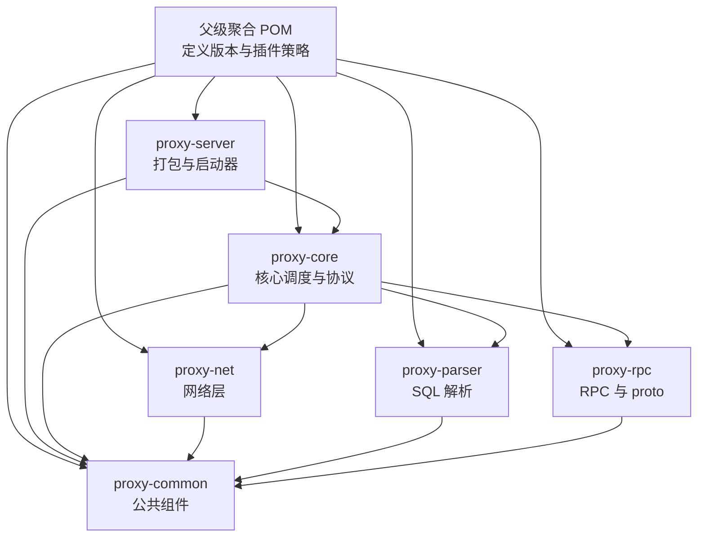
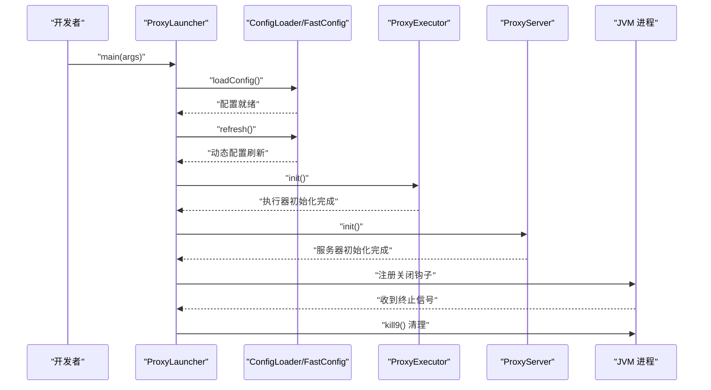
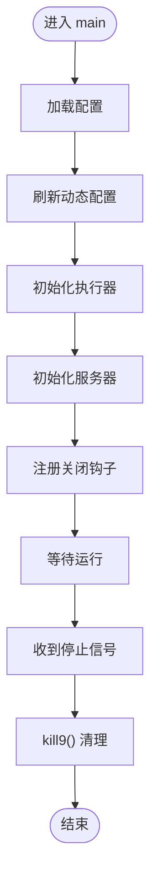
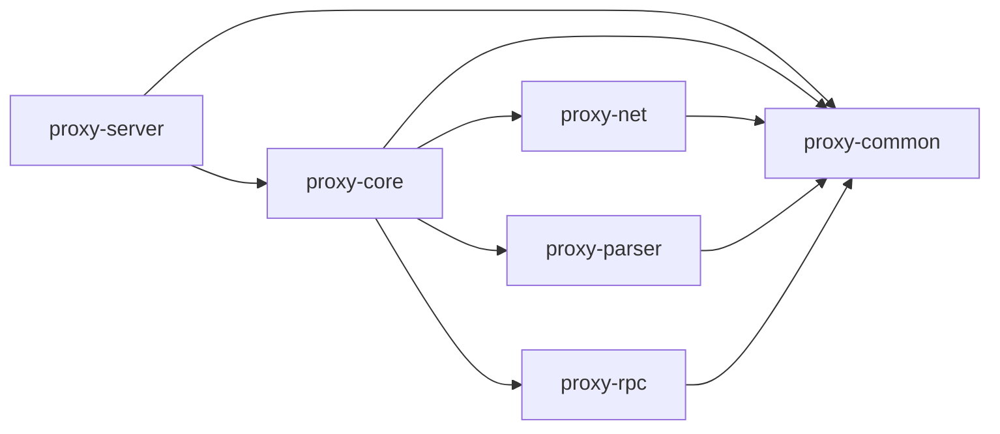

# 开发指南

<cite>
**本文引用的文件**
- [根 POM（pom.xml）](file://pom.xml)
- [用户手册（polardbx_proxy_user_manual.md）](file://polardbx_proxy_user_manual.md)
- [启动器（ProxyLauncher.java）](file://proxy-server/src/main/java/com/alibaba/polardbx/proxy/server/ProxyLauncher.java)
- [代理服务端 POM（proxy-server/pom.xml）](file://proxy-server/pom.xml)
- [通用模块 POM（proxy-common/pom.xml）](file://proxy-common/pom.xml)
- [网络模块 POM（proxy-net/pom.xml）](file://proxy-net/pom.xml)
- [解析模块 POM（proxy-parser/pom.xml）](file://proxy-parser/pom.xml)
- [RPC 模块 POM（proxy-rpc/pom.xml）](file://proxy-rpc/pom.xml)
- [核心模块 POM（proxy-core/pom.xml）](file://proxy-core/pom.xml)
- [开发打包装配（develop.xml）](file://proxy-server/src/main/assembly/develop.xml)
- [发布打包装配（release.xml）](file://proxy-server/src/main/assembly/release.xml)
- [配置模板（config.properties）](file://proxy-server/src/main/conf/config.properties)
- [日志配置（logback.xml）](file://proxy-common/src/main/resources/logback.xml)
- [IDEA 代码风格（codestyle-idea.xml）](file://codestyle/codestyle-idea.xml)
- [快速启动脚本（quick_start.sh）](file://quick_start.sh)
- [Docker 构建脚本（docker_build.sh）](file://docker/docker_build.sh)
- [入口脚本（entrypoint.sh）](file://docker/entrypoint.sh)
- [运行脚本（run.sh）](file://docker/run.sh)
- [README（README.md）](file://README.md)
</cite>

## 目录
1. [简介](#简介)
2. [项目结构](#项目结构)
3. [核心组件](#核心组件)
4. [架构总览](#架构总览)
5. [详细组件分析](#详细组件分析)
6. [依赖分析](#依赖分析)
7. [性能考虑](#性能考虑)
8. [故障排查指南](#故障排查指南)
9. [结论](#结论)
10. [附录](#附录)

## 简介
本指南面向 PolarDB-X Proxy 项目的开发者，覆盖开发环境搭建、模块化结构与依赖关系、代码贡献流程、测试策略、代码风格与静态分析、调试与开发工具、常见问题与效率提升建议，以及构建与发布流程。目标是帮助新成员快速上手并高效贡献高质量代码。

## 项目结构
项目采用多模块 Maven 结构，顶层聚合 POM 声明各子模块，模块按职责拆分：通用能力、网络层、解析层、RPC 层、核心调度与协议处理、以及可执行的服务端封装。

- 顶层聚合模块：定义统一属性、依赖管理和插件策略
- 子模块：
  - proxy-common：公共日志、注解、序列化、基础工具与测试依赖
  - proxy-net：NIO 网络抽象与连接工厂
  - proxy-parser：SQL 解析与 AST 能力
  - proxy-rpc：基于 gRPC 的通用服务接口与编译支持
  - proxy-core：核心调度、上下文、连接池、命令处理器、权限与系统表展示等
  - proxy-server：打包与启动器，提供二进制发行包与运维脚本

图表来源
- [根 POM（pom.xml）](file://pom.xml#L30-L37)
- [代理服务端 POM（proxy-server/pom.xml）](file://proxy-server/pom.xml#L38-L56)
- [核心模块 POM（proxy-core/pom.xml）](file://proxy-core/pom.xml#L38-L62)
- [网络模块 POM（proxy-net/pom.xml）](file://proxy-net/pom.xml#L38-L44)
- [解析模块 POM（proxy-parser/pom.xml）](file://proxy-parser/pom.xml#L38-L44)
- [RPC 模块 POM（proxy-rpc/pom.xml）](file://proxy-rpc/pom.xml#L38-L66)
- [通用模块 POM（proxy-common/pom.xml）](file://proxy-common/pom.xml#L38-L84)

章节来源
- [根 POM（pom.xml）](file://pom.xml#L30-L37)
- [代理服务端 POM（proxy-server/pom.xml）](file://proxy-server/pom.xml#L38-L56)
- [核心模块 POM（proxy-core/pom.xml）](file://proxy-core/pom.xml#L38-L62)
- [网络模块 POM（proxy-net/pom.xml）](file://proxy-net/pom.xml#L38-L44)
- [解析模块 POM（proxy-parser/pom.xml）](file://proxy-parser/pom.xml#L38-L44)
- [RPC 模块 POM（proxy-rpc/pom.xml）](file://proxy-rpc/pom.xml#L38-L66)
- [通用模块 POM（proxy-common/pom.xml）](file://proxy-common/pom.xml#L38-L84)

## 核心组件
- 启动器与初始化链路
  - ProxyLauncher 负责加载配置、刷新动态配置、初始化执行器与服务器，并注册关闭钩子
  - 关键调用顺序：加载配置 → 刷新配置 → 初始化执行器 → 初始化服务器
- 配置与日志
  - config.properties 提供运行期参数（前端端口、后端地址、连接池大小、读写分离、HA、平滑切换、日志开关等）
  - logback.xml 定义控制台与滚动文件输出、异步 Appender、SQL 日志与级别覆盖
- 打包与装配
  - develop.xml 用于本地开发打包（目录形式），release.xml 用于发布打包（tar.gz）
  - maven-assembly-plugin 在不同 profile 下生成不同产物

章节来源
- [启动器（ProxyLauncher.java）](file://proxy-server/src/main/java/com/alibaba/polardbx/proxy/server/ProxyLauncher.java#L32-L55)
- [配置模板（config.properties）](file://proxy-server/src/main/conf/config.properties#L19-L117)
- [日志配置（logback.xml）](file://proxy-common/src/main/resources/logback.xml#L19-L100)
- [开发打包装配（develop.xml）](file://proxy-server/src/main/assembly/develop.xml#L19-L79)
- [发布打包装配（release.xml）](file://proxy-server/src/main/assembly/release.xml#L19-L79)

## 架构总览
下图展示了从启动到运行的关键交互：启动器负责初始化配置与服务，核心模块协调网络、解析与 RPC 组件完成请求处理。

图表来源
- [启动器（ProxyLauncher.java）](file://proxy-server/src/main/java/com/alibaba/polardbx/proxy/server/ProxyLauncher.java#L32-L55)

## 详细组件分析

### 启动器与初始化流程
- 入口方法负责记录启动日志、加载配置、刷新动态配置、初始化执行器与服务器；异常时记录错误并触发进程退出
- 关闭钩子在 JVM 停止时清理资源

图表来源
- [启动器（ProxyLauncher.java）](file://proxy-server/src/main/java/com/alibaba/polardbx/proxy/server/ProxyLauncher.java#L32-L55)

章节来源
- [启动器（ProxyLauncher.java）](file://proxy-server/src/main/java/com/alibaba/polardbx/proxy/server/ProxyLauncher.java#L32-L55)

### 配置与日志
- config.properties 包含前端端口、后端地址与凭证、连接池上限、HA 与读写分离阈值、SQL 日志长度限制、平滑切换与极端性能检测开关等
- logback.xml 支持控制台与文件异步输出、SQL 专用异步日志、按级别覆盖与滚动策略

章节来源
- [配置模板（config.properties）](file://proxy-server/src/main/conf/config.properties#L19-L117)
- [日志配置（logback.xml）](file://proxy-common/src/main/resources/logback.xml#L19-L100)

### 打包与装配
- develop.xml：开发模式打包为目录结构，包含 bin、conf、lib 与 logs 占位
- release.xml：发布模式打包为 tar.gz，包含相同内容但格式不同
- maven-assembly-plugin 在不同 profile 下选择对应装配文件

章节来源
- [开发打包装配（develop.xml）](file://proxy-server/src/main/assembly/develop.xml#L19-L79)
- [发布打包装配（release.xml）](file://proxy-server/src/main/assembly/release.xml#L19-L79)
- [代理服务端 POM（proxy-server/pom.xml）](file://proxy-server/pom.xml#L113-L266)

### 模块依赖与耦合
- proxy-server 依赖 proxy-common 与 proxy-core
- proxy-core 依赖 proxy-common、proxy-net、proxy-parser、proxy-rpc
- proxy-net、proxy-parser、proxy-rpc 均依赖 proxy-common
- 依赖管理集中在父 POM，子模块仅声明坐标与版本占位符

图表来源
- [代理服务端 POM（proxy-server/pom.xml）](file://proxy-server/pom.xml#L38-L56)
- [核心模块 POM（proxy-core/pom.xml）](file://proxy-core/pom.xml#L38-L62)
- [网络模块 POM（proxy-net/pom.xml）](file://proxy-net/pom.xml#L38-L44)
- [解析模块 POM（proxy-parser/pom.xml）](file://proxy-parser/pom.xml#L38-L44)
- [RPC 模块 POM（proxy-rpc/pom.xml）](file://proxy-rpc/pom.xml#L38-L66)
- [通用模块 POM（proxy-common/pom.xml）](file://proxy-common/pom.xml#L38-L84)

章节来源
- [代理服务端 POM（proxy-server/pom.xml）](file://proxy-server/pom.xml#L38-L56)
- [核心模块 POM（proxy-core/pom.xml）](file://proxy-core/pom.xml#L38-L62)
- [网络模块 POM（proxy-net/pom.xml）](file://proxy-net/pom.xml#L38-L44)
- [解析模块 POM（proxy-parser/pom.xml）](file://proxy-parser/pom.xml#L38-L44)
- [RPC 模块 POM（proxy-rpc/pom.xml）](file://proxy-rpc/pom.xml#L38-L66)
- [通用模块 POM（proxy-common/pom.xml）](file://proxy-common/pom.xml#L38-L84)

## 依赖分析
- 版本与工具链
  - Java 版本：源码与目标均为 11
  - 日志体系：SLF4J + Logback
  - 注解：JetBrains Annotations
  - JSON：Gson
  - 测试：JUnit
  - gRPC：netty-shaded、protobuf、stub
- 插件与合规
  - maven-compiler-plugin、maven-jar-plugin、maven-source-plugin、maven-assembly-plugin
  - apache-rat-plugin 用于许可证校验与排除规则

章节来源
- [根 POM（pom.xml）](file://pom.xml#L39-L54)
- [根 POM（pom.xml）](file://pom.xml#L147-L254)
- [通用模块 POM（proxy-common/pom.xml）](file://proxy-common/pom.xml#L38-L84)
- [RPC 模块 POM（proxy-rpc/pom.xml）](file://proxy-rpc/pom.xml#L38-L66)

## 性能考虑
- 异步日志与队列
  - 使用 AsyncAppender 与大容量队列，避免阻塞主业务线程
  - SQL 日志独立异步 Appender，防止日志风暴影响请求处理
- 连接池与读写分离
  - 合理配置后端连接池上限与刷新策略，避免过载
  - 读写分离与延迟阈值需结合实际拓扑与延迟模型调整
- 平滑切换与 HA
  - 平滑切换与延迟检测可降低切换抖动，但会增加监控开销
- 线程与 Reactor
  - worker_threads、reactor_factor 与 cpus 参数需根据 CPU 与负载调优

章节来源
- [日志配置（logback.xml）](file://proxy-common/src/main/resources/logback.xml#L47-L84)
- [配置模板（config.properties）](file://proxy-server/src/main/conf/config.properties#L20-L117)

## 故障排查指南
- 启动失败
  - 检查启动日志与异常栈，确认配置加载与服务器初始化是否成功
  - 若出现致命错误，启动器会记录错误并触发进程退出
- 连接问题
  - 核对前端端口与后端地址、用户名密码、连接超时
  - 检查后端连接池上限与刷新间隔
- 日志定位
  - 控制台与文件日志均开启，SQL 日志可按需开启
  - 注意日志滚动策略与路径变量
- 性能问题
  - 观察日志队列与丢弃阈值，必要时增大队列或降低日志量
  - 调整读写分离阈值与平滑切换参数

章节来源
- [启动器（ProxyLauncher.java）](file://proxy-server/src/main/java/com/alibaba/polardbx/proxy/server/ProxyLauncher.java#L32-L55)
- [配置模板（config.properties）](file://proxy-server/src/main/conf/config.properties#L28-L117)
- [日志配置（logback.xml）](file://proxy-common/src/main/resources/logback.xml#L19-L100)

## 结论
本指南提供了 PolarDB-X Proxy 的开发环境、模块结构、初始化流程、配置与日志、打包装配、依赖与性能要点、故障排查与效率建议。建议在开发前先熟悉模块职责与依赖关系，遵循统一的代码风格与测试策略，利用异步日志与合理的参数配置保障线上稳定性。

## 附录

### 开发环境搭建
- JDK 版本
  - 源码与目标版本均为 11
- IDE 配置
  - 导入仓库为 Maven 工程，使用 IDEA 代码风格配置文件
- Maven 设置
  - 使用标准 Maven 生命周期命令进行构建与打包

章节来源
- [根 POM（pom.xml）](file://pom.xml#L39-L44)
- [IDEA 代码风格（codestyle-idea.xml）](file://codestyle/codestyle-idea.xml#L1-L48)
- [README（README.md）](file://README.md#L7-L9)

### 代码贡献流程
- 分支管理
  - 建议采用功能分支开发，合并前确保通过本地与 CI 测试
- 提交规范
  - 提交信息清晰描述变更目的与范围，避免无关改动
- 代码审查
  - 至少一名维护者审查，关注模块边界、日志与异常处理、性能影响

### 测试策略与框架
- 单元测试
  - 使用 JUnit 4，覆盖核心工具类与边界条件
- 集成测试
  - 通过 proxy-server 的测试类与 JDBC 测试验证端到端行为
- 性能测试
  - 基于日志与参数调优，结合压测工具评估不同配置下的吞吐与延迟

章节来源
- [通用模块 POM（proxy-common/pom.xml）](file://proxy-common/pom.xml#L80-L84)
- [代理服务端 POM（proxy-server/pom.xml）](file://proxy-server/pom.xml#L52-L56)

### 代码风格与静态分析
- 代码风格
  - 使用 IDEA 代码风格配置文件，保持一致的缩进、换行与注释风格
- 静态分析
  - 可引入 SpotBugs、Checkstyle 或 PMD 等工具，结合现有 RAT 插件保证许可证合规

章节来源
- [IDEA 代码风格（codestyle-idea.xml）](file://codestyle/codestyle-idea.xml#L1-L48)
- [根 POM（pom.xml）](file://pom.xml#L174-L254)

### 调试技巧与开发工具
- 断点调试
  - 在 ProxyLauncher.main、核心调度与命令处理器关键节点设置断点
- 性能分析
  - 使用异步日志定位热点，结合 JVM 监控观察 GC 与线程状态
- 内存检查
  - 关注日志队列与缓冲池大小，避免内存峰值过高

章节来源
- [启动器（ProxyLauncher.java）](file://proxy-server/src/main/java/com/alibaba/polardbx/proxy/server/ProxyLauncher.java#L32-L55)
- [日志配置（logback.xml）](file://proxy-common/src/main/resources/logback.xml#L47-L84)

### 常见问题与效率提升
- 快速启动
  - 使用 quick_start.sh 快速启动本地实例
- Docker 化
  - 使用 docker_build.sh、entrypoint.sh、run.sh 进行容器化部署与运行
- 配置热更新
  - 动态配置文件路径在配置模板中定义，注意权限与路径

章节来源
- [快速启动脚本（quick_start.sh）](file://quick_start.sh)
- [Docker 构建脚本（docker_build.sh）](file://docker/docker_build.sh)
- [入口脚本（entrypoint.sh）](file://docker/entrypoint.sh)
- [运行脚本（run.sh）](file://docker/run.sh)
- [配置模板（config.properties）](file://proxy-server/src/main/conf/config.properties#L50-L51)

### 构建与发布流程
- 构建
  - 使用 Maven 生命周期命令进行构建与打包
- 开发包
  - 使用 develop.xml 生成目录结构的开发包
- 发布包
  - 使用 release.xml 生成 tar.gz 的发布包
- RPM 与制品
  - 提供 RPM 相关脚本与规格文件，便于系统级分发

章节来源
- [README（README.md）](file://README.md#L7-L9)
- [开发打包装配（develop.xml）](file://proxy-server/src/main/assembly/develop.xml#L19-L79)
- [发布打包装配（release.xml）](file://proxy-server/src/main/assembly/release.xml#L19-L79)
- [代理服务端 POM（proxy-server/pom.xml）](file://proxy-server/pom.xml#L113-L266)
- [用户手册（polardbx_proxy_user_manual.md）](file://polardbx_proxy_user_manual.md)