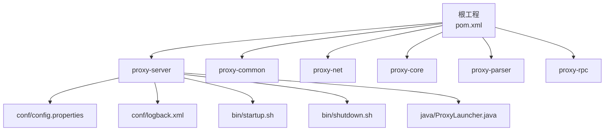
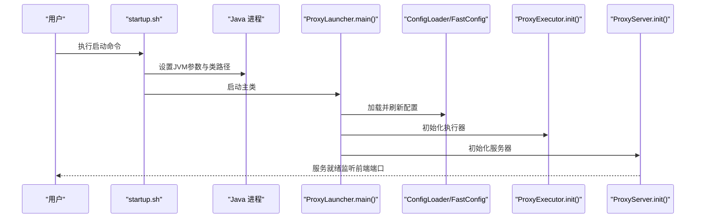
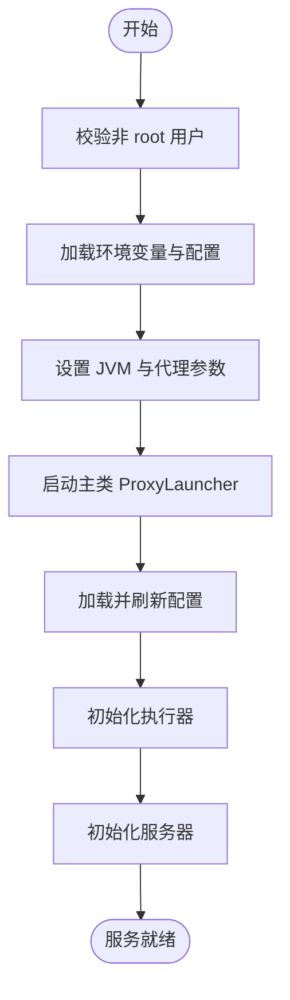
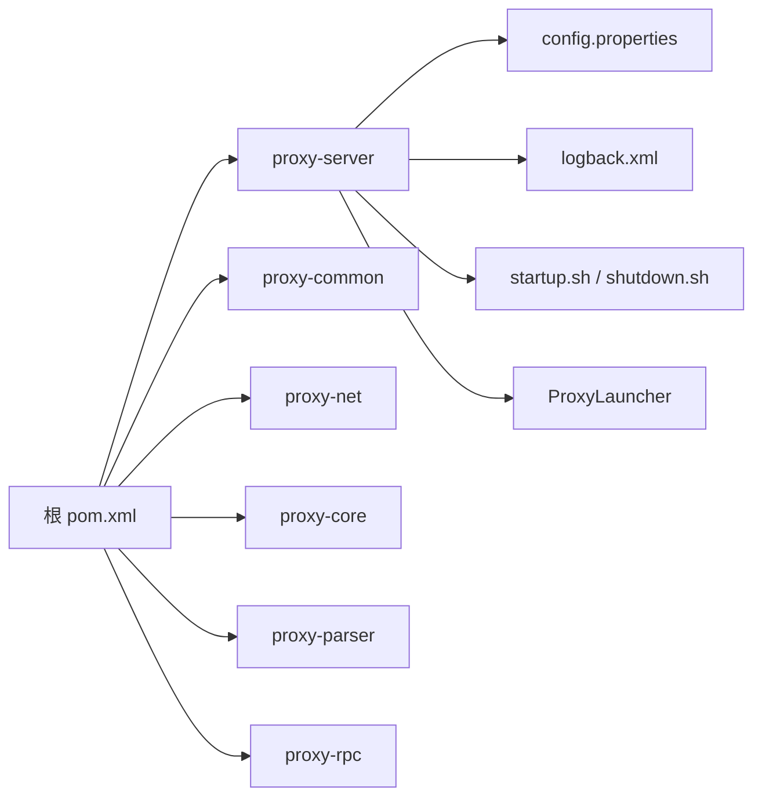

# 快速开始

<cite>
**本文引用的文件**   
- [README.md](file://README.md)
- [pom.xml](file://pom.xml)
- [proxy-server/src/main/conf/config.properties](file://proxy-server/src/main/conf/config.properties)
- [proxy-common/src/main/resources/config.properties](file://proxy-common/src/main/resources/config.properties)
- [proxy-server/src/main/conf/logback.xml](file://proxy-server/src/main/conf/logback.xml)
- [proxy-server/src/main/bin/startup.sh](file://proxy-server/src/main/bin/startup.sh)
- [proxy-server/src/main/bin/shutdown.sh](file://proxy-server/src/main/bin/shutdown.sh)
- [proxy-server/src/main/java/com/alibaba/polardbx/proxy/server/ProxyLauncher.java](file://proxy-server/src/main/java/com/alibaba/polardbx/proxy/server/ProxyLauncher.java)
- [proxy-server/src/test/java/JdbcTest.java](file://proxy-server/src/test/java/JdbcTest.java)
- [quick_start.sh](file://quick_start.sh)
- [docker/Dockerfile](file://docker/Dockerfile)
- [docker/run.sh](file://docker/run.sh)
</cite>

## 目录
1. [简介](#简介)
2. [项目结构](#项目结构)
3. [核心组件](#核心组件)
4. [架构总览](#架构总览)
5. [详细组件分析](#详细组件分析)
6. [依赖分析](#依赖分析)
7. [性能注意事项](#性能注意事项)
8. [故障排查指南](#故障排查指南)
9. [结论](#结论)
10. [附录](#附录)

## 简介
本指南面向首次接触 PolarDB-X Proxy 的用户，帮助你在最短时间内完成环境准备、源码编译、配置与启动，并进行基础连接与查询验证。你将获得：
- 完整的安装与编译步骤
- 关键配置项说明（尤其是 config.properties）
- 启动与停止服务的命令
- 基本使用示例与连接测试方法
- 常见初始化问题与解决方案
- 验证安装成功的检查清单

## 项目结构
该仓库采用 Maven 多模块结构，核心与运行相关的关键模块如下：
- proxy-common：通用配置与工具
- proxy-net：网络层实现
- proxy-core：核心协议与调度逻辑
- proxy-parser：SQL 解析器
- proxy-rpc：RPC 服务定义
- proxy-server：打包与运行入口（含启动脚本、配置与日志）

图表来源
- [pom.xml](file://pom.xml#L30-L37)
- [proxy-server/src/main/conf/config.properties](file://proxy-server/src/main/conf/config.properties#L1-L117)
- [proxy-server/src/main/conf/logback.xml](file://proxy-server/src/main/conf/logback.xml#L1-L98)
- [proxy-server/src/main/bin/startup.sh](file://proxy-server/src/main/bin/startup.sh#L1-L415)
- [proxy-server/src/main/bin/shutdown.sh](file://proxy-server/src/main/bin/shutdown.sh#L1-L117)
- [proxy-server/src/main/java/com/alibaba/polardbx/proxy/server/ProxyLauncher.java](file://proxy-server/src/main/java/com/alibaba/polardbx/proxy/server/ProxyLauncher.java#L1-L57)

章节来源
- [pom.xml](file://pom.xml#L30-L37)

## 核心组件
- 启动入口：ProxyLauncher 负责加载配置、初始化执行器与服务器实例
- 配置中心：config.properties 提供前端端口、后端地址、连接池、读写分离、动态配置等关键参数
- 日志系统：logback.xml 控制控制台与文件日志输出策略
- 启停脚本：startup.sh 与 shutdown.sh 提供启动、调试、参数注入与优雅关闭能力
- Docker 支持：Dockerfile 与 run.sh 提供容器化部署与端口映射

章节来源
- [proxy-server/src/main/java/com/alibaba/polardbx/proxy/server/ProxyLauncher.java](file://proxy-server/src/main/java/com/alibaba/polardbx/proxy/server/ProxyLauncher.java#L29-L56)
- [proxy-server/src/main/conf/config.properties](file://proxy-server/src/main/conf/config.properties#L19-L117)
- [proxy-server/src/main/conf/logback.xml](file://proxy-server/src/main/conf/logback.xml#L19-L98)
- [proxy-server/src/main/bin/startup.sh](file://proxy-server/src/main/bin/startup.sh#L1-L415)
- [proxy-server/src/main/bin/shutdown.sh](file://proxy-server/src/main/bin/shutdown.sh#L1-L117)
- [docker/Dockerfile](file://docker/Dockerfile#L1-L19)
- [docker/run.sh](file://docker/run.sh#L1-L89)

## 架构总览
下图展示了从启动脚本到主程序的调用链路，以及配置与日志在启动流程中的作用。

图表来源
- [proxy-server/src/main/bin/startup.sh](file://proxy-server/src/main/bin/startup.sh#L377-L408)
- [proxy-server/src/main/java/com/alibaba/polardbx/proxy/server/ProxyLauncher.java](file://proxy-server/src/main/java/com/alibaba/polardbx/proxy/server/ProxyLauncher.java#L32-L44)

## 详细组件分析

### 环境准备与编译
- 环境要求
  - Java 版本：11 及以上（根工程明确指定编译目标为 11）
  - Maven：用于多模块构建
- 编译方式
  - 在根目录执行打包命令以构建完整产物（跳过测试可加速）
- 产物位置
  - proxy-server 模块包含最终可运行包与启动脚本

章节来源
- [pom.xml](file://pom.xml#L39-L54)
- [README.md](file://README.md#L7-L9)

### 配置文件详解（config.properties）
以下为核心配置项说明（来源于运行时配置文件）：

- 基础与反应堆
  - worker_threads：工作线程数
  - timer_threads：定时任务线程数
  - cpus：CPU 核数（0 表示自动）
  - reactor_factor：反应堆因子
  - cluster_node_id：集群节点 ID

- 前端连接
  - frontend_port：前端监听端口（默认 3307）

- 后端连接
  - backend_address：后端数据库地址与端口
  - backend_username：后端用户名
  - backend_password：后端密码
  - backend_connect_timeout：后端连接超时（毫秒）

- 连接池
  - backend_admin_max_pooled_size：管理连接池最大大小
  - backend_rw_max_pooled_size：读写连接池最大大小
  - backend_ro_max_pooled_size：只读连接池最大大小

- 高可用与健康检查
  - backend_ha_worker_threads：HA 工作线程数
  - backend_ha_check_interval：健康检查间隔（毫秒）
  - backend_ha_check_timeout：健康检查超时（毫秒）

- 动态配置
  - dynamic_config_file：动态配置文件路径

- 连接保持与重传
  - enable_connection_hold：是否启用连接保持
  - query_retransmit_timeout：查询重传超时（毫秒）
  - query_retransmit_fast_retries：快速重试次数
  - query_retransmit_fast_retry_delay：快速重试延迟（毫秒）
  - query_retransmit_slow_retry_delay：慢速重试延迟（毫秒）

- 读写分离与跟随者读
  - enable_read_write_splitting：启用读写分离
  - enable_follower_read：启用跟随者读
  - enable_leader_in_ro_pools：领导者加入只读池
  - read_weights：读权重（空表示均分）
  - latency_check_timeout：延迟检测超时（毫秒）
  - latency_check_interval：延迟检测间隔（毫秒）
  - latency_record_count：延迟记录条数
  - slave_read_latency_threshold：从库读延迟阈值（毫秒）
  - fetch_lsn_timeout：LSN 获取超时（毫秒）
  - fetch_lsn_retry_times：LSN 获取重试次数
  - enable_stale_read：允许陈旧读

- 连接池刷新
  - backend_pool_refresh_threads：刷新线程数
  - backend_pool_refresh_task_interval：刷新任务间隔（毫秒）
  - backend_pool_refresh_interval：刷新周期（毫秒）
  - backend_pool_refresh_sql：刷新 SQL
  - backend_pool_refresh_timeout：刷新超时（毫秒）

- 权限与全局变量
  - privilege_refresh_timeout：权限刷新超时（毫秒）
  - privilege_refresh_interval：权限刷新间隔（毫秒）
  - global_variables_refresh_interval：全局变量刷新间隔（毫秒）

- 租约与通用服务
  - node_ip：节点 IP
  - general_service_port：通用服务端口（默认 8083）
  - general_service_timeout：通用服务超时（毫秒）
  - node_lease：租期（毫秒）
  - update_lease_timeout：更新租期超时（毫秒）

- 预处理语句缓存
  - prepared_statement_cache_size：预处理语句缓存大小

- 日志
  - log_sql_max_length：SQL 日志最大长度
  - log_sql_param_max_length：SQL 参数日志最大长度
  - enable_sql_log：是否开启 SQL 日志

- 性能与极端模式
  - max_allowed_packet：最大数据包大小
  - smooth_switchover_enabled：启用平滑切换
  - smooth_switchover_check_interval：平滑切换检查间隔（毫秒）
  - smooth_switchover_wait_timeout：平滑切换等待超时（毫秒）
  - enable_leak_check：启用泄漏检测

章节来源
- [proxy-server/src/main/conf/config.properties](file://proxy-server/src/main/conf/config.properties#L19-L117)

### 启动与停止服务
- 启动
  - 使用启动脚本，支持多种参数注入（如配置文件路径、日志根目录、内存、实例 ID 等）
  - 启动脚本会根据系统环境选择合适的 Java，并设置 JVM 与代理参数
  - 主类为 ProxyLauncher，负责加载配置、初始化执行器与服务器
- 停止
  - 使用停止脚本，按进程名查找并优雅终止
  - 若超时未退出，脚本会强制终止

图表来源
- [proxy-server/src/main/bin/startup.sh](file://proxy-server/src/main/bin/startup.sh#L80-L414)
- [proxy-server/src/main/java/com/alibaba/polardbx/proxy/server/ProxyLauncher.java](file://proxy-server/src/main/java/com/alibaba/polardbx/proxy/server/ProxyLauncher.java#L32-L44)

章节来源
- [proxy-server/src/main/bin/startup.sh](file://proxy-server/src/main/bin/startup.sh#L1-L415)
- [proxy-server/src/main/bin/shutdown.sh](file://proxy-server/src/main/bin/shutdown.sh#L1-L117)
- [proxy-server/src/main/java/com/alibaba/polardbx/proxy/server/ProxyLauncher.java](file://proxy-server/src/main/java/com/alibaba/polardbx/proxy/server/ProxyLauncher.java#L29-L56)

### 基本使用示例（连接与查询）
- 连接方式
  - 使用标准 MySQL 客户端或 JDBC 连接至前端端口（默认 3307）
  - 示例 URL（来自测试代码）：jdbc:mysql://127.1:3307/test?...（注意：测试代码中的主机地址为演示用途）
- 常用操作
  - 创建测试表
  - 插入少量测试数据
  - 执行查询与结果集遍历
  - 测试大包、游标、批量语句等特性（参考测试用例）

章节来源
- [proxy-server/src/test/java/JdbcTest.java](file://proxy-server/src/test/java/JdbcTest.java#L28-L358)

### 验证安装成功
- 端口检查
  - 前端端口：3307（默认）
  - 通用服务端口：8083（默认）
- 连接测试
  - 使用 MySQL 客户端或 JDBC 连接前端端口
  - 执行简单查询（如 SELECT 1）确认连通性
- 日志检查
  - 查看日志目录下的 proxy.log 与 sql.log，确认无致命错误
- Docker 部署验证
  - 使用提供的 run.sh 或 quick_start.sh 启动容器，检查容器状态与端口映射

章节来源
- [proxy-server/src/main/conf/logback.xml](file://proxy-server/src/main/conf/logback.xml#L29-L93)
- [docker/run.sh](file://docker/run.sh#L45-L89)
- [quick_start.sh](file://quick_start.sh#L1-L89)

## 依赖分析
- 构建工具链
  - Maven：多模块构建与打包
  - 编译插件：maven-compiler-plugin、maven-assembly-plugin 等
- 运行时依赖
  - 日志：SLF4J + Logback
  - MySQL 协议：mysql-connector-java（测试范围）
  - gRPC：用于 RPC 通信（运行时依赖）
- 模块耦合
  - proxy-server 作为运行入口，依赖 proxy-common、proxy-net、proxy-core、proxy-parser、proxy-rpc
  - 配置与日志位于 proxy-server 的 conf 目录，被启动脚本与主程序加载

图表来源
- [pom.xml](file://pom.xml#L30-L37)
- [proxy-server/src/main/conf/config.properties](file://proxy-server/src/main/conf/config.properties#L1-L117)
- [proxy-server/src/main/conf/logback.xml](file://proxy-server/src/main/conf/logback.xml#L1-L98)
- [proxy-server/src/main/bin/startup.sh](file://proxy-server/src/main/bin/startup.sh#L1-L415)
- [proxy-server/src/main/java/com/alibaba/polardbx/proxy/server/ProxyLauncher.java](file://proxy-server/src/main/java/com/alibaba/polardbx/proxy/server/ProxyLauncher.java#L1-L57)

章节来源
- [pom.xml](file://pom.xml#L147-L254)

## 性能注意事项
- JVM 内存与 GC
  - 启动脚本会根据系统内存自动设置堆大小；若需要手动指定，可通过参数传入
  - 推荐使用 G1 垃圾收集器，并结合业务吞吐与延迟目标调整参数
- 线程与反应堆
  - worker_threads、timer_threads、reactor_factor 与 cpus 影响并发与事件循环效率
- 连接池与读写分离
  - 合理设置 backend_rw_max_pooled_size 与 backend_ro_max_pooled_size，避免连接不足或过度占用
  - 开启读写分离与跟随者读时，关注延迟阈值与刷新周期
- 日志与 SQL 输出
  - SQL 日志开启会带来额外开销，建议仅在诊断阶段启用

## 故障排查指南
- 启动失败（无法找到 Java）
  - 确认 PATH 中存在 Java 且版本满足 11+；启动脚本会优先尝试特定路径
- 端口冲突
  - 前端端口 3307 与通用服务端口 8083 默认占用，若被占用需修改配置或释放端口
- 权限问题（root 用户启动）
  - 启动脚本禁止以 root 用户运行，需切换到普通用户
- 连接失败
  - 核对 backend_address、backend_username、backend_password 是否正确
  - 确认后端数据库可达且监听在对应端口
- 日志定位
  - 查看 logs 目录下的 proxy.log 与 sql.log，结合日志级别与时间戳定位问题
- Docker 部署
  - 确认容器已映射 3307 与 8083 端口；检查容器日志与网络模式

章节来源
- [proxy-server/src/main/bin/startup.sh](file://proxy-server/src/main/bin/startup.sh#L255-L289)
- [proxy-server/src/main/bin/startup.sh](file://proxy-server/src/main/bin/startup.sh#L408-L414)
- [proxy-server/src/main/bin/shutdown.sh](file://proxy-server/src/main/bin/shutdown.sh#L85-L116)
- [proxy-server/src/main/conf/logback.xml](file://proxy-server/src/main/conf/logback.xml#L29-L93)

## 结论
通过本指南，你可以完成 PolarDB-X Proxy 的环境准备、源码编译、配置与启动，并进行基本的连接与查询验证。建议在生产环境中进一步细化 JVM 参数、连接池与日志策略，并结合监控与告警体系保障稳定性。

## 附录

### 常用命令速查
- 编译（跳过测试）
  - mvn clean package -DskipTests
- 启动（使用默认配置）
  - ./proxy-server/src/main/bin/startup.sh
- 停止
  - ./proxy-server/src/main/bin/shutdown.sh
- Docker 快速启动
  - ./docker/run.sh -e backend_address=... -e backend_username=... -e backend_password=...
  - 或使用 quick_start.sh 辅助脚本

章节来源
- [README.md](file://README.md#L7-L9)
- [proxy-server/src/main/bin/startup.sh](file://proxy-server/src/main/bin/startup.sh#L1-L415)
- [proxy-server/src/main/bin/shutdown.sh](file://proxy-server/src/main/bin/shutdown.sh#L1-L117)
- [docker/run.sh](file://docker/run.sh#L1-L89)
- [quick_start.sh](file://quick_start.sh#L1-L89)