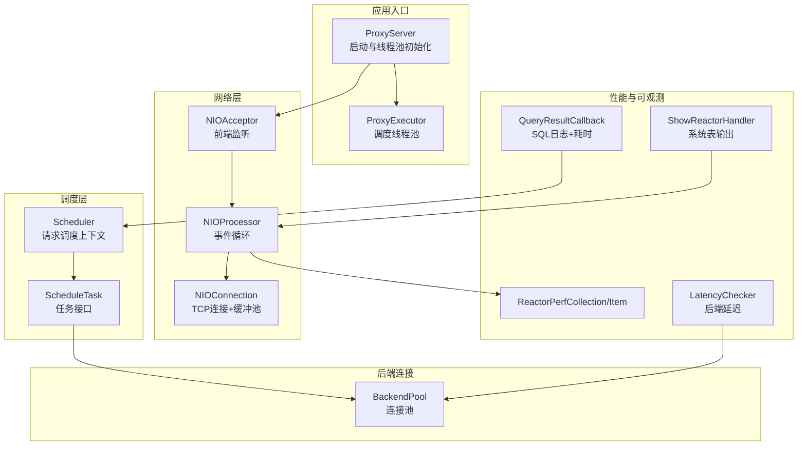
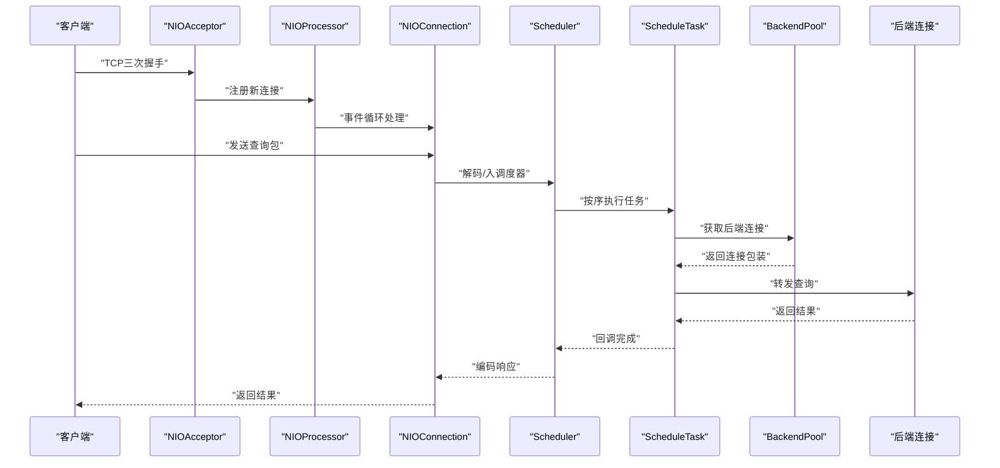
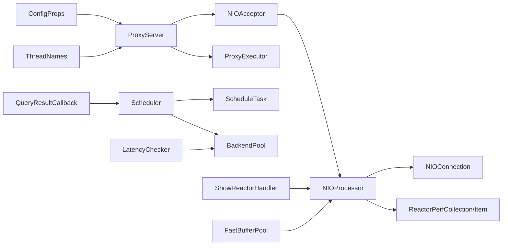

# 性能问题排查

<cite>
**本文引用的文件**
- [proxy-core/src/main/java/com/alibaba/polardbx/proxy/ProxyServer.java](file://proxy-core/src/main/java/com/alibaba/polardbx/proxy/ProxyServer.java)
- [proxy-core/src/main/java/com/alibaba/polardbx/proxy/scheduler/Scheduler.java](file://proxy-core/src/main/java/com/alibaba/polardbx/proxy/scheduler/Scheduler.java)
- [proxy-core/src/main/java/com/alibaba/polardbx/proxy/scheduler/ScheduleTask.java](file://proxy-core/src/main/java/com/alibaba/polardbx/proxy/scheduler/ScheduleTask.java)
- [proxy-core/src/main/java/com/alibaba/polardbx/proxy/ProxyExecutor.java](file://proxy-core/src/main/java/com/alibaba/polardbx/proxy/ProxyExecutor.java)
- [proxy-core/src/main/java/com/alibaba/polardbx/proxy/connection/pool/BackendPool.java](file://proxy-core/src/main/java/com/alibaba/polardbx/proxy/connection/pool/BackendPool.java)
- [proxy-core/src/main/java/com/alibaba/polardbx/proxy/callback/QueryResultCallback.java](file://proxy-core/src/main/java/com/alibaba/polardbx/proxy/callback/QueryResultCallback.java)
- [proxy-core/src/main/java/com/alibaba/polardbx/proxy/serverless/LatencyChecker.java](file://proxy-core/src/main/java/com/alibaba/polardbx/proxy/serverless/LatencyChecker.java)
- [proxy-core/src/main/java/com/alibaba/polardbx/proxy/protocol/handler/request/ShowReactorHandler.java](file://proxy-core/src/main/java/com/alibaba/polardbx/proxy/protocol/handler/request/ShowReactorHandler.java)
- [proxy-core/src/main/java/com/alibaba/polardbx/proxy/protocol/handler/request/SystemTableRequestHandler.java](file://proxy-core/src/main/java/com/alibaba/polardbx/proxy/protocol/handler/request/SystemTableRequestHandler.java)
- [proxy-net/src/main/java/com/alibaba/polardbx/proxy/net/NIOAcceptor.java](file://proxy-net/src/main/java/com/alibaba/polardbx/proxy/net/NIOAcceptor.java)
- [proxy-net/src/main/java/com/alibaba/polardbx/proxy/net/NIOProcessor.java](file://proxy-net/src/main/java/com/alibaba/polardbx/proxy/net/NIOProcessor.java)
- [proxy-net/src/main/java/com/alibaba/polardbx/proxy/net/NIOConnection.java](file://proxy-net/src/main/java/com/alibaba/polardbx/proxy/net/NIOConnection.java)
- [proxy-net/src/main/java/com/alibaba/polardbx/proxy/perf/ReactorPerfCollection.java](file://proxy-net/src/main/java/com/alibaba/polardbx/proxy/perf/ReactorPerfCollection.java)
- [proxy-net/src/main/java/com/alibaba/polardbx/proxy/perf/ReactorPerfItem.java](file://proxy-net/src/main/java/com/alibaba/polardbx/proxy/perf/ReactorPerfItem.java)
- [proxy-common/src/main/java/com/alibaba/polardbx/proxy/common/ThreadNames.java](file://proxy-common/src/main/java/com/alibaba/polardbx/proxy/common/ThreadNames.java)
- [proxy-common/src/main/java/com/alibaba/polardbx/proxy/config/ConfigProps.java](file://proxy-common/src/main/java/com/alibaba/polardbx/proxy/config/ConfigProps.java)
- [proxy-common/src/main/java/com/alibaba/polardbx/proxy/utils/FastBufferPool.java](file://proxy-common/src/main/java/com/alibaba/polardbx/proxy/utils/FastBufferPool.java)
</cite>

## 目录
1. [简介](#简介)
2. [项目结构](#项目结构)
3. [核心组件](#核心组件)
4. [架构总览](#架构总览)
5. [详细组件分析](#详细组件分析)
6. [依赖关系分析](#依赖关系分析)
7. [性能考量与调优](#性能考量与调优)
8. [故障排查指南](#故障排查指南)
9. [结论](#结论)
10. [附录](#附录)

## 简介
本指南面向PolarDB-X Proxy在生产环境中的性能问题排查，围绕“查询性能下降”“系统瓶颈定位”“网络性能问题”“调度器性能问题”四类典型场景，结合代码实现与运行时指标，给出可操作的诊断路径、指标解读与优化建议，并提供基于系统表与性能采集的工具化手段。

## 项目结构
- 核心服务启动与线程池：ProxyServer负责初始化NIO工作线程、定时器、后端高可用线程池等；ProxyExecutor提供通用调度线程池。
- 网络层：NIOAcceptor监听前端连接，NIOProcessor事件循环处理读写，NIOConnection封装TCP连接与缓冲池。
- 调度层：Scheduler承载一次请求的完整生命周期，ScheduleTask定义任务管线，支持重传、LSN等待、主从读取等策略。
- 后端连接池：BackendPool管理到后端的连接池，支持空闲刷新、最大连接数控制与运行中连接统计。
- 性能采集：ReactorPerfCollection/ReactorPerfItem记录每Reactor的事件循环、注册、读写、连接、缓冲区使用情况。
- 可观测性：ShowReactorHandler通过系统表展示各Reactor性能指标；QueryResultCallback输出SQL日志与关键耗时；LatencyChecker用于后端节点延迟评估。

**图示来源**
- [proxy-core/src/main/java/com/alibaba/polardbx/proxy/ProxyServer.java](file://proxy-core/src/main/java/com/alibaba/polardbx/proxy/ProxyServer.java#L56-L96)
- [proxy-core/src/main/java/com/alibaba/polardbx/proxy/ProxyExecutor.java](file://proxy-core/src/main/java/com/alibaba/polardbx/proxy/ProxyExecutor.java#L34-L39)
- [proxy-net/src/main/java/com/alibaba/polardbx/proxy/net/NIOAcceptor.java](file://proxy-net/src/main/java/com/alibaba/polardbx/proxy/net/NIOAcceptor.java#L46-L59)
- [proxy-net/src/main/java/com/alibaba/polardbx/proxy/net/NIOProcessor.java](file://proxy-net/src/main/java/com/alibaba/polardbx/proxy/net/NIOProcessor.java#L52-L65)
- [proxy-core/src/main/java/com/alibaba/polardbx/proxy/scheduler/Scheduler.java](file://proxy-core/src/main/java/com/alibaba/polardbx/proxy/scheduler/Scheduler.java#L115-L149)
- [proxy-core/src/main/java/com/alibaba/polardbx/proxy/scheduler/ScheduleTask.java](file://proxy-core/src/main/java/com/alibaba/polardbx/proxy/scheduler/ScheduleTask.java#L21-L30)
- [proxy-core/src/main/java/com/alibaba/polardbx/proxy/connection/pool/BackendPool.java](file://proxy-core/src/main/java/com/alibaba/polardbx/proxy/connection/pool/BackendPool.java#L88-L98)
- [proxy-net/src/main/java/com/alibaba/polardbx/proxy/perf/ReactorPerfCollection.java](file://proxy-net/src/main/java/com/alibaba/polardbx/proxy/perf/ReactorPerfCollection.java#L26-L33)
- [proxy-core/src/main/java/com/alibaba/polardbx/proxy/protocol/handler/request/ShowReactorHandler.java](file://proxy-core/src/main/java/com/alibaba/polardbx/proxy/protocol/handler/request/ShowReactorHandler.java#L67-L89)
- [proxy-core/src/main/java/com/alibaba/polardbx/proxy/callback/QueryResultCallback.java](file://proxy-core/src/main/java/com/alibaba/polardbx/proxy/callback/QueryResultCallback.java#L246-L289)
- [proxy-core/src/main/java/com/alibaba/polardbx/proxy/serverless/LatencyChecker.java](file://proxy-core/src/main/java/com/alibaba/polardbx/proxy/serverless/LatencyChecker.java#L137-L181)

**章节来源**
- [proxy-core/src/main/java/com/alibaba/polardbx/proxy/ProxyServer.java](file://proxy-core/src/main/java/com/alibaba/polardbx/proxy/ProxyServer.java#L56-L96)
- [proxy-net/src/main/java/com/alibaba/polardbx/proxy/net/NIOAcceptor.java](file://proxy-net/src/main/java/com/alibaba/polardbx/proxy/net/NIOAcceptor.java#L46-L59)
- [proxy-net/src/main/java/com/alibaba/polardbx/proxy/net/NIOProcessor.java](file://proxy-net/src/main/java/com/alibaba/polardbx/proxy/net/NIOProcessor.java#L52-L65)

## 核心组件
- ProxyServer：初始化Reactor工作线程数量（CPU核数×因子）、后端高可用线程池、服务注册与接受器，统一对外提供代理能力。
- NIOAcceptor/NIOProcessor/NIOConnection：基于NIO的事件驱动网络栈，支持缓冲池复用与性能计数。
- Scheduler/ScheduleTask：请求在Proxy内的流水线式调度，支持重传、LSN等待、主从决策、准备阶段等。
- BackendPool：后端连接池，支持最大池大小、空闲刷新、运行中连接统计。
- ProxyExecutor：通用调度线程池，用于定时器与异步任务。
- 性能采集：ReactorPerfCollection/Item、ShowReactorHandler、QueryResultCallback、LatencyChecker。

**章节来源**
- [proxy-core/src/main/java/com/alibaba/polardbx/proxy/ProxyServer.java](file://proxy-core/src/main/java/com/alibaba/polardbx/proxy/ProxyServer.java#L61-L74)
- [proxy-net/src/main/java/com/alibaba/polardbx/proxy/net/NIOProcessor.java](file://proxy-net/src/main/java/com/alibaba/polardbx/proxy/net/NIOProcessor.java#L116-L132)
- [proxy-core/src/main/java/com/alibaba/polardbx/proxy/scheduler/Scheduler.java](file://proxy-core/src/main/java/com/alibaba/polardbx/proxy/scheduler/Scheduler.java#L115-L149)
- [proxy-core/src/main/java/com/alibaba/polardbx/proxy/connection/pool/BackendPool.java](file://proxy-core/src/main/java/com/alibaba/polardbx/proxy/connection/pool/BackendPool.java#L107-L113)
- [proxy-core/src/main/java/com/alibaba/polardbx/proxy/ProxyExecutor.java](file://proxy-core/src/main/java/com/alibaba/polardbx/proxy/ProxyExecutor.java#L34-L39)

## 架构总览
下图展示了从客户端到后端数据库的关键路径与性能观测点，以及调度器在其中的作用。

**图示来源**
- [proxy-net/src/main/java/com/alibaba/polardbx/proxy/net/NIOAcceptor.java](file://proxy-net/src/main/java/com/alibaba/polardbx/proxy/net/NIOAcceptor.java#L61-L81)
- [proxy-net/src/main/java/com/alibaba/polardbx/proxy/net/NIOProcessor.java](file://proxy-net/src/main/java/com/alibaba/polardbx/proxy/net/NIOProcessor.java#L84-L114)
- [proxy-core/src/main/java/com/alibaba/polardbx/proxy/scheduler/Scheduler.java](file://proxy-core/src/main/java/com/alibaba/polardbx/proxy/scheduler/Scheduler.java#L300-L313)
- [proxy-core/src/main/java/com/alibaba/polardbx/proxy/scheduler/ScheduleTask.java](file://proxy-core/src/main/java/com/alibaba/polardbx/proxy/scheduler/ScheduleTask.java#L21-L30)
- [proxy-core/src/main/java/com/alibaba/polardbx/proxy/connection/pool/BackendPool.java](file://proxy-core/src/main/java/com/alibaba/polardbx/proxy/connection/pool/BackendPool.java#L115-L132)

## 详细组件分析

### 查询性能诊断：慢查询识别、执行计划分析与优化建议
- 慢查询识别
  - 使用系统表SHOW SLOW/PHYSICAL_SLOW（解析器支持ShowSlow节点）进行查询聚合与过滤，结合QueryResultCallback输出的SQL日志与关键耗时字段（重传延迟、LSN等待、调度等待、Leader等待等），定位慢点。
  - 关键日志字段路径参考：[QueryResultCallback.java](file://proxy-core/src/main/java/com/alibaba/polardbx/proxy/callback/QueryResultCallback.java#L274-L283)
- 执行计划分析
  - 调度器在forward过程中按任务序列执行，每个任务可能涉及后端连接获取、LSN等待、主从选择等，这些都会影响整体时延。可结合Scheduler内部累计耗时字段进行分析。
  - 调度器耗时累计路径参考：[Scheduler.java](file://proxy-core/src/main/java/com/alibaba/polardbx/proxy/scheduler/Scheduler.java#L161-L183)
- 优化建议
  - 减少重传：检查重传超时与快速重试参数，避免不必要的重试导致尾延迟放大。
  - 优化主从读取：根据LatencyChecker计算的后端延迟阈值，合理启用跟随者读取，降低主库压力。
  - 连接池优化：增大后端连接池上限或调整空闲刷新策略，减少连接获取阻塞。

**章节来源**
- [proxy-core/src/main/java/com/alibaba/polardbx/proxy/callback/QueryResultCallback.java](file://proxy-core/src/main/java/com/alibaba/polardbx/proxy/callback/QueryResultCallback.java#L246-L289)
- [proxy-core/src/main/java/com/alibaba/polardbx/proxy/scheduler/Scheduler.java](file://proxy-core/src/main/java/com/alibaba/polardbx/proxy/scheduler/Scheduler.java#L161-L183)
- [proxy-core/src/main/java/com/alibaba/polardbx/proxy/serverless/LatencyChecker.java](file://proxy-core/src/main/java/com/alibaba/polardbx/proxy/serverless/LatencyChecker.java#L137-L181)

### 系统性能瓶颈定位：CPU、内存与磁盘I/O
- CPU使用率分析
  - 通过ShowReactorHandler查看各NIOProcessor的事件循环次数、注册次数、读写次数，判断是否存在事件风暴或过多连接导致CPU占用上升。
  - 指标采集与导出路径参考：[ShowReactorHandler.java](file://proxy-core/src/main/java/com/alibaba/polardbx/proxy/protocol/handler/request/ShowReactorHandler.java#L67-L89)、[NIOProcessor.java](file://proxy-net/src/main/java/com/alibaba/polardbx/proxy/net/NIOProcessor.java#L116-L132)
- 内存消耗监控
  - FastBufferPool提供直接内存块池化，可通过ReactorPerfItem中的bufferSize、bufferBlockSize、idleBufferCount观察内存占用与碎片情况。
  - 缓冲池实现参考：[FastBufferPool.java](file://proxy-common/src/main/java/com/alibaba/polardbx/proxy/utils/FastBufferPool.java#L51-L69)
- 磁盘I/O性能评估
  - 后端连接池支持对空闲连接执行轻量SQL以维持健康状态，避免长时间空闲导致连接失效带来的重连开销。
  - 刷新逻辑参考：[BackendPool.java](file://proxy-core/src/main/java/com/alibaba/polardbx/proxy/connection/pool/BackendPool.java#L167-L200)

**章节来源**
- [proxy-core/src/main/java/com/alibaba/polardbx/proxy/protocol/handler/request/ShowReactorHandler.java](file://proxy-core/src/main/java/com/alibaba/polardbx/proxy/protocol/handler/request/ShowReactorHandler.java#L67-L89)
- [proxy-net/src/main/java/com/alibaba/polardbx/proxy/net/NIOProcessor.java](file://proxy-net/src/main/java/com/alibaba/polardbx/proxy/net/NIOProcessor.java#L116-L132)
- [proxy-common/src/main/java/com/alibaba/polardbx/proxy/utils/FastBufferPool.java](file://proxy-common/src/main/java/com/alibaba/polardbx/proxy/utils/FastBufferPool.java#L169-L184)
- [proxy-core/src/main/java/com/alibaba/polardbx/proxy/connection/pool/BackendPool.java](file://proxy-core/src/main/java/com/alibaba/polardbx/proxy/connection/pool/BackendPool.java#L167-L200)

### 网络性能问题排查：延迟、带宽与连接建立时间
- 延迟测量
  - NIOAcceptor在接入连接时设置TCP_NODELAY，降低小包延迟；同时NIOConnection支持最小TCP缓冲区保证，提升吞吐稳定性。
  - 参考路径：[NIOAcceptor.java](file://proxy-net/src/main/java/com/alibaba/polardbx/proxy/net/NIOAcceptor.java#L61-L68)、[NIOConnection.java](file://proxy-net/src/main/java/com/alibaba/polardbx/proxy/net/NIOConnection.java#L61-L83)
- 带宽利用率
  - 通过ShowReactorHandler观察read/write计数变化趋势，结合业务峰值流量进行对比，判断是否达到内核/网卡瓶颈。
  - 指标导出路径：[ShowReactorHandler.java](file://proxy-core/src/main/java/com/alibaba/polardbx/proxy/protocol/handler/request/ShowReactorHandler.java#L67-L89)
- 连接建立时间
  - NIOAcceptor的accept流程与NIOProcessor的注册队列处理直接影响连接建立时延，可通过事件循环计数与注册计数评估。
  - 参考路径：[NIOAcceptor.java](file://proxy-net/src/main/java/com/alibaba/polardbx/proxy/net/NIOAcceptor.java#L61-L81)、[NIOProcessor.java](file://proxy-net/src/main/java/com/alibaba/polardbx/proxy/net/NIOProcessor.java#L67-L82)

**章节来源**
- [proxy-net/src/main/java/com/alibaba/polardbx/proxy/net/NIOAcceptor.java](file://proxy-net/src/main/java/com/alibaba/polardbx/proxy/net/NIOAcceptor.java#L61-L81)
- [proxy-net/src/main/java/com/alibaba/polardbx/proxy/net/NIOConnection.java](file://proxy-net/src/main/java/com/alibaba/polardbx/proxy/net/NIOConnection.java#L61-L83)
- [proxy-core/src/main/java/com/alibaba/polardbx/proxy/protocol/handler/request/ShowReactorHandler.java](file://proxy-core/src/main/java/com/alibaba/polardbx/proxy/protocol/handler/request/ShowReactorHandler.java#L67-L89)

### 调度器性能问题诊断：任务排队、负载均衡与资源分配
- 任务排队
  - Scheduler在forward中顺序执行ScheduleTask，若某任务阻塞（如等待LSN、等待Leader、后端连接获取），会导致整体排队延迟。可结合Scheduler内部累计耗时字段定位瓶颈阶段。
  - 参考路径：[Scheduler.java](file://proxy-core/src/main/java/com/alibaba/polardbx/proxy/scheduler/Scheduler.java#L300-L313)
- 负载均衡效果
  - 后端连接池支持主从标记与全局变量缓存，配合LatencyChecker的延迟评估，可判断读写分离策略是否有效。
  - 参考路径：[BackendPool.java](file://proxy-core/src/main/java/com/alibaba/polardbx/proxy/connection/pool/BackendPool.java#L88-L98)、[LatencyChecker.java](file://proxy-core/src/main/java/com/alibaba/polardbx/proxy/serverless/LatencyChecker.java#L137-L181)
- 资源分配策略
  - ProxyServer根据CPU核数与Reactor因子决定NIO工作线程数量；ProxyExecutor根据配置决定调度线程数量，二者需与业务并发匹配。
  - 参考路径：[ProxyServer.java](file://proxy-core/src/main/java/com/alibaba/polardbx/proxy/ProxyServer.java#L61-L63)、[ProxyExecutor.java](file://proxy-core/src/main/java/com/alibaba/polardbx/proxy/ProxyExecutor.java#L34-L39)

**章节来源**
- [proxy-core/src/main/java/com/alibaba/polardbx/proxy/scheduler/Scheduler.java](file://proxy-core/src/main/java/com/alibaba/polardbx/proxy/scheduler/Scheduler.java#L300-L313)
- [proxy-core/src/main/java/com/alibaba/polardbx/proxy/connection/pool/BackendPool.java](file://proxy-core/src/main/java/com/alibaba/polardbx/proxy/connection/pool/BackendPool.java#L88-L98)
- [proxy-core/src/main/java/com/alibaba/polardbx/proxy/serverless/LatencyChecker.java](file://proxy-core/src/main/java/com/alibaba/polardbx/proxy/serverless/LatencyChecker.java#L137-L181)
- [proxy-core/src/main/java/com/alibaba/polardbx/proxy/ProxyServer.java](file://proxy-core/src/main/java/com/alibaba/polardbx/proxy/ProxyServer.java#L61-L63)
- [proxy-core/src/main/java/com/alibaba/polardbx/proxy/ProxyExecutor.java](file://proxy-core/src/main/java/com/alibaba/polardbx/proxy/ProxyExecutor.java#L34-L39)

## 依赖关系分析
- 组件耦合
  - ProxyServer依赖NIO框架与线程池；NIOProcessor持有缓冲池与性能计数；Scheduler依赖ScheduleTask与后端连接池；ShowReactorHandler依赖NIOProcessor性能项。
- 外部依赖
  - 配置来源于ConfigProps，线程命名来自ThreadNames，缓冲池来自FastBufferPool。

**图示来源**
- [proxy-core/src/main/java/com/alibaba/polardbx/proxy/ProxyServer.java](file://proxy-core/src/main/java/com/alibaba/polardbx/proxy/ProxyServer.java#L61-L74)
- [proxy-net/src/main/java/com/alibaba/polardbx/proxy/net/NIOProcessor.java](file://proxy-net/src/main/java/com/alibaba/polardbx/proxy/net/NIOProcessor.java#L116-L132)
- [proxy-core/src/main/java/com/alibaba/polardbx/proxy/scheduler/Scheduler.java](file://proxy-core/src/main/java/com/alibaba/polardbx/proxy/scheduler/Scheduler.java#L115-L149)
- [proxy-core/src/main/java/com/alibaba/polardbx/proxy/connection/pool/BackendPool.java](file://proxy-core/src/main/java/com/alibaba/polardbx/proxy/connection/pool/BackendPool.java#L115-L132)
- [proxy-core/src/main/java/com/alibaba/polardbx/proxy/protocol/handler/request/ShowReactorHandler.java](file://proxy-core/src/main/java/com/alibaba/polardbx/proxy/protocol/handler/request/ShowReactorHandler.java#L67-L89)
- [proxy-common/src/main/java/com/alibaba/polardbx/proxy/config/ConfigProps.java](file://proxy-common/src/main/java/com/alibaba/polardbx/proxy/config/ConfigProps.java#L129-L207)
- [proxy-common/src/main/java/com/alibaba/polardbx/proxy/common/ThreadNames.java](file://proxy-common/src/main/java/com/alibaba/polardbx/proxy/common/ThreadNames.java#L21-L46)
- [proxy-common/src/main/java/com/alibaba/polardbx/proxy/utils/FastBufferPool.java](file://proxy-common/src/main/java/com/alibaba/polardbx/proxy/utils/FastBufferPool.java#L51-L69)

**章节来源**
- [proxy-core/src/main/java/com/alibaba/polardbx/proxy/ProxyServer.java](file://proxy-core/src/main/java/com/alibaba/polardbx/proxy/ProxyServer.java#L61-L74)
- [proxy-net/src/main/java/com/alibaba/polardbx/proxy/net/NIOProcessor.java](file://proxy-net/src/main/java/com/alibaba/polardbx/proxy/net/NIOProcessor.java#L116-L132)
- [proxy-core/src/main/java/com/alibaba/polardbx/proxy/scheduler/Scheduler.java](file://proxy-core/src/main/java/com/alibaba/polardbx/proxy/scheduler/Scheduler.java#L115-L149)
- [proxy-core/src/main/java/com/alibaba/polardbx/proxy/connection/pool/BackendPool.java](file://proxy-core/src/main/java/com/alibaba/polardbx/proxy/connection/pool/BackendPool.java#L115-L132)
- [proxy-core/src/main/java/com/alibaba/polardbx/proxy/protocol/handler/request/ShowReactorHandler.java](file://proxy-core/src/main/java/com/alibaba/polardbx/proxy/protocol/handler/request/ShowReactorHandler.java#L67-L89)

## 性能考量与调优
- 线程与Reactor
  - 将cpus设为合适的核数，reactor_factor按并发连接数与CPU核数动态调整，避免过少导致事件循环堆积，过多导致上下文切换。
  - 参考路径：[ConfigProps.java](file://proxy-common/src/main/java/com/alibaba/polardbx/proxy/config/ConfigProps.java#L134-L135)、[ProxyServer.java](file://proxy-core/src/main/java/com/alibaba/polardbx/proxy/ProxyServer.java#L61-L63)
- 重传与超时
  - 调整query_retransmit_*相关参数，平衡快速重试与慢速退避，避免抖动放大。
  - 参考路径：[ConfigProps.java](file://proxy-common/src/main/java/com/alibaba/polardbx/proxy/config/ConfigProps.java#L157-L160)
- 主从读取与延迟
  - 启用跟随者读取并设置合理的延迟阈值，结合LatencyChecker的周期更新，动态选择最优后端。
  - 参考路径：[ConfigProps.java](file://proxy-common/src/main/java/com/alibaba/polardbx/proxy/config/ConfigProps.java#L162-L172)、[LatencyChecker.java](file://proxy-core/src/main/java/com/alibaba/polardbx/proxy/serverless/LatencyChecker.java#L137-L181)
- 连接池
  - 合理设置后端连接池上限与空闲刷新间隔，避免连接不足或频繁重建。
  - 参考路径：[ConfigProps.java](file://proxy-common/src/main/java/com/alibaba/polardbx/proxy/config/ConfigProps.java#L146-L148)、[BackendPool.java](file://proxy-core/src/main/java/com/alibaba/polardbx/proxy/connection/pool/BackendPool.java#L167-L200)
- 缓冲池
  - 根据业务单包大小与并发，调整FastBufferPool的块大小与块数，提升内存复用效率。
  - 参考路径：[FastBufferPool.java](file://proxy-common/src/main/java/com/alibaba/polardbx/proxy/utils/FastBufferPool.java#L51-L69)

**章节来源**
- [proxy-common/src/main/java/com/alibaba/polardbx/proxy/config/ConfigProps.java](file://proxy-common/src/main/java/com/alibaba/polardbx/proxy/config/ConfigProps.java#L134-L172)
- [proxy-core/src/main/java/com/alibaba/polardbx/proxy/ProxyServer.java](file://proxy-core/src/main/java/com/alibaba/polardbx/proxy/ProxyServer.java#L61-L63)
- [proxy-core/src/main/java/com/alibaba/polardbx/proxy/connection/pool/BackendPool.java](file://proxy-core/src/main/java/com/alibaba/polardbx/proxy/connection/pool/BackendPool.java#L167-L200)
- [proxy-common/src/main/java/com/alibaba/polardbx/proxy/utils/FastBufferPool.java](file://proxy-common/src/main/java/com/alibaba/polardbx/proxy/utils/FastBufferPool.java#L51-L69)

## 故障排查指南
- 快速定位步骤
  - 使用SHOW REACTOR系统表查看各Reactor的事件循环、注册、读写、连接与缓冲区使用情况，判断是否存在异常波动。
    - 参考路径：[ShowReactorHandler.java](file://proxy-core/src/main/java/com/alibaba/polardbx/proxy/protocol/handler/request/ShowReactorHandler.java#L67-L89)
  - 查看SQL日志，关注重传延迟、LSN等待、调度等待、Leader等待等字段，定位瓶颈阶段。
    - 参考路径：[QueryResultCallback.java](file://proxy-core/src/main/java/com/alibaba/polardbx/proxy/callback/QueryResultCallback.java#L274-L283)
  - 检查后端连接池状态，确认空闲连接是否被及时刷新，连接数是否接近上限。
    - 参考路径：[BackendPool.java](file://proxy-core/src/main/java/com/alibaba/polardbx/proxy/connection/pool/BackendPool.java#L107-L113)
  - 若存在主从读取，结合LatencyChecker的延迟评估，验证跟随者读取策略是否生效。
    - 参考路径：[LatencyChecker.java](file://proxy-core/src/main/java/com/alibaba/polardbx/proxy/serverless/LatencyChecker.java#L137-L181)
- 常见问题与建议
  - 高CPU：检查事件循环计数是否异常升高，适当增加Reactor因子或优化任务耗时。
  - 高延迟：检查重传与LSN等待耗时，必要时放宽重传窗口或优化后端一致性。
  - 连接不足：提高后端连接池上限或缩短空闲刷新间隔，避免连接争用。
  - 内存压力：调整FastBufferPool块大小与块数，减少碎片与GC压力。

**章节来源**
- [proxy-core/src/main/java/com/alibaba/polardbx/proxy/protocol/handler/request/ShowReactorHandler.java](file://proxy-core/src/main/java/com/alibaba/polardbx/proxy/protocol/handler/request/ShowReactorHandler.java#L67-L89)
- [proxy-core/src/main/java/com/alibaba/polardbx/proxy/callback/QueryResultCallback.java](file://proxy-core/src/main/java/com/alibaba/polardbx/proxy/callback/QueryResultCallback.java#L274-L283)
- [proxy-core/src/main/java/com/alibaba/polardbx/proxy/connection/pool/BackendPool.java](file://proxy-core/src/main/java/com/alibaba/polardbx/proxy/connection/pool/BackendPool.java#L107-L113)
- [proxy-core/src/main/java/com/alibaba/polardbx/proxy/serverless/LatencyChecker.java](file://proxy-core/src/main/java/com/alibaba/polardbx/proxy/serverless/LatencyChecker.java#L137-L181)

## 结论
通过对ProxyServer、NIO框架、Scheduler、BackendPool与性能采集模块的协同分析，可以形成从“查询级”到“系统级”的全链路性能诊断闭环。建议在生产环境中持续关注Reactor指标、SQL日志与后端延迟，结合配置参数动态调优，确保在高并发与复杂拓扑下的稳定与低延迟。

## 附录
- 关键配置项（节选）
  - 线程与Reactor：worker_threads、timer_threads、cpus、reactor_factor
  - 重传与超时：query_retransmit_timeout、query_retransmit_fast_retry_delay、query_retransmit_slow_retry_delay
  - 主从读取：enable_read_write_splitting、enable_follower_read、slave_read_latency_threshold
  - 连接池：backend_rw_max_pooled_size、backend_ro_max_pooled_size、backend_pool_refresh_interval
  - 全局变量与日志：global_variables_refresh_interval、enable_sql_log
  - 参考路径：[ConfigProps.java](file://proxy-common/src/main/java/com/alibaba/polardbx/proxy/config/ConfigProps.java#L129-L207)

**章节来源**
- [proxy-common/src/main/java/com/alibaba/polardbx/proxy/config/ConfigProps.java](file://proxy-common/src/main/java/com/alibaba/polardbx/proxy/config/ConfigProps.java#L129-L207)