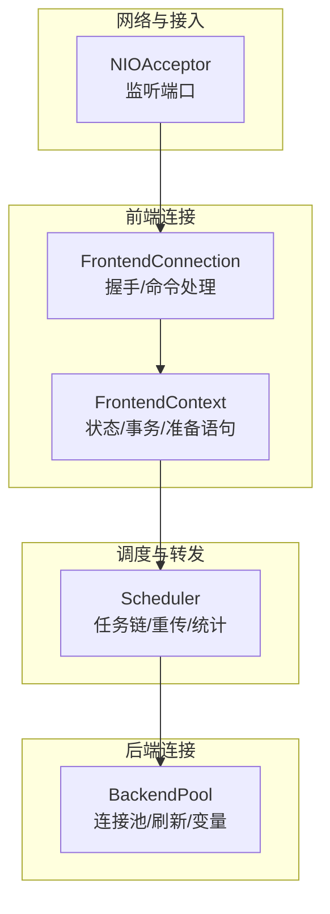
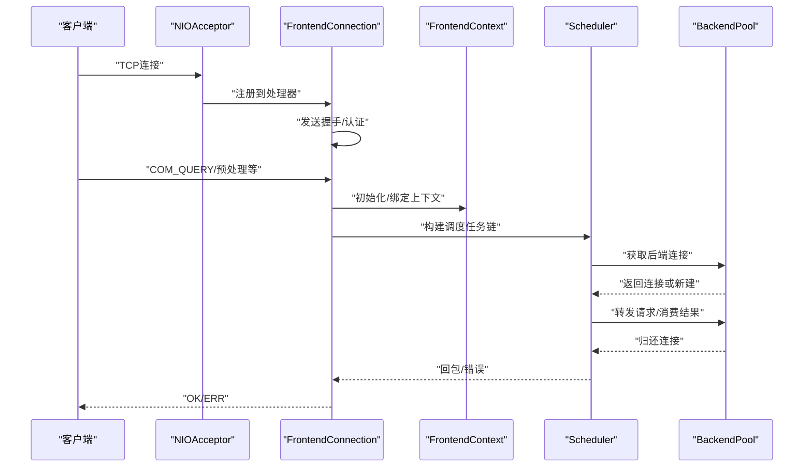
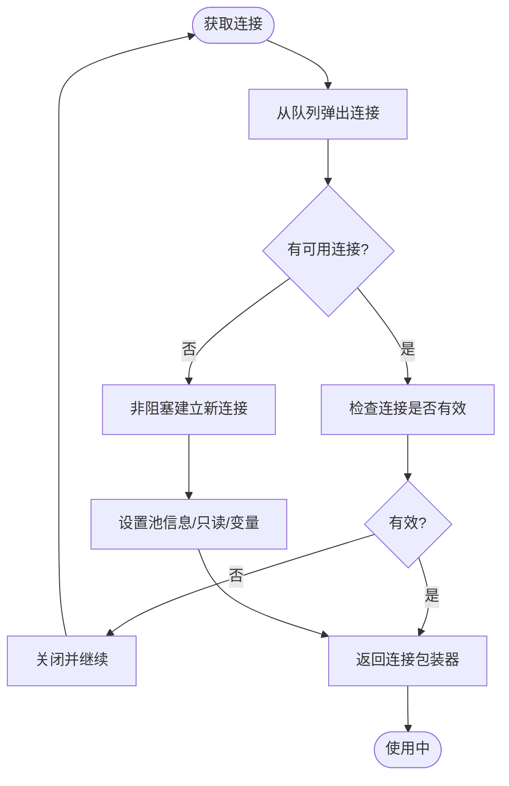
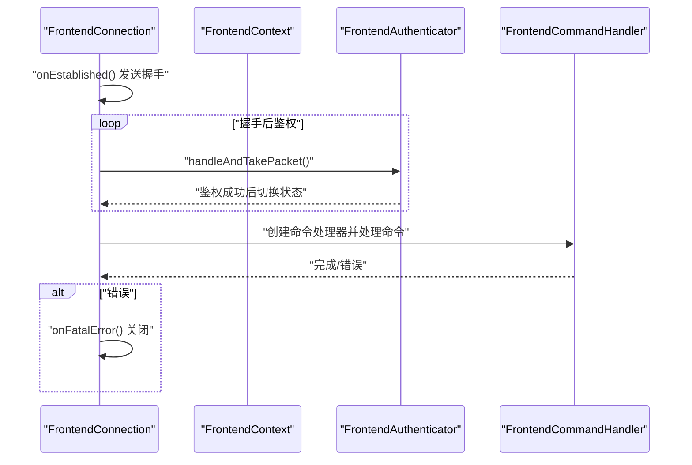
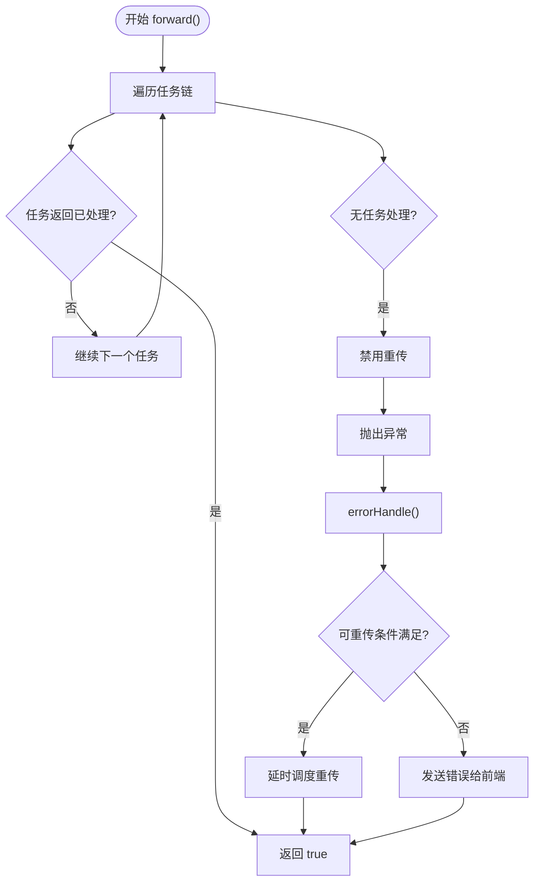
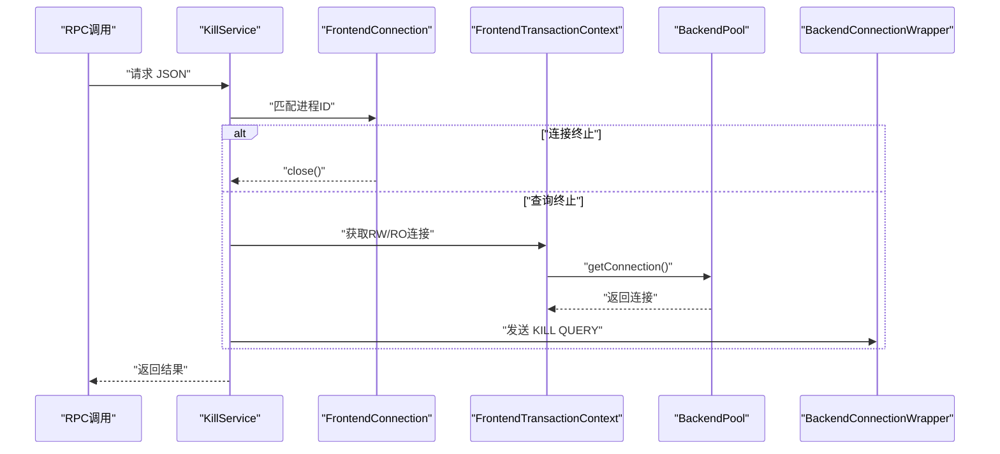
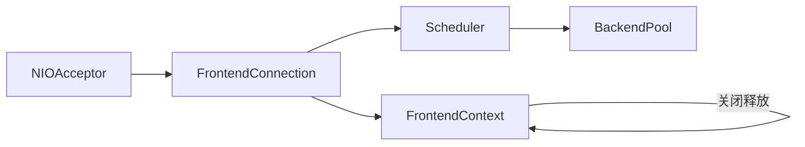
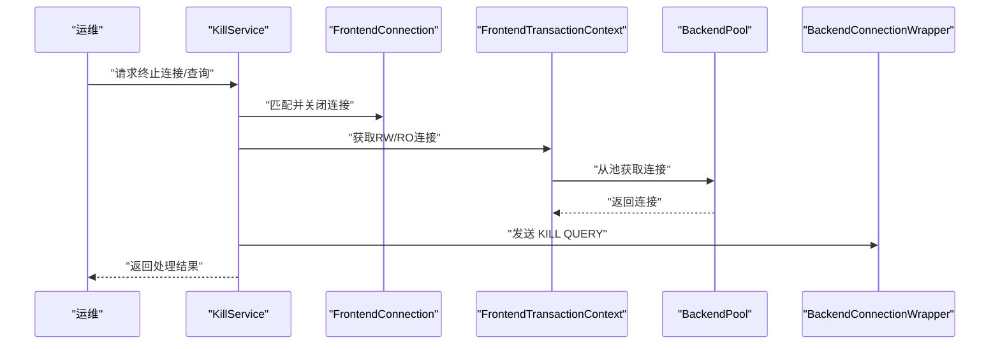

# 故障排除

<cite>
**本文引用的文件**
- [proxy-core/src/main/java/com/alibaba/polardbx/proxy/connection/pool/BackendPool.java](file://proxy-core/src/main/java/com/alibaba/polardbx/proxy/connection/pool/BackendPool.java)
- [proxy-core/src/main/java/com/alibaba/polardbx/proxy/connection/FrontendConnection.java](file://proxy-core/src/main/java/com/alibaba/polardbx/proxy/connection/FrontendConnection.java)
- [proxy-core/src/main/java/com/alibaba/polardbx/proxy/scheduler/Scheduler.java](file://proxy-core/src/main/java/com/alibaba/polardbx/proxy/scheduler/Scheduler.java)
- [proxy-core/src/main/java/com/alibaba/polardbx/proxy/protocol/common/MysqlError.java](file://proxy-core/src/main/java/com/alibaba/polardbx/proxy/protocol/common/MysqlError.java)
- [proxy-core/src/main/java/com/alibaba/polardbx/proxy/sync/KillService.java](file://proxy-core/src/main/java/com/alibaba/polardbx/proxy/sync/KillService.java)
- [proxy-core/src/main/java/com/alibaba/polardbx/proxy/context/FrontendContext.java](file://proxy-core/src/main/java/com/alibaba/polardbx/proxy/context/FrontendContext.java)
- [proxy-common/src/main/java/com/alibaba/polardbx/proxy/logger/ExtraLog.java](file://proxy-common/src/main/java/com/alibaba/polardbx/proxy/logger/ExtraLog.java)
- [proxy-common/src/main/java/com/alibaba/polardbx/proxy/utils/LeakChecker.java](file://proxy-common/src/main/java/com/alibaba/polardbx/proxy/utils/LeakChecker.java)
- [proxy-common/src/main/resources/config.properties](file://proxy-common/src/main/resources/config.properties)
- [proxy-net/src/main/java/com/alibaba/polardbx/proxy/net/NIOAcceptor.java](file://proxy-net/src/main/java/com/alibaba/polardbx/proxy/net/NIOAcceptor.java)
- [proxy-net/src/main/java/com/alibaba/polardbx/proxy/perf/ReactorPerfCollection.java](file://proxy-net/src/main/java/com/alibaba/polardbx/proxy/perf/ReactorPerfCollection.java)
</cite>

## 目录
1. [简介](#简介)
2. [项目结构](#项目结构)
3. [核心组件](#核心组件)
4. [架构总览](#架构总览)
5. [详细组件分析](#详细组件分析)
6. [依赖关系分析](#依赖关系分析)
7. [性能考量](#性能考量)
8. [故障排除指南](#故障排除指南)
9. [结论](#结论)
10. [附录](#附录)

## 简介
本指南面向PolarDB-X Proxy运维与开发人员，聚焦于连接失败、查询超时、性能下降等常见问题的诊断与解决。内容覆盖连接池与连接管理、调度与重传机制、错误码与日志、配置项校验、监控指标与紧急处置流程，并提供可操作的排查步骤与最佳实践。

## 项目结构
- 核心网络与协议层：net、protocol、scheduler
- 连接与上下文：connection、context
- 动态配置与日志：dynamic、logger、config
- 同步与服务：sync、rpc
- 示例与打包：server、rpm

**图示来源**
- [proxy-net/src/main/java/com/alibaba/polardbx/proxy/net/NIOAcceptor.java](file://proxy-net/src/main/java/com/alibaba/polardbx/proxy/net/NIOAcceptor.java#L35-L148)
- [proxy-core/src/main/java/com/alibaba/polardbx/proxy/connection/FrontendConnection.java](file://proxy-core/src/main/java/com/alibaba/polardbx/proxy/connection/FrontendConnection.java#L47-L224)
- [proxy-core/src/main/java/com/alibaba/polardbx/proxy/context/FrontendContext.java](file://proxy-core/src/main/java/com/alibaba/polardbx/proxy/context/FrontendContext.java#L45-L308)
- [proxy-core/src/main/java/com/alibaba/polardbx/proxy/scheduler/Scheduler.java](file://proxy-core/src/main/java/com/alibaba/polardbx/proxy/scheduler/Scheduler.java#L46-L315)
- [proxy-core/src/main/java/com/alibaba/polardbx/proxy/connection/pool/BackendPool.java](file://proxy-core/src/main/java/com/alibaba/polardbx/proxy/connection/pool/BackendPool.java#L46-L284)

**章节来源**
- [proxy-net/src/main/java/com/alibaba/polardbx/proxy/net/NIOAcceptor.java](file://proxy-net/src/main/java/com/alibaba/polardbx/proxy/net/NIOAcceptor.java#L35-L148)
- [proxy-common/src/main/resources/config.properties](file://proxy-common/src/main/resources/config.properties#L18-L29)

## 核心组件
- 前端连接与上下文：负责握手、认证、命令分发与错误回包；维护事务与准备语句上下文。
- 调度器：按任务链执行请求，支持重传、延迟统计与错误处理。
- 后端连接池：非阻塞获取/释放连接，空闲连接刷新与全局变量缓存。
- 监控与性能计数：事件循环、读写次数、注册/连接计数等。

**章节来源**
- [proxy-core/src/main/java/com/alibaba/polardbx/proxy/connection/FrontendConnection.java](file://proxy-core/src/main/java/com/alibaba/polardbx/proxy/connection/FrontendConnection.java#L47-L224)
- [proxy-core/src/main/java/com/alibaba/polardbx/proxy/context/FrontendContext.java](file://proxy-core/src/main/java/com/alibaba/polardbx/proxy/context/FrontendContext.java#L45-L308)
- [proxy-core/src/main/java/com/alibaba/polardbx/proxy/scheduler/Scheduler.java](file://proxy-core/src/main/java/com/alibaba/polardbx/proxy/scheduler/Scheduler.java#L46-L315)
- [proxy-core/src/main/java/com/alibaba/polardbx/proxy/connection/pool/BackendPool.java](file://proxy-core/src/main/java/com/alibaba/polardbx/proxy/connection/pool/BackendPool.java#L46-L284)
- [proxy-net/src/main/java/com/alibaba/polardbx/proxy/perf/ReactorPerfCollection.java](file://proxy-net/src/main/java/com/alibaba/polardbx/proxy/perf/ReactorPerfCollection.java#L26-L34)

## 架构总览

**图示来源**
- [proxy-net/src/main/java/com/alibaba/polardbx/proxy/net/NIOAcceptor.java](file://proxy-net/src/main/java/com/alibaba/polardbx/proxy/net/NIOAcceptor.java#L61-L81)
- [proxy-core/src/main/java/com/alibaba/polardbx/proxy/connection/FrontendConnection.java](file://proxy-core/src/main/java/com/alibaba/polardbx/proxy/connection/FrontendConnection.java#L88-L160)
- [proxy-core/src/main/java/com/alibaba/polardbx/proxy/context/FrontendContext.java](file://proxy-core/src/main/java/com/alibaba/polardbx/proxy/context/FrontendContext.java#L148-L162)
- [proxy-core/src/main/java/com/alibaba/polardbx/proxy/scheduler/Scheduler.java](file://proxy-core/src/main/java/com/alibaba/polardbx/proxy/scheduler/Scheduler.java#L300-L313)
- [proxy-core/src/main/java/com/alibaba/polardbx/proxy/connection/pool/BackendPool.java](file://proxy-core/src/main/java/com/alibaba/polardbx/proxy/connection/pool/BackendPool.java#L115-L132)

## 详细组件分析

### 组件A：连接池与后端连接（BackendPool）
- 连接池容量与回收：通过原子计数控制最大池大小，空闲连接复用或关闭。
- 获取/释放流程：非阻塞获取，坏连接剔除；释放时恢复读监控，若不可用或有未完成请求则关闭。
- 空闲刷新：按比例扫描空闲连接，异步执行健康查询以维持连接有效性。
- 全局变量缓存：周期性拉取后端全局变量，用于优化执行路径。

**图示来源**
- [proxy-core/src/main/java/com/alibaba/polardbx/proxy/connection/pool/BackendPool.java](file://proxy-core/src/main/java/com/alibaba/polardbx/proxy/connection/pool/BackendPool.java#L115-L132)

**章节来源**
- [proxy-core/src/main/java/com/alibaba/polardbx/proxy/connection/pool/BackendPool.java](file://proxy-core/src/main/java/com/alibaba/polardbx/proxy/connection/pool/BackendPool.java#L46-L284)

### 组件B：前端连接与上下文（FrontendConnection/FrontendContext）
- 握手与认证：发送握手包，进入鉴权状态；鉴权完成后切换命令处理。
- 错误处理：致命错误触发连接关闭；关闭时异步释放鉴权器、命令处理器与上下文。
- 上下文管理：事务引用计数、查询上下文生命周期管理；OK/ERR快速路径编码。

**图示来源**
- [proxy-core/src/main/java/com/alibaba/polardbx/proxy/connection/FrontendConnection.java](file://proxy-core/src/main/java/com/alibaba/polardbx/proxy/connection/FrontendConnection.java#L88-L160)
- [proxy-core/src/main/java/com/alibaba/polardbx/proxy/context/FrontendContext.java](file://proxy-core/src/main/java/com/alibaba/polardbx/proxy/context/FrontendContext.java#L148-L162)

**章节来源**
- [proxy-core/src/main/java/com/alibaba/polardbx/proxy/connection/FrontendConnection.java](file://proxy-core/src/main/java/com/alibaba/polardbx/proxy/connection/FrontendConnection.java#L47-L224)
- [proxy-core/src/main/java/com/alibaba/polardbx/proxy/context/FrontendContext.java](file://proxy-core/src/main/java/com/alibaba/polardbx/proxy/context/FrontendContext.java#L45-L308)

### 组件C：调度与重传（Scheduler）
- 任务链：按顺序执行各阶段任务，任一任务返回“已处理”即结束。
- 错误处理：记录错误，必要时进行重传；在非事务、认证态且未超时条件下尝试重发。
- 统计与延迟：累计重传、LSN等待、准备、调度、等待主节点等耗时，便于定位瓶颈。

**图示来源**
- [proxy-core/src/main/java/com/alibaba/polardbx/proxy/scheduler/Scheduler.java](file://proxy-core/src/main/java/com/alibaba/polardbx/proxy/scheduler/Scheduler.java#L300-L313)
- [proxy-core/src/main/java/com/alibaba/polardbx/proxy/scheduler/Scheduler.java](file://proxy-core/src/main/java/com/alibaba/polardbx/proxy/scheduler/Scheduler.java#L234-L297)

**章节来源**
- [proxy-core/src/main/java/com/alibaba/polardbx/proxy/scheduler/Scheduler.java](file://proxy-core/src/main/java/com/alibaba/polardbx/proxy/scheduler/Scheduler.java#L46-L315)

### 组件D：查询终止与连接关闭（KillService）
- 连接级终止：直接关闭前端连接。
- 查询级终止：在事务上下文中查找读/写连接，向后端发送KILL QUERY指令终止阻塞查询。

**图示来源**
- [proxy-core/src/main/java/com/alibaba/polardbx/proxy/sync/KillService.java](file://proxy-core/src/main/java/com/alibaba/polardbx/proxy/sync/KillService.java#L53-L102)

**章节来源**
- [proxy-core/src/main/java/com/alibaba/polardbx/proxy/sync/KillService.java](file://proxy-core/src/main/java/com/alibaba/polardbx/proxy/sync/KillService.java#L37-L104)

## 依赖关系分析
- FrontendConnection 依赖 FrontendContext 提供状态与上下文能力。
- Scheduler 在转发前从 BackendPool 获取连接，完成后归还。
- FrontendContext 在关闭时释放内部持有的事务与查询上下文，避免泄漏。
- NIOAcceptor 负责接受连接并注册到处理器，是入口层。

**图示来源**
- [proxy-net/src/main/java/com/alibaba/polardbx/proxy/net/NIOAcceptor.java](file://proxy-net/src/main/java/com/alibaba/polardbx/proxy/net/NIOAcceptor.java#L61-L81)
- [proxy-core/src/main/java/com/alibaba/polardbx/proxy/connection/FrontendConnection.java](file://proxy-core/src/main/java/com/alibaba/polardbx/proxy/connection/FrontendConnection.java#L88-L160)
- [proxy-core/src/main/java/com/alibaba/polardbx/proxy/context/FrontendContext.java](file://proxy-core/src/main/java/com/alibaba/polardbx/proxy/context/FrontendContext.java#L254-L306)
- [proxy-core/src/main/java/com/alibaba/polardbx/proxy/scheduler/Scheduler.java](file://proxy-core/src/main/java/com/alibaba/polardbx/proxy/scheduler/Scheduler.java#L300-L313)
- [proxy-core/src/main/java/com/alibaba/polardbx/proxy/connection/pool/BackendPool.java](file://proxy-core/src/main/java/com/alibaba/polardbx/proxy/connection/pool/BackendPool.java#L115-L132)

**章节来源**
- [proxy-net/src/main/java/com/alibaba/polardbx/proxy/net/NIOAcceptor.java](file://proxy-net/src/main/java/com/alibaba/polardbx/proxy/net/NIOAcceptor.java#L35-L148)
- [proxy-core/src/main/java/com/alibaba/polardbx/proxy/context/FrontendContext.java](file://proxy-core/src/main/java/com/alibaba/polardbx/proxy/context/FrontendContext.java#L254-L306)

## 性能考量
- 事件循环与网络事件：通过 ReactorPerfCollection 记录socket/事件循环/注册/读写/连接计数，可用于评估背压与事件风暴。
- 连接池与全局变量刷新：合理设置刷新阈值与周期，避免频繁重建连接导致抖动。
- 调度统计：关注重传延迟、LSN等待、准备与调度耗时，定位转发瓶颈。

**章节来源**
- [proxy-net/src/main/java/com/alibaba/polardbx/proxy/perf/ReactorPerfCollection.java](file://proxy-net/src/main/java/com/alibaba/polardbx/proxy/perf/ReactorPerfCollection.java#L26-L34)
- [proxy-core/src/main/java/com/alibaba/polardbx/proxy/connection/pool/BackendPool.java](file://proxy-core/src/main/java/com/alibaba/polardbx/proxy/connection/pool/BackendPool.java#L167-L250)
- [proxy-core/src/main/java/com/alibaba/polardbx/proxy/scheduler/Scheduler.java](file://proxy-core/src/main/java/com/alibaba/polardbx/proxy/scheduler/Scheduler.java#L161-L183)

## 故障排除指南

### 一、连接失败
- 症状
  - 客户端无法建立TCP连接或握手阶段失败。
  - 前端连接在握手后立即关闭。
- 排查步骤
  - 检查监听端口与绑定地址：确认配置中的前端端口与防火墙策略。
  - 观察接入线程日志：NIOAcceptor在accept异常时会记录错误并关闭通道。
  - 验证握手与认证流程：确认FrontendConnection在握手与鉴权阶段的异常路径。
- 解决方案
  - 修正监听端口与网络策略。
  - 修复后端数据库连通性与认证凭据。
  - 如为探测扫描导致的握手失败，可在日志中观察并忽略。

**章节来源**
- [proxy-net/src/main/java/com/alibaba/polardbx/proxy/net/NIOAcceptor.java](file://proxy-net/src/main/java/com/alibaba/polardbx/proxy/net/NIOAcceptor.java#L61-L81)
- [proxy-core/src/main/java/com/alibaba/polardbx/proxy/connection/FrontendConnection.java](file://proxy-core/src/main/java/com/alibaba/polardbx/proxy/connection/FrontendConnection.java#L88-L111)

### 二、连接池耗尽/连接泄漏
- 症状
  - 获取连接阻塞或超时，池中空闲连接为0。
  - 连接长时间占用，释放异常。
- 排查步骤
  - 检查池容量与当前运行连接数：BackendPool提供实时计数接口。
  - 检查连接释放逻辑：确保使用后正确归还，坏连接会被关闭。
  - 使用泄漏检测工具：LeakChecker在资源未关闭时触发回调或强制退出。
- 解决方案
  - 提升maxPooled上限或缩短连接生命周期。
  - 修复业务侧未释放连接的逻辑。
  - 开启泄漏检测并修复回调中的资源泄漏。

**章节来源**
- [proxy-core/src/main/java/com/alibaba/polardbx/proxy/connection/pool/BackendPool.java](file://proxy-core/src/main/java/com/alibaba/polardbx/proxy/connection/pool/BackendPool.java#L107-L165)
- [proxy-common/src/main/java/com/alibaba/polardbx/proxy/utils/LeakChecker.java](file://proxy-common/src/main/java/com/alibaba/polardbx/proxy/utils/LeakChecker.java#L30-L112)

### 三、查询超时/重传
- 症状
  - 请求长时间无响应，最终报错或被重传。
  - 重传后仍失败。
- 排查步骤
  - 查看Scheduler统计：重传延迟、等待LSN、等待主节点、准备与调度耗时。
  - 检查后端连接可用性：BackendPool对空闲连接进行健康刷新。
  - 核对事务状态：仅在非事务、认证态且未超限时才允许重传。
- 解决方案
  - 调整超时阈值与重传策略。
  - 优化后端负载与网络质量。
  - 对长事务拆分或降级为只读查询。

**章节来源**
- [proxy-core/src/main/java/com/alibaba/polardbx/proxy/scheduler/Scheduler.java](file://proxy-core/src/main/java/com/alibaba/polardbx/proxy/scheduler/Scheduler.java#L234-L297)
- [proxy-core/src/main/java/com/alibaba/polardbx/proxy/connection/pool/BackendPool.java](file://proxy-core/src/main/java/com/alibaba/polardbx/proxy/connection/pool/BackendPool.java#L167-L208)

### 四、性能下降/慢查询
- 症状
  - 响应时间显著上升，CPU/网络事件增多。
- 排查步骤
  - 采集事件循环计数：socket/事件循环/注册/读写/连接计数。
  - 分析后端全局变量与连接刷新频率，避免过度刷新。
  - 结合SQL日志：使用额外日志通道记录SQL执行轨迹。
- 解决方案
  - 调整worker_threads与reactor_factor，平衡并发与CPU亲和。
  - 优化查询计划与索引，减少后端压力。
  - 降低全局变量刷新频率或调整阈值。

**章节来源**
- [proxy-net/src/main/java/com/alibaba/polardbx/proxy/perf/ReactorPerfCollection.java](file://proxy-net/src/main/java/com/alibaba/polardbx/proxy/perf/ReactorPerfCollection.java#L26-L34)
- [proxy-core/src/main/java/com/alibaba/polardbx/proxy/connection/pool/BackendPool.java](file://proxy-core/src/main/java/com/alibaba/polardbx/proxy/connection/pool/BackendPool.java#L210-L250)
- [proxy-common/src/main/java/com/alibaba/polardbx/proxy/logger/ExtraLog.java](file://proxy-common/src/main/java/com/alibaba/polardbx/proxy/logger/ExtraLog.java#L24-L26)

### 五、配置问题
- 症状
  - 参数设置无效、行为异常或启动失败。
- 排查步骤
  - 检查全局配置文件：确认前端端口、后端地址、用户名与密码等。
  - 核对动态配置加载：如后端连接超时、全局变量刷新间隔等。
- 解决方案
  - 修正配置项并重启生效。
  - 对于运行期动态项，结合动态配置模块进行热更新。

**章节来源**
- [proxy-common/src/main/resources/config.properties](file://proxy-common/src/main/resources/config.properties#L18-L29)
- [proxy-core/src/main/java/com/alibaba/polardbx/proxy/connection/pool/BackendPool.java](file://proxy-core/src/main/java/com/alibaba/polardbx/proxy/connection/pool/BackendPool.java#L213-L220)

### 六、日志分析技巧
- 错误日志
  - 使用MysqlError常量映射标准错误码，便于统一处理与告警。
  - 前端上下文在发送错误时携带SQL状态码与消息，便于定位。
- 性能日志
  - 使用额外日志通道记录SQL执行轨迹，辅助慢查询定位。
- 调试信息
  - 启用泄漏检测，对未关闭资源进行回调或强制退出，快速暴露问题。

**章节来源**
- [proxy-core/src/main/java/com/alibaba/polardbx/proxy/protocol/common/MysqlError.java](file://proxy-core/src/main/java/com/alibaba/polardbx/proxy/protocol/common/MysqlError.java#L21-L32)
- [proxy-core/src/main/java/com/alibaba/polardbx/proxy/context/FrontendContext.java](file://proxy-core/src/main/java/com/alibaba/polardbx/proxy/context/FrontendContext.java#L58-L75)
- [proxy-common/src/main/java/com/alibaba/polardbx/proxy/logger/ExtraLog.java](file://proxy-common/src/main/java/com/alibaba/polardbx/proxy/logger/ExtraLog.java#L24-L26)
- [proxy-common/src/main/java/com/alibaba/polardbx/proxy/utils/LeakChecker.java](file://proxy-common/src/main/java/com/alibaba/polardbx/proxy/utils/LeakChecker.java#L30-L112)

### 七、系统监控指标异常识别
- 异常特征
  - 事件循环计数持续增长，读写事件异常放大。
  - 连接注册/连接计数异常波动。
- 处理建议
  - 逐步降载，定位热点连接或查询。
  - 调整线程与反应堆因子，缓解事件风暴。

**章节来源**
- [proxy-net/src/main/java/com/alibaba/polardbx/proxy/perf/ReactorPerfCollection.java](file://proxy-net/src/main/java/com/alibaba/polardbx/proxy/perf/ReactorPerfCollection.java#L26-L34)

### 八、紧急故障应急处理
- 连接级终止
  - 通过RPC调用KillService，直接关闭前端连接，快速止损。
- 查询级终止
  - 在事务上下文中定位RW/RO连接，向后端发送KILL QUERY终止阻塞查询。
- 重传保护
  - Scheduler在错误发生时根据条件进行重传，避免重复提交造成二次影响。

**图示来源**
- [proxy-core/src/main/java/com/alibaba/polardbx/proxy/sync/KillService.java](file://proxy-core/src/main/java/com/alibaba/polardbx/proxy/sync/KillService.java#L53-L102)

**章节来源**
- [proxy-core/src/main/java/com/alibaba/polardbx/proxy/sync/KillService.java](file://proxy-core/src/main/java/com/alibaba/polardbx/proxy/sync/KillService.java#L37-L104)
- [proxy-core/src/main/java/com/alibaba/polardbx/proxy/scheduler/Scheduler.java](file://proxy-core/src/main/java/com/alibaba/polardbx/proxy/scheduler/Scheduler.java#L234-L297)

### 九、常见错误码与解决方案
- 访问被拒绝
  - 场景：认证失败或权限不足。
  - 处理：核对用户名/密码与权限配置。
- 重复键
  - 场景：唯一约束冲突。
  - 处理：修正插入数据或调整索引设计。
- 未知语句处理器
  - 场景：预处理相关异常。
  - 处理：清理预处理句柄或重建连接。
- 查询中断
  - 场景：被KILL QUERY或超时中断。
  - 处理：检查阻塞查询并终止，或延长超时。
- 内部错误
  - 场景：代理内部异常。
  - 处理：查看日志并修复业务逻辑或配置。

**章节来源**
- [proxy-core/src/main/java/com/alibaba/polardbx/proxy/protocol/common/MysqlError.java](file://proxy-core/src/main/java/com/alibaba/polardbx/proxy/protocol/common/MysqlError.java#L21-L32)
- [proxy-core/src/main/java/com/alibaba/polardbx/proxy/context/FrontendContext.java](file://proxy-core/src/main/java/com/alibaba/polardbx/proxy/context/FrontendContext.java#L58-L75)

## 结论
通过结合连接池与连接管理、调度与重传机制、错误码与日志、配置校验与监控指标，可以系统化地定位与解决PolarDB-X Proxy的连接失败、查询超时与性能下降问题。在紧急情况下，优先采用连接/查询终止与重传保护策略，配合配置与日志分析，实现快速恢复与根因修复。

## 附录
- 快速检查清单
  - 网络与端口：监听端口、防火墙、TCP_NODELAY。
  - 连接池：容量、空闲连接、刷新策略。
  - 调度：重传阈值、事务状态、统计耗时。
  - 日志：错误码、SQL日志、泄漏检测。
  - 监控：事件循环计数、读写事件、连接计数。