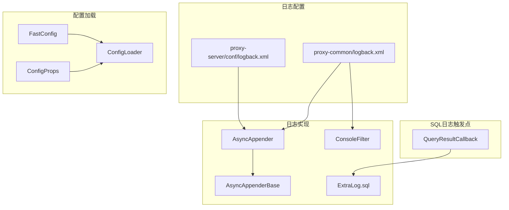
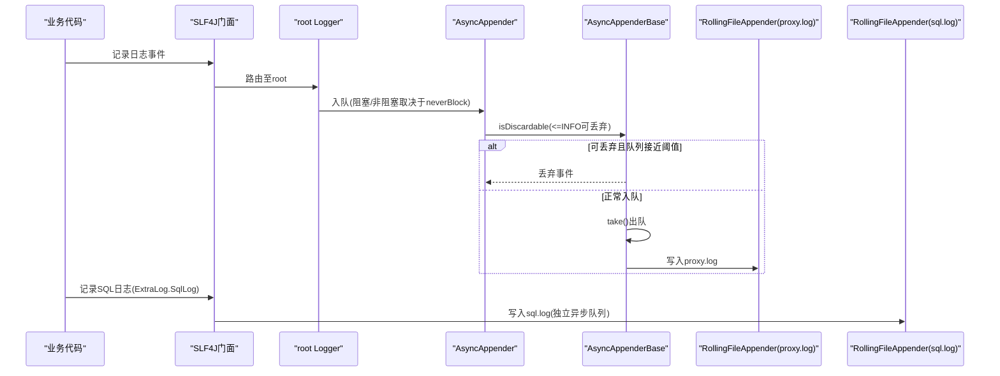
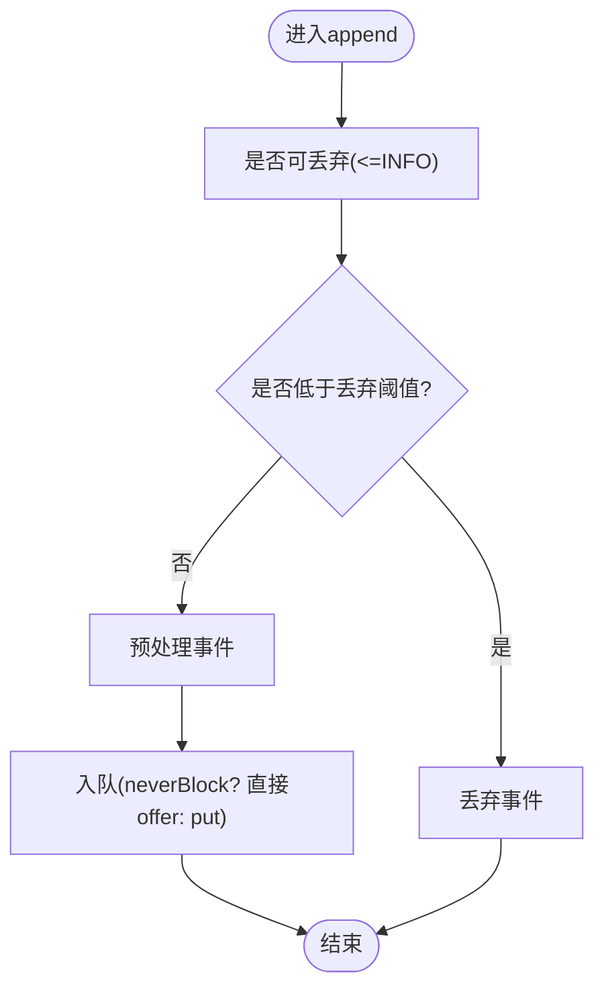
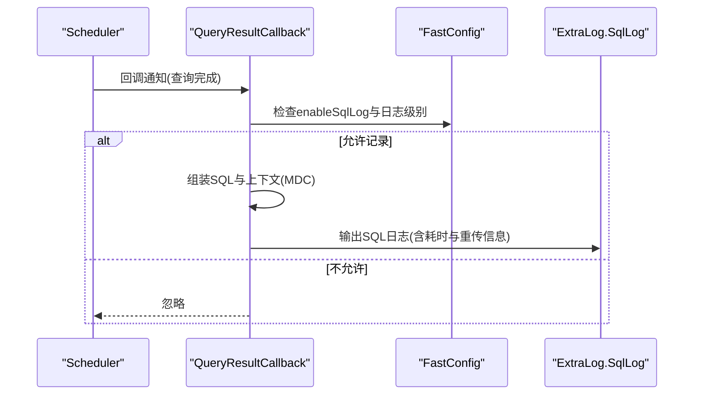
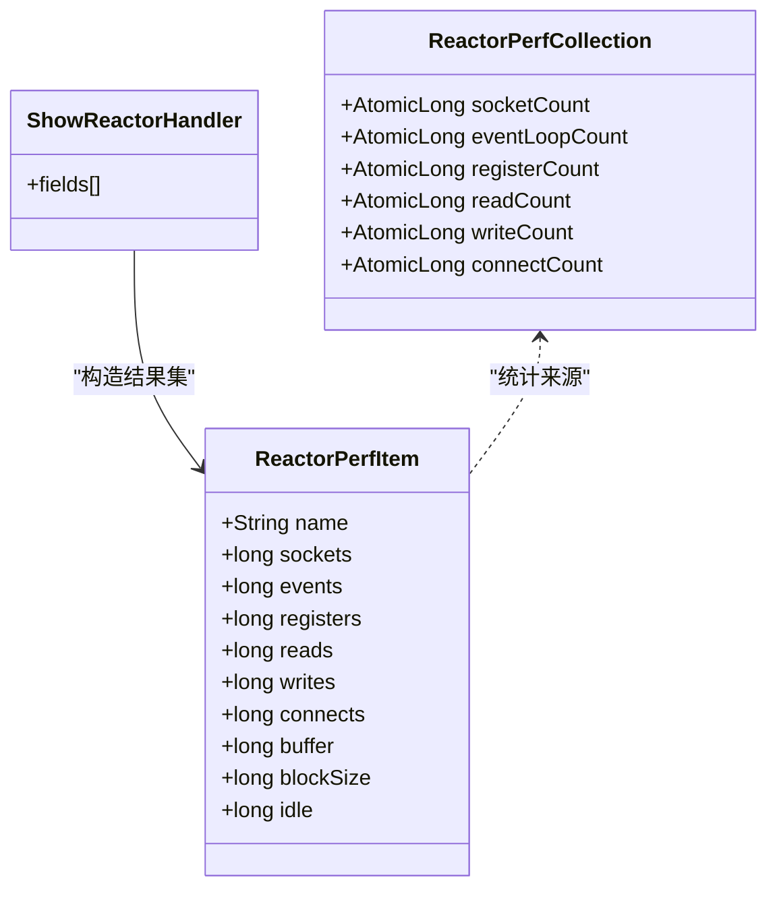
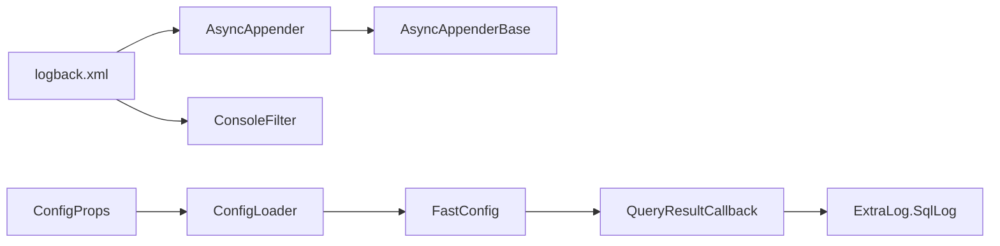

# 日志分析与诊断

<cite>
**本文引用的文件**
- [proxy-common/src/main/resources/logback.xml](file://proxy-common/src/main/resources/logback.xml)
- [proxy-server/src/main/conf/logback.xml](file://proxy-server/src/main/conf/logback.xml)
- [proxy-common/src/main/java/com/alibaba/polardbx/proxy/logger/AsyncAppender.java](file://proxy-common/src/main/java/com/alibaba/polardbx/proxy/logger/AsyncAppender.java)
- [proxy-common/src/main/java/com/alibaba/polardbx/proxy/logger/AsyncAppenderBase.java](file://proxy-common/src/main/java/com/alibaba/polardbx/proxy/logger/AsyncAppenderBase.java)
- [proxy-common/src/main/java/com/alibaba/polardbx/proxy/logger/ConsoleFilter.java](file://proxy-common/src/main/java/com/alibaba/polardbx/proxy/logger/ConsoleFilter.java)
- [proxy-common/src/main/java/com/alibaba/polardbx/proxy/logger/ExtraLog.java](file://proxy-common/src/main/java/com/alibaba/polardbx/proxy/logger/ExtraLog.java)
- [proxy-core/src/main/java/com/alibaba/polardbx/proxy/callback/QueryResultCallback.java](file://proxy-core/src/main/java/com/alibaba/polardbx/proxy/callback/QueryResultCallback.java)
- [proxy-common/src/main/java/com/alibaba/polardbx/proxy/config/FastConfig.java](file://proxy-common/src/main/java/com/alibaba/polardbx/proxy/config/FastConfig.java)
- [proxy-common/src/main/java/com/alibaba/polardbx/proxy/config/ConfigProps.java](file://proxy-common/src/main/java/com/alibaba/polardbx/proxy/config/ConfigProps.java)
- [proxy-common/src/main/java/com/alibaba/polardbx/proxy/config/ConfigLoader.java](file://proxy-common/src/main/java/com/alibaba/polardbx/proxy/config/ConfigLoader.java)
- [proxy-common/src/main/resources/config.properties](file://proxy-common/src/main/resources/config.properties)
- [proxy-server/src/main/conf/config.properties](file://proxy-server/src/main/conf/config.properties)
- [proxy-net/src/main/java/com/alibaba/polardbx/proxy/perf/ReactorPerfCollection.java](file://proxy-net/src/main/java/com/alibaba/polardbx/proxy/perf/ReactorPerfCollection.java)
- [proxy-net/src/main/java/com/alibaba/polardbx/proxy/perf/ReactorPerfItem.java](file://proxy-net/src/main/java/com/alibaba/polardbx/proxy/perf/ReactorPerfItem.java)
- [proxy-core/src/main/java/com/alibaba/polardbx/proxy/protocol/handler/request/ShowReactorHandler.java](file://proxy-core/src/main/java/com/alibaba/polardbx/proxy/protocol/handler/request/ShowReactorHandler.java)
- [proxy-core/src/main/java/com/alibaba/polardbx/proxy/utils/Kill.java](file://proxy-core/src/main/java/com/alibaba/polardbx/proxy/utils/Kill.java)
</cite>

## 目录
1. [简介](#简介)
2. [项目结构](#项目结构)
3. [核心组件](#核心组件)
4. [架构总览](#架构总览)
5. [详细组件分析](#详细组件分析)
6. [依赖关系分析](#依赖关系分析)
7. [性能考量](#性能考量)
8. [故障排查指南](#故障排查指南)
9. [结论](#结论)
10. [附录](#附录)

## 简介
本指南面向PolarDB-X Proxy的运维与开发人员，聚焦于日志系统的配置、级别选择、错误与性能日志的解读、SQL日志的采集与分析、日志轮转与存储策略、大规模日志处理最佳实践，以及如何基于日志进行问题复现与回归测试。文档中的所有技术细节均来自仓库内的实际实现与配置文件。

## 项目结构
日志系统由两部分组成：
- 根级日志：统一输出到proxy.log，并通过异步Appender提升吞吐。
- SQL专用日志：独立输出到sql.log，便于SQL审计与性能分析。

此外，控制台输出受ConsoleFilter限制，仅在本地IDE环境下允许输出到控制台，线上环境默认屏蔽控制台输出，避免干扰生产日志收集。

**图表来源**
- [proxy-common/src/main/resources/logback.xml](file://proxy-common/src/main/resources/logback.xml#L19-L100)
- [proxy-server/src/main/conf/logback.xml](file://proxy-server/src/main/conf/logback.xml#L19-L98)
- [proxy-common/src/main/java/com/alibaba/polardbx/proxy/logger/AsyncAppender.java](file://proxy-common/src/main/java/com/alibaba/polardbx/proxy/logger/AsyncAppender.java#L24-L52)
- [proxy-common/src/main/java/com/alibaba/polardbx/proxy/logger/AsyncAppenderBase.java](file://proxy-common/src/main/java/com/alibaba/polardbx/proxy/logger/AsyncAppenderBase.java#L32-L346)
- [proxy-common/src/main/java/com/alibaba/polardbx/proxy/logger/ConsoleFilter.java](file://proxy-common/src/main/java/com/alibaba/polardbx/proxy/logger/ConsoleFilter.java#L25-L43)
- [proxy-common/src/main/java/com/alibaba/polardbx/proxy/logger/ExtraLog.java](file://proxy-common/src/main/java/com/alibaba/polardbx/proxy/logger/ExtraLog.java#L24-L26)
- [proxy-core/src/main/java/com/alibaba/polardbx/proxy/callback/QueryResultCallback.java](file://proxy-core/src/main/java/com/alibaba/polardbx/proxy/callback/QueryResultCallback.java#L246-L289)
- [proxy-common/src/main/java/com/alibaba/polardbx/proxy/config/FastConfig.java](file://proxy-common/src/main/java/com/alibaba/polardbx/proxy/config/FastConfig.java#L45-L73)
- [proxy-common/src/main/java/com/alibaba/polardbx/proxy/config/ConfigProps.java](file://proxy-common/src/main/java/com/alibaba/polardbx/proxy/config/ConfigProps.java#L185-L207)
- [proxy-common/src/main/java/com/alibaba/polardbx/proxy/config/ConfigLoader.java](file://proxy-common/src/main/java/com/alibaba/polardbx/proxy/config/ConfigLoader.java#L39-L71)

**章节来源**
- [proxy-common/src/main/resources/logback.xml](file://proxy-common/src/main/resources/logback.xml#L19-L100)
- [proxy-server/src/main/conf/logback.xml](file://proxy-server/src/main/conf/logback.xml#L19-L98)

## 核心组件
- 异步日志Appender（AsyncAppender/AsyncAppenderBase）
  - 采用有界阻塞队列，支持丢弃阈值与永不阻塞策略，降低高并发下的线程阻塞风险。
  - 对DEBUG/INFO级别事件标记为可丢弃，以减少高负载时的写放大。
- 控制台过滤器（ConsoleFilter）
  - 仅在未设置实例ID（本地IDE）时允许控制台输出，线上默认屏蔽，确保日志集中落盘或转发。
- SQL日志门面（ExtraLog.SqlLog）
  - 通过SLF4J门面输出到名为“sql”的Logger，独立配置与轮转策略。
- SQL日志触发点（QueryResultCallback）
  - 在查询完成后按条件记录SQL、参数、重传延迟、调度等待等关键指标，便于性能分析与根因定位。
- 配置体系（FastConfig/ConfigProps/ConfigLoader）
  - 动态刷新日志相关开关与长度限制，如SQL最大长度、是否启用SQL日志等。

**章节来源**
- [proxy-common/src/main/java/com/alibaba/polardbx/proxy/logger/AsyncAppender.java](file://proxy-common/src/main/java/com/alibaba/polardbx/proxy/logger/AsyncAppender.java#L24-L52)
- [proxy-common/src/main/java/com/alibaba/polardbx/proxy/logger/AsyncAppenderBase.java](file://proxy-common/src/main/java/com/alibaba/polardbx/proxy/logger/AsyncAppenderBase.java#L32-L346)
- [proxy-common/src/main/java/com/alibaba/polardbx/proxy/logger/ConsoleFilter.java](file://proxy-common/src/main/java/com/alibaba/polardbx/proxy/logger/ConsoleFilter.java#L25-L43)
- [proxy-common/src/main/java/com/alibaba/polardbx/proxy/logger/ExtraLog.java](file://proxy-common/src/main/java/com/alibaba/polardbx/proxy/logger/ExtraLog.java#L24-L26)
- [proxy-core/src/main/java/com/alibaba/polardbx/proxy/callback/QueryResultCallback.java](file://proxy-core/src/main/java/com/alibaba/polardbx/proxy/callback/QueryResultCallback.java#L246-L289)
- [proxy-common/src/main/java/com/alibaba/polardbx/proxy/config/FastConfig.java](file://proxy-common/src/main/java/com/alibaba/polardbx/proxy/config/FastConfig.java#L45-L73)
- [proxy-common/src/main/java/com/alibaba/polardbx/proxy/config/ConfigProps.java](file://proxy-common/src/main/java/com/alibaba/polardbx/proxy/config/ConfigProps.java#L185-L207)
- [proxy-common/src/main/java/com/alibaba/polardbx/proxy/config/ConfigLoader.java](file://proxy-common/src/main/java/com/alibaba/polardbx/proxy/config/ConfigLoader.java#L39-L71)

## 架构总览
下图展示了日志从应用到落盘的关键路径，以及异步与丢弃策略对性能的影响。

**图表来源**
- [proxy-common/src/main/resources/logback.xml](file://proxy-common/src/main/resources/logback.xml#L29-L93)
- [proxy-server/src/main/conf/logback.xml](file://proxy-server/src/main/conf/logback.xml#L29-L93)
- [proxy-common/src/main/java/com/alibaba/polardbx/proxy/logger/AsyncAppender.java](file://proxy-common/src/main/java/com/alibaba/polardbx/proxy/logger/AsyncAppender.java#L24-L52)
- [proxy-common/src/main/java/com/alibaba/polardbx/proxy/logger/AsyncAppenderBase.java](file://proxy-common/src/main/java/com/alibaba/polardbx/proxy/logger/AsyncAppenderBase.java#L150-L180)
- [proxy-common/src/main/java/com/alibaba/polardbx/proxy/logger/ExtraLog.java](file://proxy-common/src/main/java/com/alibaba/polardbx/proxy/logger/ExtraLog.java#L24-L26)

## 详细组件分析

### 日志级别选择与配置
- 根日志级别
  - 开发环境：root级别为DEBUG，便于细粒度追踪。
  - 生产环境：root级别为INFO，降低冗余日志对磁盘与网络的影响。
- SQL日志级别
  - 默认INFO，独立appender，避免与普通日志混杂。
- 特定Logger覆盖
  - 如gRPC、Serverless、集群节点监控等，统一降级为INFO，减少噪声。

性能影响要点
- DEBUG/INFO在高并发下易被标记为可丢弃，有助于缓解写放大。
- neverBlock开启时，队列满可能丢弃事件，需结合业务容忍度权衡。

**章节来源**
- [proxy-common/src/main/resources/logback.xml](file://proxy-common/src/main/resources/logback.xml#L90-L100)
- [proxy-server/src/main/conf/logback.xml](file://proxy-server/src/main/conf/logback.xml#L90-L97)

### 异步日志与丢弃策略
- 丢弃判定
  - AsyncAppender对TRACE/DEBUG/INFO级别事件视为可丢弃，优先保障ERROR/WARN的完整性。
- 队列与阻塞
  - 支持neverBlock模式，队列满时直接丢弃，避免阻塞主线程。
  - 提供discardingThreshold阈值，接近阈值时优先丢弃可丢弃事件。
- 停机与刷尾
  - 停止时最多等待maxFlushTime毫秒，尽力刷出剩余事件，超时则告警。

**图表来源**
- [proxy-common/src/main/java/com/alibaba/polardbx/proxy/logger/AsyncAppender.java](file://proxy-common/src/main/java/com/alibaba/polardbx/proxy/logger/AsyncAppender.java#L24-L52)
- [proxy-common/src/main/java/com/alibaba/polardbx/proxy/logger/AsyncAppenderBase.java](file://proxy-common/src/main/java/com/alibaba/polardbx/proxy/logger/AsyncAppenderBase.java#L150-L180)

**章节来源**
- [proxy-common/src/main/java/com/alibaba/polardbx/proxy/logger/AsyncAppender.java](file://proxy-common/src/main/java/com/alibaba/polardbx/proxy/logger/AsyncAppender.java#L24-L52)
- [proxy-common/src/main/java/com/alibaba/polardbx/proxy/logger/AsyncAppenderBase.java](file://proxy-common/src/main/java/com/alibaba/polardbx/proxy/logger/AsyncAppenderBase.java#L150-L180)

### 控制台输出与环境隔离
- ConsoleFilter根据系统属性判断是否允许控制台输出，线上默认DENY，IDE下ACCEPT。
- 结合logback配置中的STDOUT，确保生产环境日志集中落盘。

**章节来源**
- [proxy-common/src/main/java/com/alibaba/polardbx/proxy/logger/ConsoleFilter.java](file://proxy-common/src/main/java/com/alibaba/polardbx/proxy/logger/ConsoleFilter.java#L25-L43)
- [proxy-common/src/main/resources/logback.xml](file://proxy-common/src/main/resources/logback.xml#L19-L27)
- [proxy-server/src/main/conf/logback.xml](file://proxy-server/src/main/conf/logback.xml#L19-L27)

### SQL日志采集与字段解析
- 触发时机
  - 查询完成回调中按条件记录SQL日志，包含用户、远端地址、数据库、自动提交状态、从库标识等上下文。
- 关键指标
  - 执行状态、重试次数、总耗时（微秒）、重传延迟、LSN拉取耗时、调度耗时、等待主库耗时、traceId等。
- 字段格式
  - 使用MDC注入“CONNECTION”上下文，便于关联同一连接的多条日志。

**图表来源**
- [proxy-core/src/main/java/com/alibaba/polardbx/proxy/callback/QueryResultCallback.java](file://proxy-core/src/main/java/com/alibaba/polardbx/proxy/callback/QueryResultCallback.java#L246-L289)
- [proxy-common/src/main/java/com/alibaba/polardbx/proxy/logger/ExtraLog.java](file://proxy-common/src/main/java/com/alibaba/polardbx/proxy/logger/ExtraLog.java#L24-L26)
- [proxy-common/src/main/java/com/alibaba/polardbx/proxy/config/FastConfig.java](file://proxy-common/src/main/java/com/alibaba/polardbx/proxy/config/FastConfig.java#L71-L72)

**章节来源**
- [proxy-core/src/main/java/com/alibaba/polardbx/proxy/callback/QueryResultCallback.java](file://proxy-core/src/main/java/com/alibaba/polardbx/proxy/callback/QueryResultCallback.java#L246-L289)
- [proxy-common/src/main/java/com/alibaba/polardbx/proxy/logger/ExtraLog.java](file://proxy-common/src/main/java/com/alibaba/polardbx/proxy/logger/ExtraLog.java#L24-L26)
- [proxy-common/src/main/java/com/alibaba/polardbx/proxy/config/FastConfig.java](file://proxy-common/src/main/java/com/alibaba/polardbx/proxy/config/FastConfig.java#L61-L63)

### 日志轮转与存储策略
- 根日志proxy.log
  - 按天滚动，单文件最大512MB，保留30天，总量上限60GB。
- SQL日志sql.log
  - 按天滚动，单文件最大512MB，保留7天，总量上限100GB。
- 异步队列容量
  - 队列大小均为100000，兼顾吞吐与内存占用。
- 控制台输出
  - 线上默认关闭，避免额外IO开销。

**章节来源**
- [proxy-common/src/main/resources/logback.xml](file://proxy-common/src/main/resources/logback.xml#L29-L45)
- [proxy-server/src/main/conf/logback.xml](file://proxy-server/src/main/conf/logback.xml#L29-L45)

### 性能监控与资源使用
- Reactor事件统计
  - 提供socket、eventLoop、register、read、write、connect等原子计数，用于观察事件循环压力。
- 连接建立与读写事件
  - NIO连接事件中对connect/read/write计数自增，便于定位连接建立耗时与读写瓶颈。

**图表来源**
- [proxy-net/src/main/java/com/alibaba/polardbx/proxy/perf/ReactorPerfCollection.java](file://proxy-net/src/main/java/com/alibaba/polardbx/proxy/perf/ReactorPerfCollection.java#L26-L33)
- [proxy-net/src/main/java/com/alibaba/polardbx/proxy/perf/ReactorPerfItem.java](file://proxy-net/src/main/java/com/alibaba/polardbx/proxy/perf/ReactorPerfItem.java#L26-L40)
- [proxy-core/src/main/java/com/alibaba/polardbx/proxy/protocol/handler/request/ShowReactorHandler.java](file://proxy-core/src/main/java/com/alibaba/polardbx/proxy/protocol/handler/request/ShowReactorHandler.java#L37-L65)

**章节来源**
- [proxy-net/src/main/java/com/alibaba/polardbx/proxy/perf/ReactorPerfCollection.java](file://proxy-net/src/main/java/com/alibaba/polardbx/proxy/perf/ReactorPerfCollection.java#L26-L33)
- [proxy-net/src/main/java/com/alibaba/polardbx/proxy/perf/ReactorPerfItem.java](file://proxy-net/src/main/java/com/alibaba/polardbx/proxy/perf/ReactorPerfItem.java#L26-L40)
- [proxy-core/src/main/java/com/alibaba/polardbx/proxy/protocol/handler/request/ShowReactorHandler.java](file://proxy-core/src/main/java/com/alibaba/polardbx/proxy/protocol/handler/request/ShowReactorHandler.java#L37-L65)

## 依赖关系分析
- 日志配置文件决定Appender链路与级别；AsyncAppender负责丢弃策略；ConsoleFilter控制控制台输出；SQL日志通过ExtraLog门面独立落盘。
- 配置体系通过ConfigLoader加载外部化配置，FastConfig在运行时刷新日志相关开关与长度限制。

**图表来源**
- [proxy-common/src/main/resources/logback.xml](file://proxy-common/src/main/resources/logback.xml#L19-L100)
- [proxy-server/src/main/conf/logback.xml](file://proxy-server/src/main/conf/logback.xml#L19-L98)
- [proxy-common/src/main/java/com/alibaba/polardbx/proxy/logger/AsyncAppender.java](file://proxy-common/src/main/java/com/alibaba/polardbx/proxy/logger/AsyncAppender.java#L24-L52)
- [proxy-common/src/main/java/com/alibaba/polardbx/proxy/logger/AsyncAppenderBase.java](file://proxy-common/src/main/java/com/alibaba/polardbx/proxy/logger/AsyncAppenderBase.java#L32-L346)
- [proxy-common/src/main/java/com/alibaba/polardbx/proxy/logger/ConsoleFilter.java](file://proxy-common/src/main/java/com/alibaba/polardbx/proxy/logger/ConsoleFilter.java#L25-L43)
- [proxy-common/src/main/java/com/alibaba/polardbx/proxy/logger/ExtraLog.java](file://proxy-common/src/main/java/com/alibaba/polardbx/proxy/logger/ExtraLog.java#L24-L26)
- [proxy-core/src/main/java/com/alibaba/polardbx/proxy/callback/QueryResultCallback.java](file://proxy-core/src/main/java/com/alibaba/polardbx/proxy/callback/QueryResultCallback.java#L246-L289)
- [proxy-common/src/main/java/com/alibaba/polardbx/proxy/config/FastConfig.java](file://proxy-common/src/main/java/com/alibaba/polardbx/proxy/config/FastConfig.java#L45-L73)
- [proxy-common/src/main/java/com/alibaba/polardbx/proxy/config/ConfigProps.java](file://proxy-common/src/main/java/com/alibaba/polardbx/proxy/config/ConfigProps.java#L185-L207)
- [proxy-common/src/main/java/com/alibaba/polardbx/proxy/config/ConfigLoader.java](file://proxy-common/src/main/java/com/alibaba/polardbx/proxy/config/ConfigLoader.java#L39-L71)

**章节来源**
- [proxy-common/src/main/resources/logback.xml](file://proxy-common/src/main/resources/logback.xml#L19-L100)
- [proxy-server/src/main/conf/logback.xml](file://proxy-server/src/main/conf/logback.xml#L19-L98)
- [proxy-common/src/main/java/com/alibaba/polardbx/proxy/logger/AsyncAppender.java](file://proxy-common/src/main/java/com/alibaba/polardbx/proxy/logger/AsyncAppender.java#L24-L52)
- [proxy-common/src/main/java/com/alibaba/polardbx/proxy/logger/AsyncAppenderBase.java](file://proxy-common/src/main/java/com/alibaba/polardbx/proxy/logger/AsyncAppenderBase.java#L32-L346)
- [proxy-common/src/main/java/com/alibaba/polardbx/proxy/logger/ConsoleFilter.java](file://proxy-common/src/main/java/com/alibaba/polardbx/proxy/logger/ConsoleFilter.java#L25-L43)
- [proxy-common/src/main/java/com/alibaba/polardbx/proxy/logger/ExtraLog.java](file://proxy-common/src/main/java/com/alibaba/polardbx/proxy/logger/ExtraLog.java#L24-L26)
- [proxy-core/src/main/java/com/alibaba/polardbx/proxy/callback/QueryResultCallback.java](file://proxy-core/src/main/java/com/alibaba/polardbx/proxy/callback/QueryResultCallback.java#L246-L289)
- [proxy-common/src/main/java/com/alibaba/polardbx/proxy/config/FastConfig.java](file://proxy-common/src/main/java/com/alibaba/polardbx/proxy/config/FastConfig.java#L45-L73)
- [proxy-common/src/main/java/com/alibaba/polardbx/proxy/config/ConfigProps.java](file://proxy-common/src/main/java/com/alibaba/polardbx/proxy/config/ConfigProps.java#L185-L207)
- [proxy-common/src/main/java/com/alibaba/polardbx/proxy/config/ConfigLoader.java](file://proxy-common/src/main/java/com/alibaba/polardbx/proxy/config/ConfigLoader.java#L39-L71)

## 性能考量
- 异步与丢弃
  - 在高QPS场景下，开启neverBlock与INFO级别丢弃可显著降低线程阻塞与CPU上下文切换。
- 队列容量与刷尾
  - 队列10万级足以承载峰值瞬时流量；maxFlushTime控制停机时的刷尾时间，避免长时间阻塞。
- SQL日志成本
  - SQL日志独立异步队列，但包含参数与耗时信息，建议在压测或问题定位时开启，日常生产可关闭或降低级别。
- 控制台输出
  - 线上禁用控制台输出，避免额外IO与TTY竞争。

[本节为通用性能建议，无需特定文件引用]

## 故障排查指南
- 错误日志解读
  - 查看proxy.log中ERROR/WARN级别日志，关注异常堆栈与上下文信息。
  - 若出现大量“LOGBACK DISCARD”提示，说明队列接近阈值或neverBlock导致丢弃，需评估队列大小或降级日志级别。
- SQL日志分析
  - 在sql.log中定位慢查询：关注总耗时、重传延迟、fetch_lsn、schedule、wait_lsn等字段，结合业务逻辑定位瓶颈。
  - 使用MDC中的“CONNECTION”上下文串联同一连接的请求与响应，辅助回溯。
- 连接与事件监控
  - 通过Reactor性能项（connect/read/write等）判断是否存在连接抖动或读写阻塞。
- 环境隔离
  - 确认ConsoleFilter生效，线上无控制台输出，避免误判。
- 致命错误处理
  - 发生致命错误时，系统会输出致命错误信息并尝试强制退出，需立即检查最近日志与堆栈。

**章节来源**
- [proxy-common/src/main/java/com/alibaba/polardbx/proxy/logger/AsyncAppenderBase.java](file://proxy-common/src/main/java/com/alibaba/polardbx/proxy/logger/AsyncAppenderBase.java#L134-L146)
- [proxy-core/src/main/java/com/alibaba/polardbx/proxy/callback/QueryResultCallback.java](file://proxy-core/src/main/java/com/alibaba/polardbx/proxy/callback/QueryResultCallback.java#L274-L286)
- [proxy-net/src/main/java/com/alibaba/polardbx/proxy/net/NIOConnection.java](file://proxy-net/src/main/java/com/alibaba/polardbx/proxy/net/NIOConnection.java#L822-L844)
- [proxy-common/src/main/java/com/alibaba/polardbx/proxy/logger/ConsoleFilter.java](file://proxy-common/src/main/java/com/alibaba/polardbx/proxy/logger/ConsoleFilter.java#L35-L42)
- [proxy-core/src/main/java/com/alibaba/polardbx/proxy/utils/Kill.java](file://proxy-core/src/main/java/com/alibaba/polardbx/proxy/utils/Kill.java#L64-L67)

## 结论
- 合理选择日志级别与异步策略，可在保证可观测性的同时最大化吞吐。
- SQL日志是定位性能瓶颈与异常根因的关键入口，应结合上下文与耗时字段进行综合分析。
- 通过Reactor性能项与连接事件统计，可快速识别连接建立与读写层面的问题。
- 线上应严格遵循日志轮转与存储策略，配合neverBlock与丢弃阈值，确保系统稳定性。

[本节为总结性内容，无需特定文件引用]

## 附录

### 日志级别与适用场景速查
- DEBUG
  - 适用：问题复现阶段、需要完整调用链与上下文。
  - 影响：INFO级别可丢弃，高并发下写入量下降。
- INFO
  - 适用：生产基线观测、SQL审计（需开启enableSqlLog）。
  - 影响：可丢弃，降低写放大。
- WARN
  - 适用：潜在风险、异常行为但未中断。
  - 影响：不丢弃，确保可观测性。
- ERROR
  - 适用：异常中断、致命错误。
  - 影响：不丢弃，保留堆栈与上下文。

**章节来源**
- [proxy-common/src/main/java/com/alibaba/polardbx/proxy/logger/AsyncAppender.java](file://proxy-common/src/main/java/com/alibaba/polardbx/proxy/logger/AsyncAppender.java#L28-L37)
- [proxy-common/src/main/resources/logback.xml](file://proxy-common/src/main/resources/logback.xml#L90-L100)
- [proxy-server/src/main/conf/logback.xml](file://proxy-server/src/main/conf/logback.xml#L90-L97)

### SQL日志字段说明
- SQL文本与参数：按最大长度截断，避免日志膨胀。
- 上下文：用户、远端地址、数据库、自动提交状态、从库标识等。
- 耗时与重传：重传延迟、fetch_lsn、schedule、wait_lsn、wait_leader、总耗时等。

**章节来源**
- [proxy-core/src/main/java/com/alibaba/polardbx/proxy/callback/QueryResultCallback.java](file://proxy-core/src/main/java/com/alibaba/polardbx/proxy/callback/QueryResultCallback.java#L246-L289)
- [proxy-common/src/main/java/com/alibaba/polardbx/proxy/config/FastConfig.java](file://proxy-common/src/main/java/com/alibaba/polardbx/proxy/config/FastConfig.java#L61-L63)

### 日志过滤与搜索建议
- 时间范围：使用滚动文件名中的日期前缀快速定位时间段。
- 关键字匹配：结合“CONNECTION”上下文、SQL片段、traceId进行跨文件检索。
- 聚合分析：按“CONNECTION”分组统计慢查询占比与重传频率，定位热点连接。

**章节来源**
- [proxy-common/src/main/resources/logback.xml](file://proxy-common/src/main/resources/logback.xml#L33-L34)
- [proxy-server/src/main/conf/logback.xml](file://proxy-server/src/main/conf/logback.xml#L33-L34)
- [proxy-core/src/main/java/com/alibaba/polardbx/proxy/callback/QueryResultCallback.java](file://proxy-core/src/main/java/com/alibaba/polardbx/proxy/callback/QueryResultCallback.java#L250-L257)

### 配置开关与参数
- enableSqlLog：是否启用SQL日志，默认值来源于配置属性。
- log_sql_max_length：SQL最大长度，默认4096。
- log_sql_param_max_length：SQL参数最大长度，默认4096。
- 其他运行时刷新参数：见FastConfig.refresh()中读取的配置项。

**章节来源**
- [proxy-common/src/main/java/com/alibaba/polardbx/proxy/config/ConfigProps.java](file://proxy-common/src/main/java/com/alibaba/polardbx/proxy/config/ConfigProps.java#L185-L207)
- [proxy-common/src/main/java/com/alibaba/polardbx/proxy/config/FastConfig.java](file://proxy-common/src/main/java/com/alibaba/polardbx/proxy/config/FastConfig.java#L45-L73)
- [proxy-common/src/main/java/com/alibaba/polardbx/proxy/config/ConfigLoader.java](file://proxy-common/src/main/java/com/alibaba/polardbx/proxy/config/ConfigLoader.java#L39-L71)
- [proxy-server/src/main/conf/config.properties](file://proxy-server/src/main/conf/config.properties#L112-L114)
- [proxy-common/src/main/resources/config.properties](file://proxy-common/src/main/resources/config.properties#L18-L29)