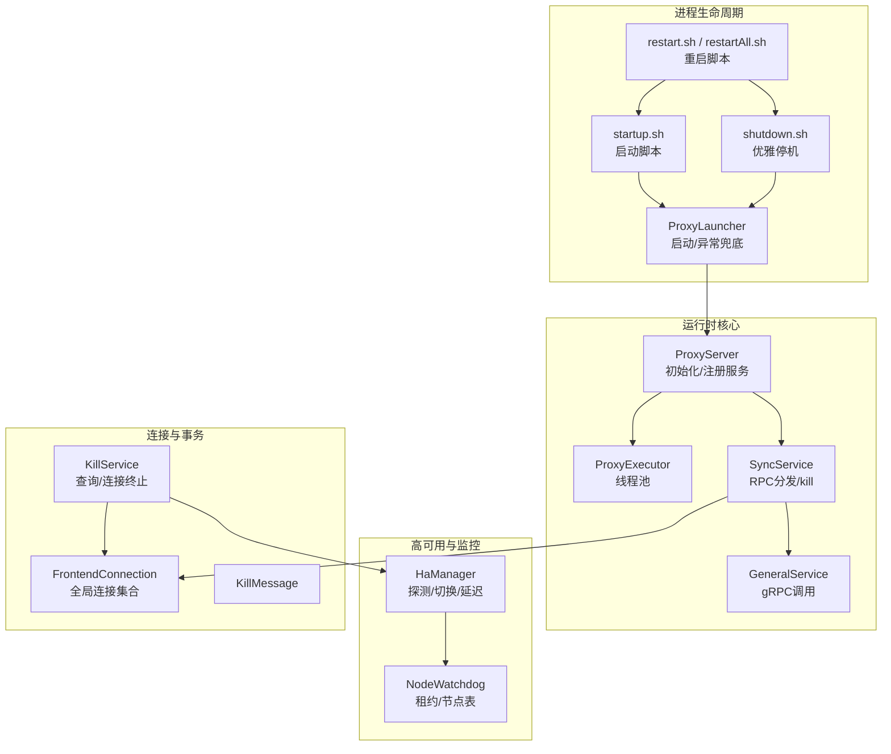
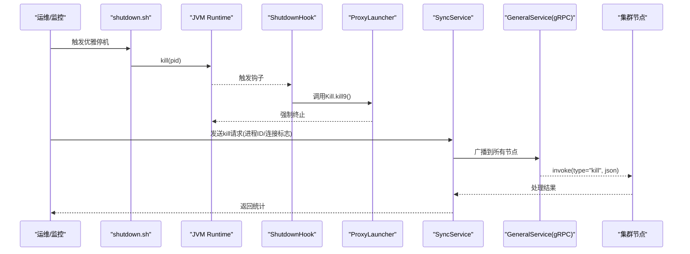
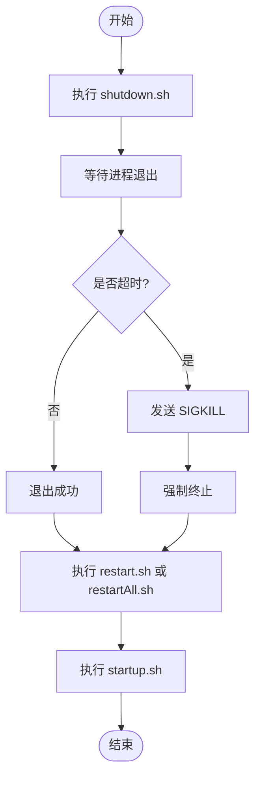
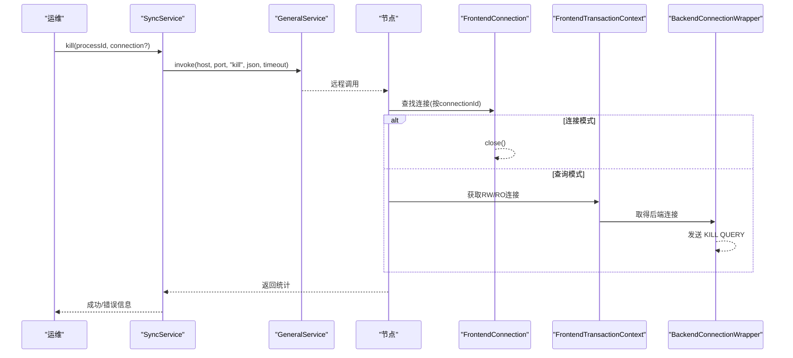
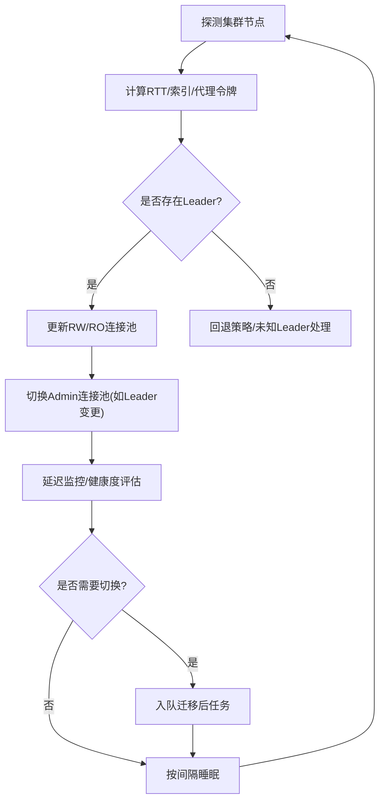
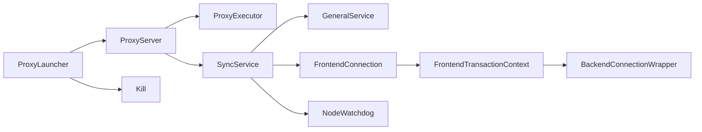

# 紧急故障处理

<cite>
**本文引用的文件**
- [ProxyLauncher.java](file://proxy-server/src/main/java/com/alibaba/polardbx/proxy/server/ProxyLauncher.java)
- [Kill.java](file://proxy-common/src/main/java/com/alarda/polardbx/proxy/utils/Kill.java)
- [ProxyServer.java](file://proxy-core/src/main/java/com/alibaba/polardbx/proxy/ProxyServer.java)
- [ProxyExecutor.java](file://proxy-core/src/main/java/com/alibaba/polardbx/proxy/ProxyExecutor.java)
- [HaManager.java](file://proxy-core/src/main/java/com/alibaba/polardbx/proxy/serverless/HaManager.java)
- [NodeWatchdog.java](file://proxy-core/src/main/java/com/alibaba/polardbx/proxy/cluster/NodeWatchdog.java)
- [SyncService.java](file://proxy-core/src/main/java/com/alibaba/polardbx/proxy/sync/SyncService.java)
- [KillService.java](file://proxy-core/src/main/java/com/alibaba/polardbx/proxy/sync/KillService.java)
- [KillMessage.java](file://proxy-core/src/main/java/com/alibaba/polardbx/proxy/sync/KillMessage.java)
- [FrontendConnection.java](file://proxy-core/src/main/java/com/alibaba/polardbx/proxy/connection/FrontendConnection.java)
- [GeneralService.java](file://proxy-rpc/src/main/java/com/alibaba/polardbx/proxy/GeneralService.java)
- [startup.sh](file://proxy-server/src/main/bin/startup.sh)
- [shutdown.sh](file://proxy-server/src/main/bin/shutdown.sh)
- [restart.sh](file://proxy-server/src/main/bin/restart.sh)
- [restartAll.sh](file://proxy-server/src/main/bin/restartAll.sh)
</cite>

## 目录
1. [简介](#简介)
2. [项目结构](#项目结构)
3. [核心组件](#核心组件)
4. [架构总览](#架构总览)
5. [详细组件分析](#详细组件分析)
6. [依赖关系分析](#依赖关系分析)
7. [性能与可用性考量](#性能与可用性考量)
8. [故障排查指南](#故障排查指南)
9. [结论](#结论)
10. [附录：标准操作程序（SOP）](#附录标准操作程序sop)

## 简介
本文件面向PolarDB-X Proxy在紧急故障场景下的标准化处置流程，覆盖紧急停机与重启、优雅关闭与强制终止、突发故障的快速响应与自动化处理、关键服务中断的主从切换与负载转移、批量查询取消与连接终止、故障恢复验证与健康检查、以及紧急沟通与升级流程。目标是帮助运维与开发团队在最短时间内稳定系统、最小化业务影响，并确保数据一致性与可追溯性。

## 项目结构
围绕紧急故障处理的关键模块与脚本如下：
- 启动与关闭入口：ProxyLauncher、startup.sh、shutdown.sh、restart.sh、restartAll.sh
- 服务注册与同步：SyncService、GeneralService
- 连接与事务上下文：FrontendConnection、FrontendTransactionContext
- 查询取消与连接终止：KillService、KillMessage
- 高可用与主从切换：HaManager、NodeWatchdog
- 线程池与执行器：ProxyExecutor

图示来源
- [ProxyLauncher.java](file://proxy-server/src/main/java/com/alibaba/polardbx/proxy/server/ProxyLauncher.java#L32-L55)
- [ProxyServer.java](file://proxy-core/src/main/java/com/alibaba/polardbx/proxy/ProxyServer.java#L56-L96)
- [ProxyExecutor.java](file://proxy-core/src/main/java/com/alibaba/polardbx/proxy/ProxyExecutor.java#L34-L55)
- [SyncService.java](file://proxy-core/src/main/java/com/alibaba/polardbx/proxy/sync/SyncService.java#L39-L59)
- [GeneralService.java](file://proxy-rpc/src/main/java/com/alibaba/polardbx/proxy/GeneralService.java#L74-L93)
- [HaManager.java](file://proxy-core/src/main/java/com/alibaba/polardbx/proxy/serverless/HaManager.java#L67-L156)
- [NodeWatchdog.java](file://proxy-core/src/main/java/com/alibaba/polardbx/proxy/cluster/NodeWatchdog.java#L96-L117)
- [FrontendConnection.java](file://proxy-core/src/main/java/com/alibaba/polardbx/proxy/connection/FrontendConnection.java#L47-L86)
- [KillService.java](file://proxy-core/src/main/java/com/alibaba/polardbx/proxy/sync/KillService.java#L37-L103)
- [KillMessage.java](file://proxy-core/src/main/java/com/alibaba/polardbx/proxy/sync/KillMessage.java#L24-L44)

章节来源
- [ProxyLauncher.java](file://proxy-server/src/main/java/com/alibaba/polardbx/proxy/server/ProxyLauncher.java#L32-L55)
- [startup.sh](file://proxy-server/src/main/bin/startup.sh#L408-L411)
- [shutdown.sh](file://proxy-server/src/main/bin/shutdown.sh#L89-L116)
- [restart.sh](file://proxy-server/src/main/bin/restart.sh#L12-L16)
- [restartAll.sh](file://proxy-server/src/main/bin/restartAll.sh#L10-L15)

## 核心组件
- 启动与异常兜底：ProxyLauncher在启动失败时触发Kill.kill9()，确保进程被强制终止；同时注册Runtime ShutdownHook以优雅停机。
- 服务注册与远程调用：ProxyServer初始化后注册SyncService，SyncService通过gRPC向集群内其他节点广播“kill”请求。
- 连接与事务上下文：FrontendConnection维护全局连接集合，KillService基于连接ID定位前端连接或事务上下文中的后端连接。
- 高可用与延迟监控：HaManager周期探测集群状态并更新RW/RO连接池；NodeWatchdog维护代理租约表，实现领导权与节点列表管理。
- 执行器与线程池：ProxyExecutor提供调度线程池，用于异步关闭、任务提交与重试。

章节来源
- [ProxyLauncher.java](file://proxy-server/src/main/java/com/alibaba/polardbx/proxy/server/ProxyLauncher.java#L32-L55)
- [ProxyServer.java](file://proxy-core/src/main/java/com/alibaba/polardbx/proxy/ProxyServer.java#L82-L96)
- [ProxyExecutor.java](file://proxy-core/src/main/java/com/alibaba/polardbx/proxy/ProxyExecutor.java#L34-L55)
- [SyncService.java](file://proxy-core/src/main/java/com/alibaba/polardbx/proxy/sync/SyncService.java#L39-L59)
- [FrontendConnection.java](file://proxy-core/src/main/java/com/alibaba/polardbx/proxy/connection/FrontendConnection.java#L47-L86)
- [HaManager.java](file://proxy-core/src/main/java/com/alibaba/polardbx/proxy/serverless/HaManager.java#L67-L156)
- [NodeWatchdog.java](file://proxy-core/src/main/java/com/alibaba/polardbx/proxy/cluster/NodeWatchdog.java#L96-L117)

## 架构总览
下图展示紧急停机/重启、查询取消与高可用切换的关键交互路径。

图示来源
- [shutdown.sh](file://proxy-server/src/main/bin/shutdown.sh#L89-L116)
- [ProxyLauncher.java](file://proxy-server/src/main/java/com/alibaba/polardbx/proxy/server/ProxyLauncher.java#L45-L54)
- [Kill.java](file://proxy-common/src/main/java/com/alibaba/polardbx/proxy/utils/Kill.java#L30-L50)
- [SyncService.java](file://proxy-core/src/main/java/com/alibaba/polardbx/proxy/sync/SyncService.java#L39-L59)
- [GeneralService.java](file://proxy-rpc/src/main/java/com/alibaba/polardbx/proxy/GeneralService.java#L74-L93)

## 详细组件分析

### 组件A：紧急停机与重启（优雅关闭与强制终止）
- 优雅停机：shutdown.sh向进程发送SIGTERM，等待进程退出；若超时则发送SIGKILL。
- 强制终止：ProxyLauncher在启动失败或ShutdownHook中调用Kill.kill9()，通过系统命令强制终止当前JVM进程。
- 重启：restart.sh先执行shutdown.sh再执行startup.sh；restartAll.sh遍历所有实例PID并逐一重启。

图示来源
- [shutdown.sh](file://proxy-server/src/main/bin/shutdown.sh#L89-L116)
- [restart.sh](file://proxy-server/src/main/bin/restart.sh#L12-L16)
- [restartAll.sh](file://proxy-server/src/main/bin/restartAll.sh#L10-L15)
- [startup.sh](file://proxy-server/src/main/bin/startup.sh#L408-L411)
- [ProxyLauncher.java](file://proxy-server/src/main/java/com/alibaba/polardbx/proxy/server/ProxyLauncher.java#L45-L54)
- [Kill.java](file://proxy-common/src/main/java/com/alibaba/polardbx/proxy/utils/Kill.java#L30-L50)

章节来源
- [shutdown.sh](file://proxy-server/src/main/bin/shutdown.sh#L89-L116)
- [restart.sh](file://proxy-server/src/main/bin/restart.sh#L12-L16)
- [restartAll.sh](file://proxy-server/src/main/bin/restartAll.sh#L10-L15)
- [startup.sh](file://proxy-server/src/main/bin/startup.sh#L408-L411)
- [ProxyLauncher.java](file://proxy-server/src/main/java/com/alibaba/polardbx/proxy/server/ProxyLauncher.java#L45-L54)
- [Kill.java](file://proxy-common/src/main/java/com/alibaba/polardbx/proxy/utils/Kill.java#L30-L50)

### 组件B：批量查询取消与连接终止（KILL命令与安全考虑）
- 请求入口：SyncService.kill(processId, connection)构造KillMessage并通过gRPC广播至所有节点。
- 处理逻辑：KillService根据processId匹配FrontendConnection，若为连接模式则直接关闭连接；否则在事务上下文中查找RW/RO连接并发送“KILL QUERY”。
- 安全考虑：仅在事务上下文存在且后端连接有效时才执行“KILL QUERY”，避免误杀或空指针；对异常进行日志记录与容错返回。

图示来源
- [SyncService.java](file://proxy-core/src/main/java/com/alibaba/polardbx/proxy/sync/SyncService.java#L39-L59)
- [GeneralService.java](file://proxy-rpc/src/main/java/com/alibaba/polardbx/proxy/GeneralService.java#L74-L93)
- [KillService.java](file://proxy-core/src/main/java/com/alibaba/polardbx/proxy/sync/KillService.java#L54-L102)
- [FrontendConnection.java](file://proxy-core/src/main/java/com/alibaba/polardbx/proxy/connection/FrontendConnection.java#L47-L86)
- [KillMessage.java](file://proxy-core/src/main/java/com/alibaba/polardbx/proxy/sync/KillMessage.java#L24-L44)

章节来源
- [SyncService.java](file://proxy-core/src/main/java/com/alibaba/polardbx/proxy/sync/SyncService.java#L39-L59)
- [KillService.java](file://proxy-core/src/main/java/com/alibaba/polardbx/proxy/sync/KillService.java#L54-L102)
- [FrontendConnection.java](file://proxy-core/src/main/java/com/alibaba/polardbx/proxy/connection/FrontendConnection.java#L47-L86)
- [KillMessage.java](file://proxy-core/src/main/java/com/alibaba/polardbx/proxy/sync/KillMessage.java#L24-L44)

### 组件C：关键服务中断的处理策略（主从切换、负载转移、一致性保护）
- 主从切换与延迟监控：HaManager周期探测集群状态，计算RTT与索引差异，动态更新RW/RO连接池；支持标记“正在迁移”的Leader并触发后台任务队列。
- 节点租约与领导权：NodeWatchdog维护代理租约表，实现选举与续租；当领导过期或不可达时自动丢失领导权并触发重新选举。
- 一致性保护：通过“KILL QUERY”与事务上下文的RW/RO连接分离，避免在只读连接上执行写操作；延迟监控与健康度评估辅助决策。

图示来源
- [HaManager.java](file://proxy-core/src/main/java/com/alibaba/polardbx/proxy/serverless/HaManager.java#L431-L647)
- [NodeWatchdog.java](file://proxy-core/src/main/java/com/alibaba/polardbx/proxy/cluster/NodeWatchdog.java#L256-L376)

章节来源
- [HaManager.java](file://proxy-core/src/main/java/com/alibaba/polardbx/proxy/serverless/HaManager.java#L431-L647)
- [NodeWatchdog.java](file://proxy-core/src/main/java/com/alibaba/polardbx/proxy/cluster/NodeWatchdog.java#L256-L376)

### 组件D：故障检测、自动告警与应急处理自动化
- 故障检测：HaManager与NodeWatchdog持续轮询后端与集群状态，异常与超时会记录日志并触发降级策略。
- 自动化处理：SyncService通过gRPC广播“kill”请求，实现跨节点的批量查询取消与连接终止。
- 应急处理：ProxyLauncher在启动失败时自动调用Kill.kill9()，确保系统尽快回到可控状态。

章节来源
- [HaManager.java](file://proxy-core/src/main/java/com/alibaba/polardbx/proxy/serverless/HaManager.java#L431-L647)
- [NodeWatchdog.java](file://proxy-core/src/main/java/com/alibaba/polardbx/proxy/cluster/NodeWatchdog.java#L119-L205)
- [SyncService.java](file://proxy-core/src/main/java/com/alibaba/polardbx/proxy/sync/SyncService.java#L39-L59)
- [ProxyLauncher.java](file://proxy-server/src/main/java/com/alibaba/polardbx/proxy/server/ProxyLauncher.java#L40-L43)

## 依赖关系分析
- ProxyLauncher依赖ProxyExecutor与ProxyServer进行初始化；异常时调用Kill.kill9()。
- ProxyServer初始化HaManager、SmoothSwitchoverMonitor、PrivilegeRefresher、SyncService等组件。
- SyncService依赖NodeWatchdog获取节点列表，通过GeneralService进行gRPC调用。
- KillService依赖FrontendConnection集合与FrontendTransactionContext，结合后端连接池执行“KILL QUERY”。

图示来源
- [ProxyLauncher.java](file://proxy-server/src/main/java/com/alibaba/polardbx/proxy/server/ProxyLauncher.java#L35-L43)
- [ProxyServer.java](file://proxy-core/src/main/java/com/alibaba/polardbx/proxy/ProxyServer.java#L65-L96)
- [SyncService.java](file://proxy-core/src/main/java/com/alibaba/polardbx/proxy/sync/SyncService.java#L39-L59)
- [GeneralService.java](file://proxy-rpc/src/main/java/com/alibaba/polardbx/proxy/GeneralService.java#L74-L93)
- [FrontendConnection.java](file://proxy-core/src/main/java/com/alibaba/polardbx/proxy/connection/FrontendConnection.java#L47-L86)
- [KillService.java](file://proxy-core/src/main/java/com/alibaba/polardbx/proxy/sync/KillService.java#L54-L102)
- [Kill.java](file://proxy-common/src/main/java/com/alibaba/polardbx/proxy/utils/Kill.java#L30-L50)

章节来源
- [ProxyLauncher.java](file://proxy-server/src/main/java/com/alibaba/polardbx/proxy/server/ProxyLauncher.java#L35-L43)
- [ProxyServer.java](file://proxy-core/src/main/java/com/alibaba/polardbx/proxy/ProxyServer.java#L65-L96)
- [SyncService.java](file://proxy-core/src/main/java/com/alibaba/polardbx/proxy/sync/SyncService.java#L39-L59)
- [GeneralService.java](file://proxy-rpc/src/main/java/com/alibaba/polardbx/proxy/GeneralService.java#L74-L93)
- [FrontendConnection.java](file://proxy-core/src/main/java/com/alibaba/polardbx/proxy/connection/FrontendConnection.java#L47-L86)
- [KillService.java](file://proxy-core/src/main/java/com/alibaba/polardbx/proxy/sync/KillService.java#L54-L102)
- [Kill.java](file://proxy-common/src/main/java/com/alibaba/polardbx/proxy/utils/Kill.java#L30-L50)

## 性能与可用性考量
- 线程池与定时器：ProxyExecutor提供调度线程池与定时器，用于异步关闭与任务调度，避免阻塞主线程。
- 延迟监控与健康度：HaManager与LatencyChecker通过RTT与索引差异评估节点健康，减少在落后节点上的读写。
- 超时控制：KillService与SyncService均使用配置项设置超时，防止长时间阻塞导致资源泄漏。
- 优雅停机与强制终止：优先尝试优雅停机，超时后采用强制终止，确保系统可恢复。

章节来源
- [ProxyExecutor.java](file://proxy-core/src/main/java/com/alibaba/polardbx/proxy/ProxyExecutor.java#L34-L55)
- [HaManager.java](file://proxy-core/src/main/java/com/alibaba/polardbx/proxy/serverless/HaManager.java#L117-L156)
- [SyncService.java](file://proxy-core/src/main/java/com/alibaba/polardbx/proxy/sync/SyncService.java#L39-L59)
- [KillService.java](file://proxy-core/src/main/java/com/alibaba/polardbx/proxy/sync/KillService.java#L40-L51)

## 故障排查指南
- 启动失败：查看ProxyLauncher日志，确认是否触发了Kill.kill9()；检查配置加载与端口占用。
- 优雅停机无效：确认shutdown.sh是否正确获取PID并发送信号；检查JVM参数与线程池是否阻塞。
- 查询取消不生效：确认FrontendConnection的connectionId是否匹配；检查事务上下文中是否存在RW/RO连接；核对后端“KILL QUERY”执行权限。
- 高可用异常：检查HaManager与NodeWatchdog的日志，确认集群探测是否成功；核对租约表与Leader切换时间窗口。
- 恢复验证：通过Show类请求与系统表查询验证节点状态、延迟与Leader角色；执行小流量压测验证读写路径。

章节来源
- [ProxyLauncher.java](file://proxy-server/src/main/java/com/alibaba/polardbx/proxy/server/ProxyLauncher.java#L40-L54)
- [shutdown.sh](file://proxy-server/src/main/bin/shutdown.sh#L89-L116)
- [FrontendConnection.java](file://proxy-core/src/main/java/com/alibaba/polardbx/proxy/connection/FrontendConnection.java#L47-L86)
- [KillService.java](file://proxy-core/src/main/java/com/alibaba/polardbx/proxy/sync/KillService.java#L54-L102)
- [HaManager.java](file://proxy-core/src/main/java/com/alibaba/polardbx/proxy/serverless/HaManager.java#L431-L647)
- [NodeWatchdog.java](file://proxy-core/src/main/java/com/alibaba/polardbx/proxy/cluster/NodeWatchdog.java#L119-L205)

## 结论
通过启动/停机脚本、优雅停机与强制终止机制、SyncService的跨节点广播、KillService的查询/连接终止能力，以及HaManager与NodeWatchdog的高可用与延迟监控，PolarDB-X Proxy具备完善的紧急故障处理能力。建议在生产环境中结合自动化巡检与告警系统，确保在最短时间内完成故障定位、处置与恢复。

## 附录：标准操作程序（SOP）

### SOP 1：紧急停机（优雅关闭）
- 步骤
  1) 执行shutdown.sh，等待进程退出。
  2) 若超时（默认超时窗口），脚本将发送SIGKILL强制终止。
  3) 检查日志与进程状态，确认进程已退出。
- 关键点
  - 优雅停机优先，超时后强制终止。
  - 关注ShutdownHook是否触发，避免资源未释放。

章节来源
- [shutdown.sh](file://proxy-server/src/main/bin/shutdown.sh#L89-L116)
- [ProxyLauncher.java](file://proxy-server/src/main/java/com/alibaba/polardbx/proxy/server/ProxyLauncher.java#L45-L54)

### SOP 2：紧急停机（强制终止）
- 步骤
  1) 在无法优雅停机时，直接调用Kill.kill9()。
  2) 确认进程PID与JVM进程一致，避免误杀。
  3) 检查系统日志，定位强制终止原因。
- 关键点
  - 仅在必要时使用，避免数据不一致风险。
  - 记录堆栈与致命错误以便后续分析。

章节来源
- [Kill.java](file://proxy-common/src/main/java/com/alibaba/polardbx/proxy/utils/Kill.java#L30-L67)
- [ProxyLauncher.java](file://proxy-server/src/main/java/com/alibaba/polardbx/proxy/server/ProxyLauncher.java#L40-L43)

### SOP 3：紧急重启
- 步骤
  1) 执行restart.sh，顺序为先停后启。
  2) 如需批量重启，执行restartAll.sh遍历所有实例。
  3) 启动完成后，验证端口监听与日志输出。
- 关键点
  - 启动前确保配置文件与环境变量正确。
  - 启动脚本会写入PID文件，注意并发启动冲突。

章节来源
- [restart.sh](file://proxy-server/src/main/bin/restart.sh#L12-L16)
- [restartAll.sh](file://proxy-server/src/main/bin/restartAll.sh#L10-L15)
- [startup.sh](file://proxy-server/src/main/bin/startup.sh#L408-L411)

### SOP 4：批量查询取消与连接终止
- 步骤
  1) 通过SyncService.kill(processId, connection)发起请求。
  2) 若connection为真，则直接关闭对应前端连接。
  3) 若为假，则在事务上下文中查找RW/RO连接并发送“KILL QUERY”。
  4) 核对返回统计，确认命中数量。
- 安全考虑
  - 仅在事务上下文存在时执行“KILL QUERY”。
  - 对异常进行捕获与日志记录，避免影响其他节点。

章节来源
- [SyncService.java](file://proxy-core/src/main/java/com/alibaba/polardbx/proxy/sync/SyncService.java#L39-L59)
- [KillService.java](file://proxy-core/src/main/java/com/alibaba/polardbx/proxy/sync/KillService.java#L54-L102)
- [FrontendConnection.java](file://proxy-core/src/main/java/com/alibaba/polardbx/proxy/connection/FrontendConnection.java#L47-L86)
- [KillMessage.java](file://proxy-core/src/main/java/com/alibaba/polardbx/proxy/sync/KillMessage.java#L24-L44)

### SOP 5：关键服务中断处理（主从切换、负载转移、一致性保护）
- 步骤
  1) 观察HaManager日志，确认Leader状态变化与延迟监控。
  2) NodeWatchdog负责租约续期与领导权维护，异常时自动触发重新选举。
  3) 切换期间通过延迟监控与健康度评估，避免在落后节点上执行写操作。
- 关键点
  - “KILL QUERY”与事务上下文分离，避免在只读连接上执行写操作。
  - 切换后任务队列由ProxyExecutor调度执行。

章节来源
- [HaManager.java](file://proxy-core/src/main/java/com/alibaba/polardbx/proxy/serverless/HaManager.java#L431-L647)
- [NodeWatchdog.java](file://proxy-core/src/main/java/com/alibaba/polardbx/proxy/cluster/NodeWatchdog.java#L256-L376)
- [ProxyExecutor.java](file://proxy-core/src/main/java/com/alibaba/polardbx/proxy/ProxyExecutor.java#L34-L55)

### SOP 6：故障恢复验证与健康检查
- 验证步骤
  1) 通过Show类请求与系统表查询验证节点状态、延迟与Leader角色。
  2) 执行小流量压测，验证读写路径与延迟指标。
  3) 检查日志中是否有异常与重试记录。
- 关键点
  - 使用最小化流量验证，避免对生产造成二次冲击。
  - 关注Leader切换后的稳定性与延迟回归。

章节来源
- [HaManager.java](file://proxy-core/src/main/java/com/alibaba/polardbx/proxy/serverless/HaManager.java#L79-L112)
- [NodeWatchdog.java](file://proxy-core/src/main/java/com/alibaba/polardbx/proxy/cluster/NodeWatchdog.java#L119-L205)

### SOP 7：紧急沟通与升级流程
- 流程
  1) 故障发生后，立即通知值班人员与相关负责人。
  2) 按照SOP执行紧急停机/重启与查询取消。
  3) 将处理过程与结果记录在案，形成升级报告。
  4) 根据影响范围决定是否扩大升级范围。
- 关键点
  - 保持沟通渠道畅通，明确职责分工。
  - 记录每次操作的时间戳与结果，便于复盘。

[本节为通用流程说明，无需特定文件引用]