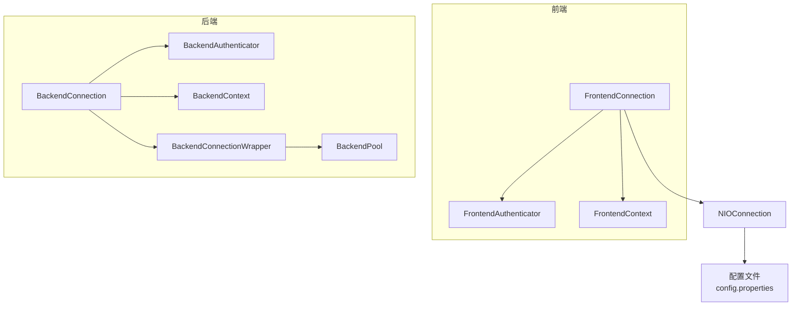
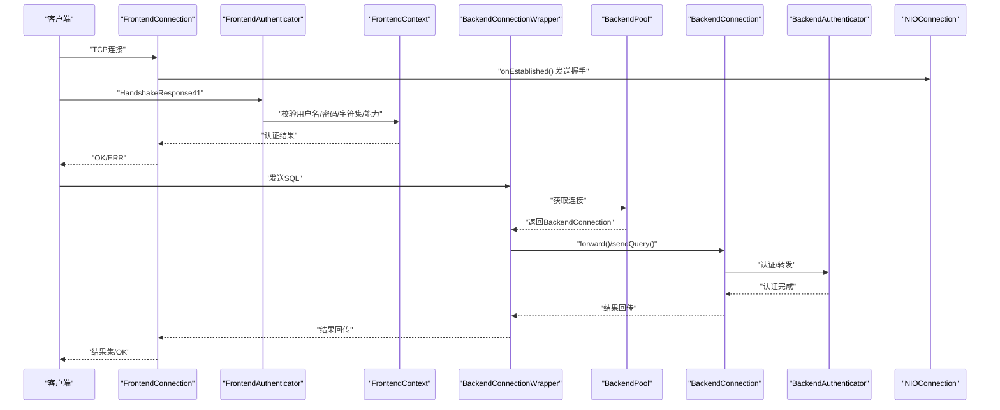
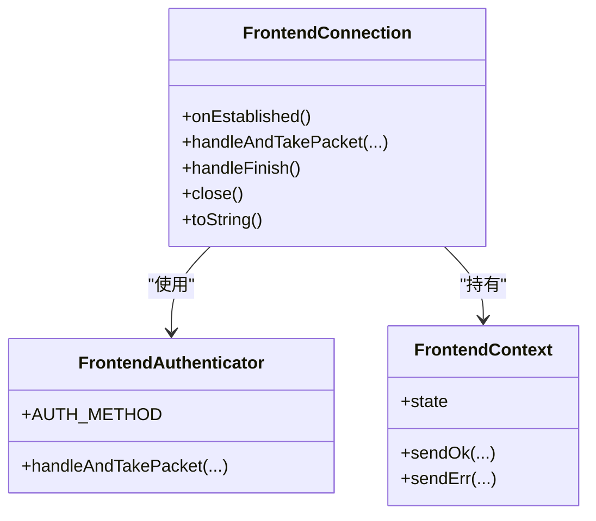
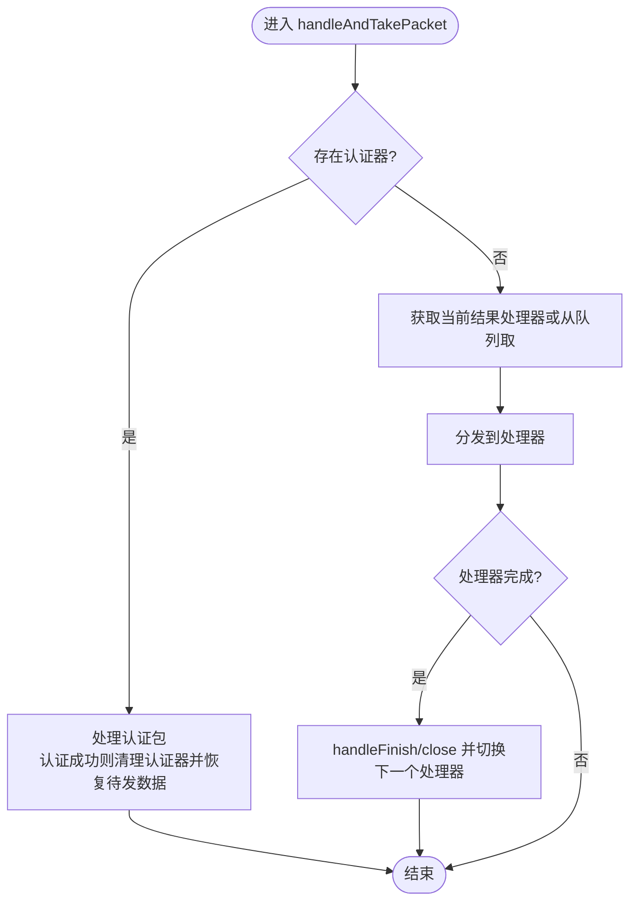
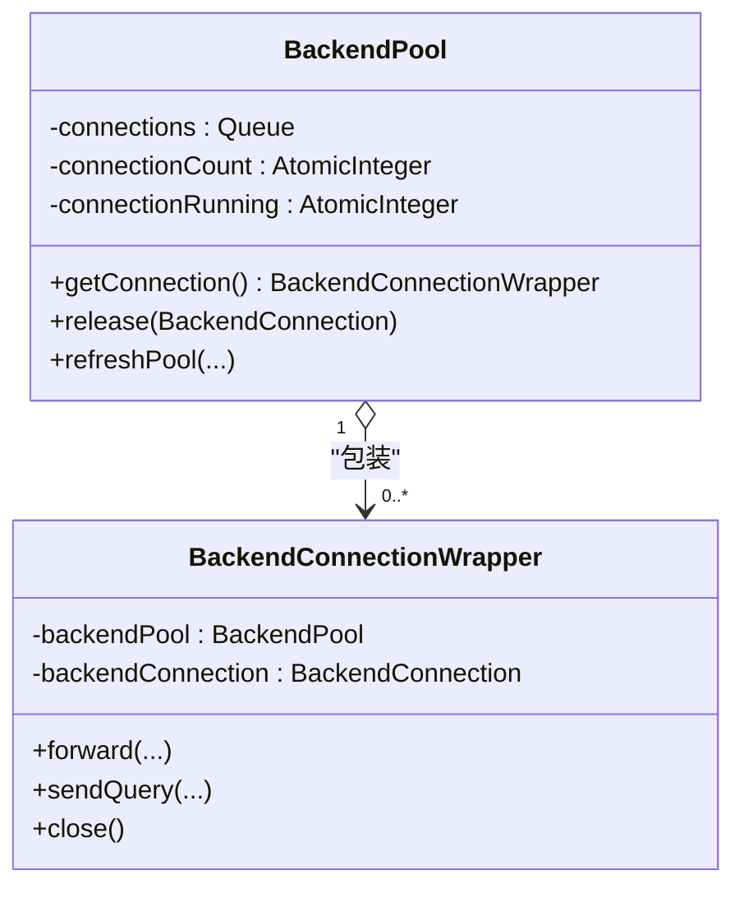
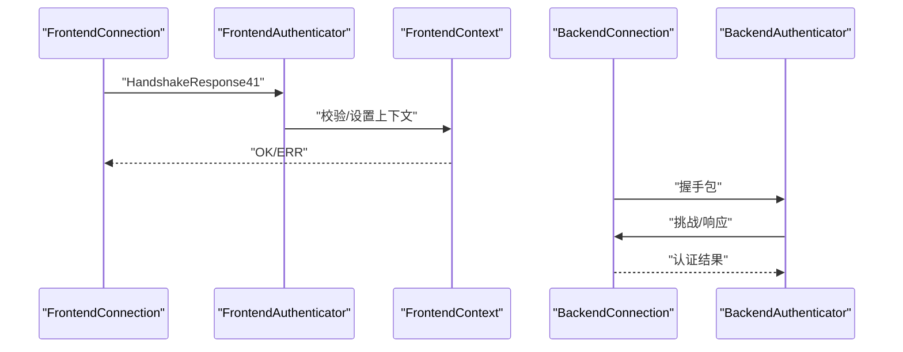
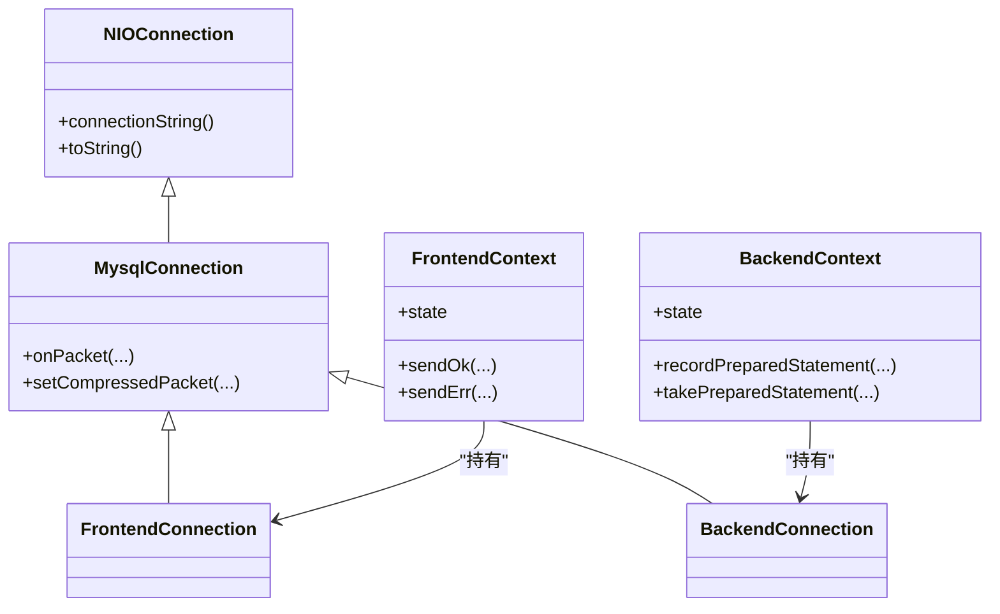
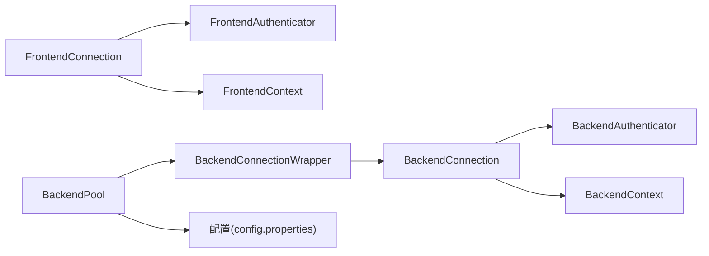

# 连接问题排查

<cite>
**本文引用的文件**
- [proxy-core/src/main/java/com/alibaba/polardbx/proxy/connection/FrontendConnection.java](file://proxy-core/src/main/java/com/alibaba/polardbx/proxy/connection/FrontendConnection.java)
- [proxy-core/src/main/java/com/alibaba/polardbx/proxy/connection/BackendConnection.java](file://proxy-core/src/main/java/com/alibaba/polardbx/proxy/connection/BackendConnection.java)
- [proxy-core/src/main/java/com/alibaba/polardbx/proxy/connection/MysqlConnection.java](file://proxy-core/src/main/java/com/alibaba/polardbx/proxy/connection/MysqlConnection.java)
- [proxy-core/src/main/java/com/alibaba/polardbx/proxy/connection/pool/BackendPool.java](file://proxy-core/src/main/java/com/alibaba/polardbx/proxy/connection/pool/BackendPool.java)
- [proxy-core/src/main/java/com/alibaba/polardbx/proxy/connection/pool/BackendConnectionWrapper.java](file://proxy-core/src/main/java/com/alibaba/polardbx/proxy/connection/pool/BackendConnectionWrapper.java)
- [proxy-core/src/main/java/com/alibaba/polardbx/proxy/context/FrontendContext.java](file://proxy-core/src/main/java/com/alibaba/polardbx/proxy/context/FrontendContext.java)
- [proxy-core/src/main/java/com/alibaba/polardbx/proxy/context/BackendContext.java](file://proxy-core/src/main/java/com/alibaba/polardbx/proxy/context/BackendContext.java)
- [proxy-core/src/main/java/com/alibaba/polardbx/proxy/protocol/handler/FrontendAuthenticator.java](file://proxy-core/src/main/java/com/alibaba/polardbx/proxy/protocol/handler/FrontendAuthenticator.java)
- [proxy-core/src/main/java/com/alibaba/polardbx/proxy/protocol/handler/BackendAuthenticator.java](file://proxy-core/src/main/java/com/alibaba/polardbx/proxy/protocol/handler/BackendAuthenticator.java)
- [proxy-net/src/main/java/com/alibaba/polardbx/proxy/net/NIOConnection.java](file://proxy-net/src/main/java/com/alibaba/polardbx/proxy/net/NIOConnection.java)
- [proxy-common/src/main/resources/config.properties](file://proxy-common/src/main/resources/config.properties)
- [proxy-server/src/main/conf/config.properties](file://proxy-server/src/main/conf/config.properties)
- [proxy-core/src/main/java/com/alibaba/polardbx/proxy/protocol/handler/request/SystemTableRequestHandler.java](file://proxy-core/src/main/java/com/alibaba/polardbx/proxy/protocol/handler/request/SystemTableRequestHandler.java)
- [proxy-core/src/main/java/com/alibaba/polardbx/proxy/protocol/handler/request/ShowFrontendHandler.java](file://proxy-core/src/main/java/com/alibaba/polardbx/proxy/protocol/handler/request/ShowFrontendHandler.java)
- [proxy-core/src/main/java/com/alibaba/polardbx/proxy/protocol/handler/request/ShowReactorHandler.java](file://proxy-core/src/main/java/com/alibaba/polardbx/proxy/protocol/handler/request/ShowReactorHandler.java)
- [proxy-common/src/main/java/com/alibaba/polardbx/proxy/utils/LeakChecker.java](file://proxy-common/src/main/java/com/alibaba/polardbx/proxy/utils/LeakChecker.java)
- [proxy-common/src/main/java/com/alibaba/polardbx/proxy/utils/FastBufferPool.java](file://proxy-common/src/main/java/com/alibaba/polardbx/proxy/utils/FastBufferPool.java)
</cite>

## 目录
1. [简介](#简介)
2. [项目结构](#项目结构)
3. [核心组件](#核心组件)
4. [架构总览](#架构总览)
5. [详细组件分析](#详细组件分析)
6. [依赖关系分析](#依赖关系分析)
7. [性能考量](#性能考量)
8. [故障排查指南](#故障排查指南)
9. [结论](#结论)
10. [附录](#附录)

## 简介
本指南聚焦于PolarDB-X Proxy在“前端连接”与“后端连接”两类场景中的连接问题排查与优化。内容覆盖：
- 前端连接失败的常见原因与诊断：握手、认证、网络中断、超时等
- 后端连接问题的排查流程：连接池耗尽、连接泄漏、连接重用策略
- 连接池配置参数调优：最大连接数、空闲检查、连接验证等
- 连接状态监控与诊断工具：连接数统计、生命周期跟踪、异常识别
- 预防措施与最佳实践

## 项目结构
围绕连接问题的关键模块分布如下：
- 连接层：FrontendConnection、BackendConnection、MysqlConnection、NIOConnection
- 协议与认证：FrontendAuthenticator、BackendAuthenticator
- 上下文：FrontendContext、BackendContext
- 连接池：BackendPool、BackendConnectionWrapper
- 配置：全局与服务端配置文件
- 监控与诊断：系统表请求处理器、连接字符串打印、内存缓冲池与泄漏检测

**图表来源**
- [proxy-core/src/main/java/com/alibaba/polardbx/proxy/connection/FrontendConnection.java](file://proxy-core/src/main/java/com/alibaba/polardbx/proxy/connection/FrontendConnection.java#L47-L86)
- [proxy-core/src/main/java/com/alibaba/polardbx/proxy/connection/BackendConnection.java](file://proxy-core/src/main/java/com/alibaba/polardbx/proxy/connection/BackendConnection.java#L67-L109)
- [proxy-core/src/main/java/com/alibaba/polardbx/proxy/connection/MysqlConnection.java](file://proxy-core/src/main/java/com/alibaba/polardbx/proxy/connection/MysqlConnection.java#L37-L45)
- [proxy-core/src/main/java/com/alibaba/polardbx/proxy/connection/pool/BackendPool.java](file://proxy-core/src/main/java/com/alibaba/polardbx/proxy/connection/pool/BackendPool.java#L46-L98)
- [proxy-core/src/main/java/com/alibaba/polardbx/proxy/connection/pool/BackendConnectionWrapper.java](file://proxy-core/src/main/java/com/alibaba/polardbx/proxy/connection/pool/BackendConnectionWrapper.java#L44-L55)
- [proxy-net/src/main/java/com/alibaba/polardbx/proxy/net/NIOConnection.java](file://proxy-net/src/main/java/com/alibaba/polardbx/proxy/net/NIOConnection.java#L844-L883)
- [proxy-server/src/main/conf/config.properties](file://proxy-server/src/main/conf/config.properties#L34-L43)

**章节来源**
- [proxy-core/src/main/java/com/alibaba/polardbx/proxy/connection/FrontendConnection.java](file://proxy-core/src/main/java/com/alibaba/polardbx/proxy/connection/FrontendConnection.java#L47-L86)
- [proxy-core/src/main/java/com/alibaba/polardbx/proxy/connection/BackendConnection.java](file://proxy-core/src/main/java/com/alibaba/polardbx/proxy/connection/BackendConnection.java#L67-L109)
- [proxy-core/src/main/java/com/alibaba/polardbx/proxy/connection/MysqlConnection.java](file://proxy-core/src/main/java/com/alibaba/polardbx/proxy/connection/MysqlConnection.java#L37-L45)
- [proxy-core/src/main/java/com/alibaba/polardbx/proxy/connection/pool/BackendPool.java](file://proxy-core/src/main/java/com/alibaba/polardbx/proxy/connection/pool/BackendPool.java#L46-L98)
- [proxy-core/src/main/java/com/alibaba/polardbx/proxy/connection/pool/BackendConnectionWrapper.java](file://proxy-core/src/main/java/com/alibaba/polardbx/proxy/connection/pool/BackendConnectionWrapper.java#L44-L55)
- [proxy-net/src/main/java/com/alibaba/polardbx/proxy/net/NIOConnection.java](file://proxy-net/src/main/java/com/alibaba/polardbx/proxy/net/NIOConnection.java#L844-L883)
- [proxy-server/src/main/conf/config.properties](file://proxy-server/src/main/conf/config.properties#L34-L43)

## 核心组件
- 前端连接（FrontendConnection）：负责与客户端建立握手、认证、命令处理；维护FrontendContext上下文
- 后端连接（BackendConnection）：负责与MySQL后端建立连接、认证、转发查询；维护BackendContext上下文
- 连接池（BackendPool + BackendConnectionWrapper）：管理后端连接的获取、释放、复用与刷新
- 协议与认证（FrontendAuthenticator、BackendAuthenticator）：实现握手响应、密码校验、能力协商
- 网络基础（MysqlConnection、NIOConnection）：报文解析、序列号管理、连接生命周期
- 上下文（FrontendContext、BackendContext）：会话状态、字符集、事务、预编译语句缓存等
- 配置（config.properties）：连接池大小、超时、HA、预编译缓存、日志等

**章节来源**
- [proxy-core/src/main/java/com/alibaba/polardbx/proxy/connection/FrontendConnection.java](file://proxy-core/src/main/java/com/alibaba/polardbx/proxy/connection/FrontendConnection.java#L47-L86)
- [proxy-core/src/main/java/com/alibaba/polardbx/proxy/connection/BackendConnection.java](file://proxy-core/src/main/java/com/alibaba/polardbx/proxy/connection/BackendConnection.java#L67-L109)
- [proxy-core/src/main/java/com/alibaba/polardbx/proxy/connection/pool/BackendPool.java](file://proxy-core/src/main/java/com/alibaba/polardbx/proxy/connection/pool/BackendPool.java#L46-L98)
- [proxy-core/src/main/java/com/alibaba/polardbx/proxy/connection/pool/BackendConnectionWrapper.java](file://proxy-core/src/main/java/com/alibaba/polardbx/proxy/connection/pool/BackendConnectionWrapper.java#L44-L55)
- [proxy-core/src/main/java/com/alibaba/polardbx/proxy/protocol/handler/FrontendAuthenticator.java](file://proxy-core/src/main/java/com/alibaba/polardbx/proxy/protocol/handler/FrontendAuthenticator.java#L45-L65)
- [proxy-core/src/main/java/com/alibaba/polardbx/proxy/protocol/handler/BackendAuthenticator.java](file://proxy-core/src/main/java/com/alibaba/polardbx/proxy/protocol/handler/BackendAuthenticator.java#L45-L67)
- [proxy-core/src/main/java/com/alibaba/polardbx/proxy/context/FrontendContext.java](file://proxy-core/src/main/java/com/alibaba/polardbx/proxy/context/FrontendContext.java#L45-L54)
- [proxy-core/src/main/java/com/alibaba/polardbx/proxy/context/BackendContext.java](file://proxy-core/src/main/java/com/alibaba/polardbx/proxy/context/BackendContext.java#L37-L55)

## 架构总览
前端连接与后端连接通过协议处理器与上下文协同工作，连接池统一调度后端连接的复用与回收。

**图表来源**
- [proxy-core/src/main/java/com/alibaba/polardbx/proxy/connection/FrontendConnection.java](file://proxy-core/src/main/java/com/alibaba/polardbx/proxy/connection/FrontendConnection.java#L88-L111)
- [proxy-core/src/main/java/com/alibaba/polardbx/proxy/protocol/handler/FrontendAuthenticator.java](file://proxy-core/src/main/java/com/alibaba/polardbx/proxy/protocol/handler/FrontendAuthenticator.java#L137-L201)
- [proxy-core/src/main/java/com/alibaba/polardbx/proxy/connection/pool/BackendPool.java](file://proxy-core/src/main/java/com/alibaba/polardbx/proxy/connection/pool/BackendPool.java#L115-L132)
- [proxy-core/src/main/java/com/alibaba/polardbx/proxy/connection/pool/BackendConnectionWrapper.java](file://proxy-core/src/main/java/com/alibaba/polardbx/proxy/connection/pool/BackendConnectionWrapper.java#L86-L106)
- [proxy-core/src/main/java/com/alibaba/polardbx/proxy/connection/BackendConnection.java](file://proxy-core/src/main/java/com/alibaba/polardbx/proxy/connection/BackendConnection.java#L289-L321)
- [proxy-core/src/main/java/com/alibaba/polardbx/proxy/protocol/handler/BackendAuthenticator.java](file://proxy-core/src/main/java/com/alibaba/polardbx/proxy/protocol/handler/BackendAuthenticator.java#L74-L135)

## 详细组件分析

### 前端连接（FrontendConnection）
- 责任边界：建立握手、触发认证、命令分发、资源关闭与全局集合管理
- 关键点：
  - 握手阶段发送版本、连接ID、能力标志、字符集、状态标志、认证插件名
  - 认证成功后切换状态，释放认证器
  - 异常时关闭连接，避免资源泄漏
  - 全局集合用于统计与诊断

**图表来源**
- [proxy-core/src/main/java/com/alibaba/polardbx/proxy/connection/FrontendConnection.java](file://proxy-core/src/main/java/com/alibaba/polardbx/proxy/connection/FrontendConnection.java#L47-L86)
- [proxy-core/src/main/java/com/alibaba/polardbx/proxy/protocol/handler/FrontendAuthenticator.java](file://proxy-core/src/main/java/com/alibaba/polardbx/proxy/protocol/handler/FrontendAuthenticator.java#L45-L65)
- [proxy-core/src/main/java/com/alibaba/polardbx/proxy/context/FrontendContext.java](file://proxy-core/src/main/java/com/alibaba/polardbx/proxy/context/FrontendContext.java#L45-L54)

**章节来源**
- [proxy-core/src/main/java/com/alibaba/polardbx/proxy/connection/FrontendConnection.java](file://proxy-core/src/main/java/com/alibaba/polardbx/proxy/connection/FrontendConnection.java#L88-L166)
- [proxy-core/src/main/java/com/alibaba/polardbx/proxy/protocol/handler/FrontendAuthenticator.java](file://proxy-core/src/main/java/com/alibaba/polardbx/proxy/protocol/handler/FrontendAuthenticator.java#L137-L201)
- [proxy-core/src/main/java/com/alibaba/polardbx/proxy/context/FrontendContext.java](file://proxy-core/src/main/java/com/alibaba/polardbx/proxy/context/FrontendContext.java#L56-L124)

### 后端连接（BackendConnection）
- 责任边界：与后端MySQL建立连接、认证、转发请求、处理结果、生命周期管理
- 关键点：
  - 认证器完成后设置全局只读配置与变量
  - 登录等待Future确保认证完成后再发送请求
  - 发送前排队未完成认证的请求，认证完成后批量发送
  - isGood()判断连接可用性，hasPendingUserRequests()判断是否可复用
  - 连接关闭时异步释放资源，避免阻塞

**图表来源**
- [proxy-core/src/main/java/com/alibaba/polardbx/proxy/connection/BackendConnection.java](file://proxy-core/src/main/java/com/alibaba/polardbx/proxy/connection/BackendConnection.java#L123-L200)

**章节来源**
- [proxy-core/src/main/java/com/alibaba/polardbx/proxy/connection/BackendConnection.java](file://proxy-core/src/main/java/com/alibaba/polardbx/proxy/connection/BackendConnection.java#L118-L224)

### 连接池（BackendPool 与 BackendConnectionWrapper）
- 责任边界：连接池化、连接获取/释放、空闲连接刷新、全局变量同步
- 关键点：
  - 获取连接：优先从池中取出，否则非阻塞建立新连接并设置池信息
  - 释放连接：若连接可用且未有用户请求，按maxPooled阈值决定复用或关闭
  - 刷新策略：按比例对空闲时间超过阈值的连接执行轻量查询以验证有效性
  - 全局变量：周期性拉取后端变量，用于后续连接初始化

**图表来源**
- [proxy-core/src/main/java/com/alibaba/polardbx/proxy/connection/pool/BackendPool.java](file://proxy-core/src/main/java/com/alibaba/polardbx/proxy/connection/pool/BackendPool.java#L46-L98)
- [proxy-core/src/main/java/com/alibaba/polardbx/proxy/connection/pool/BackendConnectionWrapper.java](file://proxy-core/src/main/java/com/alibaba/polardbx/proxy/connection/pool/BackendConnectionWrapper.java#L44-L55)

**章节来源**
- [proxy-core/src/main/java/com/alibaba/polardbx/proxy/connection/pool/BackendPool.java](file://proxy-core/src/main/java/com/alibaba/polardbx/proxy/connection/pool/BackendPool.java#L115-L165)
- [proxy-core/src/main/java/com/alibaba/polardbx/proxy/connection/pool/BackendConnectionWrapper.java](file://proxy-core/src/main/java/com/alibaba/polardbx/proxy/connection/pool/BackendConnectionWrapper.java#L240-L265)

### 协议与认证（FrontendAuthenticator / BackendAuthenticator）
- 前端认证：校验字符集、用户名、密码、数据库白名单；支持认证方式切换
- 后端认证：接收握手、挑战计算、发送认证响应；处理认证结果与切换

**图表来源**
- [proxy-core/src/main/java/com/alibaba/polardbx/proxy/protocol/handler/FrontendAuthenticator.java](file://proxy-core/src/main/java/com/alibaba/polardbx/proxy/protocol/handler/FrontendAuthenticator.java#L137-L201)
- [proxy-core/src/main/java/com/alibaba/polardbx/proxy/protocol/handler/BackendAuthenticator.java](file://proxy-core/src/main/java/com/alibaba/polardbx/proxy/protocol/handler/BackendAuthenticator.java#L74-L135)

**章节来源**
- [proxy-core/src/main/java/com/alibaba/polardbx/proxy/protocol/handler/FrontendAuthenticator.java](file://proxy-core/src/main/java/com/alibaba/polardbx/proxy/protocol/handler/FrontendAuthenticator.java#L67-L135)
- [proxy-core/src/main/java/com/alibaba/polardbx/proxy/protocol/handler/BackendAuthenticator.java](file://proxy-core/src/main/java/com/alibaba/polardbx/proxy/protocol/handler/BackendAuthenticator.java#L136-L210)

### 上下文与缓冲（FrontendContext / BackendContext / MysqlConnection / NIOConnection）
- 上下文：记录状态、字符集、事务、预编译语句缓存、用户变量等
- 缓冲：FastBufferPool提供高效缓冲区分配与引用计数
- 连接标识：NIOConnection提供连接字符串打印，便于定位

**图表来源**
- [proxy-core/src/main/java/com/alibaba/polardbx/proxy/connection/MysqlConnection.java](file://proxy-core/src/main/java/com/alibaba/polardbx/proxy/connection/MysqlConnection.java#L37-L45)
- [proxy-net/src/main/java/com/alibaba/polardbx/proxy/net/NIOConnection.java](file://proxy-net/src/main/java/com/alibaba/polardbx/proxy/net/NIOConnection.java#L844-L883)
- [proxy-core/src/main/java/com/alibaba/polardbx/proxy/context/FrontendContext.java](file://proxy-core/src/main/java/com/alibaba/polardbx/proxy/context/FrontendContext.java#L45-L54)
- [proxy-core/src/main/java/com/alibaba/polardbx/proxy/context/BackendContext.java](file://proxy-core/src/main/java/com/alibaba/polardbx/proxy/context/BackendContext.java#L37-L55)

**章节来源**
- [proxy-core/src/main/java/com/alibaba/polardbx/proxy/context/FrontendContext.java](file://proxy-core/src/main/java/com/alibaba/polardbx/proxy/context/FrontendContext.java#L148-L162)
- [proxy-core/src/main/java/com/alibaba/polardbx/proxy/context/BackendContext.java](file://proxy-core/src/main/java/com/alibaba/polardbx/proxy/context/BackendContext.java#L57-L85)
- [proxy-common/src/main/java/com/alibaba/polardbx/proxy/utils/FastBufferPool.java](file://proxy-common/src/main/java/com/alibaba/polardbx/proxy/utils/FastBufferPool.java#L71-L107)
- [proxy-net/src/main/java/com/alibaba/polardbx/proxy/net/NIOConnection.java](file://proxy-net/src/main/java/com/alibaba/polardbx/proxy/net/NIOConnection.java#L844-L883)

## 依赖关系分析
- 组件耦合：
  - FrontendConnection 依赖 FrontendAuthenticator 与 FrontendContext
  - BackendConnection 依赖 BackendAuthenticator 与 BackendContext，并通过 BackendConnectionWrapper 暴露接口
  - BackendPool 管理 BackendConnection 的生命周期与复用
- 外部依赖：
  - 配置文件提供连接池大小、超时、HA、预编译缓存等参数
  - 日志与系统表查询用于运行期诊断

**图表来源**
- [proxy-core/src/main/java/com/alibaba/polardbx/proxy/connection/FrontendConnection.java](file://proxy-core/src/main/java/com/alibaba/polardbx/proxy/connection/FrontendConnection.java#L57-L65)
- [proxy-core/src/main/java/com/alibaba/polardbx/proxy/connection/BackendConnection.java](file://proxy-core/src/main/java/com/alibaba/polardbx/proxy/connection/BackendConnection.java#L100-L109)
- [proxy-core/src/main/java/com/alibaba/polardbx/proxy/connection/pool/BackendPool.java](file://proxy-core/src/main/java/com/alibaba/polardbx/proxy/connection/pool/BackendPool.java#L88-L98)
- [proxy-server/src/main/conf/config.properties](file://proxy-server/src/main/conf/config.properties#L34-L43)

**章节来源**
- [proxy-core/src/main/java/com/alibaba/polardbx/proxy/connection/FrontendConnection.java](file://proxy-core/src/main/java/com/alibaba/polardbx/proxy/connection/FrontendConnection.java#L47-L86)
- [proxy-core/src/main/java/com/alibaba/polardbx/proxy/connection/BackendConnection.java](file://proxy-core/src/main/java/com/alibaba/polardbx/proxy/connection/BackendConnection.java#L67-L109)
- [proxy-core/src/main/java/com/alibaba/polardbx/proxy/connection/pool/BackendPool.java](file://proxy-core/src/main/java/com/alibaba/polardbx/proxy/connection/pool/BackendPool.java#L46-L98)

## 性能考量
- 连接池大小：根据并发与后端承载能力设置 backend_rw_max_pooled_size / backend_ro_max_pooled_size
- 超时控制：backend_connect_timeout 控制后端连接建立与登录等待
- 预编译缓存：prepared_statement_cache_size 控制后端预编译语句缓存上限
- 缓冲池：FastBufferPool 提升内存复用效率，降低GC压力
- 刷新策略：定期对空闲连接执行轻量查询，维持连接健康

**章节来源**
- [proxy-server/src/main/conf/config.properties](file://proxy-server/src/main/conf/config.properties#L40-L43)
- [proxy-server/src/main/conf/config.properties](file://proxy-server/src/main/conf/config.properties#L84-L85)
- [proxy-common/src/main/java/com/alibaba/polardbx/proxy/utils/FastBufferPool.java](file://proxy-common/src/main/java/com/alibaba/polardbx/proxy/utils/FastBufferPool.java#L71-L107)
- [proxy-core/src/main/java/com/alibaba/polardbx/proxy/connection/pool/BackendPool.java](file://proxy-core/src/main/java/com/alibaba/polardbx/proxy/connection/pool/BackendPool.java#L167-L250)

## 故障排查指南

### 前端连接失败排查
- 连接超时
  - 现象：客户端无法建立TCP连接或握手阶段失败
  - 排查要点：
    - 检查前端端口与防火墙配置
    - 查看日志中握手发送失败与关闭行为
  - 参考路径：
    - [proxy-core/src/main/java/com/alibaba/polardbx/proxy/connection/FrontendConnection.java](file://proxy-core/src/main/java/com/alibaba/polardbx/proxy/connection/FrontendConnection.java#L88-L111)
- 认证失败
  - 现象：认证阶段返回错误码与消息
  - 排查要点：
    - 用户名/密码/字符集/能力是否满足要求
    - 白名单与特权主机检查
  - 参考路径：
    - [proxy-core/src/main/java/com/alibaba/polardbx/proxy/protocol/handler/FrontendAuthenticator.java](file://proxy-core/src/main/java/com/alibaba/polardbx/proxy/protocol/handler/FrontendAuthenticator.java#L67-L135)
- 网络中断
  - 现象：握手后连接被对端重置或读写异常
  - 排查要点：
    - 观察 onFatalError/close 行为
    - 使用连接字符串定位具体连接
  - 参考路径：
    - [proxy-core/src/main/java/com/alibaba/polardbx/proxy/connection/FrontendConnection.java](file://proxy-core/src/main/java/com/alibaba/polardbx/proxy/connection/FrontendConnection.java#L162-L166)
    - [proxy-net/src/main/java/com/alibaba/polardbx/proxy/net/NIOConnection.java](file://proxy-net/src/main/java/com/alibaba/polardbx/proxy/net/NIOConnection.java#L844-L883)

**章节来源**
- [proxy-core/src/main/java/com/alibaba/polardbx/proxy/connection/FrontendConnection.java](file://proxy-core/src/main/java/com/alibaba/polardbx/proxy/connection/FrontendConnection.java#L88-L166)
- [proxy-core/src/main/java/com/alibaba/polardbx/proxy/protocol/handler/FrontendAuthenticator.java](file://proxy-core/src/main/java/com/alibaba/polardbx/proxy/protocol/handler/FrontendAuthenticator.java#L67-L135)
- [proxy-net/src/main/java/com/alibaba/polardbx/proxy/net/NIOConnection.java](file://proxy-net/src/main/java/com/alibaba/polardbx/proxy/net/NIOConnection.java#L844-L883)

### 后端连接问题排查
- 连接池耗尽
  - 现象：获取连接阻塞或失败
  - 排查要点：
    - 检查 maxPooled 与 running 连接数
    - 观察连接是否被长时间占用且未释放
  - 参考路径：
    - [proxy-core/src/main/java/com/alibaba/polardbx/proxy/connection/pool/BackendPool.java](file://proxy-core/src/main/java/com/alibaba/polardbx/proxy/connection/pool/BackendPool.java#L107-L113)
    - [proxy-core/src/main/java/com/alibaba/polardbx/proxy/connection/pool/BackendPool.java](file://proxy-core/src/main/java/com/alibaba/polardbx/proxy/connection/pool/BackendPool.java#L115-L132)
- 连接泄漏检测
  - 现象：连接数持续增长、资源无法释放
  - 排查要点：
    - 使用泄漏检测回调，确认资源关闭路径
    - 检查关闭流程中异步释放逻辑
  - 参考路径：
    - [proxy-common/src/main/java/com/alibaba/polardbx/proxy/utils/LeakChecker.java](file://proxy-common/src/main/java/com/alibaba/polardbx/proxy/utils/LeakChecker.java#L34-L76)
    - [proxy-core/src/main/java/com/alibaba/polardbx/proxy/connection/BackendConnection.java](file://proxy-core/src/main/java/com/alibaba/polardbx/proxy/connection/BackendConnection.java#L226-L287)
- 连接重用策略
  - 现象：连接不可用或仍有用户请求
  - 排查要点：
    - isGood() 与 hasPendingUserRequests() 判断
    - 释放时按 maxPooled 决定复用或关闭
  - 参考路径：
    - [proxy-core/src/main/java/com/alibaba/polardbx/proxy/connection/BackendConnection.java](file://proxy-core/src/main/java/com/alibaba/polardbx/proxy/connection/BackendConnection.java#L323-L326)
    - [proxy-core/src/main/java/com/alibaba/polardbx/proxy/connection/BackendConnection.java](file://proxy-core/src/main/java/com/alibaba/polardbx/proxy/connection/BackendConnection.java#L677-L689)
    - [proxy-core/src/main/java/com/alibaba/polardbx/proxy/connection/pool/BackendPool.java](file://proxy-core/src/main/java/com/alibaba/polardbx/proxy/connection/pool/BackendPool.java#L134-L165)

**章节来源**
- [proxy-core/src/main/java/com/alibaba/polardbx/proxy/connection/pool/BackendPool.java](file://proxy-core/src/main/java/com/alibaba/polardbx/proxy/connection/pool/BackendPool.java#L107-L165)
- [proxy-core/src/main/java/com/alibaba/polardbx/proxy/connection/BackendConnection.java](file://proxy-core/src/main/java/com/alibaba/polardbx/proxy/connection/BackendConnection.java#L323-L326)
- [proxy-core/src/main/java/com/alibaba/polardbx/proxy/connection/BackendConnection.java](file://proxy-core/src/main/java/com/alibaba/polardbx/proxy/connection/BackendConnection.java#L677-L689)
- [proxy-common/src/main/java/com/alibaba/polardbx/proxy/utils/LeakChecker.java](file://proxy-common/src/main/java/com/alibaba/polardbx/proxy/utils/LeakChecker.java#L34-L76)

### 连接池配置参数调优
- 最大连接数
  - 参数：backend_rw_max_pooled_size / backend_ro_max_pooled_size
  - 设置原则：结合后端最大连接数与QPS，预留安全余量
  - 参考路径：
    - [proxy-server/src/main/conf/config.properties](file://proxy-server/src/main/conf/config.properties#L41-L43)
- 空闲超时与检查
  - 参数：backend_pool_refresh_* 相关项
  - 设置原则：平衡连接健康检查频率与系统开销
  - 参考路径：
    - [proxy-server/src/main/conf/config.properties](file://proxy-server/src/main/conf/config.properties#L73-L79)
    - [proxy-core/src/main/java/com/alibaba/polardbx/proxy/connection/pool/BackendPool.java](file://proxy-core/src/main/java/com/alibaba/polardbx/proxy/connection/pool/BackendPool.java#L167-L250)
- 连接验证
  - 方法：refreshPool 执行轻量查询验证连接可用性
  - 参考路径：
    - [proxy-core/src/main/java/com/alibaba/polardbx/proxy/connection/pool/BackendPool.java](file://proxy-core/src/main/java/com/alibaba/polardbx/proxy/connection/pool/BackendPool.java#L167-L209)
- 登录超时
  - 参数：backend_connect_timeout
  - 设置原则：考虑网络RTT与后端认证耗时
  - 参考路径：
    - [proxy-server/src/main/conf/config.properties](file://proxy-server/src/main/conf/config.properties#L38)
    - [proxy-core/src/main/java/com/alibaba/polardbx/proxy/connection/BackendConnection.java](file://proxy-core/src/main/java/com/alibaba/polardbx/proxy/connection/BackendConnection.java#L700-L775)

**章节来源**
- [proxy-server/src/main/conf/config.properties](file://proxy-server/src/main/conf/config.properties#L38-L43)
- [proxy-server/src/main/conf/config.properties](file://proxy-server/src/main/conf/config.properties#L73-L79)
- [proxy-core/src/main/java/com/alibaba/polardbx/proxy/connection/pool/BackendPool.java](file://proxy-core/src/main/java/com/alibaba/polardbx/proxy/connection/pool/BackendPool.java#L167-L250)
- [proxy-core/src/main/java/com/alibaba/polardbx/proxy/connection/BackendConnection.java](file://proxy-core/src/main/java/com/alibaba/polardbx/proxy/connection/BackendConnection.java#L700-L775)

### 连接状态监控与诊断工具
- 连接数统计
  - 使用系统表请求处理器输出运行时统计字段（如 sockets、events、connects 等）
  - 参考路径：
    - [proxy-core/src/main/java/com/alibaba/polardbx/proxy/protocol/handler/request/ShowReactorHandler.java](file://proxy-core/src/main/java/com/alibaba/polardbx/proxy/protocol/handler/request/ShowReactorHandler.java#L37-L65)
- 连接生命周期跟踪
  - 通过连接字符串打印定位具体连接
  - 参考路径：
    - [proxy-net/src/main/java/com/alibaba/polardbx/proxy/net/NIOConnection.java](file://proxy-net/src/main/java/com/alibaba/polardbx/proxy/net/NIOConnection.java#L844-L883)
- 异常连接识别
  - 结合系统表输出的连接标签（rw/ro）与活跃状态
  - 参考路径：
    - [proxy-core/src/main/java/com/alibaba/polardbx/proxy/protocol/handler/request/ShowFrontendHandler.java](file://proxy-core/src/main/java/com/alibaba/polardbx/proxy/protocol/handler/request/ShowFrontendHandler.java#L160-L181)
- 预编译语句与上下文
  - 通过 BackendContext 的预编译缓存与 FrontendContext 的事务上下文辅助定位问题
  - 参考路径：
    - [proxy-core/src/main/java/com/alibaba/polardbx/proxy/context/BackendContext.java](file://proxy-core/src/main/java/com/alibaba/polardbx/proxy/context/BackendContext.java#L57-L85)
    - [proxy-core/src/main/java/com/alibaba/polardbx/proxy/context/FrontendContext.java](file://proxy-core/src/main/java/com/alibaba/polardbx/proxy/context/FrontendContext.java#L148-L162)

**章节来源**
- [proxy-core/src/main/java/com/alibaba/polardbx/proxy/protocol/handler/request/ShowReactorHandler.java](file://proxy-core/src/main/java/com/alibaba/polardbx/proxy/protocol/handler/request/ShowReactorHandler.java#L37-L65)
- [proxy-core/src/main/java/com/alibaba/polardbx/proxy/protocol/handler/request/ShowFrontendHandler.java](file://proxy-core/src/main/java/com/alibaba/polardbx/proxy/protocol/handler/request/ShowFrontendHandler.java#L160-L181)
- [proxy-net/src/main/java/com/alibaba/polardbx/proxy/net/NIOConnection.java](file://proxy-net/src/main/java/com/alibaba/polardbx/proxy/net/NIOConnection.java#L844-L883)
- [proxy-core/src/main/java/com/alibaba/polardbx/proxy/context/BackendContext.java](file://proxy-core/src/main/java/com/alibaba/polardbx/proxy/context/BackendContext.java#L57-L85)
- [proxy-core/src/main/java/com/alibaba/polardbx/proxy/context/FrontendContext.java](file://proxy-core/src/main/java/com/alibaba/polardbx/proxy/context/FrontendContext.java#L148-L162)

### 预防措施与最佳实践
- 合理设置连接池上限，避免过度扩容导致后端压力过大
- 定期刷新连接池，保持连接健康
- 严格控制连接生命周期，避免长时间占用
- 开启并利用泄漏检测机制，及时发现资源未释放问题
- 使用系统表与连接字符串进行运行期诊断与定位

**章节来源**
- [proxy-core/src/main/java/com/alibaba/polardbx/proxy/connection/pool/BackendPool.java](file://proxy-core/src/main/java/com/alibaba/polardbx/proxy/connection/pool/BackendPool.java#L167-L250)
- [proxy-common/src/main/java/com/alibaba/polardbx/proxy/utils/LeakChecker.java](file://proxy-common/src/main/java/com/alibaba/polardbx/proxy/utils/LeakChecker.java#L34-L76)

## 结论
通过以上组件与流程的深入分析，可以系统地定位与解决PolarDB-X Proxy在前端与后端连接层面的问题。建议在生产环境中结合配置参数调优、连接池刷新策略与运行期监控工具，形成完整的连接问题闭环。

## 附录
- 配置文件位置与关键参数
  - [proxy-server/src/main/conf/config.properties](file://proxy-server/src/main/conf/config.properties#L34-L43)
  - [proxy-common/src/main/resources/config.properties](file://proxy-common/src/main/resources/config.properties#L19-L29)