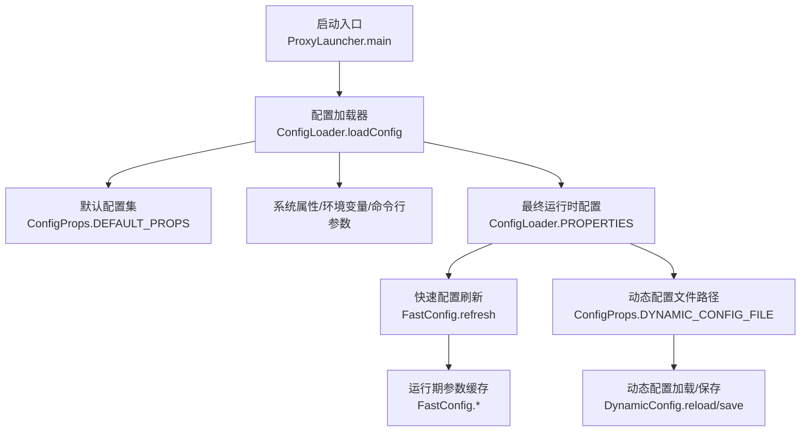
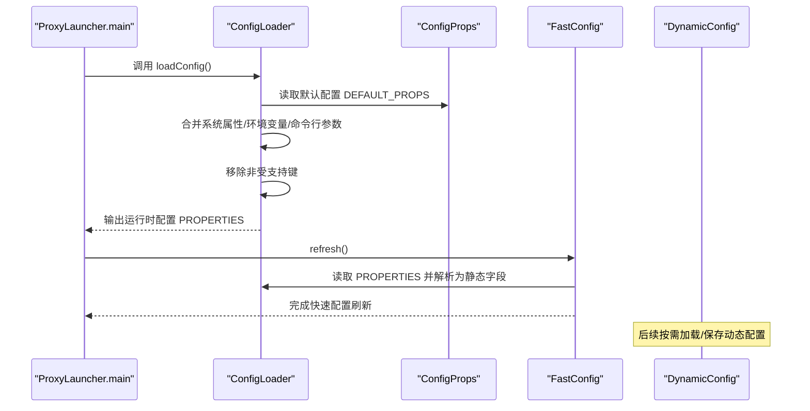
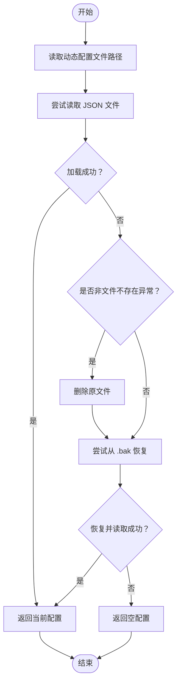
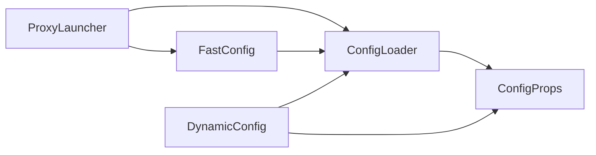

# 配置问题排查

<cite>
**本文引用的文件**
- [proxy-common/src/main/java/com/alibaba/polardbx/proxy/config/ConfigLoader.java](file://proxy-common/src/main/java/com/alibaba/polardbx/proxy/config/ConfigLoader.java)
- [proxy-common/src/main/java/com/alibaba/polardbx/proxy/config/ConfigProps.java](file://proxy-common/src/main/java/com/alibaba/polardbx/proxy/config/ConfigProps.java)
- [proxy-common/src/main/java/com/alibaba/polardbx/proxy/config/FastConfig.java](file://proxy-common/src/main/java/com/alibaba/polardbx/proxy/config/FastConfig.java)
- [proxy-common/src/main/java/com/alibaba/polardbx/proxy/dynamic/DynamicConfig.java](file://proxy-common/src/main/java/com/alibaba/polardbx/proxy/dynamic/DynamicConfig.java)
- [proxy-server/src/main/conf/config.properties](file://proxy-server/src/main/conf/config.properties)
- [proxy-common/src/main/resources/config.properties](file://proxy-common/src/main/resources/config.properties)
- [proxy-server/src/main/conf/logback.xml](file://proxy-server/src/main/conf/logback.xml)
- [proxy-common/src/main/resources/logback.xml](file://proxy-common/src/main/resources/logback.xml)
- [proxy-server/src/main/java/com/alibaba/polardbx/proxy/server/ProxyLauncher.java](file://proxy-server/src/main/java/com/alibaba/polardbx/proxy/server/ProxyLauncher.java)
- [proxy-core/src/main/java/com/alibaba/polardbx/proxy/protocol/handler/request/ShowPropertiesHandler.java](file://proxy-core/src/main/java/com/alibaba/polardbx/proxy/protocol/handler/request/ShowPropertiesHandler.java)
- [proxy-core/src/main/java/com/alibaba/polardbx/proxy/serverless/ReadWriteSplittingPool.java](file://proxy-core/src/main/java/com/alibaba/polardbx/proxy/serverless/ReadWriteSplittingPool.java)
- [proxy-common/src/main/java/com/alibaba/polardbx/proxy/logger/AsyncAppender.java](file://proxy-common/src/main/java/com/alibaba/polardbx/proxy/logger/AsyncAppender.java)
- [proxy-common/src/main/java/com/alibaba/polardbx/proxy/logger/ConsoleFilter.java](file://proxy-common/src/main/java/com/alibaba/polardbx/proxy/logger/ConsoleFilter.java)
- [proxy-server/src/main/assembly/develop.xml](file://proxy-server/src/main/assembly/develop.xml)
- [proxy-server/src/main/assembly/release.xml](file://proxy-server/src/main/assembly/release.xml)
- [polardbx_proxy_user_manual.md](file://polardbx_proxy_user_manual.md)
- [quick_start.sh](file://quick_start.sh)
</cite>

## 目录
1. [简介](#简介)
2. [项目结构](#项目结构)
3. [核心组件](#核心组件)
4. [架构总览](#架构总览)
5. [详细组件分析](#详细组件分析)
6. [依赖分析](#依赖分析)
7. [性能考量](#性能考量)
8. [故障排查指南](#故障排查指南)
9. [结论](#结论)
10. [附录](#附录)

## 简介
本指南聚焦于 PolarDB-X Proxy 的配置问题排查，覆盖以下方面：
- 配置文件加载失败：文件路径、权限与格式校验
- 动态配置更新失败：变更监听、参数校验与回滚机制
- 常见配置项错误：网络端口、数据库连接、日志级别等
- 配置冲突：重复配置、优先级与依赖关系
- 配置验证工具与模板最佳实践
- 热更新注意事项与安全建议

## 项目结构
Proxy 的配置体系由“静态配置”（config.properties）与“动态配置”（JSON 文件）构成，并通过统一的加载器与快速配置刷新机制生效。

图表来源
- [ProxyLauncher.java](file://proxy-server/src/main/java/com/alibaba/polardbx/proxy/server/ProxyLauncher.java#L32-L44)
- [ConfigLoader.java](file://proxy-common/src/main/java/com/alibaba/polardbx/proxy/config/ConfigLoader.java#L39-L71)
- [ConfigProps.java](file://proxy-common/src/main/java/com/alibaba/polardbx/proxy/config/ConfigProps.java#L127-L207)
- [FastConfig.java](file://proxy-common/src/main/java/com/alibaba/polardbx/proxy/config/FastConfig.java#L45-L73)
- [DynamicConfig.java](file://proxy-common/src/main/java/com/alibaba/polardbx/proxy/dynamic/DynamicConfig.java#L69-L128)

章节来源
- [ProxyLauncher.java](file://proxy-server/src/main/java/com/alibaba/polardbx/proxy/server/ProxyLauncher.java#L32-L44)
- [ConfigLoader.java](file://proxy-common/src/main/java/com/alibaba/polardbx/proxy/config/ConfigLoader.java#L39-L71)
- [ConfigProps.java](file://proxy-common/src/main/java/com/alibaba/polardbx/proxy/config/ConfigProps.java#L127-L207)
- [FastConfig.java](file://proxy-common/src/main/java/com/alibaba/polardbx/proxy/config/FastConfig.java#L45-L73)
- [DynamicConfig.java](file://proxy-common/src/main/java/com/alibaba/polardbx/proxy/dynamic/DynamicConfig.java#L69-L128)

## 核心组件
- 配置加载器：负责从多源合并配置，移除未知键，输出运行时配置
- 配置常量集：定义所有受支持的配置键及其默认值
- 快速配置：将常用运行时参数映射到静态字段，便于低开销访问
- 动态配置：以 JSON 形式存储可热更新的集群拓扑等信息，具备备份与恢复能力
- 日志配置：基于 logback 的滚动与异步输出，支持 SQL 日志开关

章节来源
- [ConfigLoader.java](file://proxy-common/src/main/java/com/alibaba/polardbx/proxy/config/ConfigLoader.java#L39-L71)
- [ConfigProps.java](file://proxy-common/src/main/java/com/alibaba/polardbx/proxy/config/ConfigProps.java#L23-L207)
- [FastConfig.java](file://proxy-common/src/main/java/com/alibaba/polardbx/proxy/config/FastConfig.java#L45-L73)
- [DynamicConfig.java](file://proxy-common/src/main/java/com/alibaba/polardbx/proxy/dynamic/DynamicConfig.java#L69-L128)
- [logback.xml（服务端）](file://proxy-server/src/main/conf/logback.xml#L19-L93)
- [logback.xml（公共资源）](file://proxy-common/src/main/resources/logback.xml#L19-L100)

## 架构总览
下图展示配置从加载到生效的关键流程与交互：

图表来源
- [ProxyLauncher.java](file://proxy-server/src/main/java/com/alibaba/polardbx/proxy/server/ProxyLauncher.java#L32-L44)
- [ConfigLoader.java](file://proxy-common/src/main/java/com/alibaba/polardbx/proxy/config/ConfigLoader.java#L39-L71)
- [ConfigProps.java](file://proxy-common/src/main/java/com/alibaba/polardbx/proxy/config/ConfigProps.java#L127-L207)
- [FastConfig.java](file://proxy-common/src/main/java/com/alibaba/polardbx/proxy/config/FastConfig.java#L45-L73)
- [DynamicConfig.java](file://proxy-common/src/main/java/com/alibaba/polardbx/proxy/dynamic/DynamicConfig.java#L69-L128)

## 详细组件分析

### 配置加载器（ConfigLoader）
- 加载顺序：外部配置文件 > 内置资源文件 > 系统属性 > 环境变量 > 命令行参数
- 参数校验：命令行参数必须为“键=值”，否则抛出异常
- 清理策略：移除不在默认配置集中的键，确保运行时配置集可控
- 输出：记录最终配置，便于审计与排障

章节来源
- [ConfigLoader.java](file://proxy-common/src/main/java/com/alibaba/polardbx/proxy/config/ConfigLoader.java#L39-L71)
- [ConfigProps.java](file://proxy-common/src/main/java/com/alibaba/polardbx/proxy/config/ConfigProps.java#L127-L207)

### 配置常量集（ConfigProps）
- 定义全部受支持配置键及默认值，涵盖线程、TCP、前端端口、后端连接、连接池、HA、读写分离、日志、平滑切换、最大包等
- 动态配置文件键：用于定位动态 JSON 文件路径

章节来源
- [ConfigProps.java](file://proxy-common/src/main/java/com/alibaba/polardbx/proxy/config/ConfigProps.java#L23-L207)

### 快速配置（FastConfig）
- 将常用运行时参数映射为静态字段，避免每次访问都进行字符串解析
- 刷新逻辑：从运行时配置集中读取并转换为强类型字段

章节来源
- [FastConfig.java](file://proxy-common/src/main/java/com/alibaba/polardbx/proxy/config/FastConfig.java#L45-L73)

### 动态配置（DynamicConfig）
- 文件路径：来自运行时配置中的动态配置文件键
- 加载流程：尝试读取 JSON 文件；失败则尝试从备份恢复；若仍失败则返回空配置
- 保存流程：先将现有文件重命名为备份，再写入新 JSON
- 异常处理：对非文件不存在异常进行日志记录与清理，保障可用性

图表来源
- [DynamicConfig.java](file://proxy-common/src/main/java/com/alibaba/polardbx/proxy/dynamic/DynamicConfig.java#L69-L128)

章节来源
- [DynamicConfig.java](file://proxy-common/src/main/java/com/alibaba/polardbx/proxy/dynamic/DynamicConfig.java#L69-L128)

### 日志配置（logback）
- 支持控制台与滚动文件输出，异步 appender 可丢弃低级别日志以降低开销
- SQL 日志单独输出，可通过开关控制
- 控制台过滤器仅在特定实例 ID 条件下允许输出

章节来源
- [logback.xml（服务端）](file://proxy-server/src/main/conf/logback.xml#L19-L93)
- [logback.xml（公共资源）](file://proxy-common/src/main/resources/logback.xml#L19-L100)
- [AsyncAppender.java](file://proxy-common/src/main/java/com/alibaba/polardbx/proxy/logger/AsyncAppender.java#L24-L52)
- [ConsoleFilter.java](file://proxy-common/src/main/java/com/alibaba/polardbx/proxy/logger/ConsoleFilter.java#L25-L43)

## 依赖分析
- 启动阶段：ProxyLauncher 负责依次完成配置加载、快速配置刷新、执行器与服务器初始化
- 配置来源：ConfigLoader 统一汇聚，ConfigProps 提供默认值与白名单
- 运行期：FastConfig 将高频访问的配置项缓存为静态字段，提升性能
- 动态配置：DynamicConfig 与 ConfigLoader/ConfigProps 协作，实现 JSON 文件的读写与回退

图表来源
- [ProxyLauncher.java](file://proxy-server/src/main/java/com/alibaba/polardbx/proxy/server/ProxyLauncher.java#L32-L44)
- [ConfigLoader.java](file://proxy-common/src/main/java/com/alibaba/polardbx/proxy/config/ConfigLoader.java#L39-L71)
- [ConfigProps.java](file://proxy-common/src/main/java/com/alibaba/polardbx/proxy/config/ConfigProps.java#L127-L207)
- [FastConfig.java](file://proxy-common/src/main/java/com/alibaba/polardbx/proxy/config/FastConfig.java#L45-L73)
- [DynamicConfig.java](file://proxy-common/src/main/java/com/alibaba/polardbx/proxy/dynamic/DynamicConfig.java#L69-L128)

章节来源
- [ProxyLauncher.java](file://proxy-server/src/main/java/com/alibaba/polardbx/proxy/server/ProxyLauncher.java#L32-L44)
- [ConfigLoader.java](file://proxy-common/src/main/java/com/alibaba/polardbx/proxy/config/ConfigLoader.java#L39-L71)
- [ConfigProps.java](file://proxy-common/src/main/java/com/alibaba/polardbx/proxy/config/ConfigProps.java#L127-L207)
- [FastConfig.java](file://proxy-common/src/main/java/com/alibaba/polardbx/proxy/config/FastConfig.java#L45-L73)
- [DynamicConfig.java](file://proxy-common/src/main/java/com/alibaba/polardbx/proxy/dynamic/DynamicConfig.java#L69-L128)

## 性能考量
- 快速配置：将频繁读取的配置项缓存为静态字段，减少字符串解析与映射开销
- 日志异步：异步 appender 与丢弃策略降低高并发下的日志写入压力
- 线程模型：线程数与反应堆因子影响整体吞吐与延迟，应结合 CPU 与负载调优

章节来源
- [FastConfig.java](file://proxy-common/src/main/java/com/alibaba/polardbx/proxy/config/FastConfig.java#L45-L73)
- [logback.xml（服务端）](file://proxy-server/src/main/conf/logback.xml#L47-L54)
- [logback.xml（公共资源）](file://proxy-common/src/main/resources/logback.xml#L47-L54)

## 故障排查指南

### 一、配置文件加载失败排查
1. 外部配置文件路径
- 通过系统属性指定外部配置文件：启动时传入配置键，加载器会优先读取该文件
- 若未指定，将尝试从类路径加载内置资源文件
- 关注：文件是否存在、是否为文件而非目录、是否有读权限

2. 系统属性/环境变量/命令行参数
- 系统属性与环境变量会合并到运行时配置
- 命令行参数格式必须为“键=值”，否则抛出异常
- 最终配置会移除不在默认配置集中的键，避免脏配置生效

3. 默认配置与覆盖顺序
- 默认配置来自常量集；运行时配置覆盖默认值
- 建议：优先通过外部配置文件管理业务相关参数，避免硬编码

4. 验证与审计
- 使用系统内置显示配置接口导出当前生效配置，核对关键参数
- 关注：密码字段会被掩码显示，便于安全审计

章节来源
- [ConfigLoader.java](file://proxy-common/src/main/java/com/alibaba/polardbx/proxy/config/ConfigLoader.java#L39-L71)
- [ConfigProps.java](file://proxy-common/src/main/java/com/alibaba/polardbx/proxy/config/ConfigProps.java#L127-L207)
- [ShowPropertiesHandler.java](file://proxy-core/src/main/java/com/alibaba/polardbx/proxy/protocol/handler/request/ShowPropertiesHandler.java#L50-L74)

### 二、动态配置更新失败诊断
1. 文件路径与权限
- 动态配置文件路径来自运行时配置中的动态配置文件键
- 写入前会将原文件重命名为备份；若无原文件则直接写入
- 确保运行用户对目标目录有写权限，且磁盘空间充足

2. 格式与校验
- 加载采用 JSON 解析；若解析失败或为空对象，将尝试从备份恢复
- 若备份也损坏，将返回空配置并清空原文件，避免污染

3. 回滚机制
- 成功写入后保留 .bak 备份；若后续加载失败，可手动恢复备份文件

4. 常见错误与修复
- 文件损坏：删除原文件，保留 .bak 并重启加载器，触发恢复
- 路径错误：修正运行时配置中的动态配置文件键，确保指向正确路径
- 权限不足：调整目录权限或以更高权限账户运行

章节来源
- [DynamicConfig.java](file://proxy-common/src/main/java/com/alibaba/polardbx/proxy/dynamic/DynamicConfig.java#L69-L128)
- [ConfigProps.java](file://proxy-common/src/main/java/com/alibaba/polardbx/proxy/config/ConfigProps.java#L55-L56)

### 三、常见配置参数错误与修正
1. 网络端口
- 前端端口：检查前端端口是否被占用；启动脚本会检测常用端口
- 通用服务端口：用于内部 RPC 服务，避免与宿主系统端口冲突

2. 数据库连接
- 后端地址与凭证：确保地址格式正确、用户名/密码有效
- 连接超时：根据网络状况适当增大连接超时时间
- 最大包：根据业务 SQL 大小合理设置最大包

3. 日志级别
- SQL 日志开关：按需开启 SQL 日志以便调试，注意性能影响
- 日志级别：生产环境建议 INFO 或以上，避免过多调试日志

4. 读写分离与权重
- 读权重格式：每项为“地址@权重”，权重范围应在合法区间内
- 权重过大：可能导致流量倾斜，建议均衡分配

章节来源
- [config.properties（服务端）](file://proxy-server/src/main/conf/config.properties#L32-L117)
- [config.properties（公共资源）](file://proxy-common/src/main/resources/config.properties#L24-L29)
- [quick_start.sh](file://quick_start.sh#L46-L57)
- [ReadWriteSplittingPool.java](file://proxy-core/src/main/java/com/alibaba/polardbx/proxy/serverless/ReadWriteSplittingPool.java#L141-L160)
- [logback.xml（服务端）](file://proxy-server/src/main/conf/logback.xml#L86-L93)

### 四、配置冲突与优先级
1. 重复配置
- 多源合并时，后到的配置会覆盖先前的同名键
- 建议：集中管理配置，避免分散覆盖导致不可控结果

2. 优先级冲突
- 外部配置文件 > 内置资源文件 > 系统属性 > 环境变量 > 命令行参数
- 若出现冲突，优先检查外部配置文件与命令行参数

3. 依赖关系
- 线程与反应堆因子共同决定事件循环线程数
- 日志相关参数与性能存在权衡，需结合场景调整

章节来源
- [ConfigLoader.java](file://proxy-common/src/main/java/com/alibaba/polardbx/proxy/config/ConfigLoader.java#L39-L71)
- [config.properties（服务端）](file://proxy-server/src/main/conf/config.properties#L20-L29)

### 五、配置验证工具与模板
1. 配置导出
- 通过系统提供的配置展示接口导出当前生效配置，核对键值
- 密码字段会被掩码显示，便于安全审计

2. 配置模板
- 参考用户手册中的最小可用模板，逐步添加业务参数
- 建议：将“后端地址、用户名、密码、前端端口”作为必填项

3. 打包与分发
- 开发与发布打包会将配置文件放入 conf 目录，便于部署
- 注意：资源中排除了部分文件，确保最终产物包含所需配置

章节来源
- [ShowPropertiesHandler.java](file://proxy-core/src/main/java/com/alibaba/polardbx/proxy/protocol/handler/request/ShowPropertiesHandler.java#L50-L74)
- [polardbx_proxy_user_manual.md](file://polardbx_proxy_user_manual.md#L129-L163)
- [develop.xml](file://proxy-server/src/main/assembly/develop.xml#L44-L61)
- [release.xml](file://proxy-server/src/main/assembly/release.xml#L44-L61)

### 六、热更新注意事项与安全
1. 热更新流程
- 写入动态配置前自动备份；加载失败可回滚
- 建议：在变更前确认备份文件存在，变更后验证加载结果

2. 安全考虑
- 密码与敏感信息：避免在日志中泄露；生产环境建议关闭调试日志
- 权限最小化：仅授予运行所需的最小权限
- 端口与网络：避免暴露不必要的端口，限制来源 IP

章节来源
- [DynamicConfig.java](file://proxy-common/src/main/java/com/alibaba/polardbx/proxy/dynamic/DynamicConfig.java#L112-L128)
- [logback.xml（服务端）](file://proxy-server/src/main/conf/logback.xml#L86-L93)
- [ConsoleFilter.java](file://proxy-common/src/main/java/com/alibaba/polardbx/proxy/logger/ConsoleFilter.java#L25-L43)

## 结论
- 配置加载遵循“外部文件 > 资源文件 > 系统/环境/命令行”的优先级，并严格清理未知键
- 动态配置具备完善的备份与恢复机制，保障变更失败时的系统可用性
- 常见问题多源于路径、权限与格式，建议结合导出配置与日志进行定位
- 生产部署应关注性能与安全，合理设置线程、日志与端口

## 附录
- 启动与端口检查：参考启动脚本对常用端口进行检测
- 用户手册：提供最小配置模板与启动步骤

章节来源
- [quick_start.sh](file://quick_start.sh#L46-L57)
- [polardbx_proxy_user_manual.md](file://polardbx_proxy_user_manual.md#L129-L163)