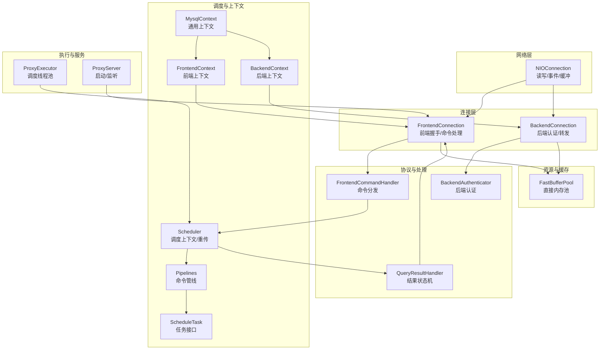
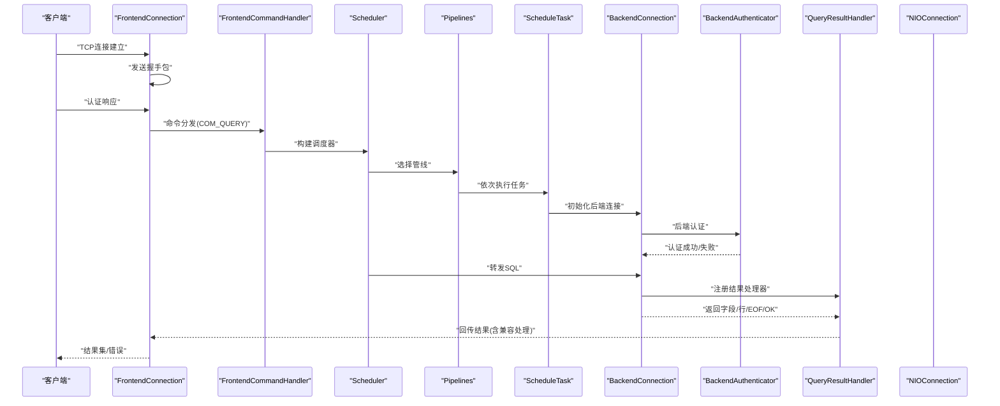
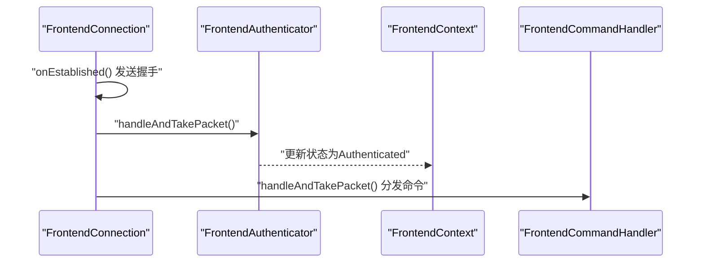
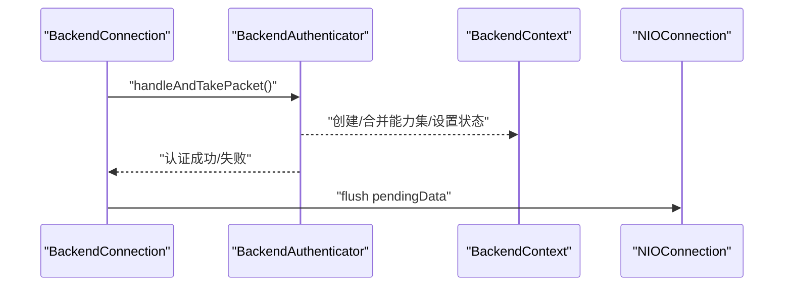
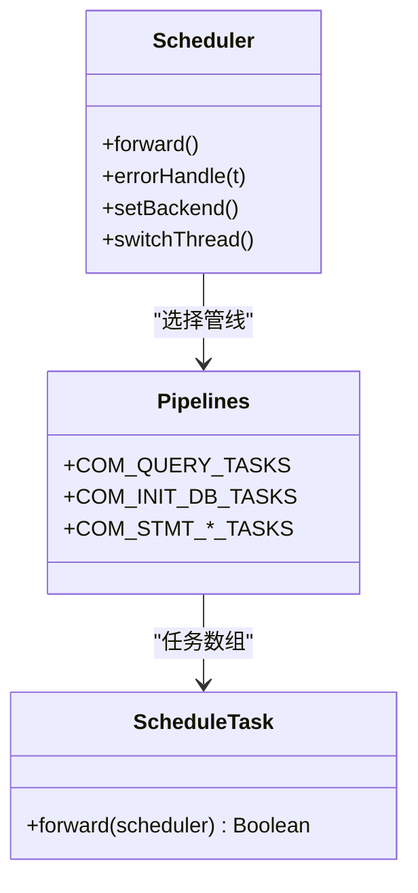
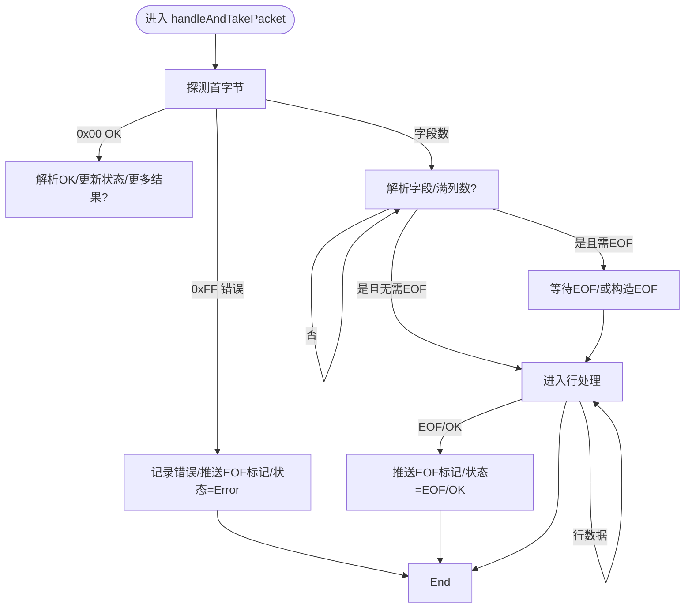
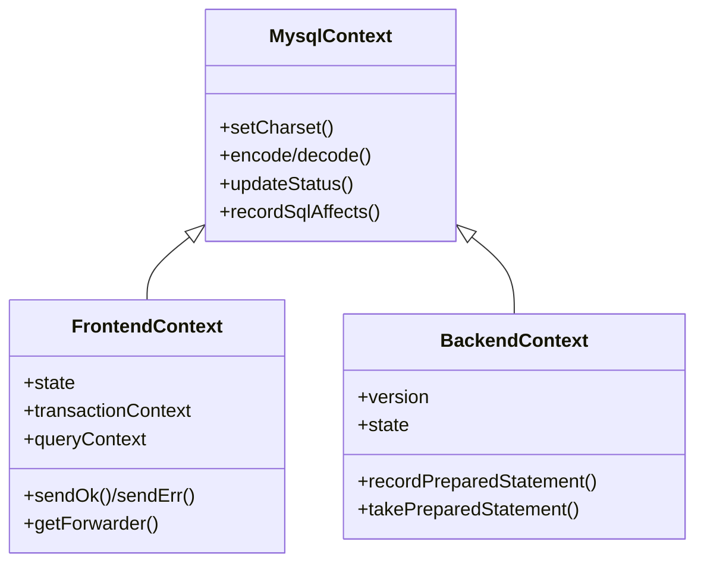
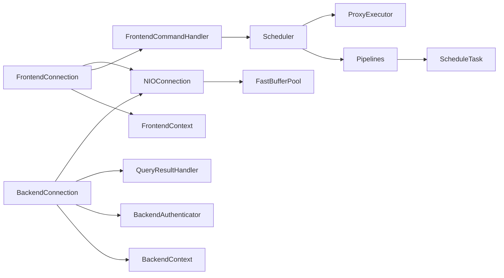

# 数据流分析

<cite>
**本文引用的文件**
- [FrontendConnection.java](file://proxy-core/src/main/java/com/alibaba/polardbx/proxy/connection/FrontendConnection.java)
- [BackendConnection.java](file://proxy-core/src/main/java/com/alibaba/polardbx/proxy/connection/BackendConnection.java)
- [FrontendContext.java](file://proxy-core/src/main/java/com/alibaba/polardbx/proxy/context/FrontendContext.java)
- [BackendContext.java](file://proxy-core/src/main/java/com/alibaba/polardbx/proxy/context/BackendContext.java)
- [MysqlContext.java](file://proxy-core/src/main/java/com/alibaba/polardbx/proxy/context/MysqlContext.java)
- [Scheduler.java](file://proxy-core/src/main/java/com/alibaba/polardbx/proxy/scheduler/Scheduler.java)
- [FrontendCommandHandler.java](file://proxy-core/src/main/java/com/alibaba/polardbx/proxy/protocol/handler/FrontendCommandHandler.java)
- [BackendAuthenticator.java](file://proxy-core/src/main/java/com/alibaba/polardbx/proxy/protocol/handler/BackendAuthenticator.java)
- [QueryResultHandler.java](file://proxy-core/src/main/java/com/alibaba/polardbx/proxy/protocol/handler/result/QueryResultHandler.java)
- [Pipelines.java](file://proxy-core/src/main/java/com/alibaba/polardbx/proxy/scheduler/Pipelines.java)
- [ScheduleTask.java](file://proxy-core/src/main/java/com/alibaba/polardbx/proxy/scheduler/ScheduleTask.java)
- [NIOConnection.java](file://proxy-net/src/main/java/com/alibaba/polardbx/proxy/net/NIOConnection.java)
- [ProxyServer.java](file://proxy-core/src/main/java/com/alibaba/polardbx/proxy/ProxyServer.java)
- [ProxyExecutor.java](file://proxy-core/src/main/java/com/alibaba/polardbx/proxy/ProxyExecutor.java)
- [FastBufferPool.java](file://proxy-common/src/main/java/com/alibaba/polardbx/proxy/utils/FastBufferPool.java)
</cite>

## 目录
1. [引言](#引言)
2. [项目结构](#项目结构)
3. [核心组件](#核心组件)
4. [架构总览](#架构总览)
5. [详细组件分析](#详细组件分析)
6. [依赖关系分析](#依赖关系分析)
7. [性能考量](#性能考量)
8. [故障排查指南](#故障排查指南)
9. [结论](#结论)
10. [附录](#附录)

## 引言
本文件围绕 PolarDB-X Proxy 的数据流进行深入分析，覆盖从客户端连接建立、握手认证、SQL 接收与解析、路由决策、后端执行转发、结果聚合与回传，直至连接关闭的完整链路。重点阐述 FrontendConnection 如何将请求交由 Scheduler 调度，BackendConnection 如何处理后端响应并驱动 QueryResultHandler 状态机，以及 FrontendContext、BackendContext、MysqlContext 等关键上下文对象的生命周期与状态变化。同时给出数据缓存与复用策略（尤其是缓冲池与预处理语句缓存）对内存与性能的影响，并通过多种图示帮助理解复杂的异步处理流程。

## 项目结构
- 核心网络层：NIOConnection 及其子类负责底层 TCP 读写、事件循环与缓冲管理。
- 连接与协议层：FrontendConnection/BackendConnection 继承自 NIOConnection，封装 MySQL 协议握手、认证与命令处理。
- 上下文层：MysqlContext 作为基类，FrontendContext/BackendContext 承载会话状态、能力集、字符集、变量与事务等。
- 调度与管线：Scheduler 持有当前请求与调度上下文；Pipelines 定义不同命令的处理管线；ScheduleTask 为可插拔的处理步骤。
- 结果处理：QueryResultHandler 驱动结果集的状态机，负责字段元数据、行数据、EOF/OK 的聚合与转发。
- 执行器与服务：ProxyExecutor 提供定时/调度线程池；ProxyServer 启动并注册前端监听。

图表来源
- [NIOConnection.java](file://proxy-net/src/main/java/com/alibaba/polardbx/proxy/net/NIOConnection.java#L51-L884)
- [FrontendConnection.java](file://proxy-core/src/main/java/com/alibaba/polardbx/proxy/connection/FrontendConnection.java#L47-L224)
- [BackendConnection.java](file://proxy-core/src/main/java/com/alibaba/polardbx/proxy/connection/BackendConnection.java#L67-L813)
- [FrontendCommandHandler.java](file://proxy-core/src/main/java/com/alibaba/polardbx/proxy/protocol/handler/FrontendCommandHandler.java#L39-L172)
- [BackendAuthenticator.java](file://proxy-core/src/main/java/com/alibaba/polardbx/proxy/protocol/handler/BackendAuthenticator.java#L45-L212)
- [QueryResultHandler.java](file://proxy-core/src/main/java/com/alibaba/polardbx/proxy/protocol/handler/result/QueryResultHandler.java#L57-L568)
- [Scheduler.java](file://proxy-core/src/main/java/com/alibaba/polardbx/proxy/scheduler/Scheduler.java#L46-L315)
- [Pipelines.java](file://proxy-core/src/main/java/com/alibaba/polardbx/proxy/scheduler/Pipelines.java#L21-L129)
- [ScheduleTask.java](file://proxy-core/src/main/java/com/alibaba/polardbx/proxy/scheduler/ScheduleTask.java#L21-L31)
- [ProxyServer.java](file://proxy-core/src/main/java/com/alibaba/polardbx/proxy/ProxyServer.java#L49-L119)
- [ProxyExecutor.java](file://proxy-core/src/main/java/com/alibaba/polardbx/proxy/ProxyExecutor.java#L30-L57)
- [FastBufferPool.java](file://proxy-common/src/main/java/com/alibaba/polardbx/proxy/utils/FastBufferPool.java#L27-L186)

章节来源
- [ProxyServer.java](file://proxy-core/src/main/java/com/alibaba/polardbx/proxy/ProxyServer.java#L49-L119)
- [NIOConnection.java](file://proxy-net/src/main/java/com/alibaba/polardbx/proxy/net/NIOConnection.java#L51-L884)

## 核心组件
- FrontendConnection：前端连接，负责发送握手包、处理认证与命令、将请求交给 FrontendCommandHandler，再由 Scheduler 驱动管线。
- BackendConnection：后端连接，负责与 MySQL 实例建立连接与认证，转发请求并回调 QueryResultHandler。
- FrontendContext/BackendContext/MysqlContext：会话上下文，承载能力集、字符集、状态标志、变量、事务与预处理语句缓存等。
- Scheduler：调度器，持有请求包、解码器/编码器、后端连接引用、重传配置与统计计时，按管线顺序执行 ScheduleTask。
- FrontendCommandHandler：前端命令分发器，根据命令类型选择对应管线。
- BackendAuthenticator：后端认证处理器，处理握手、认证结果与切换。
- QueryResultHandler：结果状态机，处理字段元数据、行数据、EOF/OK，支持阻塞拉取与流控。
- Pipelines/ScheduleTask：命令到任务的映射与任务接口，实现可插拔的处理步骤。
- NIOConnection：抽象网络连接，提供读写队列、缓冲池、事件注册与流量控制。
- ProxyExecutor/ProxyServer：执行器与服务入口，提供调度线程池与前端监听。

章节来源
- [FrontendConnection.java](file://proxy-core/src/main/java/com/alibaba/polardbx/proxy/connection/FrontendConnection.java#L47-L224)
- [BackendConnection.java](file://proxy-core/src/main/java/com/alibaba/polardbx/proxy/connection/BackendConnection.java#L67-L813)
- [FrontendContext.java](file://proxy-core/src/main/java/com/alibaba/polardbx/proxy/context/FrontendContext.java#L45-L308)
- [BackendContext.java](file://proxy-core/src/main/java/com/alibaba/polardbx/proxy/context/BackendContext.java#L37-L156)
- [MysqlContext.java](file://proxy-core/src/main/java/com/alibaba/polardbx/proxy/context/MysqlContext.java#L49-L266)
- [Scheduler.java](file://proxy-core/src/main/java/com/alibaba/polardbx/proxy/scheduler/Scheduler.java#L46-L315)
- [FrontendCommandHandler.java](file://proxy-core/src/main/java/com/alibaba/polardbx/proxy/protocol/handler/FrontendCommandHandler.java#L39-L172)
- [BackendAuthenticator.java](file://proxy-core/src/main/java/com/alibaba/polardbx/proxy/protocol/handler/BackendAuthenticator.java#L45-L212)
- [QueryResultHandler.java](file://proxy-core/src/main/java/com/alibaba/polardbx/proxy/protocol/handler/result/QueryResultHandler.java#L57-L568)
- [Pipelines.java](file://proxy-core/src/main/java/com/alibaba/polardbx/proxy/scheduler/Pipelines.java#L21-L129)
- [ScheduleTask.java](file://proxy-core/src/main/java/com/alibaba/polardbx/proxy/scheduler/ScheduleTask.java#L21-L31)
- [NIOConnection.java](file://proxy-net/src/main/java/com/alibaba/polardbx/proxy/net/NIOConnection.java#L51-L884)
- [ProxyExecutor.java](file://proxy-core/src/main/java/com/alibaba/polardbx/proxy/ProxyExecutor.java#L30-L57)

## 架构总览
下面以序列图展示一次典型查询从客户端到后端再到前端回传的完整数据流。

图表来源
- [FrontendConnection.java](file://proxy-core/src/main/java/com/alibaba/polardbx/proxy/connection/FrontendConnection.java#L88-L160)
- [FrontendCommandHandler.java](file://proxy-core/src/main/java/com/alibaba/polardbx/proxy/protocol/handler/FrontendCommandHandler.java#L68-L170)
- [Scheduler.java](file://proxy-core/src/main/java/com/alibaba/polardbx/proxy/scheduler/Scheduler.java#L300-L314)
- [Pipelines.java](file://proxy-core/src/main/java/com/alibaba/polardbx/proxy/scheduler/Pipelines.java#L34-L47)
- [BackendConnection.java](file://proxy-core/src/main/java/com/alibaba/polardbx/proxy/connection/BackendConnection.java#L118-L200)
- [BackendAuthenticator.java](file://proxy-core/src/main/java/com/alibaba/polardbx/proxy/protocol/handler/BackendAuthenticator.java#L69-L210)
- [QueryResultHandler.java](file://proxy-core/src/main/java/com/alibaba/polardbx/proxy/protocol/handler/result/QueryResultHandler.java#L177-L465)
- [NIOConnection.java](file://proxy-net/src/main/java/com/alibaba/polardbx/proxy/net/NIOConnection.java#L369-L371)

## 详细组件分析

### 前端连接与握手认证
- FrontendConnection 在连接建立后发送握手包，设置初始状态为 Greeting；随后进入认证阶段，FrontendAuthenticator 处理认证流程，认证成功后切换到 Authenticated 状态。
- FrontendContext 管理前端会话状态、能力集、字符集、事务与预处理语句上下文，并提供快速 OK/ERR 发送路径。
- FrontendCommandHandler 根据命令类型选择对应管线，构建 Scheduler 并调用 forward()。

图表来源
- [FrontendConnection.java](file://proxy-core/src/main/java/com/alibaba/polardbx/proxy/connection/FrontendConnection.java#L88-L160)
- [FrontendContext.java](file://proxy-core/src/main/java/com/alibaba/polardbx/proxy/context/FrontendContext.java#L48-L124)
- [FrontendCommandHandler.java](file://proxy-core/src/main/java/com/alibaba/polardbx/proxy/protocol/handler/FrontendCommandHandler.java#L68-L170)

章节来源
- [FrontendConnection.java](file://proxy-core/src/main/java/com/alibaba/polardbx/proxy/connection/FrontendConnection.java#L88-L160)
- [FrontendContext.java](file://proxy-core/src/main/java/com/alibaba/polardbx/proxy/context/FrontendContext.java#L48-L124)
- [FrontendCommandHandler.java](file://proxy-core/src/main/java/com/alibaba/polardbx/proxy/protocol/handler/FrontendCommandHandler.java#L68-L170)

### 后端连接与认证
- BackendConnection 在 onEstablished() 后等待后端握手；BackendAuthenticator 解析握手、校验协议能力、构造响应并发送认证挑战；认证成功后设置 BackendContext 状态为 Authenticated，并释放等待队列中的待发请求。
- BackendContext 维护后端连接的版本、状态、字符集、全局变量与预处理语句缓存；提供 LRU 缓存淘汰回调，确保释放不再使用的预处理语句。

图表来源
- [BackendConnection.java](file://proxy-core/src/main/java/com/alibaba/polardbx/proxy/connection/BackendConnection.java#L118-L200)
- [BackendAuthenticator.java](file://proxy-core/src/main/java/com/alibaba/polardbx/proxy/protocol/handler/BackendAuthenticator.java#L69-L210)
- [BackendContext.java](file://proxy-core/src/main/java/com/alibaba/polardbx/proxy/context/BackendContext.java#L37-L156)

章节来源
- [BackendConnection.java](file://proxy-core/src/main/java/com/alibaba/polardbx/proxy/connection/BackendConnection.java#L118-L200)
- [BackendAuthenticator.java](file://proxy-core/src/main/java/com/alibaba/polardbx/proxy/protocol/handler/BackendAuthenticator.java#L69-L210)
- [BackendContext.java](file://proxy-core/src/main/java/com/alibaba/polardbx/proxy/context/BackendContext.java#L37-L156)

### 调度与管线
- Scheduler 持有 FrontendConnection、FrontendContext、请求包与解/编码器，维护重传限制、LSN、准备时间等统计；按 Pipelines 中定义的顺序执行 ScheduleTask。
- 不同命令（COM_QUERY、COM_INIT_DB、COM_STMT_* 等）对应不同的管线，包含解码、系统命令检测、后端选择、LSN 获取与设置、变量恢复/收集、转发等步骤。

图表来源
- [Scheduler.java](file://proxy-core/src/main/java/com/alibaba/polardbx/proxy/scheduler/Scheduler.java#L46-L315)
- [Pipelines.java](file://proxy-core/src/main/java/com/alibaba/polardbx/proxy/scheduler/Pipelines.java#L21-L129)
- [ScheduleTask.java](file://proxy-core/src/main/java/com/alibaba/polardbx/proxy/scheduler/ScheduleTask.java#L21-L31)

章节来源
- [Scheduler.java](file://proxy-core/src/main/java/com/alibaba/polardbx/proxy/scheduler/Scheduler.java#L46-L315)
- [Pipelines.java](file://proxy-core/src/main/java/com/alibaba/polardbx/proxy/scheduler/Pipelines.java#L21-L129)
- [ScheduleTask.java](file://proxy-core/src/main/java/com/alibaba/polardbx/proxy/scheduler/ScheduleTask.java#L21-L31)

### 结果聚合与回传
- QueryResultHandler 驱动状态机：Init → Fields → FieldsEOF → Rows → EOF/OK；在 FieldsEOF 与 Rows 阶段进行兼容性处理（如 CLIENT_DEPRECATE_EOF），必要时重写 EOF/OK 包并调整序列号。
- 支持阻塞拉取 next()/consume()/update()，并在流控时暂停后端读取、注册写恢复监听，避免背压导致的内存膨胀。
- 当存在多结果集时，自动链式创建子处理器，保证每个结果集独立处理。

图表来源
- [QueryResultHandler.java](file://proxy-core/src/main/java/com/alibaba/polardbx/proxy/protocol/handler/result/QueryResultHandler.java#L177-L465)

章节来源
- [QueryResultHandler.java](file://proxy-core/src/main/java/com/alibaba/polardbx/proxy/protocol/handler/result/QueryResultHandler.java#L57-L568)

### 关键上下文生命周期与状态变化
- MysqlContext：统一管理字符集、能力集、状态标志（事务、自动提交、游标）、用户/系统变量、最大包大小、权限与数据库信息等；提供编码/解码工具与状态同步。
- FrontendContext：扩展 MysqlContext，增加状态机、事务引用计数、查询上下文、预处理语句上下文表；提供快速 OK/ERR 发送与 MysqlForwarder。
- BackendContext：扩展 MysqlContext，增加后端版本、一致性状态、活动后端连接引用与预处理语句 LRU 缓存；缓存淘汰时主动关闭后端对应语句，避免资源泄漏。

图表来源
- [MysqlContext.java](file://proxy-core/src/main/java/com/alibaba/polardbx/proxy/context/MysqlContext.java#L49-L266)
- [FrontendContext.java](file://proxy-core/src/main/java/com/alibaba/polardbx/proxy/context/FrontendContext.java#L45-L308)
- [BackendContext.java](file://proxy-core/src/main/java/com/alibaba/polardbx/proxy/context/BackendContext.java#L37-L156)

章节来源
- [MysqlContext.java](file://proxy-core/src/main/java/com/alibaba/polardbx/proxy/context/MysqlContext.java#L49-L266)
- [FrontendContext.java](file://proxy-core/src/main/java/com/alibaba/polardbx/proxy/context/FrontendContext.java#L45-L308)
- [BackendContext.java](file://proxy-core/src/main/java/com/alibaba/polardbx/proxy/context/BackendContext.java#L37-L156)

### 数据缓存与复用策略
- 直接内存缓冲池 FastBufferPool：采用直接内存块池化，通过原子栈管理空闲块，BufferHolder 引用计数控制回收，显著降低 GC 压力与拷贝成本。
- 预处理语句缓存：BackendContext 使用 LRU 缓存后端预处理语句 ID，淘汰回调中主动关闭不再使用的语句，避免后端资源泄漏。
- 字符集与能力集：MysqlContext 统一维护字符集索引与 Java 字符集映射，减少重复转换开销；能力集在握手阶段协商，避免运行期反复判断。

章节来源
- [FastBufferPool.java](file://proxy-common/src/main/java/com/alibaba/polardbx/proxy/utils/FastBufferPool.java#L27-L186)
- [BackendContext.java](file://proxy-core/src/main/java/com/alibaba/polardbx/proxy/context/BackendContext.java#L57-L156)
- [MysqlContext.java](file://proxy-core/src/main/java/com/alibaba/polardbx/proxy/context/MysqlContext.java#L128-L151)

## 依赖关系分析
- FrontendConnection 依赖 FrontendContext 与 FrontendCommandHandler；FrontendCommandHandler 依赖 Pipelines 与 Scheduler。
- BackendConnection 依赖 BackendContext 与 BackendAuthenticator；与 QueryResultHandler 通过 ResultHandler 队列交互。
- Scheduler 依赖 Pipelines 与多个 ScheduleTask 实现；通过 ProxyExecutor 提供的调度线程池执行重传与延时操作。
- NIOConnection 为所有连接提供统一的读写、事件与缓冲管理；FrontendConnection/BackendConnection 借助 FastBufferPool 与写队列实现高效传输。

图表来源
- [FrontendConnection.java](file://proxy-core/src/main/java/com/alibaba/polardbx/proxy/connection/FrontendConnection.java#L47-L224)
- [BackendConnection.java](file://proxy-core/src/main/java/com/alibaba/polardbx/proxy/connection/BackendConnection.java#L67-L813)
- [FrontendCommandHandler.java](file://proxy-core/src/main/java/com/alibaba/polardbx/proxy/protocol/handler/FrontendCommandHandler.java#L39-L172)
- [BackendAuthenticator.java](file://proxy-core/src/main/java/com/alibaba/polardbx/proxy/protocol/handler/BackendAuthenticator.java#L45-L212)
- [QueryResultHandler.java](file://proxy-core/src/main/java/com/alibaba/polardbx/proxy/protocol/handler/result/QueryResultHandler.java#L57-L568)
- [Scheduler.java](file://proxy-core/src/main/java/com/alibaba/polardbx/proxy/scheduler/Scheduler.java#L46-L315)
- [ProxyExecutor.java](file://proxy-core/src/main/java/com/alibaba/polardbx/proxy/ProxyExecutor.java#L30-L57)
- [NIOConnection.java](file://proxy-net/src/main/java/com/alibaba/polardbx/proxy/net/NIOConnection.java#L51-L884)
- [FastBufferPool.java](file://proxy-common/src/main/java/com/alibaba/polardbx/proxy/utils/FastBufferPool.java#L27-L186)

章节来源
- [FrontendConnection.java](file://proxy-core/src/main/java/com/alibaba/polardbx/proxy/connection/FrontendConnection.java#L47-L224)
- [BackendConnection.java](file://proxy-core/src/main/java/com/alibaba/polardbx/proxy/connection/BackendConnection.java#L67-L813)
- [Scheduler.java](file://proxy-core/src/main/java/com/alibaba/polardbx/proxy/scheduler/Scheduler.java#L46-L315)

## 性能考量
- 缓冲池与零拷贝：FastBufferPool 使用直接内存块池化，BufferHolder 引用计数避免频繁分配与 GC；NIOConnection 内部读写缓冲与合并写队列减少系统调用次数。
- 流量控制：QueryResultHandler 在前端写阻塞时暂停后端读取，并注册写恢复监听，防止背压导致内存暴涨。
- 预处理语句缓存：LRU 缓存后端预处理语句 ID，淘汰时主动关闭，降低后端资源占用与网络往返。
- 线程模型：ProxyExecutor 提供调度与定时线程池，用于重传与延时任务，避免阻塞业务线程。

## 故障排查指南
- 认证失败：BackendAuthenticator 在认证失败时设置错误状态并关闭连接；FrontendContext 提供快速 ERR 发送路径。
- 连接异常：NIOConnection 对 EOF 与异常进行统一处理，必要时关闭连接；FrontendConnection/BackendConnection 在 fatal error 时关闭自身。
- 结果处理异常：QueryResultHandler 在 Abort/Error 状态抛出异常并推送 EOF 标记；Scheduler.errorHandle 支持在允许条件下进行重传。
- 资源泄漏：FrontendContext/BackendContext/QueryResultHandler 在 close() 中清理内部资源与回调，确保上下文安全释放。

章节来源
- [BackendAuthenticator.java](file://proxy-core/src/main/java/com/alibaba/polardbx/proxy/protocol/handler/BackendAuthenticator.java#L191-L210)
- [FrontendContext.java](file://proxy-core/src/main/java/com/alibaba/polardbx/proxy/context/FrontendContext.java#L254-L306)
- [QueryResultHandler.java](file://proxy-core/src/main/java/com/alibaba/polardbx/proxy/protocol/handler/result/QueryResultHandler.java#L490-L503)
- [NIOConnection.java](file://proxy-net/src/main/java/com/alibaba/polardbx/proxy/net/NIOConnection.java#L576-L585)
- [Scheduler.java](file://proxy-core/src/main/java/com/alibaba/polardbx/proxy/scheduler/Scheduler.java#L234-L297)

## 结论
PolarDB-X Proxy 的数据流以 NIOConnection 为基础，通过 FrontendConnection/BackendConnection 将 MySQL 协议与调度管线解耦，借助 FrontendContext/BackendContext/MysqlContext 统一管理会话状态与资源，配合 FastBufferPool 与预处理语句缓存实现高性能与低延迟。Scheduler 与 Pipelines 将复杂查询路由与执行拆分为可插拔的任务，QueryResultHandler 则在后端与前端之间提供可靠的结果聚合与回传。整体设计在保证功能灵活性的同时，兼顾了内存效率与运行时稳定性。

## 附录
- 启动流程：ProxyServer 初始化工作线程、HA 管理器、权限刷新器与服务注册，随后启动 NIOAcceptor 监听前端端口，接受 SocketChannel 并创建 FrontendConnection。
- 执行器：ProxyExecutor 提供调度与定时线程池，用于重传与延时任务的异步执行。

章节来源
- [ProxyServer.java](file://proxy-core/src/main/java/com/alibaba/polardbx/proxy/ProxyServer.java#L56-L96)
- [ProxyExecutor.java](file://proxy-core/src/main/java/com/alibaba/polardbx/proxy/ProxyExecutor.java#L34-L55)