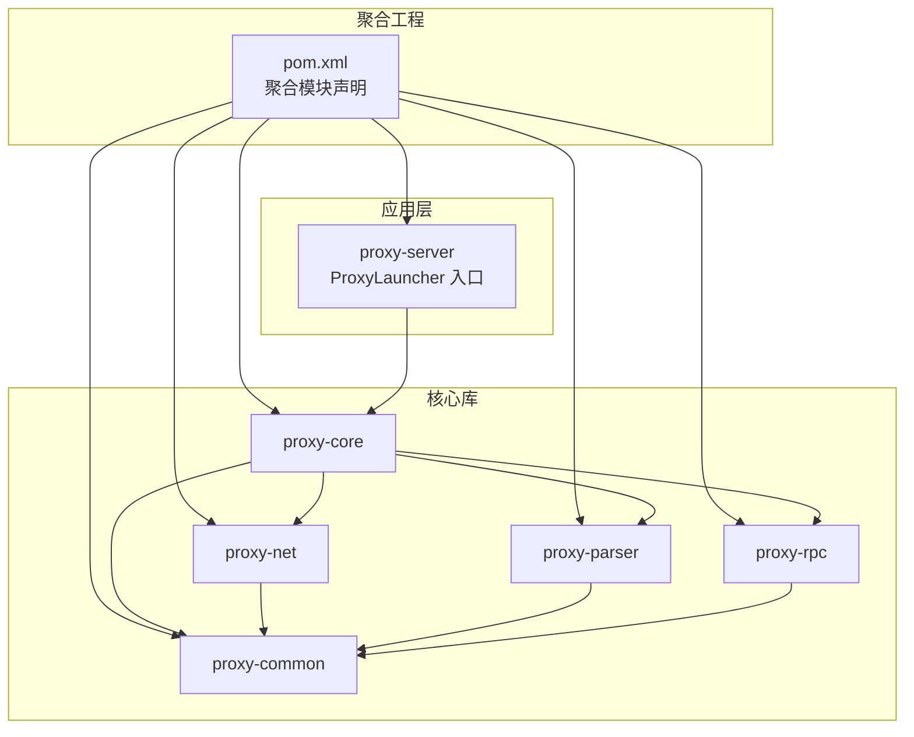
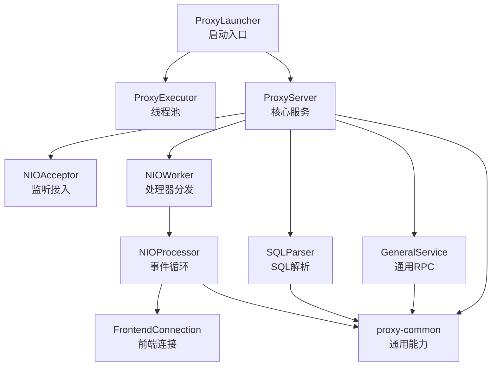
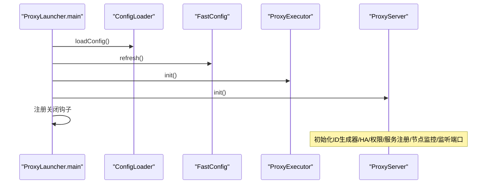
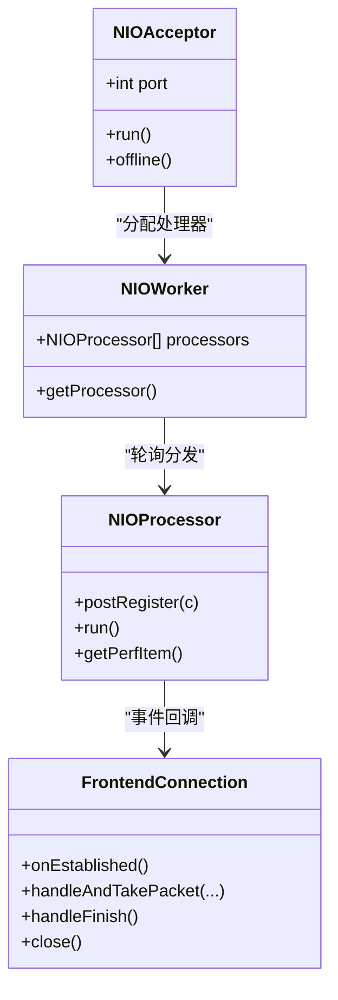
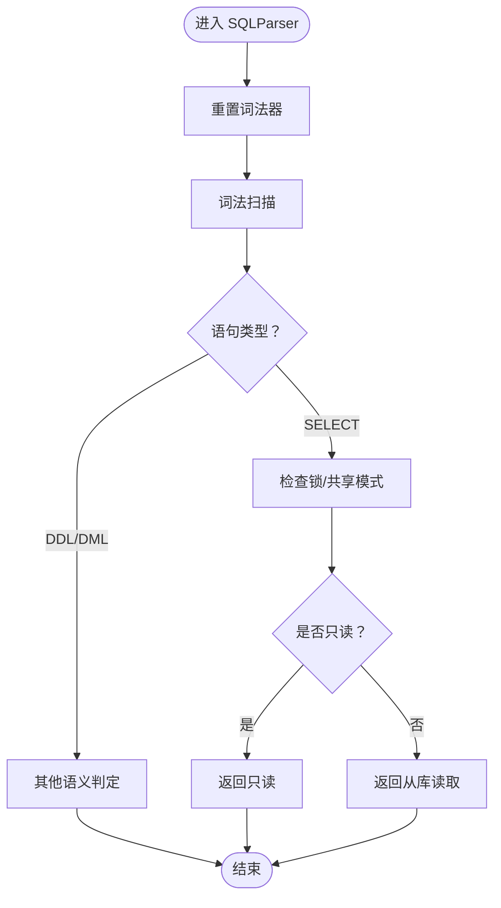
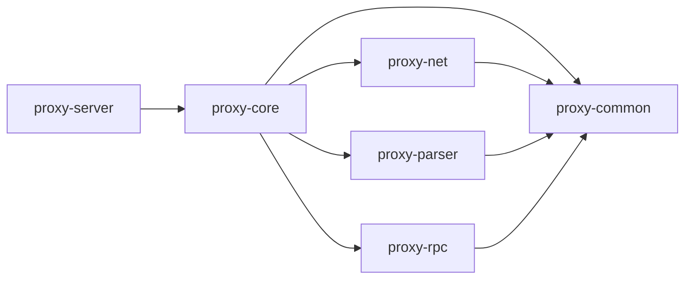

# 整体架构概览

<cite>
**本文引用的文件**
- [pom.xml](file://pom.xml)
- [README.md](file://README.md)
- [proxy-server/src/main/java/com/alibaba/polardbx/proxy/server/ProxyLauncher.java](file://proxy-server/src/main/java/com/alibaba/polardbx/proxy/server/ProxyLauncher.java)
- [proxy-core/src/main/java/com/alibaba/polardbx/proxy/ProxyServer.java](file://proxy-core/src/main/java/com/alibaba/polardbx/proxy/ProxyServer.java)
- [proxy-core/src/main/java/com/alibaba/polardbx/proxy/ProxyExecutor.java](file://proxy-core/src/main/java/com/alarda/polardbx/proxy/ProxyExecutor.java)
- [proxy-core/src/main/java/com/alibaba/polardbx/proxy/connection/FrontendConnection.java](file://proxy-core/src/main/java/com/alibaba/polardbx/proxy/connection/FrontendConnection.java)
- [proxy-net/src/main/java/com/alibaba/polardbx/proxy/net/NIOAcceptor.java](file://proxy-net/src/main/java/com/alibaba/polardbx/proxy/net/NIOAcceptor.java)
- [proxy-net/src/main/java/com/alibaba/polardbx/proxy/net/NIOProcessor.java](file://proxy-net/src/main/java/com/alibaba/polardbx/proxy/net/NIOProcessor.java)
- [proxy-net/src/main/java/com/alibaba/polardbx/proxy/net/NIOWorker.java](file://proxy-net/src/main/java/com/alibaba/polardbx/proxy/net/NIOWorker.java)
- [proxy-common/src/main/java/com/alibaba/polardbx/proxy/config/ConfigLoader.java](file://proxy-common/src/main/java/com/alibaba/polardbx/proxy/config/ConfigLoader.java)
- [proxy-common/src/main/java/com/alibaba/polardbx/proxy/config/FastConfig.java](file://proxy-common/src/main/java/com/alibaba/polardbx/proxy/config/FastConfig.java)
- [proxy-parser/src/main/java/com/alibaba/polardbx/proxy/parser/recognizer/SQLParser.java](file://proxy-parser/src/main/java/com/alibaba/polardbx/proxy/parser/recognizer/SQLParser.java)
- [proxy-rpc/src/main/proto/GeneralService.proto](file://proxy-rpc/src/main/proto/GeneralService.proto)
- [proxy-common/pom.xml](file://proxy-common/pom.xml)
- [proxy-net/pom.xml](file://proxy-net/pom.xml)
- [proxy-core/pom.xml](file://proxy-core/pom.xml)
- [proxy-parser/pom.xml](file://proxy-parser/pom.xml)
- [proxy-rpc/pom.xml](file://proxy-rpc/pom.xml)
</cite>

## 目录
1. [引言](#引言)
2. [项目结构](#项目结构)
3. [核心组件](#核心组件)
4. [架构总览](#架构总览)
5. [详细组件分析](#详细组件分析)
6. [依赖分析](#依赖分析)
7. [性能考虑](#性能考虑)
8. [故障排查指南](#故障排查指南)
9. [结论](#结论)
10. [附录](#附录)

## 引言
本文件面向希望全面理解 PolarDB-X Proxy 的开发者与运维人员，提供系统级的架构概览与深入分析。目标包括：
- 阐述高层设计理念与核心价值主张（高性能、可扩展、可观测、易维护）
- 描述分层架构与模块化设计思路，明确各模块职责边界与依赖关系
- 解释启动流程、初始化顺序与组件生命周期管理
- 总结架构决策的技术考量（模块化、高内聚低耦合、异步事件驱动、连接池与缓冲池等）
- 提供系统架构图与组件关系图，帮助快速建立整体认知

## 项目结构
PolarDB-X Proxy 采用多模块聚合工程组织，核心模块包括：
- proxy-common：通用工具、日志、配置与动态配置等基础能力
- proxy-net：NIO 网络层，包含接受器、处理器、工作线程与连接工厂
- proxy-parser：SQL 解析器与词法/语法识别器
- proxy-rpc：基于 gRPC 的通用服务定义与处理桩
- proxy-core：核心业务逻辑，包含连接上下文、命令处理、调度器、集群与权限等
- proxy-server：应用入口与打包装配

图表来源
- [pom.xml](file://pom.xml#L30-L37)
- [proxy-server/src/main/java/com/alibaba/polardbx/proxy/server/ProxyLauncher.java](file://proxy-server/src/main/java/com/alibaba/polardbx/proxy/server/ProxyLauncher.java#L29-L55)
- [proxy-core/pom.xml](file://proxy-core/pom.xml#L38-L61)
- [proxy-net/pom.xml](file://proxy-net/pom.xml#L38-L43)
- [proxy-parser/pom.xml](file://proxy-parser/pom.xml#L38-L43)
- [proxy-rpc/pom.xml](file://proxy-rpc/pom.xml#L38-L43)
- [proxy-common/pom.xml](file://proxy-common/pom.xml#L38-L83)

章节来源
- [pom.xml](file://pom.xml#L30-L37)
- [README.md](file://README.md#L1-L14)

## 核心组件
- 启动入口与生命周期
  - ProxyLauncher：负责加载配置、刷新动态配置、初始化执行器与服务器实例，并注册 JVM 关闭钩子
  - ProxyServer：负责初始化 ID 生成器、HA 线程池、服务注册、监听端口、接受连接等
  - ProxyExecutor：集中管理业务线程池与定时器线程池
- 网络层
  - NIOAcceptor：阻塞式监听与非阻塞接入，将新连接交由 NIOWorker 分配给 NIOProcessor
  - NIOProcessor：事件循环线程，负责注册、读写事件分发与性能统计
  - NIOWorker：管理多个 NIOProcessor 并进行轮询分发
  - FrontendConnection：面向客户端的连接抽象，封装握手、鉴权、命令处理与资源回收
- 解析与协议
  - SQLParser：MySQL 语法解析与语义判定（只读、从库读取、权限变更等）
- RPC 服务
  - GeneralService.proto：定义通用服务接口，用于跨进程/节点通信

章节来源
- [proxy-server/src/main/java/com/alibaba/polardbx/proxy/server/ProxyLauncher.java](file://proxy-server/src/main/java/com/alibaba/polardbx/proxy/server/ProxyLauncher.java#L29-L55)
- [proxy-core/src/main/java/com/alibaba/polardbx/proxy/ProxyServer.java](file://proxy-core/src/main/java/com/alibaba/polardbx/proxy/ProxyServer.java#L56-L96)
- [proxy-core/src/main/java/com/alibaba/polardbx/proxy/ProxyExecutor.java](file://proxy-core/src/main/java/com/alibaba/polardbx/proxy/ProxyExecutor.java#L34-L39)
- [proxy-net/src/main/java/com/alibaba/polardbx/proxy/net/NIOAcceptor.java](file://proxy-net/src/main/java/com/alibaba/polardbx/proxy/net/NIOAcceptor.java#L46-L59)
- [proxy-net/src/main/java/com/alibaba/polardbx/proxy/net/NIOProcessor.java](file://proxy-net/src/main/java/com/alibaba/polardbx/proxy/net/NIOProcessor.java#L52-L65)
- [proxy-net/src/main/java/com/alibaba/polardbx/proxy/net/NIOWorker.java](file://proxy-net/src/main/java/com/alibaba/polardbx/proxy/net/NIOWorker.java#L59-L88)
- [proxy-core/src/main/java/com/alibaba/polardbx/proxy/connection/FrontendConnection.java](file://proxy-core/src/main/java/com/alibaba/polardbx/proxy/connection/FrontendConnection.java#L61-L86)
- [proxy-parser/src/main/java/com/alibaba/polardbx/proxy/parser/recognizer/SQLParser.java](file://proxy-parser/src/main/java/com/alibaba/polardbx/proxy/parser/recognizer/SQLParser.java#L36-L51)
- [proxy-rpc/src/main/proto/GeneralService.proto](file://proxy-rpc/src/main/proto/GeneralService.proto)

## 架构总览
系统采用“应用入口 → 核心服务 → 多功能子模块”的分层设计：
- 应用入口层：ProxyLauncher 负责启动与关闭钩子
- 核心服务层：ProxyServer 组织网络、调度、权限、HA、服务注册等核心能力
- 子模块层：proxy-common 提供通用能力；proxy-net 提供高性能 NIO；proxy-parser 提供 SQL 解析；proxy-rpc 提供通用 RPC 接口

图表来源
- [proxy-server/src/main/java/com/alibaba/polardbx/proxy/server/ProxyLauncher.java](file://proxy-server/src/main/java/com/alibaba/polardbx/proxy/server/ProxyLauncher.java#L32-L44)
- [proxy-core/src/main/java/com/alibaba/polardbx/proxy/ProxyServer.java](file://proxy-core/src/main/java/com/alibaba/polardbx/proxy/ProxyServer.java#L90-L96)
- [proxy-net/src/main/java/com/alibaba/polardbx/proxy/net/NIOAcceptor.java](file://proxy-net/src/main/java/com/alibaba/polardbx/proxy/net/NIOAcceptor.java#L67-L76)
- [proxy-net/src/main/java/com/alibaba/polardbx/proxy/net/NIOWorker.java](file://proxy-net/src/main/java/com/alibaba/polardbx/proxy/net/NIOWorker.java#L82-L88)
- [proxy-net/src/main/java/com/alibaba/polardbx/proxy/net/NIOProcessor.java](file://proxy-net/src/main/java/com/alibaba/polardbx/proxy/net/NIOProcessor.java#L84-L113)
- [proxy-core/src/main/java/com/alibaba/polardbx/proxy/connection/FrontendConnection.java](file://proxy-core/src/main/java/com/alibaba/polardbx/proxy/connection/FrontendConnection.java#L114-L143)
- [proxy-parser/src/main/java/com/alibaba/polardbx/proxy/parser/recognizer/SQLParser.java](file://proxy-parser/src/main/java/com/alibaba/polardbx/proxy/parser/recognizer/SQLParser.java#L36-L51)
- [proxy-rpc/src/main/proto/GeneralService.proto](file://proxy-rpc/src/main/proto/GeneralService.proto)

## 详细组件分析

### 启动流程与初始化顺序
- 加载配置：ConfigLoader 从文件或资源加载默认配置，再叠加系统属性、环境变量与命令行参数，最后清理未知键
- 刷新动态配置：FastConfig 将配置映射到静态字段，供运行时使用
- 初始化执行器：ProxyExecutor 创建业务线程池与定时器线程池
- 初始化服务器：ProxyServer 构造并初始化 ID 生成器、HA 线程池、权限刷新器、服务注册、节点监控、监听端口与接受器
- 注册关闭钩子：JVM 停机时触发 Kill 逻辑，确保优雅退出

图表来源
- [proxy-server/src/main/java/com/alibaba/polardbx/proxy/server/ProxyLauncher.java](file://proxy-server/src/main/java/com/alibaba/polardbx/proxy/server/ProxyLauncher.java#L32-L44)
- [proxy-core/src/main/java/com/alibaba/polardbx/proxy/ProxyServer.java](file://proxy-core/src/main/java/com/alibaba/polardbx/proxy/ProxyServer.java#L56-L96)
- [proxy-core/src/main/java/com/alibaba/polardbx/proxy/ProxyExecutor.java](file://proxy-core/src/main/java/com/alibaba/polardbx/proxy/ProxyExecutor.java#L51-L55)
- [proxy-common/src/main/java/com/alibaba/polardbx/proxy/config/ConfigLoader.java](file://proxy-common/src/main/java/com/alibaba/polardbx/proxy/config/ConfigLoader.java#L39-L71)
- [proxy-common/src/main/java/com/alibaba/polardbx/proxy/config/FastConfig.java](file://proxy-common/src/main/java/com/alibaba/polardbx/proxy/config/FastConfig.java#L45-L73)

章节来源
- [proxy-server/src/main/java/com/alibaba/polardbx/proxy/server/ProxyLauncher.java](file://proxy-server/src/main/java/com/alibaba/polardbx/proxy/server/ProxyLauncher.java#L32-L55)
- [proxy-core/src/main/java/com/alibaba/polardbx/proxy/ProxyServer.java](file://proxy-core/src/main/java/com/alibaba/polardbx/proxy/ProxyServer.java#L56-L96)
- [proxy-core/src/main/java/com/alibaba/polardbx/proxy/ProxyExecutor.java](file://proxy-core/src/main/java/com/alibaba/polardbx/proxy/ProxyExecutor.java#L34-L39)
- [proxy-common/src/main/java/com/alibaba/polardbx/proxy/config/ConfigLoader.java](file://proxy-common/src/main/java/com/alibaba/polardbx/proxy/config/ConfigLoader.java#L39-L71)
- [proxy-common/src/main/java/com/alibaba/polardbx/proxy/config/FastConfig.java](file://proxy-common/src/main/java/com/alibaba/polardbx/proxy/config/FastConfig.java#L45-L73)

### 网络层组件关系
- NIOAcceptor：绑定端口、接受连接、设置 TCP 参数、非阻塞注册到选择器
- NIOWorker：按轮询策略选择 NIOProcessor
- NIOProcessor：事件循环、批量注册连接、事件分发、性能统计
- FrontendConnection：握手、鉴权、命令处理、资源回收

图表来源
- [proxy-net/src/main/java/com/alibaba/polardbx/proxy/net/NIOAcceptor.java](file://proxy-net/src/main/java/com/alibaba/polardbx/proxy/net/NIOAcceptor.java#L46-L59)
- [proxy-net/src/main/java/com/alibaba/polardbx/proxy/net/NIOWorker.java](file://proxy-net/src/main/java/com/alibaba/polardbx/proxy/net/NIOWorker.java#L82-L88)
- [proxy-net/src/main/java/com/alibaba/polardbx/proxy/net/NIOProcessor.java](file://proxy-net/src/main/java/com/alibaba/polardbx/proxy/net/NIOProcessor.java#L67-L70)
- [proxy-core/src/main/java/com/alibaba/polardbx/proxy/connection/FrontendConnection.java](file://proxy-core/src/main/java/com/alibaba/polardbx/proxy/connection/FrontendConnection.java#L88-L111)

章节来源
- [proxy-net/src/main/java/com/alibaba/polardbx/proxy/net/NIOAcceptor.java](file://proxy-net/src/main/java/com/alibaba/polardbx/proxy/net/NIOAcceptor.java#L61-L106)
- [proxy-net/src/main/java/com/alibaba/polardbx/proxy/net/NIOProcessor.java](file://proxy-net/src/main/java/com/alibaba/polardbx/proxy/net/NIOProcessor.java#L84-L113)
- [proxy-net/src/main/java/com/alibaba/polardbx/proxy/net/NIOWorker.java](file://proxy-net/src/main/java/com/alibaba/polardbx/proxy/net/NIOWorker.java#L59-L88)
- [proxy-core/src/main/java/com/alibaba/polardbx/proxy/connection/FrontendConnection.java](file://proxy-core/src/main/java/com/alibaba/polardbx/proxy/connection/FrontendConnection.java#L114-L166)

### SQL 解析与语义判定
- SQLParser 支持多语句检测、只读判定、从库读取判定、权限数据库变更判定等
- 通过词法与语法分析，为后续路由与权限控制提供依据

图表来源
- [proxy-parser/src/main/java/com/alibaba/polardbx/proxy/parser/recognizer/SQLParser.java](file://proxy-parser/src/main/java/com/alibaba/polardbx/proxy/parser/recognizer/SQLParser.java#L53-L136)

章节来源
- [proxy-parser/src/main/java/com/alibaba/polardbx/proxy/parser/recognizer/SQLParser.java](file://proxy-parser/src/main/java/com/alibaba/polardbx/proxy/parser/recognizer/SQLParser.java#L36-L200)

### RPC 服务与通用接口
- GeneralService.proto 定义通用服务接口，结合 gRPC 实现跨模块/跨进程通信
- 与 proxy-rpc 模块协同，支撑服务注册、心跳、状态同步等能力

章节来源
- [proxy-rpc/src/main/proto/GeneralService.proto](file://proxy-rpc/src/main/proto/GeneralService.proto)

## 依赖分析
- 模块依赖
  - proxy-server 依赖 proxy-core
  - proxy-core 依赖 proxy-common、proxy-net、proxy-parser、proxy-rpc
  - proxy-net 依赖 proxy-common
  - proxy-parser 依赖 proxy-common
  - proxy-rpc 依赖 proxy-common，并引入 gRPC 运行时与编译插件
- 依赖方向清晰，遵循“上层服务依赖下层能力”的原则，避免循环依赖

图表来源
- [proxy-core/pom.xml](file://proxy-core/pom.xml#L38-L61)
- [proxy-net/pom.xml](file://proxy-net/pom.xml#L38-L43)
- [proxy-parser/pom.xml](file://proxy-parser/pom.xml#L38-L43)
- [proxy-rpc/pom.xml](file://proxy-rpc/pom.xml#L38-L66)
- [proxy-common/pom.xml](file://proxy-common/pom.xml#L38-L83)

章节来源
- [proxy-core/pom.xml](file://proxy-core/pom.xml#L38-L61)
- [proxy-net/pom.xml](file://proxy-net/pom.xml#L38-L43)
- [proxy-parser/pom.xml](file://proxy-parser/pom.xml#L38-L43)
- [proxy-rpc/pom.xml](file://proxy-rpc/pom.xml#L38-L66)
- [proxy-common/pom.xml](file://proxy-common/pom.xml#L38-L83)

## 性能考虑
- 事件驱动与零拷贝倾向：NIOProcessor 使用 Selector 事件循环，减少线程切换；FrontendConnection 在握手与命令处理中尽量复用编码器与解码器
- 缓冲池优化：NIOProcessor 内置 FastBufferPool，按线程均分内存，限制最大直接内存占用，降低 GC 压力
- 线程模型：NIOWorker 动态计算处理器数量与每线程缓冲块数，结合 JVM 最大堆估算上限，保证稳定性能
- 执行器分离：业务线程池与定时器线程池分离，避免相互干扰
- 只读/从库读取判定：在解析阶段尽早判断，减少无效后端调用

章节来源
- [proxy-net/src/main/java/com/alibaba/polardbx/proxy/net/NIOProcessor.java](file://proxy-net/src/main/java/com/alibaba/polardbx/proxy/net/NIOProcessor.java#L52-L65)
- [proxy-net/src/main/java/com/alibaba/polardbx/proxy/net/NIOWorker.java](file://proxy-net/src/main/java/com/alibaba/polardbx/proxy/net/NIOWorker.java#L39-L68)
- [proxy-core/src/main/java/com/alibaba/polardbx/proxy/ProxyExecutor.java](file://proxy-core/src/main/java/com/alibaba/polardbx/proxy/ProxyExecutor.java#L34-L39)
- [proxy-parser/src/main/java/com/alibaba/polardbx/proxy/parser/recognizer/SQLParser.java](file://proxy-parser/src/main/java/com/alibaba/polardbx/proxy/parser/recognizer/SQLParser.java#L64-L136)

## 故障排查指南
- 启动失败
  - 检查配置加载：确认 server.conf 或资源文件存在，且 serverArgs 格式正确
  - 查看动态配置刷新：FastConfig 字段是否被正确解析
  - 关注 ProxyLauncher 的错误日志与 Kill 行为
- 连接异常
  - NIOAcceptor 是否成功绑定端口、是否触发 offline
  - NIOProcessor 事件循环是否正常，是否存在大量取消的 SelectionKey
  - FrontendConnection 在握手/鉴权/命令处理阶段是否有异常栈
- 资源泄漏
  - FrontendConnection 的 close 流程是否在异步任务中释放鉴权器与命令处理器
- 线程池问题
  - ProxyExecutor 的线程数配置是否合理，是否存在任务堆积

章节来源
- [proxy-server/src/main/java/com/alibaba/polardbx/proxy/server/ProxyLauncher.java](file://proxy-server/src/main/java/com/alibaba/polardbx/proxy/server/ProxyLauncher.java#L40-L54)
- [proxy-net/src/main/java/com/alibaba/polardbx/proxy/net/NIOAcceptor.java](file://proxy-net/src/main/java/com/alibaba/polardbx/proxy/net/NIOAcceptor.java#L126-L136)
- [proxy-net/src/main/java/com/alibaba/polardbx/proxy/net/NIOProcessor.java](file://proxy-net/src/main/java/com/alibaba/polardbx/proxy/net/NIOProcessor.java#L84-L113)
- [proxy-core/src/main/java/com/alibaba/polardbx/proxy/connection/FrontendConnection.java](file://proxy-core/src/main/java/com/alibaba/polardbx/proxy/connection/FrontendConnection.java#L168-L200)
- [proxy-core/src/main/java/com/alibaba/polardbx/proxy/ProxyExecutor.java](file://proxy-core/src/main/java/com/alibaba/polardbx/proxy/ProxyExecutor.java#L34-L39)

## 结论
PolarDB-X Proxy 通过模块化与分层架构实现了高性能、可扩展与可维护的代理服务。其关键优势包括：
- 明确的职责边界与依赖方向，便于独立演进与测试
- 以 NIO 事件驱动为核心，配合缓冲池与线程池，兼顾吞吐与延迟
- 在解析层完成语义判定，为路由与安全控制提供前置保障
- 通过统一的启动与生命周期管理，确保系统稳定上线与优雅退出

## 附录
- 快速构建：执行 mvn clean package -DskipTests
- 用户手册：参见用户手册文档

章节来源
- [README.md](file://README.md#L7-L14)