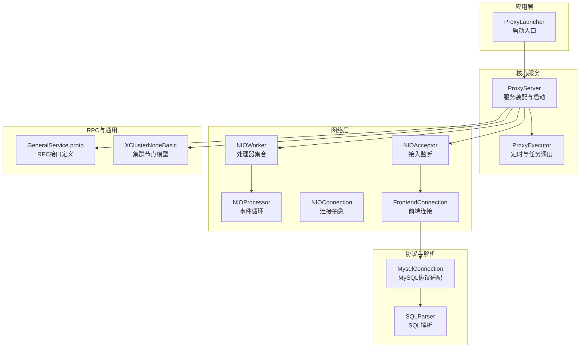
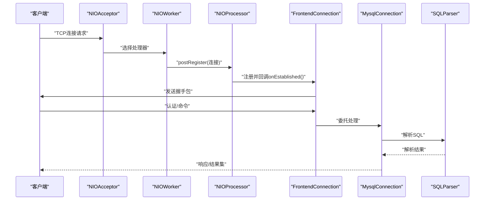
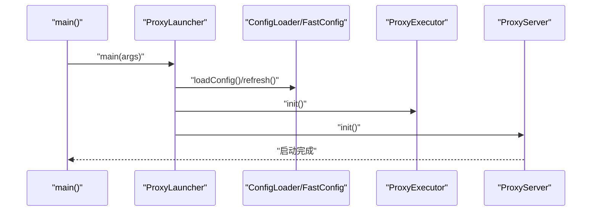
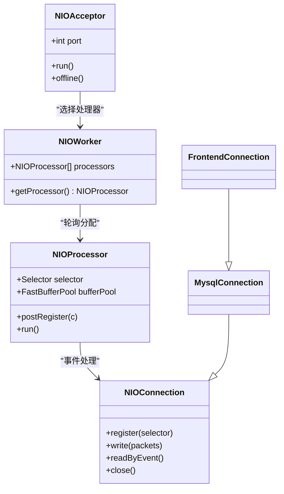
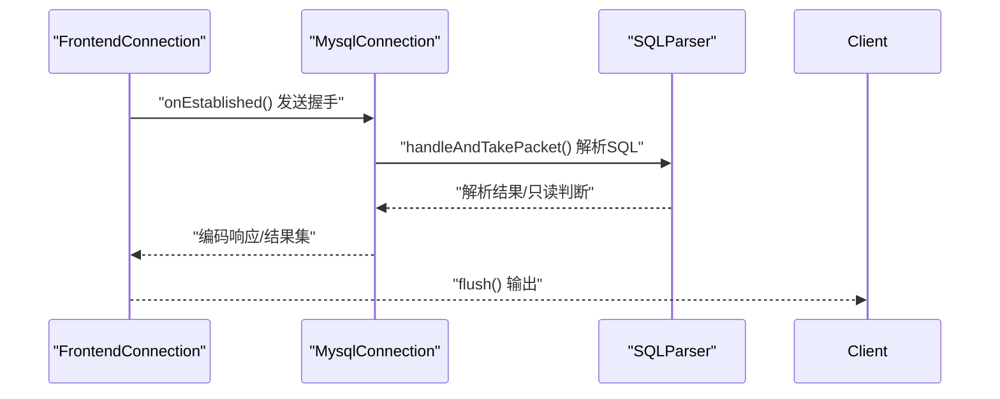
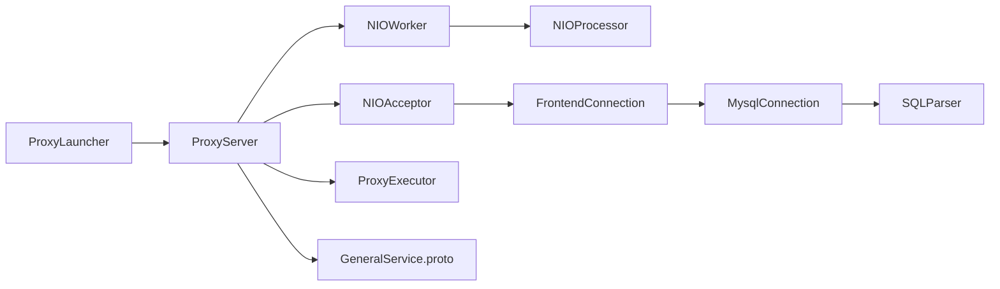
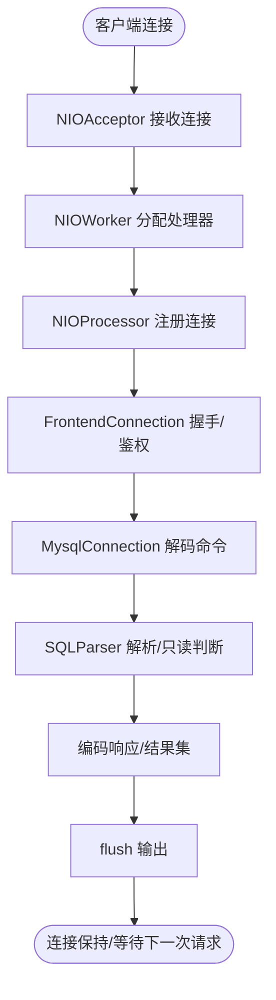

# 架构设计

<cite>
**本文引用的文件**
- [README.md](file://README.md)
- [pom.xml](file://pom.xml)
- [ProxyLauncher.java](file://proxy-server/src/main/java/com/alibaba/polardbx/proxy/server/ProxyLauncher.java)
- [ProxyServer.java](file://proxy-core/src/main/java/com/alibaba/polardbx/proxy/ProxyServer.java)
- [ProxyExecutor.java](file://proxy-core/src/main/java/com/alibaba/polardbx/proxy/ProxyExecutor.java)
- [NIOAcceptor.java](file://proxy-net/src/main/java/com/alibaba/polardbx/proxy/net/NIOAcceptor.java)
- [NIOProcessor.java](file://proxy-net/src/main/java/com/alibaba/polardbx/proxy/net/NIOProcessor.java)
- [NIOWorker.java](file://proxy-net/src/main/java/com/alibaba/polardbx/proxy/net/NIOWorker.java)
- [NIOConnection.java](file://proxy-net/src/main/java/com/alibaba/polardbx/proxy/net/NIOConnection.java)
- [FrontendConnection.java](file://proxy-core/src/main/java/com/alibaba/polardbx/proxy/connection/FrontendConnection.java)
- [MysqlConnection.java](file://proxy-core/src/main/java/com/alibaba/polardbx/proxy/connection/MysqlConnection.java)
- [SQLParser.java](file://proxy-parser/src/main/java/com/alibaba/polardbx/proxy/parser/recognizer/SQLParser.java)
- [GeneralService.proto](file://proxy-rpc/src/main/proto/GeneralService.proto)
- [XClusterNodeBasic.java](file://proxy-common/src/main/java/com/alibaba/polardbx/proxy/common/XClusterNodeBasic.java)
</cite>

## 目录
1. [引言](#引言)
2. [项目结构](#项目结构)
3. [核心组件](#核心组件)
4. [架构总览](#架构总览)
5. [详细组件分析](#详细组件分析)
6. [依赖关系分析](#依赖关系分析)
7. [性能考量](#性能考量)
8. [故障排查指南](#故障排查指南)
9. [结论](#结论)
10. [附录](#附录)

## 引言
本文件面向PolarDB-X Proxy的架构设计与实现，聚焦于异步事件驱动的Reactor模式、模块化分层（proxy-common、proxy-net、proxy-core、proxy-parser、proxy-rpc）以及核心组件之间的协作关系。文档从系统边界与高层理念出发，逐步深入到数据流与处理流程，解释从客户端连接建立、命令解析、路由与转发，到结果返回的完整链路，并对技术选型与权衡进行说明，最后给出基础设施要求、可扩展性与部署拓扑建议。

## 项目结构
PolarDB-X Proxy采用多模块聚合工程组织，核心模块如下：
- proxy-server：启动入口与装配容器，负责加载配置、初始化执行器与服务端。
- proxy-common：通用工具、集群节点模型与动态配置等基础能力。
- proxy-net：基于Java NIO的Reactor网络层，抽象出连接、处理器与工作线程池。
- proxy-core：核心业务逻辑，包括连接管理、协议编解码、命令处理、调度与HA等。
- proxy-parser：SQL词法与语法识别，支持只读判断、多语句解析等。
- proxy-rpc：通用RPC接口定义与服务封装，用于内部或跨节点通信。

图表来源
- [ProxyLauncher.java](file://proxy-server/src/main/java/com/alibaba/polardbx/proxy/server/ProxyLauncher.java#L32-L55)
- [ProxyServer.java](file://proxy-core/src/main/java/com/alibaba/polardbx/proxy/ProxyServer.java#L92-L93)
- [NIOAcceptor.java](file://proxy-net/src/main/java/com/alibaba/polardbx/proxy/net/NIOAcceptor.java#L46-L59)
- [NIOWorker.java](file://proxy-net/src/main/java/com/alibaba/polardbx/proxy/net/NIOWorker.java#L59-L88)
- [NIOProcessor.java](file://proxy-net/src/main/java/com/alibaba/polardbx/proxy/net/NIOProcessor.java#L37-L65)
- [NIOConnection.java](file://proxy-net/src/main/java/com/alibaba/polardbx/proxy/net/NIOConnection.java#L51-L230)
- [FrontendConnection.java](file://proxy-core/src/main/java/com/alibaba/polardbx/proxy/connection/FrontendConnection.java#L47-L86)
- [MysqlConnection.java](file://proxy-core/src/main/java/com/alibaba/polardbx/proxy/connection/MysqlConnection.java#L37-L94)
- [SQLParser.java](file://proxy-parser/src/main/java/com/alibaba/polardbx/proxy/parser/recognizer/SQLParser.java#L36-L51)
- [GeneralService.proto](file://proxy-rpc/src/main/proto/GeneralService.proto#L8-L20)
- [XClusterNodeBasic.java](file://proxy-common/src/main/java/com/alibaba/polardbx/proxy/common/XClusterNodeBasic.java#L28-L62)

章节来源
- [pom.xml](file://pom.xml#L30-L37)
- [README.md](file://README.md#L1-L14)

## 核心组件
- ProxyLauncher：应用启动入口，负责加载配置、初始化执行器与服务端。
- ProxyServer：服务装配中心，初始化HA、权限刷新、服务注册、节点监控与接入监听器。
- ProxyExecutor：全局调度器，提供定时任务与周期性任务线程池。
- NIOAcceptor：非阻塞接入监听，接收新连接并交由NIOWorker挑选处理器。
- NIOWorker：维护多个NIOProcessor，按轮询策略分配连接。
- NIOProcessor：单线程事件循环，统一处理注册、读写事件与性能统计。
- NIOConnection：连接抽象，封装读写缓冲、状态机、流量控制与生命周期。
- FrontendConnection：前端连接，负责握手、鉴权与命令处理。
- MysqlConnection：MySQL协议适配，实现包探测、解码与编码。
- SQLParser：SQL解析器，支持只读判断、多语句与数据库切换等。
- GeneralService.proto：通用RPC接口定义，用于跨进程或跨模块调用。
- XClusterNodeBasic：集群节点模型，承载节点元信息与角色。

章节来源
- [ProxyLauncher.java](file://proxy-server/src/main/java/com/alibaba/polardbx/proxy/server/ProxyLauncher.java#L32-L55)
- [ProxyServer.java](file://proxy-core/src/main/java/com/alibaba/polardbx/proxy/ProxyServer.java#L56-L96)
- [ProxyExecutor.java](file://proxy-core/src/main/java/com/alibaba/polardbx/proxy/ProxyExecutor.java#L34-L55)
- [NIOAcceptor.java](file://proxy-net/src/main/java/com/alibaba/polardbx/proxy/net/NIOAcceptor.java#L46-L107)
- [NIOWorker.java](file://proxy-net/src/main/java/com/alibaba/polardbx/proxy/net/NIOWorker.java#L59-L88)
- [NIOProcessor.java](file://proxy-net/src/main/java/com/alibaba/polardbx/proxy/net/NIOProcessor.java#L37-L114)
- [NIOConnection.java](file://proxy-net/src/main/java/com/alibaba/polardbx/proxy/net/NIOConnection.java#L51-L363)
- [FrontendConnection.java](file://proxy-core/src/main/java/com/alibaba/polardbx/proxy/connection/FrontendConnection.java#L47-L166)
- [MysqlConnection.java](file://proxy-core/src/main/java/com/alibaba/polardbx/proxy/connection/MysqlConnection.java#L37-L147)
- [SQLParser.java](file://proxy-parser/src/main/java/com/alibaba/polardbx/proxy/parser/recognizer/SQLParser.java#L36-L136)
- [GeneralService.proto](file://proxy-rpc/src/main/proto/GeneralService.proto#L8-L20)
- [XClusterNodeBasic.java](file://proxy-common/src/main/java/com/alibaba/polardbx/proxy/common/XClusterNodeBasic.java#L28-L90)

## 架构总览
PolarDB-X Proxy采用Reactor模式构建异步事件驱动的网络层，结合多线程与无锁队列实现高并发与低延迟。整体架构分为三层：
- 接入层：NIOAcceptor监听端口，NIOWorker选择处理器，NIOProcessor单线程事件循环。
- 协议与业务层：FrontendConnection负责握手与命令处理；MysqlConnection实现MySQL协议；SQLParser进行SQL解析与只读判定。
- 服务与通用层：ProxyServer装配服务、HA与监控；ProxyExecutor提供调度；RPC与通用模型支撑跨模块通信。

图表来源
- [NIOAcceptor.java](file://proxy-net/src/main/java/com/alibaba/polardbx/proxy/net/NIOAcceptor.java#L61-L81)
- [NIOProcessor.java](file://proxy-net/src/main/java/com/alibaba/polardbx/proxy/net/NIOProcessor.java#L67-L114)
- [FrontendConnection.java](file://proxy-core/src/main/java/com/alibaba/polardbx/proxy/connection/FrontendConnection.java#L88-L111)
- [MysqlConnection.java](file://proxy-core/src/main/java/com/alibaba/polardbx/proxy/connection/MysqlConnection.java#L95-L147)
- [SQLParser.java](file://proxy-parser/src/main/java/com/alibaba/polardbx/proxy/parser/recognizer/SQLParser.java#L277-L334)

## 详细组件分析

### 启动与装配流程
- ProxyLauncher负责加载配置、刷新快速配置、初始化ProxyExecutor与ProxyServer。
- ProxyServer完成HA、权限刷新、服务注册、节点监控与接入监听器初始化，并启动NIOAcceptor。
- ProxyExecutor提供调度线程池，供后续任务使用。

图表来源
- [ProxyLauncher.java](file://proxy-server/src/main/java/com/alibaba/polardbx/proxy/server/ProxyLauncher.java#L32-L55)
- [ProxyServer.java](file://proxy-core/src/main/java/com/alibaba/polardbx/proxy/ProxyServer.java#L113-L118)

章节来源
- [ProxyLauncher.java](file://proxy-server/src/main/java/com/alibaba/polardbx/proxy/server/ProxyLauncher.java#L32-L55)
- [ProxyServer.java](file://proxy-core/src/main/java/com/alibaba/polardbx/proxy/ProxyServer.java#L113-L118)
- [ProxyExecutor.java](file://proxy-core/src/main/java/com/alibaba/polardbx/proxy/ProxyExecutor.java#L51-L55)

### 网络层Reactor模式
- NIOAcceptor以非阻塞方式监听端口，接受连接后交由NIOWorker选择处理器。
- NIOWorker维护多个NIOProcessor，采用原子计数轮询分配，保证负载均衡。
- NIOProcessor单线程事件循环，处理注册、读写事件，使用FastBufferPool复用缓冲区。
- NIOConnection封装连接状态、读写缓冲、流量控制与资源清理，支持自动释放与错误恢复。

图表来源
- [NIOAcceptor.java](file://proxy-net/src/main/java/com/alibaba/polardbx/proxy/net/NIOAcceptor.java#L46-L107)
- [NIOWorker.java](file://proxy-net/src/main/java/com/alibaba/polardbx/proxy/net/NIOWorker.java#L59-L88)
- [NIOProcessor.java](file://proxy-net/src/main/java/com/alibaba/polardbx/proxy/net/NIOProcessor.java#L37-L114)
- [NIOConnection.java](file://proxy-net/src/main/java/com/alibaba/polardbx/proxy/net/NIOConnection.java#L51-L363)
- [FrontendConnection.java](file://proxy-core/src/main/java/com/alibaba/polardbx/proxy/connection/FrontendConnection.java#L47-L86)
- [MysqlConnection.java](file://proxy-core/src/main/java/com/alibaba/polardbx/proxy/connection/MysqlConnection.java#L37-L94)

章节来源
- [NIOAcceptor.java](file://proxy-net/src/main/java/com/alibaba/polardbx/proxy/net/NIOAcceptor.java#L46-L107)
- [NIOWorker.java](file://proxy-net/src/main/java/com/alibaba/polardbx/proxy/net/NIOWorker.java#L59-L88)
- [NIOProcessor.java](file://proxy-net/src/main/java/com/alibaba/polardbx/proxy/net/NIOProcessor.java#L37-L114)
- [NIOConnection.java](file://proxy-net/src/main/java/com/alibaba/polardbx/proxy/net/NIOConnection.java#L51-L363)

### 前端连接与协议处理
- FrontendConnection在连接建立后发送握手包，随后进入鉴权与命令处理阶段。
- MysqlConnection实现MySQL包探测、解码与编码，支持大包拼接与序列号管理。
- 处理完成后通过Encoder统一flush，确保响应及时送达。

图表来源
- [FrontendConnection.java](file://proxy-core/src/main/java/com/alibaba/polardbx/proxy/connection/FrontendConnection.java#L88-L166)
- [MysqlConnection.java](file://proxy-core/src/main/java/com/alibaba/polardbx/proxy/connection/MysqlConnection.java#L95-L147)
- [SQLParser.java](file://proxy-parser/src/main/java/com/alibaba/polardbx/proxy/parser/recognizer/SQLParser.java#L64-L136)

章节来源
- [FrontendConnection.java](file://proxy-core/src/main/java/com/alibaba/polardbx/proxy/connection/FrontendConnection.java#L88-L166)
- [MysqlConnection.java](file://proxy-core/src/main/java/com/alibaba/polardbx/proxy/connection/MysqlConnection.java#L95-L147)
- [SQLParser.java](file://proxy-parser/src/main/java/com/alibaba/polardbx/proxy/parser/recognizer/SQLParser.java#L64-L136)

### 模块化设计与职责划分
- proxy-common：提供通用工具、日志异步化、地址解析、线程命名、动态配置与集群节点模型。
- proxy-net：提供Reactor网络栈，抽象连接、处理器与工作线程池，支持高性能缓冲复用。
- proxy-core：实现连接上下文、事务与预处理上下文、权限体系、协议编解码、命令处理器、调度器与HA监控。
- proxy-parser：提供MySQL词法与语法识别，支持只读判断、多语句解析与数据库切换。
- proxy-rpc：定义通用RPC接口，便于跨模块或跨进程通信。

章节来源
- [XClusterNodeBasic.java](file://proxy-common/src/main/java/com/alibaba/polardbx/proxy/common/XClusterNodeBasic.java#L28-L90)
- [NIOConnection.java](file://proxy-net/src/main/java/com/alibaba/polardbx/proxy/net/NIOConnection.java#L51-L363)
- [FrontendConnection.java](file://proxy-core/src/main/java/com/alibaba/polardbx/proxy/connection/FrontendConnection.java#L47-L166)
- [SQLParser.java](file://proxy-parser/src/main/java/com/alibaba/polardbx/proxy/parser/recognizer/SQLParser.java#L36-L136)
- [GeneralService.proto](file://proxy-rpc/src/main/proto/GeneralService.proto#L8-L20)

## 依赖关系分析
- 启动依赖：ProxyLauncher → ProxyServer → NIOAcceptor/NIOWorker/NIOProcessor。
- 连接依赖：NIOAcceptor → FrontendConnection → MysqlConnection → SQLParser。
- 调度依赖：FrontendConnection → ProxyExecutor（关闭资源时异步释放）。
- 服务依赖：ProxyServer → HA/权限/服务注册 → RPC接口。

图表来源
- [ProxyLauncher.java](file://proxy-server/src/main/java/com/alibaba/polardbx/proxy/server/ProxyLauncher.java#L32-L55)
- [ProxyServer.java](file://proxy-core/src/main/java/com/alibaba/polardbx/proxy/ProxyServer.java#L92-L93)
- [NIOAcceptor.java](file://proxy-net/src/main/java/com/alibaba/polardbx/proxy/net/NIOAcceptor.java#L61-L81)
- [FrontendConnection.java](file://proxy-core/src/main/java/com/alibaba/polardbx/proxy/connection/FrontendConnection.java#L193-L205)
- [ProxyExecutor.java](file://proxy-core/src/main/java/com/alibaba/polardbx/proxy/ProxyExecutor.java#L51-L55)
- [GeneralService.proto](file://proxy-rpc/src/main/proto/GeneralService.proto#L8-L20)

章节来源
- [pom.xml](file://pom.xml#L30-L37)

## 性能考量
- 缓冲复用：NIOProcessor内置FastBufferPool，按线程隔离缓冲块，降低GC压力与内存抖动。
- 事件循环：NIOProcessor单线程处理同一连接的所有事件，避免锁竞争，提升吞吐。
- 负载均衡：NIOWorker采用原子计数轮询，均匀分配连接至各处理器。
- 流量控制：NIOConnection支持读写暂停/恢复，配合写队列与回 Resume Listener，实现背压反馈。
- 配置自适应：根据JVM堆大小与CPU核数动态限制最大线程数与缓冲块数量，防止资源耗尽。

章节来源
- [NIOProcessor.java](file://proxy-net/src/main/java/com/alibaba/polardbx/proxy/net/NIOProcessor.java#L52-L65)
- [NIOWorker.java](file://proxy-net/src/main/java/com/alibaba/polardbx/proxy/net/NIOWorker.java#L39-L78)
- [NIOConnection.java](file://proxy-net/src/main/java/com/alibaba/polardbx/proxy/net/NIOConnection.java#L374-L408)

## 故障排查指南
- 连接异常：检查NIOAcceptor是否正常运行、Selector是否被唤醒、连接是否成功注册。
- 事件循环卡顿：关注NIOProcessor的事件循环次数与注册次数，确认是否存在大量无效Key或异常取消。
- 写阻塞与背压：观察writeQueue长度与writeBlocking状态，必要时启用写恢复监听器。
- 关闭流程：FrontendConnection在关闭时异步释放鉴权器、命令处理器与上下文，避免死锁。
- 日志与诊断：利用Reactor性能项（事件循环、注册、读写、连接数）辅助定位瓶颈。

章节来源
- [NIOAcceptor.java](file://proxy-net/src/main/java/com/alibaba/polardbx/proxy/net/NIOAcceptor.java#L84-L107)
- [NIOProcessor.java](file://proxy-net/src/main/java/com/alibaba/polardbx/proxy/net/NIOProcessor.java#L84-L114)
- [NIOConnection.java](file://proxy-net/src/main/java/com/alibaba/polardbx/proxy/net/NIOConnection.java#L623-L664)
- [FrontendConnection.java](file://proxy-core/src/main/java/com/alibaba/polardbx/proxy/connection/FrontendConnection.java#L193-L206)

## 结论
PolarDB-X Proxy通过清晰的模块化与Reactor事件驱动架构，在保证高并发与低延迟的同时，提供了可扩展的网络层与灵活的业务处理能力。启动流程简洁可靠，网络层具备完善的缓冲复用与流量控制机制，核心业务围绕连接上下文与协议适配展开，SQL解析与RPC接口进一步增强了系统的可运维性与跨模块协作能力。

## 附录

### 数据流向与处理流程（从连接到结果）

图表来源
- [NIOAcceptor.java](file://proxy-net/src/main/java/com/alibaba/polardbx/proxy/net/NIOAcceptor.java#L61-L81)
- [NIOWorker.java](file://proxy-net/src/main/java/com/alibaba/polardbx/proxy/net/NIOWorker.java#L82-L88)
- [NIOProcessor.java](file://proxy-net/src/main/java/com/alibaba/polardbx/proxy/net/NIOProcessor.java#L67-L114)
- [FrontendConnection.java](file://proxy-core/src/main/java/com/alibaba/polardbx/proxy/connection/FrontendConnection.java#L88-L166)
- [MysqlConnection.java](file://proxy-core/src/main/java/com/alibaba/polardbx/proxy/connection/MysqlConnection.java#L95-L147)
- [SQLParser.java](file://proxy-parser/src/main/java/com/alibaba/polardbx/proxy/parser/recognizer/SQLParser.java#L64-L136)

### 技术决策与权衡
- 选择NIO与Reactor：以单线程事件循环与无锁队列实现高并发，避免多线程锁竞争。
- 缓冲池策略：按线程隔离缓冲块，减少跨线程内存拷贝与GC压力。
- 连接生命周期：连接对象持有引用但不泄漏，通过自动容器与弱引用监听器保障资源回收。
- 只读与多语句：SQLParser提供只读判断与多语句解析，便于后续路由与一致性控制。

章节来源
- [NIOConnection.java](file://proxy-net/src/main/java/com/alibaba/polardbx/proxy/net/NIOConnection.java#L51-L363)
- [SQLParser.java](file://proxy-parser/src/main/java/com/alibaba/polardbx/proxy/parser/recognizer/SQLParser.java#L64-L136)

### 基础设施要求与可扩展性
- 基础设施：JDK 11+、足够的文件描述符与网络缓冲区；建议开启TCP_NODELAY。
- 可扩展性：通过配置调整Reactor因子、处理器数量与缓冲块大小；支持多实例横向扩展与HA切换。

章节来源
- [ProxyServer.java](file://proxy-core/src/main/java/com/alibaba/polardbx/proxy/ProxyServer.java#L61-L63)
- [NIOWorker.java](file://proxy-net/src/main/java/com/alibaba/polardbx/proxy/net/NIOWorker.java#L39-L78)

### 部署拓扑建议
- 单机多实例：每个实例独立配置端口与Reactor参数，通过负载均衡对外暴露。
- 集群化部署：结合XClusterNodeBasic与HA管理器，实现节点发现、健康检查与平滑切换。

章节来源
- [XClusterNodeBasic.java](file://proxy-common/src/main/java/com/alibaba/polardbx/proxy/common/XClusterNodeBasic.java#L28-L90)
- [ProxyServer.java](file://proxy-core/src/main/java/com/alibaba/polardbx/proxy/ProxyServer.java#L65-L74)