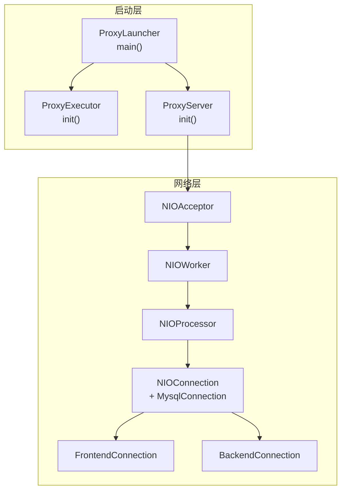
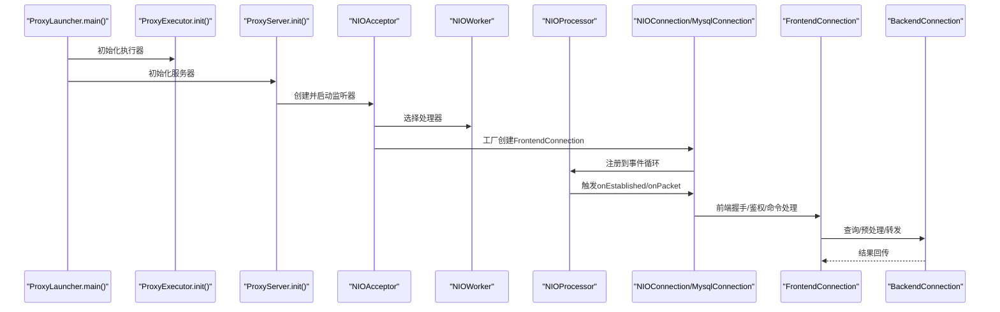
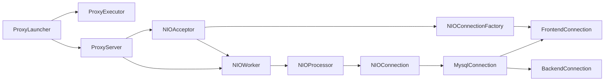

# 核心组件关系

<cite>
**本文引用的文件列表**
- [ProxyLauncher.java](file://proxy-server/src/main/java/com/alibaba/polardbx/proxy/server/ProxyLauncher.java)
- [ProxyServer.java](file://proxy-core/src/main/java/com/alibaba/polardbx/proxy/ProxyServer.java)
- [ProxyExecutor.java](file://proxy-core/src/main/java/com/alibaba/polardbx/proxy/ProxyExecutor.java)
- [NIOAcceptor.java](file://proxy-net/src/main/java/com/alibaba/polardbx/proxy/net/NIOAcceptor.java)
- [NIOProcessor.java](file://proxy-net/src/main/java/com/alibaba/polardbx/proxy/net/NIOProcessor.java)
- [NIOWorker.java](file://proxy-net/src/main/java/com/alibaba/polardbx/proxy/net/NIOWorker.java)
- [NIOConnection.java](file://proxy-net/src/main/java/com/alibaba/polardbx/proxy/net/NIOConnection.java)
- [MysqlConnection.java](file://proxy-core/src/main/java/com/alibaba/polardbx/proxy/connection/MysqlConnection.java)
- [FrontendConnection.java](file://proxy-core/src/main/java/com/alibaba/polardbx/proxy/connection/FrontendConnection.java)
- [BackendConnection.java](file://proxy-core/src/main/java/com/alibaba/polardbx/proxy/connection/BackendConnection.java)
- [FrontendContext.java](file://proxy-core/src/main/java/com/alibaba/polardbx/proxy/context/FrontendContext.java)
- [BackendContext.java](file://proxy-core/src/main/java/com/alibaba/polardbx/proxy/context/BackendContext.java)
</cite>

## 目录
1. [引言](#引言)
2. [项目结构](#项目结构)
3. [核心组件](#核心组件)
4. [架构总览](#架构总览)
5. [详细组件分析](#详细组件分析)
6. [依赖关系分析](#依赖关系分析)
7. [性能考量](#性能考量)
8. [故障排查指南](#故障排查指南)
9. [结论](#结论)

## 引言
本文件聚焦于PolarDB-X Proxy的核心组件关系与协作机制，围绕启动与控制组件（ProxyLauncher、ProxyServer、ProxyExecutor）以及网络与连接管理组件（NIOAcceptor、NIOProcessor、NIOWorker、NIOConnection、MysqlConnection、FrontendConnection、BackendConnection）展开，系统性阐述它们的职责分工、初始化顺序、生命周期管理、解耦与接口抽象，并通过图示展示关键操作的执行流程与数据传递路径。

## 项目结构
- 启动入口位于proxy-server模块，负责加载配置、初始化执行器与服务器实例。
- 业务与网络分离：proxy-core包含协议处理、连接上下文、调度与后端连接；proxy-net提供NIO网络基础设施。
- 配置与线程池：通过ConfigLoader/FastConfig读取配置，使用NamedThreadFactory命名线程，保证可观察性与可维护性。

图表来源
- [ProxyLauncher.java](file://proxy-server/src/main/java/com/alibaba/polardbx/proxy/server/ProxyLauncher.java#L32-L56)
- [ProxyServer.java](file://proxy-core/src/main/java/com/alibaba/polardbx/proxy/ProxyServer.java#L56-L96)
- [NIOAcceptor.java](file://proxy-net/src/main/java/com/alibaba/polardbx/proxy/net/NIOAcceptor.java#L46-L59)
- [NIOWorker.java](file://proxy-net/src/main/java/com/alibaba/polardbx/proxy/net/NIOWorker.java#L59-L88)
- [NIOProcessor.java](file://proxy-net/src/main/java/com/alibaba/polardbx/proxy/net/NIOProcessor.java#L52-L65)
- [NIOConnection.java](file://proxy-net/src/main/java/com/alibaba/polardbx/proxy/net/NIOConnection.java#L211-L230)
- [MysqlConnection.java](file://proxy-core/src/main/java/com/alibaba/polardbx/proxy/connection/MysqlConnection.java#L43-L45)
- [FrontendConnection.java](file://proxy-core/src/main/java/com/alibaba/polardbx/proxy/connection/FrontendConnection.java#L61-L86)
- [BackendConnection.java](file://proxy-core/src/main/java/com/alibaba/polardbx/proxy/connection/BackendConnection.java#L100-L116)

章节来源
- [ProxyLauncher.java](file://proxy-server/src/main/java/com/alibaba/polardbx/proxy/server/ProxyLauncher.java#L32-L56)
- [ProxyServer.java](file://proxy-core/src/main/java/com/alibaba/polardbx/proxy/ProxyServer.java#L56-L96)

## 核心组件
- 启动与控制
  - ProxyLauncher：应用入口，负责加载配置、刷新快速配置、初始化执行器与服务器。
  - ProxyServer：服务主控，负责生成ID、创建NIOWorker、初始化HA/权限/注册/监控等子系统，并启动NIOAcceptor。
  - ProxyExecutor：全局定时与调度线程池，用于异步清理与任务调度。
- 网络与连接
  - NIOAcceptor：监听前端端口，接收新连接，选择NIOProcessor并交由工厂创建FrontendConnection。
  - NIOWorker：持有多个NIOProcessor，采用轮询策略分发连接。
  - NIOProcessor：事件循环线程，注册连接、处理读写事件、维护缓冲池与性能指标。
  - NIOConnection：抽象网络连接基类，封装读写、缓冲、注册、连接状态与错误处理。
  - MysqlConnection：在NIOConnection之上实现MySQL协议解析与编码，统一处理包探测、解码、编码与回调。
  - FrontendConnection：面向客户端的连接，负责握手、鉴权、命令处理与上下文管理。
  - BackendConnection：面向后端MySQL的连接，负责认证、查询转发、结果处理与资源回收。

章节来源
- [ProxyLauncher.java](file://proxy-server/src/main/java/com/alibaba/polardbx/proxy/server/ProxyLauncher.java#L32-L56)
- [ProxyServer.java](file://proxy-core/src/main/java/com/alibaba/polardbx/proxy/ProxyServer.java#L56-L96)
- [ProxyExecutor.java](file://proxy-core/src/main/java/com/alibaba/polardbx/proxy/ProxyExecutor.java#L34-L55)
- [NIOAcceptor.java](file://proxy-net/src/main/java/com/alibaba/polardbx/proxy/net/NIOAcceptor.java#L46-L59)
- [NIOWorker.java](file://proxy-net/src/main/java/com/alibaba/polardbx/proxy/net/NIOWorker.java#L59-L88)
- [NIOProcessor.java](file://proxy-net/src/main/java/com/alibaba/polardbx/proxy/net/NIOProcessor.java#L52-L65)
- [NIOConnection.java](file://proxy-net/src/main/java/com/alibaba/polardbx/proxy/net/NIOConnection.java#L211-L230)
- [MysqlConnection.java](file://proxy-core/src/main/java/com/alibaba/polardbx/proxy/connection/MysqlConnection.java#L43-L45)
- [FrontendConnection.java](file://proxy-core/src/main/java/com/alibaba/polardbx/proxy/connection/FrontendConnection.java#L61-L86)
- [BackendConnection.java](file://proxy-core/src/main/java/com/alibaba/polardbx/proxy/connection/BackendConnection.java#L100-L116)

## 架构总览
下图展示了从启动到网络事件处理的完整链路，体现“启动—网络—连接—协议”的分层与解耦。

图表来源
- [ProxyLauncher.java](file://proxy-server/src/main/java/com/alibaba/polardbx/proxy/server/ProxyLauncher.java#L32-L56)
- [ProxyServer.java](file://proxy-core/src/main/java/com/alibaba/polardbx/proxy/ProxyServer.java#L90-L96)
- [NIOAcceptor.java](file://proxy-net/src/main/java/com/alibaba/polardbx/proxy/net/NIOAcceptor.java#L61-L81)
- [NIOProcessor.java](file://proxy-net/src/main/java/com/alibaba/polardbx/proxy/net/NIOProcessor.java#L84-L114)
- [NIOConnection.java](file://proxy-net/src/main/java/com/alibaba/polardbx/proxy/net/NIOConnection.java#L332-L363)
- [MysqlConnection.java](file://proxy-core/src/main/java/com/alibaba/polardbx/proxy/connection/MysqlConnection.java#L95-L147)
- [FrontendConnection.java](file://proxy-core/src/main/java/com/alibaba/polardbx/proxy/connection/FrontendConnection.java#L88-L111)
- [BackendConnection.java](file://proxy-core/src/main/java/com/alibaba/polardbx/proxy/connection/BackendConnection.java#L290-L321)

## 详细组件分析

### 启动与控制组件
- ProxyLauncher
  - 职责：加载配置、刷新快速配置、初始化执行器与服务器，设置优雅停机钩子。
  - 关键点：异常时触发进程级退出，确保系统安全。
- ProxyServer
  - 职责：生成接入ID与事务ID、创建NIOWorker、初始化HA/权限/注册/监控、启动NIOAcceptor。
  - 关键点：作为NIOConnectionFactory，负责创建FrontendConnection；线程池大小由配置决定。
- ProxyExecutor
  - 职责：提供调度线程池与定时线程池，用于异步资源释放与周期性任务。
  - 关键点：单例懒加载，线程名带前缀便于定位。

章节来源
- [ProxyLauncher.java](file://proxy-server/src/main/java/com/alibaba/polardbx/proxy/server/ProxyLauncher.java#L32-L56)
- [ProxyServer.java](file://proxy-core/src/main/java/com/alibaba/polardbx/proxy/ProxyServer.java#L56-L96)
- [ProxyExecutor.java](file://proxy-core/src/main/java/com/alibaba/polardbx/proxy/ProxyExecutor.java#L34-L55)

### 网络组件
- NIOAcceptor
  - 职责：绑定监听端口、接受新连接、设置TCP参数、选择NIOWorker并创建连接对象。
  - 关键点：非守护线程，支持离线关闭；异常时安全关闭通道。
- NIOWorker
  - 职责：管理多个NIOProcessor，按轮询策略分配连接，限制最大线程数与缓冲区配额。
  - 关键点：根据JVM堆内存动态计算每处理器缓冲块数量，避免内存压力。
- NIOProcessor
  - 职责：事件循环线程，批量注册待注册连接、处理就绪事件、维护缓冲池与性能统计。
  - 关键点：守护线程，使用wakeup唤醒select；性能指标通过ReactorPerfCollection收集。

章节来源
- [NIOAcceptor.java](file://proxy-net/src/main/java/com/alibaba/polardbx/proxy/net/NIOAcceptor.java#L46-L136)
- [NIOWorker.java](file://proxy-net/src/main/java/com/alibaba/polardbx/proxy/net/NIOWorker.java#L59-L88)
- [NIOProcessor.java](file://proxy-net/src/main/java/com/alibaba/polardbx/proxy/net/NIOProcessor.java#L52-L132)

### 连接管理组件
- NIOConnection
  - 职责：抽象网络连接，封装读写队列、缓冲池、注册/注销、连接状态机、错误处理与性能计数。
  - 关键点：读写锁保护，自动合并写入，支持暂停/恢复读写；连接建立后回调onEstablished。
- MysqlConnection
  - 职责：在NIOConnection基础上实现MySQL协议解析与编码，统一处理包探测、解码、编码与回调。
  - 关键点：支持大包拼接、压缩包占位、异常时自动关闭。
- FrontendConnection
  - 职责：面向客户端的连接，负责握手、鉴权、命令处理与上下文管理；关闭时异步释放资源。
  - 关键点：乐观读取鉴权器与命令处理器，减少锁竞争；关闭流程中使用ProxyExecutor异步清理。
- BackendConnection
  - 职责：面向后端MySQL的连接，负责认证、查询转发、结果处理、预处理语句缓存与资源回收。
  - 关键点：登录前置队列与发送队列，认证完成后批量flush；关闭时异步释放所有处理器与上下文。

章节来源
- [NIOConnection.java](file://proxy-net/src/main/java/com/alibaba/polardbx/proxy/net/NIOConnection.java#L211-L363)
- [MysqlConnection.java](file://proxy-core/src/main/java/com/alibaba/polardbx/proxy/connection/MysqlConnection.java#L43-L147)
- [FrontendConnection.java](file://proxy-core/src/main/java/com/alibaba/polardbx/proxy/connection/FrontendConnection.java#L61-L213)
- [BackendConnection.java](file://proxy-core/src/main/java/com/alibaba/polardbx/proxy/connection/BackendConnection.java#L100-L287)

### 上下文与设计模式
- FrontendContext/BackendContext
  - 职责：承载连接状态、能力位、事务与查询上下文、预处理语句缓存等。
  - 设计要点：原子引用与并发容器配合，避免竞态；关闭时有序释放资源，防止泄漏。
- 接口与抽象
  - NIOConnectionFactory：由ProxyServer实现，解耦连接创建与网络层。
  - 抽象类MysqlConnection：统一协议处理流程，子类仅关注业务逻辑。

章节来源
- [FrontendContext.java](file://proxy-core/src/main/java/com/alibaba/polardbx/proxy/context/FrontendContext.java#L45-L307)
- [BackendContext.java](file://proxy-core/src/main/java/com/alibaba/polardbx/proxy/context/BackendContext.java#L37-L155)

## 依赖关系分析
- 启动依赖
  - ProxyLauncher依赖ConfigLoader/FastConfig、ProxyExecutor、ProxyServer。
  - ProxyServer依赖NIOWorker、NIOAcceptor、HaManager、PrivilegeRefresher、SyncService、NodeWatchdog。
- 网络依赖
  - NIOAcceptor依赖NIOWorker与NIOConnectionFactory；NIOWorker依赖NIOProcessor；NIOProcessor依赖NIOConnection与FastBufferPool。
- 连接依赖
  - FrontendConnection/BackendConnection均继承自MysqlConnection，后者继承自NIOConnection；二者共享缓冲池与事件循环。

图表来源
- [ProxyLauncher.java](file://proxy-server/src/main/java/com/alibaba/polardbx/proxy/server/ProxyLauncher.java#L32-L56)
- [ProxyServer.java](file://proxy-core/src/main/java/com/alibaba/polardbx/proxy/ProxyServer.java#L90-L101)
- [NIOAcceptor.java](file://proxy-net/src/main/java/com/alibaba/polardbx/proxy/net/NIOAcceptor.java#L46-L59)
- [NIOWorker.java](file://proxy-net/src/main/java/com/alibaba/polardbx/proxy/net/NIOWorker.java#L59-L88)
- [NIOProcessor.java](file://proxy-net/src/main/java/com/alibaba/polardbx/proxy/net/NIOProcessor.java#L52-L65)
- [NIOConnection.java](file://proxy-net/src/main/java/com/alibaba/polardbx/proxy/net/NIOConnection.java#L211-L230)
- [MysqlConnection.java](file://proxy-core/src/main/java/com/alibaba/polardbx/proxy/connection/MysqlConnection.java#L43-L45)
- [FrontendConnection.java](file://proxy-core/src/main/java/com/alibaba/polardbx/proxy/connection/FrontendConnection.java#L61-L86)
- [BackendConnection.java](file://proxy-core/src/main/java/com/alibaba/polardbx/proxy/connection/BackendConnection.java#L100-L116)

## 性能考量
- 缓冲池与内存
  - 每个NIOProcessor持有一个FastBufferPool，大小按线程数与JVM堆上限动态分配，避免频繁GC与内存不足。
- 事件循环与背压
  - NIOProcessor守护线程，使用wakeup唤醒；NIOConnection支持暂停/恢复读写，实现背压控制。
- 并发与锁
  - NIOConnection读写分别使用ReentrantLock，写队列使用无锁队列；FrontendConnection/BackendConnection在关闭时异步释放，避免阻塞事件线程。
- 性能统计
  - NIOProcessor提供ReactorPerfCollection，记录注册次数、事件循环次数、读写次数、连接数与缓冲池状态。

章节来源
- [NIOWorker.java](file://proxy-net/src/main/java/com/alibaba/polardbx/proxy/net/NIOWorker.java#L39-L88)
- [NIOProcessor.java](file://proxy-net/src/main/java/com/alibaba/polardbx/proxy/net/NIOProcessor.java#L49-L132)
- [NIOConnection.java](file://proxy-net/src/main/java/com/alibaba/polardbx/proxy/net/NIOConnection.java#L374-L408)
- [FrontendConnection.java](file://proxy-core/src/main/java/com/alibaba/polardbx/proxy/connection/FrontendConnection.java#L193-L206)
- [BackendConnection.java](file://proxy-core/src/main/java/com/alibaba/polardbx/proxy/connection/BackendConnection.java#L258-L280)

## 故障排查指南
- 启动失败
  - 检查配置加载与刷新是否成功；确认端口占用与权限；查看ProxyLauncher日志与异常栈。
- 连接异常
  - 查看NIOAcceptor.accept异常日志与通道关闭；确认NIOWorker/Processor线程存活与缓冲池状态。
- 协议错误
  - 检查MysqlConnection.onPacket异常与handleFinish回调；确认FrontendConnection/BackendConnection状态机与上下文。
- 资源泄漏
  - 关注FrontendConnection/BackendConnection关闭流程中的异步清理；核对上下文与处理器的关闭顺序。

章节来源
- [ProxyLauncher.java](file://proxy-server/src/main/java/com/alibaba/polardbx/proxy/server/ProxyLauncher.java#L40-L43)
- [NIOAcceptor.java](file://proxy-net/src/main/java/com/alibaba/polardbx/proxy/net/NIOAcceptor.java#L77-L80)
- [NIOConnection.java](file://proxy-net/src/main/java/com/alibaba/polardbx/proxy/net/NIOConnection.java#L561-L585)
- [FrontendConnection.java](file://proxy-core/src/main/java/com/alibaba/polardbx/proxy/connection/FrontendConnection.java#L163-L166)
- [BackendConnection.java](file://proxy-core/src/main/java/com/alibaba/polardbx/proxy/connection/BackendConnection.java#L221-L224)

## 结论
PolarDB-X Proxy通过清晰的分层与解耦实现了高性能、可扩展的数据库代理服务：
- 启动层（ProxyLauncher/ProxyServer/ProxyExecutor）负责系统初始化与资源管理；
- 网络层（NIOAcceptor/NIOWorker/NIOProcessor）提供稳定的事件驱动模型；
- 连接层（NIOConnection/MysqlConnection/FrontendConnection/BackendConnection）实现协议处理与上下文管理；
- 上下文层（FrontendContext/BackendContext）保障状态一致性与资源有序释放。

该架构在保证高内聚的同时实现了低耦合，通过接口抽象与事件循环模型，既满足了高并发场景下的性能需求，又提供了良好的可观测性与可维护性。