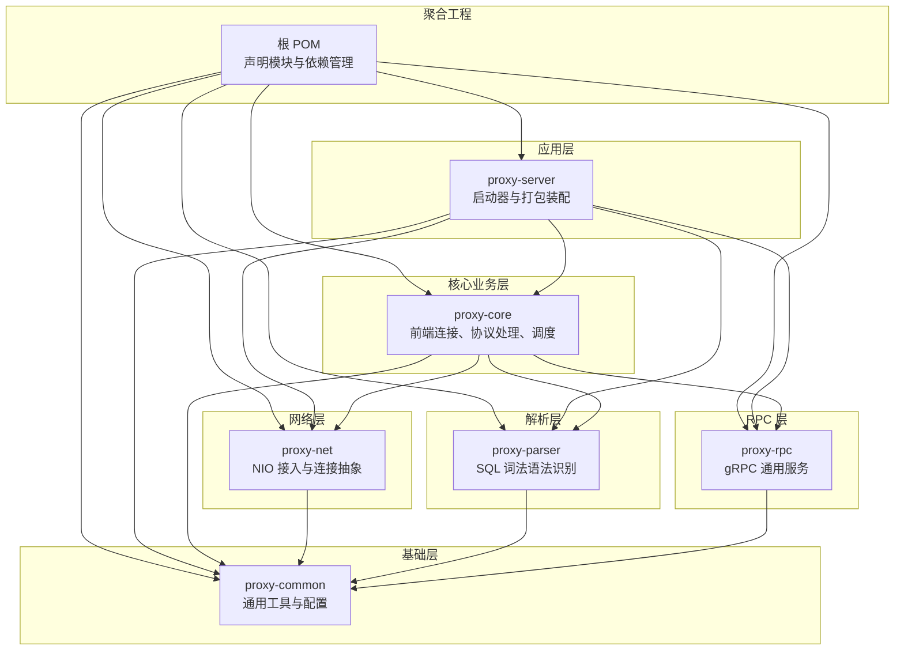
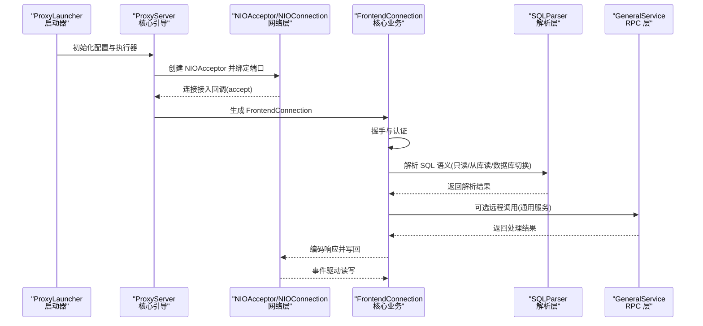
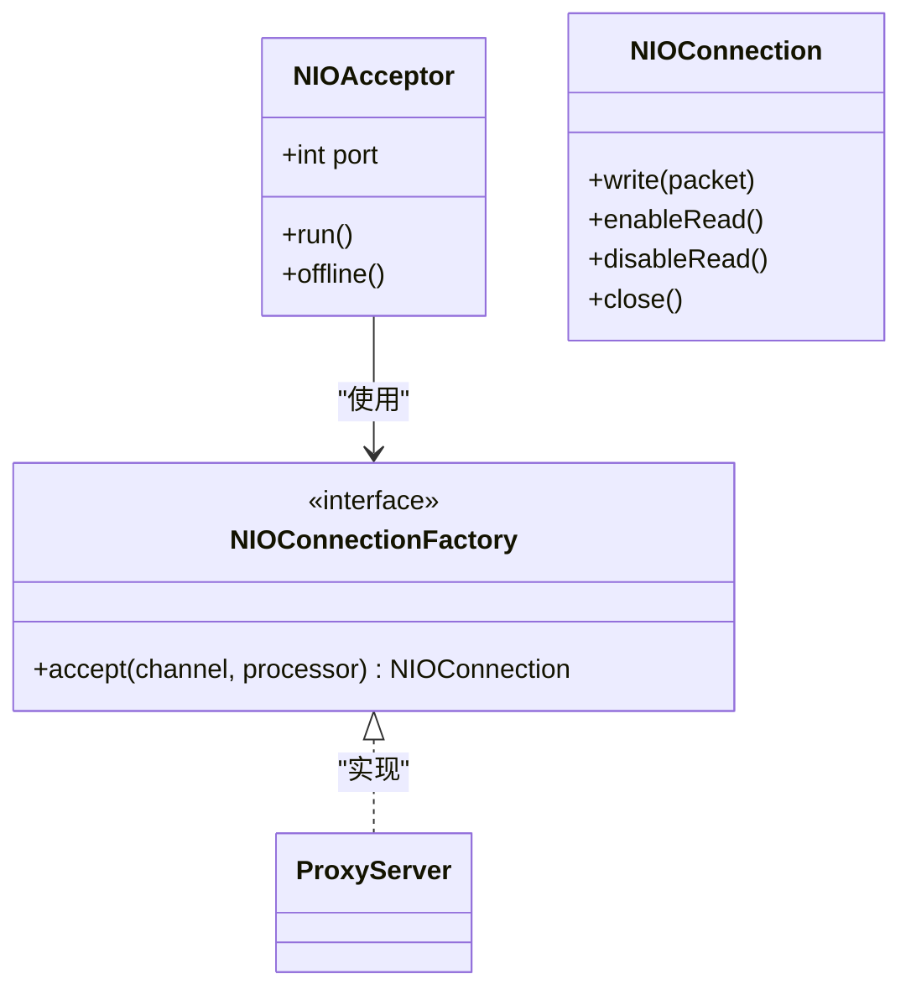
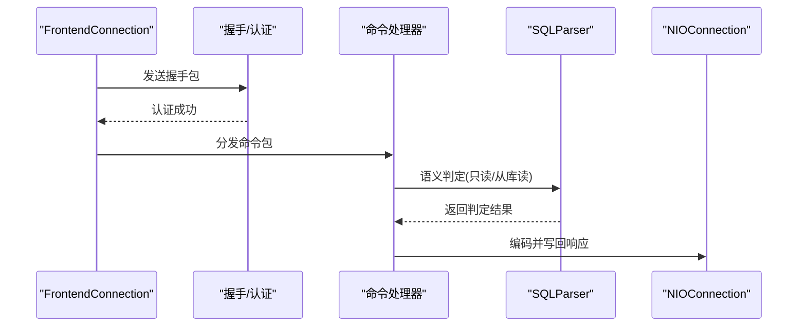
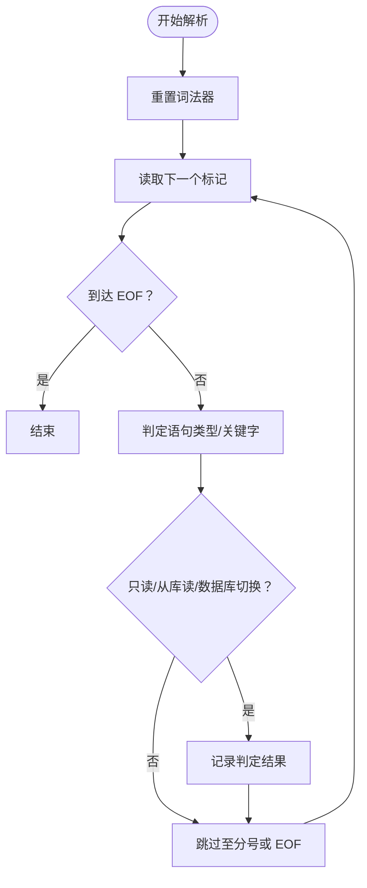
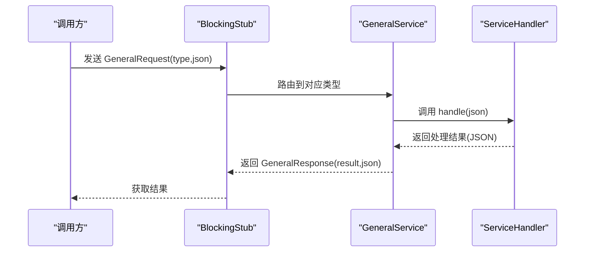
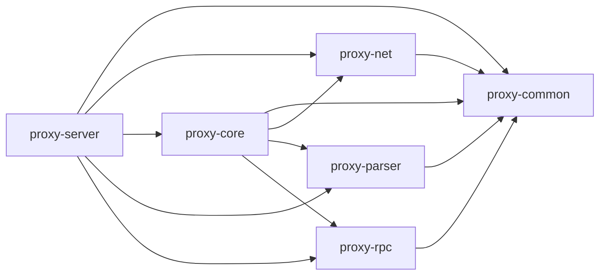

# 模块化设计

<cite>
**本文引用的文件**
- [pom.xml](file://pom.xml)
- [proxy-common/pom.xml](file://proxy-common/pom.xml)
- [proxy-net/pom.xml](file://proxy-net/pom.xml)
- [proxy-core/pom.xml](file://proxy-core/pom.xml)
- [proxy-parser/pom.xml](file://proxy-parser/pom.xml)
- [proxy-rpc/pom.xml](file://proxy-rpc/pom.xml)
- [proxy-common/src/main/java/com/alibaba/polardbx/proxy/utils/AddressUtils.java](file://proxy-common/src/main/java/com/alibaba/polardbx/proxy/utils/AddressUtils.java)
- [proxy-net/src/main/java/com/alibaba/polardbx/proxy/net/NIOAcceptor.java](file://proxy-net/src/main/java/com/alibaba/polardbx/proxy/net/NIOAcceptor.java)
- [proxy-net/src/main/java/com/alibaba/polardbx/proxy/net/NIOConnection.java](file://proxy-net/src/main/java/com/alibaba/polardbx/proxy/net/NIOConnection.java)
- [proxy-core/src/main/java/com/alibaba/polardbx/proxy/ProxyServer.java](file://proxy-core/src/main/java/com/alibaba/polardbx/proxy/ProxyServer.java)
- [proxy-core/src/main/java/com/alibaba/polardbx/proxy/connection/FrontendConnection.java](file://proxy-core/src/main/java/com/alibaba/polardbx/proxy/connection/FrontendConnection.java)
- [proxy-parser/src/main/java/com/alibaba/polardbx/proxy/parser/recognizer/SQLParser.java](file://proxy-parser/src/main/java/com/alibaba/polardbx/proxy/parser/recognizer/SQLParser.java)
- [proxy-rpc/src/main/proto/GeneralService.proto](file://proxy-rpc/src/main/proto/GeneralService.proto)
- [proxy-rpc/src/main/java/com/alibaba/polardbx/proxy/GeneralService.java](file://proxy-rpc/src/main/java/com/alibaba/polardbx/proxy/GeneralService.java)
- [proxy-server/src/main/java/com/alibaba/polardbx/proxy/server/ProxyLauncher.java](file://proxy-server/src/main/java/com/alibaba/polardbx/proxy/server/ProxyLauncher.java)
</cite>

## 目录
1. [引言](#引言)
2. [项目结构](#项目结构)
3. [核心组件](#核心组件)
4. [架构总览](#架构总览)
5. [详细组件分析](#详细组件分析)
6. [依赖分析](#依赖分析)
7. [性能考量](#性能考量)
8. [故障排查指南](#故障排查指南)
9. [结论](#结论)
10. [附录](#附录)

## 引言
本文件系统性梳理 PolarDB-X Proxy 的模块化设计，围绕以下目标展开：明确各模块的职责与边界；解释模块间依赖关系与接口契约；总结模块化带来的可维护性、可测试性与团队协作收益；给出模块依赖图与接口规范；并提出扩展点与插件机制的设计思路。读者无需深入源码即可理解整体架构。

## 项目结构
PolarDB-X Proxy 采用多模块聚合工程组织，顶层 POM 声明了六个子模块：proxy-server、proxy-common、proxy-net、proxy-core、proxy-parser、proxy-rpc。模块之间通过显式依赖建立清晰的分层关系，形成“启动器 → 公共基础 → 网络 → 核心业务 → 解析 → RPC”的层次化结构。

图表来源
- [pom.xml](file://pom.xml#L30-L37)
- [proxy-server/pom.xml](file://proxy-server/pom.xml#L1-L200)
- [proxy-common/pom.xml](file://proxy-common/pom.xml#L24-L44)
- [proxy-net/pom.xml](file://proxy-net/pom.xml#L24-L44)
- [proxy-core/pom.xml](file://proxy-core/pom.xml#L24-L62)
- [proxy-parser/pom.xml](file://proxy-parser/pom.xml#L24-L44)
- [proxy-rpc/pom.xml](file://proxy-rpc/pom.xml#L24-L66)

章节来源
- [pom.xml](file://pom.xml#L30-L37)

## 核心组件
- proxy-common：提供日志、配置、通用工具与资源池等横切能力，被其他所有模块依赖，确保跨模块一致性与复用。
- proxy-net：封装 NIO 接入、连接抽象、处理器与工作线程，屏蔽底层通道细节，向上提供统一的连接工厂与生命周期管理。
- proxy-core：承载前端连接、认证握手、命令处理、事务上下文、调度器与后端连接池等核心业务逻辑，是系统的主要执行体。
- proxy-parser：提供 MySQL 语法词法识别与语义判定（如只读、从库读、数据库切换等），支撑路由与优化决策。
- proxy-rpc：基于 gRPC 提供通用远程服务框架，支持注册/注销处理器与客户端调用，用于模块间或跨节点的服务编排。
- proxy-server：应用入口，负责加载配置、初始化线程池与网络组件、启动通用服务，并作为连接工厂向网络层提供前端连接实例。

章节来源
- [proxy-common/pom.xml](file://proxy-common/pom.xml#L38-L84)
- [proxy-net/pom.xml](file://proxy-net/pom.xml#L38-L44)
- [proxy-core/pom.xml](file://proxy-core/pom.xml#L38-L62)
- [proxy-parser/pom.xml](file://proxy-parser/pom.xml#L38-L44)
- [proxy-rpc/pom.xml](file://proxy-rpc/pom.xml#L38-L66)
- [proxy-server/src/main/java/com/alibaba/polardbx/proxy/server/ProxyLauncher.java](file://proxy-server/src/main/java/com/alibaba/polardbx/proxy/server/ProxyLauncher.java#L29-L55)

## 架构总览
下图展示从启动到网络接入、协议处理与远程服务的整体流程，体现模块边界与交互方向。

图表来源
- [proxy-server/src/main/java/com/alibaba/polardbx/proxy/server/ProxyLauncher.java](file://proxy-server/src/main/java/com/alibaba/polardbx/proxy/server/ProxyLauncher.java#L32-L44)
- [proxy-core/src/main/java/com/alibaba/polardbx/proxy/ProxyServer.java](file://proxy-core/src/main/java/com/alibaba/polardbx/proxy/ProxyServer.java#L92-L96)
- [proxy-net/src/main/java/com/alibaba/polardbx/proxy/net/NIOAcceptor.java](file://proxy-net/src/main/java/com/alibaba/polardbx/proxy/net/NIOAcceptor.java#L61-L81)
- [proxy-core/src/main/java/com/alibaba/polardbx/proxy/connection/FrontendConnection.java](file://proxy-core/src/main/java/com/alibaba/polardbx/proxy/connection/FrontendConnection.java#L88-L111)
- [proxy-parser/src/main/java/com/alibaba/polardbx/proxy/parser/recognizer/SQLParser.java](file://proxy-parser/src/main/java/com/alibaba/polardbx/proxy/parser/recognizer/SQLParser.java#L64-L136)
- [proxy-rpc/src/main/java/com/alibaba/polardbx/proxy/GeneralService.java](file://proxy-rpc/src/main/java/com/alibaba/polardbx/proxy/GeneralService.java#L44-L65)

## 详细组件分析

### proxy-common：公共组件
- 职责与定位
  - 统一日志体系（SLF4J + Logback）
  - 配置加载与动态配置
  - 常用工具类（地址解析、字节工具、线程命名、通知队列、缓冲池等）
- 关键接口与边界
  - 地址解析工具 AddressUtils：对外暴露获取本机 IP/主机名的稳定接口，避免网络探测失败时的异常扩散。
  - 配置加载 ConfigLoader/FastConfig：为上层模块提供集中式配置访问。
- 模块化收益
  - 代码复用：日志、工具类在多个模块共享，减少重复实现。
  - 测试隔离：通过统一工具类降低耦合，便于单元测试。
- 扩展点建议
  - 动态配置监听器接口，允许模块订阅配置变更事件。

章节来源
- [proxy-common/pom.xml](file://proxy-common/pom.xml#L38-L84)
- [proxy-common/src/main/java/com/alibaba/polardbx/proxy/utils/AddressUtils.java](file://proxy-common/src/main/java/com/alibaba/polardbx/proxy/utils/AddressUtils.java#L44-L95)

### proxy-net：网络通信
- 职责与定位
  - NIO 接入器 NIOAcceptor：监听端口，接受新连接并委派给工作线程。
  - 连接抽象 NIOConnection：封装 SocketChannel 生命周期、读写缓冲、事件驱动与流量控制。
  - 连接工厂 NIOConnectionFactory：面向上层提供统一的连接构造入口。
- 关键接口与边界
  - NIOAcceptor.offline：优雅停机，释放选择器与通道。
  - NIOConnection.write/read：事件驱动的异步读写，支持合并写与回压监听。
- 模块化收益
  - 抽象清晰：上层无需感知底层 NIO 细节。
  - 性能可控：缓冲池与事件选择器提升吞吐。
- 扩展点建议
  - 插件化解码器/编码器：支持不同协议族的扩展。

图表来源
- [proxy-net/src/main/java/com/alibaba/polardbx/proxy/net/NIOAcceptor.java](file://proxy-net/src/main/java/com/alibaba/polardbx/proxy/net/NIOAcceptor.java#L35-L136)
- [proxy-net/src/main/java/com/alibaba/polardbx/proxy/net/NIOConnection.java](file://proxy-net/src/main/java/com/alibaba/polardbx/proxy/net/NIOConnection.java#L51-L363)
- [proxy-core/src/main/java/com/alibaba/polardbx/proxy/ProxyServer.java](file://proxy-core/src/main/java/com/alibaba/polardbx/proxy/ProxyServer.java#L98-L101)

章节来源
- [proxy-net/pom.xml](file://proxy-net/pom.xml#L38-L44)
- [proxy-net/src/main/java/com/alibaba/polardbx/proxy/net/NIOAcceptor.java](file://proxy-net/src/main/java/com/alibaba/polardbx/proxy/net/NIOAcceptor.java#L61-L107)
- [proxy-net/src/main/java/com/alibaba/polardbx/proxy/net/NIOConnection.java](file://proxy-net/src/main/java/com/alibaba/polardbx/proxy/net/NIOConnection.java#L312-L363)

### proxy-core：核心业务逻辑
- 职责与定位
  - 前端连接 FrontendConnection：完成握手、认证、命令处理与上下文管理。
  - 协议处理：握手包、命令包、结果集编码等。
  - 上下文与调度：前端上下文、事务上下文、调度任务与后端连接池。
- 关键接口与边界
  - FrontendConnection.onEstablished：发送握手包并进入认证阶段。
  - FrontendConnection.handleAndTakePacket：在认证完成后交由命令处理器。
- 模块化收益
  - 业务内聚：协议与业务逻辑分离，便于演进。
  - 可观测性：上下文与计数器贯穿请求生命周期。

图表来源
- [proxy-core/src/main/java/com/alibaba/polardbx/proxy/connection/FrontendConnection.java](file://proxy-core/src/main/java/com/alibaba/polardbx/proxy/connection/FrontendConnection.java#L88-L111)
- [proxy-core/src/main/java/com/alibaba/polardbx/proxy/connection/FrontendConnection.java](file://proxy-core/src/main/java/com/alibaba/polardbx/proxy/connection/FrontendConnection.java#L113-L143)
- [proxy-parser/src/main/java/com/alibaba/polardbx/proxy/parser/recognizer/SQLParser.java](file://proxy-parser/src/main/java/com/alibaba/polardbx/proxy/parser/recognizer/SQLParser.java#L64-L136)
- [proxy-net/src/main/java/com/alibaba/polardbx/proxy/net/NIOConnection.java](file://proxy-net/src/main/java/com/alibaba/polardbx/proxy/net/NIOConnection.java#L693-L732)

章节来源
- [proxy-core/pom.xml](file://proxy-core/pom.xml#L38-L62)
- [proxy-core/src/main/java/com/alibaba/polardbx/proxy/ProxyServer.java](file://proxy-core/src/main/java/com/alibaba/polardbx/proxy/ProxyServer.java#L92-L96)
- [proxy-core/src/main/java/com/alibaba/polardbx/proxy/connection/FrontendConnection.java](file://proxy-core/src/main/java/com/alibaba/polardbx/proxy/connection/FrontendConnection.java#L88-L166)

### proxy-parser：SQL 解析
- 职责与定位
  - MySQL 语法词法识别与语义判定：是否多语句、是否只读、是否可从库读、数据库切换等。
  - 支持 EXPLAIN、SET、SHOW 等 DDL/DAL 语句的识别与构建。
- 关键接口与边界
  - SQLParser.parseMultiStatements：多语句解析与错误片段定位。
  - SQLParser.canSlaveRead/isReadOnly/isPrivilegeDatabaseChanged：语义判定接口。
- 模块化收益
  - 语义抽取：核心业务仅依赖稳定的布尔/字符串判定结果，不直接依赖词法实现。
  - 易于扩展：新增语句类型只需扩展语法解析器与判定逻辑。

图表来源
- [proxy-parser/src/main/java/com/alibaba/polardbx/proxy/parser/recognizer/SQLParser.java](file://proxy-parser/src/main/java/com/alibaba/polardbx/proxy/parser/recognizer/SQLParser.java#L277-L334)
- [proxy-parser/src/main/java/com/alibaba/polardbx/proxy/parser/recognizer/SQLParser.java](file://proxy-parser/src/main/java/com/alibaba/polardbx/proxy/parser/recognizer/SQLParser.java#L64-L136)

章节来源
- [proxy-parser/pom.xml](file://proxy-parser/pom.xml#L38-L44)
- [proxy-parser/src/main/java/com/alibaba/polardbx/proxy/parser/recognizer/SQLParser.java](file://proxy-parser/src/main/java/com/alibaba/polardbx/proxy/parser/recognizer/SQLParser.java#L36-L51)

### proxy-rpc：远程服务
- 职责与定位
  - 基于 gRPC 的通用远程过程调用框架：服务注册/注销、请求分发、客户端阻塞调用。
  - 通过 proto 定义通用请求/响应消息，屏蔽具体业务细节。
- 关键接口与边界
  - GeneralService.registerHandler/unregisterHandler：按类型注册处理器。
  - GeneralService.startServer/invoke：服务端启动与客户端调用。
- 模块化收益
  - 松耦合：上层仅依赖类型字符串与 JSON 负载，不关心具体实现。
  - 可扩展：任意模块可注册新的服务类型，实现跨模块协作。

图表来源
- [proxy-rpc/src/main/proto/GeneralService.proto](file://proxy-rpc/src/main/proto/GeneralService.proto#L8-L20)
- [proxy-rpc/src/main/java/com/alibaba/polardbx/proxy/GeneralService.java](file://proxy-rpc/src/main/java/com/alibaba/polardbx/proxy/GeneralService.java#L44-L65)
- [proxy-rpc/src/main/java/com/alibaba/polardbx/proxy/GeneralService.java](file://proxy-rpc/src/main/java/com/alibaba/polardbx/proxy/GeneralService.java#L74-L92)

章节来源
- [proxy-rpc/pom.xml](file://proxy-rpc/pom.xml#L38-L66)
- [proxy-rpc/src/main/proto/GeneralService.proto](file://proxy-rpc/src/main/proto/GeneralService.proto#L1-L21)
- [proxy-rpc/src/main/java/com/alibaba/polardbx/proxy/GeneralService.java](file://proxy-rpc/src/main/java/com/alibaba/polardbx/proxy/GeneralService.java#L31-L93)

### proxy-server：启动器
- 职责与定位
  - 应用入口，负责加载配置、初始化执行器、启动网络与通用服务、注册集群节点。
- 关键流程
  - 加载配置与刷新 FastConfig
  - 初始化 ProxyExecutor
  - 初始化 ProxyServer（创建 NIOAcceptor、HaManager、SmoothSwitchoverMonitor、PrivilegeRefresher、SyncService、NodeWatchdog）
  - 启动 GeneralService 服务器

章节来源
- [proxy-server/src/main/java/com/alibaba/polardbx/proxy/server/ProxyLauncher.java](file://proxy-server/src/main/java/com/alibaba/polardbx/proxy/server/ProxyLauncher.java#L32-L44)
- [proxy-core/src/main/java/com/alibaba/polardbx/proxy/ProxyServer.java](file://proxy-core/src/main/java/com/alibaba/polardbx/proxy/ProxyServer.java#L56-L96)

## 依赖分析
- 依赖方向
  - proxy-server 依赖所有模块，承担装配与引导职责。
  - proxy-core 依赖 proxy-common、proxy-net、proxy-parser、proxy-rpc，形成业务闭环。
  - proxy-net 依赖 proxy-common。
  - proxy-parser 依赖 proxy-common。
  - proxy-rpc 依赖 proxy-common 与 gRPC 依赖。
- 循环依赖与耦合规避
  - 采用自顶向下依赖：server → core → net/parser/rpc → common，避免环状依赖。
  - 通过接口（如 NIOConnectionFactory）与抽象（如 ServiceHandler）降低耦合。
  - 将公共能力下沉至 proxy-common，避免重复依赖。

图表来源
- [pom.xml](file://pom.xml#L30-L37)
- [proxy-core/pom.xml](file://proxy-core/pom.xml#L38-L62)
- [proxy-net/pom.xml](file://proxy-net/pom.xml#L38-L44)
- [proxy-parser/pom.xml](file://proxy-parser/pom.xml#L38-L44)
- [proxy-rpc/pom.xml](file://proxy-rpc/pom.xml#L38-L66)

章节来源
- [pom.xml](file://pom.xml#L30-L37)
- [proxy-core/pom.xml](file://proxy-core/pom.xml#L38-L62)

## 性能考量
- NIO 事件驱动与缓冲池：NIOConnection 使用 FastBufferPool 与合并写策略，降低分配与拷贝开销。
- 读写分离与背压：支持 enableRead/disableRead 与 write 回调监听，实现精细的流量控制。
- 多 Reactor 线程：ProxyServer 基于 CPU 与因子计算工作线程数量，提升并发处理能力。
- 解析短路：SQLParser 对只读/从库读等常见判定进行快速路径判断，减少无谓解析成本。

章节来源
- [proxy-net/src/main/java/com/alibaba/polardbx/proxy/net/NIOConnection.java](file://proxy-net/src/main/java/com/alibaba/polardbx/proxy/net/NIOConnection.java#L693-L732)
- [proxy-core/src/main/java/com/alibaba/polardbx/proxy/ProxyServer.java](file://proxy-core/src/main/java/com/alibaba/polardbx/proxy/ProxyServer.java#L61-L63)
- [proxy-parser/src/main/java/com/alibaba/polardbx/proxy/parser/recognizer/SQLParser.java](file://proxy-parser/src/main/java/com/alibaba/polardbx/proxy/parser/recognizer/SQLParser.java#L64-L136)

## 故障排查指南
- 启动失败
  - 检查配置加载与 FastConfig 刷新是否成功。
  - 查看 ProxyServer 初始化日志与端口占用情况。
- 连接异常
  - 关注 NIOAcceptor 的 accept 与 closeChannel 逻辑，确认异常路径是否正确关闭通道。
  - 检查 FrontendConnection 的握手与认证流程，定位状态机异常。
- 解析错误
  - 使用 SQLParser.buildErrorMsg 获取错误片段，结合日志定位语法问题。
- RPC 调用失败
  - 核对 ServiceHandler 注册表与类型匹配，检查客户端超时设置与服务端启动端口。

章节来源
- [proxy-server/src/main/java/com/alibaba/polardbx/proxy/server/ProxyLauncher.java](file://proxy-server/src/main/java/com/alibaba/polardbx/proxy/server/ProxyLauncher.java#L35-L43)
- [proxy-net/src/main/java/com/alibaba/polardbx/proxy/net/NIOAcceptor.java](file://proxy-net/src/main/java/com/alibaba/polardbx/proxy/net/NIOAcceptor.java#L109-L124)
- [proxy-core/src/main/java/com/alibaba/polardbx/proxy/connection/FrontendConnection.java](file://proxy-core/src/main/java/com/alibaba/polardbx/proxy/connection/FrontendConnection.java#L162-L166)
- [proxy-parser/src/main/java/com/alibaba/polardbx/proxy/parser/recognizer/SQLParser.java](file://proxy-parser/src/main/java/com/alibaba/polardbx/proxy/parser/recognizer/SQLParser.java#L256-L274)
- [proxy-rpc/src/main/java/com/alibaba/polardbx/proxy/GeneralService.java](file://proxy-rpc/src/main/java/com/alibaba/polardbx/proxy/GeneralService.java#L74-L92)

## 结论
通过将通用能力下沉至 proxy-common，将网络与连接抽象置于 proxy-net，将业务逻辑集中在 proxy-core，将解析与 RPC 独立成模块，PolarDB-X Proxy 实现了清晰的分层与稳定的接口契约。该模块化设计提升了代码复用、测试隔离与团队协作效率，同时通过接口与抽象有效避免了循环依赖与过度耦合。未来可在协议解码器与服务处理器层面引入插件化扩展，进一步增强系统的可演化性。

## 附录
- 模块边界设计原则
  - 单一职责：每个模块聚焦一个领域或基础设施。
  - 向外暴露稳定接口：内部实现可变，接口保持稳定。
  - 自顶向下依赖：上层模块依赖下层模块，避免反向依赖。
  - 通过接口与抽象解耦：如 NIOConnectionFactory、ServiceHandler。
- 模块扩展点与插件机制设计思路
  - 协议扩展：在 proxy-net 中定义可插拔的 Decoder/Encoder SPI，允许第三方协议接入。
  - 服务扩展：在 proxy-rpc 中引入 ServiceHandler SPI，支持按类型动态注册/卸载处理器。
  - 解析扩展：在 proxy-parser 中增加扩展语法解析器与判定器，支持方言扩展。