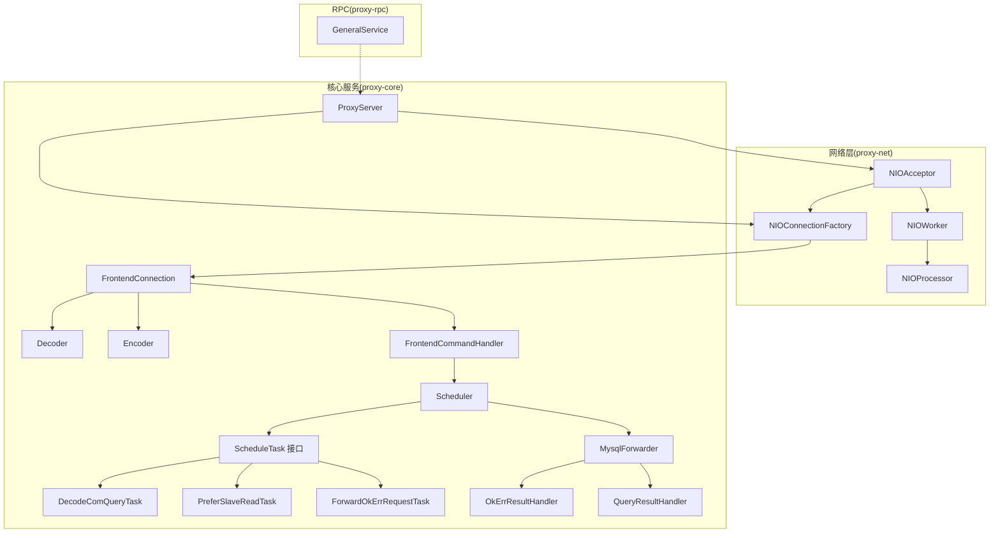
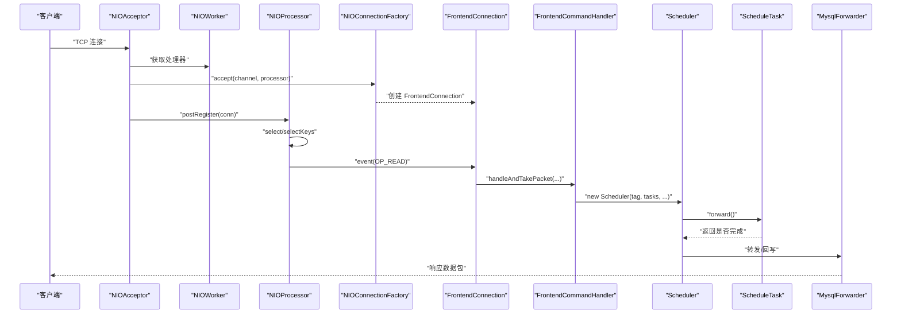
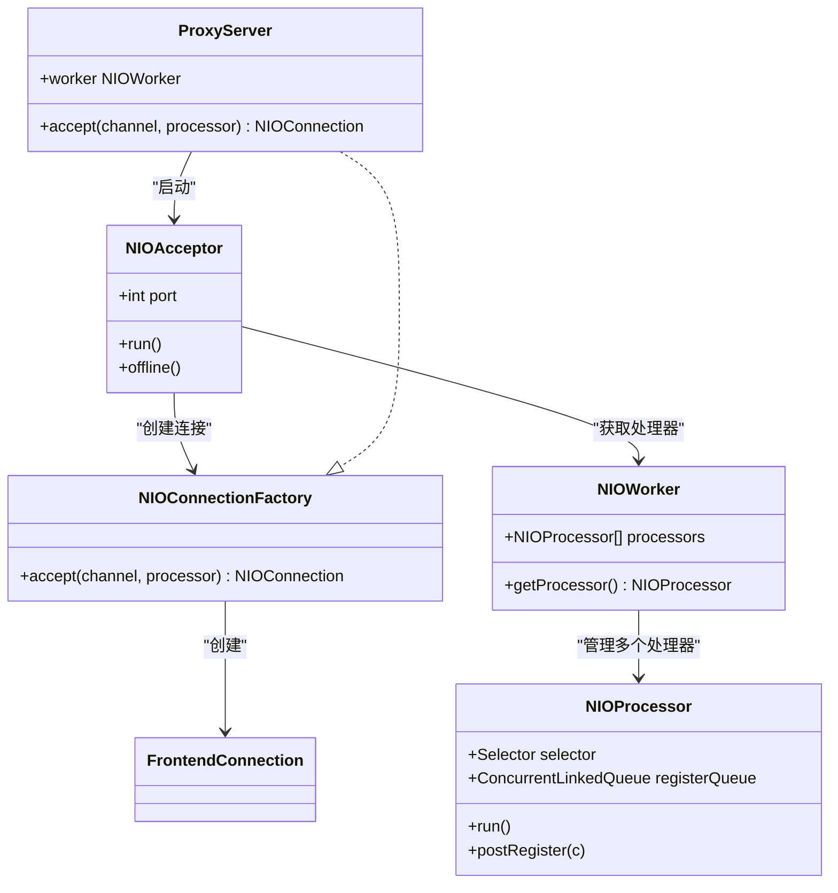
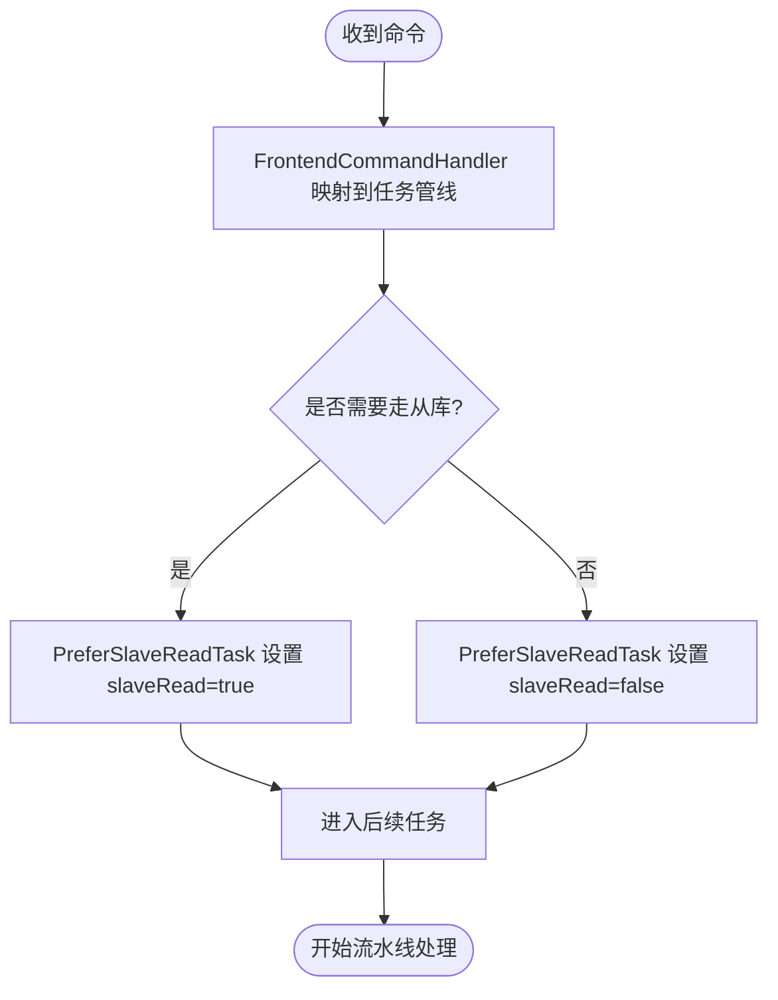
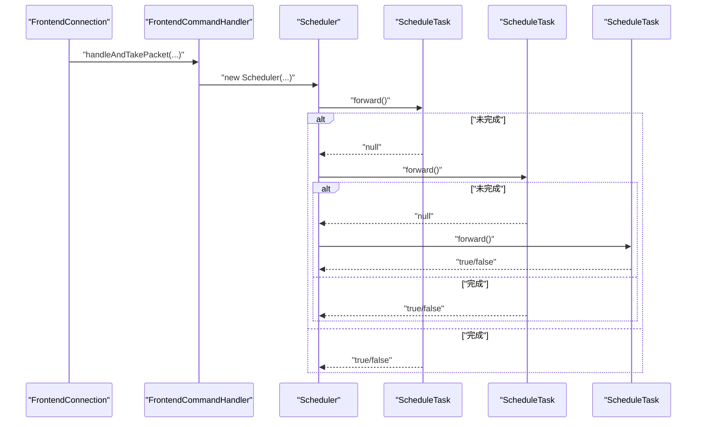
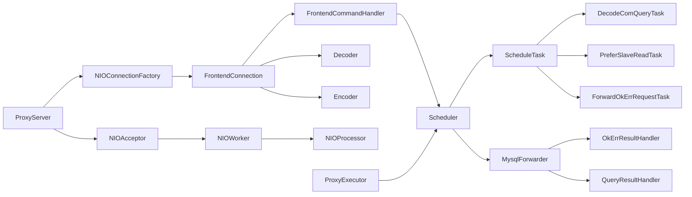

# 设计模式应用

<cite>
**本文引用的文件**
- [proxy-net/NIOAcceptor.java](file://proxy-net/src/main/java/com/alibaba/polardbx/proxy/net/NIOAcceptor.java)
- [proxy-net/NIOProcessor.java](file://proxy-net/src/main/java/com/alibaba/polardbx/proxy/net/NIOProcessor.java)
- [proxy-net/NIOWorker.java](file://proxy-net/src/main/java/com/alibaba/polardbx/proxy/net/NIOWorker.java)
- [proxy-net/NIOConnectionFactory.java](file://proxy-net/src/main/java/com/alibaba/polardbx/proxy/net/NIOConnectionFactory.java)
- [proxy-core/ProxyServer.java](file://proxy-core/src/main/java/com/alibaba/polardbx/proxy/ProxyServer.java)
- [proxy-core/FrontendConnection.java](file://proxy-core/src/main/java/com/alibaba/polardbx/proxy/connection/FrontendConnection.java)
- [proxy-core/ProxyExecutor.java](file://proxy-core/src/main/java/com/alibaba/polardbx/proxy/ProxyExecutor.java)
- [proxy-core/Scheduler.java](file://proxy-core/src/main/java/com/alibaba/polardbx/proxy/scheduler/Scheduler.java)
- [proxy-core/ScheduleTask.java](file://proxy-core/src/main/java/com/alibaba/polardbx/proxy/scheduler/ScheduleTask.java)
- [proxy-core/DecodeComQueryTask.java](file://proxy-core/src/main/java/com/alibaba/polardbx/proxy/scheduler/DecodeComQueryTask.java)
- [proxy-core/PreferSlaveReadTask.java](file://proxy-core/src/main/java/com/alibaba/polardbx/proxy/scheduler/PreferSlaveReadTask.java)
- [proxy-core/ForwardOkErrRequestTask.java](file://proxy-core/src/main/java/com/alibaba/polardbx/proxy/scheduler/ForwardOkErrRequestTask.java)
- [proxy-core/MysqlForwarder.java](file://proxy-core/src/main/java/com/alibaba/polardbx/proxy/protocol/handler/MysqlForwarder.java)
- [proxy-core/OkErrResultHandler.java](file://proxy-core/src/main/java/com/alibaba/polardbx/proxy/protocol/handler/result/OkErrResultHandler.java)
- [proxy-core/QueryResultHandler.java](file://proxy-core/src/main/java/com/alibaba/polardbx/proxy/protocol/handler/result/QueryResultHandler.java)
- [proxy-core/Decoder.java](file://proxy-core/src/main/java/com/alibaba/polardbx/proxy/protocol/decoder/Decoder.java)
- [proxy-core/Encoder.java](file://proxy-core/src/main/java/com/alibaba/polardbx/proxy/protocol/encoder/Encoder.java)
- [proxy-core/FrontendCommandHandler.java](file://proxy-core/src/main/java/com/alibaba/polardbx/proxy/protocol/handler/FrontendCommandHandler.java)
- [proxy-rpc/GeneralService.java](file://proxy-rpc/src/main/java/com/alibaba/polardbx/proxy/GeneralService.java)
</cite>

## 目录
1. [引言](#引言)
2. [项目结构](#项目结构)
3. [核心组件](#核心组件)
4. [架构总览](#架构总览)
5. [详细组件分析](#详细组件分析)
6. [依赖关系分析](#依赖关系分析)
7. [性能考量](#性能考量)
8. [故障排查指南](#故障排查指南)
9. [结论](#结论)
10. [附录](#附录)

## 引言
本文件聚焦于 PolarDB-X Proxy 的设计模式应用，围绕以下主题展开：Reactor 模式在异步事件驱动架构中的实现、工厂模式在连接与处理器创建中的应用、策略模式在调度与路由决策中的使用、观察者模式在状态监控与事件通知中的实现、责任链模式在请求处理管道中的应用、以及适配器模式在协议兼容中的作用。我们将结合 Netty 风格的 NIO 实现与内部自研网络层，系统阐述这些模式如何协同工作以实现高性能与可扩展性。

## 项目结构
- 网络层（proxy-net）：基于 Java NIO 的 Reactor 模式实现，包含接受器、处理器、工作线程与连接工厂接口。
- 核心服务（proxy-core）：代理服务器、前端连接、调度器、任务管线、命令处理器、结果处理器、编解码器等。
- RPC 服务（proxy-rpc）：通用服务注册与远程过程调用框架。
- 公共工具（proxy-common）：线程命名、缓冲池、日志与工具类。

图表来源
- [proxy-net/NIOAcceptor.java](file://proxy-net/src/main/java/com/alibaba/polardbx/proxy/net/NIOAcceptor.java#L35-L107)
- [proxy-net/NIOWorker.java](file://proxy-net/src/main/java/com/alibaba/polardbx/proxy/net/NIOWorker.java#L29-L88)
- [proxy-net/NIOProcessor.java](file://proxy-net/src/main/java/com/alibaba/polardbx/proxy/net/NIOProcessor.java#L37-L114)
- [proxy-net/NIOConnectionFactory.java](file://proxy-net/src/main/java/com/alibaba/polardbx/proxy/net/NIOConnectionFactory.java#L23-L25)
- [proxy-core/ProxyServer.java](file://proxy-core/src/main/java/com/alibaba/polardbx/proxy/ProxyServer.java#L49-L101)
- [proxy-core/FrontendConnection.java](file://proxy-core/src/main/java/com/alibaba/polardbx/proxy/connection/FrontendConnection.java#L47-L86)
- [proxy-core/FrontendCommandHandler.java](file://proxy-core/src/main/java/com/alibaba/polardbx/proxy/protocol/handler/FrontendCommandHandler.java#L126-L171)
- [proxy-core/Scheduler.java](file://proxy-core/src/main/java/com/alibaba/polardbx/proxy/scheduler/Scheduler.java#L300-L313)
- [proxy-core/ScheduleTask.java](file://proxy-core/src/main/java/com/alibaba/polardbx/proxy/scheduler/ScheduleTask.java#L21-L30)
- [proxy-core/DecodeComQueryTask.java](file://proxy-core/src/main/java/com/alibaba/polardbx/proxy/scheduler/DecodeComQueryTask.java#L23-L33)
- [proxy-core/PreferSlaveReadTask.java](file://proxy-core/src/main/java/com/alibaba/polardbx/proxy/scheduler/PreferSlaveReadTask.java#L23-L37)
- [proxy-core/ForwardOkErrRequestTask.java](file://proxy-core/src/main/java/com/alibaba/polardbx/proxy/scheduler/ForwardOkErrRequestTask.java#L31-L44)
- [proxy-core/MysqlForwarder.java](file://proxy-core/src/main/java/com/alibaba/polardbx/proxy/protocol/handler/MysqlForwarder.java#L34-L97)
- [proxy-core/OkErrResultHandler.java](file://proxy-core/src/main/java/com/alibaba/polardbx/proxy/protocol/handler/result/OkErrResultHandler.java#L50-L76)
- [proxy-core/QueryResultHandler.java](file://proxy-core/src/main/java/com/alibaba/polardbx/proxy/protocol/handler/result/QueryResultHandler.java#L437-L470)
- [proxy-core/Decoder.java](file://proxy-core/src/main/java/com/alibaba/polardbx/proxy/protocol/decoder/Decoder.java#L29-L47)
- [proxy-core/Encoder.java](file://proxy-core/src/main/java/com/alibaba/polardbx/proxy/protocol/encoder/Encoder.java#L34-L47)
- [proxy-rpc/GeneralService.java](file://proxy-rpc/src/main/java/com/alibaba/polardbx/proxy/GeneralService.java#L36-L72)

章节来源
- [proxy-net/NIOAcceptor.java](file://proxy-net/src/main/java/com/alibaba/polardbx/proxy/net/NIOAcceptor.java#L35-L107)
- [proxy-net/NIOWorker.java](file://proxy-net/src/main/java/com/alibaba/polardbx/proxy/net/NIOWorker.java#L29-L88)
- [proxy-net/NIOProcessor.java](file://proxy-net/src/main/java/com/alibaba/polardbx/proxy/net/NIOProcessor.java#L37-L114)
- [proxy-net/NIOConnectionFactory.java](file://proxy-net/src/main/java/com/alibaba/polardbx/proxy/net/NIOConnectionFactory.java#L23-L25)
- [proxy-core/ProxyServer.java](file://proxy-core/src/main/java/com/alibaba/polardbx/proxy/ProxyServer.java#L49-L101)
- [proxy-core/FrontendConnection.java](file://proxy-core/src/main/java/com/alibaba/polardbx/proxy/connection/FrontendConnection.java#L47-L86)
- [proxy-core/FrontendCommandHandler.java](file://proxy-core/src/main/java/com/alibaba/polardbx/proxy/protocol/handler/FrontendCommandHandler.java#L126-L171)
- [proxy-core/Scheduler.java](file://proxy-core/src/main/java/com/alibaba/polardbx/proxy/scheduler/Scheduler.java#L300-L313)
- [proxy-core/ScheduleTask.java](file://proxy-core/src/main/java/com/alibaba/polardbx/proxy/scheduler/ScheduleTask.java#L21-L30)
- [proxy-core/DecodeComQueryTask.java](file://proxy-core/src/main/java/com/alibaba/polardbx/proxy/scheduler/DecodeComQueryTask.java#L23-L33)
- [proxy-core/PreferSlaveReadTask.java](file://proxy-core/src/main/java/com/alibaba/polardbx/proxy/scheduler/PreferSlaveReadTask.java#L23-L37)
- [proxy-core/ForwardOkErrRequestTask.java](file://proxy-core/src/main/java/com/alibaba/polardbx/proxy/scheduler/ForwardOkErrRequestTask.java#L31-L44)
- [proxy-core/MysqlForwarder.java](file://proxy-core/src/main/java/com/alibaba/polardbx/proxy/protocol/handler/MysqlForwarder.java#L34-L97)
- [proxy-core/OkErrResultHandler.java](file://proxy-core/src/main/java/com/alibaba/polardbx/proxy/protocol/handler/result/OkErrResultHandler.java#L50-L76)
- [proxy-core/QueryResultHandler.java](file://proxy-core/src/main/java/com/alibaba/polardbx/proxy/protocol/handler/result/QueryResultHandler.java#L437-L470)
- [proxy-core/Decoder.java](file://proxy-core/src/main/java/com/alibaba/polardbx/proxy/protocol/decoder/Decoder.java#L29-L47)
- [proxy-core/Encoder.java](file://proxy-core/src/main/java/com/alibaba/polardbx/proxy/protocol/encoder/Encoder.java#L34-L47)
- [proxy-rpc/GeneralService.java](file://proxy-rpc/src/main/java/com/alibaba/polardbx/proxy/GeneralService.java#L36-L72)

## 核心组件
- Reactor 组件：NIOAcceptor（接受连接）、NIOProcessor（事件循环与注册队列）、NIOWorker（多处理器分发）。
- 工厂接口：NIOConnectionFactory，用于创建 FrontendConnection。
- 调度与任务：Scheduler 作为上下文容器，ScheduleTask 定义任务契约；多个具体任务组成流水线。
- 协议处理：FrontendConnection 负责握手与命令解析；FrontendCommandHandler 将命令映射到对应任务管线；MysqlForwarder 负责转发与回写。
- 结果处理：OkErrResultHandler、QueryResultHandler 等实现不同结果类型的处理与状态机推进。
- 编解码：Decoder/Encoder 提供统一的二进制读写抽象，支持多种实现以适配不同内存布局。

章节来源
- [proxy-net/NIOAcceptor.java](file://proxy-net/src/main/java/com/alibaba/polardbx/proxy/net/NIOAcceptor.java#L35-L107)
- [proxy-net/NIOProcessor.java](file://proxy-net/src/main/java/com/alibaba/polardbx/proxy/net/NIOProcessor.java#L37-L114)
- [proxy-net/NIOWorker.java](file://proxy-net/src/main/java/com/alibaba/polardbx/proxy/net/NIOWorker.java#L29-L88)
- [proxy-net/NIOConnectionFactory.java](file://proxy-net/src/main/java/com/alibaba/polardbx/proxy/net/NIOConnectionFactory.java#L23-L25)
- [proxy-core/ProxyServer.java](file://proxy-core/src/main/java/com/alibaba/polardbx/proxy/ProxyServer.java#L49-L101)
- [proxy-core/FrontendConnection.java](file://proxy-core/src/main/java/com/alibaba/polardbx/proxy/connection/FrontendConnection.java#L47-L86)
- [proxy-core/Scheduler.java](file://proxy-core/src/main/java/com/alibaba/polardbx/proxy/scheduler/Scheduler.java#L46-L149)
- [proxy-core/ScheduleTask.java](file://proxy-core/src/main/java/com/alibaba/polardbx/proxy/scheduler/ScheduleTask.java#L21-L30)
- [proxy-core/MysqlForwarder.java](file://proxy-core/src/main/java/com/alibaba/polardbx/proxy/protocol/handler/MysqlForwarder.java#L34-L97)
- [proxy-core/OkErrResultHandler.java](file://proxy-core/src/main/java/com/alibaba/polardbx/proxy/protocol/handler/result/OkErrResultHandler.java#L50-L76)
- [proxy-core/QueryResultHandler.java](file://proxy-core/src/main/java/com/alibaba/polardbx/proxy/protocol/handler/result/QueryResultHandler.java#L437-L470)
- [proxy-core/Decoder.java](file://proxy-core/src/main/java/com/alibaba/polardbx/proxy/protocol/decoder/Decoder.java#L29-L47)
- [proxy-core/Encoder.java](file://proxy-core/src/main/java/com/alibaba/polardbx/proxy/protocol/encoder/Encoder.java#L34-L47)

## 架构总览
Reactor 模式通过单线程事件循环（NIOProcessor）高效处理多路复用的 I/O 事件，避免阻塞；NIOWorker 负责将新连接均匀分配给多个处理器，提升并发能力；NIOAcceptor 在主端口监听并把建立好的 SocketChannel 交给工厂创建 FrontendConnection，再由处理器完成注册与事件分发。调度器（Scheduler）与任务（ScheduleTask）构成责任链，按命令类型选择不同的处理路径，并在必要时进行后端连接选择与转发。

图表来源
- [proxy-net/NIOAcceptor.java](file://proxy-net/src/main/java/com/alibaba/polardbx/proxy/net/NIOAcceptor.java#L61-L81)
- [proxy-net/NIOWorker.java](file://proxy-net/src/main/java/com/alibaba/polardbx/proxy/net/NIOWorker.java#L82-L88)
- [proxy-net/NIOProcessor.java](file://proxy-net/src/main/java/com/alibaba/polardbx/proxy/net/NIOProcessor.java#L84-L114)
- [proxy-net/NIOConnectionFactory.java](file://proxy-net/src/main/java/com/alibaba/polardbx/proxy/net/NIOConnectionFactory.java#L23-L25)
- [proxy-core/FrontendConnection.java](file://proxy-core/src/main/java/com/alibaba/polardbx/proxy/connection/FrontendConnection.java#L113-L143)
- [proxy-core/FrontendCommandHandler.java](file://proxy-core/src/main/java/com/alibaba/polardbx/proxy/protocol/handler/FrontendCommandHandler.java#L126-L171)
- [proxy-core/Scheduler.java](file://proxy-core/src/main/java/com/alibaba/polardbx/proxy/scheduler/Scheduler.java#L300-L313)
- [proxy-core/MysqlForwarder.java](file://proxy-core/src/main/java/com/alibaba/polardbx/proxy/protocol/handler/MysqlForwarder.java#L68-L97)

## 详细组件分析

### Reactor 模式：异步事件驱动
- NIOAcceptor：打开 ServerSocketChannel，注册到 Selector，处理 OP_ACCEPT，设置非阻塞与 TCP 参数，交由工厂创建连接并提交给处理器注册。
- NIOProcessor：持有 Selector 与注册队列，周期性 select，批量注册待注册连接，遍历就绪键，回调连接的 event 方法执行读写处理。
- NIOWorker：根据 CPU 核数与配置动态创建多个 NIOProcessor，并提供轮询分发 getProcessor，平衡负载。
- ProxyServer：实现 NIOConnectionFactory，作为工厂创建 FrontendConnection；同时负责初始化 HA、服务注册与启动 NIOAcceptor。

图表来源
- [proxy-net/NIOAcceptor.java](file://proxy-net/src/main/java/com/alibaba/polardbx/proxy/net/NIOAcceptor.java#L35-L107)
- [proxy-net/NIOWorker.java](file://proxy-net/src/main/java/com/alibaba/polardbx/proxy/net/NIOWorker.java#L29-L88)
- [proxy-net/NIOProcessor.java](file://proxy-net/src/main/java/com/alibaba/polardbx/proxy/net/NIOProcessor.java#L37-L114)
- [proxy-net/NIOConnectionFactory.java](file://proxy-net/src/main/java/com/alibaba/polardbx/proxy/net/NIOConnectionFactory.java#L23-L25)
- [proxy-core/ProxyServer.java](file://proxy-core/src/main/java/com/alibaba/polardbx/proxy/ProxyServer.java#L49-L101)
- [proxy-core/FrontendConnection.java](file://proxy-core/src/main/java/com/alibaba/polardbx/proxy/connection/FrontendConnection.java#L47-L86)

章节来源
- [proxy-net/NIOAcceptor.java](file://proxy-net/src/main/java/com/alibaba/polardbx/proxy/net/NIOAcceptor.java#L35-L107)
- [proxy-net/NIOProcessor.java](file://proxy-net/src/main/java/com/alibaba/polardbx/proxy/net/NIOProcessor.java#L37-L114)
- [proxy-net/NIOWorker.java](file://proxy-net/src/main/java/com/alibaba/polardbx/proxy/net/NIOWorker.java#L29-L88)
- [proxy-core/ProxyServer.java](file://proxy-core/src/main/java/com/alibaba/polardbx/proxy/ProxyServer.java#L49-L101)

### 工厂模式：连接与处理器创建
- NIOConnectionFactory 接口定义了 accept 方法，ProxyServer 实现该接口，负责在新连接到达时创建 FrontendConnection。
- FrontendConnection 构造时初始化上下文、能力位、字符集与认证器，确保握手阶段的准备就绪。
- 优点：解耦“谁来创建连接”与“如何创建”，便于替换实现或扩展。

章节来源
- [proxy-net/NIOConnectionFactory.java](file://proxy-net/src/main/java/com/alibaba/polardbx/proxy/net/NIOConnectionFactory.java#L23-L25)
- [proxy-core/ProxyServer.java](file://proxy-core/src/main/java/com/alibaba/polardbx/proxy/ProxyServer.java#L98-L101)
- [proxy-core/FrontendConnection.java](file://proxy-core/src/main/java/com/alibaba/polardbx/proxy/connection/FrontendConnection.java#L61-L86)

### 策略模式：调度与路由决策
- 命令到任务管线的映射：FrontendCommandHandler 根据命令类型选择对应的 Pipeline（例如 COM_STMT_PREPARE、COM_QUERY 等），形成策略化的处理路径。
- 读写分离策略：PreferSlaveReadTask 基于事务状态与自动提交标志决定是否走从库，体现运行时策略选择。
- 优点：新增命令或路由规则只需添加新的任务或调整映射，不侵入既有逻辑。

图表来源
- [proxy-core/FrontendCommandHandler.java](file://proxy-core/src/main/java/com/alibaba/polardbx/proxy/protocol/handler/FrontendCommandHandler.java#L126-L171)
- [proxy-core/PreferSlaveReadTask.java](file://proxy-core/src/main/java/com/alibaba/polardbx/proxy/scheduler/PreferSlaveReadTask.java#L23-L37)

章节来源
- [proxy-core/FrontendCommandHandler.java](file://proxy-core/src/main/java/com/alibaba/polardbx/proxy/protocol/handler/FrontendCommandHandler.java#L126-L171)
- [proxy-core/PreferSlaveReadTask.java](file://proxy-core/src/main/java/com/alibaba/polardbx/proxy/scheduler/PreferSlaveReadTask.java#L23-L37)

### 观察者模式：状态监控与事件通知
- Reactor 性能指标：NIOProcessor 内部维护 ReactorPerfCollection，记录注册次数、事件循环次数、读写次数等，通过 getPerfItem 汇总导出。
- 系统表查询：ShowReactorHandler 可枚举当前 Reactor 的统计信息，作为外部观察入口。
- 优点：运行时可观测，便于定位热点与瓶颈。

章节来源
- [proxy-net/NIOProcessor.java](file://proxy-net/src/main/java/com/alibaba/polardbx/proxy/net/NIOProcessor.java#L50-L132)
- [proxy-core/protocol/handler/request/ShowReactorHandler.java](file://proxy-core/src/main/java/com/alibaba/polardbx/proxy/protocol/handler/request/ShowReactorHandler.java)

### 责任链模式：请求处理管道
- Scheduler 作为上下文容器，持有任务数组，依次调用每个 ScheduleTask 的 forward 方法；若某任务返回非空布尔值，则视为“完成”并终止后续任务。
- DecodeComQueryTask、ForwardOkErrRequestTask 等具体任务实现各自职责，形成可插拔的处理链。
- 优点：清晰的职责划分，易于扩展与测试。

图表来源
- [proxy-core/FrontendCommandHandler.java](file://proxy-core/src/main/java/com/alibaba/polardbx/proxy/protocol/handler/FrontendCommandHandler.java#L168-L171)
- [proxy-core/Scheduler.java](file://proxy-core/src/main/java/com/alibaba/polardbx/proxy/scheduler/Scheduler.java#L300-L313)
- [proxy-core/ScheduleTask.java](file://proxy-core/src/main/java/com/alibaba/polardbx/proxy/scheduler/ScheduleTask.java#L21-L30)
- [proxy-core/DecodeComQueryTask.java](file://proxy-core/src/main/java/com/alibaba/polardbx/proxy/scheduler/DecodeComQueryTask.java#L23-L33)
- [proxy-core/ForwardOkErrRequestTask.java](file://proxy-core/src/main/java/com/alibaba/polardbx/proxy/scheduler/ForwardOkErrRequestTask.java#L31-L44)

章节来源
- [proxy-core/Scheduler.java](file://proxy-core/src/main/java/com/alibaba/polardbx/proxy/scheduler/Scheduler.java#L300-L313)
- [proxy-core/ScheduleTask.java](file://proxy-core/src/main/java/com/alibaba/polardbx/proxy/scheduler/ScheduleTask.java#L21-L30)
- [proxy-core/DecodeComQueryTask.java](file://proxy-core/src/main/java/com/alibaba/polardbx/proxy/scheduler/DecodeComQueryTask.java#L23-L33)
- [proxy-core/ForwardOkErrRequestTask.java](file://proxy-core/src/main/java/com/alibaba/polardbx/proxy/scheduler/ForwardOkErrRequestTask.java#L31-L44)

### 适配器模式：协议兼容
- Decoder/Encoder 抽象了二进制读写接口，内部提供多种实现（如 Unsafe/Native/Simple），对外暴露一致的 API，屏蔽底层内存布局差异。
- FrontendConnection 在握手与命令处理中通过 Encoder/Decoder 创建与消费数据包，保证协议层与业务层解耦。
- 优点：在不改变上层调用的前提下，灵活切换底层实现以优化性能。

章节来源
- [proxy-core/Decoder.java](file://proxy-core/src/main/java/com/alibaba/polardbx/proxy/protocol/decoder/Decoder.java#L29-L47)
- [proxy-core/Encoder.java](file://proxy-core/src/main/java/com/alibaba/polardbx/proxy/protocol/encoder/Encoder.java#L34-L47)
- [proxy-core/FrontendConnection.java](file://proxy-core/src/main/java/com/alibaba/polardbx/proxy/connection/FrontendConnection.java#L102-L110)

### 适配器模式：RPC 服务适配
- GeneralService 提供 gRPC 服务端点，将外部请求类型映射到内部 ServiceHandler，实现跨进程的服务注册与调用。
- 优点：统一服务发现与调用方式，便于扩展与治理。

章节来源
- [proxy-rpc/GeneralService.java](file://proxy-rpc/src/main/java/com/alibaba/polardbx/proxy/GeneralService.java#L36-L72)

## 依赖关系分析
- 网络层与核心服务的耦合度低：网络层仅依赖工厂接口创建连接，连接对象再委托给核心服务模块进行协议处理。
- 调度器与任务：通过接口隔离，任务可独立演进；命令处理器只关心映射与调度器创建。
- 结果处理：MysqlForwarder 与结果处理器配合，将后端响应按状态机推进并最终回写到前端连接。
- 执行器：ProxyExecutor 提供定时与延迟任务能力，用于重传、清理与监控。

图表来源
- [proxy-net/NIOConnectionFactory.java](file://proxy-net/src/main/java/com/alibaba/polardbx/proxy/net/NIOConnectionFactory.java#L23-L25)
- [proxy-core/ProxyServer.java](file://proxy-core/src/main/java/com/alibaba/polardbx/proxy/ProxyServer.java#L49-L101)
- [proxy-core/FrontendConnection.java](file://proxy-core/src/main/java/com/alibaba/polardbx/proxy/connection/FrontendConnection.java#L47-L86)
- [proxy-core/FrontendCommandHandler.java](file://proxy-core/src/main/java/com/alibaba/polardbx/proxy/protocol/handler/FrontendCommandHandler.java#L126-L171)
- [proxy-core/Scheduler.java](file://proxy-core/src/main/java/com/alibaba/polardbx/proxy/scheduler/Scheduler.java#L300-L313)
- [proxy-core/ScheduleTask.java](file://proxy-core/src/main/java/com/alibaba/polardbx/proxy/scheduler/ScheduleTask.java#L21-L30)
- [proxy-core/DecodeComQueryTask.java](file://proxy-core/src/main/java/com/alibaba/polardbx/proxy/scheduler/DecodeComQueryTask.java#L23-L33)
- [proxy-core/PreferSlaveReadTask.java](file://proxy-core/src/main/java/com/alibaba/polardbx/proxy/scheduler/PreferSlaveReadTask.java#L23-L37)
- [proxy-core/ForwardOkErrRequestTask.java](file://proxy-core/src/main/java/com/alibaba/polardbx/proxy/scheduler/ForwardOkErrRequestTask.java#L31-L44)
- [proxy-core/MysqlForwarder.java](file://proxy-core/src/main/java/com/alibaba/polardbx/proxy/protocol/handler/MysqlForwarder.java#L34-L97)
- [proxy-core/OkErrResultHandler.java](file://proxy-core/src/main/java/com/alibaba/polardbx/proxy/protocol/handler/result/OkErrResultHandler.java#L50-L76)
- [proxy-core/QueryResultHandler.java](file://proxy-core/src/main/java/com/alibaba/polardbx/proxy/protocol/handler/result/QueryResultHandler.java#L437-L470)
- [proxy-core/Decoder.java](file://proxy-core/src/main/java/com/alibaba/polardbx/proxy/protocol/decoder/Decoder.java#L29-L47)
- [proxy-core/Encoder.java](file://proxy-core/src/main/java/com/alibaba/polardbx/proxy/protocol/encoder/Encoder.java#L34-L47)
- [proxy-core/ProxyExecutor.java](file://proxy-core/src/main/java/com/alibaba/polardbx/proxy/ProxyExecutor.java#L30-L56)

章节来源
- [proxy-core/ProxyExecutor.java](file://proxy-core/src/main/java/com/alibaba/polardbx/proxy/ProxyExecutor.java#L30-L56)

## 性能考量
- Reactor 线程模型：单线程事件循环避免锁竞争，批量注册与事件处理减少系统调用开销。
- 缓冲池：NIOProcessor 内置 FastBufferPool，按线程与堆外内存限制分配，降低 GC 压力。
- 负载均衡：NIOWorker 采用轮询分发处理器，结合 CPU 核心数与环境变量控制线程数量。
- 异步执行：ProxyExecutor 提供定时与延迟任务，用于重传、清理与监控，避免阻塞主事件循环。
- 编解码优化：Decoder/Encoder 多实现适配不同内存布局，按场景选择最优实现。

## 故障排查指南
- 连接建立失败：检查 NIOAcceptor 的 accept 流程与工厂创建是否抛异常；确认处理器注册队列是否及时唤醒。
- 事件循环卡顿：查看 NIOProcessor 的事件循环计数与注册计数，定位是否存在大量注册或异常取消。
- 调度失败：在 Scheduler.errorHandle 中记录错误栈与状态，判断是否启用重传与事务上下文清理。
- 结果处理异常：OkErrResultHandler/QueryResultHandler 的状态机推进需关注 peek 字节与 EOF 错误，确保状态一致。
- RPC 服务不可用：检查 GeneralService 的服务注册与 gRPC 启动端口。

章节来源
- [proxy-net/NIOAcceptor.java](file://proxy-net/src/main/java/com/alibaba/polardbx/proxy/net/NIOAcceptor.java#L77-L81)
- [proxy-net/NIOProcessor.java](file://proxy-net/src/main/java/com/alibaba/polardbx/proxy/net/NIOProcessor.java#L87-L114)
- [proxy-core/Scheduler.java](file://proxy-core/src/main/java/com/alibaba/polardbx/proxy/scheduler/Scheduler.java#L234-L297)
- [proxy-core/OkErrResultHandler.java](file://proxy-core/src/main/java/com/alibaba/polardbx/proxy/protocol/handler/result/OkErrResultHandler.java#L50-L76)
- [proxy-core/QueryResultHandler.java](file://proxy-core/src/main/java/com/alibaba/polardbx/proxy/protocol/handler/result/QueryResultHandler.java#L437-L470)
- [proxy-rpc/GeneralService.java](file://proxy-rpc/src/main/java/com/alibaba/polardbx/proxy/GeneralService.java#L67-L72)

## 结论
PolarDB-X Proxy 通过 Reactor 模式实现高并发网络 I/O，借助工厂、策略、责任链、适配器与观察者等设计模式，将协议处理、调度决策、结果回写与性能观测有机整合。这种组合既保证了系统的高性能与低延迟，又提供了良好的可扩展性与可维护性。实际部署中应结合环境变量与配置参数合理设置线程数与缓冲池大小，并通过系统表与性能指标持续优化。

## 附录
- 关键流程路径参考
  - Reactor 启动与连接接入：[proxy-net/NIOAcceptor.java](file://proxy-net/src/main/java/com/alibaba/polardbx/proxy/net/NIOAcceptor.java#L35-L107)，[proxy-core/ProxyServer.java](file://proxy-core/src/main/java/com/alibaba/polardbx/proxy/ProxyServer.java#L90-L96)
  - 事件循环与注册：[proxy-net/NIOProcessor.java](file://proxy-net/src/main/java/com/alibaba/polardbx/proxy/net/NIOProcessor.java#L84-L114)
  - 工厂创建连接：[proxy-net/NIOConnectionFactory.java](file://proxy-net/src/main/java/com/alibaba/polardbx/proxy/net/NIOConnectionFactory.java#L23-L25)，[proxy-core/ProxyServer.java](file://proxy-core/src/main/java/com/alibaba/polardbx/proxy/ProxyServer.java#L98-L101)
  - 命令到任务映射：[proxy-core/FrontendCommandHandler.java](file://proxy-core/src/main/java/com/alibaba/polardbx/proxy/protocol/handler/FrontendCommandHandler.java#L126-L171)
  - 调度与责任链：[proxy-core/Scheduler.java](file://proxy-core/src/main/java/com/alibaba/polardbx/proxy/scheduler/Scheduler.java#L300-L313)，[proxy-core/ScheduleTask.java](file://proxy-core/src/main/java/com/alibaba/polardbx/proxy/scheduler/ScheduleTask.java#L21-L30)
  - 结果处理与转发：[proxy-core/MysqlForwarder.java](file://proxy-core/src/main/java/com/alibaba/polardbx/proxy/protocol/handler/MysqlForwarder.java#L68-L97)，[proxy-core/OkErrResultHandler.java](file://proxy-core/src/main/java/com/alibaba/polardbx/proxy/protocol/handler/result/OkErrResultHandler.java#L50-L76)，[proxy-core/QueryResultHandler.java](file://proxy-core/src/main/java/com/alibaba/polardbx/proxy/protocol/handler/result/QueryResultHandler.java#L437-L470)
  - 编解码适配：[proxy-core/Decoder.java](file://proxy-core/src/main/java/com/alibaba/polardbx/proxy/protocol/decoder/Decoder.java#L326-L371)，[proxy-core/Encoder.java](file://proxy-core/src/main/java/com/alibaba/polardbx/proxy/protocol/encoder/Encoder.java#L164-L167)
  - RPC 服务适配：[proxy-rpc/GeneralService.java](file://proxy-rpc/src/main/java/com/alibaba/polardbx/proxy/GeneralService.java#L36-L72)