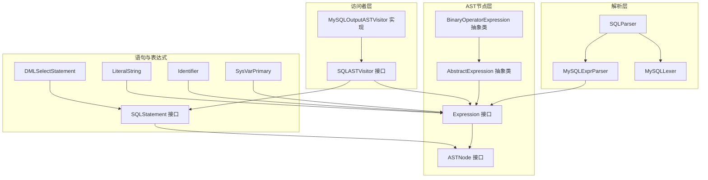
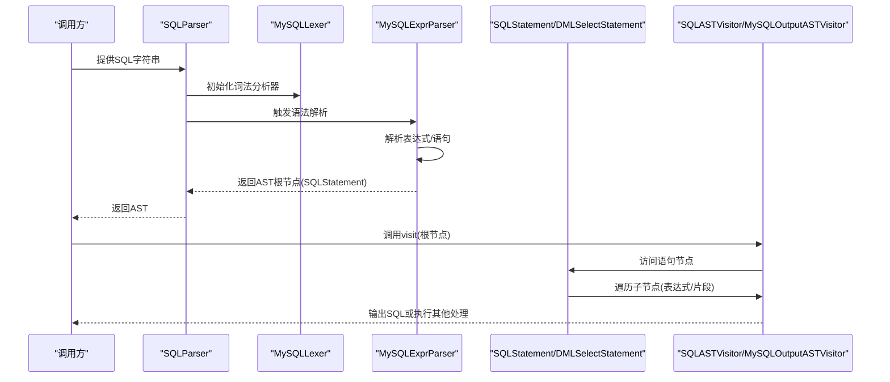
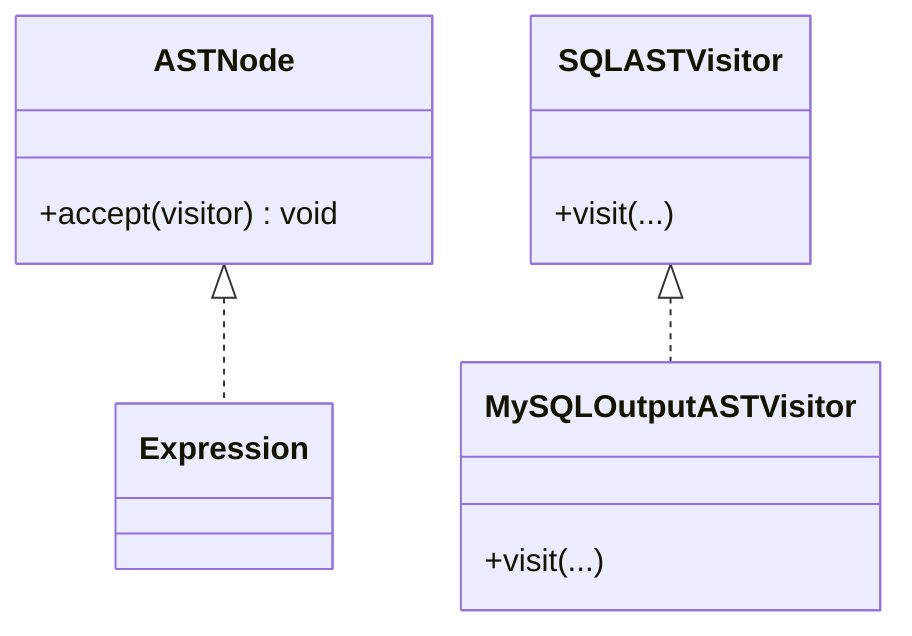
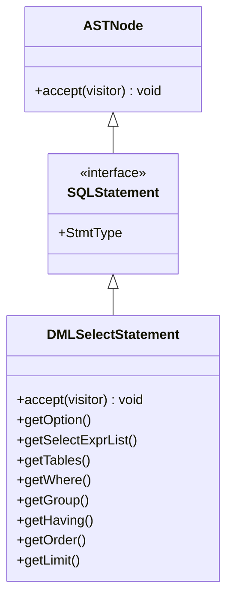
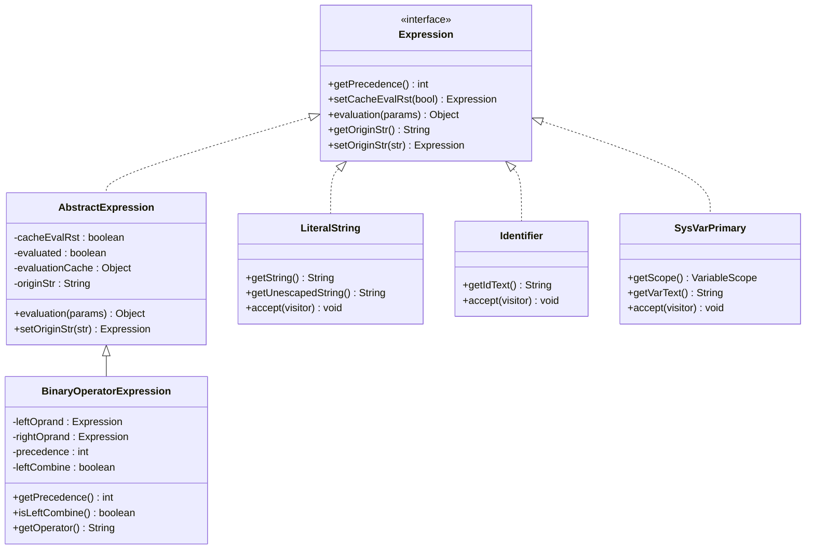
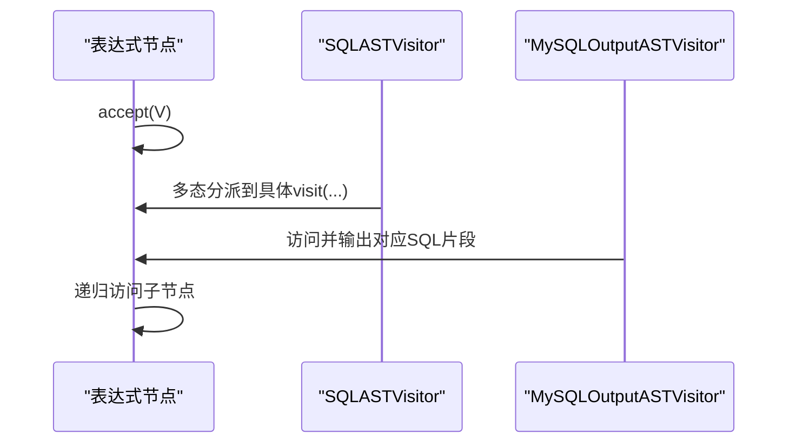
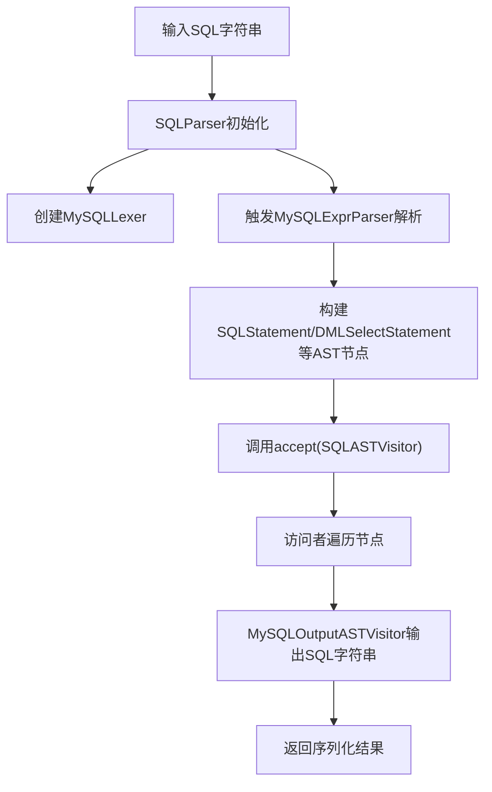
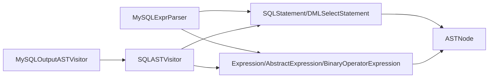

# AST处理

<cite>
**本文引用的文件**
- [ASTNode.java](file://proxy-parser/src/main/java/com/alibaba/polardbx/proxy/parser/ast/ASTNode.java)
- [Expression.java](file://proxy-parser/src/main/java/com/alibaba/polardbx/proxy/parser/ast/expression/Expression.java)
- [AbstractExpression.java](file://proxy-parser/src/main/java/com/alibaba/polardbx/proxy/parser/ast/expression/AbstractExpression.java)
- [BinaryOperatorExpression.java](file://proxy-parser/src/main/java/com/alibaba/polardbx/proxy/parser/ast/expression/BinaryOperatorExpression.java)
- [SQLASTVisitor.java](file://proxy-parser/src/main/java/com/alibaba/polardbx/proxy/parser/visitor/SQLASTVisitor.java)
- [MySQLOutputASTVisitor.java](file://proxy-parser/src/main/java/com/alibaba/polardbx/proxy/parser/visitor/MySQLOutputASTVisitor.java)
- [SQLStatement.java](file://proxy-parser/src/main/java/com/alibaba/polardbx/proxy/parser/ast/stmt/SQLStatement.java)
- [DMLSelectStatement.java](file://proxy-parser/src/main/java/com/alibaba/polardbx/proxy/parser/ast/stmt/dml/DMLSelectStatement.java)
- [LiteralString.java](file://proxy-parser/src/main/java/com/alibaba/polardbx/proxy/parser/ast/expression/primary/literal/LiteralString.java)
- [Identifier.java](file://proxy-parser/src/main/java/com/alibaba/polardbx/proxy/parser/ast/expression/primary/Identifier.java)
- [SysVarPrimary.java](file://proxy-parser/src/main/java/com/alibaba/polardbx/proxy/parser/ast/expression/primary/SysVarPrimary.java)
- [SQLParser.java](file://proxy-parser/src/main/java/com/alibaba/polardbx/proxy/parser/recognizer/SQLParser.java)
- [MySQLExprParser.java](file://proxy-parser/src/main/java/com/alibaba/polardbx/proxy/parser/recognizer/mysql/syntax/MySQLExprParser.java)
</cite>

## 目录
1. [简介](#简介)
2. [项目结构](#项目结构)
3. [核心组件](#核心组件)
4. [架构总览](#架构总览)
5. [组件详解](#组件详解)
6. [依赖关系分析](#依赖关系分析)
7. [性能考量](#性能考量)
8. [故障排查指南](#故障排查指南)
9. [结论](#结论)
10. [附录](#附录)

## 简介
本文件面向PolarDB-X Proxy的抽象语法树（AST）处理模块，系统性阐述ASTNode基类设计、SQLStatement接口实现、Expression表达式树设计、访问者模式在AST遍历中的应用，并给出从SQL字符串到AST对象的完整转换流程示例。同时覆盖AST优化策略、内存管理与序列化机制的实践建议。

## 项目结构
AST处理模块位于proxy-parser子模块中，核心目录与职责如下：
- ast：AST节点接口与基础实现，如ASTNode、Expression、AbstractExpression等
- ast/stmt：各类SQL语句的AST表示，如DMLSelectStatement等
- ast/expression：表达式树的层次结构，含算术、比较、逻辑、函数、字面量等
- visitor：访问者接口与具体实现，如SQLASTVisitor、MySQLOutputASTVisitor
- recognizer：词法与语法识别器，负责从SQL字符串生成AST
- recognizer/mysql/syntax：MySQL语法解析器（如MySQLExprParser），驱动表达式与语句的构建

图表来源
- [SQLParser.java](file://proxy-parser/src/main/java/com/alibaba/polardbx/proxy/parser/recognizer/SQLParser.java#L36-L51)
- [MySQLExprParser.java](file://proxy-parser/src/main/java/com/alibaba/polardbx/proxy/parser/recognizer/mysql/syntax/MySQLExprParser.java#L366-L392)
- [ASTNode.java](file://proxy-parser/src/main/java/com/alibaba/polardbx/proxy/parser/ast/ASTNode.java#L28-L31)
- [Expression.java](file://proxy-parser/src/main/java/com/alibaba/polardbx/proxy/parser/ast/expression/Expression.java#L30-L69)
- [AbstractExpression.java](file://proxy-parser/src/main/java/com/alibaba/polardbx/proxy/parser/ast/expression/AbstractExpression.java#L28-L68)
- [BinaryOperatorExpression.java](file://proxy-parser/src/main/java/com/alibaba/polardbx/proxy/parser/ast/expression/BinaryOperatorExpression.java#L31-L80)
- [SQLASTVisitor.java](file://proxy-parser/src/main/java/com/alibaba/polardbx/proxy/parser/visitor/SQLASTVisitor.java#L247-L700)
- [MySQLOutputASTVisitor.java](file://proxy-parser/src/main/java/com/alibaba/polardbx/proxy/parser/visitor/MySQLOutputASTVisitor.java#L1-L200)
- [SQLStatement.java](file://proxy-parser/src/main/java/com/alibaba/polardbx/proxy/parser/ast/stmt/SQLStatement.java#L28-L40)
- [DMLSelectStatement.java](file://proxy-parser/src/main/java/com/alibaba/polardbx/proxy/parser/ast/stmt/dml/DMLSelectStatement.java#L38-L192)
- [LiteralString.java](file://proxy-parser/src/main/java/com/alibaba/polardbx/proxy/parser/ast/expression/primary/literal/LiteralString.java#L32-L193)
- [Identifier.java](file://proxy-parser/src/main/java/com/alibaba/polardbx/proxy/parser/ast/expression/primary/Identifier.java#L153-L209)
- [SysVarPrimary.java](file://proxy-parser/src/main/java/com/alibaba/polardbx/proxy/parser/ast/expression/primary/SysVarPrimary.java#L44-L63)

章节来源
- [SQLParser.java](file://proxy-parser/src/main/java/com/alibaba/polardbx/proxy/parser/recognizer/SQLParser.java#L36-L51)
- [SQLASTVisitor.java](file://proxy-parser/src/main/java/com/alibaba/polardbx/proxy/parser/visitor/SQLASTVisitor.java#L247-L700)
- [Expression.java](file://proxy-parser/src/main/java/com/alibaba/polardbx/proxy/parser/ast/expression/Expression.java#L30-L69)

## 核心组件
- ASTNode：所有AST节点的统一接口，定义了accept方法以支持访问者模式
- Expression：表达式节点接口，定义运算符优先级、求值缓存、原始字符串等能力
- AbstractExpression：表达式通用实现，提供求值缓存与原始字符串存储
- BinaryOperatorExpression：二元运算表达式的抽象基类，封装左右操作数与结合性
- SQLASTVisitor：访问者接口，声明对各类表达式与语句的访问方法
- MySQLOutputASTVisitor：访问者实现，用于将AST序列化回SQL字符串
- SQLStatement：SQL语句接口，扩展自ASTNode，定义语句类型枚举
- DMLSelectStatement：SELECT语句的AST表示，包含选项、查询列表、表引用、WHERE、GROUP BY、HAVING、ORDER BY、LIMIT等

章节来源
- [ASTNode.java](file://proxy-parser/src/main/java/com/alibaba/polardbx/proxy/parser/ast/ASTNode.java#L28-L31)
- [Expression.java](file://proxy-parser/src/main/java/com/alibaba/polardbx/proxy/parser/ast/expression/Expression.java#L30-L69)
- [AbstractExpression.java](file://proxy-parser/src/main/java/com/alibaba/polardbx/proxy/parser/ast/expression/AbstractExpression.java#L28-L68)
- [BinaryOperatorExpression.java](file://proxy-parser/src/main/java/com/alibaba/polardbx/proxy/parser/ast/expression/BinaryOperatorExpression.java#L31-L80)
- [SQLASTVisitor.java](file://proxy-parser/src/main/java/com/alibaba/polardbx/proxy/parser/visitor/SQLASTVisitor.java#L247-L700)
- [MySQLOutputASTVisitor.java](file://proxy-parser/src/main/java/com/alibaba/polardbx/proxy/parser/visitor/MySQLOutputASTVisitor.java#L1-L200)
- [SQLStatement.java](file://proxy-parser/src/main/java/com/alibaba/polardbx/proxy/parser/ast/stmt/SQLStatement.java#L28-L40)
- [DMLSelectStatement.java](file://proxy-parser/src/main/java/com/alibaba/polardbx/proxy/parser/ast/stmt/dml/DMLSelectStatement.java#L38-L192)

## 架构总览
下图展示了从SQL字符串到AST对象的端到端流程，以及访问者在遍历中的作用：

图表来源
- [SQLParser.java](file://proxy-parser/src/main/java/com/alibaba/polardbx/proxy/parser/recognizer/SQLParser.java#L36-L51)
- [MySQLExprParser.java](file://proxy-parser/src/main/java/com/alibaba/polardbx/proxy/parser/recognizer/mysql/syntax/MySQLExprParser.java#L366-L392)
- [DMLSelectStatement.java](file://proxy-parser/src/main/java/com/alibaba/polardbx/proxy/parser/ast/stmt/dml/DMLSelectStatement.java#L174-L177)
- [SQLASTVisitor.java](file://proxy-parser/src/main/java/com/alibaba/polardbx/proxy/parser/visitor/SQLASTVisitor.java#L247-L700)
- [MySQLOutputASTVisitor.java](file://proxy-parser/src/main/java/com/alibaba/polardbx/proxy/parser/visitor/MySQLOutputASTVisitor.java#L1-L200)

## 组件详解

### ASTNode与访问者模式
- ASTNode定义了accept(SQLASTVisitor)方法，使任何AST节点都能“接受”访问者的访问
- 访问者通过重载不同节点类型的visit方法，实现对表达式与语句的差异化处理
- MySQLOutputASTVisitor作为典型实现，将AST节点按MySQL语法输出为字符串

图表来源
- [ASTNode.java](file://proxy-parser/src/main/java/com/alibaba/polardbx/proxy/parser/ast/ASTNode.java#L28-L31)
- [SQLASTVisitor.java](file://proxy-parser/src/main/java/com/alibaba/polardbx/proxy/parser/visitor/SQLASTVisitor.java#L247-L700)
- [MySQLOutputASTVisitor.java](file://proxy-parser/src/main/java/com/alibaba/polardbx/proxy/parser/visitor/MySQLOutputASTVisitor.java#L1-L200)

章节来源
- [ASTNode.java](file://proxy-parser/src/main/java/com/alibaba/polardbx/proxy/parser/ast/ASTNode.java#L28-L31)
- [SQLASTVisitor.java](file://proxy-parser/src/main/java/com/alibaba/polardbx/proxy/parser/visitor/SQLASTVisitor.java#L247-L700)
- [MySQLOutputASTVisitor.java](file://proxy-parser/src/main/java/com/alibaba/polardbx/proxy/parser/visitor/MySQLOutputASTVisitor.java#L1-L200)

### SQLStatement接口与语句类型
- SQLStatement继承自ASTNode，扩展了StmtType枚举，覆盖DML、DAL、MTL、AUTHORITY等语句类别
- 具体语句类（如DMLSelectStatement）实现accept方法，将自身传递给访问者

图表来源
- [SQLStatement.java](file://proxy-parser/src/main/java/com/alibaba/polardbx/proxy/parser/ast/stmt/SQLStatement.java#L28-L40)
- [DMLSelectStatement.java](file://proxy-parser/src/main/java/com/alibaba/polardbx/proxy/parser/ast/stmt/dml/DMLSelectStatement.java#L38-L192)
- [ASTNode.java](file://proxy-parser/src/main/java/com/alibaba/polardbx/proxy/parser/ast/ASTNode.java#L28-L31)

章节来源
- [SQLStatement.java](file://proxy-parser/src/main/java/com/alibaba/polardbx/proxy/parser/ast/stmt/SQLStatement.java#L28-L40)
- [DMLSelectStatement.java](file://proxy-parser/src/main/java/com/alibaba/polardbx/proxy/parser/ast/stmt/dml/DMLSelectStatement.java#L38-L192)

### 表达式树设计与优先级
- Expression接口定义了运算符优先级常量、求值缓存开关、原始字符串记录等
- AbstractExpression提供统一的evaluation实现，支持缓存结果与惰性求值
- BinaryOperatorExpression抽象出二元运算的公共字段（左/右操作数、优先级、结合性）
- 典型表达式包括字面量（如LiteralString）、标识符（Identifier）、系统变量（SysVarPrimary）等

图表来源
- [Expression.java](file://proxy-parser/src/main/java/com/alibaba/polardbx/proxy/parser/ast/expression/Expression.java#L30-L69)
- [AbstractExpression.java](file://proxy-parser/src/main/java/com/alibaba/polardbx/proxy/parser/ast/expression/AbstractExpression.java#L28-L68)
- [BinaryOperatorExpression.java](file://proxy-parser/src/main/java/com/alibaba/polardbx/proxy/parser/ast/expression/BinaryOperatorExpression.java#L31-L80)
- [LiteralString.java](file://proxy-parser/src/main/java/com/alibaba/polardbx/proxy/parser/ast/expression/primary/literal/LiteralString.java#L32-L193)
- [Identifier.java](file://proxy-parser/src/main/java/com/alibaba/polardbx/proxy/parser/ast/expression/primary/Identifier.java#L153-L209)
- [SysVarPrimary.java](file://proxy-parser/src/main/java/com/alibaba/polardbx/proxy/parser/ast/expression/primary/SysVarPrimary.java#L44-L63)

章节来源
- [Expression.java](file://proxy-parser/src/main/java/com/alibaba/polardbx/proxy/parser/ast/expression/Expression.java#L30-L69)
- [AbstractExpression.java](file://proxy-parser/src/main/java/com/alibaba/polardbx/proxy/parser/ast/expression/AbstractExpression.java#L28-L68)
- [BinaryOperatorExpression.java](file://proxy-parser/src/main/java/com/alibaba/polardbx/proxy/parser/ast/expression/BinaryOperatorExpression.java#L31-L80)
- [LiteralString.java](file://proxy-parser/src/main/java/com/alibaba/polardbx/proxy/parser/ast/expression/primary/literal/LiteralString.java#L32-L193)
- [Identifier.java](file://proxy-parser/src/main/java/com/alibaba/polardbx/proxy/parser/ast/expression/primary/Identifier.java#L153-L209)
- [SysVarPrimary.java](file://proxy-parser/src/main/java/com/alibaba/polardbx/proxy/parser/ast/expression/primary/SysVarPrimary.java#L44-L63)

### 访问者模式在AST遍历中的应用
- SQLASTVisitor声明了对表达式与语句的大量visit方法，覆盖比较、逻辑、函数、字面量、DDL片段等
- MySQLOutputASTVisitor实现这些方法，将AST节点序列化为SQL字符串，考虑运算符优先级与括号插入
- 通过在表达式节点上调用accept，实现深度优先遍历与多态分派

图表来源
- [SQLASTVisitor.java](file://proxy-parser/src/main/java/com/alibaba/polardbx/proxy/parser/visitor/SQLASTVisitor.java#L247-L700)
- [MySQLOutputASTVisitor.java](file://proxy-parser/src/main/java/com/alibaba/polardbx/proxy/parser/visitor/MySQLOutputASTVisitor.java#L536-L945)
- [BinaryOperatorExpression.java](file://proxy-parser/src/main/java/com/alibaba/polardbx/proxy/parser/ast/expression/BinaryOperatorExpression.java#L64-L73)

章节来源
- [SQLASTVisitor.java](file://proxy-parser/src/main/java/com/alibaba/polardbx/proxy/parser/visitor/SQLASTVisitor.java#L247-L700)
- [MySQLOutputASTVisitor.java](file://proxy-parser/src/main/java/com/alibaba/polardbx/proxy/parser/visitor/MySQLOutputASTVisitor.java#L536-L945)

### 从SQL字符串到AST对象的完整转换示例
以下流程展示了从输入SQL到AST对象的典型路径，以及如何通过访问者进行序列化输出：

图表来源
- [SQLParser.java](file://proxy-parser/src/main/java/com/alibaba/polardbx/proxy/parser/recognizer/SQLParser.java#L36-L51)
- [MySQLExprParser.java](file://proxy-parser/src/main/java/com/alibaba/polardbx/proxy/parser/recognizer/mysql/syntax/MySQLExprParser.java#L366-L392)
- [DMLSelectStatement.java](file://proxy-parser/src/main/java/com/alibaba/polardbx/proxy/parser/ast/stmt/dml/DMLSelectStatement.java#L174-L177)
- [MySQLOutputASTVisitor.java](file://proxy-parser/src/main/java/com/alibaba/polardbx/proxy/parser/visitor/MySQLOutputASTVisitor.java#L1-L200)

章节来源
- [SQLParser.java](file://proxy-parser/src/main/java/com/alibaba/polardbx/proxy/parser/recognizer/SQLParser.java#L36-L51)
- [MySQLExprParser.java](file://proxy-parser/src/main/java/com/alibaba/polardbx/proxy/parser/recognizer/mysql/syntax/MySQLExprParser.java#L366-L392)
- [DMLSelectStatement.java](file://proxy-parser/src/main/java/com/alibaba/polardbx/proxy/parser/ast/stmt/dml/DMLSelectStatement.java#L174-L177)
- [MySQLOutputASTVisitor.java](file://proxy-parser/src/main/java/com/alibaba/polardbx/proxy/parser/visitor/MySQLOutputASTVisitor.java#L1-L200)

## 依赖关系分析
- 语法解析器（MySQLExprParser）在解析过程中构造表达式与语句节点，最终由SQLParser产出根节点
- 表达式与语句均实现ASTNode，从而可被任意访问者访问
- 访问者接口与实现解耦了遍历算法与节点结构，便于扩展新的输出格式或分析逻辑

图表来源
- [MySQLExprParser.java](file://proxy-parser/src/main/java/com/alibaba/polardbx/proxy/parser/recognizer/mysql/syntax/MySQLExprParser.java#L366-L392)
- [Expression.java](file://proxy-parser/src/main/java/com/alibaba/polardbx/proxy/parser/ast/expression/Expression.java#L30-L69)
- [AbstractExpression.java](file://proxy-parser/src/main/java/com/alibaba/polardbx/proxy/parser/ast/expression/AbstractExpression.java#L28-L68)
- [BinaryOperatorExpression.java](file://proxy-parser/src/main/java/com/alibaba/polardbx/proxy/parser/ast/expression/BinaryOperatorExpression.java#L31-L80)
- [SQLStatement.java](file://proxy-parser/src/main/java/com/alibaba/polardbx/proxy/parser/ast/stmt/SQLStatement.java#L28-L40)
- [DMLSelectStatement.java](file://proxy-parser/src/main/java/com/alibaba/polardbx/proxy/parser/ast/stmt/dml/DMLSelectStatement.java#L38-L192)
- [SQLASTVisitor.java](file://proxy-parser/src/main/java/com/alibaba/polardbx/proxy/parser/visitor/SQLASTVisitor.java#L247-L700)
- [MySQLOutputASTVisitor.java](file://proxy-parser/src/main/java/com/alibaba/polardbx/proxy/parser/visitor/MySQLOutputASTVisitor.java#L1-L200)

章节来源
- [MySQLExprParser.java](file://proxy-parser/src/main/java/com/alibaba/polardbx/proxy/parser/recognizer/mysql/syntax/MySQLExprParser.java#L366-L392)
- [SQLASTVisitor.java](file://proxy-parser/src/main/java/com/alibaba/polardbx/proxy/parser/visitor/SQLASTVisitor.java#L247-L700)

## 性能考量
- 求值缓存：AbstractExpression提供evaluation缓存，避免重复计算；可通过setCacheEvalRst控制是否启用
- 优先级与括号：MySQLOutputASTVisitor在输出时依据运算符优先级自动插入括号，减少错误与二次解析成本
- 内存管理：表达式与语句节点生命周期由解析器与访问者共同管理；建议在不需要保留AST时及时释放引用，避免内存泄漏
- 序列化开销：访问者遍历为线性复杂度，但频繁字符串拼接可能带来GC压力；可采用缓冲池或预分配策略降低分配次数

章节来源
- [AbstractExpression.java](file://proxy-parser/src/main/java/com/alibaba/polardbx/proxy/parser/ast/expression/AbstractExpression.java#L28-L68)
- [MySQLOutputASTVisitor.java](file://proxy-parser/src/main/java/com/alibaba/polardbx/proxy/parser/visitor/MySQLOutputASTVisitor.java#L536-L945)

## 故障排查指南
- 语法错误：SQLParser在初始化词法分析器时可能抛出异常，需检查输入SQL合法性与字符集设置
- 访问者未覆盖：若新增表达式节点后未在SQLASTVisitor中添加对应visit方法，可能导致运行期缺失分支；应确保访问者接口与实现同步更新
- 优先级误判：输出SQL括号不当可能源于优先级判断错误；应核对Expression中优先级常量与访问者中的比较逻辑
- 字面量转义：LiteralString提供多种转义处理方法，若LIKE匹配或普通字符串处理异常，需检查转义逻辑与大小写处理

章节来源
- [SQLParser.java](file://proxy-parser/src/main/java/com/alibaba/polardbx/proxy/parser/recognizer/SQLParser.java#L36-L51)
- [SQLASTVisitor.java](file://proxy-parser/src/main/java/com/alibaba/polardbx/proxy/parser/visitor/SQLASTVisitor.java#L247-L700)
- [LiteralString.java](file://proxy-parser/src/main/java/com/alibaba/polardbx/proxy/parser/ast/expression/primary/literal/LiteralString.java#L76-L175)

## 结论
PolarDB-X Proxy的AST处理模块以访问者模式为核心，实现了表达式与语句的清晰分离与可扩展输出。通过优先级与括号控制、求值缓存与原始字符串记录，既保证了序列化准确性，也兼顾了性能与可维护性。建议在扩展新节点或访问者时遵循现有接口契约，确保一致性与稳定性。

## 附录
- 关键接口与类路径参考见“本文引用的文件”
- 若需进一步了解具体表达式与语句的实现细节，请参阅相应源码文件