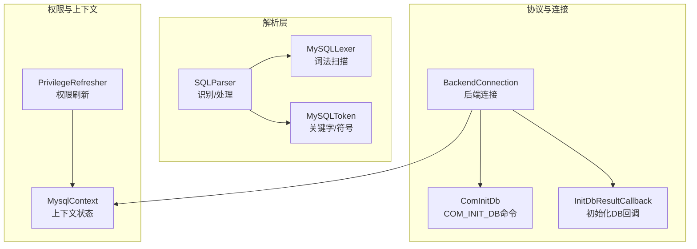
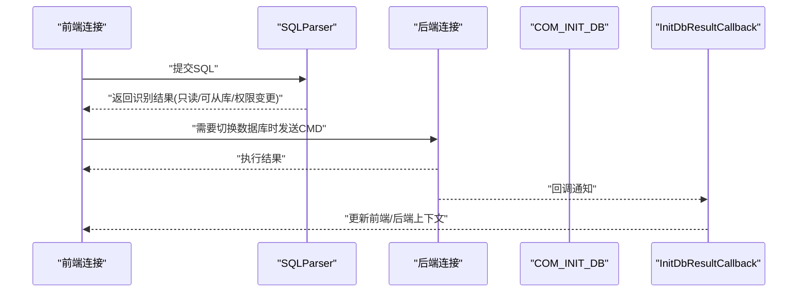
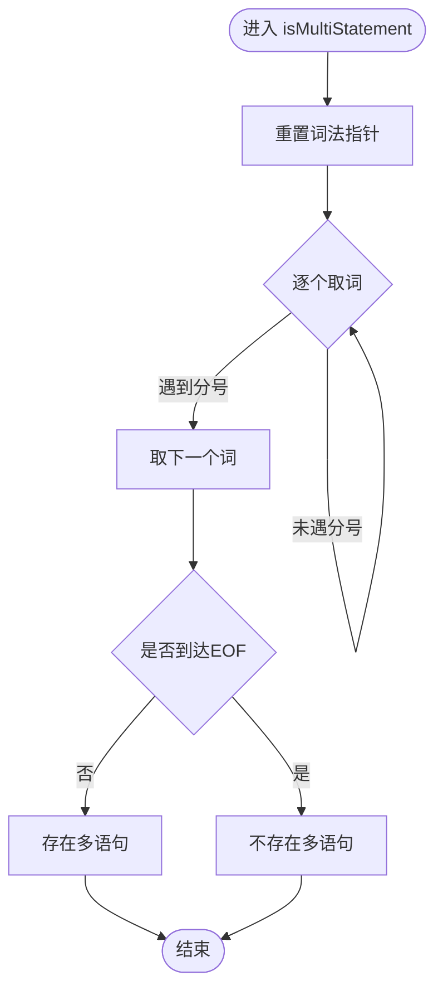
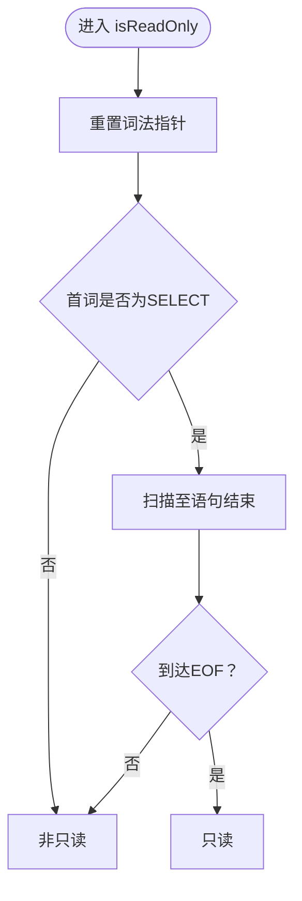
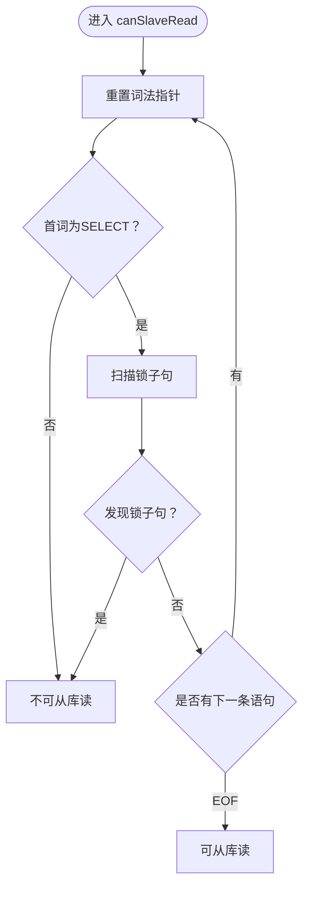
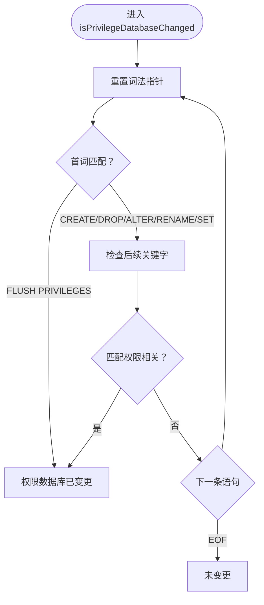
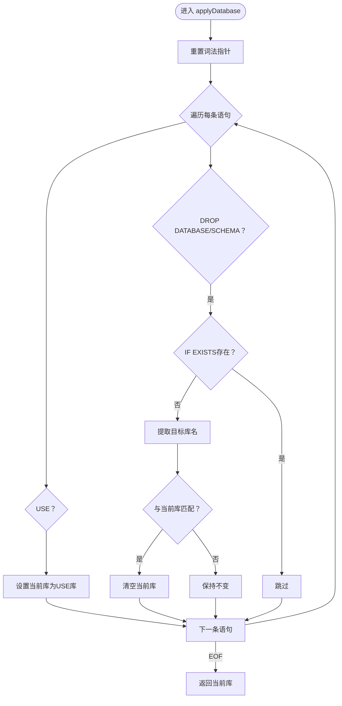
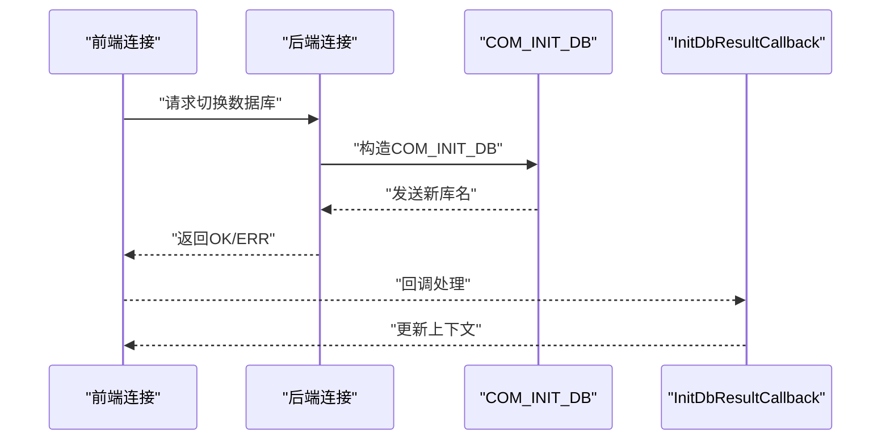
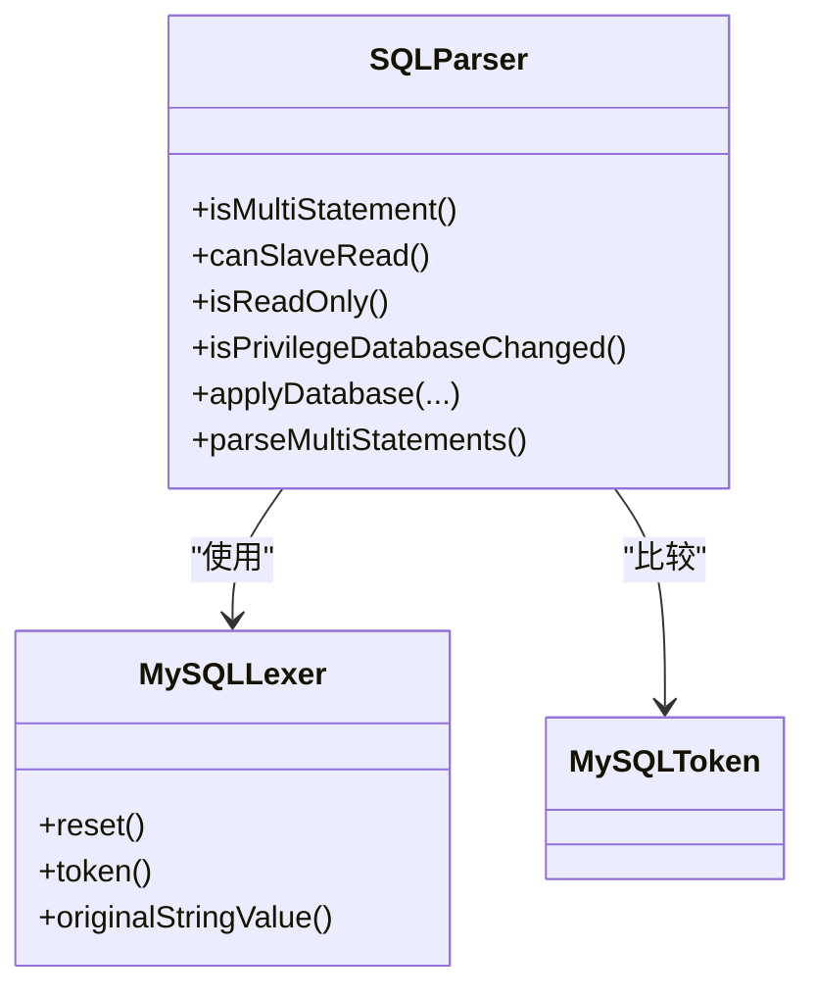

# SQL功能特性

<cite>
**本文引用的文件**
- [proxy-parser/src/main/java/com/alibaba/polardbx/proxy/parser/recognizer/SQLParser.java](file://proxy-parser/src/main/java/com/alibaba/polardbx/proxy/parser/recognizer/SQLParser.java)
- [proxy-parser/src/main/java/com/alibaba/polardbx/proxy/parser/recognizer/mysql/lexer/MySQLLexer.java](file://proxy-parser/src/main/java/com/alibaba/polardbx/proxy/parser/recognizer/mysql/lexer/MySQLLexer.java)
- [proxy-parser/src/main/java/com/alibaba/polardbx/proxy/parser/recognizer/mysql/MySQLToken.java](file://proxy-parser/src/main/java/com/alardbx/proxy/parser/recognizer/mysql/MySQLToken.java)
- [proxy-parser/src/test/java/com/alibaba/polardbx/proxy/parser/SQLParserTest.java](file://proxy-parser/src/test/java/com/alibaba/polardbx/proxy/parser/SQLParserTest.java)
- [proxy-core/src/main/java/com/alibaba/polardbx/proxy/connection/BackendConnection.java](file://proxy-core/src/main/java/com/alibaba/polardbx/proxy/connection/BackendConnection.java)
- [proxy-core/src/main/java/com/alibaba/polardbx/proxy/callback/InitDbResultCallback.java](file://proxy-core/src/main/java/com/alibaba/polardbx/proxy/callback/InitDbResultCallback.java)
- [proxy-core/src/main/java/com/alibaba/polardbx/proxy/protocol/command/ComInitDb.java](file://proxy-core/src/main/java/com/alibaba/polardbx/proxy/protocol/command/ComInitDb.java)
- [proxy-core/src/main/java/com/alibaba/polardbx/proxy/privilege/PrivilegeRefresher.java](file://proxy-core/src/main/java/com/alibaba/polardbx/proxy/privilege/PrivilegeRefresher.java)
- [proxy-parser/src/main/java/com/alibaba/polardbx/proxy/parser/recognizer/mysql/syntax/MySQLDALParser.java](file://proxy-parser/src/main/java/com/alibaba/polardbx/proxy/parser/recognizer/mysql/syntax/MySQLDALParser.java)
- [proxy-parser/src/main/java/com/alibaba/polardbx/proxy/parser/recognizer/mysql/syntax/MySQLDMLSelectParser.java](file://proxy-parser/src/main/java/com/alibaba/polardbx/proxy/parser/recognizer/mysql/syntax/MySQLDMLSelectParser.java)
- [proxy-common/src/main/java/com/alibaba/polardbx/proxy/utils/FastBufferPool.java](file://proxy-common/src/main/java/com/alibaba/polardbx/proxy/utils/FastBufferPool.java)
- [proxy-common/src/main/java/com/alibaba/polardbx/proxy/utils/Slice.java](file://proxy-common/src/main/java/com/alibaba/polardbx/proxy/utils/Slice.java)
- [proxy-core/src/main/java/com/alibaba/polardbx/proxy/protocol/decoder/NativeDecoder.java](file://proxy-core/src/main/java/com/alibaba/polardbx/proxy/protocol/decoder/NativeDecoder.java)
- [proxy-core/src/main/java/com/alibaba/polardbx/proxy/protocol/decoder/UnsafeDecoder.java](file://proxy-core/src/main/java/com/alibaba/polardbx/proxy/protocol/decoder/UnsafeDecoder.java)
- [proxy-core/src/main/java/com/alibaba/polardbx/proxy/context/MysqlContext.java](file://proxy-core/src/main/java/com/alibaba/polardbx/proxy/context/MysqlContext.java)
</cite>

## 目录
1. [简介](#简介)
2. [项目结构](#项目结构)
3. [核心组件](#核心组件)
4. [架构总览](#架构总览)
5. [详细组件分析](#详细组件分析)
6. [依赖关系分析](#依赖关系分析)
7. [性能考虑](#性能考虑)
8. [故障排查指南](#故障排查指南)
9. [结论](#结论)
10. [附录](#附录)

## 简介
本文件面向 PolarDB-X Proxy 的 SQL 功能特性模块，系统化梳理 SQLParser 的核心能力与实现细节，覆盖以下关键主题：
- 多语句解析：识别与拆分多条 SQL 语句的能力
- 只读检测：isReadOnly 方法对只读语句的识别机制
- 权限数据库变更检测：isPrivilegeDatabaseChanged 对权限相关语句的判定
- 数据库切换：applyDatabase 对 USE/DROP DATABASE 等语句的处理
- 读写分离判断：canSlaveRead 的 SELECT 锁机制分析
- MySQL 方言支持与兼容性：版本控制、关键字枚举与方言差异处理
- 性能优化策略：词法扫描、缓冲池与解码器优化

## 项目结构
围绕 SQL 功能特性，涉及的关键模块与文件如下：
- 解析层：SQLParser（识别与处理）、MySQLLexer（词法扫描）、MySQLToken（关键字/符号枚举）
- 协议与连接：BackendConnection、ComInitDb、InitDbResultCallback（数据库切换流程）
- 权限刷新：PrivilegeRefresher（权限/模式刷新）
- 测试用例：SQLParserTest（验证多语句、只读、权限变更、数据库切换等行为）

**图示来源**
- [proxy-parser/src/main/java/com/alibaba/polardbx/proxy/parser/recognizer/SQLParser.java](file://proxy-parser/src/main/java/com/alibaba/polardbx/proxy/parser/recognizer/SQLParser.java#L36-L336)
- [proxy-parser/src/main/java/com/alibaba/polardbx/proxy/parser/recognizer/mysql/lexer/MySQLLexer.java](file://proxy-parser/src/main/java/com/alibaba/polardbx/proxy/parser/recognizer/mysql/lexer/MySQLLexer.java#L35-L200)
- [proxy-parser/src/main/java/com/alibaba/polardbx/proxy/parser/recognizer/mysql/MySQLToken.java](file://proxy-parser/src/main/java/com/alibaba/polardbx/proxy/parser/recognizer/mysql/MySQLToken.java#L28-L200)
- [proxy-core/src/main/java/com/alibaba/polardbx/proxy/connection/BackendConnection.java](file://proxy-core/src/main/java/com/alibaba/polardbx/proxy/connection/BackendConnection.java#L428-L484)
- [proxy-core/src/main/java/com/alibaba/polardbx/proxy/protocol/command/ComInitDb.java](file://proxy-core/src/main/java/com/alibaba/polardbx/proxy/protocol/command/ComInitDb.java#L38-L55)
- [proxy-core/src/main/java/com/alibaba/polardbx/proxy/callback/InitDbResultCallback.java](file://proxy-core/src/main/java/com/alibaba/polardbx/proxy/callback/InitDbResultCallback.java#L29-L65)
- [proxy-core/src/main/java/com/alibaba/polardbx/proxy/privilege/PrivilegeRefresher.java](file://proxy-core/src/main/java/com/alibaba/polardbx/proxy/privilege/PrivilegeRefresher.java#L131-L174)
- [proxy-core/src/main/java/com/alibaba/polardbx/proxy/context/MysqlContext.java](file://proxy-core/src/main/java/com/alibaba/polardbx/proxy/context/MysqlContext.java#L171-L214)

**章节来源**
- [proxy-parser/src/main/java/com/alibaba/polardbx/proxy/parser/recognizer/SQLParser.java](file://proxy-parser/src/main/java/com/alibaba/polardbx/proxy/parser/recognizer/SQLParser.java#L36-L336)
- [proxy-parser/src/main/java/com/alibaba/polardbx/proxy/parser/recognizer/mysql/lexer/MySQLLexer.java](file://proxy-parser/src/main/java/com/alibaba/polardbx/proxy/parser/recognizer/mysql/lexer/MySQLLexer.java#L35-L200)
- [proxy-parser/src/main/java/com/alibaba/polardbx/proxy/parser/recognizer/mysql/MySQLToken.java](file://proxy-parser/src/main/java/com/alibaba/polardbx/proxy/parser/recognizer/mysql/MySQLToken.java#L28-L200)

## 核心组件
- SQLParser：提供多语句识别、只读检测、权限数据库变更检测、数据库切换处理等能力
- MySQLLexer：负责 SQL 字节流的词法扫描，维护位置、缓存与注释记录
- MySQLToken：枚举所有 MySQL 关键字与标点符号，用于语法识别
- BackendConnection/ComInitDb/InitDbResultCallback：实现数据库切换的前后端交互与状态同步
- PrivilegeRefresher：刷新权限与模式集合，保障权限变更后的数据一致性

**章节来源**
- [proxy-parser/src/main/java/com/alibaba/polardbx/proxy/parser/recognizer/SQLParser.java](file://proxy-parser/src/main/java/com/alibaba/polardbx/proxy/parser/recognizer/SQLParser.java#L53-L336)
- [proxy-parser/src/main/java/com/alibaba/polardbx/proxy/parser/recognizer/mysql/lexer/MySQLLexer.java](file://proxy-parser/src/main/java/com/alibaba/polardbx/proxy/parser/recognizer/mysql/lexer/MySQLLexer.java#L110-L146)
- [proxy-parser/src/main/java/com/alibaba/polardbx/proxy/parser/recognizer/mysql/MySQLToken.java](file://proxy-parser/src/main/java/com/alibaba/polardbx/proxy/parser/recognizer/mysql/MySQLToken.java#L28-L200)
- [proxy-core/src/main/java/com/alibaba/polardbx/proxy/connection/BackendConnection.java](file://proxy-core/src/main/java/com/alibaba/polardbx/proxy/connection/BackendConnection.java#L428-L484)
- [proxy-core/src/main/java/com/alibaba/polardbx/proxy/protocol/command/ComInitDb.java](file://proxy-core/src/main/java/com/alibaba/polardbx/proxy/protocol/command/ComInitDb.java#L38-L55)
- [proxy-core/src/main/java/com/alibaba/polardbx/proxy/callback/InitDbResultCallback.java](file://proxy-core/src/main/java/com/alibaba/polardbx/proxy/callback/InitDbResultCallback.java#L29-L65)
- [proxy-core/src/main/java/com/alibaba/polardbx/proxy/privilege/PrivilegeRefresher.java](file://proxy-core/src/main/java/com/alibaba/polardbx/proxy/privilege/PrivilegeRefresher.java#L131-L174)

## 架构总览
SQL 功能特性在 Proxy 中的调用链路如下：
- 前端连接接收 SQL，交由 SQLParser 进行识别与处理
- 对于数据库切换类语句，通过 COM_INIT_DB 与后端交互，使用 InitDbResultCallback 同步前端/后端上下文
- 权限相关语句触发 PrivilegeRefresher 刷新权限与模式集合
- MySQLLexer 提供高效词法扫描，配合 MySQLToken 实现关键字识别

**图示来源**
- [proxy-parser/src/main/java/com/alibaba/polardbx/proxy/parser/recognizer/SQLParser.java](file://proxy-parser/src/main/java/com/alibaba/polardbx/proxy/parser/recognizer/SQLParser.java#L188-L254)
- [proxy-core/src/main/java/com/alibaba/polardbx/proxy/connection/BackendConnection.java](file://proxy-core/src/main/java/com/alibaba/polardbx/proxy/connection/BackendConnection.java#L428-L484)
- [proxy-core/src/main/java/com/alibaba/polardbx/proxy/protocol/command/ComInitDb.java](file://proxy-core/src/main/java/com/alibaba/polardbx/proxy/protocol/command/ComInitDb.java#L38-L55)
- [proxy-core/src/main/java/com/alibaba/polardbx/proxy/callback/InitDbResultCallback.java](file://proxy-core/src/main/java/com/alibaba/polardbx/proxy/callback/InitDbResultCallback.java#L29-L65)

## 详细组件分析

### 多语句解析与处理
- isMultiStatement：通过重置词法指针，扫描分号以判断是否存在多个语句
- parseMultiStatements：基于 MySQLLexer 逐条解析，支持 EXPLAIN、SET、SHOW、KILL 等命令类型，并在遇到非法语句时抛出带上下文的错误信息

**图示来源**
- [proxy-parser/src/main/java/com/alarda/polardbx/proxy/parser/recognizer/SQLParser.java](file://proxy-parser/src/main/java/com/alibaba/polardbx/proxy/parser/recognizer/SQLParser.java#L53-L62)
- [proxy-parser/src/main/java/com/alibaba/polardbx/proxy/parser/recognizer/SQLParser.java](file://proxy-parser/src/main/java/com/alibaba/polardbx/proxy/parser/recognizer/SQLParser.java#L277-L334)

**章节来源**
- [proxy-parser/src/main/java/com/alibaba/polardbx/proxy/parser/recognizer/SQLParser.java](file://proxy-parser/src/main/java/com/alibaba/polardbx/proxy/parser/recognizer/SQLParser.java#L53-L62)
- [proxy-parser/src/main/java/com/alibaba/polardbx/proxy/parser/recognizer/SQLParser.java](file://proxy-parser/src/main/java/com/alibaba/polardbx/proxy/parser/recognizer/SQLParser.java#L277-L334)
- [proxy-parser/src/test/java/com/alibaba/polardbx/proxy/parser/SQLParserTest.java](file://proxy-parser/src/test/java/com/alibaba/polardbx/proxy/parser/SQLParserTest.java#L133-L149)

### 只读检测：isReadOnly
- 仅当首词为 SELECT 且语句末尾无锁子句时，判定为只读
- 该方法会消费至语句结束，确保完整识别

**图示来源**
- [proxy-parser/src/main/java/com/alibaba/polardbx/proxy/parser/recognizer/SQLParser.java](file://proxy-parser/src/main/java/com/alibaba/polardbx/proxy/parser/recognizer/SQLParser.java#L114-L136)

**章节来源**
- [proxy-parser/src/main/java/com/alibaba/polardbx/proxy/parser/recognizer/SQLParser.java](file://proxy-parser/src/main/java/com/alibaba/polardbx/proxy/parser/recognizer/SQLParser.java#L114-L136)
- [proxy-parser/src/test/java/com/alibaba/polardbx/proxy/parser/SQLParserTest.java](file://proxy-parser/src/test/java/com/alibaba/polardbx/proxy/parser/SQLParserTest.java#L151-L169)

### 读写分离判断：canSlaveRead
- 首词必须为 SELECT
- 检测锁子句：FOR UPDATE、FOR SHARE、LOCK IN SHARE MODE 任一出现即不可路由到从库
- 若仅含 SELECT 且无锁，则可从库读

**图示来源**
- [proxy-parser/src/main/java/com/alibaba/polardbx/proxy/parser/recognizer/SQLParser.java](file://proxy-parser/src/main/java/com/alibaba/polardbx/proxy/parser/recognizer/SQLParser.java#L64-L112)

**章节来源**
- [proxy-parser/src/main/java/com/alibaba/polardbx/proxy/parser/recognizer/SQLParser.java](file://proxy-parser/src/main/java/com/alibaba/polardbx/proxy/parser/recognizer/SQLParser.java#L64-L112)
- [proxy-parser/src/test/java/com/alibaba/polardbx/proxy/parser/SQLParserTest.java](file://proxy-parser/src/test/java/com/alibaba/polardbx/proxy/parser/SQLParserTest.java#L151-L169)

### 权限数据库变更检测：isPrivilegeDatabaseChanged
- 覆盖权限/用户/模式相关的关键字：FLUSH PRIVILEGES、CREATE/DROP DATABASE/SCHEMA/USER、ALTER USER、RENAME USER、SET PASSWORD
- 逐条扫描，遇到上述关键字即返回“权限数据库已变更”

**图示来源**
- [proxy-parser/src/main/java/com/alibaba/polardbx/proxy/parser/recognizer/SQLParser.java](file://proxy-parser/src/main/java/com/alibaba/polardbx/proxy/parser/recognizer/SQLParser.java#L138-L186)

**章节来源**
- [proxy-parser/src/main/java/com/alibaba/polardbx/proxy/parser/recognizer/SQLParser.java](file://proxy-parser/src/main/java/com/alibaba/polardbx/proxy/parser/recognizer/SQLParser.java#L138-L186)
- [proxy-parser/src/test/java/com/alibaba/polardbx/proxy/parser/SQLParserTest.java](file://proxy-parser/src/test/java/com/alibaba/polardbx/proxy/parser/SQLParserTest.java#L171-L213)
- [proxy-core/src/main/java/com/alibaba/polardbx/proxy/privilege/PrivilegeRefresher.java](file://proxy-core/src/main/java/com/alibaba/polardbx/proxy/privilege/PrivilegeRefresher.java#L131-L174)

### 数据库切换：applyDatabase
- 支持 USE 与 DROP DATABASE/SCHEMA 语句
- 对 USE：直接切换当前数据库；对 DROP：若删除的是当前数据库则清空当前数据库
- 支持多语句场景，结合 stmtGood 数组按成功语句进行条件切换

**图示来源**
- [proxy-parser/src/main/java/com/alibaba/polardbx/proxy/parser/recognizer/SQLParser.java](file://proxy-parser/src/main/java/com/alibaba/polardbx/proxy/parser/recognizer/SQLParser.java#L188-L254)

**章节来源**
- [proxy-parser/src/main/java/com/alibaba/polardbx/proxy/parser/recognizer/SQLParser.java](file://proxy-parser/src/main/java/com/alibaba/polardbx/proxy/parser/recognizer/SQLParser.java#L188-L254)
- [proxy-parser/src/test/java/com/alibaba/polardbx/proxy/parser/SQLParserTest.java](file://proxy-parser/src/test/java/com/alibaba/polardbx/proxy/parser/SQLParserTest.java#L215-L266)

### 数据库切换流程（后端交互）
- 当需要切换数据库时，后端连接通过 COM_INIT_DB 发送新库名
- 成功后 InitDbResultCallback 更新前端/后端上下文状态
- 若失败且允许中止，抛出异常；否则忽略或继续

**图示来源**
- [proxy-core/src/main/java/com/alibaba/polardbx/proxy/connection/BackendConnection.java](file://proxy-core/src/main/java/com/alibaba/polardbx/proxy/connection/BackendConnection.java#L428-L484)
- [proxy-core/src/main/java/com/alibaba/polardbx/proxy/protocol/command/ComInitDb.java](file://proxy-core/src/main/java/com/alibaba/polardbx/proxy/protocol/command/ComInitDb.java#L38-L55)
- [proxy-core/src/main/java/com/alibaba/polardbx/proxy/callback/InitDbResultCallback.java](file://proxy-core/src/main/java/com/alibaba/polardbx/proxy/callback/InitDbResultCallback.java#L29-L65)

**章节来源**
- [proxy-core/src/main/java/com/alibaba/polardbx/proxy/connection/BackendConnection.java](file://proxy-core/src/main/java/com/alibaba/polardbx/proxy/connection/BackendConnection.java#L428-L484)
- [proxy-core/src/main/java/com/alibaba/polardbx/proxy/protocol/command/ComInitDb.java](file://proxy-core/src/main/java/com/alibaba/polardbx/proxy/protocol/command/ComInitDb.java#L38-L55)
- [proxy-core/src/main/java/com/alibaba/polardbx/proxy/callback/InitDbResultCallback.java](file://proxy-core/src/main/java/com/alibaba/polardbx/proxy/callback/InitDbResultCallback.java#L29-L65)

### MySQL 方言支持与兼容性
- 版本控制：MySQLLexer 默认版本常量，支持不同 MySQL 版本的语法差异
- 关键字枚举：MySQLToken 完整覆盖 MySQL 8.0 关键字，保证识别准确性
- 方言扩展：MySQLDALParser、MySQLDMLSelectParser 等语法解析器支持 SHOW/SET/SELECT 等方言特性

**章节来源**
- [proxy-parser/src/main/java/com/alibaba/polardbx/proxy/parser/recognizer/mysql/lexer/MySQLLexer.java](file://proxy-parser/src/main/java/com/alibaba/polardbx/proxy/parser/recognizer/mysql/lexer/MySQLLexer.java#L35-L84)
- [proxy-parser/src/main/java/com/alibaba/polardbx/proxy/parser/recognizer/mysql/MySQLToken.java](file://proxy-parser/src/main/java/com/alibaba/polardbx/proxy/parser/recognizer/mysql/MySQLToken.java#L196-L200)
- [proxy-parser/src/main/java/com/alibaba/polardbx/proxy/parser/recognizer/mysql/syntax/MySQLDALParser.java](file://proxy-parser/src/main/java/com/alibaba/polardbx/proxy/parser/recognizer/mysql/syntax/MySQLDALParser.java#L75-L97)
- [proxy-parser/src/main/java/com/alibaba/polardbx/proxy/parser/recognizer/mysql/syntax/MySQLDMLSelectParser.java](file://proxy-parser/src/main/java/com/alibaba/polardbx/proxy/parser/recognizer/mysql/syntax/MySQLDMLSelectParser.java#L84-L113)

## 依赖关系分析
SQLParser 与词法/语法组件的依赖关系如下：

**图示来源**
- [proxy-parser/src/main/java/com/alibaba/polardbx/proxy/parser/recognizer/SQLParser.java](file://proxy-parser/src/main/java/com/alibaba/polardbx/proxy/parser/recognizer/SQLParser.java#L36-L336)
- [proxy-parser/src/main/java/com/alibaba/polardbx/proxy/parser/recognizer/mysql/lexer/MySQLLexer.java](file://proxy-parser/src/main/java/com/alibaba/polardbx/proxy/parser/recognizer/mysql/lexer/MySQLLexer.java#L110-L146)
- [proxy-parser/src/main/java/com/alibaba/polardbx/proxy/parser/recognizer/mysql/MySQLToken.java](file://proxy-parser/src/main/java/com/alibaba/polardbx/proxy/parser/recognizer/mysql/MySQLToken.java#L28-L200)

**章节来源**
- [proxy-parser/src/main/java/com/alibaba/polardbx/proxy/parser/recognizer/SQLParser.java](file://proxy-parser/src/main/java/com/alibaba/polardbx/proxy/parser/recognizer/SQLParser.java#L36-L336)
- [proxy-parser/src/main/java/com/alibaba/polardbx/proxy/parser/recognizer/mysql/lexer/MySQLLexer.java](file://proxy-parser/src/main/java/com/alibaba/polardbx/proxy/parser/recognizer/mysql/lexer/MySQLLexer.java#L110-L146)
- [proxy-parser/src/main/java/com/alibaba/polardbx/proxy/parser/recognizer/mysql/MySQLToken.java](file://proxy-parser/src/main/java/com/alibaba/polardbx/proxy/parser/recognizer/mysql/MySQLToken.java#L28-L200)

## 性能考虑
- 词法扫描优化：MySQLLexer 使用线程本地缓冲与字符类型表，减少分配与分支判断
- 缓冲池：FastBufferPool 提供大块内存复用与引用计数，降低 GC 压力
- 解码器：NativeDecoder/UnsafeDecoder 采用直接内存访问，避免数组拷贝
- 上下文编码/解码：MysqlContext 提供统一的字符串编解码接口，减少重复转换

**章节来源**
- [proxy-parser/src/main/java/com/alibaba/polardbx/proxy/parser/recognizer/mysql/lexer/MySQLLexer.java](file://proxy-parser/src/main/java/com/alibaba/polardbx/proxy/parser/recognizer/mysql/lexer/MySQLLexer.java#L77-L108)
- [proxy-common/src/main/java/com/alibaba/polardbx/proxy/utils/FastBufferPool.java](file://proxy-common/src/main/java/com/alibaba/polardbx/proxy/utils/FastBufferPool.java#L130-L185)
- [proxy-common/src/main/java/com/alibaba/polardbx/proxy/utils/Slice.java](file://proxy-common/src/main/java/com/alibaba/polardbx/proxy/utils/Slice.java#L76-L107)
- [proxy-core/src/main/java/com/alibaba/polardbx/proxy/protocol/decoder/NativeDecoder.java](file://proxy-core/src/main/java/com/alibaba/polardbx/proxy/protocol/decoder/NativeDecoder.java#L218-L278)
- [proxy-core/src/main/java/com/alibaba/polardbx/proxy/protocol/decoder/UnsafeDecoder.java](file://proxy-core/src/main/java/com/alibaba/polardbx/proxy/protocol/decoder/UnsafeDecoder.java#L242-L286)
- [proxy-core/src/main/java/com/alibaba/polardbx/proxy/context/MysqlContext.java](file://proxy-core/src/main/java/com/alibaba/polardbx/proxy/context/MysqlContext.java#L171-L183)

## 故障排查指南
- 多语句解析错误：parseMultiStatements 在遇到不支持的语句时会抛出带上下文片段的异常，便于定位问题
- 数据库切换失败：BackendConnection 在切换失败且允许中止时抛出异常；若为特定错误码可忽略并标记当前库为空
- 权限刷新异常：PrivilegeRefresher 捕获异常并记录日志，避免影响主流程

**章节来源**
- [proxy-parser/src/main/java/com/alibaba/polardbx/proxy/parser/recognizer/SQLParser.java](file://proxy-parser/src/main/java/com/alibaba/polardbx/proxy/parser/recognizer/SQLParser.java#L256-L274)
- [proxy-core/src/main/java/com/alibaba/polardbx/proxy/connection/BackendConnection.java](file://proxy-core/src/main/java/com/alibaba/polardbx/proxy/connection/BackendConnection.java#L432-L457)
- [proxy-core/src/main/java/com/alibaba/polardbx/proxy/privilege/PrivilegeRefresher.java](file://proxy-core/src/main/java/com/alibaba/polardbx/proxy/privilege/PrivilegeRefresher.java#L172-L174)

## 结论
SQLParser 在 PolarDB-X Proxy 中承担了 SQL 语句识别与处理的核心职责，具备完善的多语句解析、只读/从库路由判断、权限数据库变更检测与数据库切换能力。配合高效的词法扫描、缓冲池与解码器，整体在性能与兼容性上均有良好表现。建议在实际部署中：
- 对复杂多语句场景启用 isMultiStatement 与 parseMultiStatements 进行严格校验
- 在读写分离场景下优先使用 canSlaveRead 与 isReadOnly 确保路由正确性
- 对权限相关语句及时触发权限刷新，保证一致性

## 附录
- 示例用法参考测试用例中的断言与场景设计，涵盖多语句、只读/加锁、权限变更与数据库切换等典型路径

**章节来源**
- [proxy-parser/src/test/java/com/alibaba/polardbx/proxy/parser/SQLParserTest.java](file://proxy-parser/src/test/java/com/alibaba/polardbx/proxy/parser/SQLParserTest.java#L133-L266)