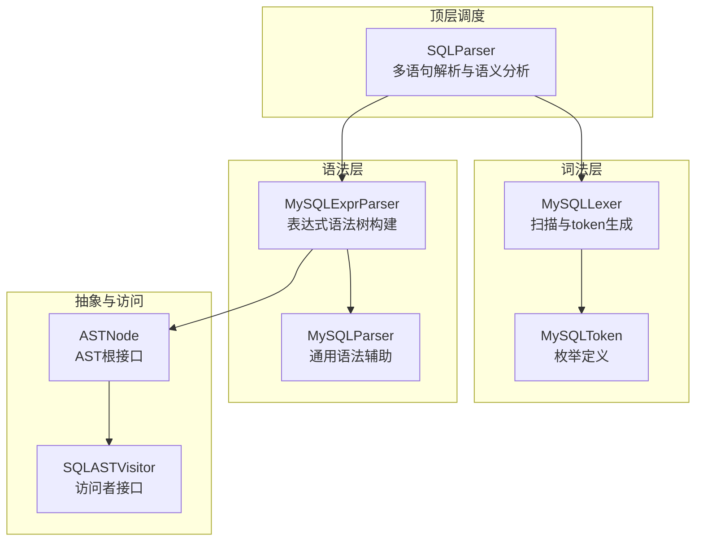
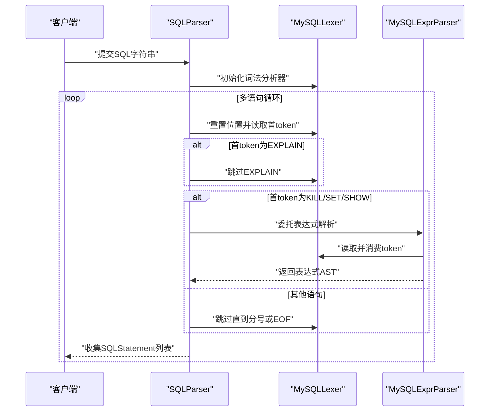
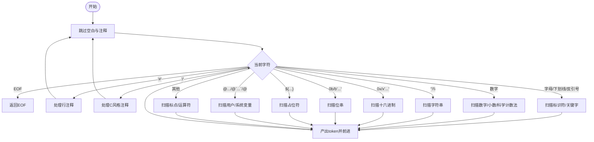
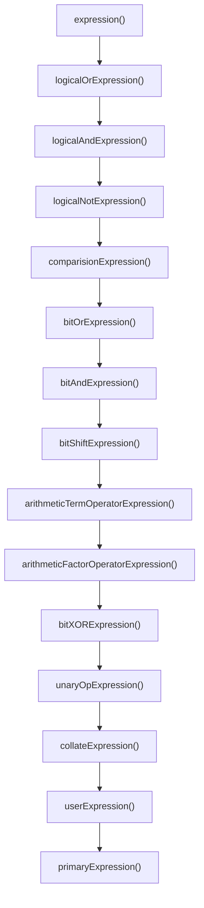
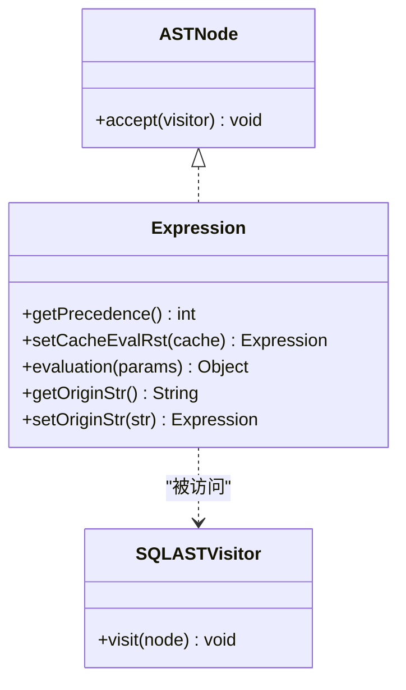
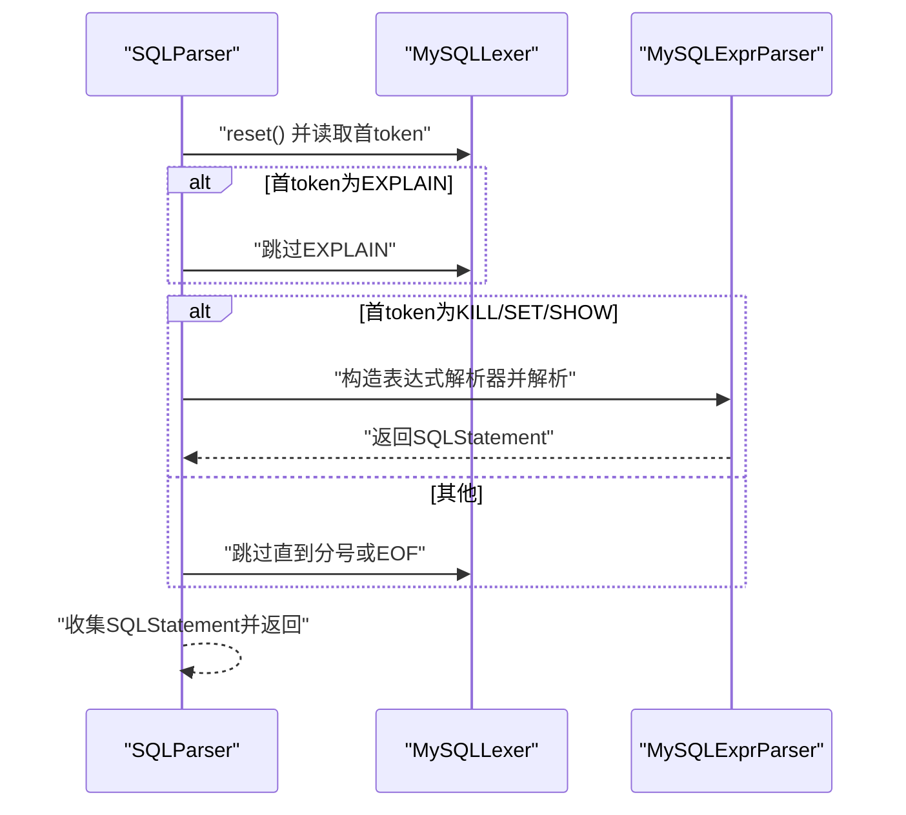
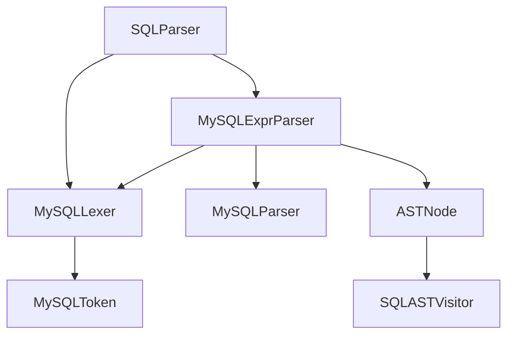

# SQL解析模块

<cite>
**本文档引用的文件**
- [ASTNode.java](file://proxy-parser/src/main/java/com/alibaba/polardbx/proxy/parser/ast/ASTNode.java)
- [Expression.java](file://proxy-parser/src/main/java/com/alibaba/polardbx/proxy/parser/ast/expression/Expression.java)
- [SQLASTVisitor.java](file://proxy-parser/src/main/java/com/alibaba/polardbx/proxy/parser/visitor/SQLASTVisitor.java)
- [MySQLLexer.java](file://proxy-parser/src/main/java/com/alibaba/polardbx/proxy/parser/recognizer/mysql/lexer/MySQLLexer.java)
- [MySQLToken.java](file://proxy-parser/src/main/java/com/alibaba/polardbx/proxy/parser/recognizer/mysql/MySQLToken.java)
- [MySQLParser.java](file://proxy-parser/src/main/java/com/alibaba/polardbx/proxy/parser/recognizer/mysql/syntax/MySQLParser.java)
- [MySQLExprParser.java](file://proxy-parser/src/main/java/com/alibaba/polardbx/proxy/parser/recognizer/mysql/syntax/MySQLExprParser.java)
- [SQLParser.java](file://proxy-parser/src/main/java/com/alibaba/polardbx/proxy/parser/recognizer/SQLParser.java)
- [LexerTest.java](file://proxy-parser/src/test/java/com/alibaba/polardbx/proxy/parser/LexerTest.java)
- [SQLParserTest.java](file://proxy-parser/src/test/java/com/alibaba/polardbx/proxy/parser/SQLParserTest.java)
</cite>

## 目录
1. [简介](#简介)
2. [项目结构](#项目结构)
3. [核心组件](#核心组件)
4. [架构总览](#架构总览)
5. [详细组件分析](#详细组件分析)
6. [依赖关系分析](#依赖关系分析)
7. [性能考虑](#性能考虑)
8. [故障排查指南](#故障排查指南)
9. [结论](#结论)
10. [附录](#附录)

## 简介
本文件系统性梳理 PolarDB-X Proxy 的 SQL 解析模块，聚焦 MySQL 方言的词法与语法解析实现，解释词法分析器（MySQLLexer）的 token 识别机制、语法分析器（MySQLExprParser）的语法树构建过程，以及抽象语法树节点（ASTNode）与表达式接口（Expression）的设计模式。文档还涵盖从词法分析到语法分析再到语义分析的完整流程，给出复杂查询的 AST 构建示例，并讨论 MySQL 方言支持、语法扩展机制与解析性能优化策略。

## 项目结构
解析模块位于 proxy-parser 模块中，主要由以下层次构成：
- 词法层：MySQLLexer 负责字符流扫描、注释处理、字面量识别与 token 输出。
- 语法层：MySQLParser 提供通用语法辅助（标识符、系统变量、LIMIT 等），MySQLExprParser 实现表达式语法树构建。
- 顶层调度：SQLParser 统一入口，负责多语句解析、只读/从库路由判断等语义分析。
- 抽象与访问：ASTNode 接口与 SQLASTVisitor 访问者模式，统一表达式与语句节点的访问与输出。

图表来源
- [MySQLLexer.java](file://proxy-parser/src/main/java/com/alibaba/polardbx/proxy/parser/recognizer/mysql/lexer/MySQLLexer.java#L35-L137)
- [MySQLToken.java](file://proxy-parser/src/main/java/com/alibaba/polardbx/proxy/parser/recognizer/mysql/MySQLToken.java#L28-L1020)
- [MySQLParser.java](file://proxy-parser/src/main/java/com/alibaba/polardbx/proxy/parser/recognizer/mysql/syntax/MySQLParser.java#L42-L360)
- [MySQLExprParser.java](file://proxy-parser/src/main/java/com/alibaba/polardbx/proxy/parser/recognizer/mysql/syntax/MySQLExprParser.java#L163-L1824)
- [SQLParser.java](file://proxy-parser/src/main/java/com/alibaba/polardbx/proxy/parser/recognizer/SQLParser.java#L36-L336)
- [ASTNode.java](file://proxy-parser/src/main/java/com/alibaba/polardbx/proxy/parser/ast/ASTNode.java#L28-L32)
- [SQLASTVisitor.java](file://proxy-parser/src/main/java/com/alibaba/polardbx/proxy/parser/visitor/SQLASTVisitor.java#L247-L700)

章节来源
- [MySQLLexer.java](file://proxy-parser/src/main/java/com/alibaba/polardbx/proxy/parser/recognizer/mysql/lexer/MySQLLexer.java#L35-L137)
- [MySQLToken.java](file://proxy-parser/src/main/java/com/alibaba/polardbx/proxy/parser/recognizer/mysql/MySQLToken.java#L28-L1020)
- [MySQLParser.java](file://proxy-parser/src/main/java/com/alibaba/polardbx/proxy/parser/recognizer/mysql/syntax/MySQLParser.java#L42-L360)
- [MySQLExprParser.java](file://proxy-parser/src/main/java/com/alibaba/polardbx/proxy/parser/recognizer/mysql/syntax/MySQLExprParser.java#L163-L1824)
- [SQLParser.java](file://proxy-parser/src/main/java/com/alibaba/polardbx/proxy/parser/recognizer/SQLParser.java#L36-L336)
- [ASTNode.java](file://proxy-parser/src/main/java/com/alibaba/polardbx/proxy/parser/ast/ASTNode.java#L28-L32)
- [SQLASTVisitor.java](file://proxy-parser/src/main/java/com/alibaba/polardbx/proxy/parser/visitor/SQLASTVisitor.java#L247-L700)

## 核心组件
- ASTNode：所有 AST 节点的根接口，统一通过 accept(SQLASTVisitor) 接口接受访问。
- Expression：表达式接口，定义优先级、缓存求值结果、评估与原始字符串等能力。
- SQLASTVisitor：访问者接口，覆盖表达式、语句、片段等各类节点的访问方法。
- MySQLLexer：MySQL 方言词法分析器，负责注释、标识符、字符串、数字、十六进制、位串、占位符、用户/系统变量等 token 的识别。
- MySQLToken：MySQL 关键字与标点符号的枚举，涵盖运算符、关键字、分隔符等。
- MySQLParser：语法辅助基类，提供标识符解析、系统变量解析、LIMIT 解析等通用功能。
- MySQLExprParser：表达式语法解析器，基于递归下降实现，构建表达式语法树。
- SQLParser：顶层解析器，负责多语句解析、只读/从库路由判断、数据库切换等语义分析。

章节来源
- [ASTNode.java](file://proxy-parser/src/main/java/com/alibaba/polardbx/proxy/parser/ast/ASTNode.java#L28-L32)
- [Expression.java](file://proxy-parser/src/main/java/com/alibaba/polardbx/proxy/parser/ast/expression/Expression.java#L30-L70)
- [SQLASTVisitor.java](file://proxy-parser/src/main/java/com/alibaba/polardbx/proxy/parser/visitor/SQLASTVisitor.java#L247-L700)
- [MySQLLexer.java](file://proxy-parser/src/main/java/com/alibaba/polardbx/proxy/parser/recognizer/mysql/lexer/MySQLLexer.java#L35-L137)
- [MySQLToken.java](file://proxy-parser/src/main/java/com/alibaba/polardbx/proxy/parser/recognizer/mysql/MySQLToken.java#L28-L1020)
- [MySQLParser.java](file://proxy-parser/src/main/java/com/alibaba/polardbx/proxy/parser/recognizer/mysql/syntax/MySQLParser.java#L42-L360)
- [MySQLExprParser.java](file://proxy-parser/src/main/java/com/alibaba/polardbx/proxy/parser/recognizer/mysql/syntax/MySQLExprParser.java#L163-L1824)
- [SQLParser.java](file://proxy-parser/src/main/java/com/alibaba/polardbx/proxy/parser/recognizer/SQLParser.java#L36-L336)

## 架构总览
解析流程自上而下分为三层：
- 顶层调度层：SQLParser 作为入口，负责多语句切分、首 token 判断、只读/从库路由、权限与数据库变更检测等。
- 语法分析层：MySQLExprParser 基于 MySQLParser 的通用语法辅助，完成表达式优先级与结合性的递归下降解析。
- 词法分析层：MySQLLexer 扫描输入，识别注释、标识符、字符串、数字、十六进制、位串、占位符、用户/系统变量等 token。

图表来源
- [SQLParser.java](file://proxy-parser/src/main/java/com/alibaba/polardbx/proxy/parser/recognizer/SQLParser.java#L277-L334)
- [MySQLExprParser.java](file://proxy-parser/src/main/java/com/alibaba/polardbx/proxy/parser/recognizer/mysql/syntax/MySQLExprParser.java#L180-L195)
- [MySQLLexer.java](file://proxy-parser/src/main/java/com/alibaba/polardbx/proxy/parser/recognizer/mysql/lexer/MySQLLexer.java#L110-L137)

章节来源
- [SQLParser.java](file://proxy-parser/src/main/java/com/alibaba/polardbx/proxy/parser/recognizer/SQLParser.java#L277-L334)
- [MySQLExprParser.java](file://proxy-parser/src/main/java/com/alibaba/polardbx/proxy/parser/recognizer/mysql/syntax/MySQLExprParser.java#L180-L195)
- [MySQLLexer.java](file://proxy-parser/src/main/java/com/alibaba/polardbx/proxy/parser/recognizer/mysql/lexer/MySQLLexer.java#L110-L137)

## 详细组件分析

### 词法分析器（MySQLLexer）
- 注释处理：支持行注释（--）、C 风格注释（/* ... */）与 MySQL 特有的版本化注释（/*!50714 ... */），并可选择记录注释内容。
- 字面量识别：字符串（含转义）、十六进制（0x 或 x''）、位串（0b 或 b''）、数字（纯整数、混合数字）、布尔、NULL、占位符（${...}）、用户变量（@...）、系统变量（@@...）。
- 标识符与关键字：支持带反引号的标识符，自动识别 MySQL 关键字并映射到对应枚举。
- 缓冲与位置：内部维护字符缓冲区与偏移，支持原样字符串提取与大小写转换，便于后续语法分析与错误定位。
- 性能特性：采用预分配缓冲、状态机扫描与字符类型快速判定，减少对象创建与边界检查。

图表来源
- [MySQLLexer.java](file://proxy-parser/src/main/java/com/alibaba/polardbx/proxy/parser/recognizer/mysql/lexer/MySQLLexer.java#L254-L508)
- [MySQLLexer.java](file://proxy-parser/src/main/java/com/alibaba/polardbx/proxy/parser/recognizer/mysql/lexer/MySQLLexer.java#L514-L676)
- [MySQLLexer.java](file://proxy-parser/src/main/java/com/alibaba/polardbx/proxy/parser/recognizer/mysql/lexer/MySQLLexer.java#L681-L800)

章节来源
- [MySQLLexer.java](file://proxy-parser/src/main/java/com/alibaba/polardbx/proxy/parser/recognizer/mysql/lexer/MySQLLexer.java#L254-L800)
- [MySQLToken.java](file://proxy-parser/src/main/java/com/alibaba/polardbx/proxy/parser/recognizer/mysql/MySQLToken.java#L28-L1020)

### 语法分析器（MySQLExprParser）
- 表达式优先级：严格遵循 MySQL 运算符优先级，从逻辑非、位移、加减、乘除模、按位与/或/xor、比较、IN/BETWEEN、逻辑与/或/异或到赋值，逐级递归下降。
- 子查询与集合操作：支持 ANY/ALL/SOME 与比较运算符组合，支持 IN 后跟子查询或表达式列表。
- 函数与类型转换：通过 MySQLFunctionManager 支持函数解析，支持 CAST/CONVERT/COLLATE 等类型转换与排序规则。
- 用户变量与占位符：识别用户变量（@var）与占位符（${...}），并生成对应的表达式节点。
- 语法扩展：通过继承 MySQLParser 的 match/matchIdentifier/identifier/systemVariale 等方法，支持方言扩展与语义增强。

图表来源
- [MySQLExprParser.java](file://proxy-parser/src/main/java/com/alibaba/polardbx/proxy/parser/recognizer/mysql/syntax/MySQLExprParser.java#L180-L730)

章节来源
- [MySQLExprParser.java](file://proxy-parser/src/main/java/com/alibaba/polardbx/proxy/parser/recognizer/mysql/syntax/MySQLExprParser.java#L180-L730)
- [MySQLParser.java](file://proxy-parser/src/main/java/com/alibaba/polardbx/proxy/parser/recognizer/mysql/syntax/MySQLParser.java#L74-L178)

### 抽象语法树与访问者（ASTNode 与 SQLASTVisitor）
- ASTNode：所有 AST 节点实现该接口，统一通过 accept(SQLASTVisitor) 接受访问，便于遍历与输出。
- Expression：表达式节点接口，定义优先级、缓存求值结果、评估与原始字符串设置等。
- SQLASTVisitor：覆盖表达式、语句、片段等节点的访问方法，用于序列化、验证、改写等场景。

图表来源
- [ASTNode.java](file://proxy-parser/src/main/java/com/alibaba/polardbx/proxy/parser/ast/ASTNode.java#L28-L32)
- [Expression.java](file://proxy-parser/src/main/java/com/alibaba/polardbx/proxy/parser/ast/expression/Expression.java#L30-L70)
- [SQLASTVisitor.java](file://proxy-parser/src/main/java/com/alibaba/polardbx/proxy/parser/visitor/SQLASTVisitor.java#L247-L700)

章节来源
- [ASTNode.java](file://proxy-parser/src/main/java/com/alibaba/polardbx/proxy/parser/ast/ASTNode.java#L28-L32)
- [Expression.java](file://proxy-parser/src/main/java/com/alibaba/polardbx/proxy/parser/ast/expression/Expression.java#L30-L70)
- [SQLASTVisitor.java](file://proxy-parser/src/main/java/com/alibaba/polardbx/proxy/parser/visitor/SQLASTVisitor.java#L247-L700)

### 顶层调度（SQLParser）
- 多语句解析：支持以分号分隔的多条语句，逐条解析并收集 SQLStatement 列表。
- 语义分析：提供只读/从库路由判断（canSlaveRead/isReadOnly）、权限相关语句检测（isPrivilegeDatabaseChanged）、数据库切换应用（applyDatabase）等。
- 错误定位：在解析异常时，根据当前 lexer 位置输出上下文片段，便于定位语法错误。

图表来源
- [SQLParser.java](file://proxy-parser/src/main/java/com/alibaba/polardbx/proxy/parser/recognizer/SQLParser.java#L277-L334)
- [MySQLExprParser.java](file://proxy-parser/src/main/java/com/alibaba/polardbx/proxy/parser/recognizer/mysql/syntax/MySQLExprParser.java#L180-L195)

章节来源
- [SQLParser.java](file://proxy-parser/src/main/java/com/alibaba/polardbx/proxy/parser/recognizer/SQLParser.java#L277-L334)

## 依赖关系分析
- MySQLLexer 依赖 MySQLToken 枚举与 FastCharTypes 快速字符分类工具。
- MySQLExprParser 继承 MySQLParser，复用标识符、系统变量、LIMIT 等通用语法辅助，并依赖大量表达式节点类。
- SQLParser 组合 MySQLLexer 与 MySQLExprParser，负责多语句调度与语义分析。
- ASTNode 与 SQLASTVisitor 形成访问者模式，表达式与语句节点均实现 accept 方法。

图表来源
- [MySQLLexer.java](file://proxy-parser/src/main/java/com/alibaba/polardbx/proxy/parser/recognizer/mysql/lexer/MySQLLexer.java#L21-L34)
- [MySQLExprParser.java](file://proxy-parser/src/main/java/com/alibaba/polardbx/proxy/parser/recognizer/mysql/syntax/MySQLExprParser.java#L23-L122)
- [SQLParser.java](file://proxy-parser/src/main/java/com/alibaba/polardbx/proxy/parser/recognizer/SQLParser.java#L23-L27)
- [ASTNode.java](file://proxy-parser/src/main/java/com/alibaba/polardbx/proxy/parser/ast/ASTNode.java#L23-L31)

章节来源
- [MySQLLexer.java](file://proxy-parser/src/main/java/com/alibaba/polardbx/proxy/parser/recognizer/mysql/lexer/MySQLLexer.java#L21-L34)
- [MySQLExprParser.java](file://proxy-parser/src/main/java/com/alibaba/polardbx/proxy/parser/recognizer/mysql/syntax/MySQLExprParser.java#L23-L122)
- [SQLParser.java](file://proxy-parser/src/main/java/com/alibaba/polardbx/proxy/parser/recognizer/SQLParser.java#L23-L27)
- [ASTNode.java](file://proxy-parser/src/main/java/com/alibaba/polardbx/proxy/parser/ast/ASTNode.java#L23-L31)

## 性能考虑
- 字符缓冲与预分配：MySQLLexer 使用 ThreadLocal 缓冲区与动态扩容策略，减少频繁分配与拷贝。
- 快速字符分类：借助 FastCharTypes 判断空格、数字、标识符等，避免正则匹配带来的开销。
- 状态机扫描：数字、字符串、注释等采用状态机扫描，避免回溯与重复解析。
- 优先级缓存：Expression 接口支持缓存求值结果（setCacheEvalRst），降低重复计算成本。
- 无副作用匹配：MySQLParser 的 match/matchIdentifier 等方法避免副作用，提升解析确定性与性能。

## 故障排查指南
- 语法错误定位：SQLParser.buildErrorMsg 在异常时输出“附近片段”与错误原因，便于快速定位问题。
- 常见错误场景：
  - 注释未闭合：如 unclosed '/*' comment 或 unclosed '/*!' comment。
  - 字符串未闭合：unclosed string 或占位符未闭合。
  - 数字格式错误：无效字符后的小数/指数部分。
- 单元测试参考：
  - LexerTest 展示了注释、字符串、用户变量、系统变量、占位符等的正确识别行为。
  - SQLParserTest 展示了只读/从库路由判断、多语句解析、权限语句检测等语义分析行为。

章节来源
- [SQLParser.java](file://proxy-parser/src/main/java/com/alibaba/polardbx/proxy/parser/recognizer/SQLParser.java#L256-L274)
- [LexerTest.java](file://proxy-parser/src/test/java/com/alibaba/polardbx/proxy/parser/LexerTest.java#L55-L130)
- [SQLParserTest.java](file://proxy-parser/src/test/java/com/alibaba/polardbx/proxy/parser/SQLParserTest.java#L30-L170)

## 结论
PolarDB-X Proxy 的 SQL 解析模块以 MySQLLexer 为核心，配合 MySQLExprParser 与 SQLParser，实现了对 MySQL 方言的高效解析。通过 ASTNode 与 SQLASTVisitor 的访问者模式，表达式与语句节点得以统一管理与扩展。模块在性能方面注重缓冲与状态机扫描，在语义分析方面提供了只读/从库路由、权限与数据库变更检测等实用能力。对于复杂查询，表达式语法树的递归下降构建保证了解析的准确性与可扩展性。

## 附录
- MySQL 方言支持：MySQLToken 枚举覆盖 MySQL 8.0 关键字与运算符，MySQLExprParser 与 MySQLParser 提供对常用语法的支持。
- 语法扩展机制：通过继承 MySQLParser 与扩展 SQLASTVisitor，可在不破坏现有解析流程的前提下增加新的语法元素与访问逻辑。
- 解析性能优化策略：预分配缓冲、快速字符分类、状态机扫描、优先级缓存与无副作用匹配是关键优化点。