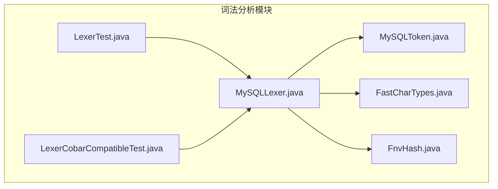
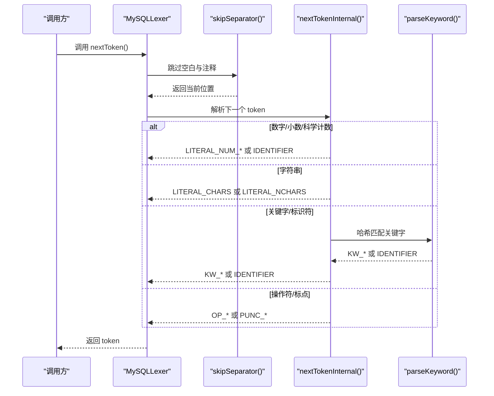
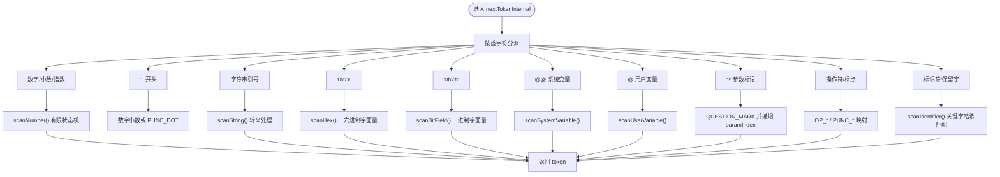
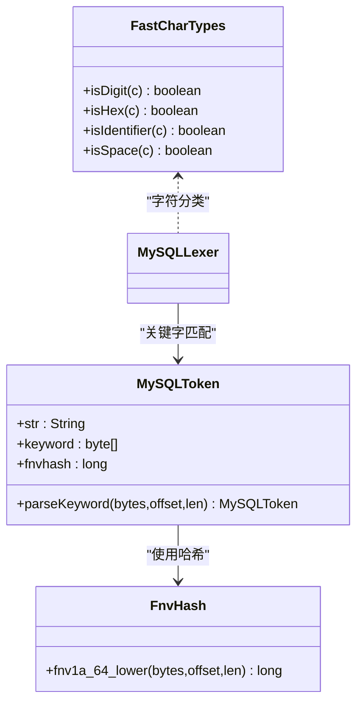
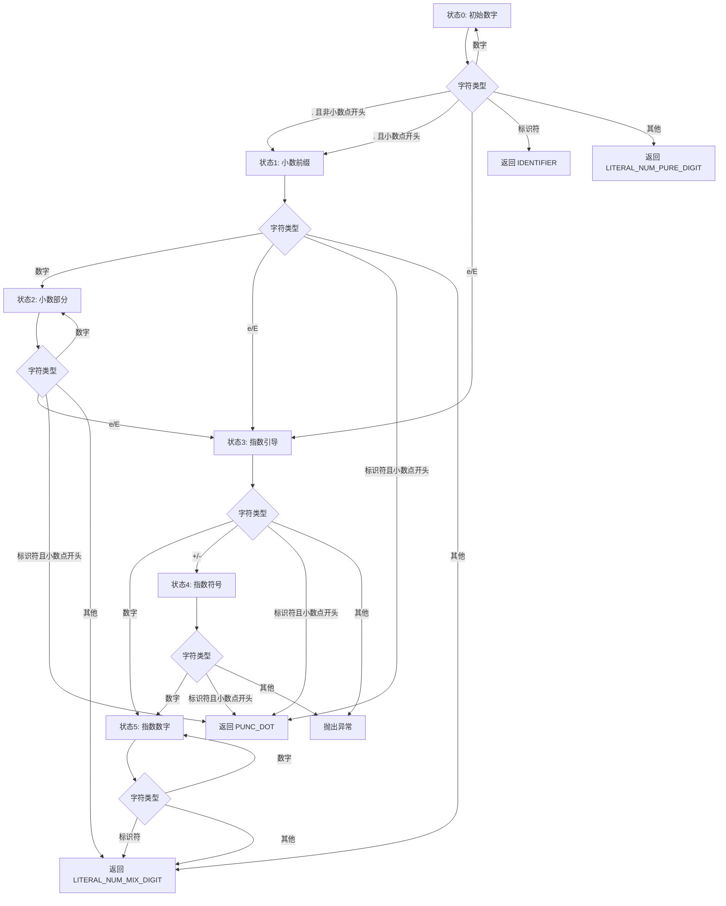
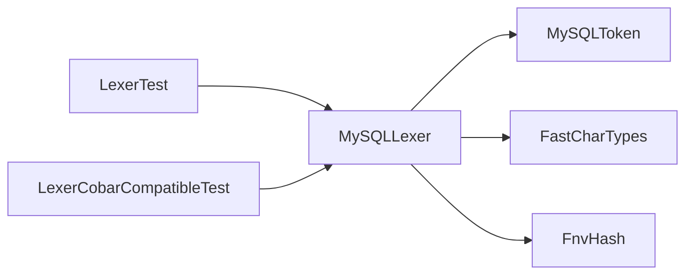

# 词法分析

<cite>
**本文引用的文件**
- [proxy-parser/src/main/java/com/alibaba/polardbx/proxy/parser/recognizer/mysql/lexer/MySQLLexer.java](file://proxy-parser/src/main/java/com/alibaba/polardbx/proxy/parser/recognizer/mysql/lexer/MySQLLexer.java)
- [proxy-parser/src/main/java/com/alibaba/polardbx/proxy/parser/recognizer/mysql/MySQLToken.java](file://proxy-parser/src/main/java/com/alibaba/polardbx/proxy/parser/recognizer/mysql/MySQLToken.java)
- [proxy-parser/src/main/java/com/alibaba/polardbx/proxy/parser/util/FastCharTypes.java](file://proxy-parser/src/main/java/com/alibaba/polardbx/proxy/parser/util/FastCharTypes.java)
- [proxy-parser/src/main/java/com/alibaba/polardbx/proxy/parser/util/FnvHash.java](file://proxy-parser/src/main/java/com/alibaba/polardbx/proxy/parser/util/FnvHash.java)
- [proxy-parser/src/test/java/com/alibaba/polardbx/proxy/parser/LexerTest.java](file://proxy-parser/src/test/java/com/alibaba/polardbx/proxy/parser/LexerTest.java)
- [proxy-parser/src/test/java/com/alibaba/polardbx/proxy/parser/LexerCobarCompatibleTest.java](file://proxy-parser/src/test/java/com/alibaba/polardbx/proxy/parser/LexerCobarCompatibleTest.java)
</cite>

## 目录
1. [简介](#简介)
2. [项目结构](#项目结构)
3. [核心组件](#核心组件)
4. [架构总览](#架构总览)
5. [详细组件分析](#详细组件分析)
6. [依赖关系分析](#依赖关系分析)
7. [性能考量](#性能考量)
8. [故障排查指南](#故障排查指南)
9. [结论](#结论)
10. [附录](#附录)

## 简介
本文件面向 PolarDB-X Proxy 的词法分析模块，系统性阐述 MySQLLexer 的实现原理与设计要点，覆盖字符流处理、token 识别规则、关键字识别机制、状态机设计（字符串、注释、转义）、MySQL 方言特性支持、字符集处理与性能优化策略。同时提供基于测试用例的典型 token 化示例，帮助读者快速理解从 SQL 文本到 token 流的转换过程。

## 项目结构
词法分析相关代码主要位于 proxy-parser 模块中，核心文件如下：
- MySQLLexer：词法分析器主体，负责扫描字符流并生成 token
- MySQLToken：token 类型与关键字映射
- FastCharTypes：字符分类（数字、十六进制、标识符、空白）的快速查表
- FnvHash：用于关键字哈希匹配的工具
- LexerTest/LexerCobarCompatibleTest：验证词法行为的测试样例

**图表来源**
- [proxy-parser/src/main/java/com/alibaba/polardbx/proxy/parser/recognizer/mysql/lexer/MySQLLexer.java](file://proxy-parser/src/main/java/com/alibaba/polardbx/proxy/parser/recognizer/mysql/lexer/MySQLLexer.java#L35-L1095)
- [proxy-parser/src/main/java/com/alibaba/polardbx/proxy/parser/recognizer/mysql/MySQLToken.java](file://proxy-parser/src/main/java/com/alibaba/polardbx/proxy/parser/recognizer/mysql/MySQLToken.java#L28-L1020)
- [proxy-parser/src/main/java/com/alibaba/polardbx/proxy/parser/util/FastCharTypes.java](file://proxy-parser/src/main/java/com/alibaba/polardbx/proxy/parser/util/FastCharTypes.java#L21-L99)
- [proxy-parser/src/main/java/com/alibaba/polardbx/proxy/parser/util/FnvHash.java](file://proxy-parser/src/main/java/com/alibaba/polardbx/proxy/parser/util/FnvHash.java#L21-L39)
- [proxy-parser/src/test/java/com/alibaba/polardbx/proxy/parser/LexerTest.java](file://proxy-parser/src/test/java/com/alibaba/polardbx/proxy/parser/LexerTest.java#L30-L53)
- [proxy-parser/src/test/java/com/alibaba/polardbx/proxy/parser/LexerCobarCompatibleTest.java](file://proxy-parser/src/test/java/com/alibaba/polardbx/proxy/parser/LexerCobarCompatibleTest.java#L29-L46)

**章节来源**
- [proxy-parser/src/main/java/com/alibaba/polardbx/proxy/parser/recognizer/mysql/lexer/MySQLLexer.java](file://proxy-parser/src/main/java/com/alibaba/polardbx/proxy/parser/recognizer/mysql/lexer/MySQLLexer.java#L35-L1095)
- [proxy-parser/src/main/java/com/alibaba/polardbx/proxy/parser/recognizer/mysql/MySQLToken.java](file://proxy-parser/src/main/java/com/alibaba/polardbx/proxy/parser/recognizer/mysql/MySQLToken.java#L28-L1020)
- [proxy-parser/src/main/java/com/alibaba/polardbx/proxy/parser/util/FastCharTypes.java](file://proxy-parser/src/main/java/com/alibaba/polardbx/proxy/parser/util/FastCharTypes.java#L21-L99)
- [proxy-parser/src/main/java/com/alibaba/polardbx/proxy/parser/util/FnvHash.java](file://proxy-parser/src/main/java/com/alibaba/polardbx/proxy/parser/util/FnvHash.java#L21-L39)
- [proxy-parser/src/test/java/com/alibaba/polardbx/proxy/parser/LexerTest.java](file://proxy-parser/src/test/java/com/alibaba/polardbx/proxy/parser/LexerTest.java#L30-L53)
- [proxy-parser/src/test/java/com/alibaba/polardbx/proxy/parser/LexerCobarCompatibleTest.java](file://proxy-parser/src/test/java/com/alibaba/polardbx/proxy/parser/LexerCobarCompatibleTest.java#L29-L46)

## 核心组件
- MySQLLexer：面向字节数组的高效词法分析器，支持注释记录、参数计数、版本感知的 MySQL 特定注释、无反斜杠转义模式、UTF-8 字符集等。
- MySQLToken：定义所有 token 类型（标识符、字面量、操作符、关键字等），并维护关键字到枚举值的哈希映射。
- FastCharTypes：常量时间的字符分类判断，加速数字、十六进制、标识符与空白字符的判定。
- FnvHash：对关键字进行大小写无关的 FNV-1a 哈希，提升关键字查找效率。

**章节来源**
- [proxy-parser/src/main/java/com/alibaba/polardbx/proxy/parser/recognizer/mysql/lexer/MySQLLexer.java](file://proxy-parser/src/main/java/com/alibaba/polardbx/proxy/parser/recognizer/mysql/lexer/MySQLLexer.java#L35-L137)
- [proxy-parser/src/main/java/com/alibaba/polardbx/proxy/parser/recognizer/mysql/MySQLToken.java](file://proxy-parser/src/main/java/com/alibaba/polardbx/proxy/parser/recognizer/mysql/MySQLToken.java#L28-L1020)
- [proxy-parser/src/main/java/com/alibaba/polardbx/proxy/parser/util/FastCharTypes.java](file://proxy-parser/src/main/java/com/alibaba/polardbx/proxy/parser/util/FastCharTypes.java#L21-L99)
- [proxy-parser/src/main/java/com/alibaba/polardbx/proxy/parser/util/FnvHash.java](file://proxy-parser/src/main/java/com/alibaba/polardbx/proxy/parser/util/FnvHash.java#L21-L39)

## 架构总览
MySQLLexer 将输入 SQL 作为字节数组处理，通过状态推进与字符分类表驱动的扫描流程，识别出各类 token，并在需要时进行关键字解析与数值/字符串重建。注释解析支持多种形式（行注释、块注释、MySQL hint 注释），并可选择记录注释内容以供上层使用。

**图表来源**
- [proxy-parser/src/main/java/com/alibaba/polardbx/proxy/parser/recognizer/mysql/lexer/MySQLLexer.java](file://proxy-parser/src/main/java/com/alibaba/polardbx/proxy/parser/recognizer/mysql/lexer/MySQLLexer.java#L1064-L1093)
- [proxy-parser/src/main/java/com/alibaba/polardbx/proxy/parser/recognizer/mysql/lexer/MySQLLexer.java](file://proxy-parser/src/main/java/com/alibaba/polardbx/proxy/parser/recognizer/mysql/lexer/MySQLLexer.java#L839-L1062)
- [proxy-parser/src/main/java/com/alibaba/polardbx/proxy/parser/recognizer/mysql/MySQLToken.java](file://proxy-parser/src/main/java/com/alibaba/polardbx/proxy/parser/recognizer/mysql/MySQLToken.java#L999-L1018)

## 详细组件分析

### MySQLLexer 实现原理
- 字节流与游标管理：持有字节数组、当前字符与位置指针；支持限制范围与起始偏移，便于子串解析与增量处理。
- 注释处理：支持行注释（#、--）、块注释（/* ... */）、MySQL hint 注释（/*! ... */）及版本条件忽略；可选择记录注释以便后续处理。
- 分隔符跳过：利用 FastCharTypes 判断空白字符，循环跳过直至非空白或注释结束。
- 数字识别：采用有限状态机识别纯整数、混合数字（含小数/指数）、科学计数法；对“.”开头的数字进行歧义处理（可能为点号或小数）。
- 字符串与转义：支持单引号与双引号字符串，支持 MySQL 风格的转义序列；支持 N'...' 原生字符集字符串；支持占位符 ${...}。
- 标识符与关键字：支持带反引号的标识符、用户变量（@var）、系统变量（@@var）；关键字通过 FNV 哈希映射快速匹配。
- 操作符与标点：覆盖括号、逗号、分号、点号、赋值、JSON 提取、位运算、移位、比较、逻辑运算等。
- 缓冲与重建：使用线程本地缓冲区重建字符串字面量，避免重复分配；提供原始字符串与缓存字符串两种视图。

**图表来源**
- [proxy-parser/src/main/java/com/alibaba/polardbx/proxy/parser/recognizer/mysql/lexer/MySQLLexer.java](file://proxy-parser/src/main/java/com/alibaba/polardbx/proxy/parser/recognizer/mysql/lexer/MySQLLexer.java#L839-L1062)
- [proxy-parser/src/main/java/com/alibaba/polardbx/proxy/parser/recognizer/mysql/lexer/MySQLLexer.java](file://proxy-parser/src/main/java/com/alibaba/polardbx/proxy/parser/recognizer/mysql/lexer/MySQLLexer.java#L514-L676)
- [proxy-parser/src/main/java/com/alibaba/polardbx/proxy/parser/recognizer/mysql/lexer/MySQLLexer.java](file://proxy-parser/src/main/java/com/alibaba/polardbx/proxy/parser/recognizer/mysql/lexer/MySQLLexer.java#L442-L508)
- [proxy-parser/src/main/java/com/alibaba/polardbx/proxy/parser/recognizer/mysql/lexer/MySQLLexer.java](file://proxy-parser/src/main/java/com/alibaba/polardbx/proxy/parser/recognizer/mysql/lexer/MySQLLexer.java#L840-L901)
- [proxy-parser/src/main/java/com/alibaba/polardbx/proxy/parser/recognizer/mysql/lexer/MySQLLexer.java](file://proxy-parser/src/main/java/com/alibaba/polardbx/proxy/parser/recognizer/mysql/lexer/MySQLLexer.java#L902-L906)
- [proxy-parser/src/main/java/com/alibaba/polardbx/proxy/parser/recognizer/mysql/lexer/MySQLLexer.java](file://proxy-parser/src/main/java/com/alibaba/polardbx/proxy/parser/recognizer/mysql/lexer/MySQLLexer.java#L907-L1045)
- [proxy-parser/src/main/java/com/alibaba/polardbx/proxy/parser/recognizer/mysql/lexer/MySQLLexer.java](file://proxy-parser/src/main/java/com/alibaba/polardbx/proxy/parser/recognizer/mysql/lexer/MySQLLexer.java#L1046-L1061)

**章节来源**
- [proxy-parser/src/main/java/com/alibaba/polardbx/proxy/parser/recognizer/mysql/lexer/MySQLLexer.java](file://proxy-parser/src/main/java/com/alibaba/polardbx/proxy/parser/recognizer/mysql/lexer/MySQLLexer.java#L35-L137)
- [proxy-parser/src/main/java/com/alibaba/polardbx/proxy/parser/recognizer/mysql/lexer/MySQLLexer.java](file://proxy-parser/src/main/java/com/alibaba/polardbx/proxy/parser/recognizer/mysql/lexer/MySQLLexer.java#L254-L365)
- [proxy-parser/src/main/java/com/alibaba/polardbx/proxy/parser/recognizer/mysql/lexer/MySQLLexer.java](file://proxy-parser/src/main/java/com/alibaba/polardbx/proxy/parser/recognizer/mysql/lexer/MySQLLexer.java#L514-L676)
- [proxy-parser/src/main/java/com/alibaba/polardbx/proxy/parser/recognizer/mysql/lexer/MySQLLexer.java](file://proxy-parser/src/main/java/com/alibaba/polardbx/proxy/parser/recognizer/mysql/lexer/MySQLLexer.java#L442-L508)
- [proxy-parser/src/main/java/com/alibaba/polardbx/proxy/parser/recognizer/mysql/lexer/MySQLLexer.java](file://proxy-parser/src/main/java/com/alibaba/polardbx/proxy/parser/recognizer/mysql/lexer/MySQLLexer.java#L840-L1062)
- [proxy-parser/src/main/java/com/alibaba/polardbx/proxy/parser/recognizer/mysql/lexer/MySQLLexer.java](file://proxy-parser/src/main/java/com/alibaba/polardbx/proxy/parser/recognizer/mysql/lexer/MySQLLexer.java#L1064-L1093)

### MySQLToken 枚举与关键字识别机制
- 类型覆盖：包含标识符、十六进制/二进制字面量、纯/混合数字、字符/原生字符字面量、占位符、系统变量、用户变量、布尔/空字面量、操作符与标点、关键字等。
- 关键字映射：每个枚举实例在构造时计算其小写字节形式与 FNV-1a 哈希；静态块构建关键字哈希到枚举的映射；parseKeyword 使用哈希快速定位候选，再进行长度与逐字比较确保一致性。
- MySQL 8.0 关键字集合：包含大量 MySQL 关键字，覆盖 DDL、DML、事务、窗口函数、JSON、地理空间、复制与安全等特性。

**图表来源**
- [proxy-parser/src/main/java/com/alibaba/polardbx/proxy/parser/recognizer/mysql/MySQLToken.java](file://proxy-parser/src/main/java/com/alibaba/polardbx/proxy/parser/recognizer/mysql/MySQLToken.java#L958-L1018)
- [proxy-parser/src/main/java/com/alibaba/polardbx/proxy/parser/util/FastCharTypes.java](file://proxy-parser/src/main/java/com/alibaba/polardbx/proxy/parser/util/FastCharTypes.java#L63-L97)
- [proxy-parser/src/main/java/com/alibaba/polardbx/proxy/parser/util/FnvHash.java](file://proxy-parser/src/main/java/com/alibaba/polardbx/proxy/parser/util/FnvHash.java#L25-L37)

**章节来源**
- [proxy-parser/src/main/java/com/alibaba/polardbx/proxy/parser/recognizer/mysql/MySQLToken.java](file://proxy-parser/src/main/java/com/alibaba/polardbx/proxy/parser/recognizer/mysql/MySQLToken.java#L28-L1020)
- [proxy-parser/src/main/java/com/alibaba/polardbx/proxy/parser/util/FnvHash.java](file://proxy-parser/src/main/java/com/alibaba/polardbx/proxy/parser/util/FnvHash.java#L21-L39)

### 状态机设计：数字识别与歧义处理
数字识别采用有限状态机，处理以下状态：
- 0：初始数字
- 1：遇到 '.' 后的小数前缀
- 2：小数部分
- 3：遇到 'e'/'E' 后的指数引导
- 4：指数符号（+/-）
- 5：指数数字部分
- 结束态根据是否为小数点开头、是否出现指数、是否出现标识符后缀等决定返回 LITERAL_NUM_* 或 IDENTIFIER。

**图表来源**
- [proxy-parser/src/main/java/com/alibaba/polardbx/proxy/parser/recognizer/mysql/lexer/MySQLLexer.java](file://proxy-parser/src/main/java/com/alibaba/polardbx/proxy/parser/recognizer/mysql/lexer/MySQLLexer.java#L514-L676)

**章节来源**
- [proxy-parser/src/main/java/com/alibaba/polardbx/proxy/parser/recognizer/mysql/lexer/MySQLLexer.java](file://proxy-parser/src/main/java/com/alibaba/polardbx/proxy/parser/recognizer/mysql/lexer/MySQLLexer.java#L514-L676)

### 字符串与注释处理
- 字符串：支持单引号与双引号，内部转义遵循 MySQL 行为；支持 N'...' 原生字符集字符串；字符串重建时保留原始引号与转义。
- 注释：支持 #、--、/* ... */、/*! ... */（版本条件忽略）；可选择记录注释内容；块注释结束时恢复状态。
- 反斜杠转义：可通过 noBackslashEscapes 模式禁用反斜杠转义，兼容不同方言与安全需求。

**章节来源**
- [proxy-parser/src/main/java/com/alibaba/polardbx/proxy/parser/recognizer/mysql/lexer/MySQLLexer.java](file://proxy-parser/src/main/java/com/alibaba/polardbx/proxy/parser/recognizer/mysql/lexer/MySQLLexer.java#L254-L365)
- [proxy-parser/src/main/java/com/alibaba/polardbx/proxy/parser/recognizer/mysql/lexer/MySQLLexer.java](file://proxy-parser/src/main/java/com/alibaba/polardbx/proxy/parser/recognizer/mysql/lexer/MySQLLexer.java#L442-L508)
- [proxy-parser/src/main/java/com/alibaba/polardbx/proxy/parser/recognizer/mysql/lexer/MySQLLexer.java](file://proxy-parser/src/main/java/com/alibaba/polardbx/proxy/parser/recognizer/mysql/lexer/MySQLLexer.java#L283-L337)

### MySQL 方言特性与字符集处理
- 方言特性：支持 MySQL hint 注释（/*+ ... */）、版本条件注释（/*!50714 ... */）、JSON 提取操作符（->、->>）、位移与空安全比较（<=>）等。
- 字符集：默认 UTF-8；支持通过构造函数指定字符集；字符串重建时使用对应字符集还原原始文本。

**章节来源**
- [proxy-parser/src/main/java/com/alibaba/polardbx/proxy/parser/recognizer/mysql/lexer/MySQLLexer.java](file://proxy-parser/src/main/java/com/alibaba/polardbx/proxy/parser/recognizer/mysql/lexer/MySQLLexer.java#L36-L43)
- [proxy-parser/src/main/java/com/alibaba/polardbx/proxy/parser/recognizer/mysql/lexer/MySQLLexer.java](file://proxy-parser/src/main/java/com/alibaba/polardbx/proxy/parser/recognizer/mysql/lexer/MySQLLexer.java#L139-L145)

### 典型词法分析示例
以下示例来自测试用例，展示复杂 SQL 的 token 化过程与注释记录行为：

- 示例一：多类注释与查询片段
  - 输入包含行注释（--）、行注释（#）、块注释（/* ... */）、MySQL hint 注释（/*+ ... */）、版本条件注释（/*!...*/）与普通查询。
  - 输出：注释被收集并按顺序输出，随后是关键字与标识符、操作符与字面量的 token 序列。
  - 参考路径：[proxy-parser/src/test/java/com/alibaba/polardbx/proxy/parser/LexerTest.java](file://proxy-parser/src/test/java/com/alibaba/polardbx/proxy/parser/LexerTest.java#L55-L95)

- 示例二：用户变量与字符串
  - 输入包含用户变量（@abc、@'...'、@"..."、@``）、字符串字面量与标识符。
  - 输出：USR_VAR、LITERAL_CHARS、LITERAL_NCHARS 等 token 正确识别。
  - 参考路径：[proxy-parser/src/test/java/com/alibaba/polardbx/proxy/parser/LexerCobarCompatibleTest.java](file://proxy-parser/src/test/java/com/alibaba/polardbx/proxy/parser/LexerCobarCompatibleTest.java#L48-L200)

- 示例三：十六进制与二进制字面量
  - 输入包含 0x...、x'...'、0b...、b'...' 以及非法形式（如 0x123re2、0b103）。
  - 输出：合法十六进制与二进制返回相应字面量 token，非法形式退回 IDENTIFIER。
  - 参考路径：[proxy-parser/src/test/java/com/alibaba/polardbx/proxy/parser/LexerCobarCompatibleTest.java](file://proxy-parser/src/test/java/com/alibaba/polardbx/proxy/parser/LexerCobarCompatibleTest.java#L954-L1018)

- 示例四：占位符与参数计数
  - 输入包含 ? 参数标记，每次遇到 '?' 时 paramIndex 自增。
  - 输出：QUESTION_MARK token 与 paramIndex 对应。
  - 参考路径：[proxy-parser/src/test/java/com/alibaba/polardbx/proxy/parser/LexerCobarCompatibleTest.java](file://proxy-parser/src/test/java/com/alibaba/polardbx/proxy/parser/LexerCobarCompatibleTest.java#L31-L46)

**章节来源**
- [proxy-parser/src/test/java/com/alibaba/polardbx/proxy/parser/LexerTest.java](file://proxy-parser/src/test/java/com/alibaba/polardbx/proxy/parser/LexerTest.java#L55-L95)
- [proxy-parser/src/test/java/com/alibaba/polardbx/proxy/parser/LexerCobarCompatibleTest.java](file://proxy-parser/src/test/java/com/alibaba/polardbx/proxy/parser/LexerCobarCompatibleTest.java#L31-L46)
- [proxy-parser/src/test/java/com/alibaba/polardbx/proxy/parser/LexerCobarCompatibleTest.java](file://proxy-parser/src/test/java/com/alibaba/polardbx/proxy/parser/LexerCobarCompatibleTest.java#L954-L1018)

## 依赖关系分析
- MySQLLexer 依赖 FastCharTypes 进行字符分类，依赖 FnvHash 进行关键字哈希匹配，依赖 MySQLToken 定义 token 类型与关键字映射。
- 测试用例依赖 MySQLLexer 验证 token 化结果与注释记录行为。

**图表来源**
- [proxy-parser/src/main/java/com/alibaba/polardbx/proxy/parser/recognizer/mysql/lexer/MySQLLexer.java](file://proxy-parser/src/main/java/com/alibaba/polardbx/proxy/parser/recognizer/mysql/lexer/MySQLLexer.java#L21-L34)
- [proxy-parser/src/main/java/com/alibaba/polardbx/proxy/parser/recognizer/mysql/MySQLToken.java](file://proxy-parser/src/main/java/com/alibaba/polardbx/proxy/parser/recognizer/mysql/MySQLToken.java#L21-L26)
- [proxy-parser/src/main/java/com/alibaba/polardbx/proxy/parser/util/FastCharTypes.java](file://proxy-parser/src/main/java/com/alibaba/polardbx/proxy/parser/util/FastCharTypes.java#L21-L26)
- [proxy-parser/src/main/java/com/alibaba/polardbx/proxy/parser/util/FnvHash.java](file://proxy-parser/src/main/java/com/alibaba/polardbx/proxy/parser/util/FnvHash.java#L21-L24)
- [proxy-parser/src/test/java/com/alibaba/polardbx/proxy/parser/LexerTest.java](file://proxy-parser/src/test/java/com/alibaba/polardbx/proxy/parser/LexerTest.java#L21-L28)
- [proxy-parser/src/test/java/com/alibaba/polardbx/proxy/parser/LexerCobarCompatibleTest.java](file://proxy-parser/src/test/java/com/alibaba/polardbx/proxy/parser/LexerCobarCompatibleTest.java#L21-L28)

**章节来源**
- [proxy-parser/src/main/java/com/alibaba/polardbx/proxy/parser/recognizer/mysql/lexer/MySQLLexer.java](file://proxy-parser/src/main/java/com/alibaba/polardbx/proxy/parser/recognizer/mysql/lexer/MySQLLexer.java#L21-L34)
- [proxy-parser/src/main/java/com/alibaba/polardbx/proxy/parser/recognizer/mysql/MySQLToken.java](file://proxy-parser/src/main/java/com/alibaba/polardbx/proxy/parser/recognizer/mysql/MySQLToken.java#L21-L26)
- [proxy-parser/src/main/java/com/alibaba/polardbx/proxy/parser/util/FastCharTypes.java](file://proxy-parser/src/main/java/com/alibaba/polardbx/proxy/parser/util/FastCharTypes.java#L21-L26)
- [proxy-parser/src/main/java/com/alibaba/polardbx/proxy/parser/util/FnvHash.java](file://proxy-parser/src/main/java/com/alibaba/polardbx/proxy/parser/util/FnvHash.java#L21-L24)
- [proxy-parser/src/test/java/com/alibaba/polardbx/proxy/parser/LexerTest.java](file://proxy-parser/src/test/java/com/alibaba/polardbx/proxy/parser/LexerTest.java#L21-L28)
- [proxy-parser/src/test/java/com/alibaba/polardbx/proxy/parser/LexerCobarCompatibleTest.java](file://proxy-parser/src/test/java/com/alibaba/polardbx/proxy/parser/LexerCobarCompatibleTest.java#L21-L28)

## 性能考量
- 字符分类查表：FastCharTypes 使用固定大小字节数组与位标志，常量时间判断数字、十六进制、标识符与空白，避免分支判断开销。
- 关键字哈希：MySQLToken 在静态块中建立 FNV-1a 哈希映射，parseKeyword 先做 O(1) 哈希查找，再做长度与逐字比较，显著降低关键字匹配成本。
- 字符串重建：使用线程本地缓冲区（ThreadLocal<byte[]>）减少分配与拷贝；仅在首次访问 stringValue 时重建，后续复用。
- 数字识别：有限状态机在单次扫描中完成，避免额外正则或回溯。
- 注释处理：skipSeparator 循环跳过空白与注释，块注释版本条件判断在进入注释时完成，减少后续判断次数。

**章节来源**
- [proxy-parser/src/main/java/com/alibaba/polardbx/proxy/parser/util/FastCharTypes.java](file://proxy-parser/src/main/java/com/alibaba/polardbx/proxy/parser/util/FastCharTypes.java#L29-L61)
- [proxy-parser/src/main/java/com/alibaba/polardbx/proxy/parser/recognizer/mysql/MySQLToken.java](file://proxy-parser/src/main/java/com/alibaba/polardbx/proxy/parser/recognizer/mysql/MySQLToken.java#L985-L1018)
- [proxy-parser/src/main/java/com/alibaba/polardbx/proxy/parser/recognizer/mysql/lexer/MySQLLexer.java](file://proxy-parser/src/main/java/com/alibaba/polardbx/proxy/parser/recognizer/mysql/lexer/MySQLLexer.java#L73-L107)
- [proxy-parser/src/main/java/com/alibaba/polardbx/proxy/parser/recognizer/mysql/lexer/MySQLLexer.java](file://proxy-parser/src/main/java/com/alibaba/polardbx/proxy/parser/recognizer/mysql/lexer/MySQLLexer.java#L514-L676)

## 故障排查指南
- 未闭合字符串/注释：当遇到未闭合的字符串或注释时，会抛出语法异常；检查引号配对与注释结束符。
- 未闭合占位符：${...} 缺少右花括号会导致异常；确认占位符闭合。
- 不支持字符：遇到不支持的字符会抛出异常；确认输入字符集与方言支持范围。
- 版本条件注释：若注释版本高于当前设置版本，内容会被忽略；检查版本参数与注释格式。
- 反斜杠转义：在 noBackslashEscapes 模式下，反斜杠不会触发转义；如需 MySQL 默认行为，请关闭该模式。

**章节来源**
- [proxy-parser/src/main/java/com/alibaba/polardbx/proxy/parser/recognizer/mysql/lexer/MySQLLexer.java](file://proxy-parser/src/main/java/com/alibaba/polardbx/proxy/parser/recognizer/mysql/lexer/MySQLLexer.java#L220-L232)
- [proxy-parser/src/main/java/com/alibaba/polardbx/proxy/parser/recognizer/mysql/lexer/MySQLLexer.java](file://proxy-parser/src/main/java/com/alibaba/polardbx/proxy/parser/recognizer/mysql/lexer/MySQLLexer.java#L457-L459)
- [proxy-parser/src/main/java/com/alibaba/polardbx/proxy/parser/recognizer/mysql/lexer/MySQLLexer.java](file://proxy-parser/src/main/java/com/alibaba/polardbx/proxy/parser/recognizer/mysql/lexer/MySQLLexer.java#L321-L323)
- [proxy-parser/src/main/java/com/alibaba/polardbx/proxy/parser/recognizer/mysql/lexer/MySQLLexer.java](file://proxy-parser/src/main/java/com/alibaba/polardbx/proxy/parser/recognizer/mysql/lexer/MySQLLexer.java#L685-L687)
- [proxy-parser/src/main/java/com/alibaba/polardbx/proxy/parser/recognizer/mysql/lexer/MySQLLexer.java](file://proxy-parser/src/main/java/com/alibaba/polardbx/proxy/parser/recognizer/mysql/lexer/MySQLLexer.java#L288-L310)

## 结论
MySQLLexer 通过高效的字符分类、关键字哈希映射与有限状态机，实现了对 MySQL 方言的全面支持，兼顾性能与可维护性。其对注释、字符串、转义、十六进制/二进制字面量与用户/系统变量的处理，满足了生产环境对复杂 SQL 的解析需求。配合测试用例，可进一步验证与扩展功能边界。

## 附录
- 关键 API 速览
  - nextToken()：推进并返回下一个 token
  - token()/stringValue()/originalStringValue()：获取当前 token 与其字符串表示
  - setRecordComments()/getComments()：启用/获取注释列表
  - paramIndex()：参数标记计数
  - subSql(offset,length)：子串提取

**章节来源**
- [proxy-parser/src/main/java/com/alibaba/polardbx/proxy/parser/recognizer/mysql/lexer/MySQLLexer.java](file://proxy-parser/src/main/java/com/alibaba/polardbx/proxy/parser/recognizer/mysql/lexer/MySQLLexer.java#L1064-L1093)
- [proxy-parser/src/main/java/com/alibaba/polardbx/proxy/parser/recognizer/mysql/lexer/MySQLLexer.java](file://proxy-parser/src/main/java/com/alibaba/polardbx/proxy/parser/recognizer/mysql/lexer/MySQLLexer.java#L139-L164)