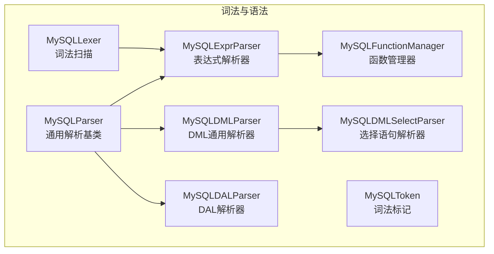
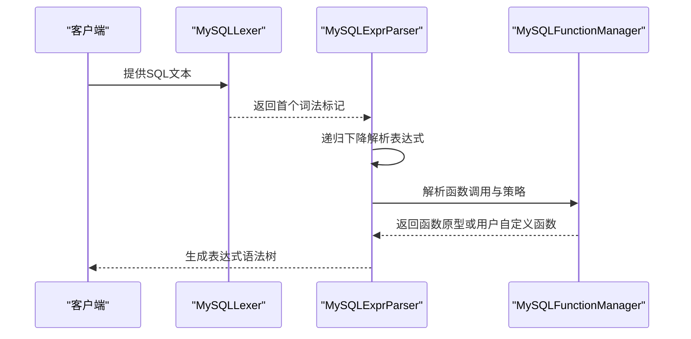
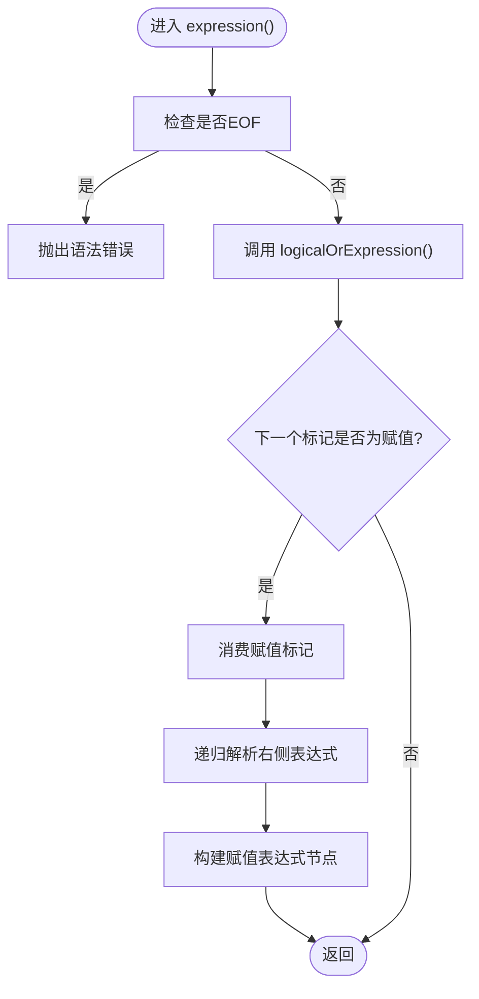
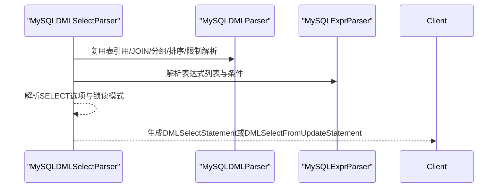
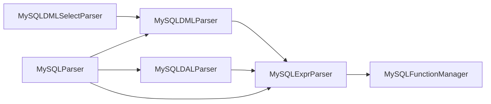

# 语法分析

<cite>
**本文引用的文件**
- [proxy-parser/src/main/java/com/alibaba/polardbx/proxy/parser/recognizer/mysql/syntax/MySQLExprParser.java](file://proxy-parser/src/main/java/com/alibaba/polardbx/proxy/parser/recognizer/mysql/syntax/MySQLExprParser.java)
- [proxy-parser/src/main/java/com/alibaba/polardbx/proxy/parser/recognizer/mysql/syntax/MySQLDMLParser.java](file://proxy-parser/src/main/java/com/alibaba/polardbx/proxy/parser/recognizer/mysql/syntax/MySQLDMLParser.java)
- [proxy-parser/src/main/java/com/alibaba/polardbx/proxy/parser/recognizer/mysql/syntax/MySQLDMLSelectParser.java](file://proxy-parser/src/main/java/com/alibaba/polardbx/proxy/parser/recognizer/mysql/syntax/MySQLDMLSelectParser.java)
- [proxy-parser/src/main/java/com/alibaba/polardbx/proxy/parser/recognizer/mysql/syntax/MySQLDALParser.java](file://proxy-parser/src/main/java/com/alibaba/polardbx/proxy/parser/recognizer/mysql/syntax/MySQLDALParser.java)
- [proxy-parser/src/main/java/com/alibaba/polardbx/proxy/parser/recognizer/mysql/syntax/MySQLParser.java](file://proxy-parser/src/main/java/com/alibaba/polardbx/proxy/parser/recognizer/mysql/syntax/MySQLParser.java)
- [proxy-parser/src/main/java/com/alibaba/polardbx/proxy/parser/recognizer/mysql/MySQLFunctionManager.java](file://proxy-parser/src/main/java/com/alibaba/polardbx/proxy/parser/recognizer/mysql/MySQLFunctionManager.java)
- [proxy-parser/src/main/java/com/alibaba/polardbx/proxy/parser/recognizer/mysql/lexer/MySQLLexer.java](file://proxy-parser/src/main/java/com/alibaba/polardbx/proxy/parser/recognizer/mysql/lexer/MySQLLexer.java)
- [proxy-parser/src/test/java/com/alibaba/polardbx/proxy/parser/LexerCobarCompatibleTest.java](file://proxy-parser/src/test/java/com/alibaba/polardbx/proxy/parser/LexerCobarCompatibleTest.java)
- [proxy-parser/src/test/java/com/alibaba/polardbx/proxy/parser/LexerTest.java](file://proxy-parser/src/test/java/com/alibaba/polardbx/proxy/parser/LexerTest.java)
- [proxy-parser/src/test/java/com/alibaba/polardbx/proxy/parser/SQLParserTest.java](file://proxy-parser/src/test/java/com/alibaba/polardbx/proxy/parser/SQLParserTest.java)
</cite>

## 目录
1. [引言](#引言)
2. [项目结构](#项目结构)
3. [核心组件](#核心组件)
4. [架构总览](#架构总览)
5. [详细组件分析](#详细组件分析)
6. [依赖关系分析](#依赖关系分析)
7. [性能考量](#性能考量)
8. [故障排查指南](#故障排查指南)
9. [结论](#结论)
10. [附录](#附录)

## 引言
本文件面向PolarDB-X Proxy的语法分析模块，系统化梳理MySQL语法解析器的设计与实现，重点覆盖以下方面：
- MySQLExprParser递归下降解析器：表达式优先级与结合性、语法树构建机制、函数调用解析策略
- 各类SQL语句解析器：DML语句解析器（MySQLDMLParser）、选择语句解析器（MySQLDMLSelectParser）、DAL语句解析器（MySQLDALParser）
- 语法规则定义、错误恢复机制、语法分析性能优化
- 典型语法分析示例：复杂查询的语法树构建过程
- MySQL语法扩展支持与解析器调试技巧

## 项目结构
语法分析模块位于proxy-parser工程中，核心代码组织如下：
- 识别器与词法分析：MySQLLexer（词法扫描）、MySQLToken（词法标记枚举）
- 语法解析器：
  - MySQLParser（通用解析基类）
  - MySQLExprParser（表达式解析器，递归下降）
  - MySQLDMLParser（DML通用解析器）
  - MySQLDMLSelectParser（选择语句解析器）
  - MySQLDALParser（数据访问语言解析器）
  - MySQLFunctionManager（函数管理与解析策略）
- 测试用例：覆盖词法兼容性、SQL解析行为等

图表来源
- [proxy-parser/src/main/java/com/alibaba/polardbx/proxy/parser/recognizer/mysql/lexer/MySQLLexer.java](file://proxy-parser/src/main/java/com/alibaba/polardbx/proxy/parser/recognizer/mysql/lexer/MySQLLexer.java#L1-L200)
- [proxy-parser/src/main/java/com/alibaba/polardbx/proxy/parser/recognizer/mysql/syntax/MySQLParser.java](file://proxy-parser/src/main/java/com/alibaba/polardbx/proxy/parser/recognizer/mysql/syntax/MySQLParser.java#L1-L120)
- [proxy-parser/src/main/java/com/alibaba/polardbx/proxy/parser/recognizer/mysql/syntax/MySQLExprParser.java](file://proxy-parser/src/main/java/com/alibaba/polardbx/proxy/parser/recognizer/mysql/syntax/MySQLExprParser.java#L160-L200)
- [proxy-parser/src/main/java/com/alibaba/polardbx/proxy/parser/recognizer/mysql/syntax/MySQLDMLParser.java](file://proxy-parser/src/main/java/com/alibaba/polardbx/proxy/parser/recognizer/mysql/syntax/MySQLDMLParser.java#L68-L90)
- [proxy-parser/src/main/java/com/alibaba/polardbx/proxy/parser/recognizer/mysql/syntax/MySQLDMLSelectParser.java](file://proxy-parser/src/main/java/com/alibaba/polardbx/proxy/parser/recognizer/mysql/syntax/MySQLDMLSelectParser.java#L58-L70)
- [proxy-parser/src/main/java/com/alibaba/polardbx/proxy/parser/recognizer/mysql/syntax/MySQLDALParser.java](file://proxy-parser/src/main/java/com/alibaba/polardbx/proxy/parser/recognizer/mysql/syntax/MySQLDALParser.java#L72-L90)
- [proxy-parser/src/main/java/com/alibaba/polardbx/proxy/parser/recognizer/mysql/MySQLFunctionManager.java](file://proxy-parser/src/main/java/com/alibaba/polardbx/proxy/parser/recognizer/mysql/MySQLFunctionManager.java#L307-L360)

章节来源
- [proxy-parser/src/main/java/com/alibaba/polardbx/proxy/parser/recognizer/mysql/lexer/MySQLLexer.java](file://proxy-parser/src/main/java/com/alibaba/polardbx/proxy/parser/recognizer/mysql/lexer/MySQLLexer.java#L1-L200)
- [proxy-parser/src/main/java/com/alibaba/polardbx/proxy/parser/recognizer/mysql/syntax/MySQLParser.java](file://proxy-parser/src/main/java/com/alibaba/polardbx/proxy/parser/recognizer/mysql/syntax/MySQLParser.java#L1-L120)
- [proxy-parser/src/main/java/com/alibaba/polardbx/proxy/parser/recognizer/mysql/syntax/MySQLExprParser.java](file://proxy-parser/src/main/java/com/alibaba/polardbx/proxy/parser/recognizer/mysql/syntax/MySQLExprParser.java#L160-L200)
- [proxy-parser/src/main/java/com/alibaba/polardbx/proxy/parser/recognizer/mysql/syntax/MySQLDMLParser.java](file://proxy-parser/src/main/java/com/alibaba/polardbx/proxy/parser/recognizer/mysql/syntax/MySQLDMLParser.java#L68-L90)
- [proxy-parser/src/main/java/com/alibaba/polardbx/proxy/parser/recognizer/mysql/syntax/MySQLDMLSelectParser.java](file://proxy-parser/src/main/java/com/alibaba/polardbx/proxy/parser/recognizer/mysql/syntax/MySQLDMLSelectParser.java#L58-L70)
- [proxy-parser/src/main/java/com/alibaba/polardbx/proxy/parser/recognizer/mysql/syntax/MySQLDALParser.java](file://proxy-parser/src/main/java/com/alibaba/polardbx/proxy/parser/recognizer/mysql/syntax/MySQLDALParser.java#L72-L90)
- [proxy-parser/src/main/java/com/alibaba/polardbx/proxy/parser/recognizer/mysql/MySQLFunctionManager.java](file://proxy-parser/src/main/java/com/alibaba/polardbx/proxy/parser/recognizer/mysql/MySQLFunctionManager.java#L307-L360)

## 核心组件
- MySQLParser：提供通用的标识符解析、系统变量解析、LIMIT子句解析、匹配与错误报告等基础能力，是所有具体解析器的父类。
- MySQLExprParser：基于递归下降的表达式解析器，负责表达式的优先级与结合性控制、函数调用解析、字面量与主表达式识别、用户变量与字符串拼接等。
- MySQLDMLParser：DML通用解析器，负责FROM子句、JOIN语法、GROUP BY/ORDER BY/HAVING、UNION、LIMIT等通用片段解析。
- MySQLDMLSelectParser：选择语句解析器，继承DML通用解析能力，聚焦SELECT语句的选项、表达式列表、FROM/WHERE/GROUP BY/HAVING/ORDER BY/LIMIT/锁读等。
- MySQLDALParser：DAL语句解析器，负责SHOW/SET等系统命令的解析，支持特殊标识符与事务隔离级别设置。
- MySQLFunctionManager：函数管理器，维护MySQL内置函数原型与解析策略，支持普通函数、特殊函数（如CAST、SUBSTRING等）以及用户自定义函数。

章节来源
- [proxy-parser/src/main/java/com/alibaba/polardbx/proxy/parser/recognizer/mysql/syntax/MySQLParser.java](file://proxy-parser/src/main/java/com/alibaba/polardbx/proxy/parser/recognizer/mysql/syntax/MySQLParser.java#L42-L128)
- [proxy-parser/src/main/java/com/alibaba/polardbx/proxy/parser/recognizer/mysql/syntax/MySQLExprParser.java](file://proxy-parser/src/main/java/com/alibaba/polardbx/proxy/parser/recognizer/mysql/syntax/MySQLExprParser.java#L163-L195)
- [proxy-parser/src/main/java/com/alibaba/polardbx/proxy/parser/recognizer/mysql/syntax/MySQLDMLParser.java](file://proxy-parser/src/main/java/com/alibaba/polardbx/proxy/parser/recognizer/mysql/syntax/MySQLDMLParser.java#L71-L90)
- [proxy-parser/src/main/java/com/alibaba/polardbx/proxy/parser/recognizer/mysql/syntax/MySQLDMLSelectParser.java](file://proxy-parser/src/main/java/com/alibaba/polardbx/proxy/parser/recognizer/mysql/syntax/MySQLDMLSelectParser.java#L61-L70)
- [proxy-parser/src/main/java/com/alibaba/polardbx/proxy/parser/recognizer/mysql/syntax/MySQLDALParser.java](file://proxy-parser/src/main/java/com/alibaba/polardbx/proxy/parser/recognizer/mysql/syntax/MySQLDALParser.java#L75-L97)
- [proxy-parser/src/main/java/com/alibaba/polardbx/proxy/parser/recognizer/mysql/MySQLFunctionManager.java](file://proxy-parser/src/main/java/com/alibaba/polardbx/proxy/parser/recognizer/mysql/MySQLFunctionManager.java#L307-L360)

## 架构总览
下图展示了从词法扫描到语法解析的整体流程，以及各解析器之间的协作关系：

图表来源
- [proxy-parser/src/main/java/com/alibaba/polardbx/proxy/parser/recognizer/mysql/lexer/MySQLLexer.java](file://proxy-parser/src/main/java/com/alibaba/polardbx/proxy/parser/recognizer/mysql/lexer/MySQLLexer.java#L384-L411)
- [proxy-parser/src/main/java/com/alibaba/polardbx/proxy/parser/recognizer/mysql/syntax/MySQLExprParser.java](file://proxy-parser/src/main/java/com/alibaba/polardbx/proxy/parser/recognizer/mysql/syntax/MySQLExprParser.java#L163-L195)
- [proxy-parser/src/main/java/com/alibaba/polardbx/proxy/parser/recognizer/mysql/MySQLFunctionManager.java](file://proxy-parser/src/main/java/com/alibaba/polardbx/proxy/parser/recognizer/mysql/MySQLFunctionManager.java#L693-L704)

## 详细组件分析

### 表达式解析器（MySQLExprParser）：递归下降与优先级
- 设计要点
  - 使用递归下降方法，按优先级从低到高组织解析规则：逻辑OR → XOR → AND → NOT → 比较 → LIKE/REGEXP/BETWEEN/IN → IS → 位运算 → 移位 → 加减 → 乘除模整除 → 一元操作 → COLLATE → 主表达式
  - 支持赋值表达式（=）作为最高优先级的后缀，形成AssignmentExpression
  - 函数解析通过MySQLFunctionManager进行策略分派，支持普通函数、特殊函数（如SUBSTRING、TRIM、CAST等）与用户自定义函数
  - 字面量与主表达式：字符串、十六进制、二进制、布尔、NULL、数字、参数占位符、通配符、CASE WHEN、INTERVAL等
  - 用户变量与字符串拼接：当主表达式为字符串或标识符且紧随USR_VAR时，合并为UserExpression
- 优先级与结合性
  - 采用“非左递归”的递归下降写法，避免左递归导致的回溯开销
  - 逻辑运算符（OR/XOR/AND）为惰性求值风格，使用可变长度操作数的多操作数表达式节点
  - 一元操作符（!、+、-、~、BINARY）具有较高优先级，且右结合
  - 比较运算符（=、<>、<=>、<、<=、>、>=、<=>、RLIKE/REGEXP、LIKE、IN、IS）遵循标准优先级
- 语法树构建
  - 每个解析阶段返回Expression节点，最终形成一棵表达式语法树；节点均支持缓存求值结果（cacheEvalRst），用于后续优化
- 错误恢复
  - 在每个解析分支中，遇到不匹配的标记时抛出带当前词法状态的异常，便于定位问题

图表来源
- [proxy-parser/src/main/java/com/alibaba/polardbx/proxy/parser/recognizer/mysql/syntax/MySQLExprParser.java](file://proxy-parser/src/main/java/com/alibaba/polardbx/proxy/parser/recognizer/mysql/syntax/MySQLExprParser.java#L180-L195)

章节来源
- [proxy-parser/src/main/java/com/alibaba/polardbx/proxy/parser/recognizer/mysql/syntax/MySQLExprParser.java](file://proxy-parser/src/main/java/com/alibaba/polardbx/proxy/parser/recognizer/mysql/syntax/MySQLExprParser.java#L180-L195)
- [proxy-parser/src/main/java/com/alibaba/polardbx/proxy/parser/recognizer/mysql/syntax/MySQLExprParser.java](file://proxy-parser/src/main/java/com/alibaba/polardbx/proxy/parser/recognizer/mysql/syntax/MySQLExprParser.java#L200-L277)
- [proxy-parser/src/main/java/com/alibaba/polardbx/proxy/parser/recognizer/mysql/syntax/MySQLExprParser.java](file://proxy-parser/src/main/java/com/alibaba/polardbx/proxy/parser/recognizer/mysql/syntax/MySQLExprParser.java#L283-L490)
- [proxy-parser/src/main/java/com/alibaba/polardbx/proxy/parser/recognizer/mysql/syntax/MySQLExprParser.java](file://proxy-parser/src/main/java/com/alibaba/polardbx/proxy/parser/recognizer/mysql/syntax/MySQLExprParser.java#L492-L530)
- [proxy-parser/src/main/java/com/alibaba/polardbx/proxy/parser/recognizer/mysql/syntax/MySQLExprParser.java](file://proxy-parser/src/main/java/com/alibaba/polardbx/proxy/parser/recognizer/mysql/syntax/MySQLExprParser.java#L535-L730)
- [proxy-parser/src/main/java/com/alibaba/polardbx/proxy/parser/recognizer/mysql/syntax/MySQLExprParser.java](file://proxy-parser/src/main/java/com/alibaba/polardbx/proxy/parser/recognizer/mysql/syntax/MySQLExprParser.java#L732-L800)
- [proxy-parser/src/main/java/com/alibaba/polardbx/proxy/parser/recognizer/mysql/MySQLFunctionManager.java](file://proxy-parser/src/main/java/com/alibaba/polardbx/proxy/parser/recognizer/mysql/MySQLFunctionManager.java#L309-L323)

### 选择语句解析器（MySQLDMLSelectParser）
- 设计要点
  - 继承MySQLDMLParser，复用表引用、JOIN、GROUP BY、ORDER BY、LIMIT等通用解析能力
  - 聚焦SELECT语句的选项（DISTINCT/ALL、HIGH_PRIORITY、STRAIGHT_JOIN、SQL_*等）、表达式列表、FROM/WHERE/GROUP BY/HAVING/ORDER BY/LIMIT/锁读（FOR UPDATE/Lock In Share Mode）
  - 支持“SELECT ... FROM UPDATE”形式的特殊语法，解析SET子句与WHERE条件
- 关键流程
  - 解析SELECT选项与表达式列表
  - 解析FROM子句（支持DUAL与FROM UPDATE）
  - 解析WHERE/GROUP BY/HAVING/ORDER BY/LIMIT
  - 解析锁读模式（FOR UPDATE/Lock In Share Mode）

图表来源
- [proxy-parser/src/main/java/com/alibaba/polardbx/proxy/parser/recognizer/mysql/syntax/MySQLDMLSelectParser.java](file://proxy-parser/src/main/java/com/alibaba/polardbx/proxy/parser/recognizer/mysql/syntax/MySQLDMLSelectParser.java#L174-L272)
- [proxy-parser/src/main/java/com/alibaba/polardbx/proxy/parser/recognizer/mysql/syntax/MySQLDMLParser.java](file://proxy-parser/src/main/java/com/alibaba/polardbx/proxy/parser/recognizer/mysql/syntax/MySQLDMLParser.java#L264-L492)

章节来源
- [proxy-parser/src/main/java/com/alibaba/polardbx/proxy/parser/recognizer/mysql/syntax/MySQLDMLSelectParser.java](file://proxy-parser/src/main/java/com/alibaba/polardbx/proxy/parser/recognizer/mysql/syntax/MySQLDMLSelectParser.java#L84-L172)
- [proxy-parser/src/main/java/com/alibaba/polardbx/proxy/parser/recognizer/mysql/syntax/MySQLDMLSelectParser.java](file://proxy-parser/src/main/java/com/alibaba/polardbx/proxy/parser/recognizer/mysql/syntax/MySQLDMLSelectParser.java#L174-L272)
- [proxy-parser/src/main/java/com/alibaba/polardbx/proxy/parser/recognizer/mysql/syntax/MySQLDMLSelectParser.java](file://proxy-parser/src/main/java/com/alibaba/polardbx/proxy/parser/recognizer/mysql/syntax/MySQLDMLSelectParser.java#L274-L333)

### DML通用解析器（MySQLDMLParser）
- 设计要点
  - 提供通用的GROUP BY/ORDER BY解析、表引用与JOIN解析、索引提示解析、UNION构建、LIMIT解析等
  - 支持过滤条件存在性检测（filterConditionExists），辅助路由与执行计划优化
- 关键流程
  - 表引用链构建：支持逗号连接的多个表引用，以及括号包裹的子查询因子
  - JOIN类型：INNER/CROSS/LEFT/RIGHT/NATURAL/Straight Join，支持ON/USING条件
  - 索引提示：USE/FORCE/IGNORE INDEX(KEY) FOR JOIN/ORDER BY/GROUP BY
  - UNION：支持ALL/DISTINCT选项，并将ORDER BY/LIMIT上移到UNION层

章节来源
- [proxy-parser/src/main/java/com/alibaba/polardbx/proxy/parser/recognizer/mysql/syntax/MySQLDMLParser.java](file://proxy-parser/src/main/java/com/alibaba/polardbx/proxy/parser/recognizer/mysql/syntax/MySQLDMLParser.java#L85-L175)
- [proxy-parser/src/main/java/com/alibaba/polardbx/proxy/parser/recognizer/mysql/syntax/MySQLDMLParser.java](file://proxy-parser/src/main/java/com/alibaba/polardbx/proxy/parser/recognizer/mysql/syntax/MySQLDMLParser.java#L264-L492)
- [proxy-parser/src/main/java/com/alibaba/polardbx/proxy/parser/recognizer/mysql/syntax/MySQLDMLParser.java](file://proxy-parser/src/main/java/com/alibaba/polardbx/proxy/parser/recognizer/mysql/syntax/MySQLDMLParser.java#L576-L622)
- [proxy-parser/src/main/java/com/alibaba/polardbx/proxy/parser/recognizer/mysql/syntax/MySQLDMLParser.java](file://proxy-parser/src/main/java/com/alibaba/polardbx/proxy/parser/recognizer/mysql/syntax/MySQLDMLParser.java#L656-L709)

### DAL解析器（MySQLDALParser）
- 设计要点
  - 解析SHOW语句：支持CLUSTER/RO/RW/PROPERTIES/REACTOR/FRONTEND/BACKEND等特殊标识符
  - 解析SET语句：支持字符集（CHARACTER SET/CHARSET/NAMES）、事务隔离级别与访问模式、系统变量赋值等
  - 支持事务相关SET（READ WRITE/READ ONLY/ISOLATION LEVEL等）与POLICY策略
- 关键流程
  - SHOW：根据特殊标识符映射返回对应AST节点
  - SET：解析变量作用域（GLOBAL/SESSION/LOCAL）、变量名（系统变量/用户变量/标识符）、赋值表达式，支持 NAMES 的字符集与校对组合

章节来源
- [proxy-parser/src/main/java/com/alibaba/polardbx/proxy/parser/recognizer/mysql/syntax/MySQLDALParser.java](file://proxy-parser/src/main/java/com/alibaba/polardbx/proxy/parser/recognizer/mysql/syntax/MySQLDALParser.java#L99-L150)
- [proxy-parser/src/main/java/com/alibaba/polardbx/proxy/parser/recognizer/mysql/syntax/MySQLDALParser.java](file://proxy-parser/src/main/java/com/alibaba/polardbx/proxy/parser/recognizer/mysql/syntax/MySQLDALParser.java#L173-L241)
- [proxy-parser/src/main/java/com/alibaba/polardbx/proxy/parser/recognizer/mysql/syntax/MySQLDALParser.java](file://proxy-parser/src/main/java/com/alibaba/polardbx/proxy/parser/recognizer/mysql/syntax/MySQLDALParser.java#L246-L315)
- [proxy-parser/src/main/java/com/alibaba/polardbx/proxy/parser/recognizer/mysql/syntax/MySQLDALParser.java](file://proxy-parser/src/main/java/com/alibaba/polardbx/proxy/parser/recognizer/mysql/syntax/MySQLDALParser.java#L317-L400)

### 通用解析基类（MySQLParser）
- 设计要点
  - 标识符解析：支持通配符、点号链式标识符、带引号的标识符
  - 系统变量解析：支持 GLOBAL/SESSION/LOCAL 作用域与点号分隔
  - LIMIT解析：支持前置偏移与后置OFFSET两种形式，支持数字与参数占位符
  - 匹配与错误报告：统一的match/matchIdentifier接口与err方法，提供详细的错误上下文
- 关键流程
  - identifier()：解析单个或链式标识符，支持通配符
  - systemVariale()：解析系统变量，区分作用域
  - limit()/dmlLimit()：解析LIMIT子句
  - equalsIdentifier()/match()/matchIdentifier()：辅助匹配与断言

章节来源
- [proxy-parser/src/main/java/com/alibaba/polardbx/proxy/parser/recognizer/mysql/syntax/MySQLParser.java](file://proxy-parser/src/main/java/com/alibaba/polardbx/proxy/parser/recognizer/mysql/syntax/MySQLParser.java#L74-L128)
- [proxy-parser/src/main/java/com/alibaba/polardbx/proxy/parser/recognizer/mysql/syntax/MySQLParser.java](file://proxy-parser/src/main/java/com/alibaba/polardbx/proxy/parser/recognizer/mysql/syntax/MySQLParser.java#L133-L158)
- [proxy-parser/src/main/java/com/alibaba/polardbx/proxy/parser/recognizer/mysql/syntax/MySQLParser.java](file://proxy-parser/src/main/java/com/alibaba/polardbx/proxy/parser/recognizer/mysql/syntax/MySQLParser.java#L177-L290)
- [proxy-parser/src/main/java/com/alibaba/polardbx/proxy/parser/recognizer/mysql/syntax/MySQLParser.java](file://proxy-parser/src/main/java/com/alibaba/polardbx/proxy/parser/recognizer/mysql/syntax/MySQLParser.java#L297-L328)
- [proxy-parser/src/main/java/com/alibaba/polardbx/proxy/parser/recognizer/mysql/syntax/MySQLParser.java](file://proxy-parser/src/main/java/com/alibaba/polardbx/proxy/parser/recognizer/mysql/syntax/MySQLParser.java#L334-L357)

### 函数管理与扩展（MySQLFunctionManager）
- 设计要点
  - 内置函数原型注册：覆盖算术、字符串、日期时间、JSON、地理空间、加密、信息等类别
  - 特殊函数解析策略：如CAST、POSITION、SUBSTRING、TRIM、AVG、COUNT、GROUP_CONCAT、MAX、MIN、SUM、ROW、CHAR、CONVERT、EXTRACT、TIMESTAMPADD、TIMESTAMPDIFF、GET_FORMAT
  - 用户自定义函数：当函数名不在内置集合时，构造UserDefFunction
  - 扩展函数注册：允许在运行时添加扩展函数（受控开关）
- 关键流程
  - getParsingStrategy()：根据函数名返回解析策略
  - createFunctionExpression()：根据策略与参数列表构造函数表达式

章节来源
- [proxy-parser/src/main/java/com/alibaba/polardbx/proxy/parser/recognizer/mysql/MySQLFunctionManager.java](file://proxy-parser/src/main/java/com/alibaba/polardbx/proxy/parser/recognizer/mysql/MySQLFunctionManager.java#L309-L323)
- [proxy-parser/src/main/java/com/alibaba/polardbx/proxy/parser/recognizer/mysql/MySQLFunctionManager.java](file://proxy-parser/src/main/java/com/alibaba/polardbx/proxy/parser/recognizer/mysql/MySQLFunctionManager.java#L693-L704)
- [proxy-parser/src/main/java/com/alibaba/polardbx/proxy/parser/recognizer/mysql/MySQLFunctionManager.java](file://proxy-parser/src/main/java/com/alibaba/polardbx/proxy/parser/recognizer/mysql/MySQLFunctionManager.java#L661-L688)

## 依赖关系分析
- MySQLExprParser依赖MySQLFunctionManager进行函数解析策略与原型构造
- MySQLDMLParser/MySQLDMLSelectParser依赖MySQLExprParser进行表达式解析
- MySQLDALParser依赖MySQLExprParser解析SET语句中的表达式
- MySQLParser提供通用的标识符、系统变量、LIMIT解析能力，被上述解析器复用

图表来源
- [proxy-parser/src/main/java/com/alibaba/polardbx/proxy/parser/recognizer/mysql/syntax/MySQLExprParser.java](file://proxy-parser/src/main/java/com/alibaba/polardbx/proxy/parser/recognizer/mysql/syntax/MySQLExprParser.java#L163-L171)
- [proxy-parser/src/main/java/com/alibaba/polardbx/proxy/parser/recognizer/mysql/syntax/MySQLDMLParser.java](file://proxy-parser/src/main/java/com/alibaba/polardbx/proxy/parser/recognizer/mysql/syntax/MySQLDMLParser.java#L71-L78)
- [proxy-parser/src/main/java/com/alibaba/polardbx/proxy/parser/recognizer/mysql/syntax/MySQLDMLSelectParser.java](file://proxy-parser/src/main/java/com/alibaba/polardbx/proxy/parser/recognizer/mysql/syntax/MySQLDMLSelectParser.java#L61-L66)
- [proxy-parser/src/main/java/com/alibaba/polardbx/proxy/parser/recognizer/mysql/syntax/MySQLDALParser.java](file://proxy-parser/src/main/java/com/alibaba/polardbx/proxy/parser/recognizer/mysql/syntax/MySQLDALParser.java#L75-L81)
- [proxy-parser/src/main/java/com/alibaba/polardbx/proxy/parser/recognizer/mysql/syntax/MySQLParser.java](file://proxy-parser/src/main/java/com/alibaba/polardbx/proxy/parser/recognizer/mysql/syntax/MySQLParser.java#L42-L54)

章节来源
- [proxy-parser/src/main/java/com/alibaba/polardbx/proxy/parser/recognizer/mysql/syntax/MySQLExprParser.java](file://proxy-parser/src/main/java/com/alibaba/polardbx/proxy/parser/recognizer/mysql/syntax/MySQLExprParser.java#L163-L171)
- [proxy-parser/src/main/java/com/alibaba/polardbx/proxy/parser/recognizer/mysql/syntax/MySQLDMLParser.java](file://proxy-parser/src/main/java/com/alibaba/polardbx/proxy/parser/recognizer/mysql/syntax/MySQLDMLParser.java#L71-L78)
- [proxy-parser/src/main/java/com/alibaba/polardbx/proxy/parser/recognizer/mysql/syntax/MySQLDMLSelectParser.java](file://proxy-parser/src/main/java/com/alibaba/polardbx/proxy/parser/recognizer/mysql/syntax/MySQLDMLSelectParser.java#L61-L66)
- [proxy-parser/src/main/java/com/alibaba/polardbx/proxy/parser/recognizer/mysql/syntax/MySQLDALParser.java](file://proxy-parser/src/main/java/com/alibaba/polardbx/proxy/parser/recognizer/mysql/syntax/MySQLDALParser.java#L75-L81)
- [proxy-parser/src/main/java/com/alibaba/polardbx/proxy/parser/recognizer/mysql/syntax/MySQLParser.java](file://proxy-parser/src/main/java/com/alibaba/polardbx/proxy/parser/recognizer/mysql/syntax/MySQLParser.java#L42-L54)

## 性能考量
- 递归下降与优先级栈
  - 通过非左递归的递归下降减少回溯成本，优先级由方法层级保证，避免显式栈
- 缓存求值结果
  - 表达式节点支持缓存求值结果（cacheEvalRst），降低重复计算与后续优化成本
- 函数解析策略
  - 使用策略枚举快速分流至不同解析路径，减少分支判断开销
- 词法扫描优化
  - 十六进制/二进制字面量扫描采用预读与边界检查，避免多余回溯
- LIMIT解析
  - 前置偏移与后置OFFSET的双分支解析在编译期即可确定分支，减少运行时判断

章节来源
- [proxy-parser/src/main/java/com/alibaba/polardbx/proxy/parser/recognizer/mysql/syntax/MySQLExprParser.java](file://proxy-parser/src/main/java/com/alibaba/polardbx/proxy/parser/recognizer/mysql/syntax/MySQLExprParser.java#L168-L171)
- [proxy-parser/src/main/java/com/alibaba/polardbx/proxy/parser/recognizer/mysql/lexer/MySQLLexer.java](file://proxy-parser/src/main/java/com/alibaba/polardbx/proxy/parser/recognizer/mysql/lexer/MySQLLexer.java#L384-L411)
- [proxy-parser/src/main/java/com/alibaba/polardbx/proxy/parser/recognizer/mysql/syntax/MySQLParser.java](file://proxy-parser/src/main/java/com/alibaba/polardbx/proxy/parser/recognizer/mysql/syntax/MySQLParser.java#L177-L290)
- [proxy-parser/src/main/java/com/alibaba/polardbx/proxy/parser/recognizer/mysql/MySQLFunctionManager.java](file://proxy-parser/src/main/java/com/alibaba/polardbx/proxy/parser/recognizer/mysql/MySQLFunctionManager.java#L309-L323)

## 故障排查指南
- 常见错误场景
  - EOF意外结束：在expression()中若遇到EOF直接报错，需检查SQL末尾是否完整
  - 不匹配的标记：match/matchIdentifier在不满足期望标记时抛出异常，查看err消息中的lexer状态有助于定位
  - LIMIT格式错误：LIMIT后必须为数字或参数占位符，逗号后可跟数字或参数，或OFFSET关键字
  - HEX/BIN字面量未闭合：十六进制/二进制字面量扫描在未闭合时抛出异常
- 调试建议
  - 使用测试用例验证词法兼容性与SQL解析行为
  - 在表达式解析关键节点打印当前token与解析位置，辅助定位
  - 对复杂表达式逐步缩小范围，先验证子表达式再合并

章节来源
- [proxy-parser/src/main/java/com/alibaba/polardbx/proxy/parser/recognizer/mysql/syntax/MySQLExprParser.java](file://proxy-parser/src/main/java/com/alibaba/polardbx/proxy/parser/recognizer/mysql/syntax/MySQLExprParser.java#L180-L195)
- [proxy-parser/src/main/java/com/alibaba/polardbx/proxy/parser/recognizer/mysql/syntax/MySQLParser.java](file://proxy-parser/src/main/java/com/alibaba/polardbx/proxy/parser/recognizer/mysql/syntax/MySQLParser.java#L334-L357)
- [proxy-parser/src/main/java/com/alibaba/polardbx/proxy/parser/recognizer/mysql/lexer/MySQLLexer.java](file://proxy-parser/src/main/java/com/alibaba/polardbx/proxy/parser/recognizer/mysql/lexer/MySQLLexer.java#L384-L411)
- [proxy-parser/src/test/java/com/alibaba/polardbx/proxy/parser/LexerCobarCompatibleTest.java](file://proxy-parser/src/test/java/com/alibaba/polardbx/proxy/parser/LexerCobarCompatibleTest.java#L648-L686)
- [proxy-parser/src/test/java/com/alibaba/polardbx/proxy/parser/LexerTest.java](file://proxy-parser/src/test/java/com/alibaba/polardbx/proxy/parser/LexerTest.java#L1730-L1757)

## 结论
本模块以递归下降表达式解析为核心，配合DML/DAL解析器与函数管理器，实现了对MySQL语法的全面支持。通过明确的优先级与结合性控制、完善的错误恢复机制、以及可扩展的函数解析策略，既保证了解析的正确性，也为后续性能优化与功能扩展奠定了坚实基础。

## 附录
- 语法分析示例（概念性说明）
  - 复杂查询的语法树构建过程：从SELECT选项与表达式列表开始，逐步解析FROM子句（含JOIN/索引提示）、WHERE/GROUP BY/HAVING、ORDER BY/LIMIT，最终形成DMLSelectStatement或DMLSelectUnionStatement
  - 表达式解析示例：逻辑OR → XOR → AND → NOT → 比较 → LIKE/REGEXP/BETWEEN/IN → 位运算 → 移位 → 加减 → 乘除模整除 → 一元操作 → COLLATE → 主表达式，期间穿插函数调用与字面量识别
- MySQL语法扩展支持
  - 函数扩展：通过MySQLFunctionManager.addExtendFunction注册扩展函数，注意与内置函数命名冲突的检查
  - 解析策略扩展：可在FunctionParsingStrategy中增加新的策略分支，以适配特殊语法

章节来源
- [proxy-parser/src/main/java/com/alibaba/polardbx/proxy/parser/recognizer/mysql/syntax/MySQLDMLSelectParser.java](file://proxy-parser/src/main/java/com/alibaba/polardbx/proxy/parser/recognizer/mysql/syntax/MySQLDMLSelectParser.java#L174-L272)
- [proxy-parser/src/main/java/com/alibaba/polardbx/proxy/parser/recognizer/mysql/syntax/MySQLExprParser.java](file://proxy-parser/src/main/java/com/alibaba/polardbx/proxy/parser/recognizer/mysql/syntax/MySQLExprParser.java#L200-L730)
- [proxy-parser/src/main/java/com/alibaba/polardbx/proxy/parser/recognizer/mysql/MySQLFunctionManager.java](file://proxy-parser/src/main/java/com/alibaba/polardbx/proxy/parser/recognizer/mysql/MySQLFunctionManager.java#L661-L688)
- [proxy-parser/src/test/java/com/alibaba/polardbx/proxy/parser/SQLParserTest.java](file://proxy-parser/src/test/java/com/alibaba/polardbx/proxy/parser/SQLParserTest.java#L31-L104)