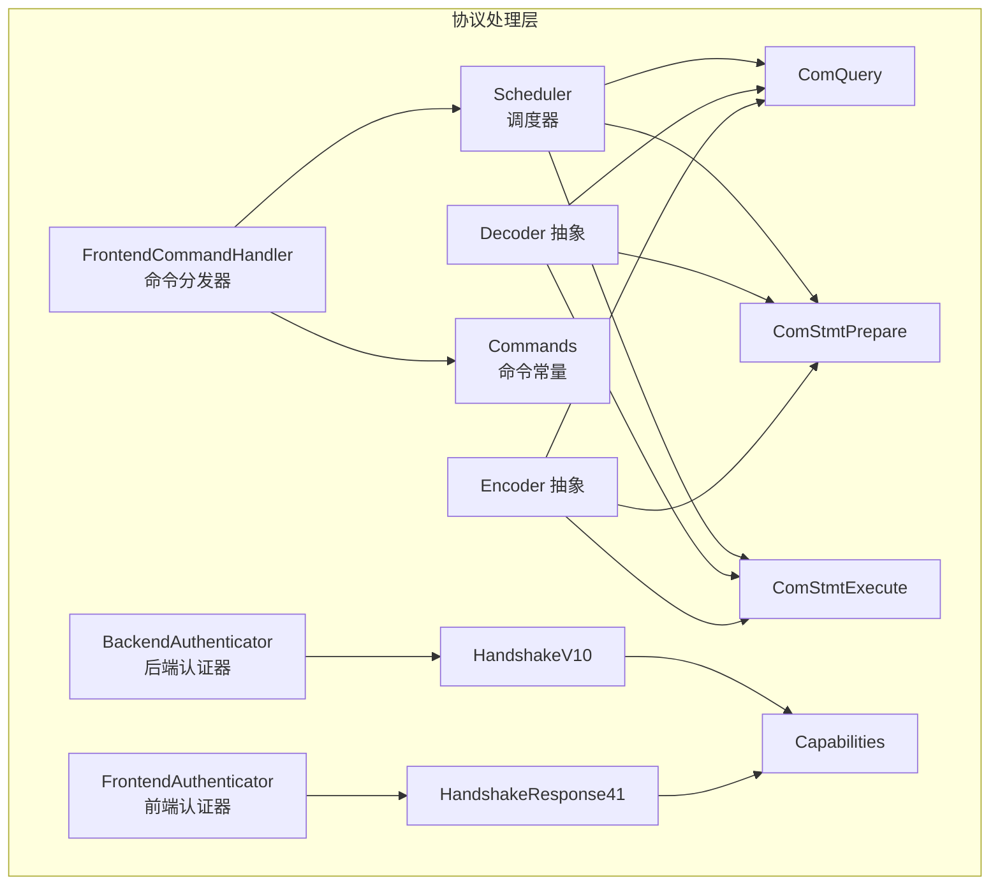
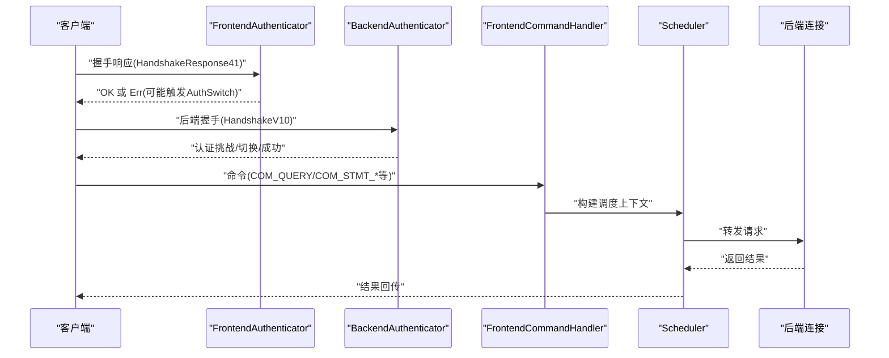
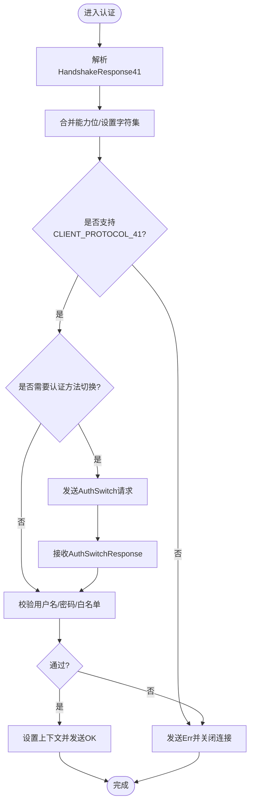
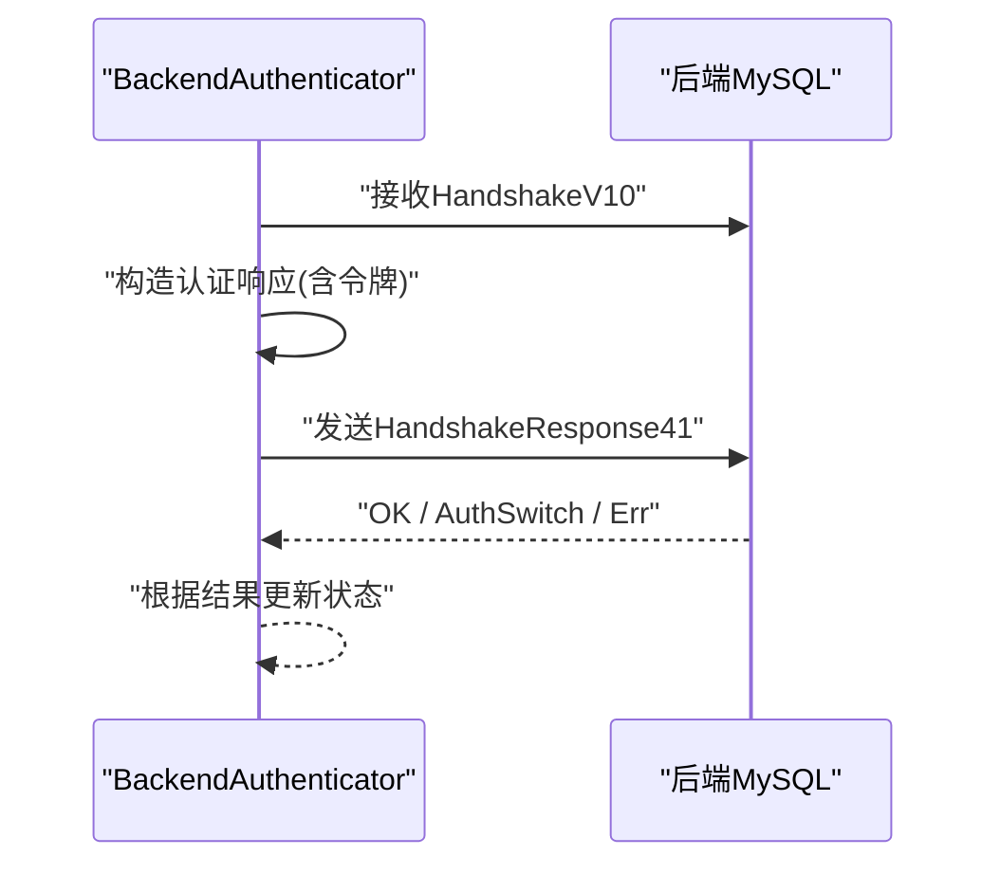
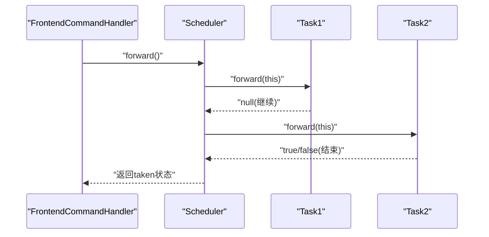
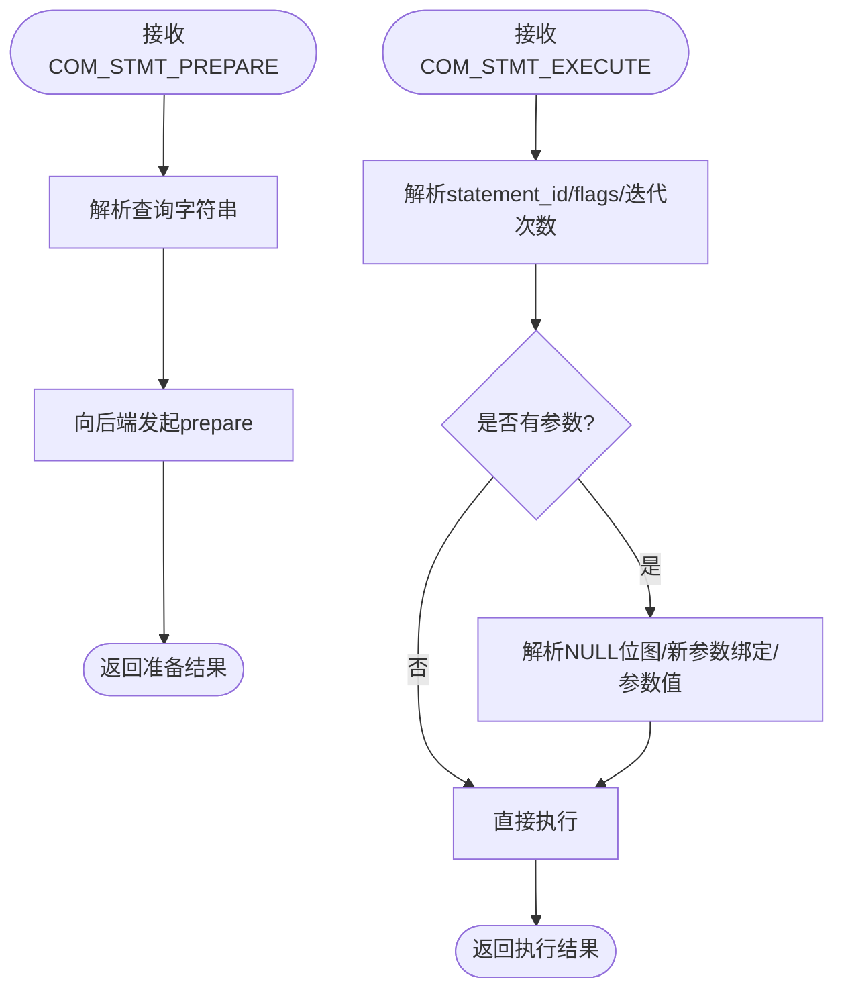
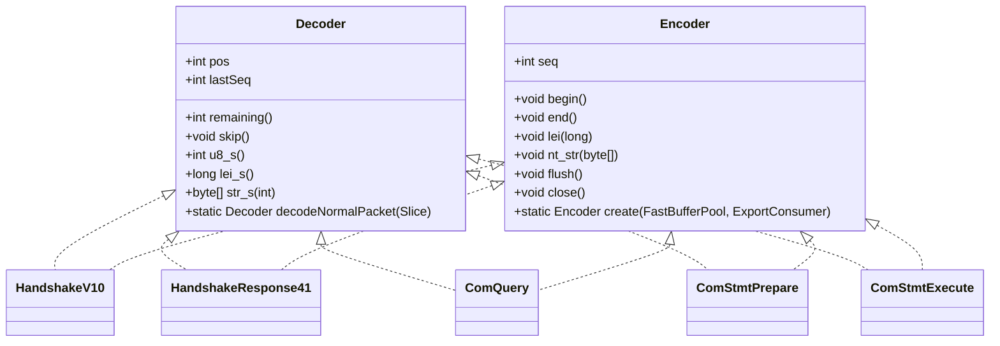
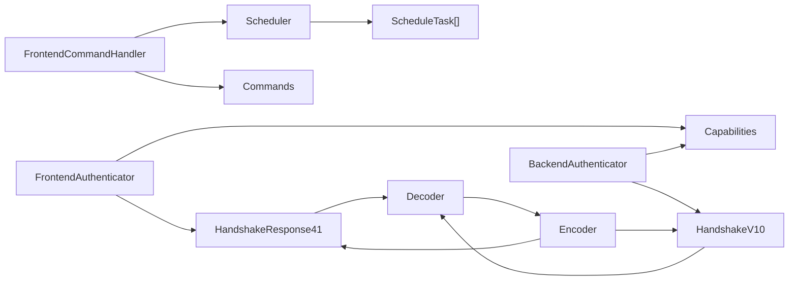

# 协议处理层

<cite>
**本文引用的文件**
- [proxy-core/src/main/java/com/alibaba/polardbx/proxy/protocol/handler/FrontendAuthenticator.java](file://proxy-core/src/main/java/com/alibaba/polardbx/proxy/protocol/handler/FrontendAuthenticator.java)
- [proxy-core/src/main/java/com/alibaba/polardbx/proxy/protocol/handler/BackendAuthenticator.java](file://proxy-core/src/main/java/com/alibaba/polardbx/proxy/protocol/handler/BackendAuthenticator.java)
- [proxy-core/src/main/java/com/alibaba/polardbx/proxy/protocol/handler/FrontendCommandHandler.java](file://proxy-core/src/main/java/com/alibaba/polardbx/proxy/protocol/handler/FrontendCommandHandler.java)
- [proxy-core/src/main/java/com/alibaba/polardbx/proxy/protocol/command/Commands.java](file://proxy-core/src/main/java/com/alibaba/polardbx/proxy/protocol/command/Commands.java)
- [proxy-core/src/main/java/com/alibaba/polardbx/proxy/protocol/command/ComQuery.java](file://proxy-core/src/main/java/com/alibaba/polardbx/proxy/protocol/command/ComQuery.java)
- [proxy-core/src/main/java/com/alibaba/polardbx/proxy/protocol/prepare/ComStmtExecute.java](file://proxy-core/src/main/java/com/alibaba/polardbx/proxy/protocol/prepare/ComStmtExecute.java)
- [proxy-core/src/main/java/com/alibaba/polardbx/proxy/protocol/prepare/ComStmtPrepare.java](file://proxy-core/src/main/java/com/alibaba/polardbx/proxy/protocol/prepare/ComStmtPrepare.java)
- [proxy-core/src/main/java/com/alibaba/polardbx/proxy/protocol/connection/HandshakeV10.java](file://proxy-core/src/main/java/com/alibaba/polardbx/proxy/protocol/connection/HandshakeV10.java)
- [proxy-core/src/main/java/com/alibaba/polardbx/proxy/protocol/connection/HandshakeResponse41.java](file://proxy-core/src/main/java/com/alibaba/polardbx/proxy/protocol/connection/HandshakeResponse41.java)
- [proxy-core/src/main/java/com/alibaba/polardbx/proxy/protocol/connection/Capabilities.java](file://proxy-core/src/main/java/com/alibaba/polardbx/proxy/protocol/connection/Capabilities.java)
- [proxy-core/src/main/java/com/alibaba/polardbx/proxy/protocol/decoder/Decoder.java](file://proxy-core/src/main/java/com/alibaba/polardbx/proxy/protocol/decoder/Decoder.java)
- [proxy-core/src/main/java/com/alibaba/polardbx/proxy/protocol/encoder/Encoder.java](file://proxy-core/src/main/java/com/alibaba/polardbx/proxy/protocol/encoder/Encoder.java)
- [proxy-core/src/main/java/com/alibaba/polardbx/proxy/protocol/common/MysqlProtocolHandler.java](file://proxy-core/src/main/java/com/alibaba/polardbx/proxy/protocol/common/MysqlProtocolHandler.java)
- [proxy-core/src/main/java/com/alibaba/polardbx/proxy/protocol/common/MysqlError.java](file://proxy-core/src/main/java/com/alibaba/polardbx/proxy/protocol/common/MysqlError.java)
- [proxy-core/src/main/java/com/alibaba/polardbx/proxy/scheduler/Scheduler.java](file://proxy-core/src/main/java/com/alibaba/polardbx/proxy/scheduler/Scheduler.java)
</cite>

## 目录
1. [简介](#简介)
2. [项目结构](#项目结构)
3. [核心组件](#核心组件)
4. [架构总览](#架构总览)
5. [详细组件分析](#详细组件分析)
6. [依赖关系分析](#依赖关系分析)
7. [性能考量](#性能考量)
8. [故障排查指南](#故障排查指南)
9. [结论](#结论)
10. [附录](#附录)

## 简介
本文件面向 PolarDB-X Proxy 的协议处理层，系统化梳理 MySQL 协议的完整实现，覆盖握手与认证（含多因子认证）、SSL 握手支持、命令处理管道（COM_QUERY、COM_STMT_EXECUTE、COM_STMT_PREPARE 等）、编解码器设计（数据包格式、字节序与长度编码、字符集转换）、前后端认证器策略差异，并给出协议兼容性、错误处理与性能优化建议。

## 项目结构
协议处理层位于 proxy-core 模块的 protocol 子包中，按职责划分为：
- handler：前端/后端认证器、命令分发器、转发器
- command：MySQL 命令与结果集元数据模型
- connection：握手与能力位定义
- decoder/encoder：高性能编解码器抽象与实现
- prepare：预处理语句相关命令
- scheduler：任务调度与重传控制
- common：通用协议状态、错误码、处理器基类

图表来源
- [proxy-core/src/main/java/com/alibaba/polardbx/proxy/protocol/handler/FrontendAuthenticator.java](file://proxy-core/src/main/java/com/alibaba/polardbx/proxy/protocol/handler/FrontendAuthenticator.java#L45-L203)
- [proxy-core/src/main/java/com/alibaba/polardbx/proxy/protocol/handler/BackendAuthenticator.java](file://proxy-core/src/main/java/com/alibaba/polardbx/proxy/protocol/handler/BackendAuthenticator.java#L45-L212)
- [proxy-core/src/main/java/com/alibaba/polardbx/proxy/protocol/handler/FrontendCommandHandler.java](file://proxy-core/src/main/java/com/alibaba/polardbx/proxy/protocol/handler/FrontendCommandHandler.java#L39-L172)
- [proxy-core/src/main/java/com/alibaba/polardbx/proxy/protocol/command/Commands.java](file://proxy-core/src/main/java/com/alibaba/polardbx/proxy/protocol/command/Commands.java#L21-L118)
- [proxy-core/src/main/java/com/alibaba/polardbx/proxy/protocol/command/ComQuery.java](file://proxy-core/src/main/java/com/alibaba/polardbx/proxy/protocol/command/ComQuery.java#L35-L162)
- [proxy-core/src/main/java/com/alibaba/polardbx/proxy/protocol/prepare/ComStmtPrepare.java](file://proxy-core/src/main/java/com/alibaba/polardbx/proxy/protocol/prepare/ComStmtPrepare.java#L28-L56)
- [proxy-core/src/main/java/com/alibaba/polardbx/proxy/protocol/prepare/ComStmtExecute.java](file://proxy-core/src/main/java/com/alibaba/polardbx/proxy/protocol/prepare/ComStmtExecute.java#L41-L225)
- [proxy-core/src/main/java/com/alibaba/polardbx/proxy/protocol/connection/HandshakeV10.java](file://proxy-core/src/main/java/com/alibaba/polardbx/proxy/protocol/connection/HandshakeV10.java#L32-L189)
- [proxy-core/src/main/java/com/alibaba/polardbx/proxy/protocol/connection/HandshakeResponse41.java](file://proxy-core/src/main/java/com/alibaba/polardbx/proxy/protocol/connection/HandshakeResponse41.java#L36-L243)
- [proxy-core/src/main/java/com/alibaba/polardbx/proxy/protocol/connection/Capabilities.java](file://proxy-core/src/main/java/com/alibaba/polardbx/proxy/protocol/connection/Capabilities.java#L21-L82)
- [proxy-core/src/main/java/com/alibaba/polardbx/proxy/protocol/decoder/Decoder.java](file://proxy-core/src/main/java/com/alibaba/polardbx/proxy/protocol/decoder/Decoder.java#L29-L371)
- [proxy-core/src/main/java/com/alibaba/polardbx/proxy/protocol/encoder/Encoder.java](file://proxy-core/src/main/java/com/alibaba/polardbx/proxy/protocol/encoder/Encoder.java#L34-L168)
- [proxy-core/src/main/java/com/alibaba/polardbx/proxy/scheduler/Scheduler.java](file://proxy-core/src/main/java/com/alibaba/polardbx/proxy/scheduler/Scheduler.java#L46-L315)

章节来源
- [proxy-core/src/main/java/com/alibaba/polardbx/proxy/protocol/handler/FrontendAuthenticator.java](file://proxy-core/src/main/java/com/alibaba/polardbx/proxy/protocol/handler/FrontendAuthenticator.java#L45-L203)
- [proxy-core/src/main/java/com/alibaba/polardbx/proxy/protocol/handler/BackendAuthenticator.java](file://proxy-core/src/main/java/com/alibaba/polardbx/proxy/protocol/handler/BackendAuthenticator.java#L45-L212)
- [proxy-core/src/main/java/com/alibaba/polardbx/proxy/protocol/handler/FrontendCommandHandler.java](file://proxy-core/src/main/java/com/alibaba/polardbx/proxy/protocol/handler/FrontendCommandHandler.java#L39-L172)
- [proxy-core/src/main/java/com/alibaba/polardbx/proxy/protocol/command/Commands.java](file://proxy-core/src/main/java/com/alibaba/polardbx/proxy/protocol/command/Commands.java#L21-L118)
- [proxy-core/src/main/java/com/alibaba/polardbx/proxy/protocol/command/ComQuery.java](file://proxy-core/src/main/java/com/alibaba/polardbx/proxy/protocol/command/ComQuery.java#L35-L162)
- [proxy-core/src/main/java/com/alibaba/polardbx/proxy/protocol/prepare/ComStmtPrepare.java](file://proxy-core/src/main/java/com/alibaba/polardbx/proxy/protocol/prepare/ComStmtPrepare.java#L28-L56)
- [proxy-core/src/main/java/com/alibaba/polardbx/proxy/protocol/prepare/ComStmtExecute.java](file://proxy-core/src/main/java/com/alibaba/polardbx/proxy/protocol/prepare/ComStmtExecute.java#L41-L225)
- [proxy-core/src/main/java/com/alibaba/polardbx/proxy/protocol/connection/HandshakeV10.java](file://proxy-core/src/main/java/com/alibaba/polardbx/proxy/protocol/connection/HandshakeV10.java#L32-L189)
- [proxy-core/src/main/java/com/alibaba/polardbx/proxy/protocol/connection/HandshakeResponse41.java](file://proxy-core/src/main/java/com/alibaba/polardbx/proxy/protocol/connection/HandshakeResponse41.java#L36-L243)
- [proxy-core/src/main/java/com/alibaba/polardbx/proxy/protocol/connection/Capabilities.java](file://proxy-core/src/main/java/com/alibaba/polardbx/proxy/protocol/connection/Capabilities.java#L21-L82)
- [proxy-core/src/main/java/com/alibaba/polardbx/proxy/protocol/decoder/Decoder.java](file://proxy-core/src/main/java/com/alibaba/polardbx/proxy/protocol/decoder/Decoder.java#L29-L371)
- [proxy-core/src/main/java/com/alibaba/polardbx/proxy/protocol/encoder/Encoder.java](file://proxy-core/src/main/java/com/alibaba/polardbx/proxy/protocol/encoder/Encoder.java#L34-L168)
- [proxy-core/src/main/java/com/alibaba/polardbx/proxy/protocol/common/MysqlProtocolHandler.java](file://proxy-core/src/main/java/com/alibaba/polardbx/proxy/protocol/common/MysqlProtocolHandler.java#L28-L68)
- [proxy-core/src/main/java/com/alibaba/polardbx/proxy/scheduler/Scheduler.java](file://proxy-core/src/main/java/com/alibaba/polardbx/proxy/scheduler/Scheduler.java#L46-L315)

## 核心组件
- 认证器
  - FrontendAuthenticator：负责前端客户端握手响应解析、能力位校验、字符集切换、密码验证与授权白名单检查；支持认证方法切换与最终 OK/ERR 返回。
  - BackendAuthenticator：负责与后端 MySQL 建立连接后的握手、能力位协商、用户名/数据库/密码注入、挑战响应与认证结果处理（含 AuthSwitch）。
- 命令分发器 FrontendCommandHandler：根据首字节识别命令类型，将请求路由到对应调度管线（Pipelines），交由 Scheduler 执行。
- 编解码器 Decoder/Encoder：统一抽象 MySQL 包头、长度编码（lenenc）、字符串编码（NUL-terminated、lenenc-str）与数值读写，支持多实现以适配不同内存布局。
- 命令与数据模型：Commands 定义命令常量；ComQuery/ComStmtPrepare/ComStmtExecute 实现文本与二进制参数绑定的编解码；HandshakeV10/HandshakeResponse41 实现握手与登录响应的数据结构。
- 调度器 Scheduler：串联多个 ScheduleTask，执行重传、SLA 统计、错误处理与后置操作，保证高可用与可观测性。

章节来源
- [proxy-core/src/main/java/com/alibaba/polardbx/proxy/protocol/handler/FrontendAuthenticator.java](file://proxy-core/src/main/java/com/alibaba/polardbx/proxy/protocol/handler/FrontendAuthenticator.java#L45-L203)
- [proxy-core/src/main/java/com/alibaba/polardbx/proxy/protocol/handler/BackendAuthenticator.java](file://proxy-core/src/main/java/com/alibaba/polardbx/proxy/protocol/handler/BackendAuthenticator.java#L45-L212)
- [proxy-core/src/main/java/com/alibaba/polardbx/proxy/protocol/handler/FrontendCommandHandler.java](file://proxy-core/src/main/java/com/alibaba/polardbx/proxy/protocol/handler/FrontendCommandHandler.java#L39-L172)
- [proxy-core/src/main/java/com/alibaba/polardbx/proxy/protocol/decoder/Decoder.java](file://proxy-core/src/main/java/com/alibaba/polardbx/proxy/protocol/decoder/Decoder.java#L29-L371)
- [proxy-core/src/main/java/com/alibaba/polardbx/proxy/protocol/encoder/Encoder.java](file://proxy-core/src/main/java/com/alibaba/polardbx/proxy/protocol/encoder/Encoder.java#L34-L168)
- [proxy-core/src/main/java/com/alibaba/polardbx/proxy/protocol/command/Commands.java](file://proxy-core/src/main/java/com/alibaba/polardbx/proxy/protocol/command/Commands.java#L21-L118)
- [proxy-core/src/main/java/com/alibaba/polardbx/proxy/protocol/command/ComQuery.java](file://proxy-core/src/main/java/com/alibaba/polardbx/proxy/protocol/command/ComQuery.java#L35-L162)
- [proxy-core/src/main/java/com/alibaba/polardbx/proxy/protocol/prepare/ComStmtPrepare.java](file://proxy-core/src/main/java/com/alibaba/polardbx/proxy/protocol/prepare/ComStmtPrepare.java#L28-L56)
- [proxy-core/src/main/java/com/alibaba/polardbx/proxy/protocol/prepare/ComStmtExecute.java](file://proxy-core/src/main/java/com/alibaba/polardbx/proxy/protocol/prepare/ComStmtExecute.java#L41-L225)
- [proxy-core/src/main/java/com/alibaba/polardbx/proxy/protocol/connection/HandshakeV10.java](file://proxy-core/src/main/java/com/alibaba/polardbx/proxy/protocol/connection/HandshakeV10.java#L32-L189)
- [proxy-core/src/main/java/com/alibaba/polardbx/proxy/protocol/connection/HandshakeResponse41.java](file://proxy-core/src/main/java/com/alibaba/polardbx/proxy/protocol/connection/HandshakeResponse41.java#L36-L243)
- [proxy-core/src/main/java/com/alibaba/polardbx/proxy/scheduler/Scheduler.java](file://proxy-core/src/main/java/com/alibaba/polardbx/proxy/scheduler/Scheduler.java#L46-L315)

## 架构总览
下图展示了从连接建立到命令执行的端到端流程，重点体现握手认证、命令分发与调度、以及前后端认证器的角色分工。

图表来源
- [proxy-core/src/main/java/com/alibaba/polardbx/proxy/protocol/handler/FrontendAuthenticator.java](file://proxy-core/src/main/java/com/alibaba/polardbx/proxy/protocol/handler/FrontendAuthenticator.java#L144-L201)
- [proxy-core/src/main/java/com/alibaba/polardbx/proxy/protocol/handler/BackendAuthenticator.java](file://proxy-core/src/main/java/com/alibaba/polardbx/proxy/protocol/handler/BackendAuthenticator.java#L75-L210)
- [proxy-core/src/main/java/com/alibaba/polardbx/proxy/protocol/handler/FrontendCommandHandler.java](file://proxy-core/src/main/java/com/alibaba/polardbx/proxy/protocol/handler/FrontendCommandHandler.java#L74-L170)
- [proxy-core/src/main/java/com/alibaba/polardbx/proxy/scheduler/Scheduler.java](file://proxy-core/src/main/java/com/alibaba/polardbx/proxy/scheduler/Scheduler.java#L300-L313)

## 详细组件分析

### 前端认证器 FrontendAuthenticator
- 职责
  - 解析客户端握手响应，合并能力位、设置字符集、记录用户名/数据库/最大包大小
  - 校验 CLIENT_PROTOCOL_41 能力位
  - 支持认证方法切换（AuthSwitch）
  - 白名单与信任 IP 策略、空密码处理、最终 OK/ERR 返回
- 关键点
  - 字符集不支持时直接拒绝
  - 支持信任 IP 提升为“god”特权主机
  - 使用安全工具进行密码校验
- 多因子认证
  - 当客户端声明支持多因子认证能力位时，可配合认证切换机制实现后续因子处理（当前实现聚焦于主认证方法）

图表来源
- [proxy-core/src/main/java/com/alibaba/polardbx/proxy/protocol/handler/FrontendAuthenticator.java](file://proxy-core/src/main/java/com/alibaba/polardbx/proxy/protocol/handler/FrontendAuthenticator.java#L144-L201)

章节来源
- [proxy-core/src/main/java/com/alibaba/polardbx/proxy/protocol/handler/FrontendAuthenticator.java](file://proxy-core/src/main/java/com/alibaba/polardbx/proxy/protocol/handler/FrontendAuthenticator.java#L45-L203)

### 后端认证器 BackendAuthenticator
- 职责
  - 接收后端握手包，初始化上下文能力位
  - 注入用户名、数据库、默认字符集
  - 生成挑战令牌并发送认证响应
  - 处理后端返回的认证结果或认证切换请求
- 关键点
  - 支持缓存 SHA2 密码认证切换
  - 对异常状态进行错误记录与连接关闭
  - 严格校验协议版本与能力位

图表来源
- [proxy-core/src/main/java/com/alibaba/polardbx/proxy/protocol/handler/BackendAuthenticator.java](file://proxy-core/src/main/java/com/alibaba/polardbx/proxy/protocol/handler/BackendAuthenticator.java#L75-L210)

章节来源
- [proxy-core/src/main/java/com/alibaba/polardbx/proxy/protocol/handler/BackendAuthenticator.java](file://proxy-core/src/main/java/com/alibaba/polardbx/proxy/protocol/handler/BackendAuthenticator.java#L45-L212)

### 命令分发器 FrontendCommandHandler 与调度器 Scheduler
- 命令识别
  - 依据首字节识别命令类型（QUIT、INIT_DB、QUERY、FIELD_LIST、STATISTICS、DEBUG、PING、RESET_CONNECTION、CHANGE_USER、SET_OPTION、STMT_PREPARE、STMT_EXECUTE、STMT_FETCH、STMT_CLOSE、STMT_RESET、STMT_SEND_LONG_DATA 等）
- 路由与执行
  - 将命令映射到对应的调度管线（Pipelines.*_TASKS）
  - 构建 Scheduler 上下文，依次执行各 ScheduleTask
  - 错误时触发重传或发送错误给前端
- 重传与可观测性
  - 记录重传延迟、等待 LSN/Leader 时间、调度耗时等指标
  - 支持在限定时间内对非事务场景进行快速重试

图表来源
- [proxy-core/src/main/java/com/alibaba/polardbx/proxy/protocol/handler/FrontendCommandHandler.java](file://proxy-core/src/main/java/com/alibaba/polardbx/proxy/protocol/handler/FrontendCommandHandler.java#L74-L170)
- [proxy-core/src/main/java/com/alibaba/polardbx/proxy/scheduler/Scheduler.java](file://proxy-core/src/main/java/com/alibaba/polardbx/proxy/scheduler/Scheduler.java#L300-L313)

章节来源
- [proxy-core/src/main/java/com/alibaba/polardbx/proxy/protocol/handler/FrontendCommandHandler.java](file://proxy-core/src/main/java/com/alibaba/polardbx/proxy/protocol/handler/FrontendCommandHandler.java#L39-L172)
- [proxy-core/src/main/java/com/alibaba/polardbx/proxy/protocol/command/Commands.java](file://proxy-core/src/main/java/com/alibaba/polardbx/proxy/protocol/command/Commands.java#L21-L118)
- [proxy-core/src/main/java/com/alibaba/polardbx/proxy/scheduler/Scheduler.java](file://proxy-core/src/main/java/com/alibaba/polardbx/proxy/scheduler/Scheduler.java#L46-L315)

### 预处理命令：COM_STMT_PREPARE 与 COM_STMT_EXECUTE
- COM_STMT_PREPARE
  - 文本协议：解析命令首字节与查询字符串
  - 用于后端准备语句，返回准备结果
- COM_STMT_EXECUTE
  - 二进制协议：解析 statement_id、flags、iteration_count、参数绑定与值
  - 支持新参数绑定与参数名/类型元信息
  - 参数值按二进制协议编码，NULL 位图指示空值
- 参数日志与截断
  - 提供参数日志字符串，超过阈值自动截断，避免日志膨胀

图表来源
- [proxy-core/src/main/java/com/alibaba/polardbx/proxy/protocol/prepare/ComStmtPrepare.java](file://proxy-core/src/main/java/com/alibaba/polardbx/proxy/protocol/prepare/ComStmtPrepare.java#L28-L56)
- [proxy-core/src/main/java/com/alibaba/polardbx/proxy/protocol/prepare/ComStmtExecute.java](file://proxy-core/src/main/java/com/alibaba/polardbx/proxy/protocol/prepare/ComStmtExecute.java#L80-L155)

章节来源
- [proxy-core/src/main/java/com/alibaba/polardbx/proxy/protocol/prepare/ComStmtPrepare.java](file://proxy-core/src/main/java/com/alibaba/polardbx/proxy/protocol/prepare/ComStmtPrepare.java#L28-L56)
- [proxy-core/src/main/java/com/alibaba/polardbx/proxy/protocol/prepare/ComStmtExecute.java](file://proxy-core/src/main/java/com/alibaba/polardbx/proxy/protocol/prepare/ComStmtExecute.java#L41-L225)

### 查询命令：COM_QUERY
- 文本协议：解析命令首字节与查询字符串
- 可选参数属性（CLIENT_QUERY_ATTRIBUTES）：支持参数计数、参数集数、NULL 位图、参数名与值
- 编码时固定参数集数为 1，确保兼容性

章节来源
- [proxy-core/src/main/java/com/alibaba/polardbx/proxy/protocol/command/ComQuery.java](file://proxy-core/src/main/java/com/alibaba/polardbx/proxy/protocol/command/ComQuery.java#L35-L162)

### 握手与能力位
- HandshakeV10：描述后端握手包字段（版本、连接 ID、能力位、字符集、状态标志、插件数据等）
- HandshakeResponse41：描述前端登录响应字段（客户端能力位、最大包、字符集、用户名、认证响应、初始库、认证插件名、连接属性、压缩等级等）
- Capabilities：集中定义客户端能力位常量，如 CLIENT_PROTOCOL_41、CLIENT_PLUGIN_AUTH、CLIENT_QUERY_ATTRIBUTES、MULTI_FACTOR_AUTHENTICATION 等

章节来源
- [proxy-core/src/main/java/com/alibaba/polardbx/proxy/protocol/connection/HandshakeV10.java](file://proxy-core/src/main/java/com/alibaba/polardbx/proxy/protocol/connection/HandshakeV10.java#L32-L189)
- [proxy-core/src/main/java/com/alibaba/polardbx/proxy/protocol/connection/HandshakeResponse41.java](file://proxy-core/src/main/java/com/alibaba/polardbx/proxy/protocol/connection/HandshakeResponse41.java#L36-L243)
- [proxy-core/src/main/java/com/alibaba/polardbx/proxy/protocol/connection/Capabilities.java](file://proxy-core/src/main/java/com/alibaba/polardbx/proxy/protocol/connection/Capabilities.java#L21-L82)

### 编解码器设计
- Decoder 抽象
  - 提供 u8/u16/u32/u64、f/d、lenenc（lei/lei_s）、字符串读取（str/le_str）等接口
  - 支持大包重组（多包合并为单个 payload）与序列号记录
  - 提供多种实现以适配堆内存、直接内存与 Unsafe 内存访问
- Encoder 抽象
  - 提供 u8/u16/u24/u32/u48/u64、f/d、lenenc 写入、字符串写入（nt_str/le_str/pkt）
  - 支持批量导出为 Slice 流，便于网络发送
- 字节序与长度编码
  - 使用无符号读取接口，lenenc 采用 1/3/4/9 字节变长编码
  - 字符串采用 NUL 结尾或长度前缀两种方式

图表来源
- [proxy-core/src/main/java/com/alibaba/polardbx/proxy/protocol/decoder/Decoder.java](file://proxy-core/src/main/java/com/alibaba/polardbx/proxy/protocol/decoder/Decoder.java#L29-L371)
- [proxy-core/src/main/java/com/alibaba/polardbx/proxy/protocol/encoder/Encoder.java](file://proxy-core/src/main/java/com/alibaba/polardbx/proxy/protocol/encoder/Encoder.java#L34-L168)
- [proxy-core/src/main/java/com/alibaba/polardbx/proxy/protocol/connection/HandshakeV10.java](file://proxy-core/src/main/java/com/alibaba/polardbx/proxy/protocol/connection/HandshakeV10.java#L70-L173)
- [proxy-core/src/main/java/com/alibaba/polardbx/proxy/protocol/connection/HandshakeResponse41.java](file://proxy-core/src/main/java/com/alibaba/polardbx/proxy/protocol/connection/HandshakeResponse41.java#L98-L224)
- [proxy-core/src/main/java/com/alibaba/polardbx/proxy/protocol/command/ComQuery.java](file://proxy-core/src/main/java/com/alibaba/polardbx/proxy/protocol/command/ComQuery.java#L66-L147)
- [proxy-core/src/main/java/com/alibaba/polardbx/proxy/protocol/prepare/ComStmtPrepare.java](file://proxy-core/src/main/java/com/alibaba/polardbx/proxy/protocol/prepare/ComStmtPrepare.java#L41-L47)
- [proxy-core/src/main/java/com/alibaba/polardbx/proxy/protocol/prepare/ComStmtExecute.java](file://proxy-core/src/main/java/com/alibaba/polardbx/proxy/protocol/prepare/ComStmtExecute.java#L157-L191)

章节来源
- [proxy-core/src/main/java/com/alibaba/polardbx/proxy/protocol/decoder/Decoder.java](file://proxy-core/src/main/java/com/alibaba/polardbx/proxy/protocol/decoder/Decoder.java#L29-L371)
- [proxy-core/src/main/java/com/alibaba/polardbx/proxy/protocol/encoder/Encoder.java](file://proxy-core/src/main/java/com/alibaba/polardbx/proxy/protocol/encoder/Encoder.java#L34-L168)

### 前后端认证策略对比
- 前端认证（FrontendAuthenticator）
  - 面向客户端：校验协议版本、能力位、字符集；支持认证方法切换；白名单与信任 IP；最终 OK/ERR
- 后端认证（BackendAuthenticator）
  - 面向后端 MySQL：注入用户名/数据库/字符集；生成挑战令牌；处理认证切换与失败

章节来源
- [proxy-core/src/main/java/com/alibaba/polardbx/proxy/protocol/handler/FrontendAuthenticator.java](file://proxy-core/src/main/java/com/alibaba/polardbx/proxy/protocol/handler/FrontendAuthenticator.java#L45-L203)
- [proxy-core/src/main/java/com/alibaba/polardbx/proxy/protocol/handler/BackendAuthenticator.java](file://proxy-core/src/main/java/com/alibaba/polardbx/proxy/protocol/handler/BackendAuthenticator.java#L45-L212)

## 依赖关系分析
- 组件耦合
  - FrontendCommandHandler 依赖 Commands 与 Scheduler；与 Pipelines 的任务数组耦合
  - FrontendAuthenticator/BackendAuthenticator 依赖 Capabilities、Handshake*、SecurityUtil 等
  - Decoder/Encoder 作为所有协议包的编解码基础，被各命令与握手包广泛使用
- 可能的循环依赖
  - 认证器与上下文之间存在单向依赖，未见循环
- 外部依赖
  - 字符集与安全工具来自工具类；错误码集中于 MysqlError

图表来源
- [proxy-core/src/main/java/com/alibaba/polardbx/proxy/protocol/handler/FrontendCommandHandler.java](file://proxy-core/src/main/java/com/alibaba/polardbx/proxy/protocol/handler/FrontendCommandHandler.java#L74-L170)
- [proxy-core/src/main/java/com/alibaba/polardbx/proxy/protocol/handler/FrontendAuthenticator.java](file://proxy-core/src/main/java/com/alibaba/polardbx/proxy/protocol/handler/FrontendAuthenticator.java#L144-L201)
- [proxy-core/src/main/java/com/alibaba/polardbx/proxy/protocol/handler/BackendAuthenticator.java](file://proxy-core/src/main/java/com/alibaba/polardbx/proxy/protocol/handler/BackendAuthenticator.java#L75-L210)
- [proxy-core/src/main/java/com/alibaba/polardbx/proxy/protocol/decoder/Decoder.java](file://proxy-core/src/main/java/com/alibaba/polardbx/proxy/protocol/decoder/Decoder.java#L326-L371)
- [proxy-core/src/main/java/com/alibaba/polardbx/proxy/protocol/encoder/Encoder.java](file://proxy-core/src/main/java/com/alibaba/polardbx/proxy/protocol/encoder/Encoder.java#L164-L167)

章节来源
- [proxy-core/src/main/java/com/alibaba/polardbx/proxy/protocol/handler/FrontendCommandHandler.java](file://proxy-core/src/main/java/com/alibaba/polardbx/proxy/protocol/handler/FrontendCommandHandler.java#L39-L172)
- [proxy-core/src/main/java/com/alibaba/polardbx/proxy/protocol/handler/FrontendAuthenticator.java](file://proxy-core/src/main/java/com/alibaba/polardbx/proxy/protocol/handler/FrontendAuthenticator.java#L45-L203)
- [proxy-core/src/main/java/com/alibaba/polardbx/proxy/protocol/handler/BackendAuthenticator.java](file://proxy-core/src/main/java/com/alibaba/polardbx/proxy/protocol/handler/BackendAuthenticator.java#L45-L212)
- [proxy-core/src/main/java/com/alibaba/polardbx/proxy/protocol/decoder/Decoder.java](file://proxy-core/src/main/java/com/alibaba/polardbx/proxy/protocol/decoder/Decoder.java#L29-L371)
- [proxy-core/src/main/java/com/alibaba/polardbx/proxy/protocol/encoder/Encoder.java](file://proxy-core/src/main/java/com/alibaba/polardbx/proxy/protocol/encoder/Encoder.java#L34-L168)

## 性能考量
- 编解码路径
  - Decoder/Encoder 提供多种实现，优先使用 Unsafe/Native/直接内存路径以减少拷贝
  - 大包重组与序列号管理避免额外拼接开销
- 调度与重传
  - Scheduler 统计重传延迟、等待 LSN/Leader 时间，有助于定位热点与抖动
  - 在限定时间内对非事务场景进行快速重试，提升可用性
- 日志与参数
  - 预处理参数日志具备长度截断，避免超长参数导致日志膨胀
- 字符集与能力位
  - 严格的能力位检查可避免无效工作与潜在错误

## 故障排查指南
- 常见错误码
  - 访问被拒绝、不支持的特性、未知语句处理器、内部错误、服务器不可用等
- 前端认证失败
  - 检查 CLIENT_PROTOCOL_41 是否开启、字符集是否受支持、用户名/密码/白名单配置
  - 若出现认证方法切换，确认客户端是否支持目标认证插件
- 后端认证失败
  - 检查后端握手能力位、认证插件名称与令牌生成
  - 关注 AuthSwitch 场景下的缓存 SHA2 密码处理
- 命令执行异常
  - 查看 Scheduler 的 errorHandle 行为与重传策略
  - 确认参数绑定与 NULL 位图正确性
- 编解码异常
  - 检查 lenenc 与字符串长度是否匹配，必要时启用更严格的校验

章节来源
- [proxy-core/src/main/java/com/alibaba/polardbx/proxy/protocol/common/MysqlError.java](file://proxy-core/src/main/java/com/alibaba/polardbx/proxy/protocol/common/MysqlError.java#L21-L33)
- [proxy-core/src/main/java/com/alibaba/polardbx/proxy/scheduler/Scheduler.java](file://proxy-core/src/main/java/com/alibaba/polardbx/proxy/scheduler/Scheduler.java#L234-L297)
- [proxy-core/src/main/java/com/alibaba/polardbx/proxy/protocol/prepare/ComStmtExecute.java](file://proxy-core/src/main/java/com/alibaba/polardbx/proxy/protocol/prepare/ComStmtExecute.java#L102-L155)

## 结论
协议处理层以清晰的职责划分与强健的编解码抽象为基础，实现了完整的 MySQL 握手与认证流程、命令分发与调度、以及前后端认证策略的差异化处理。通过能力位与多因子认证能力位预留，系统具备良好的扩展性；结合 Scheduler 的可观测性与重传机制，能够在复杂网络环境中保持稳定与高效。

## 附录
- 协议兼容性要点
  - 必须支持 CLIENT_PROTOCOL_41 与 CLIENT_PLUGIN_AUTH
  - 支持多因子认证能力位，便于后续扩展
  - 字符集与长度编码遵循 MySQL 规范
- 最佳实践
  - 在生产环境启用能力位校验与字符集检查
  - 对预处理参数日志设置合理阈值
  - 利用 Scheduler 指标进行容量与稳定性评估