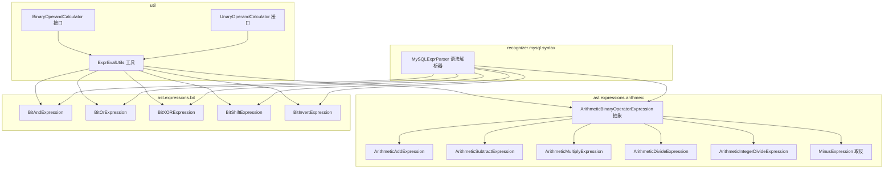
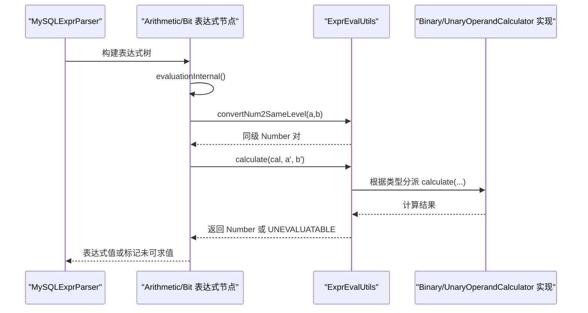
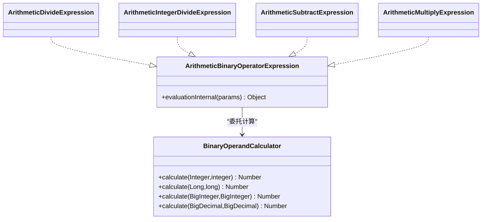
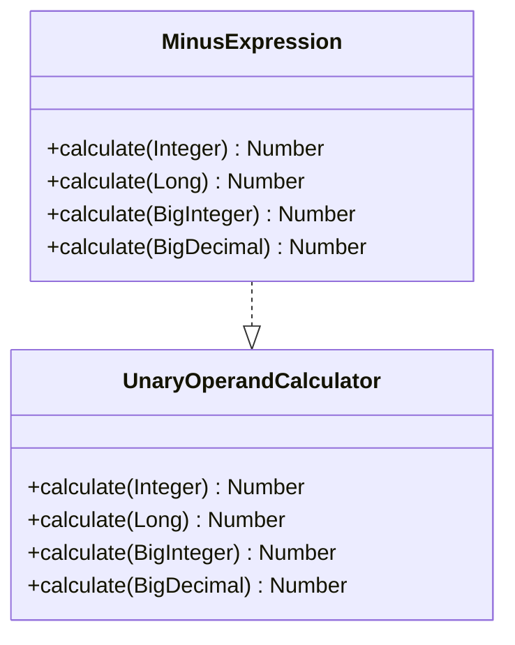
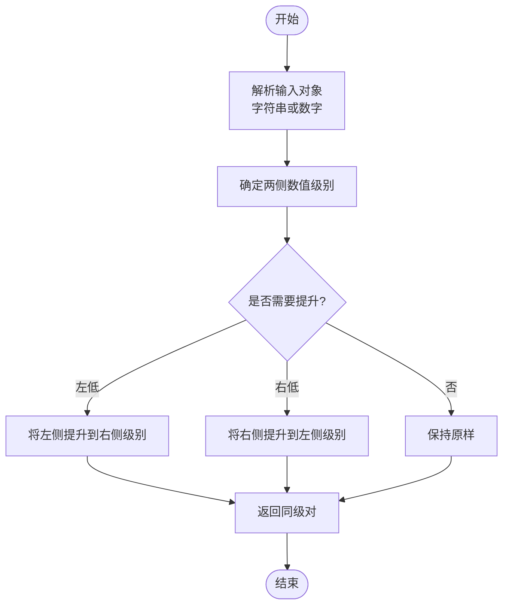
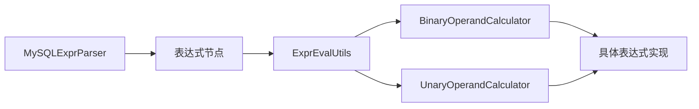

# 二进制运算器

<cite>
**本文引用的文件**
- [BinaryOperandCalculator.java](file://proxy-parser/src/main/java/com/alibaba/polardbx/proxy/parser/util/BinaryOperandCalculator.java)
- [UnaryOperandCalculator.java](file://proxy-parser/src/main/java/com/alibaba/polardbx/proxy/parser/util/UnaryOperandCalculator.java)
- [ExprEvalUtils.java](file://proxy-parser/src/main/java/com/alibaba/polardbx/proxy/parser/util/ExprEvalUtils.java)
- [ArithmeticBinaryOperatorExpression.java](file://proxy-parser/src/main/java/com/alibaba/polardbx/proxy/parser/ast/expression/arithmeic/ArithmeticBinaryOperatorExpression.java)
- [ArithmeticDivideExpression.java](file://proxy-parser/src/main/java/com/alibaba/polardbx/proxy/parser/ast/expression/arithmeic/ArithmeticDivideExpression.java)
- [ArithmeticIntegerDivideExpression.java](file://proxy-parser/src/main/java/com/alibaba/polardbx/proxy/parser/ast/expression/arithmeic/ArithmeticIntegerDivideExpression.java)
- [ArithmeticSubtractExpression.java](file://proxy-parser/src/main/java/com/alibaba/polardbx/proxy/parser/ast/expression/arithmeic/ArithmeticSubtractExpression.java)
- [ArithmeticMultiplyExpression.java](file://proxy-parser/src/main/java/com/alibaba/polardbx/proxy/parser/ast/expression/arithmeic/ArithmeticMultiplyExpression.java)
- [MinusExpression.java](file://proxy-parser/src/main/java/com/alibaba/polardbx/proxy/parser/ast/expression/arithmeic/MinusExpression.java)
- [BitAndExpression.java](file://proxy-parser/src/main/java/com/alibaba/polardbx/proxy/parser/ast/expression/bit/BitAndExpression.java)
- [BitOrExpression.java](file://proxy-parser/src/main/java/com/alibaba/polardbx/proxy/parser/ast/expression/bit/BitOrExpression.java)
- [BitXORExpression.java](file://proxy-parser/src/main/java/com/alibaba/polardbx/proxy/parser/ast/expression/bit/BitXORExpression.java)
- [BitShiftExpression.java](file://proxy-parser/src/main/java/com/alibaba/polardbx/proxy/parser/ast/expression/bit/BitShiftExpression.java)
- [BitInvertExpression.java](file://proxy-parser/src/main/java/com/alibaba/polardbx/proxy/parser/ast/expression/bit/BitInvertExpression.java)
- [MySQLExprParser.java](file://proxy-parser/src/main/java/com/alibaba/polardbx/proxy/parser/recognizer/mysql/syntax/MySQLExprParser.java)
- [BinaryOperatorExpression.java](file://proxy-parser/src/main/java/com/alibaba/polardbx/proxy/parser/ast/expression/BinaryOperatorExpression.java)
</cite>

## 目录
1. [简介](#简介)
2. [项目结构](#项目结构)
3. [核心组件](#核心组件)
4. [架构总览](#架构总览)
5. [组件详解](#组件详解)
6. [依赖关系分析](#依赖关系分析)
7. [性能考量](#性能考量)
8. [故障排查指南](#故障排查指南)
9. [结论](#结论)
10. [附录：使用示例与扩展建议](#附录使用示例与扩展建议)

## 简介
本文件系统性梳理 PolarDB-X Proxy 解析器中“二进制运算器”的设计与实现，重点覆盖以下方面：
- BinaryOperandCalculator 的接口契约与调用路径
- UnaryOperandCalculator 的一元运算抽象与典型实现（取反）
- 运算器在协议解析与表达式求值中的应用场景（数据校验、类型转换、数值计算）
- 溢出检测机制与边界条件处理
- 精度控制策略与异常处理策略
- 扩展方法与自定义运算符支持路径

## 项目结构
围绕二进制/一元运算器的相关代码主要分布在如下模块：
- util 层：定义运算器接口与通用表达式求值工具
- ast.expressions.*：表达式节点与求值流程
- recognizer.mysql.syntax：SQL 语法解析器，驱动表达式树构建

图表来源
- [BinaryOperandCalculator.java](file://proxy-parser/src/main/java/com/alibaba/polardbx/proxy/parser/util/BinaryOperandCalculator.java#L29-L38)
- [UnaryOperandCalculator.java](file://proxy-parser/src/main/java/com/alibaba/polardbx/proxy/parser/util/UnaryOperandCalculator.java#L29-L38)
- [ExprEvalUtils.java](file://proxy-parser/src/main/java/com/alibaba/polardbx/proxy/parser/util/ExprEvalUtils.java#L98-L144)
- [ArithmeticBinaryOperatorExpression.java](file://proxy-parser/src/main/java/com/alibaba/polardbx/proxy/parser/ast/expression/arithmeic/ArithmeticBinaryOperatorExpression.java#L37-L55)
- [ArithmeticDivideExpression.java](file://proxy-parser/src/main/java/com/alibaba/polardbx/proxy/parser/ast/expression/arithmeic/ArithmeticDivideExpression.java#L34-L38)
- [ArithmeticIntegerDivideExpression.java](file://proxy-parser/src/main/java/com/alibaba/polardbx/proxy/parser/ast/expression/arithmeic/ArithmeticIntegerDivideExpression.java#L34-L38)
- [ArithmeticSubtractExpression.java](file://proxy-parser/src/main/java/com/alibaba/polardbx/proxy/parser/ast/expression/arithmeic/ArithmeticSubtractExpression.java#L34-L38)
- [ArithmeticMultiplyExpression.java](file://proxy-parser/src/main/java/com/alibaba/polardbx/proxy/parser/ast/expression/arithmeic/ArithmeticMultiplyExpression.java#L34-L38)
- [MinusExpression.java](file://proxy-parser/src/main/java/com/alibaba/polardbx/proxy/parser/ast/expression/arithmeic/MinusExpression.java#L39-L105)
- [BitAndExpression.java](file://proxy-parser/src/main/java/com/alibaba/polardbx/proxy/parser/ast/expression/bit/BitAndExpression.java#L32-L36)
- [BitOrExpression.java](file://proxy-parser/src/main/java/com/alibaba/polardbx/proxy/parser/ast/expression/bit/BitOrExpression.java#L32-L36)
- [BitXORExpression.java](file://proxy-parser/src/main/java/com/alibaba/polardbx/proxy/parser/ast/expression/bit/BitXORExpression.java#L32-L36)
- [BitShiftExpression.java](file://proxy-parser/src/main/java/com/alibaba/polardbx/proxy/parser/ast/expression/bit/BitShiftExpression.java#L32-L42)
- [BitInvertExpression.java](file://proxy-parser/src/main/java/com/alibaba/polardbx/proxy/parser/ast/expression/bit/BitInvertExpression.java#L31-L35)
- [MySQLExprParser.java](file://proxy-parser/src/main/java/com/alibaba/polardbx/proxy/parser/recognizer/mysql/syntax/MySQLExprParser.java#L586-L643)

章节来源
- [BinaryOperandCalculator.java](file://proxy-parser/src/main/java/com/alibaba/polardbx/proxy/parser/util/BinaryOperandCalculator.java#L29-L38)
- [UnaryOperandCalculator.java](file://proxy-parser/src/main/java/com/alibaba/polardbx/proxy/parser/util/UnaryOperandCalculator.java#L29-L38)
- [ExprEvalUtils.java](file://proxy-parser/src/main/java/com/alibaba/polardbx/proxy/parser/util/ExprEvalUtils.java#L98-L144)
- [MySQLExprParser.java](file://proxy-parser/src/main/java/com/alibaba/polardbx/proxy/parser/recognizer/mysql/syntax/MySQLExprParser.java#L586-L643)

## 核心组件
- BinaryOperandCalculator：二元运算器接口，定义对整型、长整型、大整数、高精度小数的四则与位运算委托点
- UnaryOperandCalculator：一元运算器接口，定义对整型、长整型、大整数、高精度小数的取反等一元操作委托点
- ExprEvalUtils：统一的表达式求值入口，负责类型识别、同级提升、异常兜底与结果返回

章节来源
- [BinaryOperandCalculator.java](file://proxy-parser/src/main/java/com/alibaba/polardbx/proxy/parser/util/BinaryOperandCalculator.java#L29-L38)
- [UnaryOperandCalculator.java](file://proxy-parser/src/main/java/com/alibaba/polardbx/proxy/parser/util/UnaryOperandCalculator.java#L29-L38)
- [ExprEvalUtils.java](file://proxy-parser/src/main/java/com/alibaba/polardbx/proxy/parser/util/ExprEvalUtils.java#L98-L144)

## 架构总览
二进制/一元运算器通过 ExprEvalUtils 在表达式求值阶段被调用，语法解析器将 SQL 表达式转换为 AST 节点，节点在 evaluationInternal 中触发类型提升与委托计算。

图表来源
- [MySQLExprParser.java](file://proxy-parser/src/main/java/com/alibaba/polardbx/proxy/parser/recognizer/mysql/syntax/MySQLExprParser.java#L586-L643)
- [ArithmeticBinaryOperatorExpression.java](file://proxy-parser/src/main/java/com/alibaba/polardbx/proxy/parser/ast/expression/arithmeic/ArithmeticBinaryOperatorExpression.java#L41-L53)
- [ExprEvalUtils.java](file://proxy-parser/src/main/java/com/alibaba/polardbx/proxy/parser/util/ExprEvalUtils.java#L149-L172)
- [ExprEvalUtils.java](file://proxy-parser/src/main/java/com/alibaba/polardbx/proxy/parser/util/ExprEvalUtils.java#L122-L144)

## 组件详解

### BinaryOperandCalculator 接口与实现模式
- 接口职责：为不同数值类型提供二元计算委托点，便于在表达式求值时按类型分派
- 典型实现：在具体表达式节点中实现 calculate(...) 方法，执行对应运算；若无法直接计算，可抛出不支持异常或返回未可求值标记，由上层回退至数据库端计算

图表来源
- [BinaryOperandCalculator.java](file://proxy-parser/src/main/java/com/alibaba/polardbx/proxy/parser/util/BinaryOperandCalculator.java#L29-L38)
- [ArithmeticBinaryOperatorExpression.java](file://proxy-parser/src/main/java/com/alibaba/polardbx/proxy/parser/ast/expression/arithmeic/ArithmeticBinaryOperatorExpression.java#L37-L55)
- [ArithmeticDivideExpression.java](file://proxy-parser/src/main/java/com/alibaba/polardbx/proxy/parser/ast/expression/arithmeic/ArithmeticDivideExpression.java#L34-L38)
- [ArithmeticIntegerDivideExpression.java](file://proxy-parser/src/main/java/com/alibaba/polardbx/proxy/parser/ast/expression/arithmeic/ArithmeticIntegerDivideExpression.java#L34-L38)
- [ArithmeticSubtractExpression.java](file://proxy-parser/src/main/java/com/alibaba/polardbx/proxy/parser/ast/expression/arithmeic/ArithmeticSubtractExpression.java#L34-L38)
- [ArithmeticMultiplyExpression.java](file://proxy-parser/src/main/java/com/alibaba/polardbx/proxy/parser/ast/expression/arithmeic/ArithmeticMultiplyExpression.java#L34-L38)

章节来源
- [BinaryOperandCalculator.java](file://proxy-parser/src/main/java/com/alibaba/polardbx/proxy/parser/util/BinaryOperandCalculator.java#L29-L38)
- [ArithmeticBinaryOperatorExpression.java](file://proxy-parser/src/main/java/com/alibaba/polardbx/proxy/parser/ast/expression/arithmeic/ArithmeticBinaryOperatorExpression.java#L41-L53)

### UnaryOperandCalculator 接口与 MinusExpression 的取反实现
- 接口职责：为不同数值类型提供一元计算委托点
- 典型实现：MinusExpression 在 evaluate 时根据类型进行取反，并在溢出边界（如最小值）进行类型升级以避免溢出

图表来源
- [UnaryOperandCalculator.java](file://proxy-parser/src/main/java/com/alibaba/polardbx/proxy/parser/util/UnaryOperandCalculator.java#L29-L38)
- [MinusExpression.java](file://proxy-parser/src/main/java/com/alibaba/polardbx/proxy/parser/ast/expression/arithmeic/MinusExpression.java#L67-L105)

章节来源
- [UnaryOperandCalculator.java](file://proxy-parser/src/main/java/com/alibaba/polardbx/proxy/parser/util/UnaryOperandCalculator.java#L29-L38)
- [MinusExpression.java](file://proxy-parser/src/main/java/com/alibaba/polardbx/proxy/parser/ast/expression/arithmeic/MinusExpression.java#L48-L105)

### 类型转换与同级提升（convertNum2SameLevel）
- 目标：确保二元运算两侧参数处于同一数值级别，避免精度丢失与类型不匹配
- 策略：基于预设等级（int、long、BigInteger、BigDecimal）进行双向提升，必要时将低精度转为高精度
- 异常处理：遇到不支持的类型会抛出非法参数异常，调用方应捕获并回退

图表来源
- [ExprEvalUtils.java](file://proxy-parser/src/main/java/com/alibaba/polardbx/proxy/parser/util/ExprEvalUtils.java#L149-L172)
- [ExprEvalUtils.java](file://proxy-parser/src/main/java/com/alibaba/polardbx/proxy/parser/util/ExprEvalUtils.java#L174-L199)
- [ExprEvalUtils.java](file://proxy-parser/src/main/java/com/alibaba/polardbx/proxy/parser/util/ExprEvalUtils.java#L201-L215)

章节来源
- [ExprEvalUtils.java](file://proxy-parser/src/main/java/com/alibaba/polardbx/proxy/parser/util/ExprEvalUtils.java#L149-L215)

### 二元运算的数学规则与位运算处理
- 数学运算：加减乘除、整除与取模遵循 MySQL 语义，表达式节点在 evaluationInternal 中完成求值
- 位运算：与、或、异或、移位在语法解析阶段生成对应的表达式节点，求值时同样走 ExprEvalUtils 的类型分派
- 边界与溢出：对于取反场景，已在 MinusExpression 中对最小值进行特殊处理；其他二元运算节点通常采用抛出不支持的方式，交由数据库端执行

章节来源
- [ArithmeticBinaryOperatorExpression.java](file://proxy-parser/src/main/java/com/alibaba/polardbx/proxy/parser/ast/expression/arithmeic/ArithmeticBinaryOperatorExpression.java#L41-L53)
- [ArithmeticDivideExpression.java](file://proxy-parser/src/main/java/com/alibaba/polardbx/proxy/parser/ast/expression/arithmeic/ArithmeticDivideExpression.java#L34-L38)
- [ArithmeticIntegerDivideExpression.java](file://proxy-parser/src/main/java/com/alibaba/polardbx/proxy/parser/ast/expression/arithmeic/ArithmeticIntegerDivideExpression.java#L34-L38)
- [ArithmeticSubtractExpression.java](file://proxy-parser/src/main/java/com/alibaba/polardbx/proxy/parser/ast/expression/arithmeic/ArithmeticSubtractExpression.java#L34-L38)
- [ArithmeticMultiplyExpression.java](file://proxy-parser/src/main/java/com/alibaba/polardbx/proxy/parser/ast/expression/arithmeic/ArithmeticMultiplyExpression.java#L34-L38)
- [BitAndExpression.java](file://proxy-parser/src/main/java/com/alibaba/polardbx/proxy/parser/ast/expression/bit/BitAndExpression.java#L32-L36)
- [BitOrExpression.java](file://proxy-parser/src/main/java/com/alibaba/polardbx/proxy/parser/ast/expression/bit/BitOrExpression.java#L32-L36)
- [BitXORExpression.java](file://proxy-parser/src/main/java/com/alibaba/polardbx/proxy/parser/ast/expression/bit/BitXORExpression.java#L32-L36)
- [BitShiftExpression.java](file://proxy-parser/src/main/java/com/alibaba/polardbx/proxy/parser/ast/expression/bit/BitShiftExpression.java#L32-L42)

### 协议处理中的应用场景
- 数据校验：在表达式求值前，通过 convertNum2SameLevel 确保类型一致，减少后续错误
- 类型转换：将字符串字面量解析为 Number 并按需提升，保证计算精度
- 数值计算：在 Proxy 端尽可能本地化计算，降低数据库往返开销

章节来源
- [ExprEvalUtils.java](file://proxy-parser/src/main/java/com/alibaba/polardbx/proxy/parser/util/ExprEvalUtils.java#L149-L243)
- [MySQLExprParser.java](file://proxy-parser/src/main/java/com/alibaba/polardbx/proxy/parser/recognizer/mysql/syntax/MySQLExprParser.java#L586-L643)

## 依赖关系分析
- 表达式节点依赖 ExprEvalUtils 完成类型识别与委托
- BinaryOperandCalculator/UnaryOperandCalculator 作为委托接口，被具体表达式节点实现
- 语法解析器负责将 SQL 词法映射为表达式节点，形成完整的求值链路

图表来源
- [MySQLExprParser.java](file://proxy-parser/src/main/java/com/alibaba/polardbx/proxy/parser/recognizer/mysql/syntax/MySQLExprParser.java#L586-L643)
- [ExprEvalUtils.java](file://proxy-parser/src/main/java/com/alibaba/polardbx/proxy/parser/util/ExprEvalUtils.java#L98-L144)
- [BinaryOperandCalculator.java](file://proxy-parser/src/main/java/com/alibaba/polardbx/proxy/parser/util/BinaryOperandCalculator.java#L29-L38)
- [UnaryOperandCalculator.java](file://proxy-parser/src/main/java/com/alibaba/polardbx/proxy/parser/util/UnaryOperandCalculator.java#L29-L38)

章节来源
- [BinaryOperatorExpression.java](file://proxy-parser/src/main/java/com/alibaba/polardbx/proxy/parser/ast/expression/BinaryOperatorExpression.java#L38-L80)
- [ExprEvalUtils.java](file://proxy-parser/src/main/java/com/alibaba/polardbx/proxy/parser/util/ExprEvalUtils.java#L98-L144)

## 性能考量
- 类型分派与同级提升：尽量在表达式构建阶段减少不必要的字符串解析与类型转换
- 异常兜底：当运算器实现不支持某类型组合时，返回未可求值标记，避免异常传播带来的额外开销
- 大数运算：优先使用更高精度类型以避免精度损失，但注意 BigInteger/BigDecimal 的计算成本高于基本类型
- 本地计算优先：在 Proxy 端完成可求值表达式计算，减少数据库往返

[本节为通用指导，无需列出章节来源]

## 故障排查指南
- 表达式未可求值：当类型不支持或计算异常时，返回未可求值标记，应检查输入类型与运算器实现
- 字符串解析失败：string2Number 遇到非数字字符串会抛出非法参数异常，需确认输入合法性
- 类型级别不匹配：getNumberLevel 对未知类型抛出非法参数异常，需确保传入受支持的 Number 子类
- 取反溢出：MinusExpression 对最小值进行了边界处理，若出现异常请核对输入范围

章节来源
- [ExprEvalUtils.java](file://proxy-parser/src/main/java/com/alibaba/polardbx/proxy/parser/util/ExprEvalUtils.java#L115-L120)
- [ExprEvalUtils.java](file://proxy-parser/src/main/java/com/alibaba/polardbx/proxy/parser/util/ExprEvalUtils.java#L217-L243)
- [MinusExpression.java](file://proxy-parser/src/main/java/com/alibaba/polardbx/proxy/parser/ast/expression/arithmeic/MinusExpression.java#L67-L105)

## 结论
BinaryOperandCalculator 与 UnaryOperandCalculator 提供了清晰的委托接口，配合 ExprEvalUtils 的类型识别与同级提升机制，使 Proxy 能在表达式求值阶段高效地完成数值计算与类型转换。通过合理的边界处理与异常兜底策略，系统在保证正确性的同时兼顾性能与可维护性。

[本节为总结性内容，无需列出章节来源]

## 附录：使用示例与扩展建议

### 使用示例（步骤说明）
- 二元运算
  - 在表达式节点中实现 calculate(...)，并在 evaluationInternal 中调用 ExprEvalUtils.calculate(cal, a, b)
  - 若当前实现不支持该类型组合，返回未可求值标记，让上层回退至数据库
- 一元运算
  - 在表达式节点中实现 calculate(...)，并在 evaluationInternal 中调用 ExprEvalUtils.calculate(cal, num)
  - 对于取反等存在溢出风险的操作，参考 MinusExpression 的边界处理策略

章节来源
- [ArithmeticBinaryOperatorExpression.java](file://proxy-parser/src/main/java/com/alibaba/polardbx/proxy/parser/ast/expression/arithmeic/ArithmeticBinaryOperatorExpression.java#L41-L53)
- [ExprEvalUtils.java](file://proxy-parser/src/main/java/com/alibaba/polardbx/proxy/parser/util/ExprEvalUtils.java#L122-L144)
- [MinusExpression.java](file://proxy-parser/src/main/java/com/alibaba/polardbx/proxy/parser/ast/expression/arithmeic/MinusExpression.java#L48-L105)

### 性能与精度建议
- 优先使用更高精度类型以避免精度损失，但注意其计算成本
- 在表达式构建阶段尽量减少字符串解析与重复类型转换
- 对于可能溢出的运算（如取反），提前进行边界检查与类型升级

[本节为通用指导，无需列出章节来源]

### 异常与边界处理
- 当类型不受支持时，返回未可求值标记而非抛出异常，避免影响整体求值流程
- 对最小值等边界进行显式处理，防止溢出
- 对字符串输入进行严格校验，确保可解析为合法数值

章节来源
- [ExprEvalUtils.java](file://proxy-parser/src/main/java/com/alibaba/polardbx/proxy/parser/util/ExprEvalUtils.java#L115-L120)
- [MinusExpression.java](file://proxy-parser/src/main/java/com/alibaba/polardbx/proxy/parser/ast/expression/arithmeic/MinusExpression.java#L67-L105)

### 扩展方法与自定义运算符支持
- 新增二元运算：实现 BinaryOperandCalculator 的 calculate(...) 方法，并在对应表达式节点中调用 ExprEvalUtils.calculate
- 新增一元运算：实现 UnaryOperandCalculator 的 calculate(...) 方法，并在对应表达式节点中调用 ExprEvalUtils.calculate
- 自定义运算符：在语法解析器中新增词法识别与表达式节点构造，确保 evaluationInternal 正确调用委托计算

章节来源
- [BinaryOperandCalculator.java](file://proxy-parser/src/main/java/com/alibaba/polardbx/proxy/parser/util/BinaryOperandCalculator.java#L29-L38)
- [UnaryOperandCalculator.java](file://proxy-parser/src/main/java/com/alibaba/polardbx/proxy/parser/util/UnaryOperandCalculator.java#L29-L38)
- [MySQLExprParser.java](file://proxy-parser/src/main/java/com/alibaba/polardbx/proxy/parser/recognizer/mysql/syntax/MySQLExprParser.java#L586-L643)