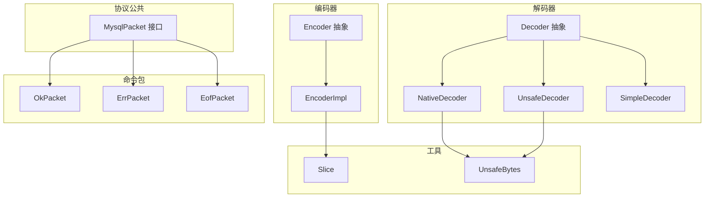
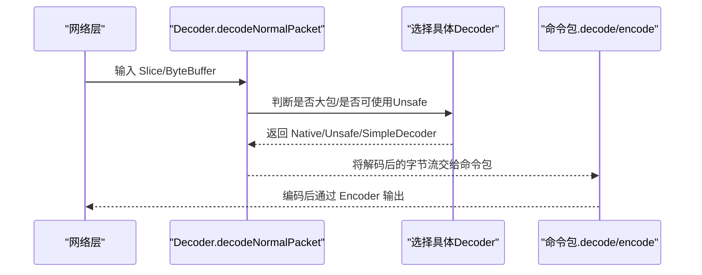
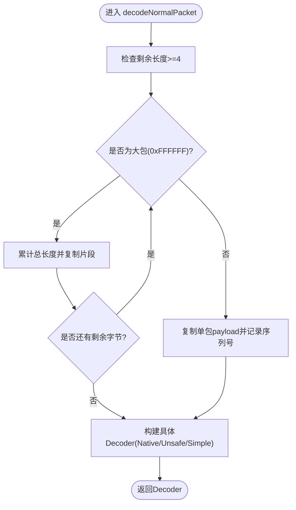
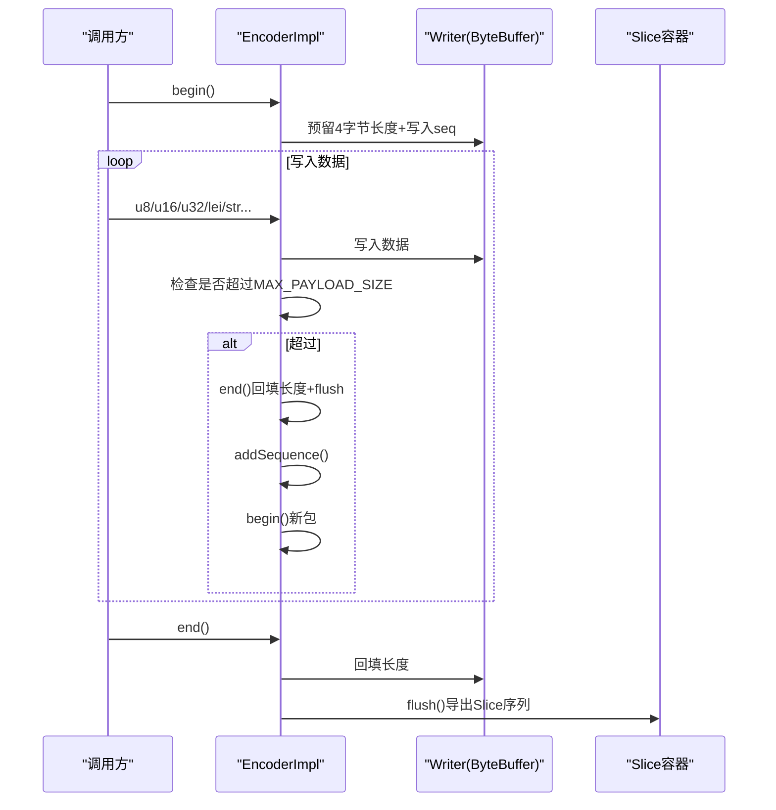
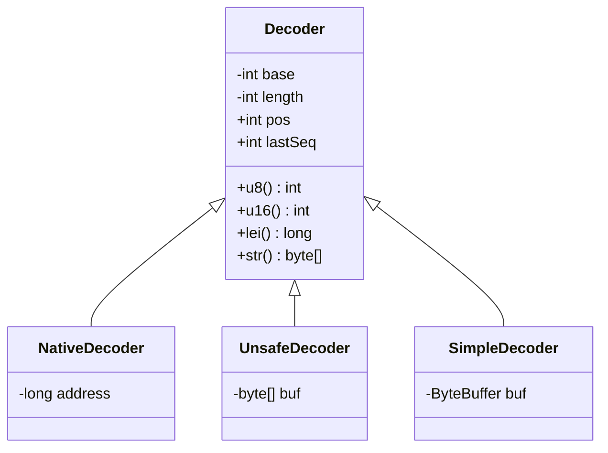
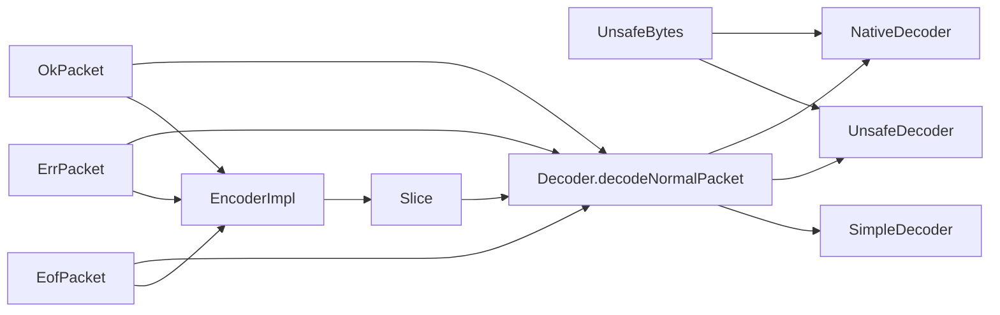

# 协议编解码

<cite>
**本文引用的文件**   
- [proxy-core/src/main/java/com/alibaba/polardbx/proxy/protocol/common/MysqlPacket.java](file://proxy-core/src/main/java/com/alibaba/polardbx/proxy/protocol/common/MysqlPacket.java)
- [proxy-core/src/main/java/com/alibaba/polardbx/proxy/protocol/decoder/Decoder.java](file://proxy-core/src/main/java/com/alibaba/polardbx/proxy/protocol/decoder/Decoder.java)
- [proxy-core/src/main/java/com/alibaba/polardbx/proxy/protocol/decoder/NativeDecoder.java](file://proxy-core/src/main/java/com/alibaba/polardbx/proxy/protocol/decoder/NativeDecoder.java)
- [proxy-core/src/main/java/com/alibaba/polardbx/proxy/protocol/decoder/UnsafeDecoder.java](file://proxy-core/src/main/java/com/alibaba/polardbx/proxy/protocol/decoder/UnsafeDecoder.java)
- [proxy-core/src/main/java/com/alibaba/polardbx/proxy/protocol/decoder/SimpleDecoder.java](file://proxy-core/src/main/java/com/alibaba/polardbx/proxy/protocol/decoder/SimpleDecoder.java)
- [proxy-core/src/main/java/com/alibaba/polardbx/proxy/protocol/encoder/Encoder.java](file://proxy-core/src/main/java/com/alibaba/polardbx/proxy/protocol/encoder/Encoder.java)
- [proxy-core/src/main/java/com/alibaba/polardbx/proxy/protocol/encoder/EncoderImpl.java](file://proxy-core/src/main/java/com/alibaba/polardbx/proxy/protocol/encoder/EncoderImpl.java)
- [proxy-common/src/main/java/com/alibaba/polardbx/proxy/utils/UnsafeBytes.java](file://proxy-common/src/main/java/com/alibaba/polardbx/proxy/utils/UnsafeBytes.java)
- [proxy-common/src/main/java/com/alibaba/polardbx/proxy/utils/Slice.java](file://proxy-common/src/main/java/com/alibaba/polardbx/proxy/utils/Slice.java)
- [proxy-core/src/main/java/com/alibaba/polardbx/proxy/protocol/command/OkPacket.java](file://proxy-core/src/main/java/com/alibaba/polardbx/proxy/protocol/command/OkPacket.java)
- [proxy-core/src/main/java/com/alibaba/polardbx/proxy/protocol/command/ErrPacket.java](file://proxy-core/src/main/java/com/alibaba/polardbx/proxy/protocol/command/ErrPacket.java)
- [proxy-core/src/main/java/com/alibaba/polardbx/proxy/protocol/command/EofPacket.java](file://proxy-core/src/main/java/com/alibaba/polardbx/proxy/protocol/command/EofPacket.java)
</cite>

## 目录
1. [引言](#引言)
2. [项目结构](#项目结构)
3. [核心组件](#核心组件)
4. [架构总览](#架构总览)
5. [组件详解](#组件详解)
6. [依赖关系分析](#依赖关系分析)
7. [性能与优化](#性能与优化)
8. [故障排查指南](#故障排查指南)
9. [结论](#结论)
10. [附录：扩展与兼容性建议](#附录扩展与兼容性建议)

## 引言
本文件面向 PolarDB-X Proxy 的协议编解码子系统，聚焦 MySQL 协议在代理层的实现细节。内容覆盖：
- MysqlPacket 数据包接口与头部规范
- Decoder/Encoder 抽象与实现（含长度编码、序列号管理）
- NativeDecoder 与 UnsafeDecoder 的性能差异与适用场景
- 字节流解析、数据类型转换、字符串与字符集处理
- 扩展点：自定义数据类型、压缩、协议版本兼容
- 性能优化与内存安全策略

## 项目结构
编解码相关代码主要位于 proxy-core 的 protocol 子模块，配合 proxy-common 的底层工具（如 Slice、UnsafeBytes）完成高性能内存与字节操作。

图示来源
- [proxy-core/src/main/java/com/alibaba/polardbx/proxy/protocol/common/MysqlPacket.java](file://proxy-core/src/main/java/com/alibaba/polardbx/proxy/protocol/common/MysqlPacket.java#L26-L41)
- [proxy-core/src/main/java/com/alibaba/polardbx/proxy/protocol/decoder/Decoder.java](file://proxy-core/src/main/java/com/alibaba/polardbx/proxy/protocol/decoder/Decoder.java#L29-L371)
- [proxy-core/src/main/java/com/alibaba/polardbx/proxy/protocol/decoder/NativeDecoder.java](file://proxy-core/src/main/java/com/alibaba/polardbx/proxy/protocol/decoder/NativeDecoder.java#L23-L279)
- [proxy-core/src/main/java/com/alibaba/polardbx/proxy/protocol/decoder/UnsafeDecoder.java](file://proxy-core/src/main/java/com/alibaba/polardbx/proxy/protocol/decoder/UnsafeDecoder.java#L23-L287)
- [proxy-core/src/main/java/com/alibaba/polardbx/proxy/protocol/decoder/SimpleDecoder.java](file://proxy-core/src/main/java/com/alibaba/polardbx/proxy/protocol/decoder/SimpleDecoder.java#L24-L275)
- [proxy-core/src/main/java/com/alibaba/polardbx/proxy/protocol/encoder/Encoder.java](file://proxy-core/src/main/java/com/alibaba/polardbx/proxy/protocol/encoder/Encoder.java#L32-L168)
- [proxy-core/src/main/java/com/alibaba/polardbx/proxy/protocol/encoder/EncoderImpl.java](file://proxy-core/src/main/java/com/alibaba/polardbx/proxy/protocol/encoder/EncoderImpl.java#L31-L302)
- [proxy-common/src/main/java/com/alibaba/polardbx/proxy/utils/Slice.java](file://proxy-common/src/main/java/com/alibaba/polardbx/proxy/utils/Slice.java#L36-L219)
- [proxy-common/src/main/java/com/alibaba/polardbx/proxy/utils/UnsafeBytes.java](file://proxy-common/src/main/java/com/alibaba/polardbx/proxy/utils/UnsafeBytes.java#L30-L92)
- [proxy-core/src/main/java/com/alibaba/polardbx/proxy/protocol/command/OkPacket.java](file://proxy-core/src/main/java/com/alibaba/polardbx/proxy/protocol/command/OkPacket.java#L33-L150)
- [proxy-core/src/main/java/com/alibaba/polardbx/proxy/protocol/command/ErrPacket.java](file://proxy-core/src/main/java/com/alibaba/polardbx/proxy/protocol/command/ErrPacket.java#L32-L110)
- [proxy-core/src/main/java/com/alibaba/polardbx/proxy/protocol/command/EofPacket.java](file://proxy-core/src/main/java/com/alibaba/polardbx/proxy/protocol/command/EofPacket.java#L32-L89)

章节来源
- [proxy-core/src/main/java/com/alibaba/polardbx/proxy/protocol/common/MysqlPacket.java](file://proxy-core/src/main/java/com/alibaba/polardbx/proxy/protocol/common/MysqlPacket.java#L26-L41)
- [proxy-core/src/main/java/com/alibaba/polardbx/proxy/protocol/decoder/Decoder.java](file://proxy-core/src/main/java/com/alibaba/polardbx/proxy/protocol/decoder/Decoder.java#L29-L371)
- [proxy-core/src/main/java/com/alibaba/polardbx/proxy/protocol/encoder/Encoder.java](file://proxy-core/src/main/java/com/alibaba/polardbx/proxy/protocol/encoder/Encoder.java#L32-L168)

## 核心组件
- MysqlPacket：定义 MySQL 包的基本常量与编解码契约（包头大小、最大负载、默认预留缓冲等），并声明 decode/encode 约定。
- Decoder 抽象：统一的字节流读取抽象，提供无符号整数、浮点、可变长整型（LEI）、字符串等读取方法，并内置大包合并逻辑。
- Encoder 抽象与实现：负责构建 MySQL 包头（长度+序列号），写入数据类型，自动分片与 flush 策略，导出为 Slice 序列。
- 工具类：
  - Slice：对直接内存或堆内存的切片封装，支持引用计数、消费/有效区间、dump 等。
  - UnsafeBytes：加载 JVM Unsafe，提供数组基址偏移与字节序校验，支持从 ByteBuffer 获取地址。

章节来源
- [proxy-core/src/main/java/com/alibaba/polardbx/proxy/protocol/common/MysqlPacket.java](file://proxy-core/src/main/java/com/alibaba/polardbx/proxy/protocol/common/MysqlPacket.java#L26-L41)
- [proxy-core/src/main/java/com/alibaba/polardbx/proxy/protocol/decoder/Decoder.java](file://proxy-core/src/main/java/com/alibaba/polardbx/proxy/protocol/decoder/Decoder.java#L29-L371)
- [proxy-core/src/main/java/com/alibaba/polardbx/proxy/protocol/encoder/Encoder.java](file://proxy-core/src/main/java/com/alibaba/polardbx/proxy/protocol/encoder/Encoder.java#L32-L168)
- [proxy-core/src/main/java/com/alibaba/polardbx/proxy/protocol/encoder/EncoderImpl.java](file://proxy-core/src/main/java/com/alibaba/polardbx/proxy/protocol/encoder/EncoderImpl.java#L31-L302)
- [proxy-common/src/main/java/com/alibaba/polardbx/proxy/utils/Slice.java](file://proxy-common/src/main/java/com/alibaba/polardbx/proxy/utils/Slice.java#L36-L219)
- [proxy-common/src/main/java/com/alibaba/polardbx/proxy/utils/UnsafeBytes.java](file://proxy-common/src/main/java/com/alibaba/polardbx/proxy/utils/UnsafeBytes.java#L30-L92)

## 架构总览
MySQL 协议编解码在代理层分为三层：
- 命令包层：OkPacket/ErrPacket/EofPacket 等具体包的编解码实现，遵循 MysqlPacket 约定。
- 编解码器层：Decoder 提供字节流解析能力；Encoder 负责构造包头与数据。
- 底层工具层：Slice/UnsafeBytes 提供内存与地址访问能力，保障零拷贝与高性能。

图示来源
- [proxy-core/src/main/java/com/alibaba/polardbx/proxy/protocol/decoder/Decoder.java](file://proxy-core/src/main/java/com/alibaba/polardbx/proxy/protocol/decoder/Decoder.java#L326-L369)
- [proxy-core/src/main/java/com/alibaba/polardbx/proxy/protocol/command/OkPacket.java](file://proxy-core/src/main/java/com/alibaba/polardbx/proxy/protocol/command/OkPacket.java#L67-L100)
- [proxy-core/src/main/java/com/alibaba/polardbx/proxy/protocol/encoder/EncoderImpl.java](file://proxy-core/src/main/java/com/alibaba/polardbx/proxy/protocol/encoder/EncoderImpl.java#L102-L132)

## 组件详解

### MysqlPacket 数据包结构与头部
- 头部尺寸与最大负载：
  - 普通包头：4 字节（payload_length + sequence_id）
  - 压缩包头：7 字节（payload_length + sequence_id + compress_seq + compress_len）
  - 最大负载：0xFFFFFF（16 MiB）
  - 默认预留缓冲：取 128 与头尺寸的最大值，用于避免频繁扩容
- 编解码约定：
  - decode(Decoder, capabilities)：按协议解析
  - encode(Encoder, capabilities)：默认抛出未实现，由具体包实现

章节来源
- [proxy-core/src/main/java/com/alibaba/polardbx/proxy/protocol/common/MysqlPacket.java](file://proxy-core/src/main/java/com/alibaba/polardbx/proxy/protocol/common/MysqlPacket.java#L31-L40)

### Decoder 抽象与字节流解析
- 位置与序列号：
  - pos：当前读取位置
  - lastSeq：最后一个包的序列号
- 基础读取：
  - u8/u16/u24/u32/u48/i64/f/d 系列，提供带/不带边界检查版本
- 可变长整型 LEI：
  - lei()/lei_s()：根据首字节指示长度进行读取，支持 1/3/4/8 字节
- 字符串读取：
  - str()/str(int)/str(byte[], int)/le_str()/le_str_s()：支持以 null 结尾与长度前缀两种形式
- 大包合并：
  - decodeNormalPacket：检测多包拼接（payload_length==0xFFFFFF），聚合到一个完整 payload 后再交由具体 Decoder 解析
  - 支持来自 Slice/ByteBuffer/堆字节数组的输入，优先尝试 Unsafe/原生路径，否则回退到 SimpleDecoder

图示来源
- [proxy-core/src/main/java/com/alibaba/polardbx/proxy/protocol/decoder/Decoder.java](file://proxy-core/src/main/java/com/alibaba/polardbx/proxy/protocol/decoder/Decoder.java#L178-L369)

章节来源
- [proxy-core/src/main/java/com/alibaba/polardbx/proxy/protocol/decoder/Decoder.java](file://proxy-core/src/main/java/com/alibaba/polardbx/proxy/protocol/decoder/Decoder.java#L29-L371)

### Encoder 抽象与包构建
- 序列号管理：
  - seq：当前包序列号，支持重置与递增
- 写入接口：
  - begin/end：写入包头（长度占位，最后回填），写入 sequence_id
  - u8/u16/u24/u32/u48/u64/f/d/lei/str/nt_str/le_str 等
- 分片与刷新：
  - 当写入超过最大负载时自动分割为多个包，并递增序列号
  - 基于容器大小与剩余空间阈值触发 flush，减少小包数量
- 导出：
  - 通过 ExportConsumer 将内部 Slice 容器输出，便于网络发送

图示来源
- [proxy-core/src/main/java/com/alibaba/polardbx/proxy/protocol/encoder/Encoder.java](file://proxy-core/src/main/java/com/alibaba/polardbx/proxy/protocol/encoder/Encoder.java#L32-L168)
- [proxy-core/src/main/java/com/alibaba/polardbx/proxy/protocol/encoder/EncoderImpl.java](file://proxy-core/src/main/java/com/alibaba/polardbx/proxy/protocol/encoder/EncoderImpl.java#L102-L156)
- [proxy-core/src/main/java/com/alibaba/polardbx/proxy/protocol/encoder/EncoderImpl.java](file://proxy-core/src/main/java/com/alibaba/polardbx/proxy/protocol/encoder/EncoderImpl.java#L285-L295)

章节来源
- [proxy-core/src/main/java/com/alibaba/polardbx/proxy/protocol/encoder/Encoder.java](file://proxy-core/src/main/java/com/alibaba/polardbx/proxy/protocol/encoder/Encoder.java#L32-L168)
- [proxy-core/src/main/java/com/alibaba/polardbx/proxy/protocol/encoder/EncoderImpl.java](file://proxy-core/src/main/java/com/alibaba/polardbx/proxy/protocol/encoder/EncoderImpl.java#L31-L302)

### Decoder 实现族：NativeDecoder、UnsafeDecoder、SimpleDecoder
- 共同点：
  - 均继承 Decoder，提供相同的读取接口与行为
  - 支持严格/宽松两种读取（带/不带边界检查）
- 差异点：
  - NativeDecoder：基于 Unsafe 访问原生地址，适合直接内存（Direct ByteBuffer）且地址可用
  - UnsafeDecoder：基于字节数组 + Unsafe，适合堆内存
  - SimpleDecoder：基于 ByteBuffer，通用但较慢
- 选择策略：
  - Decoder.decodeNormalPacket 会优先尝试 Native/Unsafe 路径，失败则回退到 SimpleDecoder

图示来源
- [proxy-core/src/main/java/com/alibaba/polardbx/proxy/protocol/decoder/Decoder.java](file://proxy-core/src/main/java/com/alibaba/polardbx/proxy/protocol/decoder/Decoder.java#L29-L371)
- [proxy-core/src/main/java/com/alibaba/polardbx/proxy/protocol/decoder/NativeDecoder.java](file://proxy-core/src/main/java/com/alibaba/polardbx/proxy/protocol/decoder/NativeDecoder.java#L23-L279)
- [proxy-core/src/main/java/com/alibaba/polardbx/proxy/protocol/decoder/UnsafeDecoder.java](file://proxy-core/src/main/java/com/alibaba/polardbx/proxy/protocol/decoder/UnsafeDecoder.java#L23-L287)
- [proxy-core/src/main/java/com/alibaba/polardbx/proxy/protocol/decoder/SimpleDecoder.java](file://proxy-core/src/main/java/com/alibaba/polardbx/proxy/protocol/decoder/SimpleDecoder.java#L24-L275)

章节来源
- [proxy-core/src/main/java/com/alibaba/polardbx/proxy/protocol/decoder/NativeDecoder.java](file://proxy-core/src/main/java/com/alibaba/polardbx/proxy/protocol/decoder/NativeDecoder.java#L23-L279)
- [proxy-core/src/main/java/com/alibaba/polardbx/proxy/protocol/decoder/UnsafeDecoder.java](file://proxy-core/src/main/java/com/alibaba/polardbx/proxy/protocol/decoder/UnsafeDecoder.java#L23-L287)
- [proxy-core/src/main/java/com/alibaba/polardbx/proxy/protocol/decoder/SimpleDecoder.java](file://proxy-core/src/main/java/com/alibaba/polardbx/proxy/protocol/decoder/SimpleDecoder.java#L24-L275)

### 字符串与字符集处理
- 字符串读取：
  - str()：遇到 EOF 或 0 字节停止
  - le_str()：先读长度（LEI），再读对应长度字节
  - nt_str()：以 0 结尾的字符串
- 字符集：
  - Encoder 提供 UTF-8 编码字符串写入
  - 具体命令包在需要时自行处理字符集（例如 OkPacket 中 info/sessionStateInfo）

章节来源
- [proxy-core/src/main/java/com/alibaba/polardbx/proxy/protocol/decoder/Decoder.java](file://proxy-core/src/main/java/com/alibaba/polardbx/proxy/protocol/decoder/Decoder.java#L104-L176)
- [proxy-core/src/main/java/com/alibaba/polardbx/proxy/protocol/encoder/Encoder.java](file://proxy-core/src/main/java/com/alibaba/polardbx/proxy/protocol/encoder/Encoder.java#L84-L116)
- [proxy-core/src/main/java/com/alibaba/polardbx/proxy/protocol/command/OkPacket.java](file://proxy-core/src/main/java/com/alibaba/polardbx/proxy/protocol/command/OkPacket.java#L89-L99)

### 命令包示例：OkPacket/ErrPacket/EofPacket
- OkPacket：OK/EOF 头、受影响行数、最后插入 ID、状态标志、警告、信息（可选）
- ErrPacket：错误码、SQLSTATE（可选）、错误消息
- EofPacket：EOF 头、警告、状态标志（可选）

章节来源
- [proxy-core/src/main/java/com/alibaba/polardbx/proxy/protocol/command/OkPacket.java](file://proxy-core/src/main/java/com/alibaba/polardbx/proxy/protocol/command/OkPacket.java#L33-L150)
- [proxy-core/src/main/java/com/alibaba/polardbx/proxy/protocol/command/ErrPacket.java](file://proxy-core/src/main/java/com/alibaba/polardbx/proxy/protocol/command/ErrPacket.java#L32-L110)
- [proxy-core/src/main/java/com/alibaba/polardbx/proxy/protocol/command/EofPacket.java](file://proxy-core/src/main/java/com/alibaba/polardbx/proxy/protocol/command/EofPacket.java#L32-L89)

## 依赖关系分析
- Decoder 依赖：
  - UnsafeBytes：在可用时获取原生地址或数组基址偏移
  - Slice：从 Slice 获取物理地址或堆字节数组
- Encoder 依赖：
  - FastBufferPool：分配直接内存 Slice
  - Slice：持有与导出数据
- 命令包依赖：
  - Decoder/Encoder：按协议字段顺序读写
  - Capabilities：根据客户端能力选择字段存在性

图示来源
- [proxy-common/src/main/java/com/alibaba/polardbx/proxy/utils/UnsafeBytes.java](file://proxy-common/src/main/java/com/alibaba/polardbx/proxy/utils/UnsafeBytes.java#L30-L92)
- [proxy-common/src/main/java/com/alibaba/polardbx/proxy/utils/Slice.java](file://proxy-common/src/main/java/com/alibaba/polardbx/proxy/utils/Slice.java#L36-L219)
- [proxy-core/src/main/java/com/alibaba/polardbx/proxy/protocol/decoder/Decoder.java](file://proxy-core/src/main/java/com/alibaba/polardbx/proxy/protocol/decoder/Decoder.java#L326-L369)
- [proxy-core/src/main/java/com/alibaba/polardbx/proxy/protocol/encoder/EncoderImpl.java](file://proxy-core/src/main/java/com/alibaba/polardbx/proxy/protocol/encoder/EncoderImpl.java#L31-L302)
- [proxy-core/src/main/java/com/alibaba/polardbx/proxy/protocol/command/OkPacket.java](file://proxy-core/src/main/java/com/alibaba/polardbx/proxy/protocol/command/OkPacket.java#L67-L100)
- [proxy-core/src/main/java/com/alibaba/polardbx/proxy/protocol/command/ErrPacket.java](file://proxy-core/src/main/java/com/alibaba/polardbx/proxy/protocol/command/ErrPacket.java#L53-L73)
- [proxy-core/src/main/java/com/alibaba/polardbx/proxy/protocol/command/EofPacket.java](file://proxy-core/src/main/java/com/alibaba/polardbx/proxy/protocol/command/EofPacket.java#L48-L66)

章节来源
- [proxy-core/src/main/java/com/alibaba/polardbx/proxy/protocol/decoder/Decoder.java](file://proxy-core/src/main/java/com/alibaba/polardbx/proxy/protocol/decoder/Decoder.java#L326-L369)
- [proxy-core/src/main/java/com/alibaba/polardbx/proxy/protocol/encoder/EncoderImpl.java](file://proxy-core/src/main/java/com/alibaba/polardbx/proxy/protocol/encoder/EncoderImpl.java#L31-L302)

## 性能与优化
- 内存与零拷贝
  - 优先使用 NativeDecoder/UnsafeDecoder，避免额外数组复制
  - 通过 Slice 持有直接内存，EncoderImpl 在可能时复用与合并 Slice，减少 GC 压力
- 字节序与平台
  - UnsafeBytes 在初始化时校验小端序，确保数值读写的正确性
- 分片与刷新
  - EncoderImpl 在写入超过最大负载时自动分包，避免单包过大
  - 基于容器大小与剩余空间阈值主动 flush，降低小包碎片
- 读取健壮性
  - 提供严格/宽松两类读取接口，宽松版在越界时抛异常，便于快速定位问题

章节来源
- [proxy-common/src/main/java/com/alibaba/polardbx/proxy/utils/UnsafeBytes.java](file://proxy-common/src/main/java/com/alibaba/polardbx/proxy/utils/UnsafeBytes.java#L67-L80)
- [proxy-core/src/main/java/com/alibaba/polardbx/proxy/protocol/encoder/EncoderImpl.java](file://proxy-core/src/main/java/com/alibaba/polardbx/proxy/protocol/encoder/EncoderImpl.java#L134-L156)
- [proxy-core/src/main/java/com/alibaba/polardbx/proxy/protocol/decoder/Decoder.java](file://proxy-core/src/main/java/com/alibaba/polardbx/proxy/protocol/decoder/Decoder.java#L118-L142)

## 故障排查指南
- 常见异常与定位
  - 非法长度/越界：Decoder/Encoder 在严格模式下抛出异常，检查包头长度与剩余字节
  - 非法包头：OkPacket/ErrPacket/EofPacket 对头部字节进行校验
  - 字节序问题：确认 UnsafeBytes 初始化成功且为小端序
- 内存泄漏与资源释放
  - EncoderImpl 使用 AutoCloseableContainer 管理 Slice 生命周期，确保 flush 后及时关闭
  - Slice 在 close 时减少引用计数，避免直接内存泄漏
- 大包处理
  - 若出现“无效长度”异常，检查多包拼接逻辑与最后一包是否正确截断

章节来源
- [proxy-core/src/main/java/com/alibaba/polardbx/proxy/protocol/decoder/Decoder.java](file://proxy-core/src/main/java/com/alibaba/polardbx/proxy/protocol/decoder/Decoder.java#L118-L142)
- [proxy-core/src/main/java/com/alibaba/polardbx/proxy/protocol/command/OkPacket.java](file://proxy-core/src/main/java/com/alibaba/polardbx/proxy/protocol/command/OkPacket.java#L68-L100)
- [proxy-core/src/main/java/com/alibaba/polardbx/proxy/protocol/command/ErrPacket.java](file://proxy-core/src/main/java/com/alibaba/polardbx/proxy/protocol/command/ErrPacket.java#L53-L73)
- [proxy-core/src/main/java/com/alibaba/polardbx/proxy/protocol/command/EofPacket.java](file://proxy-core/src/main/java/com/alibaba/polardbx/proxy/protocol/command/EofPacket.java#L48-L66)
- [proxy-common/src/main/java/com/alibaba/polardbx/proxy/utils/Slice.java](file://proxy-common/src/main/java/com/alibaba/polardbx/proxy/utils/Slice.java#L189-L196)
- [proxy-core/src/main/java/com/alibaba/polardbx/proxy/protocol/encoder/EncoderImpl.java](file://proxy-core/src/main/java/com/alibaba/polardbx/proxy/protocol/encoder/EncoderImpl.java#L285-L295)

## 结论
该编解码体系以 MysqlPacket 为契约，Decoder/Encoder 抽象清晰，结合 Slice/UnsafeBytes 实现高性能零拷贝与灵活的内存管理。通过严格的包头解析、可变长整型与字符串处理，以及自动分片与刷新机制，满足高吞吐代理场景的需求。同时，命令包层提供了良好的扩展点，便于后续引入自定义类型、压缩与协议版本兼容。

## 附录：扩展与兼容性建议
- 自定义数据类型
  - 在 Encoder/Decoder 中新增对应读写方法，命令包中按需调用
  - 注意长度编码与字符串处理的一致性
- 压缩算法集成
  - 在 EncoderImpl 前置阶段对 payload 进行压缩，使用压缩包头（7 字节）并在 flush 前回填压缩长度
  - Decoder 侧增加压缩包头识别与解压流程
- 协议版本兼容
  - 通过 Capabilities 标志位控制字段存在性（如 CLIENT_PROTOCOL_41、CLIENT_SESSION_TRACK），在命令包 decode/encode 中分支处理
- 性能优化清单
  - 优先使用 Native/Unsafe 路径，确保 ByteBuffer 地址可用
  - 控制 Slice 大小与数量，避免碎片化
  - 合理设置 flush 阈值，平衡延迟与内存占用