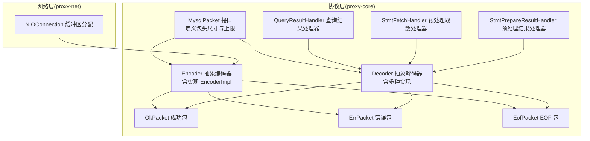
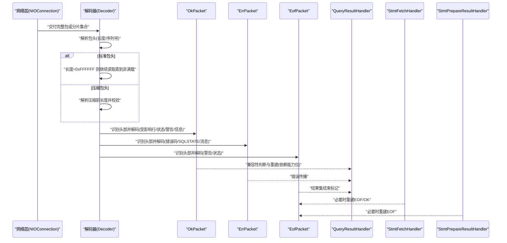
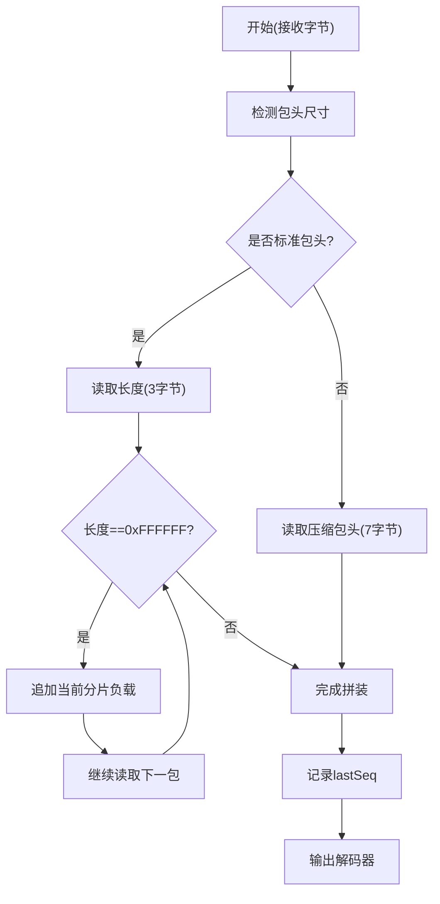
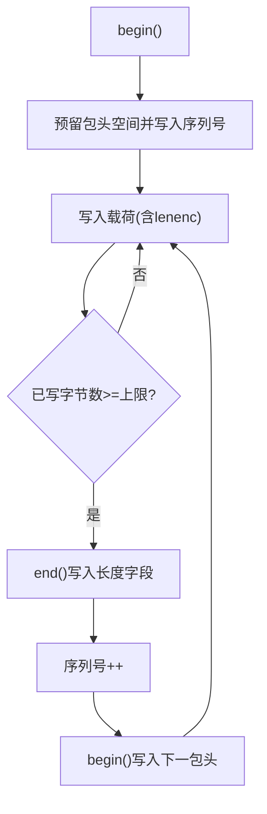
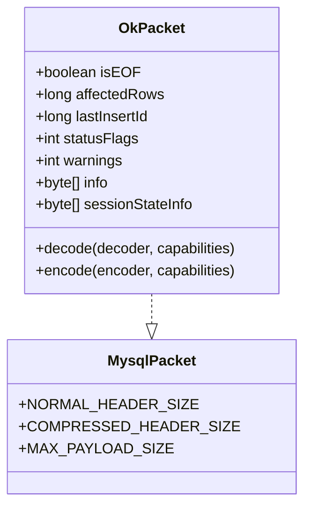
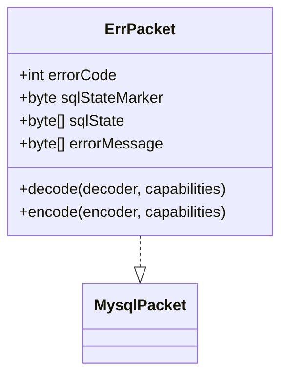
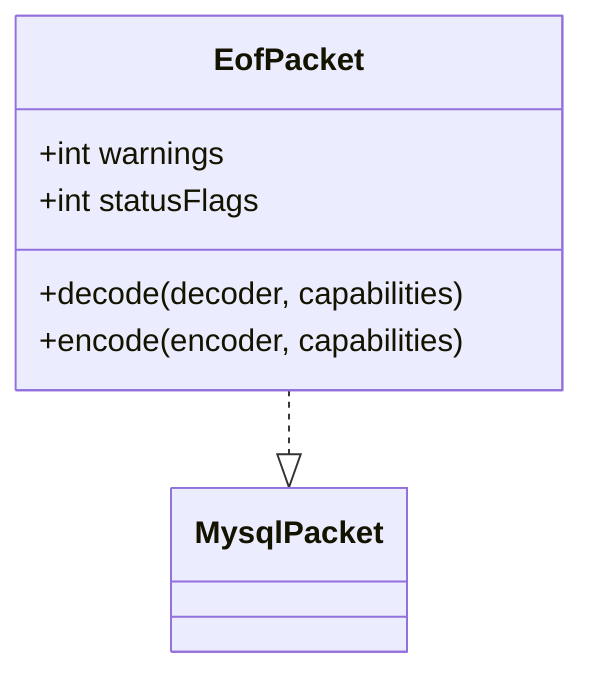
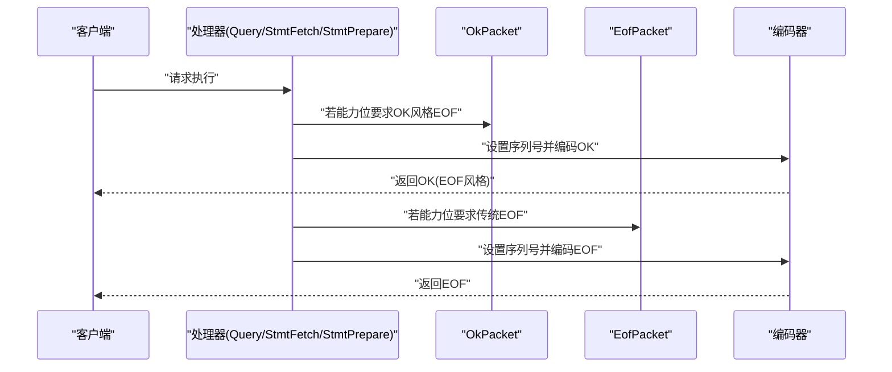
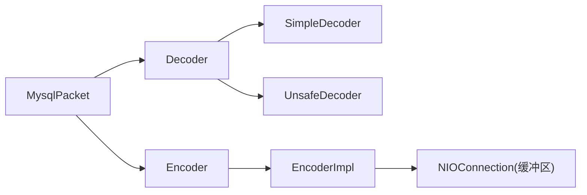

# 数据包格式

<cite>
**本文引用的文件**
- [proxy-core/src/main/java/com/alibaba/polardbx/proxy/protocol/common/MysqlPacket.java](file://proxy-core/src/main/java/com/alibaba/polardbx/proxy/protocol/common/MysqlPacket.java)
- [proxy-core/src/main/java/com/alibaba/polardbx/proxy/protocol/decoder/Decoder.java](file://proxy-core/src/main/java/com/alibaba/polardbx/proxy/protocol/decoder/Decoder.java)
- [proxy-core/src/main/java/com/alibaba/polardbx/proxy/protocol/decoder/SimpleDecoder.java](file://proxy-core/src/main/java/com/alibaba/polardbx/proxy/protocol/decoder/SimpleDecoder.java)
- [proxy-core/src/main/java/com/alibaba/polardbx/proxy/protocol/decoder/UnsafeDecoder.java](file://proxy-core/src/main/java/com/alibaba/polardbx/proxy/protocol/decoder/UnsafeDecoder.java)
- [proxy-core/src/main/java/com/alibaba/polardbx/proxy/protocol/encoder/Encoder.java](file://proxy-core/src/main/java/com/alibaba/polardbx/proxy/protocol/encoder/Encoder.java)
- [proxy-core/src/main/java/com/alibaba/polardbx/proxy/protocol/encoder/EncoderImpl.java](file://proxy-core/src/main/java/com/alibaba/polardbx/proxy/protocol/encoder/EncoderImpl.java)
- [proxy-core/src/main/java/com/alibaba/polardbx/proxy/protocol/command/OkPacket.java](file://proxy-core/src/main/java/com/alibaba/polardbx/proxy/protocol/command/OkPacket.java)
- [proxy-core/src/main/java/com/alibaba/polardbx/proxy/protocol/command/ErrPacket.java](file://proxy-core/src/main/java/com/alibaba/polardbx/proxy/protocol/command/ErrPacket.java)
- [proxy-core/src/main/java/com/alibaba/polardbx/proxy/protocol/command/EofPacket.java](file://proxy-core/src/main/java/com/alibaba/polardbx/proxy/protocol/command/EofPacket.java)
- [proxy-core/src/main/java/com/alibaba/polardbx/proxy/protocol/handler/result/QueryResultHandler.java](file://proxy-core/src/main/java/com/alibaba/polardbx/proxy/protocol/handler/result/QueryResultHandler.java)
- [proxy-core/src/main/java/com/alibaba/polardbx/proxy/protocol/handler/result/StmtFetchHandler.java](file://proxy-core/src/main/java/com/alibaba/polardbx/proxy/protocol/handler/result/StmtFetchHandler.java)
- [proxy-core/src/main/java/com/alibaba/polardbx/proxy/protocol/handler/result/StmtPrepareResultHandler.java](file://proxy-core/src/main/java/com/alibaba/polardbx/proxy/protocol/handler/result/StmtPrepareResultHandler.java)
- [proxy-net/src/main/java/com/alibaba/polardbx/proxy/net/NIOConnection.java](file://proxy-net/src/main/java/com/alibaba/polardbx/proxy/net/NIOConnection.java)
</cite>

## 目录
1. [引言](#引言)
2. [项目结构](#项目结构)
3. [核心组件](#核心组件)
4. [架构总览](#架构总览)
5. [详细组件分析](#详细组件分析)
6. [依赖关系分析](#依赖关系分析)
7. [性能考量](#性能考量)
8. [故障排查指南](#故障排查指南)
9. [结论](#结论)
10. [附录](#附录)

## 引言
本文件面向 PolarDB-X Proxy 的数据包格式体系，系统性阐述 MySQL 协议在代理层的数据包结构与处理流程，重点覆盖：
- 标准包头与压缩包头的差异及解析
- 包体大小上限与分片机制
- 常见数据包类型：OkPacket、ErrPacket、EofPacket 的格式与兼容处理
- 解析与编码的边界检查、错误处理与最佳实践
- 实际调用链路中的兼容性适配与序列号管理

## 项目结构
围绕数据包格式的核心代码主要位于 proxy-core 模块的 protocol 子系统中，并由 proxy-net 提供网络层缓冲区分配支持。

**图表来源**
- [proxy-core/src/main/java/com/alibaba/polardbx/proxy/protocol/common/MysqlPacket.java](file://proxy-core/src/main/java/com/alibaba/polardbx/proxy/protocol/common/MysqlPacket.java#L26-L41)
- [proxy-core/src/main/java/com/alibaba/polardbx/proxy/protocol/decoder/Decoder.java](file://proxy-core/src/main/java/com/alibaba/polardbx/proxy/protocol/decoder/Decoder.java#L29-L47)
- [proxy-core/src/main/java/com/alibaba/polardbx/proxy/protocol/encoder/Encoder.java](file://proxy-core/src/main/java/com/alibaba/polardbx/proxy/protocol/encoder/Encoder.java#L34-L47)
- [proxy-core/src/main/java/com/alibaba/polardbx/proxy/protocol/encoder/EncoderImpl.java](file://proxy-core/src/main/java/com/alibaba/polardbx/proxy/protocol/encoder/EncoderImpl.java#L31-L80)
- [proxy-core/src/main/java/com/alibaba/polardbx/proxy/protocol/command/OkPacket.java](file://proxy-core/src/main/java/com/alibaba/polardbx/proxy/protocol/command/OkPacket.java#L33-L100)
- [proxy-core/src/main/java/com/alibaba/polardbx/proxy/protocol/command/ErrPacket.java](file://proxy-core/src/main/java/com/alibaba/polardbx/proxy/protocol/command/ErrPacket.java#L32-L73)
- [proxy-core/src/main/java/com/alibaba/polardbx/proxy/protocol/command/EofPacket.java](file://proxy-core/src/main/java/com/alibaba/polardbx/proxy/protocol/command/EofPacket.java#L32-L66)
- [proxy-core/src/main/java/com/alibaba/polardbx/proxy/protocol/handler/result/QueryResultHandler.java](file://proxy-core/src/main/java/com/alibaba/polardbx/proxy/protocol/handler/result/QueryResultHandler.java#L316-L370)
- [proxy-core/src/main/java/com/alibaba/polardbx/proxy/protocol/handler/result/StmtFetchHandler.java](file://proxy-core/src/main/java/com/alibaba/polardbx/proxy/protocol/handler/result/StmtFetchHandler.java#L132-L151)
- [proxy-core/src/main/java/com/alibaba/polardbx/proxy/protocol/handler/result/StmtPrepareResultHandler.java](file://proxy-core/src/main/java/com/alibaba/polardbx/proxy/protocol/handler/result/StmtPrepareResultHandler.java#L70-L145)
- [proxy-net/src/main/java/com/alibaba/polardbx/proxy/net/NIOConnection.java](file://proxy-net/src/main/java/com/alibaba/polardbx/proxy/net/NIOConnection.java#L473-L495)

**章节来源**
- [proxy-core/src/main/java/com/alibaba/polardbx/proxy/protocol/common/MysqlPacket.java](file://proxy-core/src/main/java/com/alibaba/polardbx/proxy/protocol/common/MysqlPacket.java#L26-L41)
- [proxy-core/src/main/java/com/alibaba/polardbx/proxy/protocol/decoder/Decoder.java](file://proxy-core/src/main/java/com/alibaba/polardbx/proxy/protocol/decoder/Decoder.java#L29-L47)
- [proxy-core/src/main/java/com/alibaba/polardbx/proxy/protocol/encoder/Encoder.java](file://proxy-core/src/main/java/com/alibaba/polardbx/proxy/protocol/encoder/Encoder.java#L34-L47)
- [proxy-core/src/main/java/com/alibaba/polardbx/proxy/protocol/encoder/EncoderImpl.java](file://proxy-core/src/main/java/com/alibaba/polardbx/proxy/protocol/encoder/EncoderImpl.java#L31-L80)
- [proxy-core/src/main/java/com/alibaba/polardbx/proxy/protocol/command/OkPacket.java](file://proxy-core/src/main/java/com/alibaba/polardbx/proxy/protocol/command/OkPacket.java#L33-L100)
- [proxy-core/src/main/java/com/alibaba/polardbx/proxy/protocol/command/ErrPacket.java](file://proxy-core/src/main/java/com/alibaba/polardbx/proxy/protocol/command/ErrPacket.java#L32-L73)
- [proxy-core/src/main/java/com/alibaba/polardbx/proxy/protocol/command/EofPacket.java](file://proxy-core/src/main/java/com/alibaba/polardbx/proxy/protocol/command/EofPacket.java#L32-L66)
- [proxy-core/src/main/java/com/alibaba/polardbx/proxy/protocol/handler/result/QueryResultHandler.java](file://proxy-core/src/main/java/com/alibaba/polardbx/proxy/protocol/handler/result/QueryResultHandler.java#L316-L370)
- [proxy-core/src/main/java/com/alibaba/polardbx/proxy/protocol/handler/result/StmtFetchHandler.java](file://proxy-core/src/main/java/com/alibaba/polardbx/proxy/protocol/handler/result/StmtFetchHandler.java#L132-L151)
- [proxy-core/src/main/java/com/alibaba/polardbx/proxy/protocol/handler/result/StmtPrepareResultHandler.java](file://proxy-core/src/main/java/com/alibaba/polardbx/proxy/protocol/handler/result/StmtPrepareResultHandler.java#L70-L145)
- [proxy-net/src/main/java/com/alibaba/polardbx/proxy/net/NIOConnection.java](file://proxy-net/src/main/java/com/alibaba/polardbx/proxy/net/NIOConnection.java#L473-L495)

## 核心组件
- 包头常量与上限
  - 标准包头尺寸：4 字节（长度 3 字节 + 序列号 1 字节）
  - 压缩包头尺寸：7 字节（长度 3 字节 + 序列号 1 字节 + 压缩前长度 3 字节 + 压缩标志 0）
  - 最大负载：0xFFFFFF（16,777,215 字节），超过则进行分片
  - 默认预留缓冲：取 128 与包头尺寸的最大值
- 解码器族
  - 抽象基类提供统一接口与长度编码（lenenc）解析
  - 具体实现：SimpleDecoder（ByteBuffer）、UnsafeDecoder（堆内数组+Unsafe）、Native/Unsafe/堆外等多分支解码路径
- 编码器族
  - 抽象基类提供统一写入接口与 lenenc 写入
  - 实现 EncoderImpl：自动分片、序列号推进、缓冲池复用、批量刷新策略

**章节来源**
- [proxy-core/src/main/java/com/alibaba/polardbx/proxy/protocol/common/MysqlPacket.java](file://proxy-core/src/main/java/com/alibaba/polardbx/proxy/protocol/common/MysqlPacket.java#L31-L34)
- [proxy-core/src/main/java/com/alibaba/polardbx/proxy/protocol/decoder/Decoder.java](file://proxy-core/src/main/java/com/alibaba/polardbx/proxy/protocol/decoder/Decoder.java#L104-L142)
- [proxy-core/src/main/java/com/alibaba/polardbx/proxy/protocol/decoder/SimpleDecoder.java](file://proxy-core/src/main/java/com/alibaba/polardbx/proxy/protocol/decoder/SimpleDecoder.java#L24-L30)
- [proxy-core/src/main/java/com/alibaba/polardbx/proxy/protocol/decoder/UnsafeDecoder.java](file://proxy-core/src/main/java/com/alibaba/polardbx/proxy/protocol/decoder/UnsafeDecoder.java#L23-L32)
- [proxy-core/src/main/java/com/alibaba/polardbx/proxy/protocol/encoder/Encoder.java](file://proxy-core/src/main/java/com/alibaba/polardbx/proxy/protocol/encoder/Encoder.java#L34-L47)
- [proxy-core/src/main/java/com/alibaba/polardbx/proxy/protocol/encoder/EncoderImpl.java](file://proxy-core/src/main/java/com/alibaba/polardbx/proxy/protocol/encoder/EncoderImpl.java#L31-L80)

## 架构总览
下图展示了从网络接收、解包、解析到转发或回显的关键路径，以及包头尺寸、分片与序列号的处理位置。

**图表来源**
- [proxy-core/src/main/java/com/alibaba/polardbx/proxy/protocol/decoder/Decoder.java](file://proxy-core/src/main/java/com/alibaba/polardbx/proxy/protocol/decoder/Decoder.java#L326-L369)
- [proxy-core/src/main/java/com/alibaba/polardbx/proxy/protocol/command/OkPacket.java](file://proxy-core/src/main/java/com/alibaba/polardbx/proxy/protocol/command/OkPacket.java#L67-L100)
- [proxy-core/src/main/java/com/alibaba/polardbx/proxy/protocol/command/ErrPacket.java](file://proxy-core/src/main/java/com/alibaba/polardbx/proxy/protocol/command/ErrPacket.java#L53-L73)
- [proxy-core/src/main/java/com/alibaba/polardbx/proxy/protocol/command/EofPacket.java](file://proxy-core/src/main/java/com/alibaba/polardbx/proxy/protocol/command/EofPacket.java#L48-L66)
- [proxy-core/src/main/java/com/alibaba/polardbx/proxy/protocol/handler/result/QueryResultHandler.java](file://proxy-core/src/main/java/com/alibaba/polardbx/proxy/protocol/handler/result/QueryResultHandler.java#L316-L370)
- [proxy-core/src/main/java/com/alibaba/polardbx/proxy/protocol/handler/result/StmtFetchHandler.java](file://proxy-core/src/main/java/com/alibaba/polardbx/proxy/protocol/handler/result/StmtFetchHandler.java#L132-L151)
- [proxy-core/src/main/java/com/alibaba/polardbx/proxy/protocol/handler/result/StmtPrepareResultHandler.java](file://proxy-core/src/main/java/com/alibaba/polardbx/proxy/protocol/handler/result/StmtPrepareResultHandler.java#L70-L145)

## 详细组件分析

### 包头与分片机制
- 标准包头（4 字节）
  - 长度字段：小端 3 字节，表示后续负载长度
  - 序列号字段：1 字节，用于多包拼接时的顺序标识
- 压缩包头（7 字节）
  - 长度字段：小端 3 字节，表示压缩后负载长度
  - 序列号字段：1 字节
  - 压缩前长度：小端 3 字节
  - 压缩标志：0（固定）
- 分片与拼装
  - 当长度字段等于最大负载上限时，表示该包为分片的一部分；需继续读取直至遇到非满载包为止，再将多个分片的负载合并为完整报文
  - 解码器对不同来源（堆外地址、堆内数组、ByteBuffer）提供多分支解码路径，确保高性能与兼容性
- 序列号管理
  - 解码器记录最后一个包的序列号，便于后续转发或重建包时使用

**图表来源**
- [proxy-core/src/main/java/com/alibaba/polardbx/proxy/protocol/decoder/Decoder.java](file://proxy-core/src/main/java/com/alibaba/polardbx/proxy/protocol/decoder/Decoder.java#L178-L224)
- [proxy-core/src/main/java/com/alibaba/polardbx/proxy/protocol/decoder/Decoder.java](file://proxy-core/src/main/java/com/alibaba/polardbx/proxy/protocol/decoder/Decoder.java#L226-L278)
- [proxy-core/src/main/java/com/alibaba/polardbx/proxy/protocol/decoder/Decoder.java](file://proxy-core/src/main/java/com/alibaba/polardbx/proxy/protocol/decoder/Decoder.java#L280-L324)
- [proxy-core/src/main/java/com/alibaba/polardbx/proxy/protocol/decoder/Decoder.java](file://proxy-core/src/main/java/com/alibaba/polardbx/proxy/protocol/decoder/Decoder.java#L326-L369)

**章节来源**
- [proxy-core/src/main/java/com/alibaba/polardbx/proxy/protocol/common/MysqlPacket.java](file://proxy-core/src/main/java/com/alibaba/polardbx/proxy/protocol/common/MysqlPacket.java#L31-L34)
- [proxy-core/src/main/java/com/alibaba/polardbx/proxy/protocol/decoder/Decoder.java](file://proxy-core/src/main/java/com/alibaba/polardbx/proxy/protocol/decoder/Decoder.java#L178-L224)
- [proxy-core/src/main/java/com/alibaba/polardbx/proxy/protocol/decoder/Decoder.java](file://proxy-core/src/main/java/com/alibaba/polardbx/proxy/protocol/decoder/Decoder.java#L226-L278)
- [proxy-core/src/main/java/com/alibaba/polardbx/proxy/protocol/decoder/Decoder.java](file://proxy-core/src/main/java/com/alibaba/polardbx/proxy/protocol/decoder/Decoder.java#L280-L324)
- [proxy-core/src/main/java/com/alibaba/polardbx/proxy/protocol/decoder/Decoder.java](file://proxy-core/src/main/java/com/alibaba/polardbx/proxy/protocol/decoder/Decoder.java#L326-L369)

### 编码与分片写入
- 编码器在 begin/end 中写入包头占位，随后按载荷写入
- 当写入长度达到上限时，自动截断并结束当前包，序列号递增，重新 begin 下一包
- 支持 lenenc 写入与字符串写入，保证与解码器一致的编码规则

**图表来源**
- [proxy-core/src/main/java/com/alibaba/polardbx/proxy/protocol/encoder/EncoderImpl.java](file://proxy-core/src/main/java/com/alibaba/polardbx/proxy/protocol/encoder/EncoderImpl.java#L102-L132)
- [proxy-core/src/main/java/com/alibaba/polardbx/proxy/protocol/encoder/EncoderImpl.java](file://proxy-core/src/main/java/com/alibaba/polardbx/proxy/protocol/encoder/EncoderImpl.java#L134-L156)
- [proxy-core/src/main/java/com/alibaba/polardbx/proxy/protocol/encoder/EncoderImpl.java](file://proxy-core/src/main/java/com/alibaba/polardbx/proxy/protocol/encoder/EncoderImpl.java#L251-L275)

**章节来源**
- [proxy-core/src/main/java/com/alibaba/polardbx/proxy/protocol/encoder/EncoderImpl.java](file://proxy-core/src/main/java/com/alibaba/polardbx/proxy/protocol/encoder/EncoderImpl.java#L102-L156)
- [proxy-core/src/main/java/com/alibaba/polardbx/proxy/protocol/encoder/EncoderImpl.java](file://proxy-core/src/main/java/com/alibaba/polardbx/proxy/protocol/encoder/EncoderImpl.java#L251-L275)

### OkPacket（成功响应包）
- 头部：0x00 或 0xFE（当启用 CLIENT_DEPRECATE_EOF 能力时，0xFE 表示“EOF”风格的 OK 包）
- 可变字段：
  - affected_rows、last_insert_id（lenenc）
  - 若支持协议 4.1：status_flags、warnings（各 2 字节）
  - 若支持会话跟踪：info（lenenc 字符串）与可选的 session_state_info（仅当状态变更标志置位）
- 解码时严格校验剩余长度与头部值；编码时根据能力位选择字段写入

**图表来源**
- [proxy-core/src/main/java/com/alibaba/polardbx/proxy/protocol/command/OkPacket.java](file://proxy-core/src/main/java/com/alibaba/polardbx/proxy/protocol/command/OkPacket.java#L33-L100)
- [proxy-core/src/main/java/com/alibaba/polardbx/proxy/protocol/common/MysqlPacket.java](file://proxy-core/src/main/java/com/alibaba/polardbx/proxy/protocol/common/MysqlPacket.java#L31-L34)

**章节来源**
- [proxy-core/src/main/java/com/alibaba/polardbx/proxy/protocol/command/OkPacket.java](file://proxy-core/src/main/java/com/alibaba/polardbx/proxy/protocol/command/OkPacket.java#L67-L100)
- [proxy-core/src/main/java/com/alibaba/polardbx/proxy/protocol/command/OkPacket.java](file://proxy-core/src/main/java/com/alibaba/polardbx/proxy/protocol/command/OkPacket.java#L102-L135)

### ErrPacket（错误响应包）
- 头部：0xFF
- 固定字段：
  - error_code（2 字节）
  - 若支持协议 4.1：sql_state_marker（1 字节，固定为“#”）、sql_state（5 字节）
- 剩余为人类可读的错误消息（null 结尾或 EOF）

**图表来源**
- [proxy-core/src/main/java/com/alibaba/polardbx/proxy/protocol/command/ErrPacket.java](file://proxy-core/src/main/java/com/alibaba/polardbx/proxy/protocol/command/ErrPacket.java#L32-L73)
- [proxy-core/src/main/java/com/alibaba/polardbx/proxy/protocol/common/MysqlPacket.java](file://proxy-core/src/main/java/com/alibaba/polardbx/proxy/protocol/common/MysqlPacket.java#L31-L34)

**章节来源**
- [proxy-core/src/main/java/com/alibaba/polardbx/proxy/protocol/command/ErrPacket.java](file://proxy-core/src/main/java/com/alibaba/polardbx/proxy/protocol/command/ErrPacket.java#L53-L73)
- [proxy-core/src/main/java/com/alibaba/polardbx/proxy/protocol/command/ErrPacket.java](file://proxy-core/src/main/java/com/alibaba/polardbx/proxy/protocol/command/ErrPacket.java#L75-L98)

### EofPacket（EOF 标记包）
- 头部：0xFE
- 条件字段：
  - 若支持协议 4.1：warnings（2 字节）、status_flags（2 字节）
  - 否则：仅 status_flags（2 字节）

**图表来源**
- [proxy-core/src/main/java/com/alibaba/polardbx/proxy/protocol/command/EofPacket.java](file://proxy-core/src/main/java/com/alibaba/polardbx/proxy/protocol/command/EofPacket.java#L32-L66)
- [proxy-core/src/main/java/com/alibaba/polardbx/proxy/protocol/common/MysqlPacket.java](file://proxy-core/src/main/java/com/alibaba/polardbx/proxy/protocol/common/MysqlPacket.java#L31-L34)

**章节来源**
- [proxy-core/src/main/java/com/alibaba/polardbx/proxy/protocol/command/EofPacket.java](file://proxy-core/src/main/java/com/alibaba/polardbx/proxy/protocol/command/EofPacket.java#L48-L66)
- [proxy-core/src/main/java/com/alibaba/polardbx/proxy/protocol/command/EofPacket.java](file://proxy-core/src/main/java/com/alibaba/polardbx/proxy/protocol/command/EofPacket.java#L68-L79)

### 处理器中的兼容性与重建
- QueryResultHandler：根据客户端能力位判断是否以 OK 包作为结果集结束标记，否则使用 EOF 包；并在需要时重建对应包以满足下游客户端期望
- StmtFetchHandler：在能力位不匹配时，将 EOF/OK 互换重建，保持序列号与状态一致
- StmtPrepareResultHandler：在参数/字段 EOF 的场景下，按序列号递增生成 EOF 包

**图表来源**
- [proxy-core/src/main/java/com/alibaba/polardbx/proxy/protocol/handler/result/QueryResultHandler.java](file://proxy-core/src/main/java/com/alibaba/polardbx/proxy/protocol/handler/result/QueryResultHandler.java#L316-L370)
- [proxy-core/src/main/java/com/alibaba/polardbx/proxy/protocol/handler/result/StmtFetchHandler.java](file://proxy-core/src/main/java/com/alibaba/polardbx/proxy/protocol/handler/result/StmtFetchHandler.java#L132-L151)
- [proxy-core/src/main/java/com/alibaba/polardbx/proxy/protocol/handler/result/StmtPrepareResultHandler.java](file://proxy-core/src/main/java/com/alibaba/polardbx/proxy/protocol/handler/result/StmtPrepareResultHandler.java#L70-L145)

**章节来源**
- [proxy-core/src/main/java/com/alibaba/polardbx/proxy/protocol/handler/result/QueryResultHandler.java](file://proxy-core/src/main/java/com/alibaba/polardbx/proxy/protocol/handler/result/QueryResultHandler.java#L316-L370)
- [proxy-core/src/main/java/com/alibaba/polardbx/proxy/protocol/handler/result/StmtFetchHandler.java](file://proxy-core/src/main/java/com/alibaba/polardbx/proxy/protocol/handler/result/StmtFetchHandler.java#L132-L151)
- [proxy-core/src/main/java/com/alibaba/polardbx/proxy/protocol/handler/result/StmtPrepareResultHandler.java](file://proxy-core/src/main/java/com/alibaba/polardbx/proxy/protocol/handler/result/StmtPrepareResultHandler.java#L70-L145)

## 依赖关系分析
- 解码器族依赖于底层字节访问与边界检查，确保在不同内存布局下的安全读取
- 编码器族依赖缓冲池与批量刷新策略，减少系统调用与内存拷贝
- 处理器通过能力位判断决定使用 OK 还是 EOF 作为结果集结束标记，避免协议不兼容导致的客户端异常

**图表来源**
- [proxy-core/src/main/java/com/alibaba/polardbx/proxy/protocol/common/MysqlPacket.java](file://proxy-core/src/main/java/com/alibaba/polardbx/proxy/protocol/common/MysqlPacket.java#L26-L41)
- [proxy-core/src/main/java/com/alibaba/polardbx/proxy/protocol/decoder/Decoder.java](file://proxy-core/src/main/java/com/alibaba/polardbx/proxy/protocol/decoder/Decoder.java#L29-L47)
- [proxy-core/src/main/java/com/alibaba/polardbx/proxy/protocol/decoder/SimpleDecoder.java](file://proxy-core/src/main/java/com/alibaba/polardbx/proxy/protocol/decoder/SimpleDecoder.java#L24-L30)
- [proxy-core/src/main/java/com/alibaba/polardbx/proxy/protocol/decoder/UnsafeDecoder.java](file://proxy-core/src/main/java/com/alibaba/polardbx/proxy/protocol/decoder/UnsafeDecoder.java#L23-L32)
- [proxy-core/src/main/java/com/alibaba/polardbx/proxy/protocol/encoder/Encoder.java](file://proxy-core/src/main/java/com/alibaba/polardbx/proxy/protocol/encoder/Encoder.java#L34-L47)
- [proxy-core/src/main/java/com/alibaba/polardbx/proxy/protocol/encoder/EncoderImpl.java](file://proxy-core/src/main/java/com/alibaba/polardbx/proxy/protocol/encoder/EncoderImpl.java#L31-L80)
- [proxy-net/src/main/java/com/alibaba/polardbx/proxy/net/NIOConnection.java](file://proxy-net/src/main/java/com/alibaba/polardbx/proxy/net/NIOConnection.java#L473-L495)

**章节来源**
- [proxy-core/src/main/java/com/alibaba/polardbx/proxy/protocol/decoder/Decoder.java](file://proxy-core/src/main/java/com/alibaba/polardbx/proxy/protocol/decoder/Decoder.java#L29-L47)
- [proxy-core/src/main/java/com/alibaba/polardbx/proxy/protocol/encoder/EncoderImpl.java](file://proxy-core/src/main/java/com/alibaba/polardbx/proxy/protocol/encoder/EncoderImpl.java#L31-L80)
- [proxy-net/src/main/java/com/alibaba/polardbx/proxy/net/NIOConnection.java](file://proxy-net/src/main/java/com/alibaba/polardbx/proxy/net/NIOConnection.java#L473-L495)

## 性能考量
- 解码路径优化
  - 在可用时优先使用 Unsafe/原生路径以减少数组边界检查开销
  - 对于小包直接走简单解码器，避免额外复制
- 编码路径优化
  - 使用缓冲池与批量刷新阈值，降低系统调用次数
  - 自动分片写入，避免一次性分配超大内存
- 网络缓冲区分配
  - 根据包大小动态选择直接内存块或堆内存，兼顾吞吐与 GC 压力

**章节来源**
- [proxy-core/src/main/java/com/alibaba/polardbx/proxy/protocol/decoder/Decoder.java](file://proxy-core/src/main/java/com/alibaba/polardbx/proxy/protocol/decoder/Decoder.java#L326-L369)
- [proxy-core/src/main/java/com/alibaba/polardbx/proxy/protocol/encoder/EncoderImpl.java](file://proxy-core/src/main/java/com/alibaba/polardbx/proxy/protocol/encoder/EncoderImpl.java#L64-L75)
- [proxy-core/src/main/java/com/alibaba/polardbx/proxy/protocol/encoder/EncoderImpl.java](file://proxy-core/src/main/java/com/alibaba/polardbx/proxy/protocol/encoder/EncoderImpl.java#L117-L132)
- [proxy-net/src/main/java/com/alibaba/polardbx/proxy/net/NIOConnection.java](file://proxy-net/src/main/java/com/alibaba/polardbx/proxy/net/NIOConnection.java#L473-L495)

## 故障排查指南
- 常见错误与定位
  - 包头长度不足：解码器在解析包头时会抛出非法参数异常，检查上游网络层是否完整接收
  - 分片拼装失败：当连续出现满载包但未遇到非满载包时，可能由于网络中断或上游异常导致；确认连接稳定性与缓冲区完整性
  - 能力位不匹配：当客户端期望 EOF 而服务端返回 OK（反之亦然）时，处理器会重建对应包；若仍报错，检查能力位协商与状态更新逻辑
  - 编码异常：begin/end 必须成对调用；编码器会在重复 begin 或缺失 begin 时抛出运行时异常
- 边界检查与错误处理
  - 所有解码器在越界读取时抛出非法状态异常；编码器在剩余空间不足时自动扩容或抛出异常
  - lenenc 解码在指示符非法时抛出异常，确保协议一致性

**章节来源**
- [proxy-core/src/main/java/com/alibaba/polardbx/proxy/protocol/decoder/Decoder.java](file://proxy-core/src/main/java/com/alibaba/polardbx/proxy/protocol/decoder/Decoder.java#L326-L369)
- [proxy-core/src/main/java/com/alibaba/polardbx/proxy/protocol/decoder/Decoder.java](file://proxy-core/src/main/java/com/alibaba/polardbx/proxy/protocol/decoder/Decoder.java#L178-L224)
- [proxy-core/src/main/java/com/alibaba/polardbx/proxy/protocol/encoder/EncoderImpl.java](file://proxy-core/src/main/java/com/alibaba/polardbx/proxy/protocol/encoder/EncoderImpl.java#L102-L132)
- [proxy-core/src/main/java/com/alibaba/polardbx/proxy/protocol/handler/result/QueryResultHandler.java](file://proxy-core/src/main/java/com/alibaba/polardbx/proxy/protocol/handler/result/QueryResultHandler.java#L316-L370)

## 结论
PolarDB-X Proxy 的数据包格式体系以 MysqlPacket 为核心抽象，结合高性能解码器与智能编码器，实现了对标准与压缩包头的统一处理、对超长载荷的自动分片与拼装、以及对客户端能力位的兼容适配。通过严格的边界检查与错误处理，保障了在高并发场景下的稳定性与一致性。

## 附录
- 包大小计算与边界检查要点
  - 包头尺寸：标准 4 字节、压缩 7 字节
  - 最大负载：0xFFFFFF
  - 分片条件：长度字段等于最大负载即为分片
  - 序列号：每包自增，用于多包拼装与转发
- 数据包解析示例（步骤）
  - 步骤 1：检查包头长度是否足够
  - 步骤 2：读取长度与序列号
  - 步骤 3：若为分片，继续读取直至非满载包
  - 步骤 4：根据头部值选择 OkPacket/ErrPacket/EofPacket 解码
  - 步骤 5：依据能力位决定是否重建 EOF/OK 包
  - 步骤 6：完成解析并进入业务处理或转发