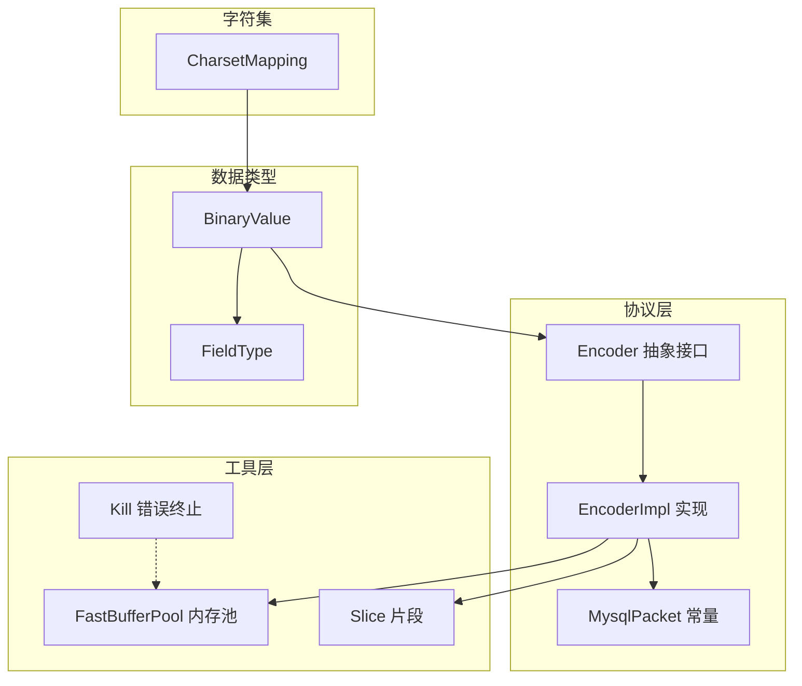
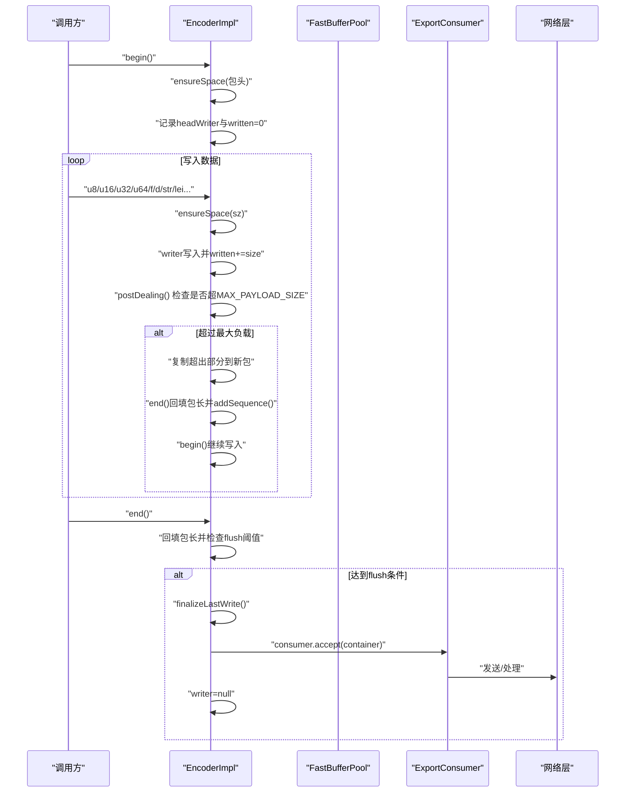
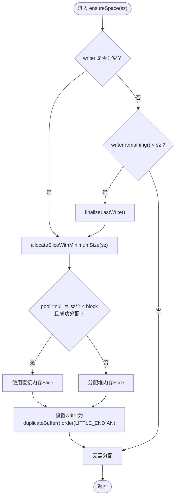
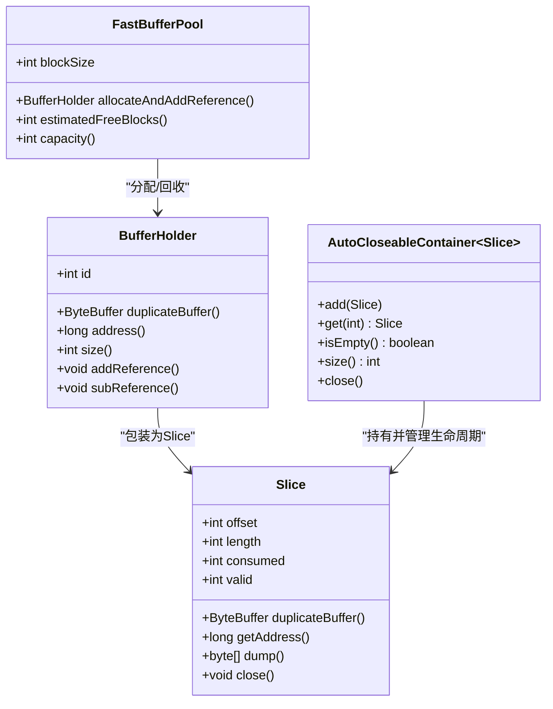
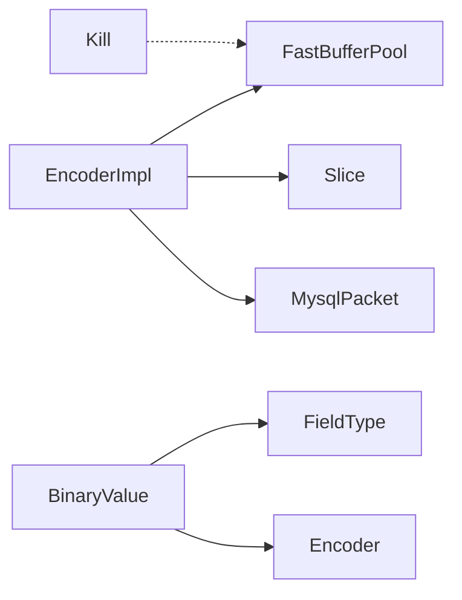

# 编码器实现

<cite>
**本文引用的文件列表**
- [Encoder.java](file://proxy-core/src/main/java/com/alibaba/polardbx/proxy/protocol/encoder/Encoder.java)
- [EncoderImpl.java](file://proxy-core/src/main/java/com/alibaba/polardbx/proxy/protocol/encoder/EncoderImpl.java)
- [FastBufferPool.java](file://proxy-common/src/main/java/com/alibaba/polardbx/proxy/utils/FastBufferPool.java)
- [Slice.java](file://proxy-common/src/main/java/com/alibaba/polardbx/proxy/utils/Slice.java)
- [MysqlPacket.java](file://proxy-core/src/main/java/com/alibaba/polardbx/proxy/protocol/common/MysqlPacket.java)
- [BinaryValue.java](file://proxy-core/src/main/java/com/alibaba/polardbx/proxy/protocol/command/BinaryValue.java)
- [FieldType.java](file://proxy-core/src/main/java/com/alibaba/polardbx/proxy/protocol/command/FieldType.java)
- [Kill.java](file://proxy-common/src/main/java/com/alibaba/polardbx/proxy/utils/Kill.java)
- [CharsetMapping.java](file://proxy-core/src/main/java/com/alibaba/polardbx/proxy/utils/CharsetMapping.java)
</cite>

## 目录
1. [简介](#简介)
2. [项目结构](#项目结构)
3. [核心组件](#核心组件)
4. [架构总览](#架构总览)
5. [详细组件分析](#详细组件分析)
6. [依赖关系分析](#依赖关系分析)
7. [性能考量](#性能考量)
8. [故障排查指南](#故障排查指南)
9. [结论](#结论)
10. [附录](#附录)

## 简介
本文件面向 PolarDB-X Proxy 的编码器实现，系统性阐述 Encoder 接口的设计原则与编码流程规范；深入解析 EncoderImpl 的实现机制，包括缓冲区管理、数据类型编码、字符集转换；总结编码过程中的性能优化策略（批量编码、内存复用、零拷贝思路）；给出各类数据类型的编码示例与最佳实践；并说明扩展方法（自定义数据类型、协议版本兼容）以及错误处理、边界检查与内存泄漏防护。

## 项目结构
围绕编码器的关键模块分布如下：
- 协议层：Encoder 抽象接口与 EncoderImpl 具体实现
- 工具层：FastBufferPool 内存池、Slice 片段封装、Kill 错误终止工具
- 协议常量：MysqlPacket 定义包头大小、最大负载等
- 数据类型：BinaryValue、FieldType 提供 MySQL 常见数据类型的编码逻辑
- 字符集映射：CharsetMapping 提供字符集与排序规则信息

图表来源
- [Encoder.java](file://proxy-core/src/main/java/com/alibaba/polardbx/proxy/protocol/encoder/Encoder.java#L34-L167)
- [EncoderImpl.java](file://proxy-core/src/main/java/com/alibaba/polardbx/proxy/protocol/encoder/EncoderImpl.java#L31-L302)
- [FastBufferPool.java](file://proxy-common/src/main/java/com/alibaba/polardbx/proxy/utils/FastBufferPool.java#L27-L186)
- [Slice.java](file://proxy-common/src/main/java/com/alibaba/polardbx/proxy/utils/Slice.java#L36-L219)
- [MysqlPacket.java](file://proxy-core/src/main/java/com/alibaba/polardbx/proxy/protocol/common/MysqlPacket.java#L26-L42)
- [BinaryValue.java](file://proxy-core/src/main/java/com/alibaba/polardbx/proxy/protocol/command/BinaryValue.java#L32-L502)
- [FieldType.java](file://proxy-core/src/main/java/com/alibaba/polardbx/proxy/protocol/command/FieldType.java#L21-L57)
- [Kill.java](file://proxy-common/src/main/java/com/alibaba/polardbx/proxy/utils/Kill.java#L27-L69)
- [CharsetMapping.java](file://proxy-core/src/main/java/com/alibaba/polardbx/proxy/utils/CharsetMapping.java#L523-L732)

章节来源
- [Encoder.java](file://proxy-core/src/main/java/com/alibaba/polardbx/proxy/protocol/encoder/Encoder.java#L34-L167)
- [EncoderImpl.java](file://proxy-core/src/main/java/com/alibaba/polardbx/proxy/protocol/encoder/EncoderImpl.java#L31-L302)
- [FastBufferPool.java](file://proxy-common/src/main/java/com/alibaba/polardbx/proxy/utils/FastBufferPool.java#L27-L186)
- [Slice.java](file://proxy-common/src/main/java/com/alibaba/polardbx/proxy/utils/Slice.java#L36-L219)
- [MysqlPacket.java](file://proxy-core/src/main/java/com/alibaba/polardbx/proxy/protocol/common/MysqlPacket.java#L26-L42)
- [BinaryValue.java](file://proxy-core/src/main/java/com/alibaba/polardbx/proxy/protocol/command/BinaryValue.java#L32-L502)
- [FieldType.java](file://proxy-core/src/main/java/com/alibaba/polardbx/proxy/protocol/command/FieldType.java#L21-L57)
- [Kill.java](file://proxy-common/src/main/java/com/alibaba/polardbx/proxy/utils/Kill.java#L27-L69)
- [CharsetMapping.java](file://proxy-core/src/main/java/com/alibaba/polardbx/proxy/utils/CharsetMapping.java#L523-L732)

## 核心组件
- Encoder 抽象接口：定义序列号管理、起止标记、基础无符号整型、浮点数、长度前缀字符串、空字符串、包导出等统一抽象，提供 UTF-8 字符串编码与 LE 长度编码等便捷方法。
- EncoderImpl 具体实现：基于 FastBufferPool 的直接内存池进行缓冲区分配与回收，维护 AutoCloseableContainer<Slice> 的容器，按需分片写入，自动处理 MySQL 包头与分片发送。
- 工具与常量：FastBufferPool 提供高性能直接内存块分配；Slice 封装 ByteBuffer 片段与引用计数；MysqlPacket 定义包头尺寸与最大负载；BinaryValue/FieldType 提供 MySQL 数据类型编码；CharsetMapping 提供字符集映射。

章节来源
- [Encoder.java](file://proxy-core/src/main/java/com/alibaba/polardbx/proxy/protocol/encoder/Encoder.java#L34-L167)
- [EncoderImpl.java](file://proxy-core/src/main/java/com/alibaba/polardbx/proxy/protocol/encoder/EncoderImpl.java#L31-L302)
- [FastBufferPool.java](file://proxy-common/src/main/java/com/alibaba/polardbx/proxy/utils/FastBufferPool.java#L27-L186)
- [Slice.java](file://proxy-common/src/main/java/com/alibaba/polardbx/proxy/utils/Slice.java#L36-L219)
- [MysqlPacket.java](file://proxy-core/src/main/java/com/alibaba/polardbx/proxy/protocol/common/MysqlPacket.java#L26-L42)
- [BinaryValue.java](file://proxy-core/src/main/java/com/alibaba/polardbx/proxy/protocol/command/BinaryValue.java#L32-L502)
- [FieldType.java](file://proxy-core/src/main/java/com/alibaba/polardbx/proxy/protocol/command/FieldType.java#L21-L57)

## 架构总览
编码器整体工作流：
- 调用方通过 Encoder.create(...) 获取具体实现，传入内存池与导出消费者。
- begin() 初始化包头位置与序列号；随后按需写入 u8/u16/u32/u64/f/d/str/lei 等。
- end() 回填包长并触发 flush；当容器中 Slice 数量或剩余空间达到阈值时主动 flush。
- flush() 将当前容器交给 ExportConsumer，完成网络发送或进一步处理。
- 大包自动分片：当已写入字节数超过最大负载时，复制超出部分到新包继续写入。

图表来源
- [EncoderImpl.java](file://proxy-core/src/main/java/com/alibaba/polardbx/proxy/protocol/encoder/EncoderImpl.java#L102-L132)
- [EncoderImpl.java](file://proxy-core/src/main/java/com/alibaba/polardbx/proxy/protocol/encoder/EncoderImpl.java#L134-L156)
- [EncoderImpl.java](file://proxy-core/src/main/java/com/alibaba/polardbx/proxy/protocol/encoder/EncoderImpl.java#L285-L295)
- [MysqlPacket.java](file://proxy-core/src/main/java/com/alibaba/polardbx/proxy/protocol/common/MysqlPacket.java#L31-L35)

## 详细组件分析

### Encoder 抽象接口设计原则
- 序列号管理：提供 resetSequence/addSequence，确保多包发送时序号递增。
- 包构建规范：begin/end 成对使用，begin 记录 headWriter 并跳过包长字段，end 回填包长并触发 flush 判定。
- 基础类型编码：u8/u16/u24/u32/u48/u64/f/d 提供固定宽度二进制编码。
- 变长编码：lei 支持 MySQL 长度编码（0-250/0xFC/0xFD/0xFE 对应 1/3/4/9 字节）。
- 字符串编码：str/le_str/nt_str 提供字节串、长度前缀串、空终止串三种模式；默认 UTF-8 编码字符串。
- 导出与关闭：flush 将容器交给 ExportConsumer；close 关闭容器释放资源；create 工厂方法返回 EncoderImpl。

章节来源
- [Encoder.java](file://proxy-core/src/main/java/com/alibaba/polardbx/proxy/protocol/encoder/Encoder.java#L34-L167)

### EncoderImpl 实现机制
- 缓冲区管理
  - allocateSliceWithMinimumSize：优先尝试从 FastBufferPool 分配直接内存块；若所需空间过大或无法分配，则退化为堆内存分配。
  - ensureSpace：在 writer 为空或剩余不足时，先 finalizeLastWrite，再重新分配新 Slice。
  - finalizeLastWrite：根据 writer 剩余空间更新 Slice 的 valid 长度。
- 包头与分片
  - begin：预留包头空间，写入序列号；记录 headWriter 以便 end 回填包长。
  - end：回填包长；根据容器数量与剩余空间阈值触发 flush。
  - postDealing：当 written ≥ MAX_PAYLOAD_SIZE 时，复制超出部分到新包继续写入，实现 MySQL 包分片。
- 数据类型编码
  - 整型与浮点：按小端顺序写入固定宽度字节。
  - 变长整型 lei：根据范围选择 1/3/4/9 字节编码。
  - 字符串：str 直接写入字节；le_str 先写长度再写内容；nt_str 写入内容后追加空字节。
- 导出与关闭
  - flush：将容器交给 ExportConsumer，并重置 writer。
  - close：关闭容器，释放所有 Slice 引用。

图表来源
- [EncoderImpl.java](file://proxy-core/src/main/java/com/alibaba/polardbx/proxy/protocol/encoder/EncoderImpl.java#L89-L97)
- [EncoderImpl.java](file://proxy-core/src/main/java/com/alibaba/polardbx/proxy/protocol/encoder/EncoderImpl.java#L64-L75)

章节来源
- [EncoderImpl.java](file://proxy-core/src/main/java/com/alibaba/polardbx/proxy/protocol/encoder/EncoderImpl.java#L31-L302)

### 缓冲区管理与内存复用
- FastBufferPool：提供固定大小的直接内存块池，采用 CAS 栈管理空闲块与引用计数，避免 GC 压力。
- Slice：封装 ByteBuffer 片段，支持 direct 与 heap 两种来源；维护 consumed/valid 两个游标，便于消费与合并；提供 dump/getAddress 等能力。
- AutoCloseableContainer：自动关闭容器内的 Slice，防止泄漏；配合 EncoderImpl 在 flush/close 时释放资源。

图表来源
- [FastBufferPool.java](file://proxy-common/src/main/java/com/alibaba/polardbx/proxy/utils/FastBufferPool.java#L27-L186)
- [Slice.java](file://proxy-common/src/main/java/com/alibaba/polardbx/proxy/utils/Slice.java#L36-L219)
- [EncoderImpl.java](file://proxy-core/src/main/java/com/alibaba/polardbx/proxy/protocol/encoder/EncoderImpl.java#L35-L40)

章节来源
- [FastBufferPool.java](file://proxy-common/src/main/java/com/alibaba/polardbx/proxy/utils/FastBufferPool.java#L27-L186)
- [Slice.java](file://proxy-common/src/main/java/com/alibaba/polardbx/proxy/utils/Slice.java#L36-L219)
- [EncoderImpl.java](file://proxy-core/src/main/java/com/alibaba/polardbx/proxy/protocol/encoder/EncoderImpl.java#L35-L40)

### 数据类型编码与字符集转换
- 基本数据类型
  - 整型：u8/u16/u24/u32/u48/u64，按小端顺序写入。
  - 浮点：f/d，按 IEEE 754 写入。
  - 变长：lei，根据范围写入 1/3/4/9 字节。
- 字符串与字节
  - str：直接写入字节数组。
  - le_str：先写长度（LE 长度编码），再写内容。
  - nt_str：写入内容后追加空字节。
  - 默认字符串编码：UTF-8。
- MySQL 数据类型
  - BinaryValue/FieldType：覆盖 MySQL 常见类型（数值、日期时间、字符串、Blob、JSON 等），按类型选择对应编码路径。
- 字符集映射
  - CharsetMapping：提供字符集名称、排序规则索引、多字节特性等，用于判断是否需要额外处理（如多字节字符长度）。

章节来源
- [Encoder.java](file://proxy-core/src/main/java/com/alibaba/polardbx/proxy/protocol/encoder/Encoder.java#L82-L116)
- [EncoderImpl.java](file://proxy-core/src/main/java/com/alibaba/polardbx/proxy/protocol/encoder/EncoderImpl.java#L184-L283)
- [BinaryValue.java](file://proxy-core/src/main/java/com/alibaba/polardbx/proxy/protocol/command/BinaryValue.java#L198-L315)
- [FieldType.java](file://proxy-core/src/main/java/com/alibaba/polardbx/proxy/protocol/command/FieldType.java#L21-L57)
- [CharsetMapping.java](file://proxy-core/src/main/java/com/alibaba/polardbx/proxy/utils/CharsetMapping.java#L700-L732)

### 性能优化策略
- 批量编码与内存复用
  - 使用 FastBufferPool 进行直接内存块复用，减少频繁分配与 GC 压力。
  - ensureSpace 仅在必要时分配新 Slice，避免碎片化。
- 零拷贝思路
  - Slice 支持 getAddress 获取物理地址（direct 或 unsafe 地址），便于与零拷贝场景对接（例如 JNI/Unsafe）。
  - dump 会复制到堆数组，适用于需要稳定字节数组的场景；在高吞吐下优先使用直接内存与 Slice 容器。
- 分片与阈值控制
  - 当容器数量或剩余空间低于阈值时触发 flush，平衡延迟与内存占用。
  - 大包自动分片，避免单包超过最大负载。

章节来源
- [EncoderImpl.java](file://proxy-core/src/main/java/com/alibaba/polardbx/proxy/protocol/encoder/EncoderImpl.java#L125-L131)
- [EncoderImpl.java](file://proxy-core/src/main/java/com/alibaba/polardbx/proxy/protocol/encoder/EncoderImpl.java#L134-L156)
- [Slice.java](file://proxy-common/src/main/java/com/alibaba/polardbx/proxy/utils/Slice.java#L149-L173)
- [FastBufferPool.java](file://proxy-common/src/main/java/com/alibaba/polardbx/proxy/utils/FastBufferPool.java#L130-L148)

### 编码流程示例（步骤级）
- 基本整型编码
  - 步骤：调用 ensureSpace(4)，writer.putInt(v)，written+=4，postDealing。
- 变长整型 lei
  - 步骤：根据 v 范围写入 1/3/4/9 字节，更新 written。
- 字符串编码
  - 步骤：le_str：先写 lei(len)，再写 str(buf)；nt_str：写 str(buf) 后追加 0。
- 大包分片
  - 步骤：written≥MAX_PAYLOAD_SIZE 时，复制超出部分到新 Slice，end() 回填包长，addSequence()，begin() 继续写入。

章节来源
- [EncoderImpl.java](file://proxy-core/src/main/java/com/alibaba/polardbx/proxy/protocol/encoder/EncoderImpl.java#L184-L283)
- [MysqlPacket.java](file://proxy-core/src/main/java/com/alibaba/polardbx/proxy/protocol/common/MysqlPacket.java#L31-L35)

### 扩展方法与协议版本兼容
- 自定义数据类型
  - 在 BinaryValue 中新增类型分支，实现 encodeValue/decodeValue 的读写逻辑；在 FieldType 中补充类型常量。
- 协议版本兼容
  - 通过 Encoder.encode/Decoder.decode 的 capabilities 参数区分不同协议版本的字段与行为；在握手/响应包中根据能力位调整字段长度与格式。
- 字符集与排序规则
  - 使用 CharsetMapping 提供的 collation 与字符集信息，确保字符串编码符合目标字符集要求。

章节来源
- [BinaryValue.java](file://proxy-core/src/main/java/com/alibaba/polardbx/proxy/protocol/command/BinaryValue.java#L198-L315)
- [FieldType.java](file://proxy-core/src/main/java/com/alibaba/polardbx/proxy/protocol/command/FieldType.java#L21-L57)
- [CharsetMapping.java](file://proxy-core/src/main/java/com/alibaba/polardbx/proxy/utils/CharsetMapping.java#L700-L732)

## 依赖关系分析
- EncoderImpl 依赖 FastBufferPool 与 Slice 进行内存管理；依赖 MysqlPacket 常量进行包头与分片控制。
- BinaryValue/FieldType 依赖 Encoder 接口进行 MySQL 类型编码。
- Kill 作为致命错误终止工具，用于保护内存池引用计数一致性。

图表来源
- [EncoderImpl.java](file://proxy-core/src/main/java/com/alibaba/polardbx/proxy/protocol/encoder/EncoderImpl.java#L31-L302)
- [FastBufferPool.java](file://proxy-common/src/main/java/com/alibaba/polardbx/proxy/utils/FastBufferPool.java#L27-L186)
- [Slice.java](file://proxy-common/src/main/java/com/alibaba/polardbx/proxy/utils/Slice.java#L36-L219)
- [MysqlPacket.java](file://proxy-core/src/main/java/com/alibaba/polardbx/proxy/protocol/common/MysqlPacket.java#L26-L42)
- [BinaryValue.java](file://proxy-core/src/main/java/com/alibaba/polardbx/proxy/protocol/command/BinaryValue.java#L32-L502)
- [FieldType.java](file://proxy-core/src/main/java/com/alibaba/polardbx/proxy/protocol/command/FieldType.java#L21-L57)
- [Kill.java](file://proxy-common/src/main/java/com/alibaba/polardbx/proxy/utils/Kill.java#L27-L69)

章节来源
- [EncoderImpl.java](file://proxy-core/src/main/java/com/alibaba/polardbx/proxy/protocol/encoder/EncoderImpl.java#L31-L302)
- [FastBufferPool.java](file://proxy-common/src/main/java/com/alibaba/polardbx/proxy/utils/FastBufferPool.java#L27-L186)
- [Slice.java](file://proxy-common/src/main/java/com/alibaba/polardbx/proxy/utils/Slice.java#L36-L219)
- [MysqlPacket.java](file://proxy-core/src/main/java/com/alibaba/polardbx/proxy/protocol/common/MysqlPacket.java#L26-L42)
- [BinaryValue.java](file://proxy-core/src/main/java/com/alibaba/polardbx/proxy/protocol/command/BinaryValue.java#L32-L502)
- [FieldType.java](file://proxy-core/src/main/java/com/alibaba/polardbx/proxy/protocol/command/FieldType.java#L21-L57)
- [Kill.java](file://proxy-common/src/main/java/com/alibaba/polardbx/proxy/utils/Kill.java#L27-L69)

## 性能考量
- 直接内存优先：尽量使用 FastBufferPool 分配直接内存块，降低 GC 压力与拷贝成本。
- 批量写入：在一次 begin/end 之间尽可能批量写入，减少多次 flush。
- 零拷贝潜力：利用 Slice.getAddress 获取物理地址，结合底层网络栈实现零拷贝发送。
- 分片阈值：合理设置 FLUSH_THRESH_0/1 与 DEFAULT_RESERVE_BUFFER_SIZE，平衡延迟与内存占用。
- 字符串编码：优先使用 UTF-8 编码，避免不必要的字符集转换；对于大文本可考虑分片传输。

[本节为通用性能建议，不直接分析具体文件]

## 故障排查指南
- 常见异常与定位
  - Duplicate begin：未调用 end 或重复 begin，导致 headWriter 已存在。
  - Missing begin：end 之前未调用 begin。
  - Reference 不一致：BufferHolder 引用计数异常，触发致命错误。
- 边界检查
  - ensureSpace 会在空间不足时抛出异常；postDealing 会在包体超过最大负载时触发分片。
- 内存泄漏防护
  - EncoderImpl.flush/close 会关闭容器与 Slice；AutoCloseableContainer 在作用域结束时自动释放。
  - FastBufferPool 通过引用计数与 CAS 栈保证内存回收正确性。

章节来源
- [EncoderImpl.java](file://proxy-core/src/main/java/com/alibaba/polardbx/proxy/protocol/encoder/EncoderImpl.java#L102-L132)
- [FastBufferPool.java](file://proxy-common/src/main/java/com/alibaba/polardbx/proxy/utils/FastBufferPool.java#L36-L49)
- [Kill.java](file://proxy-common/src/main/java/com/alibaba/polardbx/proxy/utils/Kill.java#L64-L67)

## 结论
PolarDB-X Proxy 的编码器通过 Encoder 抽象接口统一了编码流程，EncoderImpl 基于 FastBufferPool 与 Slice 实现高性能、低拷贝的缓冲区管理，并内置 MySQL 包头与分片逻辑。配合 BinaryValue/FieldType 与 CharsetMapping，能够覆盖常见 MySQL 数据类型的编码需求。通过合理的内存复用、批量写入与分片策略，可在高并发场景下获得优异的吞吐表现；同时完善的错误处理与边界检查保障了系统的稳定性。

[本节为总结性内容，不直接分析具体文件]

## 附录
- 快速参考
  - begin/end：构建 MySQL 包的标准流程
  - u8/u16/u32/u64/f/d：固定宽度二进制编码
  - lei：MySQL 长度编码
  - str/le_str/nt_str：字节串、长度前缀串、空终止串
  - flush/close：导出与资源释放

[本节为概览性内容，不直接分析具体文件]