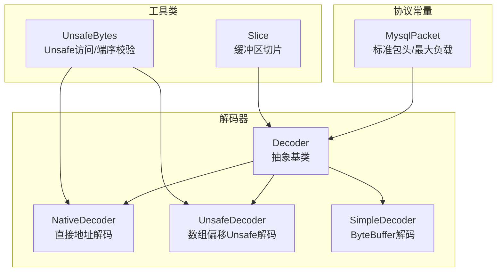
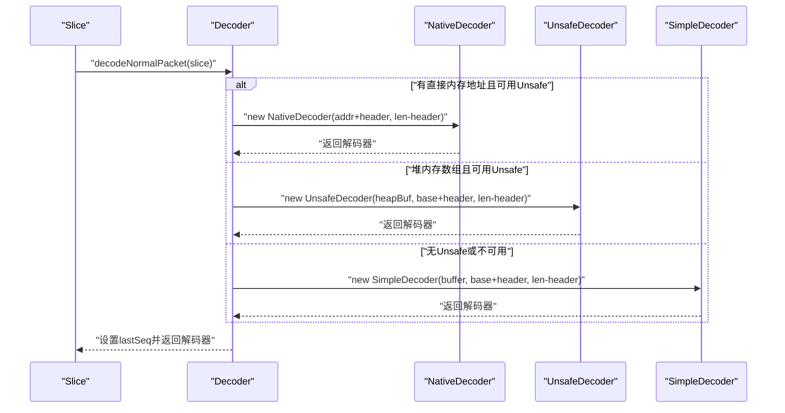
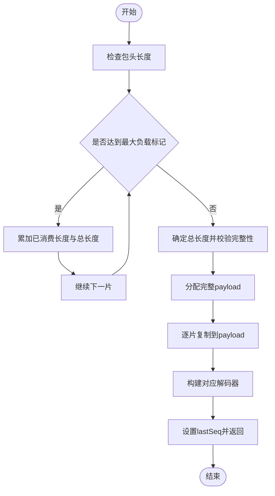
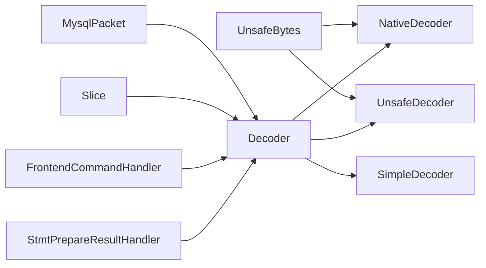

# 解码器实现

<cite>
**本文引用的文件**
- [Decoder.java](file://proxy-core/src/main/java/com/alibaba/polardbx/proxy/protocol/decoder/Decoder.java)
- [NativeDecoder.java](file://proxy-core/src/main/java/com/alibaba/polardbx/proxy/protocol/decoder/NativeDecoder.java)
- [SimpleDecoder.java](file://proxy-core/src/main/java/com/alibaba/polardbx/proxy/protocol/decoder/SimpleDecoder.java)
- [UnsafeDecoder.java](file://proxy-core/src/main/java/com/alibaba/polardbx/proxy/protocol/decoder/UnsafeDecoder.java)
- [UnsafeBytes.java](file://proxy-common/src/main/java/com/alibaba/polardbx/proxy/utils/UnsafeBytes.java)
- [Slice.java](file://proxy-common/src/main/java/com/alibaba/polardbx/proxy/utils/Slice.java)
- [MysqlPacket.java](file://proxy-core/src/main/java/com/alibaba/polardbx/proxy/protocol/common/MysqlPacket.java)
- [FrontendCommandHandler.java](file://proxy-core/src/main/java/com/alibaba/polardbx/proxy/protocol/handler/FrontendCommandHandler.java)
- [StmtPrepareResultHandler.java](file://proxy-core/src/main/java/com/alibaba/polardbx/proxy/protocol/handler/result/StmtPrepareResultHandler.java)
</cite>

## 目录
1. [简介](#简介)
2. [项目结构](#项目结构)
3. [核心组件](#核心组件)
4. [架构总览](#架构总览)
5. [详细组件分析](#详细组件分析)
6. [依赖关系分析](#依赖关系分析)
7. [性能考量](#性能考量)
8. [故障排查指南](#故障排查指南)
9. [结论](#结论)
10. [附录](#附录)

## 简介
本文件系统性梳理 PolarDB-X Proxy 的解码器实现，围绕 Decoder 接口设计与统一解码流程展开，深入对比 NativeDecoder、UnsafeDecoder 与 SimpleDecoder 的实现差异（内存管理模式、性能特征、适用场景），并给出字节流解析算法（整数、字符串、浮点数、长度编码）的说明与选择指南。同时总结异常处理与内存安全保护机制，帮助开发者在不同运行环境下做出最优选型。

## 项目结构
解码器位于协议层的 decoder 包中，配合通用工具类与 MySQL 协议常量，形成完整的网络包解码链路：
- 协议常量：MysqlPacket 定义了标准包头大小、最大负载等常量
- 工具类：Slice 提供对缓冲区的切片访问；UnsafeBytes 封装 Unsafe 访问与端序校验
- 解码器：Decoder 抽象基类 + 三种实现 Native/Unsafe/Simple

图表来源
- [Decoder.java](file://proxy-core/src/main/java/com/alibaba/polardbx/proxy/protocol/decoder/Decoder.java#L29-L371)
- [MysqlPacket.java](file://proxy-core/src/main/java/com/alibaba/polardbx/proxy/protocol/common/MysqlPacket.java#L26-L42)
- [Slice.java](file://proxy-common/src/main/java/com/alibaba/polardbx/proxy/utils/Slice.java#L36-L219)
- [UnsafeBytes.java](file://proxy-common/src/main/java/com/alibaba/polardbx/proxy/utils/UnsafeBytes.java#L30-L92)

章节来源
- [Decoder.java](file://proxy-core/src/main/java/com/alibaba/polardbx/proxy/protocol/decoder/Decoder.java#L29-L371)
- [MysqlPacket.java](file://proxy-core/src/main/java/com/alibaba/polardbx/proxy/protocol/common/MysqlPacket.java#L26-L42)
- [Slice.java](file://proxy-common/src/main/java/com/alibaba/polardbx/proxy/utils/Slice.java#L36-L219)
- [UnsafeBytes.java](file://proxy-common/src/main/java/com/alibaba/polardbx/proxy/utils/UnsafeBytes.java#L30-L92)

## 核心组件
- Decoder 抽象基类：定义统一的解码接口、位置管理、剩余长度、跳过、长度指示（LEI）与字符串解码族方法，并提供从 Slice 构建解码器的工厂方法，自动选择最优实现。
- NativeDecoder：基于物理地址的解码，适合直接内存或可获取地址的场景，性能最高但受限于 Unsafe 可用性。
- UnsafeDecoder：基于字节数组与 Unsafe 偏移的解码，兼容堆内存，性能高但需要 Unsafe 支持。
- SimpleDecoder：基于 ByteBuffer 的纯 JDK 解码，兼容性最好，性能中等，适用于无法使用 Unsafe 或直接内存的环境。

章节来源
- [Decoder.java](file://proxy-core/src/main/java/com/alibaba/polardbx/proxy/protocol/decoder/Decoder.java#L29-L371)
- [NativeDecoder.java](file://proxy-core/src/main/java/com/alibaba/polardbx/proxy/protocol/decoder/NativeDecoder.java#L23-L279)
- [UnsafeDecoder.java](file://proxy-core/src/main/java/com/alibaba/polardbx/proxy/protocol/decoder/UnsafeDecoder.java#L23-L287)
- [SimpleDecoder.java](file://proxy-core/src/main/java/com/alibaba/polardbx/proxy/protocol/decoder/SimpleDecoder.java#L24-L275)

## 架构总览
解码器的统一入口是 Decoder.decodeNormalPacket(Slice)，它会根据 Slice 的来源（直接内存地址、堆内存数组、或普通 ByteBuffer）以及是否启用 Unsafe，自动选择 NativeDecoder、UnsafeDecoder 或 SimpleDecoder。对于分片大包，会先合并为完整负载，再交由对应解码器处理。

图表来源
- [Decoder.java](file://proxy-core/src/main/java/com/alibaba/polardbx/proxy/protocol/decoder/Decoder.java#L326-L371)
- [Slice.java](file://proxy-common/src/main/java/com/alibaba/polardbx/proxy/utils/Slice.java#L149-L163)
- [UnsafeBytes.java](file://proxy-common/src/main/java/com/alibaba/polardbx/proxy/utils/UnsafeBytes.java#L33-L70)

章节来源
- [Decoder.java](file://proxy-core/src/main/java/com/alibaba/polardbx/proxy/protocol/decoder/Decoder.java#L326-L371)
- [Slice.java](file://proxy-common/src/main/java/com/alibaba/polardbx/proxy/utils/Slice.java#L149-L163)
- [UnsafeBytes.java](file://proxy-common/src/main/java/com/alibaba/polardbx/proxy/utils/UnsafeBytes.java#L33-L70)

## 详细组件分析

### Decoder 抽象基类
- 责任边界：统一解码接口、位置与剩余长度管理、序列号记录、长度指示（LEI）与字符串解码族。
- 关键能力：
  - 位置与边界：pos、remaining、skip、skip_s
  - 数值解码：u8/u16/u24/u32/u48/i64、f/d 与带_s 的安全版本
  - LEI（长度指示）：lei/lei_s，支持 0-0xFC、0xFD、0xFE 三种变长编码
  - 字符串解码：str/str_s 与固定长度 str(int)/str_s(int)、拷贝到输出数组
  - 大包拆分与重组：decodeNormalPacketLarge 三套重载，分别针对直接内存、堆数组、ByteBuffer
  - 统一入口：decodeNormalPacket(Slice) 自动选择最优解码器

章节来源
- [Decoder.java](file://proxy-core/src/main/java/com/alibaba/polardbx/proxy/protocol/decoder/Decoder.java#L29-L371)

### NativeDecoder（原生地址解码）
- 内存模式：直接使用物理地址进行读取，避免额外拷贝
- 性能特征：最高性能，适合直接内存或可获取地址的场景
- 适用场景：高性能网络栈、直接内存池、Unsafe 可用
- 异常与安全：断言用于边界检查，失败时抛出非法状态异常；提供 _s 版本进行显式边界检查

章节来源
- [NativeDecoder.java](file://proxy-core/src/main/java/com/alibaba/polardbx/proxy/protocol/decoder/NativeDecoder.java#L23-L279)

### UnsafeDecoder（数组偏移 Unsafe 解码）
- 内存模式：基于字节数组与 Unsafe 偏移访问，兼容堆内存
- 性能特征：性能高，但需要 Unsafe 可用；否则构造时抛出运行时异常
- 适用场景：堆内存缓冲区、JDK 1.8+ 默认可用 Unsafe 的环境
- 异常与安全：构造阶段校验 UNSAFE 是否可用；断言与 _s 检查共同保证安全性

章节来源
- [UnsafeDecoder.java](file://proxy-core/src/main/java/com/alibaba/polardbx/proxy/protocol/decoder/UnsafeDecoder.java#L23-L287)
- [UnsafeBytes.java](file://proxy-common/src/main/java/com/alibaba/polardbx/proxy/utils/UnsafeBytes.java#L33-L70)

### SimpleDecoder（ByteBuffer 解码）
- 内存模式：基于 ByteBuffer 的 JDK 原生访问，不依赖 Unsafe
- 性能特征：性能中等，兼容性最佳，适合通用环境
- 适用场景：无法使用 Unsafe、直接内存受限、或需要跨平台兼容
- 异常与安全：断言与 _s 检查共同保证安全性；内部使用小端序

章节来源
- [SimpleDecoder.java](file://proxy-core/src/main/java/com/alibaba/polardbx/proxy/protocol/decoder/SimpleDecoder.java#L24-L275)

### 字节流解析算法

#### 整数解码
- 无符号 8/16/24/32/48 位与有符号 64 位整数，按小端序读取
- 24 位采用两段拼接：低 16 位 + 高 8 位左移 16 位
- 48 位采用四字节 + 短整型拼接：低 32 位 + 高 16 位左移 32 位
- 断言与 _s 检查确保剩余长度足够

章节来源
- [NativeDecoder.java](file://proxy-core/src/main/java/com/alibaba/polardbx/proxy/protocol/decoder/NativeDecoder.java#L45-L151)
- [UnsafeDecoder.java](file://proxy-core/src/main/java/com/alibaba/polardbx/proxy/protocol/decoder/UnsafeDecoder.java#L48-L154)
- [SimpleDecoder.java](file://proxy-core/src/main/java/com/alibaba/polardbx/proxy/protocol/decoder/SimpleDecoder.java#L46-L148)

#### 浮点数解码
- 单精度 float 与双精度 double，按小端序读取
- 断言与 _s 检查确保剩余长度足够

章节来源
- [NativeDecoder.java](file://proxy-core/src/main/java/com/alibaba/polardbx/proxy/protocol/decoder/NativeDecoder.java#L153-L187)
- [UnsafeDecoder.java](file://proxy-core/src/main/java/com/alibaba/polardbx/proxy/protocol/decoder/UnsafeDecoder.java#L155-L189)
- [SimpleDecoder.java](file://proxy-core/src/main/java/com/alibaba/polardbx/proxy/protocol/decoder/SimpleDecoder.java#L149-L183)

#### 字符串解码
- 变长字符串：探测遇到空字节终止，返回不含终止符的字节数组
- 固定长度字符串：直接读取指定长度，断言与 _s 检查确保剩余长度与输出容量足够
- 拷贝到输出数组：支持 str(int, byte[], int) 与 str_s(int, byte[], int)

章节来源
- [NativeDecoder.java](file://proxy-core/src/main/java/com/alibaba/polardbx/proxy/protocol/decoder/NativeDecoder.java#L189-L277)
- [UnsafeDecoder.java](file://proxy-core/src/main/java/com/alibaba/polardbx/proxy/protocol/decoder/UnsafeDecoder.java#L192-L285)
- [SimpleDecoder.java](file://proxy-core/src/main/java/com/alibaba/polardbx/proxy/protocol/decoder/SimpleDecoder.java#L186-L273)

#### 长度指示（LEI）解码
- 支持 0-0xFC、0xFD（1 字节）、0xFE（3 字节）、0xFF（8 字节）四种编码
- lei/lei_s 分别提供断言与显式检查两种版本
- 用于变长字段长度前缀，如列定义元数据、字符串长度等

章节来源
- [Decoder.java](file://proxy-core/src/main/java/com/alibaba/polardbx/proxy/protocol/decoder/Decoder.java#L104-L142)

### 大包拆分与重组流程
当检测到最大负载标记（0xFFFFFF）时，表示该包为分片大包，需循环累加直至完整负载，再复制到新分配的 payload 中，最后交由对应解码器处理。

图表来源
- [Decoder.java](file://proxy-core/src/main/java/com/alibaba/polardbx/proxy/protocol/decoder/Decoder.java#L178-L224)
- [Decoder.java](file://proxy-core/src/main/java/com/alibaba/polardbx/proxy/protocol/decoder/Decoder.java#L226-L278)
- [Decoder.java](file://proxy-core/src/main/java/com/alibaba/polardbx/proxy/protocol/decoder/Decoder.java#L280-L324)

章节来源
- [Decoder.java](file://proxy-core/src/main/java/com/alibaba/polardbx/proxy/protocol/decoder/Decoder.java#L178-L324)

## 依赖关系分析
- 解码器依赖 MysqlPacket 的包头常量与最大负载阈值
- Native/Unsafe 解码器依赖 UnsafeBytes 的 UNSAFE 实例与数组基址偏移
- Slice 提供地址、堆数组、ByteBuffer 的统一视图，是解码器选择的关键输入
- 使用方通过 FrontendCommandHandler、StmtPrepareResultHandler 等处理器调用解码器完成协议解析

图表来源
- [MysqlPacket.java](file://proxy-core/src/main/java/com/alibaba/polardbx/proxy/protocol/common/MysqlPacket.java#L26-L42)
- [UnsafeBytes.java](file://proxy-common/src/main/java/com/alibaba/polardbx/proxy/utils/UnsafeBytes.java#L33-L70)
- [Slice.java](file://proxy-common/src/main/java/com/alibaba/polardbx/proxy/utils/Slice.java#L149-L163)
- [Decoder.java](file://proxy-core/src/main/java/com/alibaba/polardbx/proxy/protocol/decoder/Decoder.java#L326-L371)
- [FrontendCommandHandler.java](file://proxy-core/src/main/java/com/alibaba/polardbx/proxy/protocol/handler/FrontendCommandHandler.java#L68-L170)
- [StmtPrepareResultHandler.java](file://proxy-core/src/main/java/com/alibaba/polardbx/proxy/protocol/handler/result/StmtPrepareResultHandler.java#L130-L143)

章节来源
- [MysqlPacket.java](file://proxy-core/src/main/java/com/alibaba/polardbx/proxy/protocol/common/MysqlPacket.java#L26-L42)
- [UnsafeBytes.java](file://proxy-common/src/main/java/com/alibaba/polardbx/proxy/utils/UnsafeBytes.java#L33-L70)
- [Slice.java](file://proxy-common/src/main/java/com/alibaba/polardbx/proxy/utils/Slice.java#L149-L163)
- [Decoder.java](file://proxy-core/src/main/java/com/alibaba/polardbx/proxy/protocol/decoder/Decoder.java#L326-L371)
- [FrontendCommandHandler.java](file://proxy-core/src/main/java/com/alibaba/polardbx/proxy/protocol/handler/FrontendCommandHandler.java#L68-L170)
- [StmtPrepareResultHandler.java](file://proxy-core/src/main/java/com/alibaba/polardbx/proxy/protocol/handler/result/StmtPrepareResultHandler.java#L130-L143)

## 性能考量
- NativeDecoder：最高性能，直接地址访问，零拷贝；受限于可获取物理地址与 Unsafe 可用性
- UnsafeDecoder：高性能，数组偏移 + Unsafe；需要 JVM 允许 Unsafe 访问
- SimpleDecoder：兼容性最佳，性能中等；适合通用环境与跨平台部署
- 大包处理：分片大包会触发一次完整 payload 的分配与复制，带来额外内存与 CPU 开销；应尽量避免不必要的大包传输

章节来源
- [NativeDecoder.java](file://proxy-core/src/main/java/com/alibaba/polardbx/proxy/protocol/decoder/NativeDecoder.java#L23-L279)
- [UnsafeDecoder.java](file://proxy-core/src/main/java/com/alibaba/polardbx/proxy/protocol/decoder/UnsafeDecoder.java#L23-L287)
- [SimpleDecoder.java](file://proxy-core/src/main/java/com/alibaba/polardbx/proxy/protocol/decoder/SimpleDecoder.java#L24-L275)
- [Decoder.java](file://proxy-core/src/main/java/com/alibaba/polardbx/proxy/protocol/decoder/Decoder.java#L178-L324)

## 故障排查指南
- 解码异常类型
  - 非法参数异常：通常发生在 skip/lei/字符串长度不足时
  - 非法状态异常：断言失败，常见于越界访问或未正确初始化
  - 运行时异常：Unsafe 不可用时构造 UnsafeDecoder 失败
- 常见问题定位
  - 检查 Slice 的 consumed/valid/offset/length 是否有效
  - 确认底层缓冲区是否为直接内存或堆内存，以及是否可获取地址
  - 核对包头长度与最大负载标记，确认是否为分片大包
  - 在使用 _s 方法时，关注抛出的异常信息，定位具体越界位置
- 建议
  - 在生产环境优先使用 NativeDecoder/UnsafeDecoder，若不可用则回退至 SimpleDecoder
  - 对于大包，考虑优化上游发送策略，减少分片数量
  - 启用日志与断言，便于快速定位边界错误

章节来源
- [Decoder.java](file://proxy-core/src/main/java/com/alibaba/polardbx/proxy/protocol/decoder/Decoder.java#L49-L66)
- [Decoder.java](file://proxy-core/src/main/java/com/alibaba/polardbx/proxy/protocol/decoder/Decoder.java#L118-L142)
- [UnsafeDecoder.java](file://proxy-core/src/main/java/com/alibaba/polardbx/proxy/protocol/decoder/UnsafeDecoder.java#L28-L32)
- [Slice.java](file://proxy-common/src/main/java/com/alibaba/polardbx/proxy/utils/Slice.java#L57-L78)

## 结论
- Decoder 抽象基类提供了统一的解码接口与工厂方法，自动适配不同内存与 Unsafe 状态
- 三种实现各有侧重：NativeDecoder 追求极致性能、UnsafeDecoder 平衡性能与兼容、SimpleDecoder 最强兼容性
- 字节流解析算法覆盖整数、浮点数、字符串与 LEI，满足 MySQL 协议的典型需求
- 在实际工程中，建议优先启用 Native/Unsafe 解码器，结合 Slice 的地址与数组能力，实现高性能、低开销的网络包解析

## 附录

### 解码器选择指南
- 优先选择
  - 直接内存 + 可获取地址 + Unsafe 可用：NativeDecoder
  - 堆内存 + Unsafe 可用：UnsafeDecoder
- 次优选择
  - 无法使用 Unsafe 或直接内存受限：SimpleDecoder
- 大包场景
  - 尽量避免超大包；若必须接收，注意内存与 CPU 的额外开销

章节来源
- [Decoder.java](file://proxy-core/src/main/java/com/alibaba/polardbx/proxy/protocol/decoder/Decoder.java#L326-L371)
- [Slice.java](file://proxy-common/src/main/java/com/alibaba/polardbx/proxy/utils/Slice.java#L149-L163)
- [UnsafeBytes.java](file://proxy-common/src/main/java/com/alibaba/polardbx/proxy/utils/UnsafeBytes.java#L33-L70)