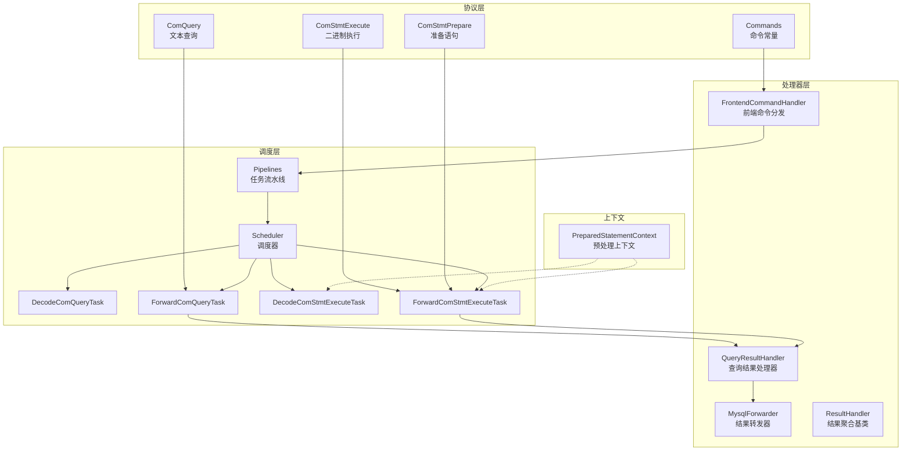
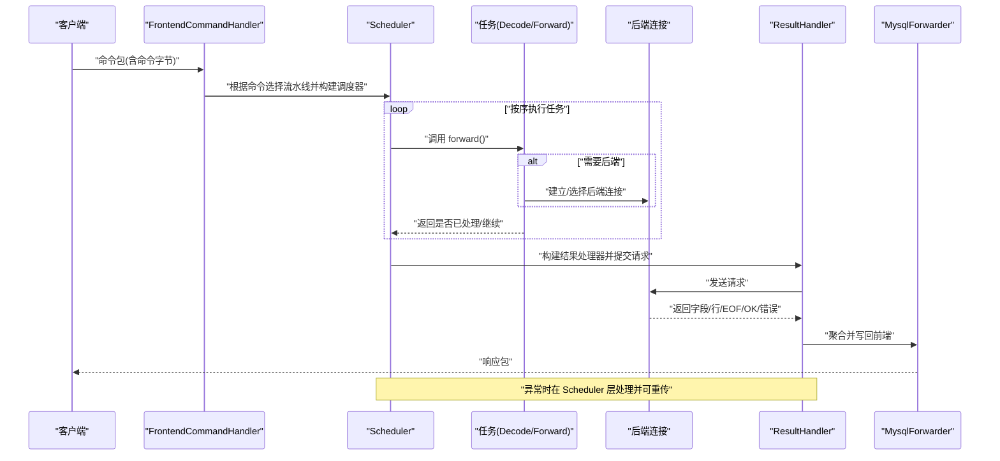
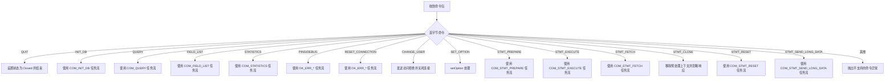
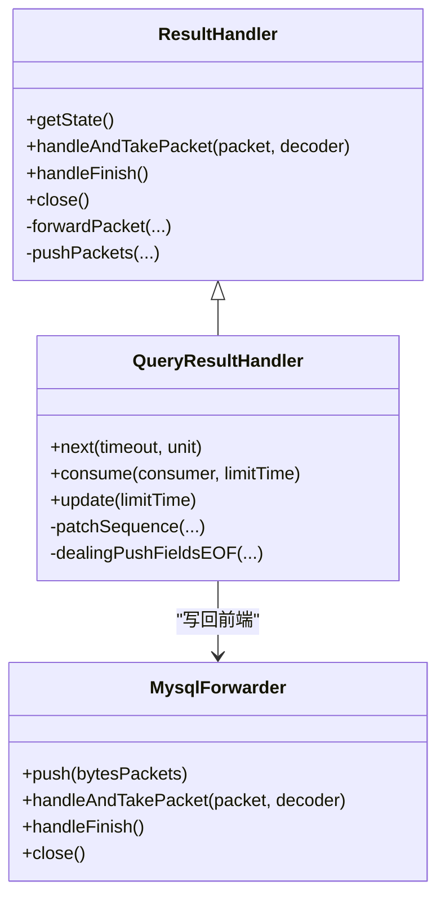
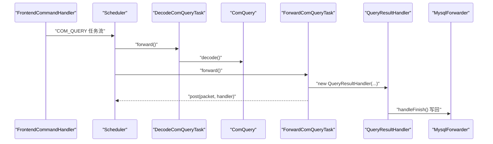
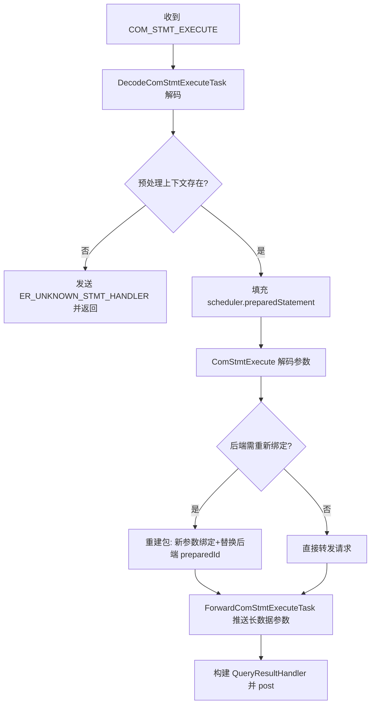
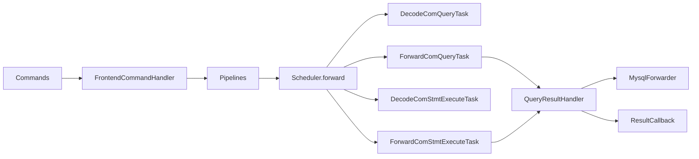

# 命令处理

<cite>
**本文引用的文件**   
- [FrontendCommandHandler.java](file://proxy-core/src/main/java/com/alibaba/polardbx/proxy/protocol/handler/FrontendCommandHandler.java)
- [MysqlForwarder.java](file://proxy-core/src/main/java/com/alibaba/polardbx/proxy/protocol/handler/MysqlForwarder.java)
- [Commands.java](file://proxy-core/src/main/java/com/alibaba/polardbx/proxy/protocol/command/Commands.java)
- [ComQuery.java](file://proxy-core/src/main/java/com/alibaba/polardbx/proxy/protocol/command/ComQuery.java)
- [ComStmtExecute.java](file://proxy-core/src/main/java/com/alibaba/polardbx/proxy/protocol/prepare/ComStmtExecute.java)
- [ComStmtPrepare.java](file://proxy-core/src/main/java/com/alibaba/polardbx/proxy/protocol/prepare/ComStmtPrepare.java)
- [Pipelines.java](file://proxy-core/src/main/java/com/alibaba/polardbx/proxy/scheduler/Pipelines.java)
- [Scheduler.java](file://proxy-core/src/main/java/com/alibaba/polardbx/proxy/scheduler/Scheduler.java)
- [QueryResultHandler.java](file://proxy-core/src/main/java/com/alibaba/polardbx/proxy/protocol/handler/result/QueryResultHandler.java)
- [ResultHandler.java](file://proxy-core/src/main/java/com/alibaba/polardbx/proxy/protocol/handler/result/ResultHandler.java)
- [ResultCallback.java](file://proxy-core/src/main/java/com/alibaba/polardbx/proxy/callback/ResultCallback.java)
- [DecodeComQueryTask.java](file://proxy-core/src/main/java/com/alibaba/polardbx/proxy/scheduler/DecodeComQueryTask.java)
- [ForwardComQueryTask.java](file://proxy-core/src/main/java/com/alibaba/polardbx/proxy/scheduler/ForwardComQueryTask.java)
- [DecodeComStmtExecuteTask.java](file://proxy-core/src/main/java/com/alibaba/polardbx/proxy/scheduler/DecodeComStmtExecuteTask.java)
- [ForwardComStmtExecuteTask.java](file://proxy-core/src/main/java/com/alibaba/polardbx/proxy/scheduler/ForwardComStmtExecuteTask.java)
- [PreparedStatementContext.java](file://proxy-core/src/main/java/com/alibaba/polardbx/proxy/context/help/PreparedStatementContext.java)
</cite>

## 目录
1. [引言](#引言)
2. [项目结构](#项目结构)
3. [核心组件](#核心组件)
4. [架构总览](#架构总览)
5. [详细组件分析](#详细组件分析)
6. [依赖关系分析](#依赖关系分析)
7. [性能考量](#性能考量)
8. [故障排查指南](#故障排查指南)
9. [结论](#结论)
10. [附录](#附录)

## 引言
本文件面向 PolarDB-X Proxy 的命令处理体系，系统性阐述前端命令分发与后端转发的实现架构，重点覆盖以下方面：
- 前端命令处理器的分发机制与请求路由策略
- 命令转发器的工作原理（结果聚合、错误传播）
- 核心命令处理流程：COM_QUERY 的 SQL 解析与路由、COM_STMT_EXECUTE 的预处理语句执行、COM_STMT_PREPARE 的准备语句管理
- 性能优化建议：批量处理、缓存策略、并发控制
- 调试方法与常见问题定位

## 项目结构
围绕命令处理的关键模块分布如下：
- 协议层：命令定义与编解码（Commands、ComQuery、ComStmtExecute、ComStmtPrepare）
- 处理器层：前端命令分发（FrontendCommandHandler）、结果聚合转发（MysqlForwarder、ResultHandler）
- 调度层：流水线编排（Pipelines）与调度器（Scheduler），以及各命令专用任务（Decode*、Forward*）
- 上下文与状态：前端上下文、事务上下文、预处理语句上下文（PreparedStatementContext）

图表来源
- [FrontendCommandHandler.java](file://proxy-core/src/main/java/com/alibaba/polardbx/proxy/protocol/handler/FrontendCommandHandler.java#L78-L170)
- [Pipelines.java](file://proxy-core/src/main/java/com/alibaba/polardbx/proxy/scheduler/Pipelines.java#L21-L128)
- [Scheduler.java](file://proxy-core/src/main/java/com/alibaba/polardbx/proxy/scheduler/Scheduler.java#L300-L313)
- [ComQuery.java](file://proxy-core/src/main/java/com/alibaba/polardbx/proxy/protocol/command/ComQuery.java#L35-L162)
- [ComStmtExecute.java](file://proxy-core/src/main/java/com/alibaba/polardbx/proxy/protocol/prepare/ComStmtExecute.java#L41-L225)
- [ComStmtPrepare.java](file://proxy-core/src/main/java/com/alibaba/polardbx/proxy/protocol/prepare/ComStmtPrepare.java#L28-L56)
- [QueryResultHandler.java](file://proxy-core/src/main/java/com/alibaba/polardbx/proxy/protocol/handler/result/QueryResultHandler.java#L57-L568)
- [MysqlForwarder.java](file://proxy-core/src/main/java/com/alibaba/polardbx/proxy/protocol/handler/MysqlForwarder.java#L34-L97)
- [PreparedStatementContext.java](file://proxy-core/src/main/java/com/alibaba/polardbx/proxy/context/help/PreparedStatementContext.java#L32-L78)

章节来源
- [FrontendCommandHandler.java](file://proxy-core/src/main/java/com/alibaba/polardbx/proxy/protocol/handler/FrontendCommandHandler.java#L39-L171)
- [Pipelines.java](file://proxy-core/src/main/java/com/alibaba/polardbx/proxy/scheduler/Pipelines.java#L21-L128)

## 核心组件
- 命令常量与定义：Commands 提供所有命令字节码常量；ComQuery/ComStmtExecute/ComStmtPrepare 定义了对应命令的数据结构与编解码。
- 前端命令分发：FrontendCommandHandler 根据首字节识别命令，选择对应的流水线任务数组，并交由 Scheduler 执行。
- 调度器与流水线：Scheduler 按顺序执行 ScheduleTask 列表；Pipelines 将不同命令映射到一组有序任务（解码、重传初始化、读写分离决策、后端连接、LSN 同步、变量恢复/收集、转发等）。
- 结果聚合与转发：ResultHandler 抽象出结果状态机与转发逻辑；QueryResultHandler 实现查询结果的字段元数据、行集与 EOF/OK 的聚合；MysqlForwarder 聚合后端返回包并写回前端。

章节来源
- [Commands.java](file://proxy-core/src/main/java/com/alibaba/polardbx/proxy/protocol/command/Commands.java#L21-L118)
- [ComQuery.java](file://proxy-core/src/main/java/com/alibaba/polardbx/proxy/protocol/command/ComQuery.java#L35-L162)
- [ComStmtExecute.java](file://proxy-core/src/main/java/com/alibaba/polardbx/proxy/protocol/prepare/ComStmtExecute.java#L41-L225)
- [ComStmtPrepare.java](file://proxy-core/src/main/java/com/alibaba/polardbx/proxy/protocol/prepare/ComStmtPrepare.java#L28-L56)
- [FrontendCommandHandler.java](file://proxy-core/src/main/java/com/alibaba/polardbx/proxy/protocol/handler/FrontendCommandHandler.java#L78-L170)
- [Pipelines.java](file://proxy-core/src/main/java/com/alibaba/polardbx/proxy/scheduler/Pipelines.java#L21-L128)
- [Scheduler.java](file://proxy-core/src/main/java/com/alibaba/polardbx/proxy/scheduler/Scheduler.java#L46-L315)
- [ResultHandler.java](file://proxy-core/src/main/java/com/alibaba/polardbx/proxy/protocol/handler/result/ResultHandler.java#L38-L210)
- [QueryResultHandler.java](file://proxy-core/src/main/java/com/alibaba/polardbx/proxy/protocol/handler/result/QueryResultHandler.java#L57-L568)
- [MysqlForwarder.java](file://proxy-core/src/main/java/com/alibaba/polardbx/proxy/protocol/handler/MysqlForwarder.java#L34-L97)

## 架构总览
命令从客户端进入，经 FrontendCommandHandler 分发到 Scheduler，按 Pipelines 中的任务顺序执行，最终通过 ResultHandler 聚合并在 MysqlForwarder 中写回前端。错误在 Scheduler 层统一捕获与传播，必要时进行重传。

图表来源
- [FrontendCommandHandler.java](file://proxy-core/src/main/java/com/alibaba/polardbx/proxy/protocol/handler/FrontendCommandHandler.java#L78-L170)
- [Pipelines.java](file://proxy-core/src/main/java/com/alibaba/polardbx/proxy/scheduler/Pipelines.java#L21-L128)
- [Scheduler.java](file://proxy-core/src/main/java/com/alibaba/polardbx/proxy/scheduler/Scheduler.java#L300-L313)
- [QueryResultHandler.java](file://proxy-core/src/main/java/com/alibaba/polardbx/proxy/protocol/handler/result/QueryResultHandler.java#L57-L568)
- [MysqlForwarder.java](file://proxy-core/src/main/java/com/alibaba/polardbx/proxy/protocol/handler/MysqlForwarder.java#L34-L97)

## 详细组件分析

### 前端命令分发与路由策略
- 命令识别：FrontendCommandHandler 通过解码器的首字节判断命令类型，映射到 Pipelines 中的对应任务数组。
- 路由策略：
  - 系统命令（如 COM_PING、COM_DEBUG、COM_RESET_CONNECTION）走通用成功/失败路径。
  - 查询类命令（COM_QUERY、COM_FIELD_LIST）结合“是否允许从库读”“Leader 迁移中”“重传初始化”等策略决定后端与 LSN。
  - 预处理语句类命令（COM_STMT_PREPARE、COM_STMT_EXECUTE、COM_STMT_FETCH、COM_STMT_RESET、COM_STMT_SEND_LONG_DATA）有独立流水线。
- 错误处理：不支持的命令会抛出异常；部分命令直接返回错误或关闭连接。

图表来源
- [FrontendCommandHandler.java](file://proxy-core/src/main/java/com/alibaba/polardbx/proxy/protocol/handler/FrontendCommandHandler.java#L78-L170)
- [Pipelines.java](file://proxy-core/src/main/java/com/alibaba/polardbx/proxy/scheduler/Pipelines.java#L21-L128)
- [Commands.java](file://proxy-core/src/main/java/com/alibaba/polardbx/proxy/protocol/command/Commands.java#L21-L118)

章节来源
- [FrontendCommandHandler.java](file://proxy-core/src/main/java/com/alibaba/polardbx/proxy/protocol/handler/FrontendCommandHandler.java#L78-L170)
- [Pipelines.java](file://proxy-core/src/main/java/com/alibaba/polardbx/proxy/scheduler/Pipelines.java#L21-L128)
- [Commands.java](file://proxy-core/src/main/java/com/alibaba/polardbx/proxy/protocol/command/Commands.java#L21-L118)

### 命令转发器与结果聚合
- MysqlForwarder
  - 聚合模式：接收多个后端返回包，批量写入前端连接；内部使用自动释放容器保存 Slice，避免内存泄漏。
  - 写回时机：handleFinish 中一次性写回，异常时关闭连接。
  - 线程安全：对 push/handleAndTakePacket/handleFinish/close 加同步，防止竞态。
- ResultHandler 与 QueryResultHandler
  - ResultHandler 维护结果状态机（Init/Fields/FieldsEOF/Rows/OK/EOF/Error/Abort），并负责 LSN 检查与丢弃、向前端转发或暂存。
  - QueryResultHandler 实现字段元数据、行集、EOF/OK 的聚合；支持兼容性序列号修补与二进制/文本协议差异；在完成时触发流控回调。
- 错误传播
  - 任何阶段出现异常，Scheduler.errorHandle 统一处理：清理资源、可选重传、向前端发送错误包。

图表来源
- [ResultHandler.java](file://proxy-core/src/main/java/com/alibaba/polardbx/proxy/protocol/handler/result/ResultHandler.java#L38-L210)
- [QueryResultHandler.java](file://proxy-core/src/main/java/com/alibaba/polardbx/proxy/protocol/handler/result/QueryResultHandler.java#L57-L568)
- [MysqlForwarder.java](file://proxy-core/src/main/java/com/alibaba/polardbx/proxy/protocol/handler/MysqlForwarder.java#L34-L97)

章节来源
- [MysqlForwarder.java](file://proxy-core/src/main/java/com/alibaba/polardbx/proxy/protocol/handler/MysqlForwarder.java#L34-L97)
- [ResultHandler.java](file://proxy-core/src/main/java/com/alibaba/polardbx/proxy/protocol/handler/result/ResultHandler.java#L38-L210)
- [QueryResultHandler.java](file://proxy-core/src/main/java/com/alibaba/polardbx/proxy/protocol/handler/result/QueryResultHandler.java#L57-L568)

### 核心命令处理逻辑

#### COM_QUERY：SQL 解析与路由
- 解码：DecodeComQueryTask 使用 ComQuery 解码请求体，提取参数计数、参数集合、NULL 位图、参数值与 SQL 文本。
- 路由：ForwardComQueryTask 构建 QueryResultHandler，并通过 Scheduler 的 post 流程将请求转发至后端；日志记录 SQL（受长度限制）。
- 结果聚合：QueryResultHandler 按状态机聚合字段元数据、行集、EOF/OK，并在需要时修补序列号以兼容 CLIENT_DEPRECATE_EOF。

图表来源
- [FrontendCommandHandler.java](file://proxy-core/src/main/java/com/alibaba/polardbx/proxy/protocol/handler/FrontendCommandHandler.java#L89-L92)
- [Pipelines.java](file://proxy-core/src/main/java/com/alibaba/polardbx/proxy/scheduler/Pipelines.java#L34-L47)
- [DecodeComQueryTask.java](file://proxy-core/src/main/java/com/alibaba/polardbx/proxy/scheduler/DecodeComQueryTask.java#L24-L34)
- [ComQuery.java](file://proxy-core/src/main/java/com/alibaba/polardbx/proxy/protocol/command/ComQuery.java#L66-L106)
- [ForwardComQueryTask.java](file://proxy-core/src/main/java/com/alibaba/polardbx/proxy/scheduler/ForwardComQueryTask.java#L33-L54)
- [QueryResultHandler.java](file://proxy-core/src/main/java/com/alibaba/polardbx/proxy/protocol/handler/result/QueryResultHandler.java#L467-L488)
- [MysqlForwarder.java](file://proxy-core/src/main/java/com/alibaba/polardbx/proxy/protocol/handler/MysqlForwarder.java#L77-L88)

章节来源
- [DecodeComQueryTask.java](file://proxy-core/src/main/java/com/alibaba/polardbx/proxy/scheduler/DecodeComQueryTask.java#L24-L34)
- [ForwardComQueryTask.java](file://proxy-core/src/main/java/com/alibaba/polardbx/proxy/scheduler/ForwardComQueryTask.java#L33-L54)
- [ComQuery.java](file://proxy-core/src/main/java/com/alibaba/polardbx/proxy/protocol/command/ComQuery.java#L66-L106)
- [QueryResultHandler.java](file://proxy-core/src/main/java/com/alibaba/polardbx/proxy/protocol/handler/result/QueryResultHandler.java#L177-L465)

#### COM_STMT_EXECUTE：预处理语句执行
- 预检查：DecodeComStmtExecuteTask 先校验预处理上下文是否存在，否则直接返回错误。
- 参数绑定：ComStmtExecute 解码参数计数、NULL 位图、新参数绑定标志、参数名与类型、参数值；支持跳过长数据参数。
- 执行策略：
  - 若后端已重新准备且需要重新绑定，则重建包并替换 statementId 与 new_params_bind_flag，再转发。
  - 否则直接转发请求，构建 QueryResultHandler 处理结果。
- 长数据参数：ForwardComStmtExecuteTask 在执行前推送之前通过 COM_STMT_SEND_LONG_DATA 存储的长参数。

图表来源
- [DecodeComStmtExecuteTask.java](file://proxy-core/src/main/java/com/alibaba/polardbx/proxy/scheduler/DecodeComStmtExecuteTask.java#L27-L67)
- [ComStmtExecute.java](file://proxy-core/src/main/java/com/alibaba/polardbx/proxy/protocol/prepare/ComStmtExecute.java#L80-L155)
- [ForwardComStmtExecuteTask.java](file://proxy-core/src/main/java/com/alibaba/polardbx/proxy/scheduler/ForwardComStmtExecuteTask.java#L36-L97)
- [PreparedStatementContext.java](file://proxy-core/src/main/java/com/alibaba/polardbx/proxy/context/help/PreparedStatementContext.java#L32-L78)

章节来源
- [DecodeComStmtExecuteTask.java](file://proxy-core/src/main/java/com/alibaba/polardbx/proxy/scheduler/DecodeComStmtExecuteTask.java#L27-L67)
- [ComStmtExecute.java](file://proxy-core/src/main/java/com/alibaba/polardbx/proxy/protocol/prepare/ComStmtExecute.java#L80-L155)
- [ForwardComStmtExecuteTask.java](file://proxy-core/src/main/java/com/alibaba/polardbx/proxy/scheduler/ForwardComStmtExecuteTask.java#L36-L97)
- [PreparedStatementContext.java](file://proxy-core/src/main/java/com/alibaba/polardbx/proxy/context/help/PreparedStatementContext.java#L32-L78)

#### COM_STMT_PREPARE：准备语句管理
- 解码：ComStmtPrepare 仅包含命令字节与 SQL 文本。
- 转发：Pipelines 中 COM_STMT_PREPARE 任务流负责解码与后端转发，结果由 StmtPrepareResultHandler 收集并生成 PreparedStatementContext。
- 上下文：PreparedStatementContext 记录语句 ID、schema、SQL、参数与字段元信息、长数据参数标记与重绑定信息，用于后续 EXECUTE/FETCH/RESET/LONG DATA 等操作。

章节来源
- [ComStmtPrepare.java](file://proxy-core/src/main/java/com/alibaba/polardbx/proxy/protocol/prepare/ComStmtPrepare.java#L28-L56)
- [Pipelines.java](file://proxy-core/src/main/java/com/alibaba/polardbx/proxy/scheduler/Pipelines.java#L86-L94)
- [PreparedStatementContext.java](file://proxy-core/src/main/java/com/alibaba/polardbx/proxy/context/help/PreparedStatementContext.java#L32-L78)

## 依赖关系分析
- 命令到任务映射：FrontendCommandHandler 依据 Commands 常量选择 Pipelines 中的任务数组。
- 调度链路：Scheduler.forward 依次调用每个 ScheduleTask.forward，直至返回“已处理”或抛出异常。
- 结果处理：QueryResultHandler 与 MysqlForwarder 之间通过 handleAndTakePacket/handleFinish 协作，确保序列号与兼容性处理正确。
- 回调接口：ResultCallback 提供状态变更回调，便于统计与可观测性。

图表来源
- [Commands.java](file://proxy-core/src/main/java/com/alibaba/polardbx/proxy/protocol/command/Commands.java#L21-L118)
- [FrontendCommandHandler.java](file://proxy-core/src/main/java/com/alibaba/polardbx/proxy/protocol/handler/FrontendCommandHandler.java#L78-L170)
- [Pipelines.java](file://proxy-core/src/main/java/com/alibaba/polardbx/proxy/scheduler/Pipelines.java#L21-L128)
- [Scheduler.java](file://proxy-core/src/main/java/com/alibaba/polardbx/proxy/scheduler/Scheduler.java#L300-L313)
- [QueryResultHandler.java](file://proxy-core/src/main/java/com/alibaba/polardbx/proxy/protocol/handler/result/QueryResultHandler.java#L57-L568)
- [MysqlForwarder.java](file://proxy-core/src/main/java/com/alibaba/polardbx/proxy/protocol/handler/MysqlForwarder.java#L34-L97)
- [ResultCallback.java](file://proxy-core/src/main/java/com/alibaba/polardbx/proxy/callback/ResultCallback.java#L24-L44)

章节来源
- [Scheduler.java](file://proxy-core/src/main/java/com/alibaba/polardbx/proxy/scheduler/Scheduler.java#L300-L313)
- [ResultHandler.java](file://proxy-core/src/main/java/com/alibaba/polardbx/proxy/protocol/handler/result/ResultHandler.java#L97-L144)

## 性能考量
- 批量写回：MysqlForwarder 在 handleFinish 时一次性写回，减少系统调用次数。
- 缓存策略：
  - 预处理语句上下文（PreparedStatementContext）缓存参数与字段元信息，避免重复解析。
  - 长数据参数通过上下文标记，EXECUTE 时直接跳过，减少重复传输。
- 并发控制：
  - MysqlForwarder 对关键方法加同步，避免多线程写入竞争。
  - ResultHandler 在完成时注册/注销写阻塞回调，实现背压控制。
- 重传与延迟统计：Scheduler.errorHandle 支持在限定时间内重传，同时累计重传、LSN 等耗时指标，便于性能分析。

章节来源
- [MysqlForwarder.java](file://proxy-core/src/main/java/com/alibaba/polardbx/proxy/protocol/handler/MysqlForwarder.java#L49-L95)
- [ResultHandler.java](file://proxy-core/src/main/java/com/alibaba/polardbx/proxy/protocol/handler/result/ResultHandler.java#L97-L144)
- [QueryResultHandler.java](file://proxy-core/src/main/java/com/alibaba/polardbx/proxy/protocol/handler/result/QueryResultHandler.java#L467-L488)
- [Scheduler.java](file://proxy-core/src/main/java/com/alibaba/polardbx/proxy/scheduler/Scheduler.java#L234-L297)
- [PreparedStatementContext.java](file://proxy-core/src/main/java/com/alibaba/polardbx/proxy/context/help/PreparedStatementContext.java#L42-L64)

## 故障排查指南
- 常见错误与定位
  - 不支持的命令：FrontendCommandHandler 在默认分支抛出异常，检查客户端驱动或协议版本。
  - 预处理语句不存在：DecodeComStmtExecuteTask 返回 ER_UNKNOWN_STMT_HANDLER，确认 PREPARE 是否成功及语句 ID 是否正确。
  - 序列号/兼容性问题：QueryResultHandler 在 FieldsEOF 与 CLIENT_DEPRECATE_EOF 场景下进行序列修补，若仍异常，检查前后端能力位。
  - 写阻塞：QueryResultHandler 注册写恢复监听，若前端写阻塞导致后端读被禁用，检查网络与客户端消费速度。
- 调试建议
  - 开启 SQL 日志：ForwardComQueryTask/ForwardComStmtExecuteTask 已记录 SQL 片段，便于快速定位。
  - 观测状态变化：实现 ResultCallback.onStateChangeWithinLock 记录状态切换时间点。
  - 重传与超时：Scheduler.errorHandle 可能触发重传，关注重传延迟统计与异常堆栈。

章节来源
- [FrontendCommandHandler.java](file://proxy-core/src/main/java/com/alibaba/polardbx/proxy/protocol/handler/FrontendCommandHandler.java#L162-L165)
- [DecodeComStmtExecuteTask.java](file://proxy-core/src/main/java/com/alibaba/polardbx/proxy/scheduler/DecodeComStmtExecuteTask.java#L36-L47)
- [QueryResultHandler.java](file://proxy-core/src/main/java/com/alibaba/polardbx/proxy/protocol/handler/result/QueryResultHandler.java#L131-L166)
- [ForwardComQueryTask.java](file://proxy-core/src/main/java/com/alibaba/polardbx/proxy/scheduler/ForwardComQueryTask.java#L39-L46)
- [ResultCallback.java](file://proxy-core/src/main/java/com/alibaba/polardbx/proxy/callback/ResultCallback.java#L24-L44)
- [Scheduler.java](file://proxy-core/src/main/java/com/alibaba/polardbx/proxy/scheduler/Scheduler.java#L234-L297)

## 结论
PolarDB-X Proxy 的命令处理体系以“命令分发 + 调度流水线 + 结果聚合转发”为核心，通过清晰的状态机与严格的错误传播机制，实现了高可靠与高性能的 SQL 与预处理语句执行。配合上下文缓存与并发控制，可在复杂场景下保持稳定与低延迟。

## 附录
- 关键流程图与类图已在前述章节中给出，读者可据此对照源码理解实现细节。
- 如需进一步了解某一部分的实现，请参考相应“章节来源”。