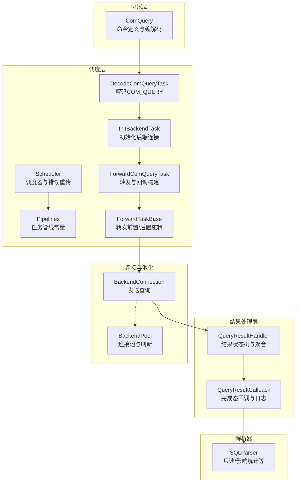
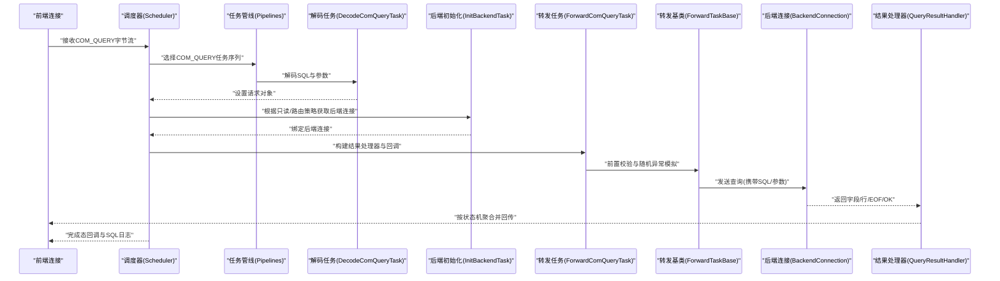
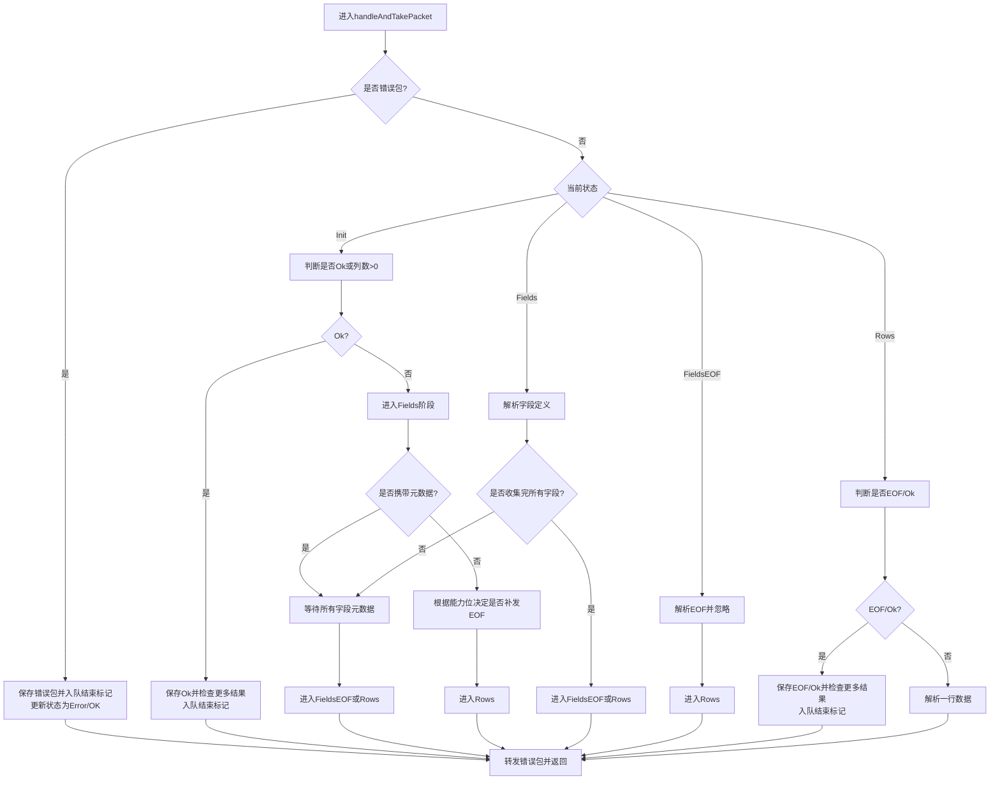

# 查询命令处理

<cite>
**本文引用的文件**
- [proxy-core/src/main/java/com/alibaba/polardbx/proxy/protocol/command/ComQuery.java](file://proxy-core/src/main/java/com/alibaba/polardbx/proxy/protocol/command/ComQuery.java)
- [proxy-core/src/main/java/com/alibaba/polardbx/proxy/scheduler/Pipelines.java](file://proxy-core/src/main/java/com/alibaba/polardbx/proxy/scheduler/Pipelines.java)
- [proxy-core/src/main/java/com/alibaba/polardbx/proxy/scheduler/DecodeComQueryTask.java](file://proxy-core/src/main/java/com/alibaba/polardbx/proxy/scheduler/DecodeComQueryTask.java)
- [proxy-core/src/main/java/com/alibaba/polardbx/proxy/scheduler/ForwardComQueryTask.java](file://proxy-core/src/main/java/com/alibaba/polardbx/proxy/scheduler/ForwardComQueryTask.java)
- [proxy-core/src/main/java/com/alibaba/polardbx/proxy/scheduler/ForwardTaskBase.java](file://proxy-core/src/main/java/com/alibaba/polardbx/proxy/scheduler/ForwardTaskBase.java)
- [proxy-core/src/main/java/com/alibaba/polardbx/proxy/scheduler/InitBackendTask.java](file://proxy-core/src/main/java/com/alibaba/polardbx/proxy/scheduler/InitBackendTask.java)
- [proxy-core/src/main/java/com/alibaba/polardbx/proxy/scheduler/Scheduler.java](file://proxy-core/src/main/java/com/alibaba/polardbx/proxy/scheduler/Scheduler.java)
- [proxy-core/src/main/java/com/alibaba/polardbx/proxy/protocol/handler/result/QueryResultHandler.java](file://proxy-core/src/main/java/com/alibaba/polardbx/proxy/protocol/handler/result/QueryResultHandler.java)
- [proxy-core/src/main/java/com/alibaba/polardbx/proxy/callback/QueryResultCallback.java](file://proxy-core/src/main/java/com/alibaba/polardbx/proxy/callback/QueryResultCallback.java)
- [proxy-core/src/main/java/com/alibaba/polardbx/proxy/connection/BackendConnection.java](file://proxy-core/src/main/java/com/alibaba/polardbx/proxy/connection/BackendConnection.java)
- [proxy-core/src/main/java/com/alibaba/polardbx/proxy/connection/pool/BackendPool.java](file://proxy-core/src/main/java/com/alibaba/polardbx/proxy/connection/pool/BackendPool.java)
- [proxy-parser/src/main/java/com/alibaba/polardbx/proxy/parser/recognizer/SQLParser.java](file://proxy-parser/src/main/java/com/alibaba/polardbx/proxy/parser/recognizer/SQLParser.java)
</cite>

## 目录
1. [简介](#简介)
2. [项目结构](#项目结构)
3. [核心组件](#核心组件)
4. [架构总览](#架构总览)
5. [详细组件分析](#详细组件分析)
6. [依赖关系分析](#依赖关系分析)
7. [性能考量](#性能考量)
8. [故障排查指南](#故障排查指南)
9. [结论](#结论)

## 简介
本文件面向 PolarDB-X Proxy 的查询命令处理，系统性梳理 COM_QUERY 命令从解码到结果返回的全链路：SQL 解析与语法分析、查询路由决策、任务管线调度、并发与连接池控制、结果聚合与传输优化，并给出性能优化建议与调试排障方法。目标是帮助读者快速理解并高效运维该模块。

## 项目结构
围绕查询命令处理的关键代码主要分布在以下模块：
- 协议层：定义与编解码 COM_QUERY 的数据结构
- 调度层：以“任务管线”形式组织查询处理步骤（解码、路由、后端初始化、转发等）
- 结果处理层：对后端返回的数据包进行状态机解析、聚合与回传
- 连接与池化：后端连接获取、复用与刷新
- 解析器：SQL 语义分析（只读判断、影响统计等）

图示来源
- [proxy-core/src/main/java/com/alibaba/polardbx/proxy/protocol/command/ComQuery.java](file://proxy-core/src/main/java/com/alibaba/polardbx/proxy/protocol/command/ComQuery.java#L33-L161)
- [proxy-core/src/main/java/com/alibaba/polardbx/proxy/scheduler/Pipelines.java](file://proxy-core/src/main/java/com/alibaba/polardbx/proxy/scheduler/Pipelines.java#L34-L47)
- [proxy-core/src/main/java/com/alibaba/polardbx/proxy/scheduler/DecodeComQueryTask.java](file://proxy-core/src/main/java/com/alibaba/polardbx/proxy/scheduler/DecodeComQueryTask.java#L24-L34)
- [proxy-core/src/main/java/com/alibaba/polardbx/proxy/scheduler/InitBackendTask.java](file://proxy-core/src/main/java/com/alibaba/polardbx/proxy/scheduler/InitBackendTask.java#L27-L49)
- [proxy-core/src/main/java/com/alibaba/polardbx/proxy/scheduler/ForwardComQueryTask.java](file://proxy-core/src/main/java/com/alibaba/polardbx/proxy/scheduler/ForwardComQueryTask.java#L30-L55)
- [proxy-core/src/main/java/com/alibaba/polardbx/proxy/scheduler/ForwardTaskBase.java](file://proxy-core/src/main/java/com/alibaba/polardbx/proxy/scheduler/ForwardTaskBase.java#L35-L56)
- [proxy-core/src/main/java/com/alibaba/polardbx/proxy/scheduler/Scheduler.java](file://proxy-core/src/main/java/com/alibaba/polardbx/proxy/scheduler/Scheduler.java#L46-L315)
- [proxy-core/src/main/java/com/alibaba/polardbx/proxy/protocol/handler/result/QueryResultHandler.java](file://proxy-core/src/main/java/com/alibaba/polardbx/proxy/protocol/handler/result/QueryResultHandler.java#L57-L568)
- [proxy-core/src/main/java/com/alibaba/polardbx/proxy/callback/QueryResultCallback.java](file://proxy-core/src/main/java/com/alibaba/polardbx/proxy/callback/QueryResultCallback.java#L49-L290)
- [proxy-core/src/main/java/com/alibaba/polardbx/proxy/connection/BackendConnection.java](file://proxy-core/src/main/java/com/alibaba/polardbx/proxy/connection/BackendConnection.java#L359-L367)
- [proxy-core/src/main/java/com/alibaba/polardbx/proxy/connection/pool/BackendPool.java](file://proxy-core/src/main/java/com/alibaba/polardbx/proxy/connection/pool/BackendPool.java#L46-L284)
- [proxy-parser/src/main/java/com/alibaba/polardbx/proxy/parser/recognizer/SQLParser.java](file://proxy-parser/src/main/java/com/alibaba/polardbx/proxy/parser/recognizer/SQLParser.java)

章节来源
- [proxy-core/src/main/java/com/alibaba/polardbx/proxy/scheduler/Pipelines.java](file://proxy-core/src/main/java/com/alibaba/polardbx/proxy/scheduler/Pipelines.java#L34-L47)

## 核心组件
- COM_QUERY 命令对象：负责客户端查询请求的解码与编码，支持带参数属性的文本协议。
- 调度管线：以固定顺序的任务链执行，覆盖解码、系统命令判定、重传准备、只读/主库路由、后端连接初始化、LSN 变量处理、转发与收尾。
- 结果处理器：基于状态机解析字段元数据、行集与 EOF/OK 包，支持文本与二进制协议，负责聚合与回传。
- 回调与日志：在状态变更与完成时记录事务状态、影响行数、只读判断、SQL 日志与重传信息。
- 后端连接与池化：按需建立或复用连接，维护空闲/运行中计数，支持全局变量与只读配置刷新。

章节来源
- [proxy-core/src/main/java/com/alibaba/polardbx/proxy/protocol/command/ComQuery.java](file://proxy-core/src/main/java/com/alibaba/polardbx/proxy/protocol/command/ComQuery.java#L33-L161)
- [proxy-core/src/main/java/com/alibaba/polardbx/proxy/scheduler/Pipelines.java](file://proxy-core/src/main/java/com/alibaba/polardbx/proxy/scheduler/Pipelines.java#L34-L47)
- [proxy-core/src/main/java/com/alibaba/polardbx/proxy/protocol/handler/result/QueryResultHandler.java](file://proxy-core/src/main/java/com/alibaba/polardbx/proxy/protocol/handler/result/QueryResultHandler.java#L57-L568)
- [proxy-core/src/main/java/com/alibaba/polardbx/proxy/callback/QueryResultCallback.java](file://proxy-core/src/main/java/com/alibaba/polardbx/proxy/callback/QueryResultCallback.java#L49-L290)
- [proxy-core/src/main/java/com/alibaba/polardbx/proxy/connection/pool/BackendPool.java](file://proxy-core/src/main/java/com/alibaba/polardbx/proxy/connection/pool/BackendPool.java#L46-L284)

## 架构总览
下图展示 COM_QUERY 在代理侧的端到端处理路径：前端连接经调度器进入任务管线，选择后端连接后转发至后端，后端结果通过 QueryResultHandler 聚合并回传前端；期间由 Scheduler 统筹错误处理与可选重传。

图示来源
- [proxy-core/src/main/java/com/alibaba/polardbx/proxy/scheduler/Pipelines.java](file://proxy-core/src/main/java/com/alibaba/polardbx/proxy/scheduler/Pipelines.java#L34-L47)
- [proxy-core/src/main/java/com/alibaba/polardbx/proxy/scheduler/DecodeComQueryTask.java](file://proxy-core/src/main/java/com/alibaba/polardbx/proxy/scheduler/DecodeComQueryTask.java#L24-L34)
- [proxy-core/src/main/java/com/alibaba/polardbx/proxy/scheduler/InitBackendTask.java](file://proxy-core/src/main/java/com/alibaba/polardbx/proxy/scheduler/InitBackendTask.java#L27-L49)
- [proxy-core/src/main/java/com/alibaba/polardbx/proxy/scheduler/ForwardComQueryTask.java](file://proxy-core/src/main/java/com/alibaba/polardbx/proxy/scheduler/ForwardComQueryTask.java#L30-L55)
- [proxy-core/src/main/java/com/alibaba/polardbx/proxy/scheduler/ForwardTaskBase.java](file://proxy-core/src/main/java/com/alibaba/polardbx/proxy/scheduler/ForwardTaskBase.java#L35-L56)
- [proxy-core/src/main/java/com/alibaba/polardbx/proxy/connection/BackendConnection.java](file://proxy-core/src/main/java/com/alibaba/polardbx/proxy/connection/BackendConnection.java#L359-L367)
- [proxy-core/src/main/java/com/alibaba/polardbx/proxy/protocol/handler/result/QueryResultHandler.java](file://proxy-core/src/main/java/com/alibaba/polardbx/proxy/protocol/handler/result/QueryResultHandler.java#L57-L568)

## 详细组件分析

### COM_QUERY 命令解析与编码
- 负责解析客户端的 COM_QUERY 请求，支持带参数属性的文本协议（含 NULL 位图、参数类型与值）。
- 编码时修复参数集合数量并按能力位生成对应包体。
- 提供字符串化工具便于日志输出。

章节来源
- [proxy-core/src/main/java/com/alibaba/polardbx/proxy/protocol/command/ComQuery.java](file://proxy-core/src/main/java/com/alibaba/polardbx/proxy/protocol/command/ComQuery.java#L33-L161)

### 调度管线与任务序列
- COM_QUERY 的标准任务序列包括：解码、系统命令判定、重传准备、只读/主库检查、后端初始化、LSN 获取与变量恢复、转发。
- 每个任务实现统一接口，幂等设计，返回 null 表示继续下一个任务，否则表示结束管线。

章节来源
- [proxy-core/src/main/java/com/alibaba/polardbx/proxy/scheduler/Pipelines.java](file://proxy-core/src/main/java/com/alibaba/polardbx/proxy/scheduler/Pipelines.java#L34-L47)
- [proxy-core/src/main/java/com/alibaba/polardbx/proxy/scheduler/DecodeComQueryTask.java](file://proxy-core/src/main/java/com/alibaba/polardbx/proxy/scheduler/DecodeComQueryTask.java#L24-L34)

### 路由与后端连接初始化
- 根据只读标记与当前事务状态选择 RW 或 RO 连接；若只读失败则回退到 RW。
- 初始化完成后绑定到调度器，后续转发使用。

章节来源
- [proxy-core/src/main/java/com/alibaba/polardbx/proxy/scheduler/InitBackendTask.java](file://proxy-core/src/main/java/com/alibaba/polardbx/proxy/scheduler/InitBackendTask.java#L27-L49)

### 查询转发与回调构建
- 构建 QueryResultHandler 与 QueryResultCallback，用于异步聚合与回传。
- 记录 SQL 日志（长度截断）、重传延迟、等待 LSN 等耗时指标。

章节来源
- [proxy-core/src/main/java/com/alibaba/polardbx/proxy/scheduler/ForwardComQueryTask.java](file://proxy-core/src/main/java/com/alibaba/polardbx/proxy/scheduler/ForwardComQueryTask.java#L30-L55)
- [proxy-core/src/main/java/com/alibaba/polardbx/proxy/callback/QueryResultCallback.java](file://proxy-core/src/main/java/com/alibaba/polardbx/proxy/callback/QueryResultCallback.java#L195-L290)

### 结果聚合与传输
- QueryResultHandler 采用状态机处理字段元数据、行集与 EOF/OK，支持文本与二进制协议。
- 对兼容性场景（如 DEPRECATE_EOF 差异）进行序列号修补与包重写。
- 支持背压控制：当前端写阻塞时暂停后端读取，恢复后再继续。
- 提供阻塞式拉取与超时控制，便于上层消费。

图示来源
- [proxy-core/src/main/java/com/alibaba/polardbx/proxy/protocol/handler/result/QueryResultHandler.java](file://proxy-core/src/main/java/com/alibaba/polardbx/proxy/protocol/handler/result/QueryResultHandler.java#L177-L465)

章节来源
- [proxy-core/src/main/java/com/alibaba/polardbx/proxy/protocol/handler/result/QueryResultHandler.java](file://proxy-core/src/main/java/com/alibaba/polardbx/proxy/protocol/handler/result/QueryResultHandler.java#L57-L568)

### 错误处理与重传
- Scheduler 在异常时尝试重传：仅在满足条件（未在事务、时间允许、已认证）时进行快速重试。
- 完成回调中根据只读/非只读与事务状态决定是否重传或发送中断错误。

章节来源
- [proxy-core/src/main/java/com/alibaba/polardbx/proxy/scheduler/Scheduler.java](file://proxy-core/src/main/java/com/alibaba/polardbx/proxy/scheduler/Scheduler.java#L234-L313)
- [proxy-core/src/main/java/com/alibaba/polardbx/proxy/callback/QueryResultCallback.java](file://proxy-core/src/main/java/com/alibaba/polardbx/proxy/callback/QueryResultCallback.java#L195-L290)

### 连接池与并发控制
- BackendPool 提供连接池：按需创建或复用连接，维护 idle/running 计数，支持最大池大小限制。
- 刷新策略：周期性对空闲连接执行健康检查查询，动态维护全局变量与只读配置。
- 调度器在错误时可触发重传，避免频繁重建连接。

章节来源
- [proxy-core/src/main/java/com/alibaba/polardbx/proxy/connection/pool/BackendPool.java](file://proxy-core/src/main/java/com/alibaba/polardbx/proxy/connection/pool/BackendPool.java#L46-L284)
- [proxy-core/src/main/java/com/alibaba/polardbx/proxy/scheduler/Scheduler.java](file://proxy-core/src/main/java/com/alibaba/polardbx/proxy/scheduler/Scheduler.java#L234-L313)

## 依赖关系分析
- 协议层 ComQuery 作为输入，被调度层 DecodeComQueryTask 使用。
- 调度层通过 Pipelines 组织任务，ForwardComQueryTask 负责构建结果处理器与回调。
- 结果层 QueryResultHandler 依赖后端连接 BackendConnection 发送查询并回传前端。
- 回调层 QueryResultCallback 依赖解析器 SQLParser 进行只读判断与影响统计。

图示来源
- [proxy-core/src/main/java/com/alibaba/polardbx/proxy/protocol/command/ComQuery.java](file://proxy-core/src/main/java/com/alibaba/polardbx/proxy/protocol/command/ComQuery.java#L33-L161)
- [proxy-core/src/main/java/com/alibaba/polardbx/proxy/scheduler/Pipelines.java](file://proxy-core/src/main/java/com/alibaba/polardbx/proxy/scheduler/Pipelines.java#L34-L47)
- [proxy-core/src/main/java/com/alibaba/polardbx/proxy/scheduler/ForwardComQueryTask.java](file://proxy-core/src/main/java/com/alibaba/polardbx/proxy/scheduler/ForwardComQueryTask.java#L30-L55)
- [proxy-core/src/main/java/com/alibaba/polardbx/proxy/protocol/handler/result/QueryResultHandler.java](file://proxy-core/src/main/java/com/alibaba/polardbx/proxy/protocol/handler/result/QueryResultHandler.java#L57-L568)
- [proxy-core/src/main/java/com/alibaba/polardbx/proxy/callback/QueryResultCallback.java](file://proxy-core/src/main/java/com/alibaba/polardbx/proxy/callback/QueryResultCallback.java#L49-L290)
- [proxy-parser/src/main/java/com/alibaba/polardbx/proxy/parser/recognizer/SQLParser.java](file://proxy-parser/src/main/java/com/alibaba/polardbx/proxy/parser/recognizer/SQLParser.java)

## 性能考量
- 批量查询处理
  - 将多个小查询合并为单次往返（在应用层或驱动层）可减少网络开销与 RTT。
  - 使用二进制协议可降低文本解析成本，提升行集传输效率。
- 缓存策略
  - 合理利用连接池 BackendPool 的空闲连接复用，避免频繁创建销毁。
  - 全局变量与只读配置定期刷新，减少后端一致性带来的额外往返。
- 连接池复用
  - 控制最大池大小与空闲阈值，结合后台健康检查，维持稳定吞吐。
  - 对只读流量优先走 RO 连接，主库连接用于写操作，平衡负载。
- 结果聚合与传输优化
  - 使用 QueryResultHandler 的阻塞拉取与超时控制，避免内存峰值。
  - 针对 DEPRECATE_EOF 差异自动修补序列号与重写包，减少上层适配成本。
- 调度与重传
  - Scheduler 的重传仅在只读或非事务场景启用，避免长事务中的重复执行。
  - 记录重传延迟、等待 LSN 等指标，辅助定位热点与抖动。

章节来源
- [proxy-core/src/main/java/com/alibaba/polardbx/proxy/connection/pool/BackendPool.java](file://proxy-core/src/main/java/com/alibaba/polardbx/proxy/connection/pool/BackendPool.java#L167-L250)
- [proxy-core/src/main/java/com/alibaba/polardbx/proxy/protocol/handler/result/QueryResultHandler.java](file://proxy-core/src/main/java/com/alibaba/polardbx/proxy/protocol/handler/result/QueryResultHandler.java#L467-L503)
- [proxy-core/src/main/java/com/alibaba/polardbx/proxy/scheduler/Scheduler.java](file://proxy-core/src/main/java/com/alibaba/polardbx/proxy/scheduler/Scheduler.java#L234-L313)

## 故障排查指南
- 常见问题与定位
  - SQL 日志：开启 SQL 日志后，可在回调完成态输出 SQL、耗时与重试信息，便于定位慢查询与重传原因。
  - 只读判断：回调中对只读语句进行判断，若误判可检查解析器版本与 SQL 模式。
  - 背压与阻塞：若前端写阻塞导致后端读暂停，观察 QueryResultHandler 的写恢复回调是否触发。
  - 重传策略：确认是否处于事务中、是否只读语句、是否超过重传时限。
- 排查步骤
  - 检查调度器错误处理分支与重传开关。
  - 核对后端连接池可用连接数与空闲阈值。
  - 关注结果处理器的状态机流转，确认 EOF/Ok 是否正确匹配。
  - 对比前后端能力位（如 DEPRECATE_EOF），确认序列号修补逻辑是否生效。

章节来源
- [proxy-core/src/main/java/com/alibaba/polardbx/proxy/callback/QueryResultCallback.java](file://proxy-core/src/main/java/com/alibaba/polardbx/proxy/callback/QueryResultCallback.java#L246-L290)
- [proxy-core/src/main/java/com/alibaba/polardbx/proxy/scheduler/Scheduler.java](file://proxy-core/src/main/java/com/alibaba/polardbx/proxy/scheduler/Scheduler.java#L234-L313)
- [proxy-core/src/main/java/com/alibaba/polardbx/proxy/protocol/handler/result/QueryResultHandler.java](file://proxy-core/src/main/java/com/alibaba/polardbx/proxy/protocol/handler/result/QueryResultHandler.java#L467-L503)

## 结论
PolarDB-X Proxy 的查询命令处理以“任务管线 + 状态机结果聚合”的方式实现了高内聚、低耦合的处理链：从协议解码、路由决策、连接池复用到结果回传与日志记录，均具备清晰的职责边界与可观测性。通过合理的池化策略、只读分流与背压控制，可在保证一致性的同时获得稳定的吞吐与低延迟表现。建议在生产环境中结合 SQL 日志与重传指标持续优化路由与连接池参数，以应对不同业务负载特征。