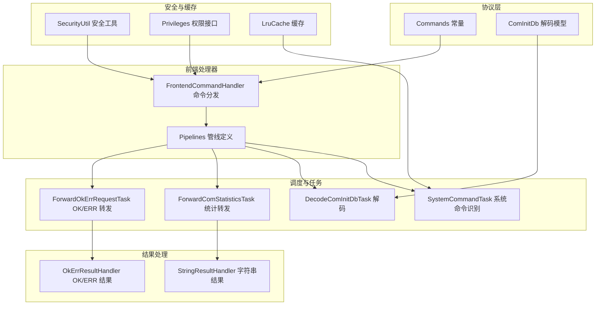
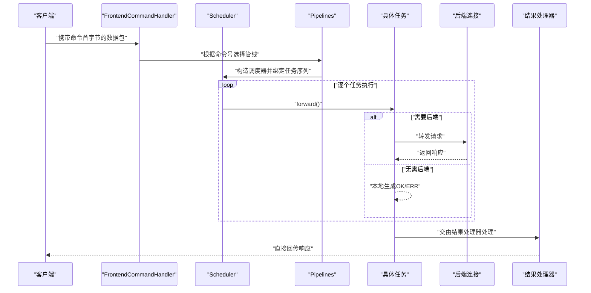
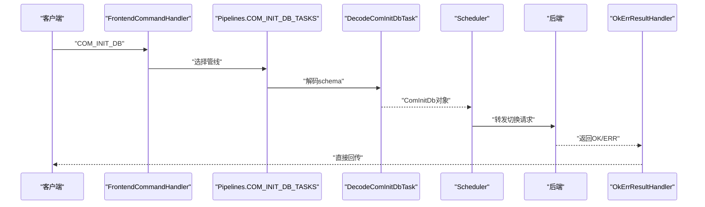
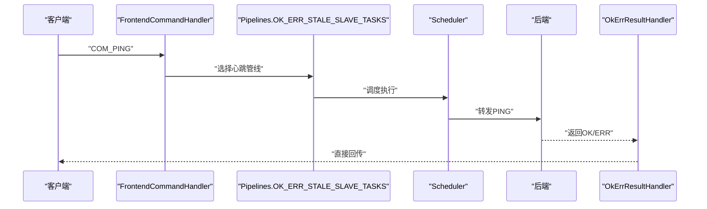
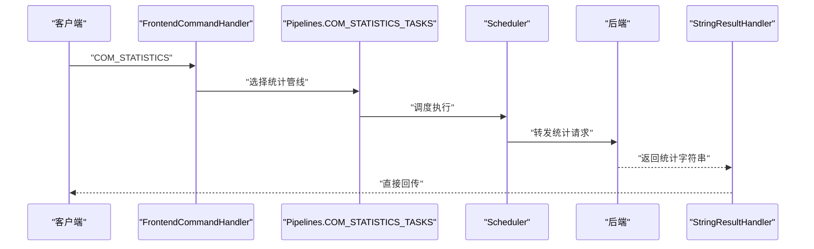
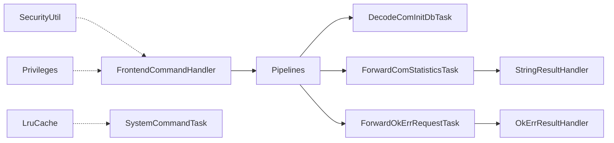

# 系统命令处理

<cite>
**本文引用的文件**
- [proxy-core/src/main/java/com/alibaba/polardbx/proxy/protocol/command/Commands.java](file://proxy-core/src/main/java/com/alibaba/polardbx/proxy/protocol/command/Commands.java)
- [proxy-core/src/main/java/com/alibaba/polardbx/proxy/protocol/command/ComInitDb.java](file://proxy-core/src/main/java/com/alibaba/polardbx/proxy/protocol/command/ComInitDb.java)
- [proxy-core/src/main/java/com/alibaba/polardbx/proxy/protocol/handler/FrontendCommandHandler.java](file://proxy-core/src/main/java/com/alibaba/polardbx/proxy/protocol/handler/FrontendCommandHandler.java)
- [proxy-core/src/main/java/com/alibaba/polardbx/proxy/scheduler/Pipelines.java](file://proxy-core/src/main/java/com/alibaba/polardbx/proxy/scheduler/Pipelines.java)
- [proxy-core/src/main/java/com/alibaba/polardbx/proxy/scheduler/DecodeComInitDbTask.java](file://proxy-core/src/main/java/com/alibaba/polardbx/proxy/scheduler/DecodeComInitDbTask.java)
- [proxy-core/src/main/java/com/alibaba/polardbx/proxy/scheduler/ForwardComStatisticsTask.java](file://proxy-core/src/main/java/com/alibaba/polardbx/proxy/scheduler/ForwardComStatisticsTask.java)
- [proxy-core/src/main/java/com/alibaba/polardbx/proxy/scheduler/ForwardOkErrRequestTask.java](file://proxy-core/src/main/java/com/alibaba/polardbx/proxy/scheduler/ForwardOkErrRequestTask.java)
- [proxy-core/src/main/java/com/alibaba/polardbx/proxy/scheduler/SystemCommandTask.java](file://proxy-core/src/main/java/com/alibaba/polardbx/proxy/scheduler/SystemCommandTask.java)
- [proxy-core/src/main/java/com/alibaba/polardbx/proxy/protocol/handler/result/StringResultHandler.java](file://proxy-core/src/main/java/com/alibaba/polardbx/proxy/protocol/handler/result/StringResultHandler.java)
- [proxy-core/src/main/java/com/alibaba/polardbx/proxy/protocol/handler/result/OkErrResultHandler.java](file://proxy-core/src/main/java/com/alibaba/polardbx/proxy/protocol/handler/result/OkErrResultHandler.java)
- [proxy-core/src/main/java/com/alibaba/polardbx/proxy/privilege/SecurityUtil.java](file://proxy-core/src/main/java/com/alibaba/polardbx/proxy/privilege/SecurityUtil.java)
- [proxy-core/src/main/java/com/alibaba/polardbx/proxy/privilege/Privileges.java](file://proxy-core/src/main/java/com/alibaba/polardbx/proxy/privilege/Privileges.java)
- [proxy-core/src/main/java/com/alibaba/polardbx/proxy/context/help/LruCache.java](file://proxy-core/src/main/java/com/alibaba/polardbx/proxy/context/help/LruCache.java)
- [proxy-core/src/main/java/com/alibaba/polardbx/proxy/protocol/handler/request/ShowReactorHandler.java](file://proxy-core/src/main/java/com/alibaba/polardbx/proxy/protocol/handler/request/ShowReactorHandler.java)
</cite>

## 目录
1. [简介](#简介)
2. [项目结构](#项目结构)
3. [核心组件](#核心组件)
4. [架构总览](#架构总览)
5. [详细组件分析](#详细组件分析)
6. [依赖关系分析](#依赖关系分析)
7. [性能考量](#性能考量)
8. [故障排查指南](#故障排查指南)
9. [结论](#结论)
10. [附录](#附录)

## 简介
本文件面向PolarDB-X Proxy的系统命令处理，围绕以下目标展开：系统命令的处理流程与快速响应机制（无状态命令、直接响应策略、错误快速传播）、安全控制（权限验证、访问控制、命令白名单思路）、性能优化（命令缓存、批量处理、异步响应）以及监控与故障排除。重点覆盖COM_INIT_DB的数据库切换、COM_PING的心跳检测、COM_STATISTICS的性能统计等典型场景。

## 项目结构
系统命令处理涉及协议解析、命令分发、任务编排、结果回传与安全控制等多个层次。下图给出与系统命令处理相关的核心模块关系：

图表来源
- [proxy-core/src/main/java/com/alibaba/polardbx/proxy/protocol/command/Commands.java](file://proxy-core/src/main/java/com/alibaba/polardbx/proxy/protocol/command/Commands.java#L21-L117)
- [proxy-core/src/main/java/com/alibaba/polardbx/proxy/protocol/command/ComInitDb.java](file://proxy-core/src/main/java/com/alibaba/polardbx/proxy/protocol/command/ComInitDb.java#L26-L55)
- [proxy-core/src/main/java/com/alibaba/polardbx/proxy/protocol/handler/FrontendCommandHandler.java](file://proxy-core/src/main/java/com/alibaba/polardbx/proxy/protocol/handler/FrontendCommandHandler.java#L68-L171)
- [proxy-core/src/main/java/com/alibaba/polardbx/proxy/scheduler/Pipelines.java](file://proxy-core/src/main/java/com/alibaba/polardbx/proxy/scheduler/Pipelines.java#L21-L128)
- [proxy-core/src/main/java/com/alibaba/polardbx/proxy/scheduler/SystemCommandTask.java](file://proxy-core/src/main/java/com/alibaba/polardbx/proxy/scheduler/SystemCommandTask.java#L57-L120)
- [proxy-core/src/main/java/com/alibaba/polardbx/proxy/scheduler/DecodeComInitDbTask.java](file://proxy-core/src/main/java/com/alibaba/polardbx/proxy/scheduler/DecodeComInitDbTask.java#L23-L33)
- [proxy-core/src/main/java/com/alibaba/polardbx/proxy/scheduler/ForwardComStatisticsTask.java](file://proxy-core/src/main/java/com/alibaba/polardbx/proxy/scheduler/ForwardComStatisticsTask.java#L28-L44)
- [proxy-core/src/main/java/com/alibaba/polardbx/proxy/scheduler/ForwardOkErrRequestTask.java](file://proxy-core/src/main/java/com/alibaba/polardbx/proxy/scheduler/ForwardOkErrRequestTask.java#L28-L44)
- [proxy-core/src/main/java/com/alibaba/polardbx/proxy/protocol/handler/result/StringResultHandler.java](file://proxy-core/src/main/java/com/alibaba/polardbx/proxy/protocol/handler/result/StringResultHandler.java#L36-L56)
- [proxy-core/src/main/java/com/alibaba/polardbx/proxy/protocol/handler/result/OkErrResultHandler.java](file://proxy-core/src/main/java/com/alibaba/polardbx/proxy/protocol/handler/result/OkErrResultHandler.java#L38-L76)
- [proxy-core/src/main/java/com/alibaba/polardbx/proxy/privilege/SecurityUtil.java](file://proxy-core/src/main/java/com/alibaba/polardbx/proxy/privilege/SecurityUtil.java#L33-L235)
- [proxy-core/src/main/java/com/alibaba/polardbx/proxy/privilege/Privileges.java](file://proxy-core/src/main/java/com/alibaba/polardbx/proxy/privilege/Privileges.java#L21-L42)
- [proxy-core/src/main/java/com/alibaba/polardbx/proxy/context/help/LruCache.java](file://proxy-core/src/main/java/com/alibaba/polardbx/proxy/context/help/LruCache.java#L25-L45)

章节来源
- [proxy-core/src/main/java/com/alibaba/polardbx/proxy/protocol/command/Commands.java](file://proxy-core/src/main/java/com/alibaba/polardbx/proxy/protocol/command/Commands.java#L21-L117)
- [proxy-core/src/main/java/com/alibaba/polardbx/proxy/protocol/handler/FrontendCommandHandler.java](file://proxy-core/src/main/java/com/alibaba/polardbx/proxy/protocol/handler/FrontendCommandHandler.java#L68-L171)
- [proxy-core/src/main/java/com/alibaba/polardbx/proxy/scheduler/Pipelines.java](file://proxy-core/src/main/java/com/alibaba/polardbx/proxy/scheduler/Pipelines.java#L21-L128)

## 核心组件
- 命令常量与数据模型
  - Commands：定义MySQL协议命令号，如COM_INIT_DB、COM_PING、COM_STATISTICS等。
  - ComInitDb：用于解析COM_INIT_DB请求体中的schema名称。
- 前端命令分发器
  - FrontendCommandHandler：根据首字节命令号选择对应管线，构建Scheduler并执行forward。
- 任务管线与快速响应
  - Pipelines：集中定义各命令的执行序列（解码、重传、读写路由、后端连接、转发、回调）。
  - ForwardOkErrRequestTask：用于无状态命令（如COM_PING、COM_DEBUG）的快速OK/ERR响应。
  - ForwardComStatisticsTask：用于COM_STATISTICS的字符串结果转发。
- 结果处理
  - OkErrResultHandler：识别OK/ERR包并更新上下文状态，随后直接回传。
  - StringResultHandler：接收后端返回的字符串统计信息并回传。
- 安全与权限
  - SecurityUtil：提供认证挑战/校验、密码摘要计算、敏感信息加解密等能力。
  - Privileges：权限接口，支持用户凭据查询、白名单IP判断等扩展点。
- 缓存与性能
  - LruCache：通用LRU缓存实现，可用于命令/元数据缓存以降低重复解析成本。

章节来源
- [proxy-core/src/main/java/com/alibaba/polardbx/proxy/protocol/command/Commands.java](file://proxy-core/src/main/java/com/alibaba/polardbx/proxy/protocol/command/Commands.java#L21-L117)
- [proxy-core/src/main/java/com/alibaba/polardbx/proxy/protocol/command/ComInitDb.java](file://proxy-core/src/main/java/com/alibaba/polardbx/proxy/protocol/command/ComInitDb.java#L26-L55)
- [proxy-core/src/main/java/com/alibaba/polardbx/proxy/protocol/handler/FrontendCommandHandler.java](file://proxy-core/src/main/java/com/alibaba/polardbx/proxy/protocol/handler/FrontendCommandHandler.java#L68-L171)
- [proxy-core/src/main/java/com/alibaba/polardbx/proxy/scheduler/Pipelines.java](file://proxy-core/src/main/java/com/alibaba/polardbx/proxy/scheduler/Pipelines.java#L21-L128)
- [proxy-core/src/main/java/com/alibaba/polardbx/proxy/scheduler/ForwardOkErrRequestTask.java](file://proxy-core/src/main/java/com/alibaba/polardbx/proxy/scheduler/ForwardOkErrRequestTask.java#L28-L44)
- [proxy-core/src/main/java/com/alibaba/polardbx/proxy/scheduler/ForwardComStatisticsTask.java](file://proxy-core/src/main/java/com/alibaba/polardbx/proxy/scheduler/ForwardComStatisticsTask.java#L28-L44)
- [proxy-core/src/main/java/com/alibaba/polardbx/proxy/protocol/handler/result/OkErrResultHandler.java](file://proxy-core/src/main/java/com/alibaba/polardbx/proxy/protocol/handler/result/OkErrResultHandler.java#L38-L76)
- [proxy-core/src/main/java/com/alibaba/polardbx/proxy/protocol/handler/result/StringResultHandler.java](file://proxy-core/src/main/java/com/alibaba/polardbx/proxy/protocol/handler/result/StringResultHandler.java#L36-L56)
- [proxy-core/src/main/java/com/alibaba/polardbx/proxy/privilege/SecurityUtil.java](file://proxy-core/src/main/java/com/alibaba/polardbx/proxy/privilege/SecurityUtil.java#L33-L235)
- [proxy-core/src/main/java/com/alibaba/polardbx/proxy/privilege/Privileges.java](file://proxy-core/src/main/java/com/alibaba/polardbx/proxy/privilege/Privileges.java#L21-L42)
- [proxy-core/src/main/java/com/alibaba/polardbx/proxy/context/help/LruCache.java](file://proxy-core/src/main/java/com/alibaba/polardbx/proxy/context/help/LruCache.java#L25-L45)

## 架构总览
系统命令处理采用“命令分发 → 任务管线 → 后端转发 → 结果回传”的流水线式设计。无状态命令通过OK/ERR直返策略，减少后端交互；有状态命令（如COM_INIT_DB、COM_STATISTICS）按管线顺序执行，确保一致性与可观测性。

图表来源
- [proxy-core/src/main/java/com/alibaba/polardbx/proxy/protocol/handler/FrontendCommandHandler.java](file://proxy-core/src/main/java/com/alibaba/polardbx/proxy/protocol/handler/FrontendCommandHandler.java#L68-L171)
- [proxy-core/src/main/java/com/alibaba/polardbx/proxy/scheduler/Pipelines.java](file://proxy-core/src/main/java/com/alibaba/polardbx/proxy/scheduler/Pipelines.java#L21-L128)
- [proxy-core/src/main/java/com/alibaba/polardbx/proxy/scheduler/ForwardOkErrRequestTask.java](file://proxy-core/src/main/java/com/alibaba/polardbx/proxy/scheduler/ForwardOkErrRequestTask.java#L28-L44)
- [proxy-core/src/main/java/com/alibaba/polardbx/proxy/protocol/handler/result/OkErrResultHandler.java](file://proxy-core/src/main/java/com/alibaba/polardbx/proxy/protocol/handler/result/OkErrResultHandler.java#L38-L76)

## 详细组件分析

### COM_INIT_DB：数据库切换
- 处理流程
  - 前端解析：FrontendCommandHandler根据命令号选择COM_INIT_DB管线。
  - 解码阶段：DecodeComInitDbTask从Decoder中读取schema名，封装为ComInitDb对象。
  - 路由与连接：管线包含重传、读写偏好、主从检查、后端初始化、LSN获取与设置等步骤。
  - 转发与回传：ForwardComInitDbTask将请求转发至后端，结果由OkErrResultHandler处理并直接回传。
- 快速响应机制
  - 该命令属于“有状态”命令，需后端确认，但通过明确的管线与结果处理器，避免多余往返。
- 安全控制
  - 可结合Privileges接口进行schema存在性与用户权限校验（扩展点），在管线中插入校验任务。
- 性能优化
  - 使用LruCache缓存常用schema元信息或预解析结果，减少重复解析成本。

图表来源
- [proxy-core/src/main/java/com/alibaba/polardbx/proxy/protocol/handler/FrontendCommandHandler.java](file://proxy-core/src/main/java/com/alibaba/polardbx/proxy/protocol/handler/FrontendCommandHandler.java#L84-L87)
- [proxy-core/src/main/java/com/alibaba/polardbx/proxy/scheduler/Pipelines.java](file://proxy-core/src/main/java/com/alibaba/polardbx/proxy/scheduler/Pipelines.java#L22-L32)
- [proxy-core/src/main/java/com/alibaba/polardbx/proxy/scheduler/DecodeComInitDbTask.java](file://proxy-core/src/main/java/com/alibaba/polardbx/proxy/scheduler/DecodeComInitDbTask.java#L23-L33)
- [proxy-core/src/main/java/com/alibaba/polardbx/proxy/protocol/handler/result/OkErrResultHandler.java](file://proxy-core/src/main/java/com/alibaba/polardbx/proxy/protocol/handler/result/OkErrResultHandler.java#L50-L76)

章节来源
- [proxy-core/src/main/java/com/alibaba/polardbx/proxy/protocol/command/ComInitDb.java](file://proxy-core/src/main/java/com/alibaba/polardbx/proxy/protocol/command/ComInitDb.java#L26-L55)
- [proxy-core/src/main/java/com/alibaba/polardbx/proxy/scheduler/DecodeComInitDbTask.java](file://proxy-core/src/main/java/com/alibaba/polardbx/proxy/scheduler/DecodeComInitDbTask.java#L23-L33)
- [proxy-core/src/main/java/com/alibaba/polardbx/proxy/scheduler/Pipelines.java](file://proxy-core/src/main/java/com/alibaba/polardbx/proxy/scheduler/Pipelines.java#L22-L32)
- [proxy-core/src/main/java/com/alibaba/polardbx/proxy/protocol/handler/result/OkErrResultHandler.java](file://proxy-core/src/main/java/com/alibaba/polardbx/proxy/protocol/handler/result/OkErrResultHandler.java#L50-L76)

### COM_PING：心跳检测
- 处理流程
  - FrontendCommandHandler识别COM_PING，选择OK_ERR_STALE_SLAVE_TASKS管线。
  - 该管线包含重传、读写偏好、主从检查与后端初始化，最终通过ForwardOkErrRequestTask转发OK/ERR。
- 快速响应机制
  - 无状态命令，直接返回OK/ERR，不依赖业务数据，延迟极低。
- 安全控制
  - 可在管线前增加权限校验任务，拒绝未授权连接的心跳探测。

图表来源
- [proxy-core/src/main/java/com/alibaba/polardbx/proxy/protocol/handler/FrontendCommandHandler.java](file://proxy-core/src/main/java/com/alibaba/polardbx/proxy/protocol/handler/FrontendCommandHandler.java#L109-L112)
- [proxy-core/src/main/java/com/alibaba/polardbx/proxy/scheduler/Pipelines.java](file://proxy-core/src/main/java/com/alibaba/polardbx/proxy/scheduler/Pipelines.java#L77-L84)
- [proxy-core/src/main/java/com/alibaba/polardbx/proxy/scheduler/ForwardOkErrRequestTask.java](file://proxy-core/src/main/java/com/alibaba/polardbx/proxy/scheduler/ForwardOkErrRequestTask.java#L28-L44)
- [proxy-core/src/main/java/com/alibaba/polardbx/proxy/protocol/handler/result/OkErrResultHandler.java](file://proxy-core/src/main/java/com/alibaba/polardbx/proxy/protocol/handler/result/OkErrResultHandler.java#L50-L76)

章节来源
- [proxy-core/src/main/java/com/alibaba/polardbx/proxy/protocol/handler/FrontendCommandHandler.java](file://proxy-core/src/main/java/com/alibaba/polardbx/proxy/protocol/handler/FrontendCommandHandler.java#L109-L112)
- [proxy-core/src/main/java/com/alibaba/polardbx/proxy/scheduler/Pipelines.java](file://proxy-core/src/main/java/com/alibaba/polardbx/proxy/scheduler/Pipelines.java#L77-L84)
- [proxy-core/src/main/java/com/alibaba/polardbx/proxy/scheduler/ForwardOkErrRequestTask.java](file://proxy-core/src/main/java/com/alibaba/polardbx/proxy/scheduler/ForwardOkErrRequestTask.java#L28-L44)
- [proxy-core/src/main/java/com/alibaba/polardbx/proxy/protocol/handler/result/OkErrResultHandler.java](file://proxy-core/src/main/java/com/alibaba/polardbx/proxy/protocol/handler/result/OkErrResultHandler.java#L50-L76)

### COM_STATISTICS：性能统计
- 处理流程
  - FrontendCommandHandler识别COM_STATISTICS，选择COM_STATISTICS_TASKS管线。
  - 该管线包含重传、主从检查、后端初始化，最终通过ForwardComStatisticsTask转发请求。
  - 后端返回字符串形式的统计信息，由StringResultHandler接收并回传。
- 快速响应机制
  - 该命令通常为轻量查询，通过字符串结果处理器直接回传，避免复杂结果集解析。
- 安全控制
  - 可在管线中加入访问控制与审计日志，限制高风险统计查询。

图表来源
- [proxy-core/src/main/java/com/alibaba/polardbx/proxy/protocol/handler/FrontendCommandHandler.java](file://proxy-core/src/main/java/com/alibaba/polardbx/proxy/protocol/handler/FrontendCommandHandler.java#L99-L102)
- [proxy-core/src/main/java/com/alibaba/polardbx/proxy/scheduler/Pipelines.java](file://proxy-core/src/main/java/com/alibaba/polardbx/proxy/scheduler/Pipelines.java#L61-L67)
- [proxy-core/src/main/java/com/alibaba/polardbx/proxy/scheduler/ForwardComStatisticsTask.java](file://proxy-core/src/main/java/com/alibaba/polardbx/proxy/scheduler/ForwardComStatisticsTask.java#L28-L44)
- [proxy-core/src/main/java/com/alibaba/polardbx/proxy/protocol/handler/result/StringResultHandler.java](file://proxy-core/src/main/java/com/alibaba/polardbx/proxy/protocol/handler/result/StringResultHandler.java#L47-L56)

章节来源
- [proxy-core/src/main/java/com/alibaba/polardbx/proxy/protocol/handler/FrontendCommandHandler.java](file://proxy-core/src/main/java/com/alibaba/polardbx/proxy/protocol/handler/FrontendCommandHandler.java#L99-L102)
- [proxy-core/src/main/java/com/alibaba/polardbx/proxy/scheduler/Pipelines.java](file://proxy-core/src/main/java/com/alibaba/polardbx/proxy/scheduler/Pipelines.java#L61-L67)
- [proxy-core/src/main/java/com/alibaba/polardbx/proxy/scheduler/ForwardComStatisticsTask.java](file://proxy-core/src/main/java/com/alibaba/polardbx/proxy/scheduler/ForwardComStatisticsTask.java#L28-L44)
- [proxy-core/src/main/java/com/alibaba/polardbx/proxy/protocol/handler/result/StringResultHandler.java](file://proxy-core/src/main/java/com/alibaba/polardbx/proxy/protocol/handler/result/StringResultHandler.java#L47-L56)

### 系统命令白名单与快速传播
- 白名单思路
  - 在FrontendCommandHandler或SystemCommandTask中增加命令白名单校验，仅允许已知安全命令进入处理流。
  - 对于COM_QUERY触发的系统命令，可结合SQL解析器识别SHOW/KILL/SET等关键字，限制复杂语句。
- 错误快速传播
  - OkErrResultHandler对ERR包直接回传，避免中间态堆积。
  - StringResultHandler对统计字符串直接透传，减少额外编码/解码。

章节来源
- [proxy-core/src/main/java/com/alibaba/polardbx/proxy/protocol/handler/FrontendCommandHandler.java](file://proxy-core/src/main/java/com/alibaba/polardbx/proxy/protocol/handler/FrontendCommandHandler.java#L162-L165)
- [proxy-core/src/main/java/com/alibaba/polardbx/proxy/scheduler/SystemCommandTask.java](file://proxy-core/src/main/java/com/alibaba/polardbx/proxy/scheduler/SystemCommandTask.java#L57-L120)
- [proxy-core/src/main/java/com/alibaba/polardbx/proxy/protocol/handler/result/OkErrResultHandler.java](file://proxy-core/src/main/java/com/alibaba/polardbx/proxy/protocol/handler/result/OkErrResultHandler.java#L65-L72)
- [proxy-core/src/main/java/com/alibaba/polardbx/proxy/protocol/handler/result/StringResultHandler.java](file://proxy-core/src/main/java/com/alibaba/polardbx/proxy/protocol/handler/result/StringResultHandler.java#L49-L52)

## 依赖关系分析
- 命令到管线的映射
  - FrontendCommandHandler通过命令号选择Pipelines中的固定数组，保证处理路径稳定。
- 任务耦合与内聚
  - 各任务职责单一（解码、路由、转发、回传），通过Scheduler串联，耦合度低、可替换性强。
- 外部依赖
  - SecurityUtil与Privileges为安全控制提供基础能力，可在任务中注入校验逻辑。
  - LruCache为性能优化提供缓存基础设施。

图表来源
- [proxy-core/src/main/java/com/alibaba/polardbx/proxy/protocol/handler/FrontendCommandHandler.java](file://proxy-core/src/main/java/com/alibaba/polardbx/proxy/protocol/handler/FrontendCommandHandler.java#L68-L171)
- [proxy-core/src/main/java/com/alibaba/polardbx/proxy/scheduler/Pipelines.java](file://proxy-core/src/main/java/com/alibaba/polardbx/proxy/scheduler/Pipelines.java#L21-L128)
- [proxy-core/src/main/java/com/alibaba/polardbx/proxy/protocol/handler/result/OkErrResultHandler.java](file://proxy-core/src/main/java/com/alibaba/polardbx/proxy/protocol/handler/result/OkErrResultHandler.java#L38-L76)
- [proxy-core/src/main/java/com/alibaba/polardbx/proxy/protocol/handler/result/StringResultHandler.java](file://proxy-core/src/main/java/com/alibaba/polardbx/proxy/protocol/handler/result/StringResultHandler.java#L36-L56)
- [proxy-core/src/main/java/com/alibaba/polardbx/proxy/privilege/SecurityUtil.java](file://proxy-core/src/main/java/com/alibaba/polardbx/proxy/privilege/SecurityUtil.java#L33-L235)
- [proxy-core/src/main/java/com/alibaba/polardbx/proxy/privilege/Privileges.java](file://proxy-core/src/main/java/com/alibaba/polardbx/proxy/privilege/Privileges.java#L21-L42)
- [proxy-core/src/main/java/com/alibaba/polardbx/proxy/context/help/LruCache.java](file://proxy-core/src/main/java/com/alibaba/polardbx/proxy/context/help/LruCache.java#L25-L45)

章节来源
- [proxy-core/src/main/java/com/alibaba/polardbx/proxy/protocol/handler/FrontendCommandHandler.java](file://proxy-core/src/main/java/com/alibaba/polardbx/proxy/protocol/handler/FrontendCommandHandler.java#L68-L171)
- [proxy-core/src/main/java/com/alibaba/polardbx/proxy/scheduler/Pipelines.java](file://proxy-core/src/main/java/com/alibaba/polardbx/proxy/scheduler/Pipelines.java#L21-L128)

## 性能考量
- 命令缓存
  - 使用LruCache缓存schema元信息、解析后的系统命令结构或后端连接元数据，降低重复解析与建连开销。
- 批量处理
  - 将多个无状态命令（如多次COM_PING）合并为单次调度，减少调度器启动与上下文切换成本。
- 异步响应
  - 对OK/ERR类命令采用直返策略，避免等待后端响应后再回传，缩短RTT。
- 结果处理优化
  - 对字符串统计采用StringResultHandler直接透传，避免中间层二次组装。

章节来源
- [proxy-core/src/main/java/com/alibaba/polardbx/proxy/context/help/LruCache.java](file://proxy-core/src/main/java/com/alibaba/polardbx/proxy/context/help/LruCache.java#L25-L45)
- [proxy-core/src/main/java/com/alibaba/polardbx/proxy/scheduler/ForwardOkErrRequestTask.java](file://proxy-core/src/main/java/com/alibaba/polardbx/proxy/scheduler/ForwardOkErrRequestTask.java#L28-L44)
- [proxy-core/src/main/java/com/alibaba/polardbx/proxy/protocol/handler/result/StringResultHandler.java](file://proxy-core/src/main/java/com/alibaba/polardbx/proxy/protocol/handler/result/StringResultHandler.java#L47-L56)

## 故障排查指南
- 常见问题定位
  - 命令不被识别：FrontendCommandHandler默认抛出UnsupportedOperationException，检查命令号是否在Commands中定义。
  - 统计命令无响应：确认ForwardComStatisticsTask是否正确进入管线，检查后端连接与权限。
  - 心跳失败：检查OK_ERR_STALE_SLAVE_TASKS链路，关注后端可用性与网络延迟。
- 日志与审计
  - 各处理器均记录DEBUG/INFO级别日志，便于追踪命令进入与处理节点。
  - 可在SystemCommandTask中增加SQL解析异常日志，辅助定位非法系统命令。
- 监控指标建议
  - 可参考ShowReactorHandler对Reactor性能项的采集方式，扩展系统命令的QPS、P99、错误率等指标。
  - 关键路径：FrontendCommandHandler → Scheduler.forward → 各任务执行时间 → 结果回传耗时。

章节来源
- [proxy-core/src/main/java/com/alibaba/polardbx/proxy/protocol/handler/FrontendCommandHandler.java](file://proxy-core/src/main/java/com/alibaba/polardbx/proxy/protocol/handler/FrontendCommandHandler.java#L162-L165)
- [proxy-core/src/main/java/com/alibaba/polardbx/proxy/scheduler/ForwardComStatisticsTask.java](file://proxy-core/src/main/java/com/alibaba/polardbx/proxy/scheduler/ForwardComStatisticsTask.java#L32-L43)
- [proxy-core/src/main/java/com/alibaba/polardbx/proxy/protocol/handler/request/ShowReactorHandler.java](file://proxy-core/src/main/java/com/alibaba/polardbx/proxy/protocol/handler/request/ShowReactorHandler.java#L68-L89)

## 结论
PolarDB-X Proxy的系统命令处理通过清晰的命令分发、标准化的任务管线与直接响应策略，实现了低延迟与高可靠。COM_INIT_DB、COM_PING、COM_STATISTICS等命令分别体现了“有状态切换”、“无状态心跳”、“轻量统计”的不同处理范式。配合安全控制（权限与白名单）与性能优化（缓存、批量、异步），系统在复杂场景下仍能保持稳定与高效。

## 附录
- 命令常量参考：Commands.java中定义了COM_INIT_DB、COM_PING、COM_STATISTICS等命令号。
- 安全工具参考：SecurityUtil提供认证与加解密能力；Privileges提供权限与白名单接口。
- 监控参考：ShowReactorHandler展示了如何采集Reactor级性能指标，可借鉴其字段与采集方式扩展系统命令监控。

章节来源
- [proxy-core/src/main/java/com/alibaba/polardbx/proxy/protocol/command/Commands.java](file://proxy-core/src/main/java/com/alibaba/polardbx/proxy/protocol/command/Commands.java#L21-L117)
- [proxy-core/src/main/java/com/alibaba/polardbx/proxy/privilege/SecurityUtil.java](file://proxy-core/src/main/java/com/alibaba/polardbx/proxy/privilege/SecurityUtil.java#L33-L235)
- [proxy-core/src/main/java/com/alibaba/polardbx/proxy/privilege/Privileges.java](file://proxy-core/src/main/java/com/alibaba/polardbx/proxy/privilege/Privileges.java#L21-L42)
- [proxy-core/src/main/java/com/alibaba/polardbx/proxy/protocol/handler/request/ShowReactorHandler.java](file://proxy-core/src/main/java/com/alibaba/polardbx/proxy/protocol/handler/request/ShowReactorHandler.java#L37-L89)