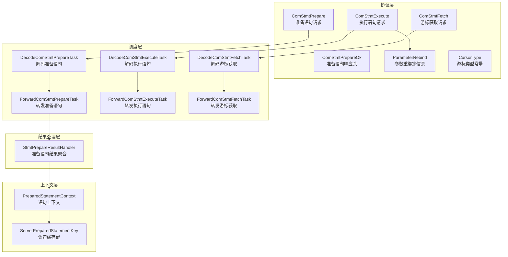
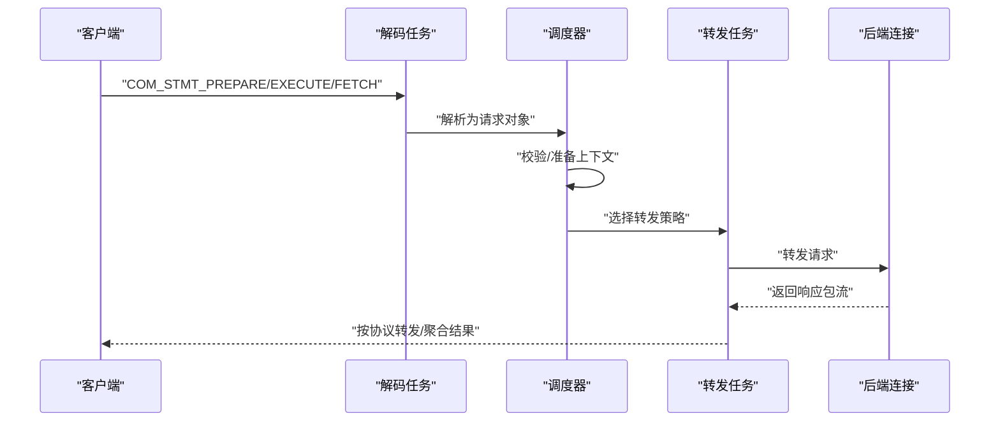
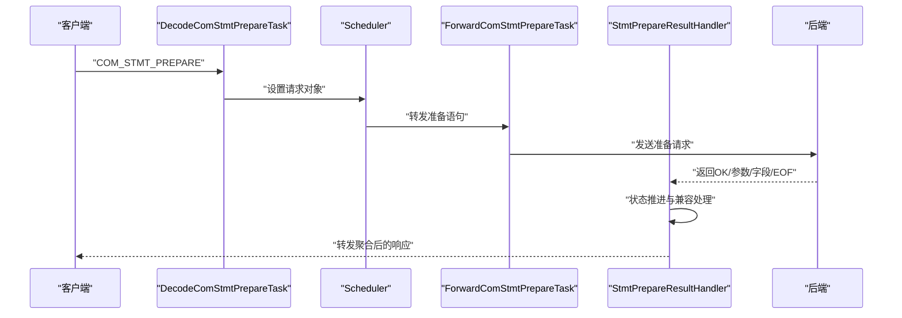
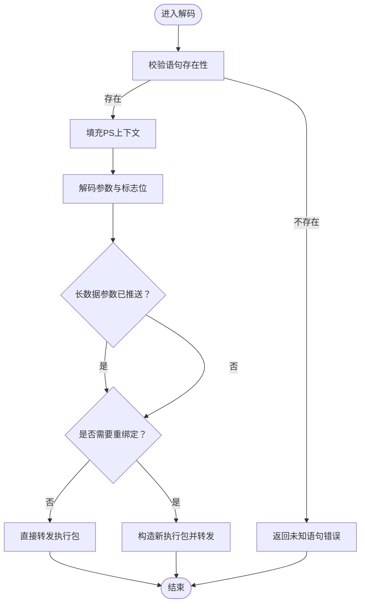
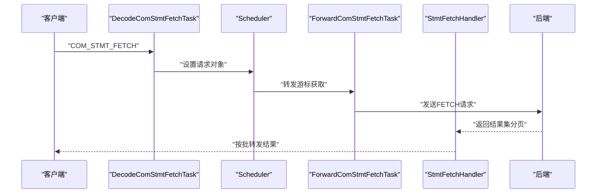
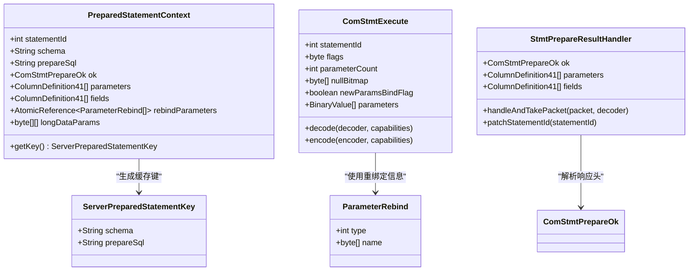

# 预处理语句命令

<cite>
**本文引用的文件**
- [proxy-core/src/main/java/com/alibaba/polardbx/proxy/protocol/prepare/ComStmtPrepare.java](file://proxy-core/src/main/java/com/alibaba/polardbx/proxy/protocol/prepare/ComStmtPrepare.java)
- [proxy-core/src/main/java/com/alibaba/polardbx/proxy/protocol/prepare/ComStmtExecute.java](file://proxy-core/src/main/java/com/alibaba/polardbx/proxy/protocol/prepare/ComStmtExecute.java)
- [proxy-core/src/main/java/com/alibaba/polardbx/proxy/protocol/prepare/ComStmtFetch.java](file://proxy-core/src/main/java/com/alibaba/polardbx/proxy/protocol/prepare/ComStmtFetch.java)
- [proxy-core/src/main/java/com/alibaba/polardbx/proxy/protocol/prepare/ComStmtPrepareOk.java](file://proxy-core/src/main/java/com/alibaba/polardbx/proxy/protocol/prepare/ComStmtPrepareOk.java)
- [proxy-core/src/main/java/com/alibaba/polardbx/proxy/protocol/prepare/ParameterRebind.java](file://proxy-core/src/main/java/com/alibaba/polardbx/proxy/protocol/prepare/ParameterRebind.java)
- [proxy-core/src/main/java/com/alibaba/polardbx/proxy/protocol/prepare/CursorType.java](file://proxy-core/src/main/java/com/alibaba/polardbx/proxy/protocol/prepare/CursorType.java)
- [proxy-core/src/main/java/com/alibaba/polardbx/proxy/context/help/PreparedStatementContext.java](file://proxy-core/src/main/java/com/alibaba/polardbx/proxy/context/help/PreparedStatementContext.java)
- [proxy-core/src/main/java/com/alibaba/polardbx/proxy/context/help/ServerPreparedStatementKey.java](file://proxy-core/src/main/java/com/alibaba/polardbx/proxy/context/help/ServerPreparedStatementKey.java)
- [proxy-core/src/main/java/com/alibaba/polardbx/proxy/scheduler/DecodeComStmtPrepareTask.java](file://proxy-core/src/main/java/com/alibaba/polardbx/proxy/scheduler/DecodeComStmtPrepareTask.java)
- [proxy-core/src/main/java/com/alibaba/polardbx/proxy/scheduler/DecodeComStmtExecuteTask.java](file://proxy-core/src/main/java/com/alibaba/polardbx/proxy/scheduler/DecodeComStmtExecuteTask.java)
- [proxy-core/src/main/java/com/alibaba/polardbx/proxy/scheduler/DecodeComStmtFetchTask.java](file://proxy-core/src/main/java/com/alibaba/polardbx/proxy/scheduler/DecodeComStmtFetchTask.java)
- [proxy-core/src/main/java/com/alibaba/polardbx/proxy/scheduler/ForwardComStmtPrepareTask.java](file://proxy-core/src/main/java/com/alibaba/polardbx/proxy/scheduler/ForwardComStmtPrepareTask.java)
- [proxy-core/src/main/java/com/alibaba/polardbx/proxy/scheduler/ForwardComStmtExecuteTask.java](file://proxy-core/src/main/java/com/alibaba/polardbx/proxy/scheduler/ForwardComStmtExecuteTask.java)
- [proxy-core/src/main/java/com/alibaba/polardbx/proxy/scheduler/ForwardComStmtFetchTask.java](file://proxy-core/src/main/java/com/alibaba/polardbx/proxy/scheduler/ForwardComStmtFetchTask.java)
- [proxy-core/src/main/java/com/alibaba/polardbx/proxy/protocol/handler/result/StmtPrepareResultHandler.java](file://proxy-core/src/main/java/com/alibaba/polardbx/proxy/protocol/handler/result/StmtPrepareResultHandler.java)
</cite>

## 目录
1. [简介](#简介)
2. [项目结构](#项目结构)
3. [核心组件](#核心组件)
4. [架构总览](#架构总览)
5. [组件详解](#组件详解)
6. [依赖关系分析](#依赖关系分析)
7. [性能考量与优化建议](#性能考量与优化建议)
8. [故障排查指南](#故障排查指南)
9. [结论](#结论)
10. [附录](#附录)

## 简介
本文件面向 PolarDB-X Proxy 的预处理语句（COM_STMT_*）命令处理，系统性梳理以下能力：
- COM_STMT_PREPARE：准备语句流程，覆盖 SQL 解析、参数绑定元数据收集、语句缓存键生成与记录。
- COM_STMT_EXECUTE：执行语句流程，覆盖参数重绑定、长数据参数推送、执行计划复用与结果转发。
- COM_STMT_FETCH：游标获取机制，覆盖批量数据传输、游标状态管理与内存优化策略。
- 性能优化：语句缓存、参数化查询、执行计划复用与日志参数长度控制。
- 调试与排障：关键路径日志、错误码与常见问题定位。

## 项目结构
围绕预处理语句的关键代码分布在如下模块：
- 协议层：定义与编解码 COM_STMT_* 包体的数据结构
- 上下文层：维护语句上下文、参数重绑定信息、长数据标记
- 调度层：解码任务与转发任务，串联前端请求与后端执行
- 结果处理层：准备语句阶段的多包聚合与兼容性处理

图表来源
- [proxy-core/src/main/java/com/alibaba/polardbx/proxy/protocol/prepare/ComStmtPrepare.java](file://proxy-core/src/main/java/com/alibaba/polardbx/proxy/protocol/prepare/ComStmtPrepare.java#L28-L56)
- [proxy-core/src/main/java/com/alibaba/polardbx/proxy/protocol/prepare/ComStmtExecute.java](file://proxy-core/src/main/java/com/alibaba/polardbx/proxy/protocol/prepare/ComStmtExecute.java#L41-L225)
- [proxy-core/src/main/java/com/alibaba/polardbx/proxy/protocol/prepare/ComStmtFetch.java](file://proxy-core/src/main/java/com/alibaba/polardbx/proxy/protocol/prepare/ComStmtFetch.java#L28-L63)
- [proxy-core/src/main/java/com/alibaba/polardbx/proxy/protocol/prepare/ComStmtPrepareOk.java](file://proxy-core/src/main/java/com/alibaba/polardbx/proxy/protocol/prepare/ComStmtPrepareOk.java#L33-L108)
- [proxy-core/src/main/java/com/alibaba/polardbx/proxy/protocol/prepare/ParameterRebind.java](file://proxy-core/src/main/java/com/alibaba/polardbx/proxy/protocol/prepare/ParameterRebind.java#L24-L33)
- [proxy-core/src/main/java/com/alibaba/polardbx/proxy/protocol/prepare/CursorType.java](file://proxy-core/src/main/java/com/alibaba/polardbx/proxy/protocol/prepare/CursorType.java#L21-L28)
- [proxy-core/src/main/java/com/alibaba/polardbx/proxy/context/help/PreparedStatementContext.java](file://proxy-core/src/main/java/com/alibaba/polardbx/proxy/context/help/PreparedStatementContext.java#L32-L78)
- [proxy-core/src/main/java/com/alibaba/polardbx/proxy/context/help/ServerPreparedStatementKey.java](file://proxy-core/src/main/java/com/alibaba/polardbx/proxy/context/help/ServerPreparedStatementKey.java#L26-L60)
- [proxy-core/src/main/java/com/alibaba/polardbx/proxy/scheduler/DecodeComStmtPrepareTask.java](file://proxy-core/src/main/java/com/alibaba/polardbx/proxy/scheduler/DecodeComStmtPrepareTask.java#L23-L34)
- [proxy-core/src/main/java/com/alibaba/polardbx/proxy/scheduler/ForwardComStmtPrepareTask.java](file://proxy-core/src/main/java/com/alibaba/polardbx/proxy/scheduler/ForwardComStmtPrepareTask.java#L29-L48)
- [proxy-core/src/main/java/com/alibaba/polardbx/proxy/scheduler/DecodeComStmtExecuteTask.java](file://proxy-core/src/main/java/com/alibaba/polardbx/proxy/scheduler/DecodeComStmtExecuteTask.java#L27-L68)
- [proxy-core/src/main/java/com/alibaba/polardbx/proxy/scheduler/ForwardComStmtExecuteTask.java](file://proxy-core/src/main/java/com/alibaba/polardbx/proxy/scheduler/ForwardComStmtExecuteTask.java#L33-L98)
- [proxy-core/src/main/java/com/alibaba/polardbx/proxy/scheduler/DecodeComStmtFetchTask.java](file://proxy-core/src/main/java/com/alibaba/polardbx/proxy/scheduler/DecodeComStmtFetchTask.java#L27-L58)
- [proxy-core/src/main/java/com/alibaba/polardbx/proxy/scheduler/ForwardComStmtFetchTask.java](file://proxy-core/src/main/java/com/alibaba/polardbx/proxy/scheduler/ForwardComStmtFetchTask.java#L29-L48)
- [proxy-core/src/main/java/com/alibaba/polardbx/proxy/protocol/handler/result/StmtPrepareResultHandler.java](file://proxy-core/src/main/java/com/alibaba/polardbx/proxy/protocol/handler/result/StmtPrepareResultHandler.java#L48-L279)

章节来源
- [proxy-core/src/main/java/com/alibaba/polardbx/proxy/protocol/prepare/ComStmtPrepare.java](file://proxy-core/src/main/java/com/alibaba/polardbx/proxy/protocol/prepare/ComStmtPrepare.java#L28-L56)
- [proxy-core/src/main/java/com/alibaba/polardbx/proxy/protocol/prepare/ComStmtExecute.java](file://proxy-core/src/main/java/com/alibaba/polardbx/proxy/protocol/prepare/ComStmtExecute.java#L41-L225)
- [proxy-core/src/main/java/com/alibaba/polardbx/proxy/protocol/prepare/ComStmtFetch.java](file://proxy-core/src/main/java/com/alibaba/polardbx/proxy/protocol/prepare/ComStmtFetch.java#L28-L63)
- [proxy-core/src/main/java/com/alibaba/polardbx/proxy/context/help/PreparedStatementContext.java](file://proxy-core/src/main/java/com/alibaba/polardbx/proxy/context/help/PreparedStatementContext.java#L32-L78)
- [proxy-core/src/main/java/com/alibaba/polardbx/proxy/context/help/ServerPreparedStatementKey.java](file://proxy-core/src/main/java/com/alibaba/polardbx/proxy/context/help/ServerPreparedStatementKey.java#L26-L60)
- [proxy-core/src/main/java/com/alibaba/polardbx/proxy/scheduler/DecodeComStmtPrepareTask.java](file://proxy-core/src/main/java/com/alibaba/polardbx/proxy/scheduler/DecodeComStmtPrepareTask.java#L23-L34)
- [proxy-core/src/main/java/com/alibaba/polardbx/proxy/scheduler/ForwardComStmtPrepareTask.java](file://proxy-core/src/main/java/com/alibaba/polardbx/proxy/scheduler/ForwardComStmtPrepareTask.java#L29-L48)
- [proxy-core/src/main/java/com/alibaba/polardbx/proxy/scheduler/DecodeComStmtExecuteTask.java](file://proxy-core/src/main/java/com/alibaba/polardbx/proxy/scheduler/DecodeComStmtExecuteTask.java#L27-L68)
- [proxy-core/src/main/java/com/alibaba/polardbx/proxy/scheduler/ForwardComStmtExecuteTask.java](file://proxy-core/src/main/java/com/alibaba/polardbx/proxy/scheduler/ForwardComStmtExecuteTask.java#L33-L98)
- [proxy-core/src/main/java/com/alibaba/polardbx/proxy/scheduler/DecodeComStmtFetchTask.java](file://proxy-core/src/main/java/com/alibaba/polardbx/proxy/scheduler/DecodeComStmtFetchTask.java#L27-L58)
- [proxy-core/src/main/java/com/alibaba/polardbx/proxy/scheduler/ForwardComStmtFetchTask.java](file://proxy-core/src/main/java/com/alibaba/polardbx/proxy/scheduler/ForwardComStmtFetchTask.java#L29-L48)
- [proxy-core/src/main/java/com/alibaba/polardbx/proxy/protocol/handler/result/StmtPrepareResultHandler.java](file://proxy-core/src/main/java/com/alibaba/polardbx/proxy/protocol/handler/result/StmtPrepareResultHandler.java#L48-L279)

## 核心组件
- 请求包体与编解码
  - 准备语句请求：字段包含命令字节与完整 SQL 字符串，负责触发后端解析与返回参数/列元数据。
  - 执行语句请求：包含语句 ID、标志位、迭代次数、参数计数、空值位图、是否新参数绑定、参数类型与名称、参数值等。
  - 游标获取请求：包含语句 ID 与要拉取的行数。
- 响应头与元数据
  - 准备语句响应头：包含语句 ID、列数、参数个数、告警数量、可选元数据跟随标志。
- 上下文与缓存键
  - 语句上下文：保存语句 ID、模式名、原始 SQL、准备响应头、参数与字段元数据、长数据参数标记、参数重绑定信息。
  - 缓存键：由模式名与原始 SQL 组成，用于后端连接级语句缓存命中与复用。
- 调度与转发
  - 解码任务：从网络包中解析出请求对象，填充到调度器。
  - 转发任务：根据请求类型选择对应转发逻辑，构建结果处理器，完成与后端的交互与回传。

章节来源
- [proxy-core/src/main/java/com/alibaba/polardbx/proxy/protocol/prepare/ComStmtPrepare.java](file://proxy-core/src/main/java/com/alibaba/polardbx/proxy/protocol/prepare/ComStmtPrepare.java#L28-L56)
- [proxy-core/src/main/java/com/alibaba/polardbx/proxy/protocol/prepare/ComStmtExecute.java](file://proxy-core/src/main/java/com/alibaba/polardbx/proxy/protocol/prepare/ComStmtExecute.java#L41-L225)
- [proxy-core/src/main/java/com/alibaba/polardbx/proxy/protocol/prepare/ComStmtFetch.java](file://proxy-core/src/main/java/com/alibaba/polardbx/proxy/protocol/prepare/ComStmtFetch.java#L28-L63)
- [proxy-core/src/main/java/com/alibaba/polardbx/proxy/protocol/prepare/ComStmtPrepareOk.java](file://proxy-core/src/main/java/com/alibaba/polardbx/proxy/protocol/prepare/ComStmtPrepareOk.java#L33-L108)
- [proxy-core/src/main/java/com/alibaba/polardbx/proxy/context/help/PreparedStatementContext.java](file://proxy-core/src/main/java/com/alibaba/polardbx/proxy/context/help/PreparedStatementContext.java#L32-L78)
- [proxy-core/src/main/java/com/alibaba/polardbx/proxy/context/help/ServerPreparedStatementKey.java](file://proxy-core/src/main/java/com/alibaba/polardbx/proxy/context/help/ServerPreparedStatementKey.java#L26-L60)

## 架构总览
预处理语句在 Proxy 中的处理遵循“解码—校验—转发—结果聚合”的通用流水线。不同命令在各阶段的差异主要体现在：
- 解码阶段：按协议格式解析请求包体。
- 校验阶段：检查语句是否存在、参数索引合法性、长数据参数是否已推送。
- 转发阶段：将请求转发至后端；若需要重绑定则先构造新的二进制包再转发。
- 结果聚合阶段：准备语句响应可能包含参数/字段元数据与 EOF，需按客户端能力进行兼容处理。

图表来源
- [proxy-core/src/main/java/com/alibaba/polardbx/proxy/scheduler/DecodeComStmtPrepareTask.java](file://proxy-core/src/main/java/com/alibaba/polardbx/proxy/scheduler/DecodeComStmtPrepareTask.java#L23-L34)
- [proxy-core/src/main/java/com/alibaba/polardbx/proxy/scheduler/ForwardComStmtPrepareTask.java](file://proxy-core/src/main/java/com/alibaba/polardbx/proxy/scheduler/ForwardComStmtPrepareTask.java#L29-L48)
- [proxy-core/src/main/java/com/alibaba/polardbx/proxy/scheduler/DecodeComStmtExecuteTask.java](file://proxy-core/src/main/java/com/alibaba/polardbx/proxy/scheduler/DecodeComStmtExecuteTask.java#L27-L68)
- [proxy-core/src/main/java/com/alibaba/polardbx/proxy/scheduler/ForwardComStmtExecuteTask.java](file://proxy-core/src/main/java/com/alibaba/polardbx/proxy/scheduler/ForwardComStmtExecuteTask.java#L33-L98)
- [proxy-core/src/main/java/com/alibaba/polardbx/proxy/scheduler/DecodeComStmtFetchTask.java](file://proxy-core/src/main/java/com/alibaba/polardbx/proxy/scheduler/DecodeComStmtFetchTask.java#L27-L58)
- [proxy-core/src/main/java/com/alibaba/polardbx/proxy/scheduler/ForwardComStmtFetchTask.java](file://proxy-core/src/main/java/com/alibaba/polardbx/proxy/scheduler/ForwardComStmtFetchTask.java#L29-L48)

## 组件详解

### COM_STMT_PREPARE：准备语句流程
- 解析与转发
  - 解码：读取命令字节与 SQL 字符串，确保命令正确。
  - 转发：构建准备语句结果处理器与回调，将请求转发至后端。
- 元数据收集与兼容处理
  - 多包聚合：准备响应可能包含参数元数据、字段元数据以及 EOF；当客户端不支持弃用 EOF 时，需要在参数/字段 EOF 后插入兼容 EOF 并调整序列号。
  - 状态机：通过内部状态推进，分别处理初始化、参数元数据、字段元数据、参数 EOF、字段 EOF 与最终 OK。
- 语句缓存键
  - 使用模式名与原始 SQL 作为缓存键，便于后端连接级语句缓存命中与复用。

图表来源
- [proxy-core/src/main/java/com/alibaba/polardbx/proxy/scheduler/DecodeComStmtPrepareTask.java](file://proxy-core/src/main/java/com/alibaba/polardbx/proxy/scheduler/DecodeComStmtPrepareTask.java#L23-L34)
- [proxy-core/src/main/java/com/alibaba/polardbx/proxy/scheduler/ForwardComStmtPrepareTask.java](file://proxy-core/src/main/java/com/alibaba/polardbx/proxy/scheduler/ForwardComStmtPrepareTask.java#L29-L48)
- [proxy-core/src/main/java/com/alibaba/polardbx/proxy/protocol/handler/result/StmtPrepareResultHandler.java](file://proxy-core/src/main/java/com/alibaba/polardbx/proxy/protocol/handler/result/StmtPrepareResultHandler.java#L111-L267)

章节来源
- [proxy-core/src/main/java/com/alibaba/polardbx/proxy/protocol/prepare/ComStmtPrepare.java](file://proxy-core/src/main/java/com/alibaba/polardbx/proxy/protocol/prepare/ComStmtPrepare.java#L28-L56)
- [proxy-core/src/main/java/com/alibaba/polardbx/proxy/protocol/prepare/ComStmtPrepareOk.java](file://proxy-core/src/main/java/com/alibaba/polardbx/proxy/protocol/prepare/ComStmtPrepareOk.java#L33-L108)
- [proxy-core/src/main/java/com/alibaba/polardbx/proxy/protocol/handler/result/StmtPrepareResultHandler.java](file://proxy-core/src/main/java/com/alibaba/polardbx/proxy/protocol/handler/result/StmtPrepareResultHandler.java#L148-L267)
- [proxy-core/src/main/java/com/alibaba/polardbx/proxy/context/help/ServerPreparedStatementKey.java](file://proxy-core/src/main/java/com/alibaba/polardbx/proxy/context/help/ServerPreparedStatementKey.java#L26-L60)

### COM_STMT_EXECUTE：执行语句处理
- 参数绑定与重绑定
  - 参数解码：根据参数计数、空值位图与新参数绑定标志决定是否解码参数值与参数类型/名称。
  - 重绑定：若存在参数重绑定信息或显式新参数绑定，则将当前参数类型/名称替换为最新定义。
- 长数据参数推送
  - 若某些参数使用长数据分片（通过 Send Long Data），执行前会将这些参数数据先推送至后端，避免与执行包混杂。
- 执行与结果转发
  - 若无需重绑定，直接转发执行包；否则构造新的二进制包并转发，同时复用查询结果处理器与回调。
- 日志参数长度控制
  - 提供参数日志字符串拼接，受配置项限制最大长度，避免日志膨胀。

图表来源
- [proxy-core/src/main/java/com/alibaba/polardbx/proxy/scheduler/DecodeComStmtExecuteTask.java](file://proxy-core/src/main/java/com/alibaba/polardbx/proxy/scheduler/DecodeComStmtExecuteTask.java#L27-L68)
- [proxy-core/src/main/java/com/alibaba/polardbx/proxy/scheduler/ForwardComStmtExecuteTask.java](file://proxy-core/src/main/java/com/alibaba/polardbx/proxy/scheduler/ForwardComStmtExecuteTask.java#L33-L98)
- [proxy-core/src/main/java/com/alibaba/polardbx/proxy/protocol/prepare/ComStmtExecute.java](file://proxy-core/src/main/java/com/alibaba/polardbx/proxy/protocol/prepare/ComStmtExecute.java#L80-L155)

章节来源
- [proxy-core/src/main/java/com/alibaba/polardbx/proxy/protocol/prepare/ComStmtExecute.java](file://proxy-core/src/main/java/com/alibaba/polardbx/proxy/protocol/prepare/ComStmtExecute.java#L41-L225)
- [proxy-core/src/main/java/com/alibaba/polardbx/proxy/context/help/PreparedStatementContext.java](file://proxy-core/src/main/java/com/alibaba/polardbx/proxy/context/help/PreparedStatementContext.java#L32-L78)
- [proxy-core/src/main/java/com/alibaba/polardbx/proxy/protocol/prepare/ParameterRebind.java](file://proxy-core/src/main/java/com/alibaba/polardbx/proxy/protocol/prepare/ParameterRebind.java#L24-L33)

### COM_STMT_FETCH：游标获取机制
- 请求解析
  - 解析语句 ID 与要获取的行数，前置校验语句存在性。
- 结果处理
  - 构建游标获取结果处理器与回调，将请求转发至后端，接收并按协议转发结果集分页数据。
- 批量传输与内存优化
  - 通过 num_rows 控制每次拉取的行数，减少单次内存占用峰值；结果按包流式转发，避免一次性缓冲全部结果。

图表来源
- [proxy-core/src/main/java/com/alibaba/polardbx/proxy/scheduler/DecodeComStmtFetchTask.java](file://proxy-core/src/main/java/com/alibaba/polardbx/proxy/scheduler/DecodeComStmtFetchTask.java#L27-L58)
- [proxy-core/src/main/java/com/alibaba/polardbx/proxy/scheduler/ForwardComStmtFetchTask.java](file://proxy-core/src/main/java/com/alibaba/polardbx/proxy/scheduler/ForwardComStmtFetchTask.java#L29-L48)
- [proxy-core/src/main/java/com/alibaba/polardbx/proxy/protocol/prepare/ComStmtFetch.java](file://proxy-core/src/main/java/com/alibaba/polardbx/proxy/protocol/prepare/ComStmtFetch.java#L28-L63)

章节来源
- [proxy-core/src/main/java/com/alibaba/polardbx/proxy/protocol/prepare/ComStmtFetch.java](file://proxy-core/src/main/java/com/alibaba/polardbx/proxy/protocol/prepare/ComStmtFetch.java#L28-L63)
- [proxy-core/src/main/java/com/alibaba/polardbx/proxy/scheduler/DecodeComStmtFetchTask.java](file://proxy-core/src/main/java/com/alibaba/polardbx/proxy/scheduler/DecodeComStmtFetchTask.java#L27-L58)
- [proxy-core/src/main/java/com/alibaba/polardbx/proxy/scheduler/ForwardComStmtFetchTask.java](file://proxy-core/src/main/java/com/alibaba/polardbx/proxy/scheduler/ForwardComStmtFetchTask.java#L29-L48)

## 依赖关系分析
- 类关系与职责
  - PreparedStatementContext：持有语句上下文、参数/字段元数据、长数据标记与参数重绑定信息，提供缓存键生成。
  - ServerPreparedStatementKey：以模式名与原始 SQL 作为缓存键，参与后端连接级语句缓存。
  - ComStmtExecute：在执行阶段根据 capabilities 与 flags 决定参数元数据与值的编码/解码行为。
  - StmtPrepareResultHandler：在准备阶段聚合参数/字段元数据与 EOF，处理客户端能力差异。
- 调度与转发耦合
  - 解码任务与转发任务通过调度器衔接，转发任务根据请求类型选择不同的结果处理器，保证执行链路清晰。

图表来源
- [proxy-core/src/main/java/com/alibaba/polardbx/proxy/context/help/PreparedStatementContext.java](file://proxy-core/src/main/java/com/alibaba/polardbx/proxy/context/help/PreparedStatementContext.java#L32-L78)
- [proxy-core/src/main/java/com/alibaba/polardbx/proxy/context/help/ServerPreparedStatementKey.java](file://proxy-core/src/main/java/com/alibaba/polardbx/proxy/context/help/ServerPreparedStatementKey.java#L26-L60)
- [proxy-core/src/main/java/com/alibaba/polardbx/proxy/protocol/prepare/ComStmtExecute.java](file://proxy-core/src/main/java/com/alibaba/polardbx/proxy/protocol/prepare/ComStmtExecute.java#L41-L225)
- [proxy-core/src/main/java/com/alibaba/polardbx/proxy/protocol/handler/result/StmtPrepareResultHandler.java](file://proxy-core/src/main/java/com/alibaba/polardbx/proxy/protocol/handler/result/StmtPrepareResultHandler.java#L48-L279)
- [proxy-core/src/main/java/com/alibaba/polardbx/proxy/protocol/prepare/ParameterRebind.java](file://proxy-core/src/main/java/com/alibaba/polardbx/proxy/protocol/prepare/ParameterRebind.java#L24-L33)

章节来源
- [proxy-core/src/main/java/com/alibaba/polardbx/proxy/context/help/PreparedStatementContext.java](file://proxy-core/src/main/java/com/alibaba/polardbx/proxy/context/help/PreparedStatementContext.java#L32-L78)
- [proxy-core/src/main/java/com/alibaba/polardbx/proxy/context/help/ServerPreparedStatementKey.java](file://proxy-core/src/main/java/com/alibaba/polardbx/proxy/context/help/ServerPreparedStatementKey.java#L26-L60)
- [proxy-core/src/main/java/com/alibaba/polardbx/proxy/protocol/prepare/ComStmtExecute.java](file://proxy-core/src/main/java/com/alibaba/polardbx/proxy/protocol/prepare/ComStmtExecute.java#L41-L225)
- [proxy-core/src/main/java/com/alibaba/polardbx/proxy/protocol/handler/result/StmtPrepareResultHandler.java](file://proxy-core/src/main/java/com/alibaba/polardbx/proxy/protocol/handler/result/StmtPrepareResultHandler.java#L48-L279)

## 性能考量与优化建议
- 语句缓存
  - 利用 ServerPreparedStatementKey（模式名+原始 SQL）实现后端连接级语句缓存，避免重复解析与优化。
- 参数化查询
  - 优先使用带参数占位符的 SQL，减少 SQL 拼接带来的缓存碎片与解析开销。
- 执行计划复用
  - 通过 PreparedStatementContext 记录的参数/字段元数据与重绑定信息，尽量避免频繁重绑定导致的额外编码成本。
- 日志参数长度控制
  - 执行参数日志字符串受配置项限制，防止大参数导致日志膨胀与 GC 压力。
- 批量游标获取
  - 通过 num_rows 控制每次拉取的行数，降低单次内存峰值与网络往返次数。

章节来源
- [proxy-core/src/main/java/com/alibaba/polardbx/proxy/context/help/ServerPreparedStatementKey.java](file://proxy-core/src/main/java/com/alibaba/polardbx/proxy/context/help/ServerPreparedStatementKey.java#L26-L60)
- [proxy-core/src/main/java/com/alibaba/polardbx/proxy/protocol/prepare/ComStmtExecute.java](file://proxy-core/src/main/java/com/alibaba/polardbx/proxy/protocol/prepare/ComStmtExecute.java#L193-L209)
- [proxy-core/src/main/java/com/alibaba/polardbx/proxy/protocol/prepare/ComStmtFetch.java](file://proxy-core/src/main/java/com/alibaba/polardbx/proxy/protocol/prepare/ComStmtFetch.java#L28-L63)

## 故障排查指南
- 未知语句错误
  - 当执行/游标获取时未找到语句上下文，返回“未知语句处理器”错误；检查是否已成功准备语句且语句 ID 正确。
- 参数索引越界
  - 执行阶段对参数索引进行校验，越界将抛出非法参数异常；确认参数计数与索引一致性。
- 长数据参数未推送
  - 若某些参数使用长数据分片，必须在执行前推送；否则可能导致后端解析异常。
- EOF 客户端能力差异
  - 准备语句阶段对弃用 EOF 的客户端进行兼容处理；若出现序列号错乱，检查客户端能力位与代理端处理逻辑。
- 日志参数过大
  - 执行参数日志受长度限制；如需查看更多细节，可在安全范围内临时放宽配置项。

章节来源
- [proxy-core/src/main/java/com/alibaba/polardbx/proxy/scheduler/DecodeComStmtExecuteTask.java](file://proxy-core/src/main/java/com/alibaba/polardbx/proxy/scheduler/DecodeComStmtExecuteTask.java#L36-L47)
- [proxy-core/src/main/java/com/alibaba/polardbx/proxy/scheduler/DecodeComStmtFetchTask.java](file://proxy-core/src/main/java/com/alibaba/polardbx/proxy/scheduler/DecodeComStmtFetchTask.java#L36-L47)
- [proxy-core/src/main/java/com/alibaba/polardbx/proxy/protocol/prepare/ComStmtExecute.java](file://proxy-core/src/main/java/com/alibaba/polardbx/proxy/protocol/prepare/ComStmtExecute.java#L117-L133)
- [proxy-core/src/main/java/com/alibaba/polardbx/proxy/protocol/handler/result/StmtPrepareResultHandler.java](file://proxy-core/src/main/java/com/alibaba/polardbx/proxy/protocol/handler/result/StmtPrepareResultHandler.java#L70-L101)

## 结论
PolarDB-X Proxy 对预处理语句的支持覆盖了从 SQL 解析、参数绑定、语句缓存到执行与游标的完整链路。通过明确的状态机与调度器协作，系统在兼容多客户端能力的同时，提供了参数重绑定、长数据推送与批量游标获取等高级特性。结合缓存键设计与日志参数长度控制，能够在保证稳定性的同时提升整体性能与可观测性。

## 附录
- 关键流程可视化（概念）
  - 准备语句：客户端 → 解码 → 转发 → 后端解析 → 元数据聚合 → 返回 OK/元数据
  - 执行语句：客户端 → 解码 → 参数重绑定（如有） → 推送长数据（如有） → 转发执行 → 结果转发
  - 游标获取：客户端 → 解码 → 转发 FETCH → 分页结果 → 批量返回