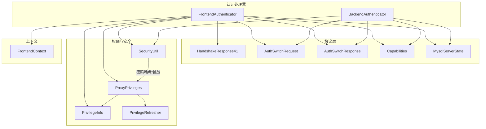
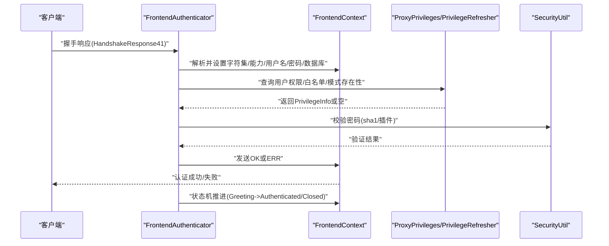
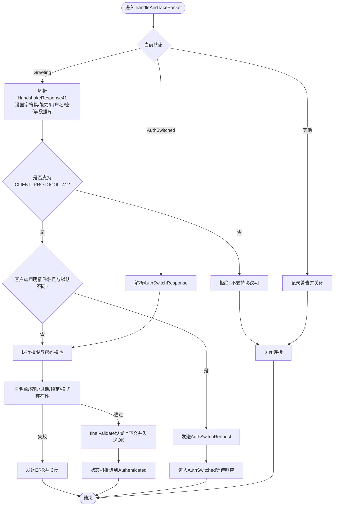
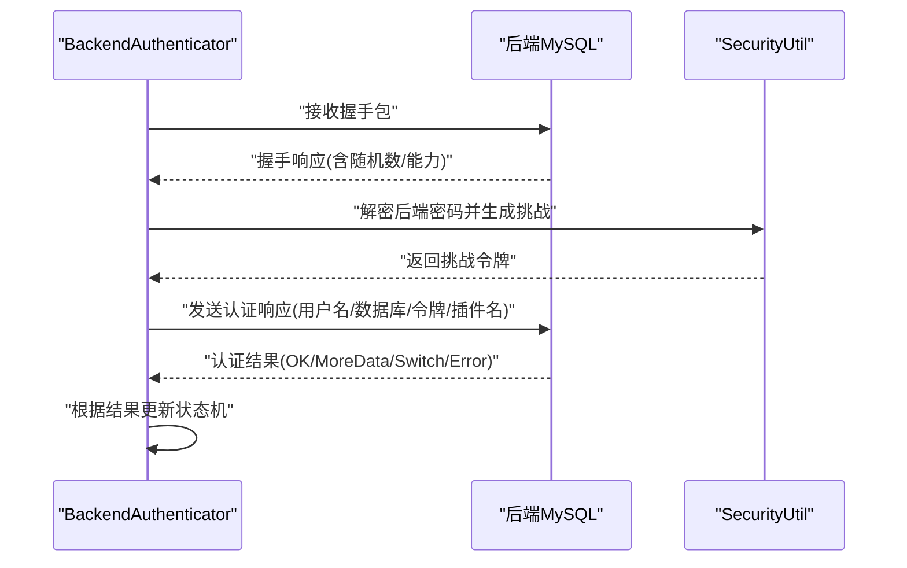
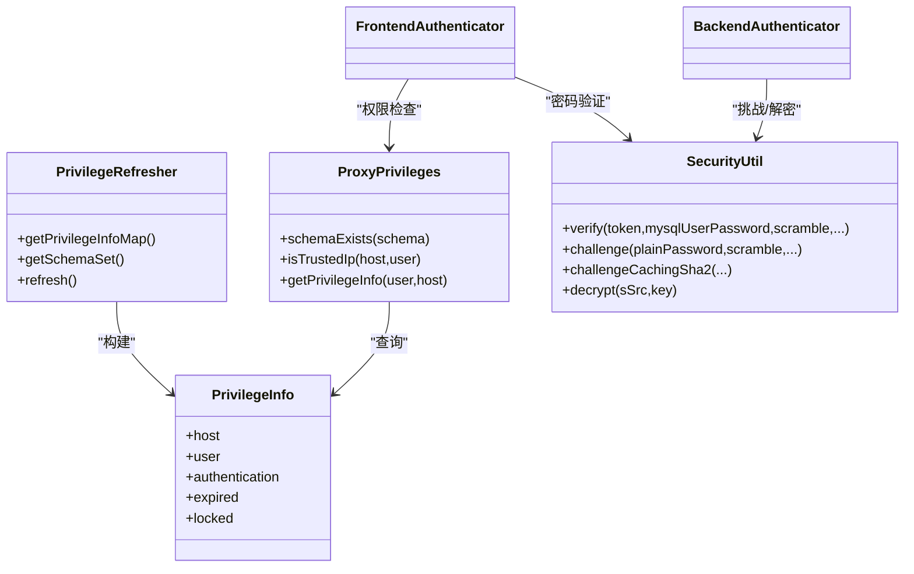
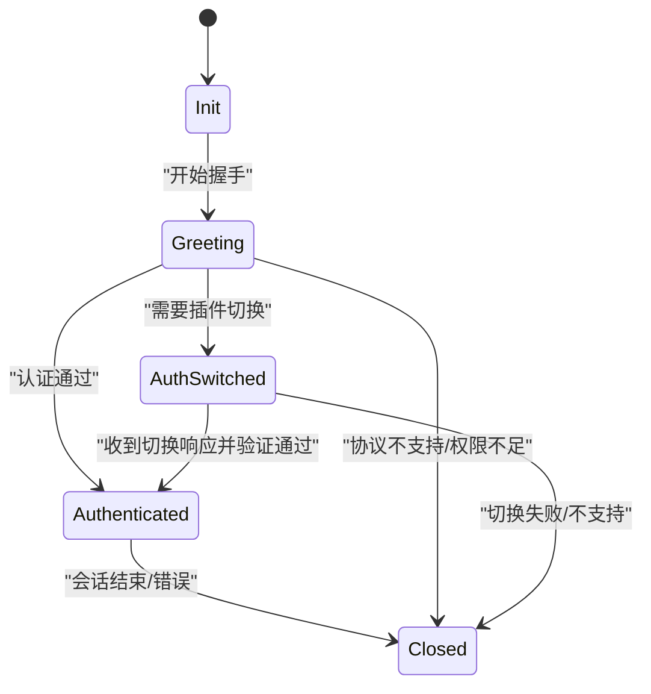
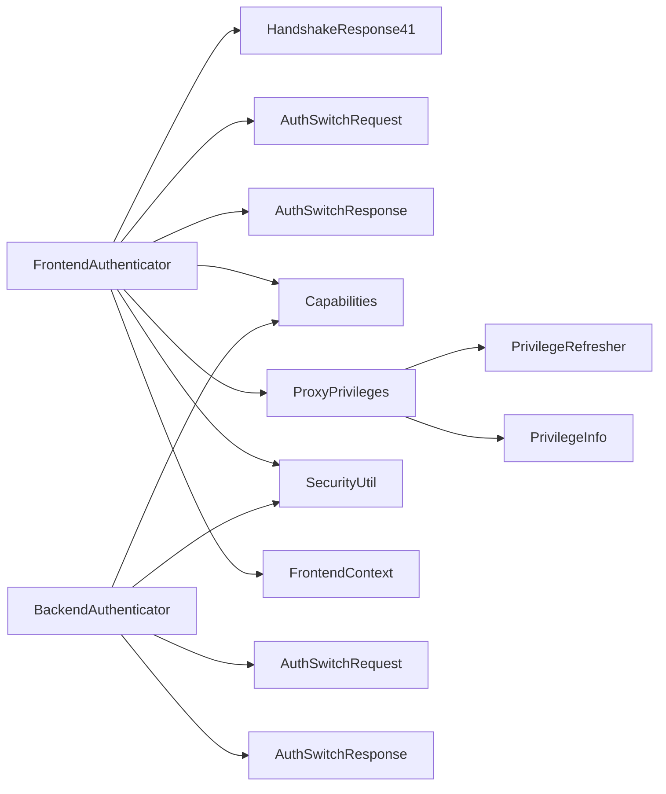

# 认证机制

<cite>
**本文引用的文件**
- [FrontendAuthenticator.java](file://proxy-core/src/main/java/com/alibaba/polardbx/proxy/protocol/handler/FrontendAuthenticator.java)
- [BackendAuthenticator.java](file://proxy-core/src/main/java/com/alibaba/polardbx/proxy/protocol/handler/BackendAuthenticator.java)
- [SecurityUtil.java](file://proxy-core/src/main/java/com/alibaba/polardbx/proxy/privilege/SecurityUtil.java)
- [ProxyPrivileges.java](file://proxy-core/src/main/java/com/alibaba/polardbx/proxy/privilege/ProxyPrivileges.java)
- [Privileges.java](file://proxy-core/src/main/java/com/alibaba/polardbx/proxy/privilege/Privileges.java)
- [PrivilegeInfo.java](file://proxy-core/src/main/java/com/alibaba/polardbx/proxy/privilege/PrivilegeInfo.java)
- [PrivilegeRefresher.java](file://proxy-core/src/main/java/com/alibaba/polardbx/proxy/privilege/PrivilegeRefresher.java)
- [HandshakeResponse41.java](file://proxy-core/src/main/java/com/alibaba/polardbx/proxy/protocol/connection/HandshakeResponse41.java)
- [AuthSwitchRequest.java](file://proxy-core/src/main/java/com/alibaba/polardbx/proxy/protocol/connection/AuthSwitchRequest.java)
- [AuthSwitchResponse.java](file://proxy-core/src/main/java/com/alibaba/polardbx/proxy/protocol/connection/AuthSwitchResponse.java)
- [Capabilities.java](file://proxy-core/src/main/java/com/alibaba/polardbx/proxy/protocol/connection/Capabilities.java)
- [MysqlServerState.java](file://proxy-core/src/main/java/com/alibaba/polardbx/proxy/protocol/common/MysqlServerState.java)
- [FrontendContext.java](file://proxy-core/src/main/java/com/alibaba/polardbx/proxy/context/FrontendContext.java)
- [config.properties（服务端）](file://proxy-server/src/main/conf/config.properties)
- [config.properties（公共）](file://proxy-common/src/main/resources/config.properties)
</cite>

## 目录
1. [简介](#简介)
2. [项目结构](#项目结构)
3. [核心组件](#核心组件)
4. [架构总览](#架构总览)
5. [详细组件分析](#详细组件分析)
6. [依赖关系分析](#依赖关系分析)
7. [性能考量](#性能考量)
8. [故障排查指南](#故障排查指南)
9. [结论](#结论)
10. [附录](#附录)

## 简介
本文件系统性阐述 PolarDB-X Proxy 的认证机制，重点覆盖前端认证器 FrontendAuthenticator 与后端认证器 BackendAuthenticator 的实现原理，涵盖：
- MySQL 4.1+ 握手流程与状态机
- 用户名/密码校验与权限检查
- 多因素认证与插件认证支持
- 信任 IP 白名单机制
- 密码加密存储与验证、字符集处理
- 认证失败的错误处理与安全建议
- 常见问题排查方法与配置示例路径

## 项目结构
围绕认证的关键模块分布如下：
- 协议与握手：FrontendAuthenticator、BackendAuthenticator、HandshakeResponse41、AuthSwitchRequest、AuthSwitchResponse、Capabilities、MysqlServerState
- 权限与安全：Privileges 接口、ProxyPrivileges 实现、PrivilegeInfo、PrivilegeRefresher、SecurityUtil
- 上下文与输出：FrontendContext（封装 OK/ERR 包发送、状态切换）

图表来源
- [FrontendAuthenticator.java](file://proxy-core/src/main/java/com/alibaba/polardbx/proxy/protocol/handler/FrontendAuthenticator.java#L45-L203)
- [BackendAuthenticator.java](file://proxy-core/src/main/java/com/alibaba/polardbx/proxy/protocol/handler/BackendAuthenticator.java#L45-L212)
- [HandshakeResponse41.java](file://proxy-core/src/main/java/com/alibaba/polardbx/proxy/protocol/connection/HandshakeResponse41.java#L36-L243)
- [AuthSwitchRequest.java](file://proxy-core/src/main/java/com/alibaba/polardbx/proxy/protocol/connection/AuthSwitchRequest.java#L32-L85)
- [AuthSwitchResponse.java](file://proxy-core/src/main/java/com/alibaba/polardbx/proxy/protocol/connection/AuthSwitchResponse.java#L32-L63)
- [Capabilities.java](file://proxy-core/src/main/java/com/alibaba/polardbx/proxy/protocol/connection/Capabilities.java#L21-L82)
- [MysqlServerState.java](file://proxy-core/src/main/java/com/alibaba/polardbx/proxy/protocol/common/MysqlServerState.java#L21-L28)
- [ProxyPrivileges.java](file://proxy-core/src/main/java/com/alibaba/polardbx/proxy/privilege/ProxyPrivileges.java#L25-L75)
- [PrivilegeInfo.java](file://proxy-core/src/main/java/com/alibaba/polardbx/proxy/privilege/PrivilegeInfo.java#L24-L46)
- [PrivilegeRefresher.java](file://proxy-core/src/main/java/com/alibaba/polardbx/proxy/privilege/PrivilegeRefresher.java#L41-L224)
- [SecurityUtil.java](file://proxy-core/src/main/java/com/alibaba/polardbx/proxy/privilege/SecurityUtil.java#L33-L236)
- [FrontendContext.java](file://proxy-core/src/main/java/com/alibaba/polardbx/proxy/context/FrontendContext.java#L45-L308)

章节来源
- [FrontendAuthenticator.java](file://proxy-core/src/main/java/com/alibaba/polardbx/proxy/protocol/handler/FrontendAuthenticator.java#L45-L203)
- [BackendAuthenticator.java](file://proxy-core/src/main/java/com/alibaba/polardbx/proxy/protocol/handler/BackendAuthenticator.java#L45-L212)
- [HandshakeResponse41.java](file://proxy-core/src/main/java/com/alibaba/polardbx/proxy/protocol/connection/HandshakeResponse41.java#L36-L243)
- [AuthSwitchRequest.java](file://proxy-core/src/main/java/com/alibaba/polardbx/proxy/protocol/connection/AuthSwitchRequest.java#L32-L85)
- [AuthSwitchResponse.java](file://proxy-core/src/main/java/com/alibaba/polardbx/proxy/protocol/connection/AuthSwitchResponse.java#L32-L63)
- [Capabilities.java](file://proxy-core/src/main/java/com/alibaba/polardbx/proxy/protocol/connection/Capabilities.java#L21-L82)
- [MysqlServerState.java](file://proxy-core/src/main/java/com/alibaba/polardbx/proxy/protocol/common/MysqlServerState.java#L21-L28)
- [ProxyPrivileges.java](file://proxy-core/src/main/java/com/alibaba/polardbx/proxy/privilege/ProxyPrivileges.java#L25-L75)
- [PrivilegeInfo.java](file://proxy-core/src/main/java/com/alibaba/polardbx/proxy/privilege/PrivilegeInfo.java#L24-L46)
- [PrivilegeRefresher.java](file://proxy-core/src/main/java/com/alibaba/polardbx/proxy/privilege/PrivilegeRefresher.java#L41-L224)
- [SecurityUtil.java](file://proxy-core/src/main/java/com/alibaba/polardbx/proxy/privilege/SecurityUtil.java#L33-L236)
- [FrontendContext.java](file://proxy-core/src/main/java/com/alibaba/polardbx/proxy/context/FrontendContext.java#L45-L308)

## 核心组件
- FrontendAuthenticator：负责与前端客户端的握手、认证与状态推进，支持插件认证切换与多因素认证提示。
- BackendAuthenticator：负责与后端 MySQL 的握手、认证与状态推进，支持插件认证切换与缓存 SHA2 插件挑战。
- SecurityUtil：提供 mysql_native_password 的密码哈希/验证、caching_sha2_password 的挑战计算、以及后端密码的加解密工具。
- ProxyPrivileges/PrivilegeRefresher/PrivilegeInfo：提供用户权限信息加载、白名单匹配、密码过期/锁定检查、模式存在性校验等。
- FrontendContext：封装 OK/ERR 包发送、状态机推进、字符集设置与上下文管理。

章节来源
- [FrontendAuthenticator.java](file://proxy-core/src/main/java/com/alibaba/polardbx/proxy/protocol/handler/FrontendAuthenticator.java#L45-L203)
- [BackendAuthenticator.java](file://proxy-core/src/main/java/com/alibaba/polardbx/proxy/protocol/handler/BackendAuthenticator.java#L45-L212)
- [SecurityUtil.java](file://proxy-core/src/main/java/com/alibaba/polardbx/proxy/privilege/SecurityUtil.java#L33-L236)
- [ProxyPrivileges.java](file://proxy-core/src/main/java/com/alibaba/polardbx/proxy/privilege/ProxyPrivileges.java#L25-L75)
- [PrivilegeRefresher.java](file://proxy-core/src/main/java/com/alibaba/polardbx/proxy/privilege/PrivilegeRefresher.java#L41-L224)
- [PrivilegeInfo.java](file://proxy-core/src/main/java/com/alibaba/polardbx/proxy/privilege/PrivilegeInfo.java#L24-L46)
- [FrontendContext.java](file://proxy-core/src/main/java/com/alibaba/polardbx/proxy/context/FrontendContext.java#L45-L308)

## 架构总览
认证分为“前端握手与权限校验”和“后端握手与认证”两个阶段，由各自认证器驱动状态机推进，并通过上下文与权限模块完成最终授权。

图表来源
- [FrontendAuthenticator.java](file://proxy-core/src/main/java/com/alibaba/polardbx/proxy/protocol/handler/FrontendAuthenticator.java#L137-L201)
- [FrontendContext.java](file://proxy-core/src/main/java/com/alibaba/polardbx/proxy/context/FrontendContext.java#L58-L124)
- [ProxyPrivileges.java](file://proxy-core/src/main/java/com/alibaba/polardbx/proxy/privilege/ProxyPrivileges.java#L42-L65)
- [PrivilegeRefresher.java](file://proxy-core/src/main/java/com/alibaba/polardbx/proxy/privilege/PrivilegeRefresher.java#L111-L191)
- [SecurityUtil.java](file://proxy-core/src/main/java/com/alibaba/polardbx/proxy/privilege/SecurityUtil.java#L69-L82)

## 详细组件分析

### 前端认证器 FrontendAuthenticator
职责与流程要点：
- 解析客户端握手响应，提取用户名、密码、数据库、字符集、最大包大小与能力位。
- 校验客户端是否支持 MySQL 4.1+ 协议与必要的能力位。
- 若客户端声明了非默认认证插件，且不匹配默认插件，则发送认证切换请求，进入 AuthSwitched 状态等待客户端响应。
- 执行权限检查：信任 IP 白名单优先放行；否则根据用户与来源 IP 查找权限条目，检查密码、过期/锁定状态与目标 schema 存在性。
- 通过 finalValidate 设置上下文参数并发送 OK，或在失败时发送 ERR 并关闭连接。

图表来源
- [FrontendAuthenticator.java](file://proxy-core/src/main/java/com/alibaba/polardbx/proxy/protocol/handler/FrontendAuthenticator.java#L137-L201)
- [HandshakeResponse41.java](file://proxy-core/src/main/java/com/alibaba/polardbx/proxy/protocol/connection/HandshakeResponse41.java#L98-L157)
- [AuthSwitchRequest.java](file://proxy-core/src/main/java/com/alibaba/polardbx/proxy/protocol/connection/AuthSwitchRequest.java#L47-L57)
- [AuthSwitchResponse.java](file://proxy-core/src/main/java/com/alibaba/polardbx/proxy/protocol/connection/AuthSwitchResponse.java#L44-L47)
- [FrontendContext.java](file://proxy-core/src/main/java/com/alibaba/polardbx/proxy/context/FrontendContext.java#L58-L124)
- [MysqlServerState.java](file://proxy-core/src/main/java/com/alibaba/polardbx/proxy/protocol/common/MysqlServerState.java#L21-L28)

章节来源
- [FrontendAuthenticator.java](file://proxy-core/src/main/java/com/alibaba/polardbx/proxy/protocol/handler/FrontendAuthenticator.java#L67-L135)
- [HandshakeResponse41.java](file://proxy-core/src/main/java/com/alibaba/polardbx/proxy/protocol/connection/HandshakeResponse41.java#L98-L157)
- [AuthSwitchRequest.java](file://proxy-core/src/main/java/com/alibaba/polardbx/proxy/protocol/connection/AuthSwitchRequest.java#L47-L57)
- [AuthSwitchResponse.java](file://proxy-core/src/main/java/com/alibaba/polardbx/proxy/protocol/connection/AuthSwitchResponse.java#L44-L47)
- [FrontendContext.java](file://proxy-core/src/main/java/com/alibaba/polardbx/proxy/context/FrontendContext.java#L58-L124)
- [MysqlServerState.java](file://proxy-core/src/main/java/com/alibaba/polardbx/proxy/protocol/common/MysqlServerState.java#L21-L28)

### 后端认证器 BackendAuthenticator
职责与流程要点：
- 首次收到握手包时解析版本、连接 ID、能力位，确保支持 MySQL 4.1+。
- 使用本地配置的后端用户名/数据库与已加密的后端密码，结合后端随机数进行挑战计算，构造认证响应发送给后端。
- 处理后端返回的认证结果：成功、需要更多数据、认证插件切换、失败等，按类型推进状态机并记录错误信息。

图表来源
- [BackendAuthenticator.java](file://proxy-core/src/main/java/com/alibaba/polardbx/proxy/protocol/handler/BackendAuthenticator.java#L74-L210)
- [SecurityUtil.java](file://proxy-core/src/main/java/com/alibaba/polardbx/proxy/privilege/SecurityUtil.java#L101-L130)

章节来源
- [BackendAuthenticator.java](file://proxy-core/src/main/java/com/alibaba/polardbx/proxy/protocol/handler/BackendAuthenticator.java#L74-L210)
- [SecurityUtil.java](file://proxy-core/src/main/java/com/alibaba/polardbx/proxy/privilege/SecurityUtil.java#L101-L130)

### 权限与安全模块
- PrivilegeRefresher 定时从后端 MySQL 的系统表加载用户权限与模式集合，支持将 hex 字符串形式的密码还原为字节数组，或以“未知密码”策略拒绝访问。
- ProxyPrivileges 提供白名单判断、权限条目匹配、模式存在性检查与过期/锁定状态过滤。
- SecurityUtil 提供 mysql_native_password 的验证算法、caching_sha2_password 的挑战算法，以及后端密码的 AES 加解密工具。

图表来源
- [PrivilegeRefresher.java](file://proxy-core/src/main/java/com/alibaba/polardbx/proxy/privilege/PrivilegeRefresher.java#L111-L191)
- [ProxyPrivileges.java](file://proxy-core/src/main/java/com/alibaba/polardbx/proxy/privilege/ProxyPrivileges.java#L25-L75)
- [PrivilegeInfo.java](file://proxy-core/src/main/java/com/alibaba/polardbx/proxy/privilege/PrivilegeInfo.java#L24-L46)
- [SecurityUtil.java](file://proxy-core/src/main/java/com/alibaba/polardbx/proxy/privilege/SecurityUtil.java#L69-L130)
- [FrontendAuthenticator.java](file://proxy-core/src/main/java/com/alibaba/polardbx/proxy/protocol/handler/FrontendAuthenticator.java#L86-L135)
- [BackendAuthenticator.java](file://proxy-core/src/main/java/com/alibaba/polardbx/proxy/protocol/handler/BackendAuthenticator.java#L114-L134)

章节来源
- [PrivilegeRefresher.java](file://proxy-core/src/main/java/com/alibaba/polardbx/proxy/privilege/PrivilegeRefresher.java#L41-L224)
- [ProxyPrivileges.java](file://proxy-core/src/main/java/com/alibaba/polardbx/proxy/privilege/ProxyPrivileges.java#L25-L75)
- [PrivilegeInfo.java](file://proxy-core/src/main/java/com/alibaba/polardbx/proxy/privilege/PrivilegeInfo.java#L24-L46)
- [SecurityUtil.java](file://proxy-core/src/main/java/com/alibaba/polardbx/proxy/privilege/SecurityUtil.java#L33-L236)

### 认证状态机
- MysqlServerState 定义了初始化、问候、认证切换、已认证、关闭五种状态。
- FrontendAuthenticator 在握手解析后根据校验结果推进到 Authenticated 或 Closed。
- BackendAuthenticator 在发送认证响应后等待后端返回，依据结果推进到已认证或关闭。

图表来源
- [MysqlServerState.java](file://proxy-core/src/main/java/com/alibaba/polardbx/proxy/protocol/common/MysqlServerState.java#L21-L28)
- [FrontendAuthenticator.java](file://proxy-core/src/main/java/com/alibaba/polardbx/proxy/protocol/handler/FrontendAuthenticator.java#L144-L201)
- [BackendAuthenticator.java](file://proxy-core/src/main/java/com/alibaba/polardbx/proxy/protocol/handler/BackendAuthenticator.java#L136-L210)

章节来源
- [MysqlServerState.java](file://proxy-core/src/main/java/com/alibaba/polardbx/proxy/protocol/common/MysqlServerState.java#L21-L28)
- [FrontendAuthenticator.java](file://proxy-core/src/main/java/com/alibaba/polardbx/proxy/protocol/handler/FrontendAuthenticator.java#L144-L201)
- [BackendAuthenticator.java](file://proxy-core/src/main/java/com/alibaba/polardbx/proxy/protocol/handler/BackendAuthenticator.java#L136-L210)

## 依赖关系分析
- FrontendAuthenticator 依赖：
  - 协议包体解析：HandshakeResponse41、AuthSwitchRequest/Response
  - 能力位：Capabilities
  - 权限与安全：ProxyPrivileges、PrivilegeRefresher、PrivilegeInfo、SecurityUtil
  - 上下文：FrontendContext（OK/ERR 发送、状态推进）
- BackendAuthenticator 依赖：
  - 握手解析与认证响应构造
  - SecurityUtil（挑战/解密）
  - 能力位与状态机

图表来源
- [FrontendAuthenticator.java](file://proxy-core/src/main/java/com/alibaba/polardbx/proxy/protocol/handler/FrontendAuthenticator.java#L45-L203)
- [BackendAuthenticator.java](file://proxy-core/src/main/java/com/alibaba/polardbx/proxy/protocol/handler/BackendAuthenticator.java#L45-L212)
- [HandshakeResponse41.java](file://proxy-core/src/main/java/com/alibaba/polardbx/proxy/protocol/connection/HandshakeResponse41.java#L36-L243)
- [AuthSwitchRequest.java](file://proxy-core/src/main/java/com/alibaba/polardbx/proxy/protocol/connection/AuthSwitchRequest.java#L32-L85)
- [AuthSwitchResponse.java](file://proxy-core/src/main/java/com/alibaba/polardbx/proxy/protocol/connection/AuthSwitchResponse.java#L32-L63)
- [Capabilities.java](file://proxy-core/src/main/java/com/alibaba/polardbx/proxy/protocol/connection/Capabilities.java#L21-L82)
- [ProxyPrivileges.java](file://proxy-core/src/main/java/com/alibaba/polardbx/proxy/privilege/ProxyPrivileges.java#L25-L75)
- [PrivilegeRefresher.java](file://proxy-core/src/main/java/com/alibaba/polardbx/proxy/privilege/PrivilegeRefresher.java#L41-L224)
- [PrivilegeInfo.java](file://proxy-core/src/main/java/com/alibaba/polardbx/proxy/privilege/PrivilegeInfo.java#L24-L46)
- [SecurityUtil.java](file://proxy-core/src/main/java/com/alibaba/polardbx/proxy/privilege/SecurityUtil.java#L33-L236)
- [FrontendContext.java](file://proxy-core/src/main/java/com/alibaba/polardbx/proxy/context/FrontendContext.java#L45-L308)

章节来源
- [FrontendAuthenticator.java](file://proxy-core/src/main/java/com/alibaba/polardbx/proxy/protocol/handler/FrontendAuthenticator.java#L45-L203)
- [BackendAuthenticator.java](file://proxy-core/src/main/java/com/alibaba/polardbx/proxy/protocol/handler/BackendAuthenticator.java#L45-L212)

## 性能考量
- 连接态快速路径：FrontendContext 在满足条件时可直接发送优化的 OK 序列包，减少序列号与状态标志编码开销。
- 线程局部消息摘要：SecurityUtil 使用 ThreadLocal 缓存 SHA-1/SHA-256，降低对象分配与初始化成本。
- 权限刷新：PrivilegeRefresher 以守护线程定时拉取权限与模式列表，避免每次认证重复查询。

章节来源
- [FrontendContext.java](file://proxy-core/src/main/java/com/alibaba/polardbx/proxy/context/FrontendContext.java#L87-L114)
- [SecurityUtil.java](file://proxy-core/src/main/java/com/alibaba/polardbx/proxy/privilege/SecurityUtil.java#L34-L47)
- [PrivilegeRefresher.java](file://proxy-core/src/main/java/com/alibaba/polardbx/proxy/privilege/PrivilegeRefresher.java#L111-L191)

## 故障排查指南
常见问题与定位思路：
- 协议不兼容
  - 现象：握手阶段即被拒绝
  - 排查：确认客户端是否携带 CLIENT_PROTOCOL_41 能力位；查看 FrontendAuthenticator 对协议能力的校验逻辑
  - 参考：[FrontendAuthenticator.java](file://proxy-core/src/main/java/com/alibaba/polardbx/proxy/protocol/handler/FrontendAuthenticator.java#L166-L172)
- 字符集不支持
  - 现象：握手阶段因字符集不支持而拒绝
  - 排查：确认客户端字符集是否在代理支持范围内；查看 FrontendContext 的字符集设置与回退逻辑
  - 参考：[FrontendAuthenticator.java](file://proxy-core/src/main/java/com/alibaba/polardbx/proxy/protocol/handler/FrontendAuthenticator.java#L150-L156)
- 插件认证不匹配
  - 现象：客户端声明插件与代理默认不一致，触发认证切换
  - 排查：确认客户端插件名与代理默认插件一致性；若需切换，确保代理能正确处理切换响应
  - 参考：[FrontendAuthenticator.java](file://proxy-core/src/main/java/com/alibaba/polardbx/proxy/protocol/handler/FrontendAuthenticator.java#L175-L186)
- 密码错误或未配置
  - 现象：认证失败，返回访问被拒绝
  - 排查：核对 PrivilegeRefresher 加载的 authentication_string 是否为 hex 字节串；确认 SecurityUtil 的验证算法输入参数（种子长度、截断处理）
  - 参考：[SecurityUtil.java](file://proxy-core/src/main/java/com/alibaba/polardbx/proxy/privilege/SecurityUtil.java#L69-L82)、[PrivilegeRefresher.java](file://proxy-core/src/main/java/com/alibaba/polardbx/proxy/privilege/PrivilegeRefresher.java#L127-L141)
- 白名单与权限
  - 现象：来自特定 IP 的用户被拒绝
  - 排查：确认 ProxyPrivileges 的 isTrustedIp 与 PrivilegeRefresher 的 Netmask 匹配逻辑
  - 参考：[ProxyPrivileges.java](file://proxy-core/src/main/java/com/alibaba/polardbx/proxy/privilege/ProxyPrivileges.java#L42-L44)、[PrivilegeRefresher.java](file://proxy-core/src/main/java/com/alibaba/polardbx/proxy/privilege/PrivilegeRefresher.java#L120-L148)
- 后端认证失败
  - 现象：后端返回错误或要求插件切换
  - 排查：检查 BackendAuthenticator 对后端返回包类型的处理；确认后端密码解密与挑战计算正确
  - 参考：[BackendAuthenticator.java](file://proxy-core/src/main/java/com/alibaba/polardbx/proxy/protocol/handler/BackendAuthenticator.java#L136-L210)、[SecurityUtil.java](file://proxy-core/src/main/java/com/alibaba/polardbx/proxy/privilege/SecurityUtil.java#L101-L130)

章节来源
- [FrontendAuthenticator.java](file://proxy-core/src/main/java/com/alibaba/polardbx/proxy/protocol/handler/FrontendAuthenticator.java#L137-L201)
- [BackendAuthenticator.java](file://proxy-core/src/main/java/com/alibaba/polardbx/proxy/protocol/handler/BackendAuthenticator.java#L74-L210)
- [SecurityUtil.java](file://proxy-core/src/main/java/com/alibaba/polardbx/proxy/privilege/SecurityUtil.java#L69-L130)
- [PrivilegeRefresher.java](file://proxy-core/src/main/java/com/alibaba/polardbx/proxy/privilege/PrivilegeRefresher.java#L111-L191)
- [ProxyPrivileges.java](file://proxy-core/src/main/java/com/alibaba/polardbx/proxy/privilege/ProxyPrivileges.java#L42-L44)

## 结论
PolarDB-X Proxy 的认证体系以“前端握手与权限校验 + 后端握手与认证”双通道实现，结合权限刷新、插件认证切换与安全工具，形成可扩展、可维护的认证框架。通过明确的状态机与严格的校验流程，既能保障安全性，又能在性能上通过快速路径与线程局部缓存获得优化。

## 附录

### 认证配置示例（路径指引）
- 前端端口与后端连接参数
  - 参考：[config.properties（服务端）](file://proxy-server/src/main/conf/config.properties#L31-L38)
- 权限刷新间隔与超时
  - 参考：[config.properties（服务端）](file://proxy-server/src/main/conf/config.properties#L80-L82)
- 全局工作线程与反应堆因子
  - 参考：[config.properties（公共）](file://proxy-common/src/main/resources/config.properties#L18-L22)

章节来源
- [config.properties（服务端）](file://proxy-server/src/main/conf/config.properties#L31-L38)
- [config.properties（服务端）](file://proxy-server/src/main/conf/config.properties#L80-L82)
- [config.properties（公共）](file://proxy-common/src/main/resources/config.properties#L18-L22)