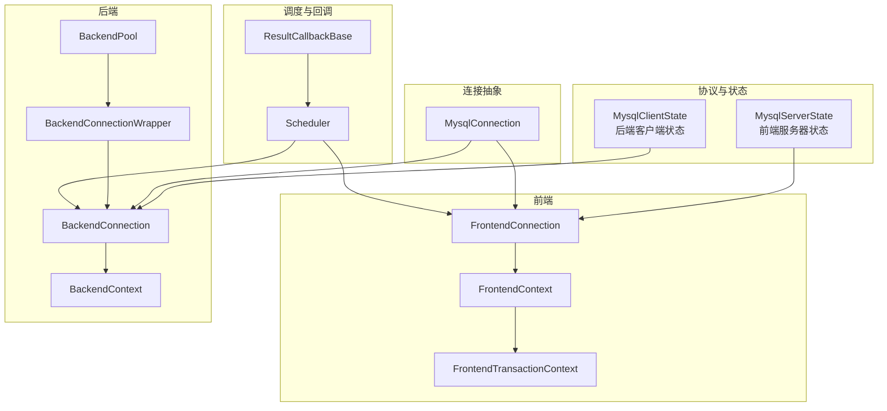
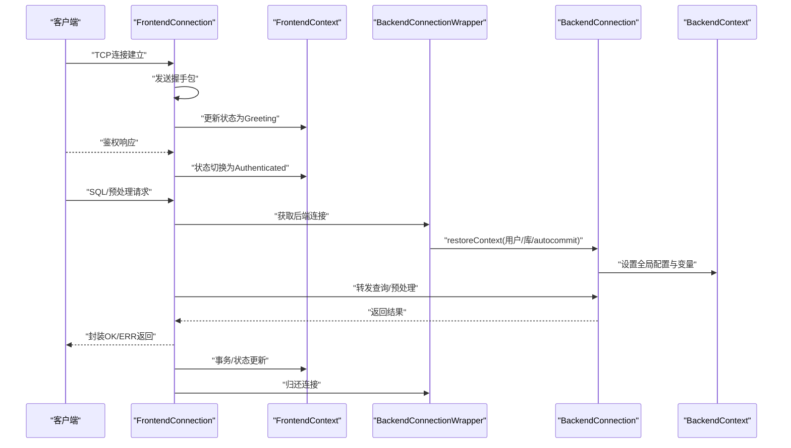
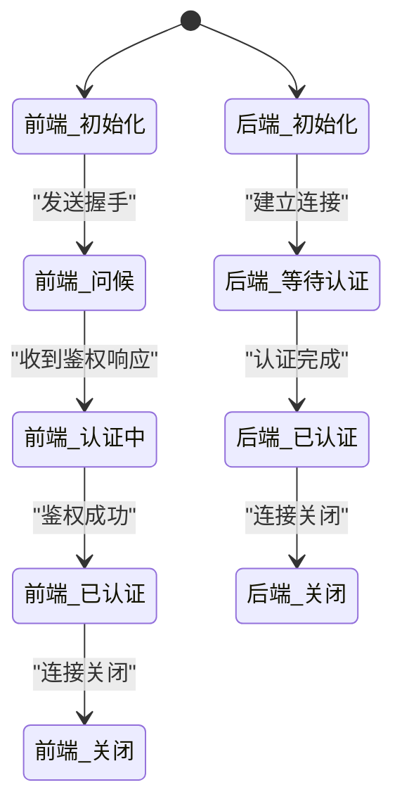
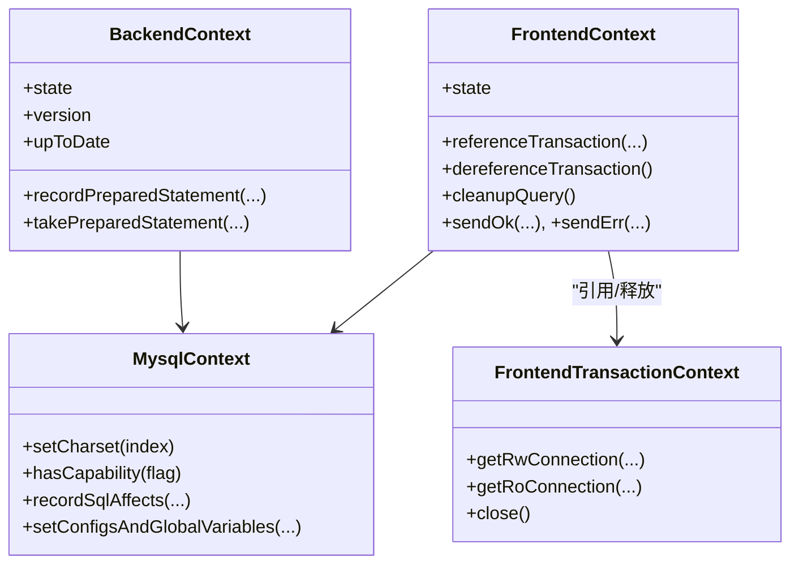
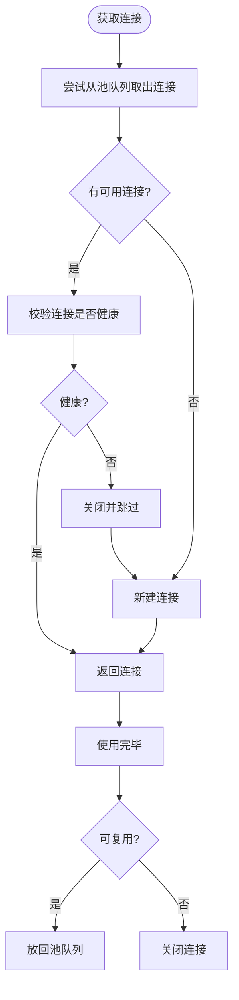
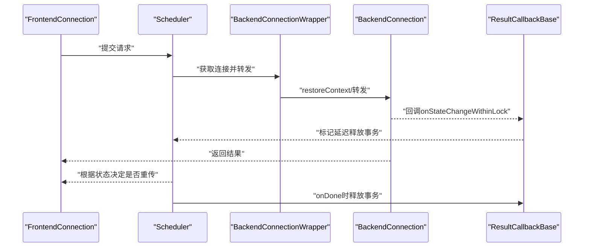
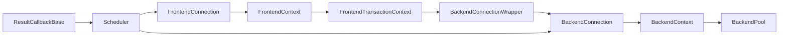

# 连接管理

<cite>
**本文引用的文件**
- [proxy-core/src/main/java/com/alibaba/polardbx/proxy/protocol/common/MysqlClientState.java](file://proxy-core/src/main/java/com/alibaba/polardbx/proxy/protocol/common/MysqlClientState.java)
- [proxy-core/src/main/java/com/alibaba/polardbx/proxy/protocol/common/MysqlServerState.java](file://proxy-core/src/main/java/com/alibaba/polardbx/proxy/protocol/common/MysqlServerState.java)
- [proxy-core/src/main/java/com/alibaba/polardbx/proxy/context/MysqlContext.java](file://proxy-core/src/main/java/com/alibaba/polardbx/proxy/context/MysqlContext.java)
- [proxy-core/src/main/java/com/alibaba/polardbx/proxy/context/FrontendContext.java](file://proxy-core/src/main/java/com/alibaba/polardbx/proxy/context/FrontendContext.java)
- [proxy-core/src/main/java/com/alibaba/polardbx/proxy/context/BackendContext.java](file://proxy-core/src/main/java/com/alibaba/polardbx/proxy/context/BackendContext.java)
- [proxy-core/src/main/java/com/alibaba/polardbx/proxy/context/transaction/FrontendTransactionContext.java](file://proxy-core/src/main/java/com/alibaba/polardbx/proxy/context/transaction/FrontendTransactionContext.java)
- [proxy-core/src/main/java/com/alibaba/polardbx/proxy/connection/MysqlConnection.java](file://proxy-core/src/main/java/com/alibaba/polardbx/proxy/connection/MysqlConnection.java)
- [proxy-core/src/main/java/com/alibaba/polardbx/proxy/connection/FrontendConnection.java](file://proxy-core/src/main/java/com/alibaba/polardbx/proxy/connection/FrontendConnection.java)
- [proxy-core/src/main/java/com/alibaba/polardbx/proxy/connection/BackendConnection.java](file://proxy-core/src/main/java/com/alibaba/polardbx/proxy/connection/BackendConnection.java)
- [proxy-core/src/main/java/com/alibaba/polardbx/proxy/connection/pool/BackendPool.java](file://proxy-core/src/main/java/com/alibaba/polardbx/proxy/connection/pool/BackendPool.java)
- [proxy-core/src/main/java/com/alibaba/polardbx/proxy/connection/pool/BackendConnectionWrapper.java](file://proxy-core/src/main/java/com/alibaba/polardbx/proxy/connection/pool/BackendConnectionWrapper.java)
- [proxy-core/src/main/java/com/alibaba/polardbx/proxy/scheduler/Scheduler.java](file://proxy-core/src/main/java/com/alibaba/polardbx/proxy/scheduler/Scheduler.java)
- [proxy-core/src/main/java/com/alibaba/polardbx/proxy/callback/ResultCallbackBase.java](file://proxy-core/src/main/java/com/alibaba/polardbx/proxy/callback/ResultCallbackBase.java)
- [proxy-core/src/main/java/com/alibaba/polardbx/proxy/protocol/common/MysqlError.java](file://proxy-core/src/main/java/com/alibaba/polardbx/proxy/protocol/common/MysqlError.java)
- [proxy-common/src/main/java/com/alibaba/polardbx/proxy/config/ConfigProps.java](file://proxy-common/src/main/java/com/alibaba/polardbx/proxy/config/ConfigProps.java)
- [proxy-common/src/main/java/com/alibaba/polardbx/proxy/config/FastConfig.java](file://proxy-common/src/main/java/com/alibaba/polardbx/proxy/config/FastConfig.java)
</cite>

## 目录
1. [简介](#简介)
2. [项目结构](#项目结构)
3. [核心组件](#核心组件)
4. [架构总览](#架构总览)
5. [详细组件分析](#详细组件分析)
6. [依赖关系分析](#依赖关系分析)
7. [性能考量与调优](#性能考量与调优)
8. [故障排查指南](#故障排查指南)
9. [结论](#结论)

## 简介
本文件面向PolarDB-X Proxy的连接管理系统，系统性梳理前端连接（FrontendConnection）与后端连接（BackendConnection）的生命周期、状态机、上下文管理、连接池复用与回收策略，并给出性能调优与故障诊断建议。重点覆盖：
- 前端/后端状态机：MysqlClientState与MysqlServerState的状态定义与转换
- 上下文管理：FrontendContext与BackendContext的会话、事务、变量与预处理语句缓存
- 连接池：BackendPool的连接复用、空闲清理与全局变量刷新
- 异常与重传：调度器与回调在异常场景下的处理与恢复
- 性能与运维：连接数、缓冲区、并发控制与监控指标

## 项目结构
围绕连接管理的关键模块分布如下：
- 协议与状态：MysqlClientState、MysqlServerState
- 连接抽象：MysqlConnection
- 前端连接：FrontendConnection（握手、鉴权、命令处理）
- 后端连接：BackendConnection（认证、结果处理、查询/预处理转发）
- 上下文：MysqlContext、FrontendContext、BackendContext、FrontendTransactionContext
- 连接池：BackendPool、BackendConnectionWrapper
- 调度与回调：Scheduler、ResultCallbackBase
- 配置：ConfigProps、FastConfig

图示来源
- [proxy-core/src/main/java/com/alibaba/polardbx/proxy/protocol/common/MysqlServerState.java](file://proxy-core/src/main/java/com/alibaba/polardbx/proxy/protocol/common/MysqlServerState.java#L21-L27)
- [proxy-core/src/main/java/com/alibaba/polardbx/proxy/protocol/common/MysqlClientState.java](file://proxy-core/src/main/java/com/alibaba/polardbx/proxy/protocol/common/MysqlClientState.java#L21-L30)
- [proxy-core/src/main/java/com/alibaba/polardbx/proxy/connection/MysqlConnection.java](file://proxy-core/src/main/java/com/alibaba/polardbx/proxy/connection/MysqlConnection.java#L37-L158)
- [proxy-core/src/main/java/com/alibaba/polardbx/proxy/connection/FrontendConnection.java](file://proxy-core/src/main/java/com/alibaba/polardbx/proxy/connection/FrontendConnection.java#L47-L224)
- [proxy-core/src/main/java/com/alibaba/polardbx/proxy/context/FrontendContext.java](file://proxy-core/src/main/java/com/alibaba/polardbx/proxy/context/FrontendContext.java#L45-L308)
- [proxy-core/src/main/java/com/alibaba/polardbx/proxy/context/transaction/FrontendTransactionContext.java](file://proxy-core/src/main/java/com/alibaba/polardbx/proxy/context/transaction/FrontendTransactionContext.java#L41-L227)
- [proxy-core/src/main/java/com/alibaba/polardbx/proxy/connection/BackendConnection.java](file://proxy-core/src/main/java/com/alibaba/polardbx/proxy/connection/BackendConnection.java#L67-L813)
- [proxy-core/src/main/java/com/alibaba/polardbx/proxy/context/BackendContext.java](file://proxy-core/src/main/java/com/alibaba/polardbx/proxy/context/BackendContext.java#L37-L156)
- [proxy-core/src/main/java/com/alibaba/polardbx/proxy/connection/pool/BackendPool.java](file://proxy-core/src/main/java/com/alibaba/polardbx/proxy/connection/pool/BackendPool.java#L46-L284)
- [proxy-core/src/main/java/com/alibaba/polardbx/proxy/connection/pool/BackendConnectionWrapper.java](file://proxy-core/src/main/java/com/alibaba/polardbx/proxy/connection/pool/BackendConnectionWrapper.java#L44-L275)
- [proxy-core/src/main/java/com/alibaba/polardbx/proxy/scheduler/Scheduler.java](file://proxy-core/src/main/java/com/alibaba/polardbx/proxy/scheduler/Scheduler.java#L234-L266)
- [proxy-core/src/main/java/com/alibaba/polardbx/proxy/callback/ResultCallbackBase.java](file://proxy-core/src/main/java/com/alibaba/polardbx/proxy/callback/ResultCallbackBase.java#L46-L103)

章节来源
- [proxy-core/src/main/java/com/alibaba/polardbx/proxy/protocol/common/MysqlServerState.java](file://proxy-core/src/main/java/com/alibaba/polardbx/proxy/protocol/common/MysqlServerState.java#L21-L27)
- [proxy-core/src/main/java/com/alibaba/polardbx/proxy/protocol/common/MysqlClientState.java](file://proxy-core/src/main/java/com/alibaba/polardbx/proxy/protocol/common/MysqlClientState.java#L21-L30)
- [proxy-core/src/main/java/com/alibaba/polardbx/proxy/connection/MysqlConnection.java](file://proxy-core/src/main/java/com/alibaba/polardbx/proxy/connection/MysqlConnection.java#L37-L158)
- [proxy-core/src/main/java/com/alibaba/polardbx/proxy/connection/FrontendConnection.java](file://proxy-core/src/main/java/com/alibaba/polardbx/proxy/connection/FrontendConnection.java#L47-L224)
- [proxy-core/src/main/java/com/alibaba/polardbx/proxy/connection/BackendConnection.java](file://proxy-core/src/main/java/com/alibaba/polardbx/proxy/connection/BackendConnection.java#L67-L813)
- [proxy-core/src/main/java/com/alibaba/polardbx/proxy/context/FrontendContext.java](file://proxy-core/src/main/java/com/alibaba/polardbx/proxy/context/FrontendContext.java#L45-L308)
- [proxy-core/src/main/java/com/alibaba/polardbx/proxy/context/BackendContext.java](file://proxy-core/src/main/java/com/alibaba/polardbx/proxy/context/BackendContext.java#L37-L156)
- [proxy-core/src/main/java/com/alibaba/polardbx/proxy/context/transaction/FrontendTransactionContext.java](file://proxy-core/src/main/java/com/alibaba/polardbx/proxy/context/transaction/FrontendTransactionContext.java#L41-L227)
- [proxy-core/src/main/java/com/alibaba/polardbx/proxy/connection/pool/BackendPool.java](file://proxy-core/src/main/java/com/alibaba/polardbx/proxy/connection/pool/BackendPool.java#L46-L284)
- [proxy-core/src/main/java/com/alibaba/polardbx/proxy/connection/pool/BackendConnectionWrapper.java](file://proxy-core/src/main/java/com/alibaba/polardbx/proxy/connection/pool/BackendConnectionWrapper.java#L44-L275)
- [proxy-core/src/main/java/com/alibaba/polardbx/proxy/scheduler/Scheduler.java](file://proxy-core/src/main/java/com/alibaba/polardbx/proxy/scheduler/Scheduler.java#L234-L266)
- [proxy-core/src/main/java/com/alibaba/polardbx/proxy/callback/ResultCallbackBase.java](file://proxy-core/src/main/java/com/alibaba/polardbx/proxy/callback/ResultCallbackBase.java#L46-L103)

## 核心组件
- 状态机
  - MysqlServerState：前端服务器侧状态，用于描述握手、切换认证、已认证、关闭等阶段
  - MysqlClientState：后端客户端侧状态，用于描述初始化、等待认证、已认证、关闭等阶段
- 连接抽象
  - MysqlConnection：统一的MySQL协议连接基类，负责包探测、解码、编码与错误处理
- 前端连接与上下文
  - FrontendConnection：负责握手、鉴权、命令分发；持有FrontendContext
  - FrontendContext：保存会话状态、事务引用计数、查询上下文、预处理语句映射、状态标志位
  - FrontendTransactionContext：事务级连接持有与资源回收策略
- 后端连接与上下文
  - BackendConnection：负责后端认证、结果处理队列、待发送数据队列、查询/预处理转发
  - BackendContext：后端会话状态、版本、一致性标记、预处理语句LRU缓存
- 连接池
  - BackendPool：后端连接池，支持最大池大小、空闲连接清理、全局变量刷新
  - BackendConnectionWrapper：连接包装器，负责上下文恢复、自动释放与丢弃
- 调度与回调
  - Scheduler：请求调度与异常重传决策
  - ResultCallbackBase：结果回调与事务延迟释放

章节来源
- [proxy-core/src/main/java/com/alibaba/polardbx/proxy/protocol/common/MysqlServerState.java](file://proxy-core/src/main/java/com/alibaba/polardbx/proxy/protocol/common/MysqlServerState.java#L21-L27)
- [proxy-core/src/main/java/com/alibaba/polardbx/proxy/protocol/common/MysqlClientState.java](file://proxy-core/src/main/java/com/alibaba/polardbx/proxy/protocol/common/MysqlClientState.java#L21-L30)
- [proxy-core/src/main/java/com/alibaba/polardbx/proxy/connection/MysqlConnection.java](file://proxy-core/src/main/java/com/alibaba/polardbx/proxy/connection/MysqlConnection.java#L37-L158)
- [proxy-core/src/main/java/com/alibaba/polardbx/proxy/connection/FrontendConnection.java](file://proxy-core/src/main/java/com/alibaba/polardbx/proxy/connection/FrontendConnection.java#L47-L224)
- [proxy-core/src/main/java/com/alibaba/polardbx/proxy/context/FrontendContext.java](file://proxy-core/src/main/java/com/alibaba/polardbx/proxy/context/FrontendContext.java#L45-L308)
- [proxy-core/src/main/java/com/alibaba/polardbx/proxy/context/transaction/FrontendTransactionContext.java](file://proxy-core/src/main/java/com/alibaba/polardbx/proxy/context/transaction/FrontendTransactionContext.java#L41-L227)
- [proxy-core/src/main/java/com/alibaba/polardbx/proxy/connection/BackendConnection.java](file://proxy-core/src/main/java/com/alibaba/polardbx/proxy/connection/BackendConnection.java#L67-L813)
- [proxy-core/src/main/java/com/alibaba/polardbx/proxy/context/BackendContext.java](file://proxy-core/src/main/java/com/alibaba/polardbx/proxy/context/BackendContext.java#L37-L156)
- [proxy-core/src/main/java/com/alibaba/polardbx/proxy/connection/pool/BackendPool.java](file://proxy-core/src/main/java/com/alibaba/polardbx/proxy/connection/pool/BackendPool.java#L46-L284)
- [proxy-core/src/main/java/com/alibaba/polardbx/proxy/connection/pool/BackendConnectionWrapper.java](file://proxy-core/src/main/java/com/alibaba/polardbx/proxy/connection/pool/BackendConnectionWrapper.java#L44-L275)
- [proxy-core/src/main/java/com/alibaba/polardbx/proxy/scheduler/Scheduler.java](file://proxy-core/src/main/java/com/alibaba/polardbx/proxy/scheduler/Scheduler.java#L234-L266)
- [proxy-core/src/main/java/com/alibaba/polardbx/proxy/callback/ResultCallbackBase.java](file://proxy-core/src/main/java/com/alibaba/polardbx/proxy/callback/ResultCallbackBase.java#L46-L103)

## 架构总览
连接管理由“前端-后端”双侧状态机驱动，通过上下文在会话、事务、变量层面进行同步；连接池负责后端连接的复用与健康检查；调度器在异常时触发重传或终止。

图示来源
- [proxy-core/src/main/java/com/alibaba/polardbx/proxy/connection/FrontendConnection.java](file://proxy-core/src/main/java/com/alibaba/polardbx/proxy/connection/FrontendConnection.java#L88-L160)
- [proxy-core/src/main/java/com/alibaba/polardbx/proxy/context/FrontendContext.java](file://proxy-core/src/main/java/com/alibaba/polardbx/proxy/context/FrontendContext.java#L50-L124)
- [proxy-core/src/main/java/com/alibaba/polardbx/proxy/connection/pool/BackendConnectionWrapper.java](file://proxy-core/src/main/java/com/alibaba/polardbx/proxy/connection/pool/BackendConnectionWrapper.java#L165-L238)
- [proxy-core/src/main/java/com/alibaba/polardbx/proxy/connection/BackendConnection.java](file://proxy-core/src/main/java/com/alibaba/polardbx/proxy/connection/BackendConnection.java#L118-L200)
- [proxy-core/src/main/java/com/alibaba/polardbx/proxy/context/BackendContext.java](file://proxy-core/src/main/java/com/alibaba/polardbx/proxy/context/BackendContext.java#L40-L50)

## 详细组件分析

### 状态机设计：MysqlClientState 与 MysqlServerState
- MysqlServerState（前端侧）
  - 状态：Init → Greeting → AuthSwitched → Authenticated → Closed
  - 作用：描述前端到客户端的握手与认证流程，以及关闭路径
- MysqlClientState（后端侧）
  - 状态：Init → WaitAuth → Authenticated → Closed
  - 作用：描述后端到MySQL服务端的认证流程与关闭路径
- 关键点
  - FrontendConnection在握手成功后将FrontendContext状态置为Greeting，鉴权完成后置为Authenticated
  - BackendConnection在认证完成后将BackendContext状态置为Authenticated，并设置全局配置与变量
  - 任一端进入Closed状态均触发连接关闭流程

图示来源
- [proxy-core/src/main/java/com/alibaba/polardbx/proxy/protocol/common/MysqlServerState.java](file://proxy-core/src/main/java/com/alibaba/polardbx/proxy/protocol/common/MysqlServerState.java#L21-L27)
- [proxy-core/src/main/java/com/alibaba/polardbx/proxy/protocol/common/MysqlClientState.java](file://proxy-core/src/main/java/com/alibaba/polardbx/proxy/protocol/common/MysqlClientState.java#L21-L30)
- [proxy-core/src/main/java/com/alibaba/polardbx/proxy/connection/FrontendConnection.java](file://proxy-core/src/main/java/com/alibaba/polardbx/proxy/connection/FrontendConnection.java#L88-L111)
- [proxy-core/src/main/java/com/alibaba/polardbx/proxy/connection/BackendConnection.java](file://proxy-core/src/main/java/com/alibaba/polardbx/proxy/connection/BackendConnection.java#L118-L137)

章节来源
- [proxy-core/src/main/java/com/alibaba/polardbx/proxy/protocol/common/MysqlServerState.java](file://proxy-core/src/main/java/com/alibaba/polardbx/proxy/protocol/common/MysqlServerState.java#L21-L27)
- [proxy-core/src/main/java/com/alibaba/polardbx/proxy/protocol/common/MysqlClientState.java](file://proxy-core/src/main/java/com/alibaba/polardbx/proxy/protocol/common/MysqlClientState.java#L21-L30)
- [proxy-core/src/main/java/com/alibaba/polardbx/proxy/connection/FrontendConnection.java](file://proxy-core/src/main/java/com/alibaba/polardbx/proxy/connection/FrontendConnection.java#L88-L111)
- [proxy-core/src/main/java/com/alibaba/polardbx/proxy/connection/BackendConnection.java](file://proxy-core/src/main/java/com/alibaba/polardbx/proxy/connection/BackendConnection.java#L118-L137)

### 上下文管理：FrontendContext 与 BackendContext
- FrontendContext
  - 会话状态：状态标志位（事务、自动提交）、能力位、字符集、数据库、警告数
  - 事务管理：引用计数、事务上下文生命周期、清理与延迟释放
  - 查询上下文：单次查询的上下文创建与清理
  - 预处理语句：ID分配器与映射表
  - 发送OK/ERR：快速路径优化与状态标志生成
- BackendContext
  - 会话状态：状态、版本、一致性标记
  - 预处理语句LRU缓存：基于配置项的缓存大小与淘汰回调（关闭后端预处理语句）
  - 字符集与能力：与FrontendContext一致化
- MysqlContext
  - 统一的字符集、能力位、变量存储（用户变量、系统变量、只读配置、全局变量）
  - 状态合并与记录SQL影响（权限数据库变更、DB切换）

图示来源
- [proxy-core/src/main/java/com/alibaba/polardbx/proxy/context/MysqlContext.java](file://proxy-core/src/main/java/com/alibaba/polardbx/proxy/context/MysqlContext.java#L49-L266)
- [proxy-core/src/main/java/com/alibaba/polardbx/proxy/context/FrontendContext.java](file://proxy-core/src/main/java/com/alibaba/polardbx/proxy/context/FrontendContext.java#L45-L308)
- [proxy-core/src/main/java/com/alibaba/polardbx/proxy/context/BackendContext.java](file://proxy-core/src/main/java/com/alibaba/polardbx/proxy/context/BackendContext.java#L37-L156)
- [proxy-core/src/main/java/com/alibaba/polardbx/proxy/context/transaction/FrontendTransactionContext.java](file://proxy-core/src/main/java/com/alibaba/polardbx/proxy/context/transaction/FrontendTransactionContext.java#L41-L227)

章节来源
- [proxy-core/src/main/java/com/alibaba/polardbx/proxy/context/MysqlContext.java](file://proxy-core/src/main/java/com/alibaba/polardbx/proxy/context/MysqlContext.java#L49-L266)
- [proxy-core/src/main/java/com/alibaba/polardbx/proxy/context/FrontendContext.java](file://proxy-core/src/main/java/com/alibaba/polardbx/proxy/context/FrontendContext.java#L45-L308)
- [proxy-core/src/main/java/com/alibaba/polardbx/proxy/context/BackendContext.java](file://proxy-core/src/main/java/com/alibaba/polardbx/proxy/context/BackendContext.java#L37-L156)
- [proxy-core/src/main/java/com/alibaba/polardbx/proxy/context/transaction/FrontendTransactionContext.java](file://proxy-core/src/main/java/com/alibaba/polardbx/proxy/context/transaction/FrontendTransactionContext.java#L41-L227)

### 连接池：BackendPool 与 BackendConnectionWrapper
- BackendPool
  - 复用策略：从队列取连接，若不可用则新建；超过最大池大小则直接关闭
  - 空闲清理：按比例遍历空闲连接，执行轻量查询以验证健康，再放回池中
  - 全局变量刷新：周期性拉取后端全局变量并缓存
  - 并发控制：运行中连接计数、最大池大小、线程安全
- BackendConnectionWrapper
  - 生命周期：持有BackendConnection，负责restoreContext、转发、关闭/丢弃
  - 上下文恢复：用户切换、库切换、autocommit一致性校验
  - 自动释放：close时交还给BackendPool，discard时直接关闭

图示来源
- [proxy-core/src/main/java/com/alibaba/polardbx/proxy/connection/pool/BackendPool.java](file://proxy-core/src/main/java/com/alibaba/polardbx/proxy/connection/pool/BackendPool.java#L115-L165)
- [proxy-core/src/main/java/com/alibaba/polardbx/proxy/connection/pool/BackendConnectionWrapper.java](file://proxy-core/src/main/java/com/alibaba/polardbx/proxy/connection/pool/BackendConnectionWrapper.java#L254-L265)

章节来源
- [proxy-core/src/main/java/com/alibaba/polardbx/proxy/connection/pool/BackendPool.java](file://proxy-core/src/main/java/com/alibaba/polardbx/proxy/connection/pool/BackendPool.java#L46-L284)
- [proxy-core/src/main/java/com/alibaba/polardbx/proxy/connection/pool/BackendConnectionWrapper.java](file://proxy-core/src/main/java/com/alibaba/polardbx/proxy/connection/pool/BackendConnectionWrapper.java#L44-L275)

### 连接生命周期与异常恢复
- FrontendConnection
  - 握手与鉴权：发送握手包，进入Greeting；鉴权成功后进入Authenticated
  - 错误处理：handleAndTakePacket/finish中捕获异常并关闭连接
  - 资源释放：异步关闭鉴权器、命令处理器与FrontendContext
- BackendConnection
  - 认证与结果队列：认证期间将请求入队，认证完成后出队并写入
  - 错误处理：handleAndTakePacket/finish中捕获异常并关闭连接
  - 登录等待：FutureTask等待认证完成，失败时记录最后错误
- Scheduler 与 ResultCallbackBase
  - 异常重传：在未进入事务且处于有效状态时，允许对非事务请求进行重传
  - 事务内释放：当结果状态完成时，延迟释放FrontendTransactionContext

图示来源
- [proxy-core/src/main/java/com/alibaba/polardbx/proxy/connection/FrontendConnection.java](file://proxy-core/src/main/java/com/alibaba/polardbx/proxy/connection/FrontendConnection.java#L114-L160)
- [proxy-core/src/main/java/com/alibaba/polardbx/proxy/scheduler/Scheduler.java](file://proxy-core/src/main/java/com/alibaba/polardbx/proxy/scheduler/Scheduler.java#L234-L266)
- [proxy-core/src/main/java/com/alibaba/polardbx/proxy/callback/ResultCallbackBase.java](file://proxy-core/src/main/java/com/alibaba/polardbx/proxy/callback/ResultCallbackBase.java#L46-L103)
- [proxy-core/src/main/java/com/alibaba/polardbx/proxy/connection/BackendConnection.java](file://proxy-core/src/main/java/com/alibaba/polardbx/proxy/connection/BackendConnection.java#L290-L321)

章节来源
- [proxy-core/src/main/java/com/alibaba/polardbx/proxy/connection/FrontendConnection.java](file://proxy-core/src/main/java/com/alibaba/polardbx/proxy/connection/FrontendConnection.java#L114-L160)
- [proxy-core/src/main/java/com/alibaba/polardbx/proxy/scheduler/Scheduler.java](file://proxy-core/src/main/java/com/alibaba/polardbx/proxy/scheduler/Scheduler.java#L234-L266)
- [proxy-core/src/main/java/com/alibaba/polardbx/proxy/callback/ResultCallbackBase.java](file://proxy-core/src/main/java/com/alibaba/polardbx/proxy/callback/ResultCallbackBase.java#L46-L103)
- [proxy-core/src/main/java/com/alibaba/polardbx/proxy/connection/BackendConnection.java](file://proxy-core/src/main/java/com/alibaba/polardbx/proxy/connection/BackendConnection.java#L290-L321)

## 依赖关系分析
- 前端到后端：FrontendConnection → FrontendContext → FrontendTransactionContext → BackendConnectionWrapper → BackendConnection
- 后端到池：BackendConnection → BackendContext → BackendPool → BackendConnectionWrapper
- 调度与回调：Scheduler → FrontendConnection/BackendConnection；ResultCallbackBase在结果回调中参与事务释放

图示来源
- [proxy-core/src/main/java/com/alibaba/polardbx/proxy/connection/FrontendConnection.java](file://proxy-core/src/main/java/com/alibaba/polardbx/proxy/connection/FrontendConnection.java#L47-L86)
- [proxy-core/src/main/java/com/alibaba/polardbx/proxy/context/FrontendContext.java](file://proxy-core/src/main/java/com/alibaba/polardbx/proxy/context/FrontendContext.java#L130-L162)
- [proxy-core/src/main/java/com/alibaba/polardbx/proxy/context/transaction/FrontendTransactionContext.java](file://proxy-core/src/main/java/com/alibaba/polardbx/proxy/context/transaction/FrontendTransactionContext.java#L101-L137)
- [proxy-core/src/main/java/com/alibaba/polardbx/proxy/connection/pool/BackendConnectionWrapper.java](file://proxy-core/src/main/java/com/alibaba/polardbx/proxy/connection/pool/BackendConnectionWrapper.java#L44-L80)
- [proxy-core/src/main/java/com/alibaba/polardbx/proxy/connection/BackendConnection.java](file://proxy-core/src/main/java/com/alibaba/polardbx/proxy/connection/BackendConnection.java#L67-L109)
- [proxy-core/src/main/java/com/alibaba/polardbx/proxy/context/BackendContext.java](file://proxy-core/src/main/java/com/alibaba/polardbx/proxy/context/BackendContext.java#L37-L55)
- [proxy-core/src/main/java/com/alibaba/polardbx/proxy/connection/pool/BackendPool.java](file://proxy-core/src/main/java/com/alibaba/polardbx/proxy/connection/pool/BackendPool.java#L46-L98)
- [proxy-core/src/main/java/com/alibaba/polardbx/proxy/scheduler/Scheduler.java](file://proxy-core/src/main/java/com/alibaba/polardbx/proxy/scheduler/Scheduler.java#L234-L266)
- [proxy-core/src/main/java/com/alibaba/polardbx/proxy/callback/ResultCallbackBase.java](file://proxy-core/src/main/java/com/alibaba/polardbx/proxy/callback/ResultCallbackBase.java#L46-L103)

章节来源
- [proxy-core/src/main/java/com/alibaba/polardbx/proxy/connection/FrontendConnection.java](file://proxy-core/src/main/java/com/alibaba/polardbx/proxy/connection/FrontendConnection.java#L47-L86)
- [proxy-core/src/main/java/com/alibaba/polardbx/proxy/context/FrontendContext.java](file://proxy-core/src/main/java/com/alibaba/polardbx/proxy/context/FrontendContext.java#L130-L162)
- [proxy-core/src/main/java/com/alibaba/polardbx/proxy/context/transaction/FrontendTransactionContext.java](file://proxy-core/src/main/java/com/alibaba/polardbx/proxy/context/transaction/FrontendTransactionContext.java#L101-L137)
- [proxy-core/src/main/java/com/alibaba/polardbx/proxy/connection/pool/BackendConnectionWrapper.java](file://proxy-core/src/main/java/com/alibaba/polardbx/proxy/connection/pool/BackendConnectionWrapper.java#L44-L80)
- [proxy-core/src/main/java/com/alibaba/polardbx/proxy/connection/BackendConnection.java](file://proxy-core/src/main/java/com/alibaba/polardbx/proxy/connection/BackendConnection.java#L67-L109)
- [proxy-core/src/main/java/com/alibaba/polardbx/proxy/context/BackendContext.java](file://proxy-core/src/main/java/com/alibaba/polardbx/proxy/context/BackendContext.java#L37-L55)
- [proxy-core/src/main/java/com/alibaba/polardbx/proxy/connection/pool/BackendPool.java](file://proxy-core/src/main/java/com/alibaba/polardbx/proxy/connection/pool/BackendPool.java#L46-L98)
- [proxy-core/src/main/java/com/alibaba/polardbx/proxy/scheduler/Scheduler.java](file://proxy-core/src/main/java/com/alibaba/polardbx/proxy/scheduler/Scheduler.java#L234-L266)
- [proxy-core/src/main/java/com/alibaba/polardbx/proxy/callback/ResultCallbackBase.java](file://proxy-core/src/main/java/com/alibaba/polardbx/proxy/callback/ResultCallbackBase.java#L46-L103)

## 性能考量与调优
- 连接数限制
  - BackendPool.setMaxPooled：动态调整最大池大小
  - 运行中连接计数：connectionRunning用于并发控制
- 缓冲区与包处理
  - MysqlConnection默认最大包与保留缓冲区大小，避免频繁扩容
  - 压缩包暂不支持，保持简单路径
- 并发控制策略
  - 连接池采用无锁队列与原子计数，减少锁竞争
  - 异步关闭资源，避免阻塞事件循环
- 全局变量与配置
  - 全局变量刷新间隔与超时配置，避免频繁拉取
  - 只读配置加载（如lower_case_table_names），减少后端差异带来的开销
- 事务与预处理
  - 事务级连接持有（connectionHold）可降低跨节点切换成本，但需谨慎开启
  - 预处理语句LRU缓存减少后端prepare/close开销

章节来源
- [proxy-core/src/main/java/com/alibaba/polardbx/proxy/connection/pool/BackendPool.java](file://proxy-core/src/main/java/com/alibaba/polardbx/proxy/connection/pool/BackendPool.java#L100-L105)
- [proxy-core/src/main/java/com/alibaba/polardbx/proxy/connection/pool/BackendPool.java](file://proxy-core/src/main/java/com/alibaba/polardbx/proxy/connection/pool/BackendPool.java#L210-L249)
- [proxy-core/src/main/java/com/alibaba/polardbx/proxy/connection/MysqlConnection.java](file://proxy-core/src/main/java/com/alibaba/polardbx/proxy/connection/MysqlConnection.java#L43-L54)
- [proxy-common/src/main/java/com/alibaba/polardbx/proxy/config/FastConfig.java](file://proxy-common/src/main/java/com/alibaba/polardbx/proxy/config/FastConfig.java#L45-L62)
- [proxy-common/src/main/java/com/alibaba/polardbx/proxy/config/ConfigProps.java](file://proxy-common/src/main/java/com/alibaba/polardbx/proxy/config/ConfigProps.java#L156-L160)

## 故障排查指南
- 常见错误码
  - 访问被拒绝、重复主键、未知语句处理器、查询中断、内部错误、服务不可用等
- 诊断步骤
  - 检查FrontendContext状态是否为Authenticated，确认握手与鉴权流程
  - 检查BackendContext状态是否为Authenticated，确认后端登录与全局变量设置
  - 观察BackendPool空闲清理与全局变量刷新日志，定位连接健康问题
  - 查看Scheduler错误处理与重传逻辑，确认是否因超时或LSN过期导致重传
- 恢复方案
  - 连接不可用：BackendPool在release中检测isGood与pending请求，不可用则关闭
  - 事务异常：ResultCallbackBase延迟释放FrontendTransactionContext，确保资源有序回收
  - 用户/库/autocommit不一致：BackendConnectionWrapper.restoreContext中进行一致性校验与修复

章节来源
- [proxy-core/src/main/java/com/alibaba/polardbx/proxy/protocol/common/MysqlError.java](file://proxy-core/src/main/java/com/alibaba/polardbx/proxy/protocol/common/MysqlError.java#L21-L32)
- [proxy-core/src/main/java/com/alibaba/polardbx/proxy/connection/pool/BackendPool.java](file://proxy-core/src/main/java/com/alibaba/polardbx/proxy/connection/pool/BackendPool.java#L134-L165)
- [proxy-core/src/main/java/com/alibaba/polardbx/proxy/callback/ResultCallbackBase.java](file://proxy-core/src/main/java/com/alibaba/polardbx/proxy/callback/ResultCallbackBase.java#L46-L103)
- [proxy-core/src/main/java/com/alibaba/polardbx/proxy/connection/pool/BackendConnectionWrapper.java](file://proxy-core/src/main/java/com/alibaba/polardbx/proxy/connection/pool/BackendConnectionWrapper.java#L165-L238)

## 结论
PolarDB-X Proxy的连接管理通过清晰的状态机、完善的上下文与事务模型、稳健的连接池与异常恢复机制，实现了高可用与高性能的前后端连接编排。实践中应结合业务特性合理配置连接池大小、全局变量刷新策略与事务持有策略，并通过日志与指标持续监控连接健康与性能瓶颈。