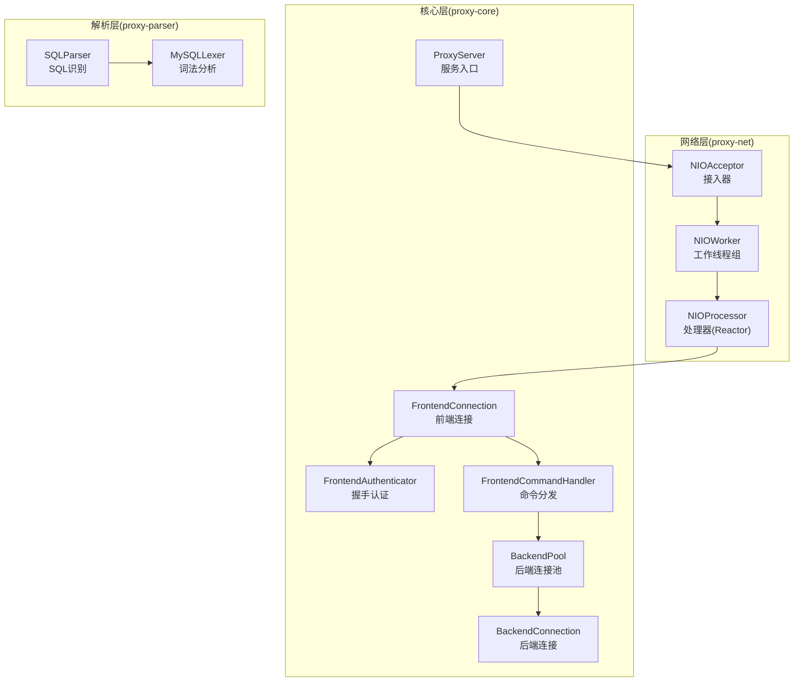
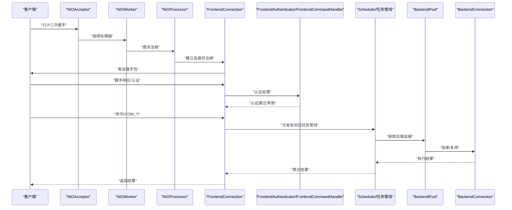
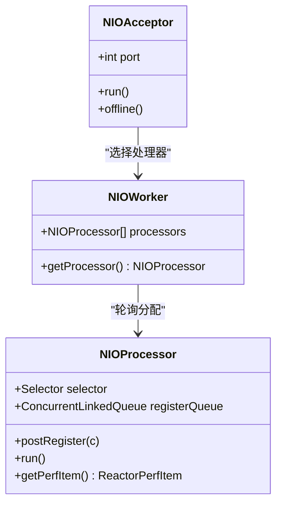
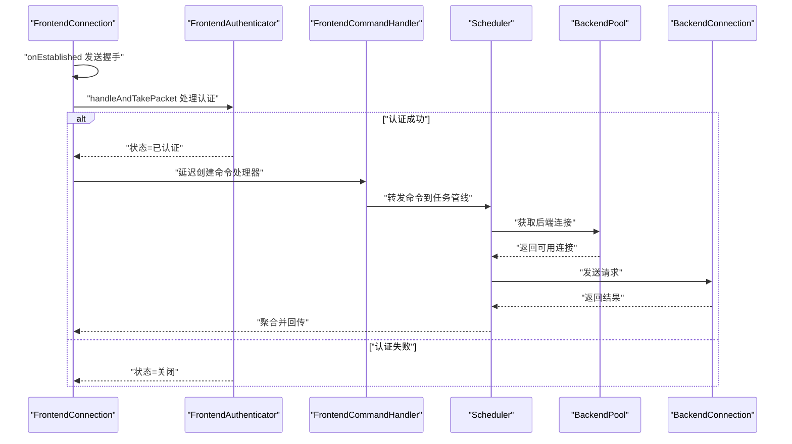
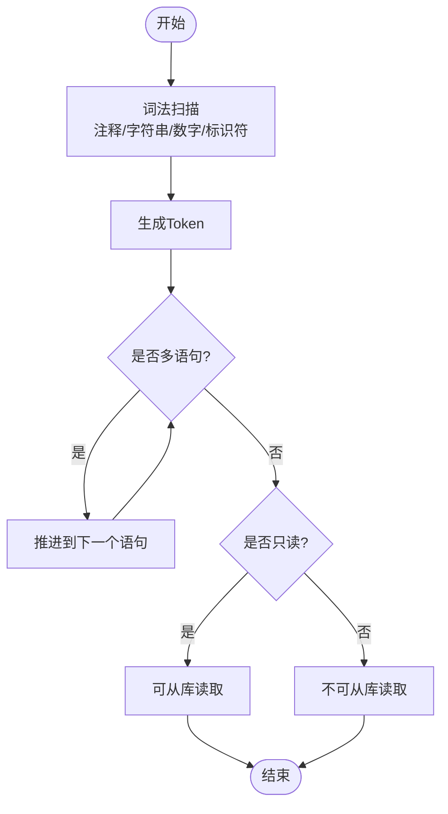
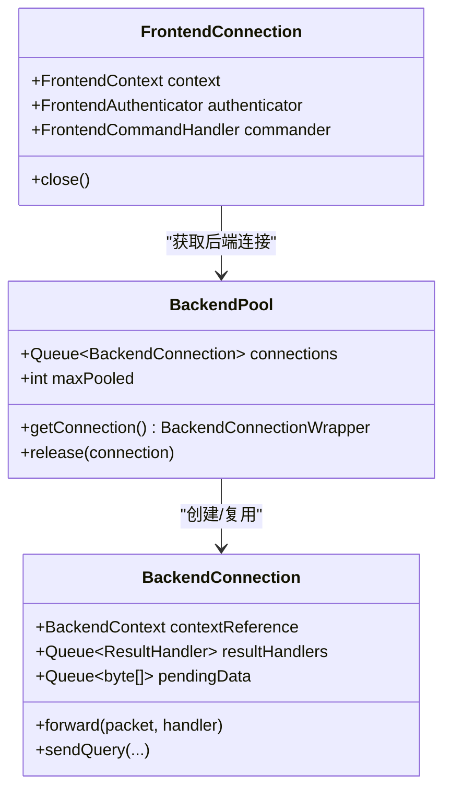
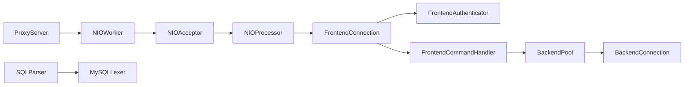

# 核心模块

<cite>
**本文引用的文件**
- [proxy-net 模块：NIOAcceptor.java](file://proxy-net/src/main/java/com/alibaba/polardbx/proxy/net/NIOAcceptor.java)
- [proxy-net 模块：NIOProcessor.java](file://proxy-net/src/main/java/com/alibaba/polardbx/proxy/net/NIOProcessor.java)
- [proxy-net 模块：NIOWorker.java](file://proxy-net/src/main/java/com/alibaba/polardbx/proxy/net/NIOWorker.java)
- [proxy-core 模块：ProxyServer.java](file://proxy-core/src/main/java/com/alibaba/polardbx/proxy/ProxyServer.java)
- [proxy-core 模块：FrontendConnection.java](file://proxy-core/src/main/java/com/alibaba/polardbx/proxy/connection/FrontendConnection.java)
- [proxy-core 模块：BackendConnection.java](file://proxy-core/src/main/java/com/alibaba/polardbx/proxy/connection/BackendConnection.java)
- [proxy-core 模块：FrontendAuthenticator.java](file://proxy-core/src/main/java/com/alibaba/polardbx/proxy/protocol/handler/FrontendAuthenticator.java)
- [proxy-core 模块：FrontendCommandHandler.java](file://proxy-core/src/main/java/com/alibaba/polardbx/proxy/protocol/handler/FrontendCommandHandler.java)
- [proxy-core 模块：BackendPool.java](file://proxy-core/src/main/java/com/alibaba/polardbx/proxy/connection/pool/BackendPool.java)
- [proxy-parser 模块：SQLParser.java](file://proxy-parser/src/main/java/com/alibaba/polardbx/proxy/parser/recognizer/SQLParser.java)
- [proxy-parser 模块：MySQLLexer.java](file://proxy-parser/src/main/java/com/alibaba/polardbx/proxy/parser/recognizer/mysql/lexer/MySQLLexer.java)
- [proxy-common 模块：ConfigProps.java](file://proxy-common/src/main/java/com/alibaba/polardbx/proxy/config/ConfigProps.java)
</cite>

## 目录
1. [引言](#引言)
2. [项目结构](#项目结构)
3. [核心组件](#核心组件)
4. [架构总览](#架构总览)
5. [详细组件分析](#详细组件分析)
6. [依赖关系分析](#依赖关系分析)
7. [性能考量](#性能考量)
8. [故障排查指南](#故障排查指南)
9. [结论](#结论)
10. [附录](#附录)

## 引言
本文件面向 PolarDB-X Proxy 的核心模块，系统性梳理网络通信层（proxy-net）、协议处理层（proxy-core）、SQL 解析层（proxy-parser）与连接管理机制，并给出配置项、性能调优参数与常见问题的解决方案。文档以“从源码到实践”的方式组织，既适合深入研究的工程师，也便于快速上手的使用者。

## 项目结构
- proxy-net：基于 NIO 的 Reactor 架构，负责前端接入、事件循环与连接注册。
- proxy-core：协议栈实现（MySQL 协议）、前后端连接、调度与任务管线、权限与上下文管理。
- proxy-parser：SQL 词法与语法识别，支持多语句、只读/从库判定、数据库切换推断等。
- proxy-common：通用工具与配置项定义。
- proxy-rpc、proxy-server 等模块在本文件不展开，但与核心模块协同工作。

图表来源
- [proxy-net 模块：NIOAcceptor.java](file://proxy-net/src/main/java/com/alibaba/polardbx/proxy/net/NIOAcceptor.java#L35-L148)
- [proxy-net 模块：NIOProcessor.java](file://proxy-net/src/main/java/com/alibaba/polardbx/proxy/net/NIOProcessor.java#L37-L142)
- [proxy-net 模块：NIOWorker.java](file://proxy-net/src/main/java/com/alibaba/polardbx/proxy/net/NIOWorker.java#L29-L97)
- [proxy-core 模块：ProxyServer.java](file://proxy-core/src/main/java/com/alibaba/polardbx/proxy/ProxyServer.java#L48-L119)
- [proxy-core 模块：FrontendConnection.java](file://proxy-core/src/main/java/com/alibaba/polardbx/proxy/connection/FrontendConnection.java#L47-L224)
- [proxy-core 模块：BackendConnection.java](file://proxy-core/src/main/java/com/alibaba/polardbx/proxy/connection/BackendConnection.java#L67-L813)
- [proxy-core 模块：FrontendAuthenticator.java](file://proxy-core/src/main/java/com/alibaba/polardbx/proxy/protocol/handler/FrontendAuthenticator.java#L45-L203)
- [proxy-core 模块：FrontendCommandHandler.java](file://proxy-core/src/main/java/com/alibaba/polardbx/proxy/protocol/handler/FrontendCommandHandler.java#L39-L172)
- [proxy-core 模块：BackendPool.java](file://proxy-core/src/main/java/com/alibaba/polardbx/proxy/connection/pool/BackendPool.java#L46-L284)
- [proxy-parser 模块：SQLParser.java](file://proxy-parser/src/main/java/com/alibaba/polardbx/proxy/parser/recognizer/SQLParser.java#L36-L336)
- [proxy-parser 模块：MySQLLexer.java](file://proxy-parser/src/main/java/com/alibaba/polardbx/proxy/parser/recognizer/mysql/lexer/MySQLLexer.java#L35-L800)

章节来源
- [proxy-net 模块：NIOAcceptor.java](file://proxy-net/src/main/java/com/alibaba/polardbx/proxy/net/NIOAcceptor.java#L35-L148)
- [proxy-net 模块：NIOProcessor.java](file://proxy-net/src/main/java/com/alibaba/polardbx/proxy/net/NIOProcessor.java#L37-L142)
- [proxy-net 模块：NIOWorker.java](file://proxy-net/src/main/java/com/alibaba/polardbx/proxy/net/NIOWorker.java#L29-L97)
- [proxy-core 模块：ProxyServer.java](file://proxy-core/src/main/java/com/alibaba/polardbx/proxy/ProxyServer.java#L48-L119)

## 核心组件
- 网络通信层（proxy-net）
  - NIOAcceptor：监听端口，接受新连接，委派给 NIOWorker 选择 NIOProcessor 并完成注册。
  - NIOProcessor：Reactor 事件循环，批量注册待注册连接，处理就绪事件，统计性能指标。
  - NIOWorker：管理多个 NIOProcessor，按轮询策略分配处理器，动态计算缓冲池大小。
- 协议处理层（proxy-core）
  - ProxyServer：服务启动入口，初始化 NIOWorker、HA/监控、同步服务与 NIOAcceptor。
  - FrontendConnection：前端连接，负责握手、认证、命令处理与资源回收。
  - BackendConnection：后端连接，负责登录认证、结果处理、请求排队与发送。
  - FrontendAuthenticator：握手与认证流程，校验用户、权限与字符集。
  - FrontendCommandHandler：命令分发器，根据命令类型路由到对应调度管线。
  - BackendPool：后端连接池，空闲复用、容量控制、全局变量与只读配置缓存。
- SQL 解析层（proxy-parser）
  - SQLParser：多语句识别、只读/从库判定、数据库切换推断、错误定位。
  - MySQLLexer：高性能词法扫描，注释、字符串、数字、标识符、系统变量等识别。

章节来源
- [proxy-core 模块：FrontendConnection.java](file://proxy-core/src/main/java/com/alibaba/polardbx/proxy/connection/FrontendConnection.java#L47-L224)
- [proxy-core 模块：BackendConnection.java](file://proxy-core/src/main/java/com/alibaba/polardbx/proxy/connection/BackendConnection.java#L67-L813)
- [proxy-core 模块：FrontendAuthenticator.java](file://proxy-core/src/main/java/com/alibaba/polardbx/proxy/protocol/handler/FrontendAuthenticator.java#L45-L203)
- [proxy-core 模块：FrontendCommandHandler.java](file://proxy-core/src/main/java/com/alibaba/polardbx/proxy/protocol/handler/FrontendCommandHandler.java#L39-L172)
- [proxy-core 模块：BackendPool.java](file://proxy-core/src/main/java/com/alibaba/polardbx/proxy/connection/pool/BackendPool.java#L46-L284)
- [proxy-parser 模块：SQLParser.java](file://proxy-parser/src/main/java/com/alibaba/polardbx/proxy/parser/recognizer/SQLParser.java#L36-L336)
- [proxy-parser 模块：MySQLLexer.java](file://proxy-parser/src/main/java/com/alibaba/polardbx/proxy/parser/recognizer/mysql/lexer/MySQLLexer.java#L35-L800)

## 架构总览
下图展示了从客户端连接到后端执行的整体链路，以及各模块之间的协作关系。

图表来源
- [proxy-net 模块：NIOAcceptor.java](file://proxy-net/src/main/java/com/alibaba/polardbx/proxy/net/NIOAcceptor.java#L61-L81)
- [proxy-net 模块：NIOProcessor.java](file://proxy-net/src/main/java/com/alibaba/polardbx/proxy/net/NIOProcessor.java#L67-L114)
- [proxy-core 模块：ProxyServer.java](file://proxy-core/src/main/java/com/alibaba/polardbx/proxy/ProxyServer.java#L98-L101)
- [proxy-core 模块：FrontendConnection.java](file://proxy-core/src/main/java/com/alibaba/polardbx/proxy/connection/FrontendConnection.java#L88-L166)
- [proxy-core 模块：FrontendAuthenticator.java](file://proxy-core/src/main/java/com/alibaba/polardbx/proxy/protocol/handler/FrontendAuthenticator.java#L137-L201)
- [proxy-core 模块：FrontendCommandHandler.java](file://proxy-core/src/main/java/com/alibaba/polardbx/proxy/protocol/handler/FrontendCommandHandler.java#L68-L170)
- [proxy-core 模块：BackendPool.java](file://proxy-core/src/main/java/com/alibaba/polardbx/proxy/connection/pool/BackendPool.java#L115-L132)
- [proxy-core 模块：BackendConnection.java](file://proxy-core/src/main/java/com/alibaba/polardbx/proxy/connection/BackendConnection.java#L289-L321)

## 详细组件分析

### 网络通信层（proxy-net）：NIOAcceptor、NIOProcessor、NIOWorker
- NIOAcceptor
  - 负责打开 ServerSocketChannel、绑定端口、设置非阻塞、注册 OP_ACCEPT。
  - 在每次可接受事件中创建 SocketChannel，设置 TCP_NODELAY，委派给 NIOWorker 获取处理器，再由工厂创建 NIOConnection 并提交注册。
  - 提供 offline 关闭能力，唤醒 selector 并关闭通道。
- NIOProcessor
  - 维护 Selector 与注册队列，采用“批量注册”策略降低锁竞争。
  - 事件循环中先批量注册，再遍历就绪事件，回调连接对象的 event 方法处理读写。
  - 提供性能采集项（注册次数、事件循环次数、读写计数、连接计数、缓冲区信息）。
- NIOWorker
  - 根据 CPU 核心数与因子计算线程数，上限受环境变量限制。
  - 动态计算每个处理器的缓冲块数量，确保占用堆内存不超过阈值。
  - 提供轮询策略选择处理器，保证负载均衡。

图表来源
- [proxy-net 模块：NIOAcceptor.java](file://proxy-net/src/main/java/com/alibaba/polardbx/proxy/net/NIOAcceptor.java#L35-L148)
- [proxy-net 模块：NIOProcessor.java](file://proxy-net/src/main/java/com/alibaba/polardbx/proxy/net/NIOProcessor.java#L37-L142)
- [proxy-net 模块：NIOWorker.java](file://proxy-net/src/main/java/com/alibaba/polardbx/proxy/net/NIOWorker.java#L29-L97)

章节来源
- [proxy-net 模块：NIOAcceptor.java](file://proxy-net/src/main/java/com/alibaba/polardbx/proxy/net/NIOAcceptor.java#L61-L106)
- [proxy-net 模块：NIOProcessor.java](file://proxy-net/src/main/java/com/alibaba/polardbx/proxy/net/NIOProcessor.java#L67-L114)
- [proxy-net 模块：NIOWorker.java](file://proxy-net/src/main/java/com/alibaba/polardbx/proxy/net/NIOWorker.java#L59-L88)

### 协议处理层（proxy-core）：MySQL 协议实现
- 握手与认证（FrontendConnection + FrontendAuthenticator）
  - 建立连接后发送握手包，包含版本、连接 ID、插件种子、能力标志、字符集、状态标志等。
  - 认证阶段解析握手响应，合并客户端能力，校验字符集、协议版本与认证插件；必要时触发认证切换。
  - 最终根据权限策略决定允许或拒绝，并更新上下文。
- 命令处理（FrontendCommandHandler）
  - 基于首字节识别命令类型（QUIT、INIT_DB、QUERY、FIELD_LIST、STATISTICS、PING、RESET_CONNECTION、CHANGE_USER、SET_OPTION、STMT_* 等）。
  - 将命令路由到对应的调度管线（Pipelines），交由 Scheduler 执行。
- 后端连接与结果回传（BackendConnection）
  - 登录认证完成后，将只读配置与全局变量注入上下文，随后处理排队的待发送数据。
  - 结果处理采用 ResultHandler 链式模型，支持查询、预处理、OK/ERR 等不同结果类型。
  - 提供 sendQuery、sendPrepare、resetPreparedStatement、closePreparedStatement 等接口。

图表来源
- [proxy-core 模块：FrontendConnection.java](file://proxy-core/src/main/java/com/alibaba/polardbx/proxy/connection/FrontendConnection.java#L88-L166)
- [proxy-core 模块：FrontendAuthenticator.java](file://proxy-core/src/main/java/com/alibaba/polardbx/proxy/protocol/handler/FrontendAuthenticator.java#L137-L201)
- [proxy-core 模块：FrontendCommandHandler.java](file://proxy-core/src/main/java/com/alibaba/polardbx/proxy/protocol/handler/FrontendCommandHandler.java#L68-L170)
- [proxy-core 模块：BackendPool.java](file://proxy-core/src/main/java/com/alibaba/polardbx/proxy/connection/pool/BackendPool.java#L115-L132)
- [proxy-core 模块：BackendConnection.java](file://proxy-core/src/main/java/com/alibaba/polardbx/proxy/connection/BackendConnection.java#L289-L321)

章节来源
- [proxy-core 模块：FrontendConnection.java](file://proxy-core/src/main/java/com/alibaba/polardbx/proxy/connection/FrontendConnection.java#L88-L166)
- [proxy-core 模块：FrontendAuthenticator.java](file://proxy-core/src/main/java/com/alibaba/polardbx/proxy/protocol/handler/FrontendAuthenticator.java#L67-L135)
- [proxy-core 模块：FrontendCommandHandler.java](file://proxy-core/src/main/java/com/alibaba/polardbx/proxy/protocol/handler/FrontendCommandHandler.java#L68-L170)
- [proxy-core 模块：BackendConnection.java](file://proxy-core/src/main/java/com/alibaba/polardbx/proxy/connection/BackendConnection.java#L118-L200)

### SQL 解析模块（proxy-parser）：词法与语法
- MySQLLexer
  - 支持注释（#、--、/*!...*/）、字符串、十六进制、位串、数字（整数/小数/科学计数法）、标识符、系统变量与用户变量等。
  - 内置字符类型表与状态机，高效扫描并缓存最近一次/两次 token，减少重复解析成本。
- SQLParser
  - 多语句识别、只读/从库判定（忽略 FOR UPDATE/SKIP LOCKED/LOCK IN SHARE MODE 等）、数据库切换推断（DROP/USE 等）。
  - 错误定位：围绕当前词法位置输出上下文片段，辅助诊断。

图表来源
- [proxy-parser 模块：MySQLLexer.java](file://proxy-parser/src/main/java/com/alibaba/polardbx/proxy/parser/recognizer/mysql/lexer/MySQLLexer.java#L220-L365)
- [proxy-parser 模块：SQLParser.java](file://proxy-parser/src/main/java/com/alibaba/polardbx/proxy/parser/recognizer/SQLParser.java#L53-L136)

章节来源
- [proxy-parser 模块：MySQLLexer.java](file://proxy-parser/src/main/java/com/alibaba/polardbx/proxy/parser/recognizer/mysql/lexer/MySQLLexer.java#L110-L137)
- [proxy-parser 模块：SQLParser.java](file://proxy-parser/src/main/java/com/alibaba/polardbx/proxy/parser/recognizer/SQLParser.java#L53-L136)

### 连接管理机制：前端连接、后端连接与连接池
- 前端连接（FrontendConnection）
  - 初始化 FrontendContext，设置能力标志、字符集与随机种子，创建 FrontendAuthenticator。
  - 认证完成后延迟创建 FrontendCommandHandler，统一处理后续命令。
  - 资源回收采用异步关闭，避免死锁。
- 后端连接（BackendConnection）
  - 登录认证完成后注入只读配置与全局变量，处理排队的待发送数据。
  - 结果处理采用 ResultHandler 链式模型，支持查询、预处理、OK/ERR 等。
  - 提供 sendQuery、sendPrepare、resetPreparedStatement、closePreparedStatement 等接口。
- 后端连接池（BackendPool）
  - 空闲连接复用，容量受 maxPooled 控制；释放时检查连接健康与是否有未完成用户请求。
  - 支持周期性刷新（执行心跳 SQL）与全局变量缓存（只读配置），提升连接可用性与一致性。

图表来源
- [proxy-core 模块：FrontendConnection.java](file://proxy-core/src/main/java/com/alibaba/polardbx/proxy/connection/FrontendConnection.java#L47-L224)
- [proxy-core 模块：BackendConnection.java](file://proxy-core/src/main/java/com/alibaba/polardbx/proxy/connection/BackendConnection.java#L67-L813)
- [proxy-core 模块：BackendPool.java](file://proxy-core/src/main/java/com/alibaba/polardbx/proxy/connection/pool/BackendPool.java#L46-L284)

章节来源
- [proxy-core 模块：FrontendConnection.java](file://proxy-core/src/main/java/com/alibaba/polardbx/proxy/connection/FrontendConnection.java#L168-L213)
- [proxy-core 模块：BackendConnection.java](file://proxy-core/src/main/java/com/alibaba/polardbx/proxy/connection/BackendConnection.java#L289-L321)
- [proxy-core 模块：BackendPool.java](file://proxy-core/src/main/java/com/alibaba/polardbx/proxy/connection/pool/BackendPool.java#L115-L165)

## 依赖关系分析
- 启动流程
  - ProxyServer 初始化 NIOWorker（根据 cpus 与 reactor_factor），启动 HA/监控、同步服务与 NIOAcceptor。
  - NIOAcceptor 接收连接后委派给 NIOWorker，再由 NIOProcessor 注册 FrontendConnection。
- 协议处理
  - FrontendConnection 在握手与认证阶段依赖 FrontendAuthenticator；命令阶段依赖 FrontendCommandHandler 与 Scheduler。
  - 后端执行通过 BackendPool 获取 BackendConnection，执行后回传结果。
- 解析依赖
  - SQLParser 基于 MySQLLexer 生成的 Token 流进行多语句识别与只读判定。

图表来源
- [proxy-core 模块：ProxyServer.java](file://proxy-core/src/main/java/com/alibaba/polardbx/proxy/ProxyServer.java#L56-L96)
- [proxy-net 模块：NIOAcceptor.java](file://proxy-net/src/main/java/com/alibaba/polardbx/proxy/net/NIOAcceptor.java#L46-L58)
- [proxy-net 模块：NIOProcessor.java](file://proxy-net/src/main/java/com/alibaba/polardbx/proxy/net/NIOProcessor.java#L52-L65)
- [proxy-core 模块：FrontendConnection.java](file://proxy-core/src/main/java/com/alibaba/polardbx/proxy/connection/FrontendConnection.java#L61-L86)
- [proxy-core 模块：FrontendAuthenticator.java](file://proxy-core/src/main/java/com/alibaba/polardbx/proxy/protocol/handler/FrontendAuthenticator.java#L61-L65)
- [proxy-core 模块：FrontendCommandHandler.java](file://proxy-core/src/main/java/com/alibaba/polardbx/proxy/protocol/handler/FrontendCommandHandler.java#L45-L49)
- [proxy-core 模块：BackendPool.java](file://proxy-core/src/main/java/com/alibaba/polardbx/proxy/connection/pool/BackendPool.java#L88-L98)
- [proxy-parser 模块：SQLParser.java](file://proxy-parser/src/main/java/com/alibaba/polardbx/proxy/parser/recognizer/SQLParser.java#L41-L51)

章节来源
- [proxy-core 模块：ProxyServer.java](file://proxy-core/src/main/java/com/alibaba/polardbx/proxy/ProxyServer.java#L56-L96)
- [proxy-net 模块：NIOAcceptor.java](file://proxy-net/src/main/java/com/alibaba/polardbx/proxy/net/NIOAcceptor.java#L46-L58)
- [proxy-core 模块：FrontendConnection.java](file://proxy-core/src/main/java/com/alibaba/polardbx/proxy/connection/FrontendConnection.java#L61-L86)
- [proxy-core 模块：BackendPool.java](file://proxy-core/src/main/java/com/alibaba/polardbx/proxy/connection/pool/BackendPool.java#L88-L98)
- [proxy-parser 模块：SQLParser.java](file://proxy-parser/src/main/java/com/alibaba/polardbx/proxy/parser/recognizer/SQLParser.java#L41-L51)

## 性能考量
- Reactor 线程与缓冲池
  - 线程数：由 cpus 与 reactor_factor 决定，最大受 cpu_cores 环境变量限制。
  - 缓冲池：按“最大堆内存的 10%”估算每线程可分配的缓冲块数，避免 OOM。
- 批量注册与事件循环
  - NIOProcessor 使用注册队列批量处理注册，减少锁竞争；事件循环中先注册再处理，降低抖动。
- 连接池容量与刷新
  - BackendPool 通过 maxPooled 控制容量；支持按比例刷新与全局变量缓存，降低连接失效带来的抖动。
- 字符集与编码
  - 前端握手时合并客户端能力并校验字符集；后端查询前根据上下文重编码，避免乱码与额外转换开销。
- 只读判定与从库路由
  - SQLParser 对只读语句与从库场景进行快速判定，结合读权重与延迟阈值，提升读扩展能力。

章节来源
- [proxy-net 模块：NIOWorker.java](file://proxy-net/src/main/java/com/alibaba/polardbx/proxy/net/NIOWorker.java#L36-L68)
- [proxy-net 模块：NIOProcessor.java](file://proxy-net/src/main/java/com/alibaba/polardbx/proxy/net/NIOProcessor.java#L52-L65)
- [proxy-core 模块：BackendPool.java](file://proxy-core/src/main/java/com/alibaba/polardbx/proxy/connection/pool/BackendPool.java#L167-L250)
- [proxy-core 模块：SQLParser.java](file://proxy-parser/src/main/java/com/alibaba/polardbx/proxy/parser/recognizer/SQLParser.java#L64-L112)

## 故障排查指南
- 握手/认证失败
  - 检查客户端字符集与协议版本是否满足要求；确认用户名/密码与白名单策略。
  - 参考路径：[FrontendAuthenticator 认证流程](file://proxy-core/src/main/java/com/alibaba/polardbx/proxy/protocol/handler/FrontendAuthenticator.java#L137-L201)
- 连接无法建立或频繁断开
  - 检查 NIOAcceptor 是否正常运行、端口是否被占用；查看 NIOProcessor 的事件循环与注册计数。
  - 参考路径：[NIOAcceptor 运行与关闭](file://proxy-net/src/main/java/com/alibaba/polardbx/proxy/net/NIOAcceptor.java#L83-L106)、[NIOProcessor 事件循环](file://proxy-net/src/main/java/com/alibaba/polardbx/proxy/net/NIOProcessor.java#L84-L114)
- 后端连接异常
  - 查看 BackendConnection 的认证状态与 pendingData 队列；确认只读配置与全局变量是否正确注入。
  - 参考路径：[BackendConnection 认证与结果处理](file://proxy-core/src/main/java/com/alibaba/polardbx/proxy/connection/BackendConnection.java#L118-L200)
- SQL 语句解析报错
  - 利用 SQLParser 的错误定位信息，结合 MySQLLexer 的 token 位置定位问题片段。
  - 参考路径：[SQLParser 错误定位](file://proxy-parser/src/main/java/com/alibaba/polardbx/proxy/parser/recognizer/SQLParser.java#L256-L274)

章节来源
- [proxy-core 模块：FrontendAuthenticator.java](file://proxy-core/src/main/java/com/alibaba/polardbx/proxy/protocol/handler/FrontendAuthenticator.java#L137-L201)
- [proxy-net 模块：NIOAcceptor.java](file://proxy-net/src/main/java/com/alibaba/polardbx/proxy/net/NIOAcceptor.java#L83-L106)
- [proxy-net 模块：NIOProcessor.java](file://proxy-net/src/main/java/com/alibaba/polardbx/proxy/net/NIOProcessor.java#L84-L114)
- [proxy-core 模块：BackendConnection.java](file://proxy-core/src/main/java/com/alibaba/polardbx/proxy/connection/BackendConnection.java#L118-L200)
- [proxy-parser 模块：SQLParser.java](file://proxy-parser/src/main/java/com/alibaba/polardbx/proxy/parser/recognizer/SQLParser.java#L256-L274)

## 结论
PolarDB-X Proxy 的核心模块以 NIO Reactor 为基础，结合清晰的协议处理与连接管理，实现了高性能、可扩展的代理层。通过合理的线程与缓冲池配置、连接池容量与刷新策略、SQL 只读判定与从库路由，能够在高并发场景下保持稳定与低延迟。建议在生产环境中结合监控指标与日志，持续优化线程数、缓冲池大小与连接池参数，以获得最佳性能。

## 附录
- 配置项与调优参数
  - 线程与 Reactor
    - cpus：CPU 核心数（0 表示自动检测）
    - reactor_factor：Reactor 线程倍数
    - tcp_ensure_minimum_buffer：是否确保最小缓冲
  - 前端端口与连接
    - frontend_port：前端监听端口
    - enable_connection_hold：连接持有策略
  - 后端连接与池化
    - backend_address：后端地址
    - backend_username/backend_password：后端账号与密文
    - backend_connect_timeout：后端连接超时
    - backend_admin_max_pooled_size / backend_rw_max_pooled_size / backend_ro_max_pooled_size：池化容量
  - 高可用与延迟
    - backend_ha_worker_threads / backend_ha_check_interval / backend_ha_check_timeout：HA 参数
    - enable_read_write_splitting / enable_follower_read / enable_leader_in_ro_pools / read_weights / latency_check_timeout / latency_check_interval / latency_record_count / slave_read_latency_threshold / enable_stale_read：读写分离与延迟相关
  - 连接池刷新
    - backend_pool_refresh_threads / backend_pool_refresh_task_interval / backend_pool_refresh_interval / backend_pool_refresh_sql / backend_pool_refresh_timeout：池刷新策略
  - 权限与日志
    - privilege_refresh_timeout / privilege_refresh_interval：权限刷新
    - enable_sql_log / log_sql_max_length / log_sql_param_max_length：SQL 日志
  - 全局变量与最大包
    - global_variables_refresh_interval：全局变量刷新间隔
    - max_allowed_packet：最大包大小
  - 平滑切换
    - smooth_switchover_enabled / smooth_switchover_check_interval / smooth_switchover_wait_timeout：平滑切换参数

章节来源
- [proxy-common 模块：ConfigProps.java](file://proxy-common/src/main/java/com/alibaba/polardbx/proxy/config/ConfigProps.java#L23-L209)