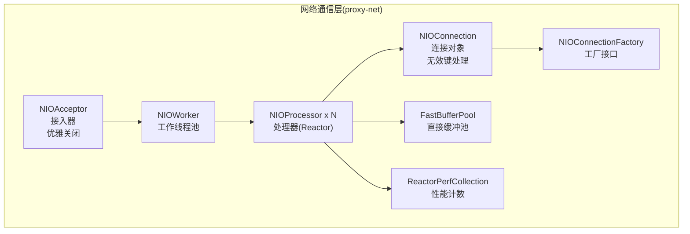
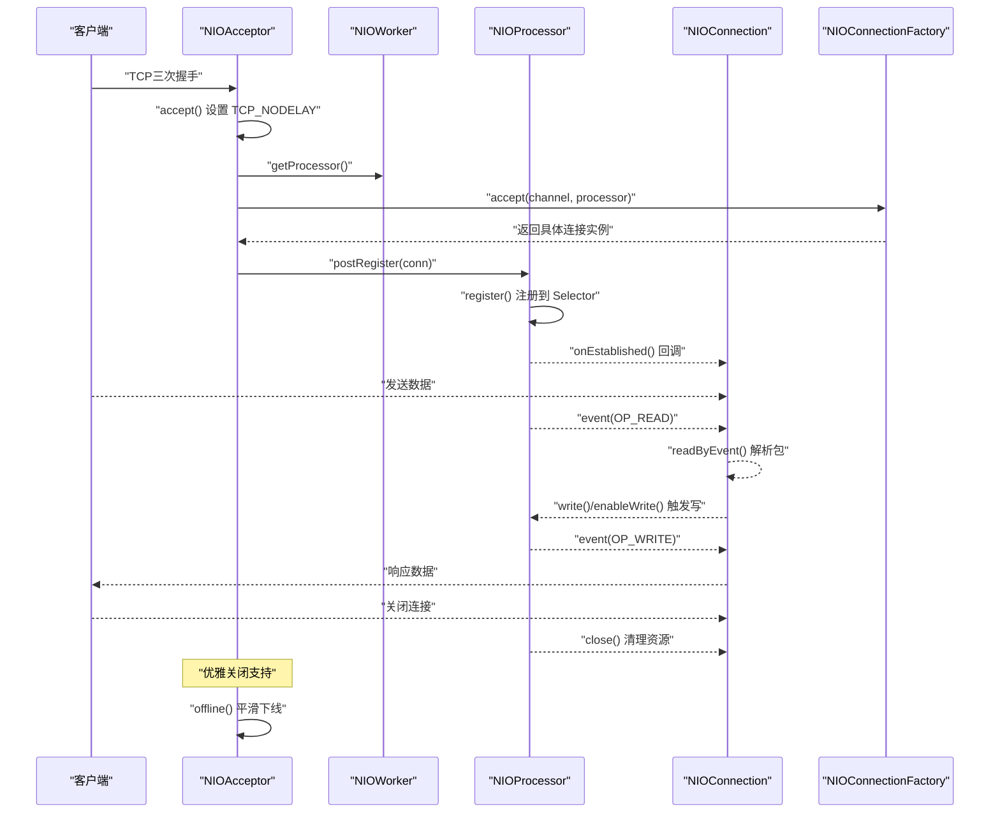
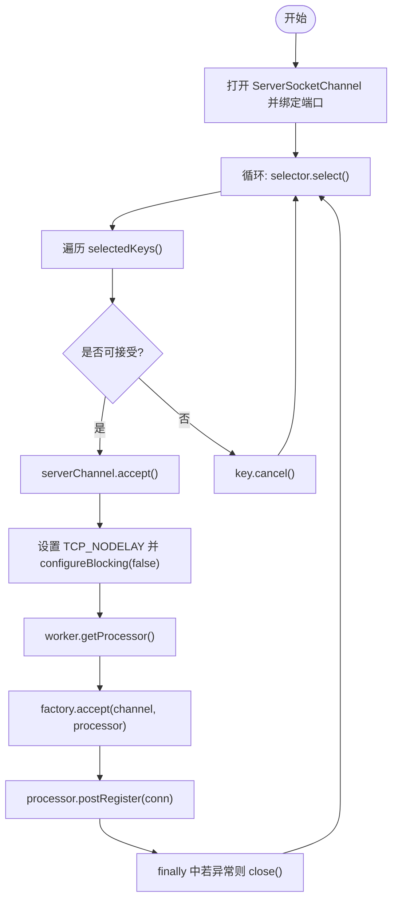
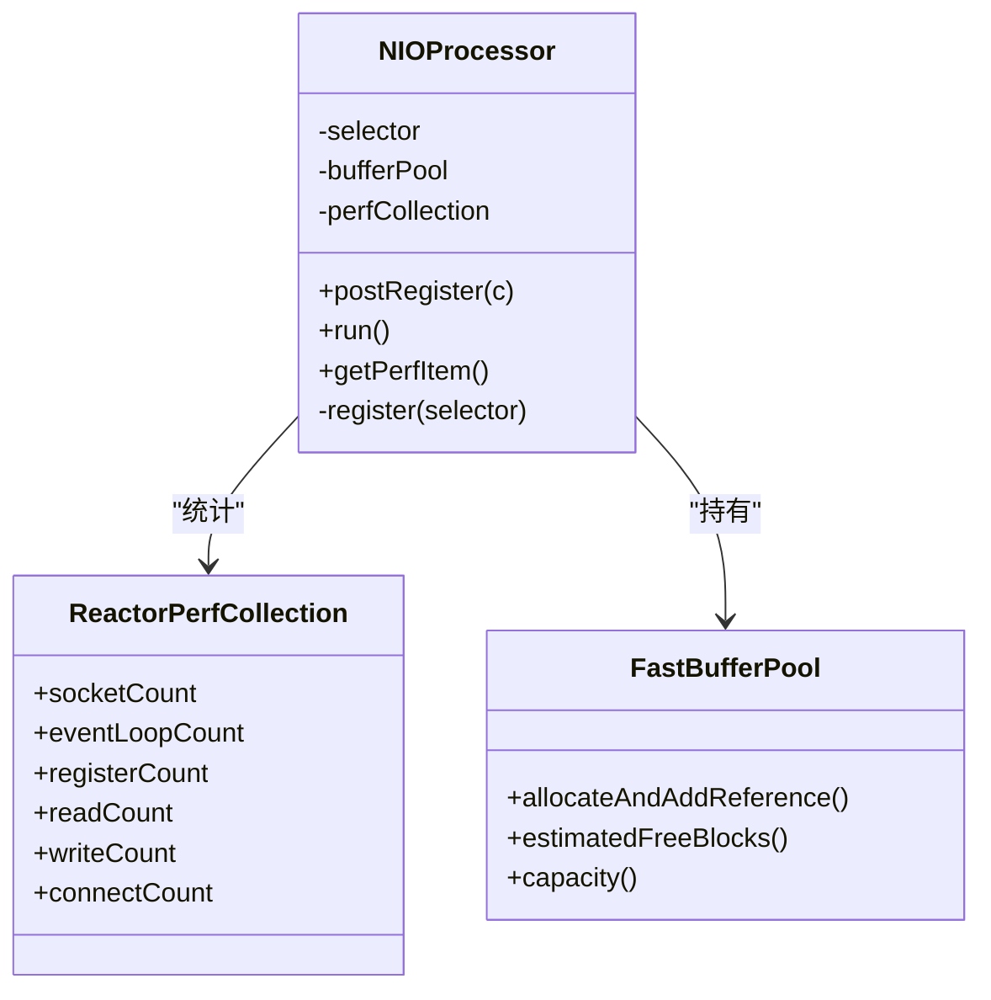
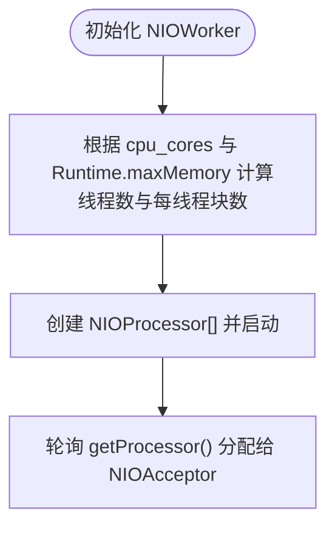
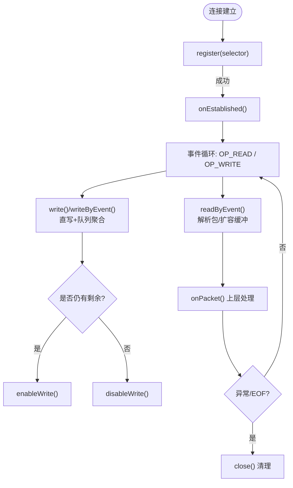
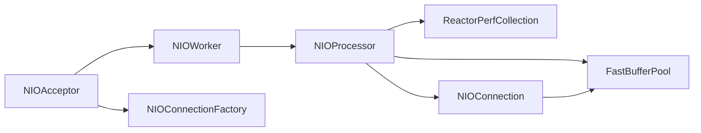

# 网络通信层

<cite>
**本文引用的文件**
- [NIOAcceptor.java](file://proxy-net/src/main/java/com/alibaba/polardbx/proxy/net/NIOAcceptor.java)
- [NIOProcessor.java](file://proxy-net/src/main/java/com/alibaba/polardbx/proxy/net/NIOProcessor.java)
- [NIOWorker.java](file://proxy-net/src/main/java/com/alibaba/polardbx/proxy/net/NIOWorker.java)
- [NIOConnection.java](file://proxy-net/src/main/java/com/alibaba/polardbx/proxy/net/NIOConnection.java)
- [NIOConnectionFactory.java](file://proxy-net/src/main/java/com/alibaba/polardbx/proxy/net/NIOConnectionFactory.java)
- [FastBufferPool.java](file://proxy-common/src/main/java/com/alibaba/polardbx/proxy/utils/FastBufferPool.java)
- [ReactorPerfCollection.java](file://proxy-net/src/main/java/com/alibaba/polardbx/proxy/perf/ReactorPerfCollection.java)
- [ReactorPerfItem.java](file://proxy-net/src/main/java/com/alibaba/polardbx/proxy/perf/ReactorPerfItem.java)
- [NIOAcceptorTest.java](file://proxy-net/src/test/java/com/alibaba/polardbx/proxy/net/NIOAcceptorTest.java)
- [NIOProcessorTest.java](file://proxy-net/src/test/java/com/alibaba/polardbx/proxy/net/NIOProcessorTest.java)
- [NIOConnectionTest.java](file://proxy-net/src/test/java/com/alibaba/polardbx/proxy/net/NIOConnectionTest.java)
</cite>

## 更新摘要
**变更内容**
- 更新了NIOConnection类的无效选择键处理机制，增强了连接管理的稳定性
- 增加了NIOAcceptor类的优雅关闭功能，支持平滑的服务下线
- 完善了异常处理和资源清理机制，提升了系统的可靠性

## 目录
1. [简介](#简介)
2. [项目结构](#项目结构)
3. [核心组件](#核心组件)
4. [架构总览](#架构总览)
5. [组件详解](#组件详解)
6. [依赖关系分析](#依赖关系分析)
7. [性能与调优](#性能与调优)
8. [故障排查指南](#故障排查指南)
9. [结论](#结论)
10. [附录：关键流程图与示例路径](#附录关键流程图与示例路径)

## 简介
本文件系统性梳理 PolarDB-X Proxy 的网络通信层，围绕基于 Netty 思想的 Reactor 模式实现，深入解析以下要点：
- NIOAcceptor 的连接接受机制与 TCP_NODELAY 设置，以及优雅关闭功能
- NIOProcessor 的事件循环与注册队列
- NIOWorker 的工作线程池与处理器分配策略
- NIOConnection 的连接生命周期管理与读写缓冲，包括改进的无效选择键处理
- NIOConnectionFactory 的工厂模式与扩展点
- 非阻塞 I/O、选择器（Selector）使用、快速缓冲池（FastBufferPool）
- 连接建立、数据传输、连接关闭的完整流程示例路径
- 性能调优参数、内存管理策略与常见网络问题诊断

## 项目结构
网络通信层位于 proxy-net 模块，核心类包括：
- 接入层：NIOAcceptor（支持优雅关闭）
- 处理层：NIOProcessor、NIOWorker
- 连接层：NIOConnection（改进了无效选择键处理）、NIOConnectionFactory
- 缓冲与性能：FastBufferPool、ReactorPerfCollection、ReactorPerfItem
- 测试用例覆盖关键行为与边界条件

**图表来源**
- [NIOAcceptor.java](file://proxy-net/src/main/java/com/alibaba/polardbx/proxy/net/NIOAcceptor.java#L35-L147)
- [NIOWorker.java](file://proxy-net/src/main/java/com/alibaba/polardbx/proxy/net/NIOWorker.java#L29-L96)
- [NIOProcessor.java](file://proxy-net/src/main/java/com/alibaba/polardbx/proxy/net/NIOProcessor.java#L37-L141)
- [NIOConnection.java](file://proxy-net/src/main/java/com/alibaba/polardbx/proxy/net/NIOConnection.java#L51-L883)
- [NIOConnectionFactory.java](file://proxy-net/src/main/java/com/alibaba/polardbx/proxy/net/NIOConnectionFactory.java#L23-L25)
- [FastBufferPool.java](file://proxy-common/src/main/java/com/alibaba/polardbx/proxy/utils/FastBufferPool.java#L27-L185)
- [ReactorPerfCollection.java](file://proxy-net/src/main/java/com/alibaba/polardbx/proxy/perf/ReactorPerfCollection.java#L26-L33)

**章节来源**
- [NIOAcceptor.java](file://proxy-net/src/main/java/com/alibaba/polardbx/proxy/net/NIOAcceptor.java#L35-L147)
- [NIOProcessor.java](file://proxy-net/src/main/java/com/alibaba/polardbx/proxy/net/NIOProcessor.java#L37-L141)
- [NIOWorker.java](file://proxy-net/src/main/java/com/alibaba/polardbx/proxy/net/NIOWorker.java#L29-L96)
- [NIOConnection.java](file://proxy-net/src/main/java/com/alibaba/polardbx/proxy/net/NIOConnection.java#L51-L883)
- [NIOConnectionFactory.java](file://proxy-net/src/main/java/com/alibaba/polardbx/proxy/net/NIOConnectionFactory.java#L23-L25)
- [FastBufferPool.java](file://proxy-common/src/main/java/com/alibaba/polardbx/proxy/utils/FastBufferPool.java#L27-L185)
- [ReactorPerfCollection.java](file://proxy-net/src/main/java/com/alibaba/polardbx/proxy/perf/ReactorPerfCollection.java#L26-L33)

## 核心组件
- NIOAcceptor：监听端口，接受新连接，设置 TCP_NODELAY，非阻塞化，并将 SocketChannel 分配给 NIOWorker 选择的 NIOProcessor，再交由工厂创建具体连接对象。**新增优雅关闭功能**，支持平滑的服务下线。
- NIOProcessor：单线程事件循环（Reactor），负责注册连接、分发事件（读/写/连接）、统计性能指标、持有 FastBufferPool。**增强异常处理**，对无效选择键进行安全处理。
- NIOWorker：维护多个 NIOProcessor，按轮询策略分配处理器；根据运行时堆大小与 CPU 核心数动态计算最大线程数与每线程缓冲块数。
- NIOConnection：抽象连接基类，封装 SocketChannel 生命周期、状态机、读写缓冲、写队列、兴趣事件控制、连接完成回调、错误处理与性能统计。**改进无效选择键处理**，增强连接管理的稳定性。
- NIOConnectionFactory：工厂接口，用于在接入阶段创建具体连接类型（如前端连接、后端连接等）。
- FastBufferPool：直接内存缓冲池，支持多线程无锁栈式分配与回收，减少 GC 压力。
- 性能监控：ReactorPerfCollection/ReactorPerfItem 提供连接数、事件循环次数、注册/读/写/连接次数及缓冲池状态。

**章节来源**
- [NIOAcceptor.java](file://proxy-net/src/main/java/com/alibaba/polardbx/proxy/net/NIOAcceptor.java#L46-L107)
- [NIOProcessor.java](file://proxy-net/src/main/java/com/alibaba/polardbx/proxy/net/NIOProcessor.java#L52-L114)
- [NIOWorker.java](file://proxy-net/src/main/java/com/alibaba/polardbx/proxy/net/NIOWorker.java#L59-L88)
- [NIOConnection.java](file://proxy-net/src/main/java/com/alibaba/polardbx/proxy/net/NIOConnection.java#L211-L363)
- [NIOConnectionFactory.java](file://proxy-net/src/main/java/com/alibaba/polardbx/proxy/net/NIOConnectionFactory.java#L23-L25)
- [FastBufferPool.java](file://proxy-common/src/main/java/com/alibaba/polardbx/proxy/utils/FastBufferPool.java#L51-L148)
- [ReactorPerfCollection.java](file://proxy-net/src/main/java/com/alibaba/polardbx/proxy/perf/ReactorPerfCollection.java#L26-L33)

## 架构总览
下图展示从接入到事件处理、再到连接读写的整体流程：

**图表来源**
- [NIOAcceptor.java](file://proxy-net/src/main/java/com/alibaba/polardbx/proxy/net/NIOAcceptor.java#L61-L81)
- [NIOWorker.java](file://proxy-net/src/main/java/com/alibaba/polardbx/proxy/net/NIOWorker.java#L82-L88)
- [NIOProcessor.java](file://proxy-net/src/main/java/com/alibaba/polardbx/proxy/net/NIOProcessor.java#L67-L82)
- [NIOConnection.java](file://proxy-net/src/main/java/com/alibaba/polardbx/proxy/net/NIOConnection.java#L329-L363)
- [NIOConnectionFactory.java](file://proxy-net/src/main/java/com/alibaba/polardbx/proxy/net/NIOConnectionFactory.java#L23-L25)

## 组件详解

### NIOAcceptor：连接接受与预处理
- 职责
  - 打开端口监听，设置非阻塞与 backlog
  - 在每次可接受事件中，accept 新连接，设置 TCP_NODELAY，非阻塞化
  - 通过 NIOWorker 获取处理器，交由工厂创建连接对象
  - 将连接提交至处理器的注册队列，触发注册
- 关键点
  - 使用标准 Socket 选项开启 Nagle 算法关闭（TCP_NODELAY）
  - 异常安全：失败时关闭通道并记录日志，避免泄漏
  - 支持离线操作，唤醒选择器并关闭服务端通道与选择器
- **新增功能**：优雅关闭（offline）方法，支持平滑的服务下线

**图表来源**
- [NIOAcceptor.java](file://proxy-net/src/main/java/com/alibaba/polardbx/proxy/net/NIOAcceptor.java#L46-L107)

**章节来源**
- [NIOAcceptor.java](file://proxy-net/src/main/java/com/alibaba/polardbx/proxy/net/NIOAcceptor.java#L46-L107)
- [NIOAcceptor.java](file://proxy-net/src/main/java/com/alibaba/polardbx/proxy/net/NIOAcceptor.java#L127-L137)

### NIOProcessor：事件循环与注册调度
- 职责
  - 单线程事件循环，定时 select，批量注册连接
  - 分发事件：连接完成、读、写
  - 统计性能指标（事件循环次数、注册/读/写/连接计数）
  - 持有 FastBufferPool，提供直接内存缓冲
- 关键点
  - 注册队列采用并发队列，主线程唤醒选择器
  - 事件处理中对异常进行捕获并取消无效 key
  - **增强异常处理**：对无效选择键进行安全处理，防止连接泄漏
  - 性能项导出为 ReactorPerfItem，便于监控

**图表来源**
- [NIOProcessor.java](file://proxy-net/src/main/java/com/alibaba/polardbx/proxy/net/NIOProcessor.java#L52-L132)
- [ReactorPerfCollection.java](file://proxy-net/src/main/java/com/alibaba/polardbx/proxy/perf/ReactorPerfCollection.java#L26-L33)
- [FastBufferPool.java](file://proxy-common/src/main/java/com/alibaba/polardbx/proxy/utils/FastBufferPool.java#L51-L148)

**章节来源**
- [NIOProcessor.java](file://proxy-net/src/main/java/com/alibaba/polardbx/proxy/net/NIOProcessor.java#L52-L132)
- [NIOProcessor.java](file://proxy-net/src/main/java/com/alibaba/polardbx/proxy/net/NIOProcessor.java#L94-L105)
- [ReactorPerfCollection.java](file://proxy-net/src/main/java/com/alibaba/polardbx/proxy/perf/ReactorPerfCollection.java#L26-L33)
- [FastBufferPool.java](file://proxy-common/src/main/java/com/alibaba/polardbx/proxy/utils/FastBufferPool.java#L51-L148)

### NIOWorker：处理器线程池与分配
- 职责
  - 初始化多个 NIOProcessor（守护线程）
  - 动态计算最大线程数与每线程缓冲块数，受环境变量与堆大小约束
  - 轮询分配处理器给接入器
- 关键点
  - 最大线程数上限与堆内存比例控制缓冲池规模
  - 线程名统一前缀，便于调试

**图表来源**
- [NIOWorker.java](file://proxy-net/src/main/java/com/alibaba/polardbx/proxy/net/NIOWorker.java#L59-L88)

**章节来源**
- [NIOWorker.java](file://proxy-net/src/main/java/com/alibaba/polardbx/proxy/net/NIOWorker.java#L36-L88)

### NIOConnection：连接生命周期与读写
- 生命周期与状态机
  - ConnectingNotRegistered → ConnectingRegistered → ConnectedRegistered
  - 注册时 attach 到 SelectionKey，注册成功后回调 onEstablished
- 读处理
  - 优先使用 FastBufferPool 分配的直接缓冲，按协议探测包长，批量产出 Slice 包
  - EOF 或异常时自动关闭
- 写处理
  - 写队列聚合 Slice，尝试直写；未全部写出则启用 OP_WRITE，事件驱动继续
  - 支持写恢复监听器，写通道可用时回调
- **改进的无效选择键处理**
  - 使用 keyLock 锁保护 SelectionKey 操作
  - 在 enableRead/disableRead/enableWrite/disableWrite 等方法中检查 key.isValid()
  - 对无效选择键进行安全处理，避免连接泄漏
- 其他
  - 可控暂停/恢复读写，空闲时间统计，连接字符串缓存

**图表来源**
- [NIOConnection.java](file://proxy-net/src/main/java/com/alibaba/polardbx/proxy/net/NIOConnection.java#L329-L363)
- [NIOConnection.java](file://proxy-net/src/main/java/com/alibaba/polardbx/proxy/net/NIOConnection.java#L410-L586)
- [NIOConnection.java](file://proxy-net/src/main/java/com/alibaba/polardbx/proxy/net/NIOConnection.java#L588-L778)
- [NIOConnection.java](file://proxy-net/src/main/java/com/alibaba/polardbx/proxy/net/NIOConnection.java#L822-L842)

**章节来源**
- [NIOConnection.java](file://proxy-net/src/main/java/com/alibaba/polardbx/proxy/net/NIOConnection.java#L162-L363)
- [NIOConnection.java](file://proxy-net/src/main/java/com/alibaba/polardbx/proxy/net/NIOConnection.java#L410-L586)
- [NIOConnection.java](file://proxy-net/src/main/java/com/alibaba/polardbx/proxy/net/NIOConnection.java#L588-L778)
- [NIOConnection.java](file://proxy-net/src/main/java/com/alibaba/polardbx/proxy/net/NIOConnection.java#L822-L842)
- [NIOConnection.java](file://proxy-net/src/main/java/com/alibaba/polardbx/proxy/net/NIOConnection.java#L374-L408)
- [NIOConnection.java](file://proxy-net/src/main/java/com/alibaba/polardbx/proxy/net/NIOConnection.java#L623-L664)

### NIOConnectionFactory：工厂模式与扩展
- 职责
  - 在接入阶段将 SocketChannel 与 NIOProcessor 组合，创建具体连接类型
- 应用
  - 前端连接、后端连接等不同实现通过工厂注入

**章节来源**
- [NIOConnectionFactory.java](file://proxy-net/src/main/java/com/alibaba/polardbx/proxy/net/NIOConnectionFactory.java#L23-L25)

## 依赖关系分析
- 组件耦合
  - NIOAcceptor 依赖 NIOWorker 与 NIOConnectionFactory
  - NIOProcessor 依赖 FastBufferPool 与 ReactorPerfCollection
  - NIOConnection 依赖 NIOProcessor 与 FastBufferPool
- 外部依赖
  - Java NIO（Selector、SocketChannel、ByteBuffer）
  - 直接内存（DirectByteBuffer）以降低拷贝与 GC

**图表来源**
- [NIOAcceptor.java](file://proxy-net/src/main/java/com/alibaba/polardbx/proxy/net/NIOAcceptor.java#L46-L55)
- [NIOWorker.java](file://proxy-net/src/main/java/com/alibaba/polardbx/proxy/net/NIOWorker.java#L69-L74)
- [NIOProcessor.java](file://proxy-net/src/main/java/com/alibaba/polardbx/proxy/net/NIOProcessor.java#L58-L60)
- [NIOConnection.java](file://proxy-net/src/main/java/com/alibaba/polardbx/proxy/net/NIOConnection.java#L211-L217)

**章节来源**
- [NIOAcceptor.java](file://proxy-net/src/main/java/com/alibaba/polardbx/proxy/net/NIOAcceptor.java#L46-L55)
- [NIOWorker.java](file://proxy-net/src/main/java/com/alibaba/polardbx/proxy/net/NIOWorker.java#L69-L74)
- [NIOProcessor.java](file://proxy-net/src/main/java/com/alibaba/polardbx/proxy/net/NIOProcessor.java#L58-L60)
- [NIOConnection.java](file://proxy-net/src/main/java/com/alibaba/polardbx/proxy/net/NIOConnection.java#L211-L217)

## 性能与调优
- TCP_NODELAY
  - 在接入与主动连接时均设置，降低小包延迟，提升交互吞吐
- 选择器与事件循环
  - 定时 select，批量注册，减少系统调用开销
- 直接内存缓冲池
  - FastBufferPool 采用 CAS 栈式分配，减少 GC 抖动；块大小与数量可配置
  - 每处理器独立缓冲池，避免跨处理器竞争
- 线程与内存规划
  - 线程数上限与每线程块数由运行时堆大小与 CPU 核心数决定
  - 限制最大缓冲池占用不超过堆内存的约 10%
- **增强的异常处理**
  - 无效选择键的安全处理机制，防止连接泄漏
  - 平滑的优雅关闭流程，确保资源正确释放
- 性能指标
  - 连接数、事件循环次数、注册/读/写/连接计数、缓冲池容量与空闲块数

**章节来源**
- [NIOAcceptor.java](file://proxy-net/src/main/java/com/alibaba/polardbx/proxy/net/NIOAcceptor.java#L65-L66)
- [NIOConnection.java](file://proxy-net/src/main/java/com/alibaba/polardbx/proxy/net/NIOConnection.java#L97-L98)
- [NIOProcessor.java](file://proxy-net/src/main/java/com/alibaba/polardbx/proxy/net/NIOProcessor.java#L52-L60)
- [NIOWorker.java](file://proxy-net/src/main/java/com/alibaba/polardbx/proxy/net/NIOWorker.java#L36-L67)
- [FastBufferPool.java](file://proxy-common/src/main/java/com/alibaba/polardbx/proxy/utils/FastBufferPool.java#L51-L68)
- [ReactorPerfCollection.java](file://proxy-net/src/main/java/com/alibaba/polardbx/proxy/perf/ReactorPerfCollection.java#L26-L33)

## 故障排查指南
- 连接无法建立
  - 检查接入端口是否被占用与防火墙策略
  - 查看接入器日志，确认 accept 是否抛出异常
  - 核对工厂创建连接是否抛错
- 连接建立但无数据
  - 确认处理器事件循环是否正常，查看事件计数
  - 检查连接是否正确注册并启用 OP_READ
  - **新增**：检查无效选择键处理是否正常工作
- 写阻塞或积压
  - 检查写队列长度与 OP_WRITE 是否被正确启用/禁用
  - 关注写恢复监听器是否被触发
  - **新增**：验证 keyLock 锁机制是否有效防止竞态条件
- 内存与 GC
  - 监控缓冲池空闲块与容量，评估块大小与数量配置
  - 若频繁扩容，考虑增大块数量或调整协议包长
- **优雅关闭相关问题**
  - 检查 offline() 方法调用是否正确执行
  - 确认选择器唤醒机制是否正常工作
  - 验证资源清理流程是否完整
- 性能瓶颈定位
  - 对比事件循环次数与注册/读/写/连接计数，识别热点

**章节来源**
- [NIOAcceptorTest.java](file://proxy-net/src/test/java/com/alibaba/polardbx/proxy/net/NIOAcceptorTest.java#L170-L196)
- [NIOProcessorTest.java](file://proxy-net/src/test/java/com/alibaba/polardbx/proxy/net/NIOProcessorTest.java#L122-L135)
- [NIOConnectionTest.java](file://proxy-net/src/test/java/com/alibaba/polardbx/proxy/net/NIOConnectionTest.java#L107-L133)

## 结论
该网络通信层以 Reactor 模式为核心，结合直接内存缓冲池与工厂扩展点，实现了高性能、低延迟的网络 I/O。通过接入器、处理器、连接对象的清晰职责划分，配合完善的性能统计与异常处理，能够在高并发场景下保持稳定与可观测性。

**最新改进**：
- NIOConnection 类增强了无效选择键处理机制，使用 keyLock 锁保护 SelectionKey 操作，防止连接泄漏
- NIOAcceptor 类增加了优雅关闭功能，支持平滑的服务下线，确保资源正确释放
- NIOProcessor 类完善了异常处理逻辑，对无效选择键进行安全处理

建议在生产环境中结合业务特征调整缓冲块大小与数量、线程数上限，并持续监控事件循环与缓冲池状态。同时，合理使用优雅关闭功能进行服务维护和升级。

## 附录：关键流程图与示例路径
- 连接建立（接入器侧）
  - [accept() 主流程](file://proxy-net/src/main/java/com/alibaba/polardbx/proxy/net/NIOAcceptor.java#L61-L81)
  - [工厂创建连接](file://proxy-net/src/main/java/com/alibaba/polardbx/proxy/net/NIOConnectionFactory.java#L23-L25)
- **优雅关闭（接入器侧）**
  - [offline() 方法](file://proxy-net/src/main/java/com/alibaba/polardbx/proxy/net/NIOAcceptor.java#L127-L137)
  - [测试用例](file://proxy-net/src/test/java/com/alibaba/polardbx/proxy/net/NIOAcceptorTest.java#L121-L134)
- 数据传输（连接侧）
  - [读处理流程](file://proxy-net/src/main/java/com/alibaba/polardbx/proxy/net/NIOConnection.java#L410-L586)
  - [写处理流程](file://proxy-net/src/main/java/com/alibaba/polardbx/proxy/net/NIOConnection.java#L588-L778)
- **无效选择键处理（连接侧）**
  - [enableRead/disableRead](file://proxy-net/src/main/java/com/alibaba/polardbx/proxy/net/NIOConnection.java#L374-L408)
  - [enableWrite/disableWrite](file://proxy-net/src/main/java/com/alibaba/polardbx/proxy/net/NIOConnection.java#L623-L664)
- 连接关闭
  - [关闭与清理](file://proxy-net/src/main/java/com/alibaba/polardbx/proxy/net/NIOConnection.java#L311-L327)
- 性能导出
  - [性能项导出](file://proxy-net/src/main/java/com/alibaba/polardbx/proxy/net/NIOProcessor.java#L116-L132)