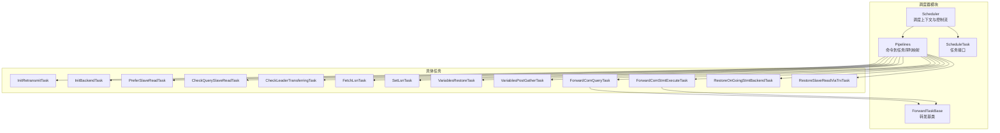
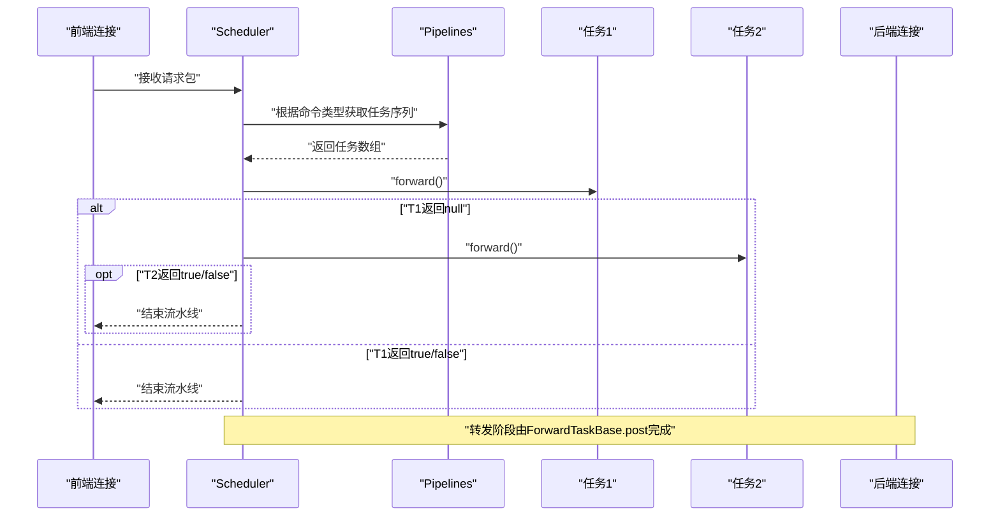
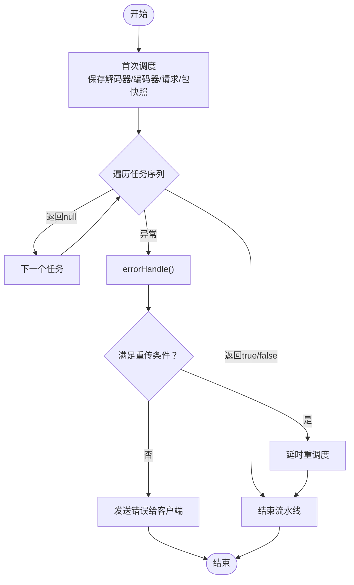
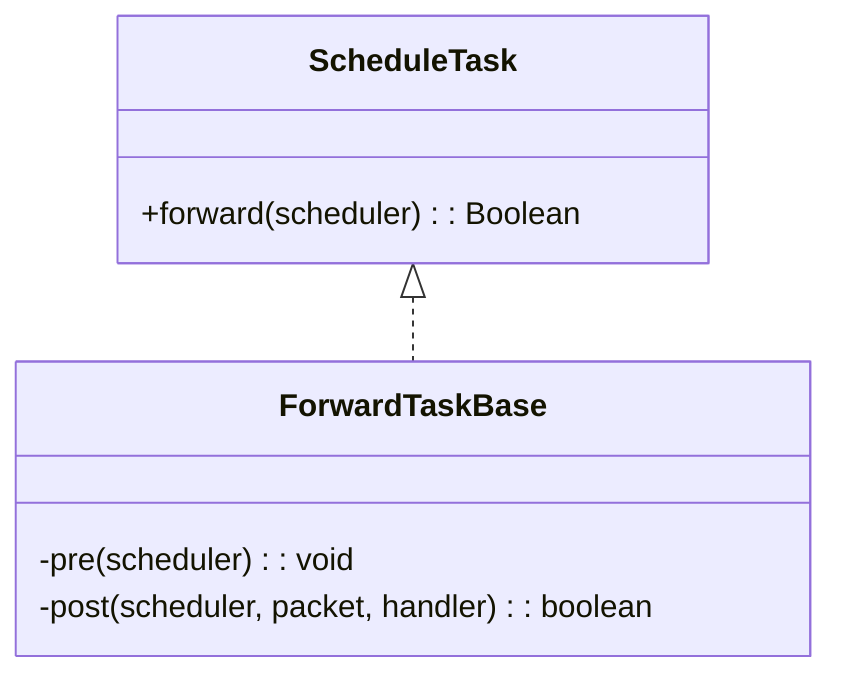
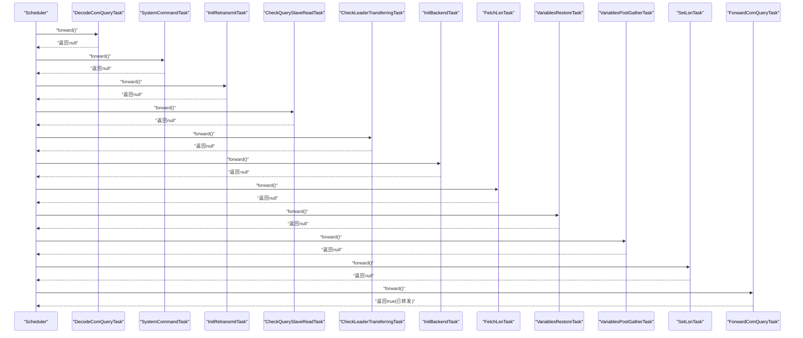
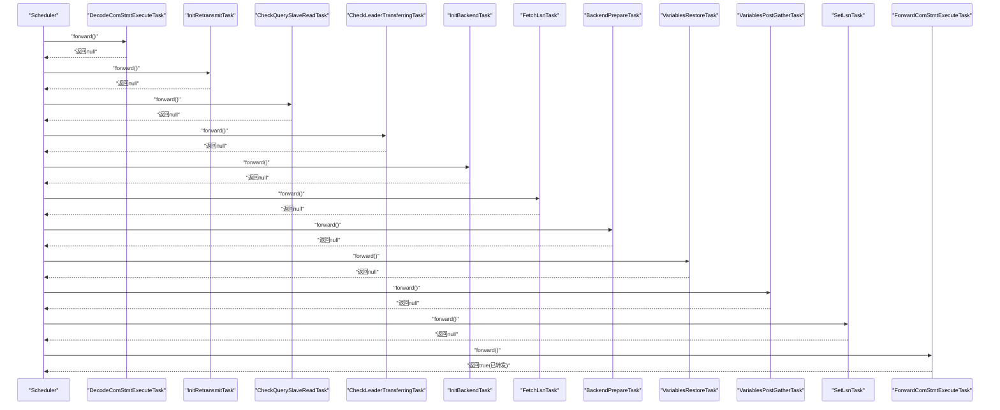
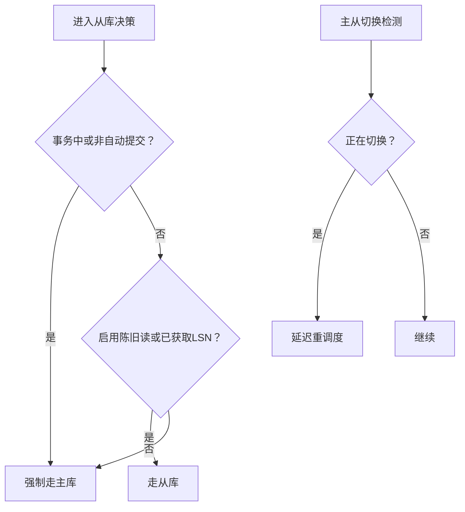
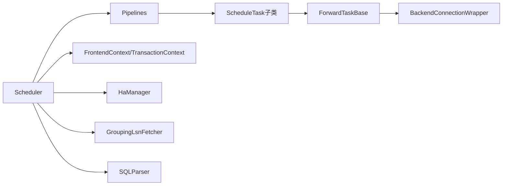

# 调度器模块

<cite>
**本文引用的文件**
- [Scheduler.java](file://proxy-core/src/main/java/com/alibaba/polardbx/proxy/scheduler/Scheduler.java)
- [ScheduleTask.java](file://proxy-core/src/main/java/com/alibaba/polardbx/proxy/scheduler/ScheduleTask.java)
- [Pipelines.java](file://proxy-core/src/main/java/com/alibaba/polardbx/proxy/scheduler/Pipelines.java)
- [ForwardTaskBase.java](file://proxy-core/src/main/java/com/alibaba/polardbx/proxy/scheduler/ForwardTaskBase.java)
- [InitRetransmitTask.java](file://proxy-core/src/main/java/com/alibaba/polardbx/proxy/scheduler/InitRetransmitTask.java)
- [InitBackendTask.java](file://proxy-core/src/main/java/com/alibaba/polardbx/proxy/scheduler/InitBackendTask.java)
- [PreferSlaveReadTask.java](file://proxy-core/src/main/java/com/alibaba/polardbx/proxy/scheduler/PreferSlaveReadTask.java)
- [CheckQuerySlaveReadTask.java](file://proxy-core/src/main/java/com/alibaba/polardbx/proxy/scheduler/CheckQuerySlaveReadTask.java)
- [CheckLeaderTransferringTask.java](file://proxy-core/src/main/java/com/alibaba/polardbx/proxy/scheduler/CheckLeaderTransferringTask.java)
- [FetchLsnTask.java](file://proxy-core/src/main/java/com/alibaba/polardbx/proxy/scheduler/FetchLsnTask.java)
- [SetLsnTask.java](file://proxy-core/src/main/java/com/alibaba/polardbx/proxy/scheduler/SetLsnTask.java)
- [VariablesRestoreTask.java](file://proxy-core/src/main/java/com/alibaba/polardbx/proxy/scheduler/VariablesRestoreTask.java)
- [VariablesPostGatherTask.java](file://proxy-core/src/main/java/com/alibaba/polardbx/proxy/scheduler/VariablesPostGatherTask.java)
- [ForwardComQueryTask.java](file://proxy-core/src/main/java/com/alibaba/polardbx/proxy/scheduler/ForwardComQueryTask.java)
- [ForwardComStmtExecuteTask.java](file://proxy-core/src/main/java/com/alibaba/polardbx/proxy/scheduler/ForwardComStmtExecuteTask.java)
- [RestoreOnGoingStmtBackendTask.java](file://proxy-core/src/main/java/com/alibaba/polardbx/proxy/scheduler/RestoreOnGoingStmtBackendTask.java)
- [RestoreSlaveReadViaTrxTask.java](file://proxy-core/src/main/java/com/alibaba/polardbx/proxy/scheduler/RestoreSlaveReadViaTrxTask.java)
</cite>

## 目录
1. [简介](#简介)
2. [项目结构](#项目结构)
3. [核心组件](#核心组件)
4. [架构总览](#架构总览)
5. [详细组件分析](#详细组件分析)
6. [依赖关系分析](#依赖关系分析)
7. [性能考量](#性能考量)
8. [故障排查指南](#故障排查指南)
9. [结论](#结论)
10. [附录](#附录)

## 简介
本文件系统性梳理PolarDB-X Proxy的调度器模块，围绕查询调度的核心算法与流水线机制展开，重点覆盖以下方面：
- 任务队列管理与流水线编排：通过Pipelines定义不同命令类型的调度流水线，每个流水线由若干可组合的ScheduleTask组成。
- 优先级与调度策略：通过任务顺序与条件判断实现“读偏好”“主从切换感知”“LSN一致性”等策略。
- 负载均衡与连接选择：在事务上下文中按读写需求选择后端连接（主/从），并在不可用时回退至主库。
- 任务生命周期与错误重传：Scheduler封装请求上下文、计时统计、重传窗口与错误处理，确保幂等与可恢复。
- 流水线处理机制：从接收、解析、路由到执行的完整链路，以及变量同步、LSN设置、主从切换等待等关键步骤。
- 调度性能监控与任务跟踪：通过时间片累加与日志记录实现端到端耗时观测。
- 异常处理与故障转移：包含主从切换等待、LSN获取失败快速回退、准备语句执行参数重绑定等。

## 项目结构
调度器模块位于proxy-core工程中，采用“接口+流水线+具体任务”的分层设计：
- 接口层：ScheduleTask定义统一的任务契约。
- 编排层：Pipelines按命令类型组织任务序列。
- 执行层：各具体任务实现调度逻辑，如初始化重传、选择后端、读偏好决策、LSN获取与设置、变量恢复与收集、转发等。
- 基类层：ForwardTaskBase封装转发前校验与转发后的回调与资源释放。

图表来源
- [Pipelines.java](file://proxy-core/src/main/java/com/alibaba/polardbx/proxy/scheduler/Pipelines.java#L21-L128)
- [Scheduler.java](file://proxy-core/src/main/java/com/alibaba/polardbx/proxy/scheduler/Scheduler.java#L46-L314)
- [ForwardTaskBase.java](file://proxy-core/src/main/java/com/alibaba/polardbx/proxy/scheduler/ForwardTaskBase.java#L35-L108)

章节来源
- [Pipelines.java](file://proxy-core/src/main/java/com/alibaba/polardbx/proxy/scheduler/Pipelines.java#L21-L128)
- [Scheduler.java](file://proxy-core/src/main/java/com/alibaba/polardbx/proxy/scheduler/Scheduler.java#L46-L314)

## 核心组件
- Scheduler：承载一次请求的调度上下文，包含前端连接、上下文、原始包、时间戳、任务序列、动态配置（如重传窗口、LSN、读偏好）、计时统计与错误处理入口。提供forward()遍历任务序列、errorHandle()统一错误与重传、switchThread()线程切换标记等。
- ScheduleTask：任务接口，forward()返回null表示继续下一个任务，返回true/false表示结束流水线。
- Pipelines：静态常量定义不同命令类型对应的调度任务序列，如COM_QUERY、COM_STMT_EXECUTE、COM_STMT_FETCH等。
- ForwardTaskBase：转发基类，封装pre/post通用逻辑，pre检查后端可用性，post负责转发、回调、事务引用与资源释放，并触发线程切换。

章节来源
- [ScheduleTask.java](file://proxy-core/src/main/java/com/alibaba/polardbx/proxy/scheduler/ScheduleTask.java#L21-L30)
- [Scheduler.java](file://proxy-core/src/main/java/com/alibaba/polardbx/proxy/scheduler/Scheduler.java#L46-L314)
- [Pipelines.java](file://proxy-core/src/main/java/com/alibaba/polardbx/proxy/scheduler/Pipelines.java#L21-L128)
- [ForwardTaskBase.java](file://proxy-core/src/main/java/com/alibaba/polardbx/proxy/scheduler/ForwardTaskBase.java#L35-L108)

## 架构总览
调度器以“流水线”为核心，每条命令对应一组有序任务。Scheduler在forward()中依次调用每个任务的forward()，遇到返回非空则终止流水线；若异常，则进入errorHandle()进行错误处理与可能的重传。

图表来源
- [Scheduler.java](file://proxy-core/src/main/java/com/alibaba/polardbx/proxy/scheduler/Scheduler.java#L300-L313)
- [Pipelines.java](file://proxy-core/src/main/java/com/alibaba/polardbx/proxy/scheduler/Pipelines.java#L34-L47)
- [ForwardTaskBase.java](file://proxy-core/src/main/java/com/alibaba/polardbx/proxy/scheduler/ForwardTaskBase.java#L46-L107)

## 详细组件分析

### Scheduler：调度上下文与控制流
- 关键职责
  - 维护请求生命周期：从接收、解析、路由、转发到响应的全链路状态。
  - 时间统计：对重传延迟、LSN获取、准备阶段、调度等待、等待Leader等阶段分别计时。
  - 动态配置：重传窗口、LSN、读偏好、预处理语句上下文、后端连接等。
  - 错误处理与重传：在允许范围内进行一次性重传，否则发送错误给客户端。
- 生命周期要点
  - 首次调度：保存解码器/编码器、请求对象、原始包快照。
  - 重调度：复制旧上下文，保留重传窗口与LSN决策，清空后端引用，累计延迟。
  - 线程切换：转发前后切换线程，避免阻塞当前线程。
- 重传策略
  - 在未进入事务、仍处于认证态且在重传窗口内，触发定时重传；重传成功则接管生命周期，失败则关闭前端连接。

图表来源
- [Scheduler.java](file://proxy-core/src/main/java/com/alibaba/polardbx/proxy/scheduler/Scheduler.java#L115-L232)
- [Scheduler.java](file://proxy-core/src/main/java/com/alibaba/polardbx/proxy/scheduler/Scheduler.java#L234-L297)

章节来源
- [Scheduler.java](file://proxy-core/src/main/java/com/alibaba/polardbx/proxy/scheduler/Scheduler.java#L46-L314)

### ScheduleTask与ForwardTaskBase：任务契约与转发基类
- ScheduleTask
  - forward(Scheduler)：返回null继续下一个任务；返回true/false结束流水线；抛出异常中断流水线。
- ForwardTaskBase
  - pre()：在转发前校验后端存在与随机模拟失败。
  - post()：转发请求包，注册结果处理器；若存在“后置操作”，则在回调中完成事务引用与资源释放；最后标记线程切换。

图表来源
- [ScheduleTask.java](file://proxy-core/src/main/java/com/alibaba/polardbx/proxy/scheduler/ScheduleTask.java#L21-L30)
- [ForwardTaskBase.java](file://proxy-core/src/main/java/com/alibaba/polardbx/proxy/scheduler/ForwardTaskBase.java#L35-L108)

章节来源
- [ScheduleTask.java](file://proxy-core/src/main/java/com/alibaba/polardbx/proxy/scheduler/ScheduleTask.java#L21-L30)
- [ForwardTaskBase.java](file://proxy-core/src/main/java/com/alibaba/polardbx/proxy/scheduler/ForwardTaskBase.java#L35-L108)

### Pipelines：命令到任务序列映射
- 定义了多种命令类型的流水线，如COM_QUERY、COM_STMT_EXECUTE、COM_STMT_FETCH、COM_INIT_DB、COM_FIELD_LIST、COM_STATISTICS、OK_ERR_MASTER/STALE_SLAVE等。
- 每个流水线由若干ScheduleTask组成，体现不同的调度策略与安全约束（如只读、主从切换等待、LSN设置、变量同步等）。

章节来源
- [Pipelines.java](file://proxy-core/src/main/java/com/alibaba/polardbx/proxy/scheduler/Pipelines.java#L21-L128)

### 任务序列示例与策略

#### COM_QUERY流水线
- 任务序列：解码 -> 系统命令处理 -> 初始化重传 -> 读偏好决策（基于SQL解析） -> 主从切换检测 -> 获取后端连接 -> LSN获取 -> 变量恢复 -> 变量收集（后置） -> 设置LSN -> 转发。
- 关键点
  - 读偏好：在非事务或自动提交场景下，通过SQL解析判断是否走从库。
  - LSN：仅当启用“陈旧读”或已获取LSN时才走从库；否则强制走主库并触发错误处理回退。
  - 变量同步：在转发前恢复用户/系统变量，转发后收集变更值用于后续一致性读。

图表来源
- [Pipelines.java](file://proxy-core/src/main/java/com/alibaba/polardbx/proxy/scheduler/Pipelines.java#L34-L47)
- [ForwardComQueryTask.java](file://proxy-core/src/main/java/com/alibaba/polardbx/proxy/scheduler/ForwardComQueryTask.java#L34-L53)

章节来源
- [Pipelines.java](file://proxy-core/src/main/java/com/alibaba/polardbx/proxy/scheduler/Pipelines.java#L34-L47)
- [ForwardComQueryTask.java](file://proxy-core/src/main/java/com/alibaba/polardbx/proxy/scheduler/ForwardComQueryTask.java#L34-L53)

#### COM_STMT_EXECUTE流水线
- 任务序列：解码 -> 初始化重传 -> 读偏好决策（基于SQL解析） -> 主从切换检测 -> 获取后端连接 -> LSN获取 -> 后端准备 -> 变量恢复 -> 变量收集（后置） -> 设置LSN -> 转发。
- 特殊处理：长数据参数推送、参数重绑定（新参数标志位或重新编码请求包）。

图表来源
- [Pipelines.java](file://proxy-core/src/main/java/com/alibaba/polardbx/proxy/scheduler/Pipelines.java#L96-L109)
- [ForwardComStmtExecuteTask.java](file://proxy-core/src/main/java/com/alibaba/polardbx/proxy/scheduler/ForwardComStmtExecuteTask.java#L36-L96)

章节来源
- [Pipelines.java](file://proxy-core/src/main/java/com/alibaba/polardbx/proxy/scheduler/Pipelines.java#L96-L109)
- [ForwardComStmtExecuteTask.java](file://proxy-core/src/main/java/com/alibaba/polardbx/proxy/scheduler/ForwardComStmtExecuteTask.java#L36-L96)

#### COM_STMT_FETCH流水线
- 任务序列：解码 -> 从事务恢复读偏好 -> 从事务恢复正在进行的PS后端 -> 直接转发。
- 适用场景：游标FETCH在事务内跨请求保持同一后端与语句ID。

章节来源
- [Pipelines.java](file://proxy-core/src/main/java/com/alibaba/polardbx/proxy/scheduler/Pipelines.java#L111-L117)
- [RestoreOnGoingStmtBackendTask.java](file://proxy-core/src/main/java/com/alibaba/polardbx/proxy/scheduler/RestoreOnGoingStmtBackendTask.java#L34-L67)
- [RestoreSlaveReadViaTrxTask.java](file://proxy-core/src/main/java/com/alibaba/polardbx/proxy/scheduler/RestoreSlaveReadViaTrxTask.java#L25-L35)

### 任务详解

#### 读偏好与主从策略
- PreferSlaveReadTask：在非事务或自动提交场景默认走从库；否则走主库。
- CheckQuerySlaveReadTask：基于SQL解析判断是否允许从库读取，结合事务状态与自动提交决定最终走向。
- CheckLeaderTransferringTask：若当前非从库且无事务且正在发生Leader切换，将延迟重调度，直至切换完成。
- FetchLsnTask：在满足条件时异步获取LSN，若失败则快速回退至主库并触发错误处理。
- SetLsnTask：在从库上设置read_lsn，若失败则抛错并回退主库。

图表来源
- [PreferSlaveReadTask.java](file://proxy-core/src/main/java/com/alibaba/polardbx/proxy/scheduler/PreferSlaveReadTask.java#L25-L36)
- [CheckQuerySlaveReadTask.java](file://proxy-core/src/main/java/com/alibaba/polardbx/proxy/scheduler/CheckQuerySlaveReadTask.java#L60-L73)
- [CheckLeaderTransferringTask.java](file://proxy-core/src/main/java/com/alibaba/polardbx/proxy/scheduler/CheckLeaderTransferringTask.java#L32-L81)
- [FetchLsnTask.java](file://proxy-core/src/main/java/com/alibaba/polardbx/proxy/scheduler/FetchLsnTask.java#L74-L95)
- [SetLsnTask.java](file://proxy-core/src/main/java/com/alibaba/polardbx/proxy/scheduler/SetLsnTask.java#L34-L73)

章节来源
- [PreferSlaveReadTask.java](file://proxy-core/src/main/java/com/alibaba/polardbx/proxy/scheduler/PreferSlaveReadTask.java#L25-L36)
- [CheckQuerySlaveReadTask.java](file://proxy-core/src/main/java/com/alibaba/polardbx/proxy/scheduler/CheckQuerySlaveReadTask.java#L60-L73)
- [CheckLeaderTransferringTask.java](file://proxy-core/src/main/java/com/alibaba/polardbx/proxy/scheduler/CheckLeaderTransferringTask.java#L32-L81)
- [FetchLsnTask.java](file://proxy-core/src/main/java/com/alibaba/polardbx/proxy/scheduler/FetchLsnTask.java#L34-L95)
- [SetLsnTask.java](file://proxy-core/src/main/java/com/alibaba/polardbx/proxy/scheduler/SetLsnTask.java#L34-L73)

#### 连接选择与事务上下文
- InitBackendTask：在需要时引用事务上下文，按读偏好选择后端连接；若从库不可用则回退至主库。
- RestoreOnGoingStmtBackendTask：在COM_STMT_FETCH场景下，从活跃PS映射中恢复后端与语句ID，保证跨请求一致性。

章节来源
- [InitBackendTask.java](file://proxy-core/src/main/java/com/alibaba/polardbx/proxy/scheduler/InitBackendTask.java#L28-L48)
- [RestoreOnGoingStmtBackendTask.java](file://proxy-core/src/main/java/com/alibaba/polardbx/proxy/scheduler/RestoreOnGoingStmtBackendTask.java#L34-L67)

#### 变量同步与一致性读
- VariablesRestoreTask：在转发前将用户变量与系统变量恢复到后端一致状态。
- VariablesPostGatherTask：解析SET语句，收集可能变化的变量，生成后置查询以获取最新值，配合PostGatherCallback在回调中更新上下文。

章节来源
- [VariablesRestoreTask.java](file://proxy-core/src/main/java/com/alibaba/polardbx/proxy/scheduler/VariablesRestoreTask.java#L36-L126)
- [VariablesPostGatherTask.java](file://proxy-core/src/main/java/com/alibaba/polardbx/proxy/scheduler/VariablesPostGatherTask.java#L50-L166)

#### 转发与结果处理
- ForwardComQueryTask：构建QueryResultHandler与QueryResultCallback，调用ForwardTaskBase.post完成转发。
- ForwardComStmtExecuteTask：处理长数据参数推送、参数重绑定（必要时重新编码请求包），再调用ForwardTaskBase.post。

章节来源
- [ForwardComQueryTask.java](file://proxy-core/src/main/java/com/alibaba/polardbx/proxy/scheduler/ForwardComQueryTask.java#L34-L53)
- [ForwardComStmtExecuteTask.java](file://proxy-core/src/main/java/com/alibaba/polardbx/proxy/scheduler/ForwardComStmtExecuteTask.java#L36-L96)

## 依赖关系分析
- 耦合与内聚
  - Scheduler与Pipelines强耦合：前者按后者提供的任务序列执行，形成稳定的控制流。
  - ForwardTaskBase与具体转发任务高内聚：复用pre/post模板方法，降低重复代码。
  - 任务间弱耦合：通过返回值与异常控制流转，便于扩展与替换。
- 外部依赖
  - 事务上下文：FrontendContext与FrontendTransactionContext贯穿连接选择与变量同步。
  - HA与LSN：HaManager与GroupingLsnFetcher参与主从切换与一致性读控制。
  - 解析器：SQLParser用于读偏好与变量收集的语义分析。

图表来源
- [Scheduler.java](file://proxy-core/src/main/java/com/alibaba/polardbx/proxy/scheduler/Scheduler.java#L46-L314)
- [Pipelines.java](file://proxy-core/src/main/java/com/alibaba/polardbx/proxy/scheduler/Pipelines.java#L21-L128)
- [ForwardTaskBase.java](file://proxy-core/src/main/java/com/alibaba/polardbx/proxy/scheduler/ForwardTaskBase.java#L35-L108)

章节来源
- [Scheduler.java](file://proxy-core/src/main/java/com/alibaba/polardbx/proxy/scheduler/Scheduler.java#L46-L314)
- [Pipelines.java](file://proxy-core/src/main/java/com/alibaba/polardbx/proxy/scheduler/Pipelines.java#L21-L128)

## 性能考量
- 计时统计
  - 重传延迟、LSN获取、准备阶段、调度等待、等待Leader等阶段均通过累加纳秒数记录，便于端到端耗时分析。
- 异步与线程切换
  - LSN获取与主从切换等待通过线程池提交，避免阻塞当前Reactor线程。
- 日志与采样
  - 对SQL长度进行截断记录，避免日志膨胀；对关键路径（如转发、LSN设置）输出调试信息。
- 重传窗口
  - 基于配置的超时与重试间隔，减少无效重试；仅在满足条件时启用重传。

章节来源
- [Scheduler.java](file://proxy-core/src/main/java/com/alibaba/polardbx/proxy/scheduler/Scheduler.java#L161-L183)
- [FetchLsnTask.java](file://proxy-core/src/main/java/com/alibaba/polardbx/proxy/scheduler/FetchLsnTask.java#L34-L71)
- [CheckLeaderTransferringTask.java](file://proxy-core/src/main/java/com/alibaba/polardbx/proxy/scheduler/CheckLeaderTransferringTask.java#L40-L77)

## 故障排查指南
- 重传与错误处理
  - errorHandle()在满足条件时进行一次性重传；否则发送错误给客户端。注意区分“已接管生命周期”与“需外部释放包”的场景。
- LSN获取失败
  - 若LSN获取失败或模拟超时，将强制走主库并触发错误处理回退，确保一致性。
- 主从切换
  - 正在切换时延迟重调度，避免在不一致状态下转发请求。
- 事务与连接
  - 若后端为空或事务上下文缺失，转发前会抛出异常；需检查InitBackendTask与事务引用逻辑。
- 准备语句
  - 参数重绑定失败或长数据推送异常需关注ForwardComStmtExecuteTask中的异常分支与后端关闭逻辑。

章节来源
- [Scheduler.java](file://proxy-core/src/main/java/com/alibaba/polardbx/proxy/scheduler/Scheduler.java#L234-L297)
- [FetchLsnTask.java](file://proxy-core/src/main/java/com/alibaba/polardbx/proxy/scheduler/FetchLsnTask.java#L48-L69)
- [CheckLeaderTransferringTask.java](file://proxy-core/src/main/java/com/alibaba/polardbx/proxy/scheduler/CheckLeaderTransferringTask.java#L40-L77)
- [ForwardComStmtExecuteTask.java](file://proxy-core/src/main/java/com/alibaba/polardbx/proxy/scheduler/ForwardComStmtExecuteTask.java#L58-L63)

## 结论
调度器模块通过“接口+流水线+任务”的清晰分层，实现了高内聚、低耦合的查询调度体系。其核心特性包括：
- 明确的流水线编排与任务契约，支持扩展与替换；
- 基于事务、SQL解析与HA状态的多维读偏好与主从切换策略；
- 完整的错误处理与重传机制，保障可靠性；
- 丰富的计时统计与日志采样，便于性能优化与问题定位。

## 附录
- 命令类型与典型流水线
  - COM_QUERY：解码 -> 系统命令 -> 初始化重传 -> 读偏好 -> 主从切换 -> 后端 -> LSN -> 变量恢复/收集 -> 设置LSN -> 转发。
  - COM_STMT_EXECUTE：解码 -> 初始化重传 -> 读偏好 -> 主从切换 -> 后端 -> LSN -> 后端准备 -> 变量恢复/收集 -> 设置LSN -> 转发（含长数据与参数重绑定）。
  - COM_STMT_FETCH：解码 -> 从事务恢复读偏好 -> 恢复PS后端 -> 转发。
- 关键配置与开关
  - 查询重传超时与快速重试延迟；
  - 陈旧读开关；
  - 字符集与SQL模式影响解析与变量收集。