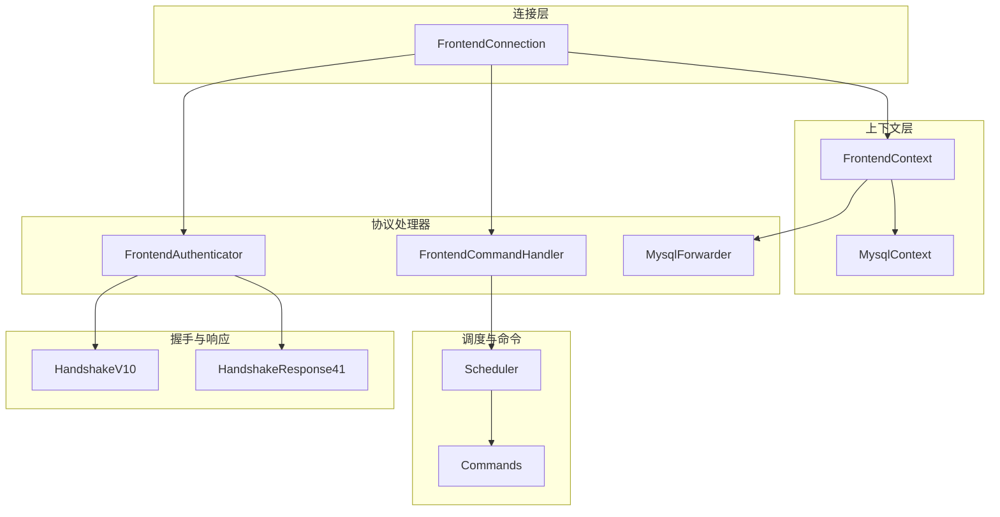
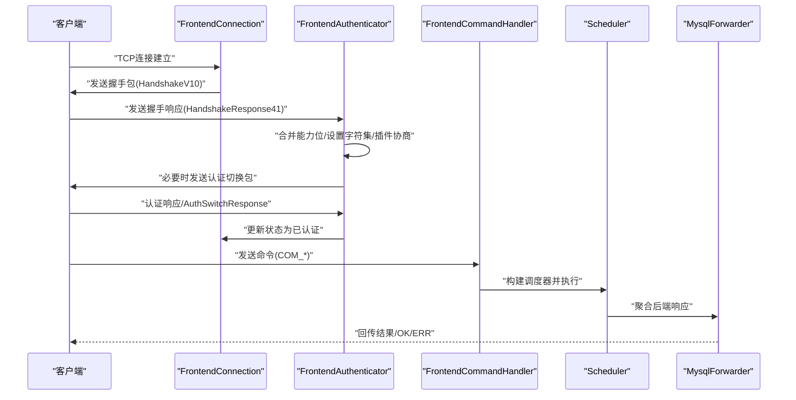
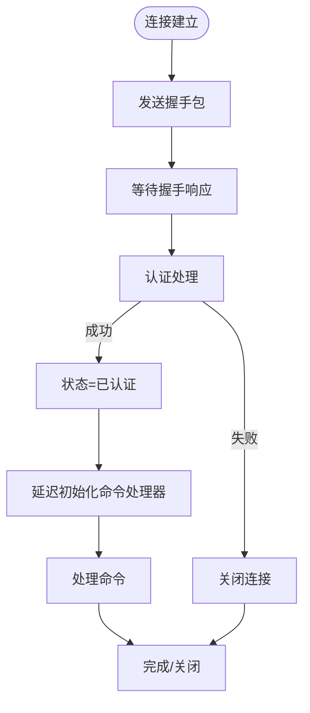
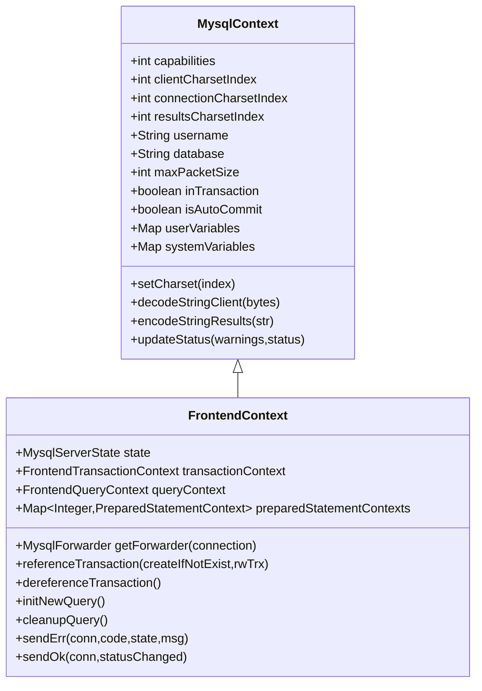
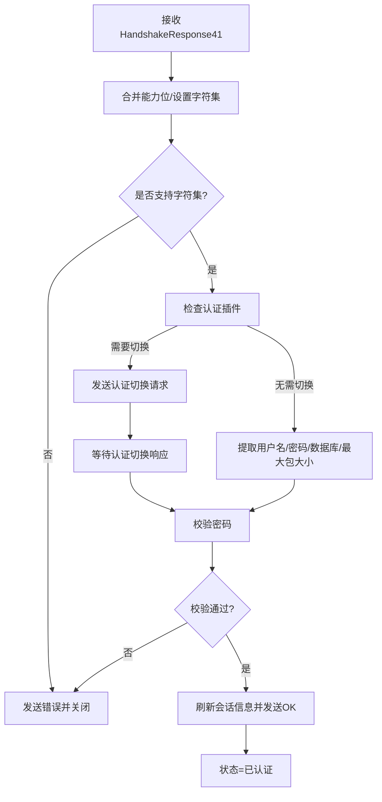
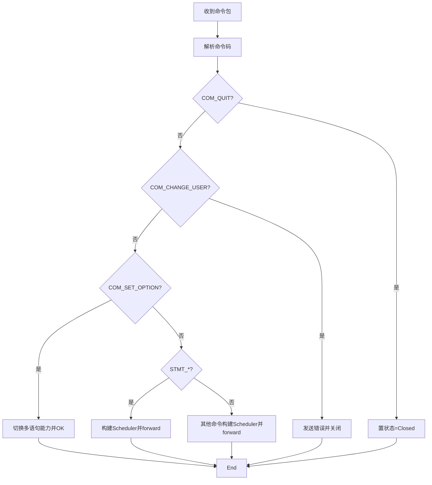
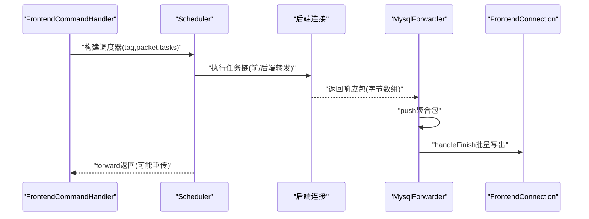
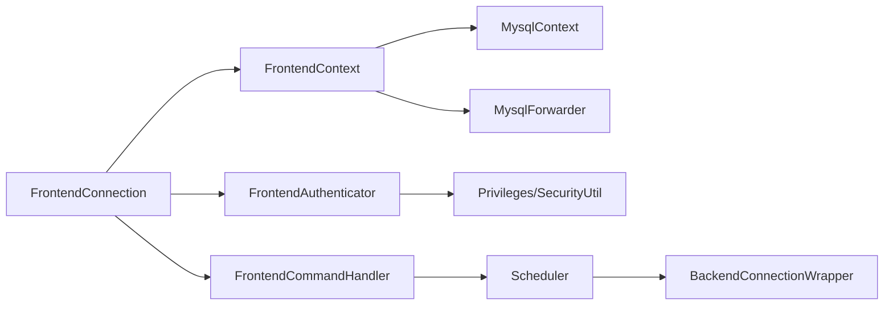

# 前端连接管理

<cite>
**本文引用的文件列表**
- [FrontendConnection.java](file://proxy-core/src/main/java/com/alibaba/polardbx/proxy/connection/FrontendConnection.java)
- [FrontendContext.java](file://proxy-core/src/main/java/com/alibaba/polardbx/proxy/context/FrontendContext.java)
- [FrontendAuthenticator.java](file://proxy-core/src/main/java/com/alibaba/polardbx/proxy/protocol/handler/FrontendAuthenticator.java)
- [FrontendCommandHandler.java](file://proxy-core/src/main/java/com/alibaba/polardbx/proxy/protocol/handler/FrontendCommandHandler.java)
- [MysqlContext.java](file://proxy-core/src/main/java/com/alibaba/polardbx/proxy/context/MysqlContext.java)
- [MysqlServerState.java](file://proxy-core/src/main/java/com/alibaba/polardbx/proxy/protocol/common/MysqlServerState.java)
- [HandshakeV10.java](file://proxy-core/src/main/java/com/alibaba/polardbx/proxy/protocol/connection/HandshakeV10.java)
- [HandshakeResponse41.java](file://proxy-core/src/main/java/com/alibaba/polardbx/proxy/protocol/connection/HandshakeResponse41.java)
- [Commands.java](file://proxy-core/src/main/java/com/alibaba/polardbx/proxy/protocol/command/Commands.java)
- [Scheduler.java](file://proxy-core/src/main/java/com/alibaba/polardbx/proxy/scheduler/Scheduler.java)
- [MysqlForwarder.java](file://proxy-core/src/main/java/com/alibaba/polardbx/proxy/protocol/handler/MysqlForwarder.java)
</cite>

## 目录
1. [引言](#引言)
2. [项目结构](#项目结构)
3. [核心组件](#核心组件)
4. [架构总览](#架构总览)
5. [详细组件分析](#详细组件分析)
6. [依赖关系分析](#依赖关系分析)
7. [性能考量](#性能考量)
8. [故障排查指南](#故障排查指南)
9. [结论](#结论)
10. [附录](#附录)

## 引言
本文件面向 PolarDB-X Proxy 的前端连接管理，系统性阐述 FrontendConnection 类的设计与实现，覆盖握手认证流程、连接状态管理、上下文处理机制；详解 FrontendContext 的作用与生命周期管理（会话信息、状态标志、字符集设置等）；剖析 FrontendAuthenticator 的认证实现（握手包发送、认证插件选择、密码验证流程）；说明 FrontendCommandHandler 的命令处理机制（SQL 解析、命令分发、结果集返回）。最后给出连接建立、认证、命令处理的完整流程示例，并总结错误处理与异常恢复机制。

## 项目结构
前端连接管理位于 proxy-core 模块中，关键代码组织如下：
- 连接层：FrontendConnection 继承自 MysqlConnection，负责网络读写、握手发送、认证与命令阶段的切换与资源回收。
- 上下文层：FrontendContext 继承自 MysqlContext，承载会话状态、事务引用计数、预处理语句上下文、字符集与变量等。
- 协议处理器：FrontendAuthenticator 负责握手与认证；FrontendCommandHandler 负责命令分发与调度。
- 调度与转发：Scheduler 将命令转换为一系列 ScheduleTask 并执行；MysqlForwarder 负责后端响应的聚合与回传。

图表来源
- [FrontendConnection.java](file://proxy-core/src/main/java/com/alibaba/polardbx/proxy/connection/FrontendConnection.java#L47-L86)
- [FrontendContext.java](file://proxy-core/src/main/java/com/alibaba/polardbx/proxy/context/FrontendContext.java#L45-L54)
- [MysqlContext.java](file://proxy-core/src/main/java/com/alibaba/polardbx/proxy/context/MysqlContext.java#L49-L106)
- [FrontendAuthenticator.java](file://proxy-core/src/main/java/com/alibaba/polardbx/proxy/protocol/handler/FrontendAuthenticator.java#L45-L65)
- [FrontendCommandHandler.java](file://proxy-core/src/main/java/com/alibaba/polardbx/proxy/protocol/handler/FrontendCommandHandler.java#L39-L49)
- [MysqlForwarder.java](file://proxy-core/src/main/java/com/alibaba/polardbx/proxy/protocol/handler/MysqlForwarder.java#L34-L47)
- [Scheduler.java](file://proxy-core/src/main/java/com/alibaba/polardbx/proxy/scheduler/Scheduler.java#L46-L149)
- [Commands.java](file://proxy-core/src/main/java/com/alibaba/polardbx/proxy/protocol/command/Commands.java#L21-L117)
- [HandshakeV10.java](file://proxy-core/src/main/java/com/alibaba/polardbx/proxy/protocol/connection/HandshakeV10.java#L32-L66)
- [HandshakeResponse41.java](file://proxy-core/src/main/java/com/alibaba/polardbx/proxy/protocol/connection/HandshakeResponse41.java#L36-L75)

章节来源
- [FrontendConnection.java](file://proxy-core/src/main/java/com/alibaba/polardbx/proxy/connection/FrontendConnection.java#L47-L86)
- [FrontendContext.java](file://proxy-core/src/main/java/com/alibaba/polardbx/proxy/context/FrontendContext.java#L45-L54)
- [MysqlContext.java](file://proxy-core/src/main/java/com/alibaba/polardbx/proxy/context/MysqlContext.java#L49-L106)

## 核心组件
- FrontendConnection：前端连接主控，负责握手发送、认证阶段与命令阶段的切换、资源回收与全局集合管理。
- FrontendContext：会话上下文，维护状态机、字符集、事务与查询上下文、预处理语句映射、转发器等。
- FrontendAuthenticator：认证处理器，负责握手包发送、认证插件协商、密码校验与最终确认。
- FrontendCommandHandler：命令处理器，根据命令类型分派到对应调度管线，构建 Scheduler 执行。
- MysqlContext：通用上下文基类，提供能力位、字符集、变量、状态同步与 SQL 影响记录等。
- Scheduler：调度器，串联多个 ScheduleTask 完成请求的前后端转发与重传控制。
- MysqlForwarder：后端响应聚合转发器，负责批量回传与资源释放。

章节来源
- [FrontendConnection.java](file://proxy-core/src/main/java/com/alibaba/polardbx/proxy/connection/FrontendConnection.java#L47-L86)
- [FrontendContext.java](file://proxy-core/src/main/java/com/alibaba/polardbx/proxy/context/FrontendContext.java#L45-L54)
- [FrontendAuthenticator.java](file://proxy-core/src/main/java/com/alibaba/polardbx/proxy/protocol/handler/FrontendAuthenticator.java#L45-L65)
- [FrontendCommandHandler.java](file://proxy-core/src/main/java/com/alibaba/polardbx/proxy/protocol/handler/FrontendCommandHandler.java#L39-L49)
- [MysqlContext.java](file://proxy-core/src/main/java/com/alibaba/polardbx/proxy/context/MysqlContext.java#L49-L106)
- [Scheduler.java](file://proxy-core/src/main/java/com/alibaba/polardbx/proxy/scheduler/Scheduler.java#L46-L149)
- [MysqlForwarder.java](file://proxy-core/src/main/java/com/alibaba/polardbx/proxy/protocol/handler/MysqlForwarder.java#L34-L47)

## 架构总览
前端连接管理采用“握手-认证-命令”三阶段流水线式处理：
- 握手阶段：FrontendConnection 发送 HandshakeV10，初始化 FrontendContext 能力位与字符集，进入 MysqlServerState.Greeting。
- 认证阶段：FrontendAuthenticator 接收 HandshakeResponse41，合并客户端能力位，协商认证插件，进行密码校验，成功后进入 MysqlServerState.Authenticated。
- 命令阶段：FrontendCommandHandler 根据命令码分派到相应调度管线，构建 Scheduler 执行，完成后通过 MysqlForwarder 或直接发送 OK/ERR 包。

图表来源
- [FrontendConnection.java](file://proxy-core/src/main/java/com/alibaba/polardbx/proxy/connection/FrontendConnection.java#L88-L111)
- [FrontendAuthenticator.java](file://proxy-core/src/main/java/com/alibaba/polardbx/proxy/protocol/handler/FrontendAuthenticator.java#L142-L201)
- [FrontendCommandHandler.java](file://proxy-core/src/main/java/com/alibaba/polardbx/proxy/protocol/handler/FrontendCommandHandler.java#L73-L170)
- [Scheduler.java](file://proxy-core/src/main/java/com/alibaba/polardbx/proxy/scheduler/Scheduler.java#L300-L313)
- [MysqlForwarder.java](file://proxy-core/src/main/java/com/alibaba/polardbx/proxy/protocol/handler/MysqlForwarder.java#L68-L88)

## 详细组件分析

### FrontendConnection 设计与握手认证流程
- 初始化与握手
  - 构造函数创建 FrontendContext，设置默认字符集与随机种子，初始化 FrontendAuthenticator。
  - onEstablished 阶段构造 HandshakeV10，填充版本、连接 ID、认证数据、能力位、字符集、状态标志与认证插件名，使用 Encoder 编码并 flush。
  - 设置上下文状态为 MysqlServerState.Greeting。
- 认证与命令阶段切换
  - handleAndTakePacket 优先交给 FrontendAuthenticator 处理；当状态变为 Authenticated 后，调用 handleFinish 并释放认证器。
  - 若认证器未就绪，则延迟初始化 FrontendCommandHandler，避免并发竞争。
- 资源回收与关闭
  - close 使用原子布尔标记 resourceClosed，确保只关闭一次；异步关闭认证器、命令处理器与上下文，防止死锁。
  - 从全局集合移除连接实例。

图表来源
- [FrontendConnection.java](file://proxy-core/src/main/java/com/alibaba/polardbx/proxy/connection/FrontendConnection.java#L88-L143)
- [HandshakeV10.java](file://proxy-core/src/main/java/com/alibaba/polardbx/proxy/protocol/connection/HandshakeV10.java#L124-L173)

章节来源
- [FrontendConnection.java](file://proxy-core/src/main/java/com/alibaba/polardbx/proxy/connection/FrontendConnection.java#L61-L111)
- [HandshakeV10.java](file://proxy-core/src/main/java/com/alibaba/polardbx/proxy/protocol/connection/HandshakeV10.java#L32-L173)

### FrontendContext 生命周期与会话管理
- 状态与能力位
  - 维护 MysqlServerState 状态机，支持 Init/Greeting/AuthSwitched/Authenticated/Closed。
  - 提供能力位合并、添加、移除与检查方法，用于与客户端能力位对齐。
- 字符集与编码
  - setCharset 支持从握手响应设置客户端/连接/结果字符集索引与 Java Charset，若不支持则拒绝。
  - decode/encodeStringClient/Results 提供按字符集的编解码。
- 事务与查询上下文
  - 事务引用计数 referenceTransaction/dereferenceTransaction/tryFreeTransaction，支持只在无引用且可释放时关闭。
  - initNewQuery/cleanupQuery 管理单次查询上下文生命周期。
- 预处理语句
  - statementIdAllocator 与 preparedStatementContexts 映射，支持准备语句的创建、执行、获取、重置与清理。
- 错误与 OK 快路径
  - sendErr/sendOk 提供统一错误与 OK 包发送，sendOk 在特定序列号与能力位组合下走快速路径。
- 转发器
  - getForwarder 懒加载 MysqlForwarder，用于聚合后端响应并回传。

图表来源
- [MysqlContext.java](file://proxy-core/src/main/java/com/alibaba/polardbx/proxy/context/MysqlContext.java#L49-L266)
- [FrontendContext.java](file://proxy-core/src/main/java/com/alibaba/polardbx/proxy/context/FrontendContext.java#L45-L308)

章节来源
- [MysqlContext.java](file://proxy-core/src/main/java/com/alibaba/polardbx/proxy/context/MysqlContext.java#L101-L151)
- [FrontendContext.java](file://proxy-core/src/main/java/com/alibaba/polardbx/proxy/context/FrontendContext.java#L56-L124)

### FrontendAuthenticator 认证实现
- 握手包发送
  - FrontendConnection 在 onEstablished 中构造 HandshakeV10 并发送，包含版本、连接 ID、认证数据、能力位、字符集、状态标志与认证插件名。
- 握手响应解析与能力位合并
  - FrontendAuthenticator 接收 HandshakeResponse41，decode 后合并客户端能力位，设置字符集；若不支持字符集则返回错误并关闭。
- 认证插件选择
  - 若客户端指定插件且非本地插件，发送 AuthSwitchRequest 切换到 mysql_native_password。
- 密码验证
  - 从特权表获取用户认证信息，使用 SecurityUtil 校验密码；支持空密码场景；通过后刷新用户名、数据库、最大包大小并发送 OK。
- 最终状态
  - 成功则将上下文状态置为 Authenticated，失败置为 Closed。

图表来源
- [FrontendAuthenticator.java](file://proxy-core/src/main/java/com/alibaba/polardbx/proxy/protocol/handler/FrontendAuthenticator.java#L142-L201)
- [HandshakeResponse41.java](file://proxy-core/src/main/java/com/alibaba/polardbx/proxy/protocol/connection/HandshakeResponse41.java#L98-L157)
- [HandshakeV10.java](file://proxy-core/src/main/java/com/alibaba/polardbx/proxy/protocol/connection/HandshakeV10.java#L124-L173)

章节来源
- [FrontendAuthenticator.java](file://proxy-core/src/main/java/com/alibaba/polardbx/proxy/protocol/handler/FrontendAuthenticator.java#L67-L135)
- [FrontendAuthenticator.java](file://proxy-core/src/main/java/com/alibaba/polardbx/proxy/protocol/handler/FrontendAuthenticator.java#L142-L201)

### FrontendCommandHandler 命令处理机制
- 命令分发
  - 根据首字节命令码分派到不同调度管线（如 COM_INIT_DB、COM_QUERY、COM_FIELD_LIST、COM_STATISTICS、COM_PING、COM_RESET_CONNECTION、COM_SET_OPTION、COM_STMT_* 等）。
- 特殊命令处理
  - COM_QUIT：直接将状态置为 Closed。
  - COM_CHANGE_USER：拒绝并关闭连接。
  - COM_SET_OPTION：支持开启/关闭多语句模式。
  - COM_STMT_CLOSE：从预处理映射中移除语句 ID。
- 调度执行
  - 为每个命令构建 Scheduler，传入对应任务数组，调用 forward 执行。
- 返回值
  - 多数命令返回 false 表示不“占用”包（由后续处理或调度器完成），部分命令（如 COM_STMT_CLOSE）可能无响应。

图表来源
- [FrontendCommandHandler.java](file://proxy-core/src/main/java/com/alibaba/polardbx/proxy/protocol/handler/FrontendCommandHandler.java#L73-L170)
- [Commands.java](file://proxy-core/src/main/java/com/alibaba/polardbx/proxy/protocol/command/Commands.java#L21-L117)

章节来源
- [FrontendCommandHandler.java](file://proxy-core/src/main/java/com/alibaba/polardbx/proxy/protocol/handler/FrontendCommandHandler.java#L51-L170)

### Scheduler 与 MysqlForwarder 的协作
- Scheduler
  - 保存前端连接、上下文、命令标签、原始包、任务数组与时间统计；支持重传延迟累计与错误处理。
  - forward 顺序执行任务数组，遇到可终止结果即返回；异常时触发 errorHandle，尝试在允许条件下重传，否则发送错误包。
- MysqlForwarder
  - 懒加载于 FrontendContext，聚合后端响应包并通过 Encoder 写回前端；handleFinish 时批量写出并清理资源。
  - 提供 push 方法以收集后端返回的字节数组包并写入 Encoder。

图表来源
- [Scheduler.java](file://proxy-core/src/main/java/com/alibaba/polardbx/proxy/scheduler/Scheduler.java#L300-L313)
- [MysqlForwarder.java](file://proxy-core/src/main/java/com/alibaba/polardbx/proxy/protocol/handler/MysqlForwarder.java#L68-L88)

章节来源
- [Scheduler.java](file://proxy-core/src/main/java/com/alibaba/polardbx/proxy/scheduler/Scheduler.java#L234-L297)
- [MysqlForwarder.java](file://proxy-core/src/main/java/com/alibaba/polardbx/proxy/protocol/handler/MysqlForwarder.java#L49-L96)

## 依赖关系分析
- 组件耦合
  - FrontendConnection 依赖 FrontendContext、FrontendAuthenticator、FrontendCommandHandler 与 MysqlContext。
  - FrontendContext 依赖 MysqlForwarder、FrontendTransactionContext、FrontendQueryContext 与 FrontendContext。
  - FrontendAuthenticator 依赖 Privileges、SecurityUtil、MysqlContext 与 MysqlServerState。
  - FrontendCommandHandler 依赖 Scheduler、Pipelines、Commands。
  - Scheduler 依赖 ScheduleTask、FrontendConnection、FrontendContext、后端连接池包装器。
- 外部依赖
  - 字符集映射、随机数生成、缓冲池、线程池等工具类贯穿上下文与处理器。

图表来源
- [FrontendConnection.java](file://proxy-core/src/main/java/com/alibaba/polardbx/proxy/connection/FrontendConnection.java#L47-L86)
- [FrontendContext.java](file://proxy-core/src/main/java/com/alibaba/polardbx/proxy/context/FrontendContext.java#L148-L162)
- [FrontendAuthenticator.java](file://proxy-core/src/main/java/com/alibaba/polardbx/proxy/protocol/handler/FrontendAuthenticator.java#L67-L135)
- [FrontendCommandHandler.java](file://proxy-core/src/main/java/com/alibaba/polardbx/proxy/protocol/handler/FrontendCommandHandler.java#L168-L169)
- [Scheduler.java](file://proxy-core/src/main/java/com/alibaba/polardbx/proxy/scheduler/Scheduler.java#L151-L154)

章节来源
- [FrontendConnection.java](file://proxy-core/src/main/java/com/alibaba/polardbx/proxy/connection/FrontendConnection.java#L47-L86)
- [FrontendContext.java](file://proxy-core/src/main/java/com/alibaba/polardbx/proxy/context/FrontendContext.java#L148-L162)
- [FrontendAuthenticator.java](file://proxy-core/src/main/java/com/alibaba/polardbx/proxy/protocol/handler/FrontendAuthenticator.java#L67-L135)
- [FrontendCommandHandler.java](file://proxy-core/src/main/java/com/alibaba/polardbx/proxy/protocol/handler/FrontendCommandHandler.java#L168-L169)
- [Scheduler.java](file://proxy-core/src/main/java/com/alibaba/polardbx/proxy/scheduler/Scheduler.java#L151-L154)

## 性能考量
- 快速 OK 路径：FrontendContext.sendOk 在特定序列号与能力位组合下直接写入预定义字节序列，减少对象分配与编码开销。
- 懒加载与延迟初始化：FrontendCommandHandler 在首次使用时才创建，避免不必要的对象创建。
- 异步资源回收：FrontendConnection.close 使用线程池异步关闭认证器、命令处理器与上下文，降低阻塞风险。
- 字符集一致性：统一设置客户端/连接/结果字符集，避免多次转换带来的额外成本。
- 调度与重传：Scheduler 支持在限定时间内重试，减少瞬时错误导致的失败率。

## 故障排查指南
- 握手失败
  - 检查字符集是否被支持；若 setCharset 返回 false，将触发错误并关闭连接。
  - 核对能力位是否满足 CLIENT_PROTOCOL_41。
- 认证失败
  - 用户名为空、主机不在白名单、密码不正确或模式不匹配均会导致访问被拒绝。
  - 认证切换后需确保客户端正确响应 AuthSwitchResponse。
- 命令处理异常
  - Scheduler.errorHandle 会在异常时尝试重传（受配置与状态限制），否则发送错误包。
  - 对于 COM_STMT_CLOSE 等无响应命令，不要期望返回包。
- 连接关闭
  - FrontendConnection.close 保证幂等关闭，避免重复释放；若在 handleFinish 中检测到 Closed 状态，将主动关闭连接。

章节来源
- [FrontendAuthenticator.java](file://proxy-core/src/main/java/com/alibaba/polardbx/proxy/protocol/handler/FrontendAuthenticator.java#L167-L201)
- [FrontendCommandHandler.java](file://proxy-core/src/main/java/com/alibaba/polardbx/proxy/protocol/handler/FrontendCommandHandler.java#L120-L125)
- [Scheduler.java](file://proxy-core/src/main/java/com/alibaba/polardbx/proxy/scheduler/Scheduler.java#L234-L297)
- [FrontendConnection.java](file://proxy-core/src/main/java/com/alibaba/polardbx/proxy/connection/FrontendConnection.java#L162-L213)

## 结论
FrontendConnection 通过清晰的三阶段流水线实现了从握手到认证再到命令处理的完整流程；FrontendContext 作为会话中枢，统一管理状态、字符集、事务与预处理语句；FrontendAuthenticator 与 FrontendCommandHandler 分别承担认证与命令分发职责；Scheduler 与 MysqlForwarder 则保障了请求的可靠转发与响应聚合。整体设计在保证功能完备的同时，兼顾了性能与可维护性。

## 附录
- 关键流程示例（连接建立、认证、命令处理）
  - 连接建立：FrontendConnection 构造 -> onEstablished 发送 HandshakeV10 -> 等待 HandshakeResponse41。
  - 认证：FrontendAuthenticator 解析响应 -> 能力位合并/字符集设置 -> 可能的认证切换 -> 密码校验 -> 发送 OK 并进入已认证状态。
  - 命令处理：FrontendCommandHandler 根据命令码分派 -> 构建 Scheduler -> 执行任务链 -> 通过 MysqlForwarder 回传结果。
- 错误处理与异常恢复
  - 认证阶段：任何不满足条件将返回错误并关闭连接。
  - 命令阶段：Scheduler.errorHandle 在允许条件下进行重传，否则发送错误包；FrontendConnection.close 保证资源安全释放。